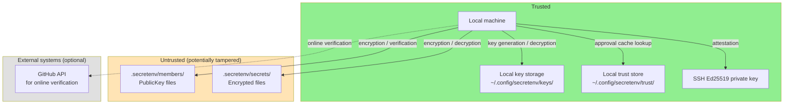
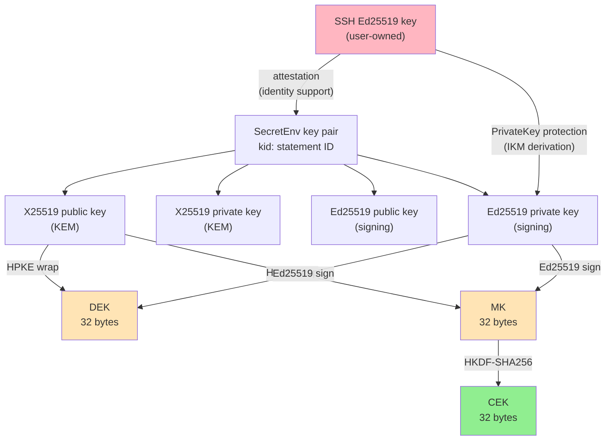
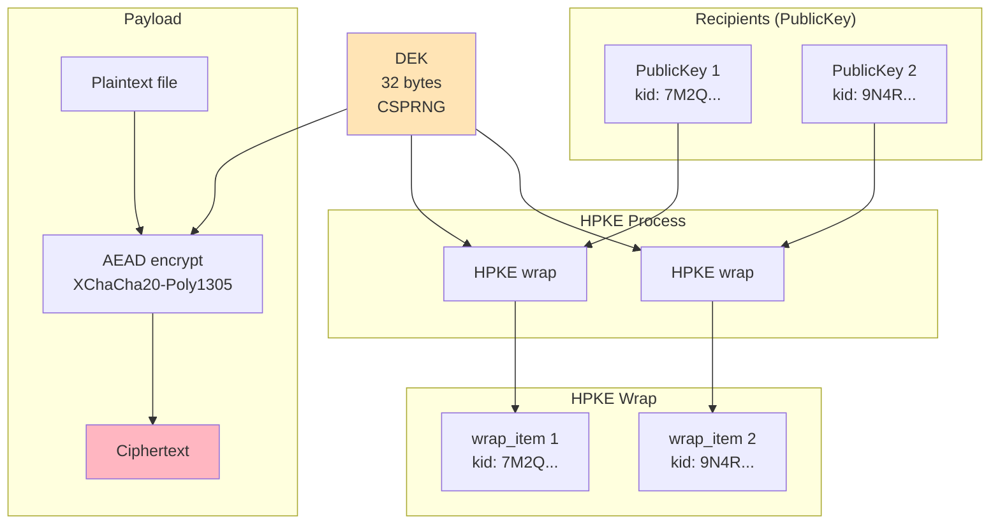
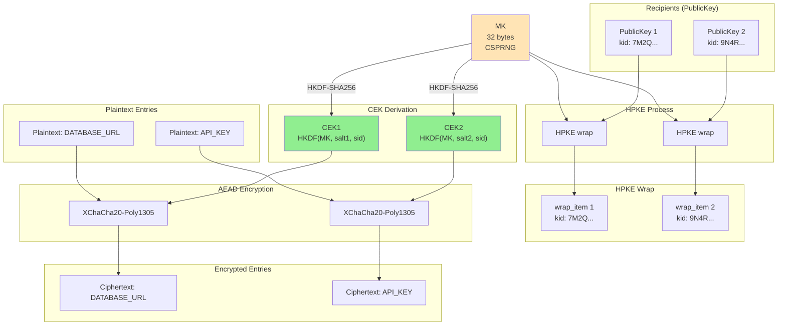
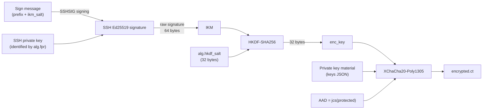
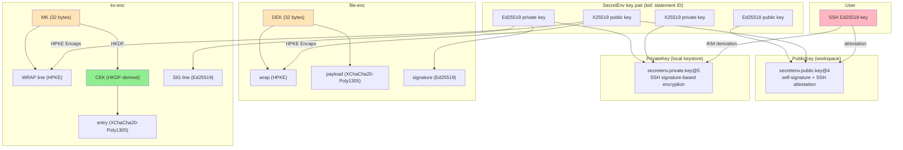

# SecretEnv Security Design

---

## 0. Document Information

### Executive Summary

SecretEnv protects team secrets (`.env` files, certificates, API keys) using modern standardized cryptography: HPKE (RFC 9180) for key delivery, XChaCha20-Poly1305 for content encryption, and Ed25519 for digital signatures. All encrypted artifacts are signed and verified before decryption.

**What SecretEnv guarantees by design:** confidentiality of encrypted content, tamper detection via signatures, cryptographic binding to prevent component swapping, and self-contained signature verification without external key servers.

**What SecretEnv does NOT guarantee:** prevention of insider misuse after decryption, recovery of previously disclosed secrets, strong forward secrecy, or identity assurance beyond TOFU (Trust On First Use). These are explicit non-goals, not oversights.

**What users are responsible for:** managing SSH keys properly (passphrases, disabling agent forwarding), reviewing PR changes to `members/active/`, verifying new members through out-of-band channels during TOFU approval, and rotating actual secret values when members are removed.

For operational guidance, see the User Guide. For the full security analysis, continue reading this document.

### Purpose of This Document

This document organizes the security design of SecretEnv and clarifies both its protection targets and its underlying assumptions. Its purpose is to present SecretEnv's security claims, the conditions required for those claims to hold, the design-level verification points, the residual risks, and the explicit non-goals in a coherent form.

Each section is written not only to describe algorithms and data structures, but also to show which design decisions support which security claims, and where operational assumptions and constraints remain.

### Intended Audience

This document serves three audiences. Each audience may focus on different sections:

| Audience | Primary sections | Purpose |
|----------|-----------------|---------|
| **Security reviewers / auditors** | §2 (threat model), §3 (primitives), §10 (context binding), §11 (attack scenarios) | Evaluate the soundness of the security design |
| **Implementers / contributors** | §5–§8 (protocols), §12 (verification points) | Understand protocol details and implementation requirements |
| **Decision makers evaluating SecretEnv** | Executive Summary, §1 (overview), §2.1–§2.4 (threat model summary), §13 (limitations) | Assess whether SecretEnv meets their security needs |

---

## 1. Security Overview

SecretEnv is an offline-first encrypted file sharing CLI tool for safely sharing secrets such as `.env` files and certificates within a team. It can use a Git repository as a distribution medium, but does not depend on Git's existence.

### 1.1 Key Design Points

1. **security claims**: what is cryptographically protected and what is delegated to operational assumptions
2. **trust boundary**: local private keys, the local keystore, and the local trust store live in a user-local trusted area; workspace `members/active`, `members/incoming`, and `secrets` are treated as tamperable repository inputs
3. **role-separated trust policy**: `signer_pub` is the input to cryptographic signature verification, `members/active` is the authorization source for the current member/recipient set, and `known_keys` is a TOFU approval cache
4. **limits of key identity**: self-signature and attestation show key consistency and key binding, but identity cannot be established by any single mechanism. Manual approval and online verify provide additional evidence for identity decisions
5. **context binding**: `sid` / `kid` / `k` / `p` are used to prevent reuse and mix-ups
6. **critical implementation invariants**: signature-before-decrypt, preserving bindings, fail-closed behavior when `signer_pub` is missing, and limiting `SECRETENV_STRICT_KEY_CHECKING=no` to read-path

### 1.2 Security Claims and Verification

| security claim | Main mechanism | How this is ensured | Assumption | Residual risk |
|---------------|----------------|------------------------------|------------|---------------|
| **Confidentiality** | HPKE wrap + XChaCha20-Poly1305 | Encrypt plaintext with a per-file CEK (AEAD), and wrap that CEK to each recipient with HPKE | Recipient private keys are not compromised | Legitimate recipients can still exfiltrate plaintext |
| **Tamper detection** | Ed25519 signatures | Sign the ciphertext and relevant metadata, and reject any data whose signature does not verify | Verification is never bypassed | A malicious legitimate signer is not prevented |
| **Self-contained verification of signed artifacts** | Mandatory `signer_pub` + PublicKey verification | Always obtain the signature verification key from embedded `signer_pub`, verify its self-signature, attestation, and `kid`, then verify the artifact signature | Every signed artifact embeds `signer_pub` | Current membership still depends on separate trust policy checks |
| **Context binding** | `sid` / `kid` / `k` / `p` in info / AAD | Bind `sid` / `kid` / `k` / `p` into HPKE info and payload AAD so reuse and substitution do not hold across contexts | The implementation preserves the intended binding points | Security weakens if a future change removes a binding |
| **Key consistency** | PublicKey self-signature | Protect each PublicKey with a self-signature so tampering with an existing key statement does not hold | The original private key is not compromised | It does not prevent creation of a brand new malicious key |
| **Current-trust decision** | `members/active` + `known_keys` | Treat `members/active` as the authorization source and `known_keys` as an approval cache, with separate read-path and write-path checks | Repo governance and user approvals work as intended | Weak against bootstrap TOFU, repo compromise, and misapproval |
| **Stronger key identity evidence** | SSH attestation + manual approval + online verify | The layers are not misrepresented as equivalent proofs | Manual approval is executed correctly | Weak against first-contact MITM and GitHub/SSH compromise |
| **Portable private key use** | Password export or SSH-based protection | CI use meets the stated trust conditions | Used only in a trusted CI context | Storing both secrets in the same backend is not independent defense |

### 1.3 Terminology Used Here

| Term | Meaning in this document |
|------|--------------------------|
| **Key consistency** | Evidence that the same private key holder created the PublicKey; not identity by itself |
| **Identity assurance** | Operational evidence that helps a human decide which person or account a key belongs to |
| **approval cache** | A local cache that lets a user skip re-review for a `kid` they have already confirmed |
| **current member set** | The set of `(member_id, kid)` pairs obtained from the current workspace's `members/active` |
| **non-member acceptance** | An interactive, one-shot, artifact-scoped exception for a signer not present in current `members/active` |
| **trust boundary** | The boundary between inputs trusted as-is and inputs assumed tamperable until validated |
| **residual risk** | Risk that remains even with a correct implementation, or when an operational assumption is not met |

---

## 2. Threat Model and Trust Boundary

### 2.1 Attacker Model

| Attacker | Capability | Assumed Scenario |
|----------|-----------|----------------|
| **Repository tamperer** | Can arbitrarily tamper with files under `.secretenv/` | Malicious CI, compromised Git server, unauthorized push |
| **Public key substituter** | Can replace `members/active/<id>.json` or `members/incoming/<id>.json` with a forged public key | MITM during new member addition, unauthorized commit to repository |
| **Key rotation attacker** | Retains old-generation wraps and attempts decryption with new keys | Exploiting weaknesses in the key update process |
| **Context confusion attacker** | Swaps ciphertext components between different secrets | Copy-and-paste across encrypted files |
| **First-contact MITM** | Replaces bootstrap-time `kid`, GitHub account information, or attestation fingerprint with attacker-controlled values | First clone, first encounter with a signer |
| **Local trust store tamperer** | Can write to or roll back `<SECRETENV_HOME>/trust/` | Replacing `known_keys`, rewinding approval history |

### 2.2 Operational Assumptions

The attacker model above assumes repository write access is properly controlled. In the main target environment of Git + GitHub operation, changes to `members/active/` are checked through PR review. `members/active` is the authorization source for the current member set / current recipient set, but it is not a cryptographic trust anchor.

It also assumes `<SECRETENV_HOME>/trust/` is a user-local trusted area protected by OS / filesystem access control. Signatures on the local trust store are used for integrity checks, corruption detection, and format validation, but they do not fully protect against consistent replacement or rollback inside that area.

Initial bootstrap and first-seen `kid` approval rely on TOFU. As a result, first-contact MITM and whole-workspace substitution are outside the scope of cryptographic prevention. The crypto design must therefore be evaluated separately from distribution-medium controls, review workflow, and any out-of-band verification.

### 2.3 Trust Boundary



**Trusted elements:**
- Local machine and local key storage (`~/.config/secretenv/keys/`)
- Local trust store (`~/.config/secretenv/trust/`), but only as a user-local approval cache, not as the authority for current trust
- User's SSH Ed25519 private key
- GitHub API (only during online verification, optional)

**Untrusted elements:**
- Workspace `members/active/` and `members/incoming/` — untrusted repository data. PublicKeys themselves are verified by self-signature and attestation, while use of these directories as the authority for current membership depends on repo governance
- Workspace `secrets/` directory — verified by signatures

### 2.4 Design Scope Summary

| Item | Implication |
|------|----------------------|
| **Guaranteed by design** | Confidentiality, tamper detection, context binding, key-generation binding, key consistency, self-contained signature verification via `signer_pub` |
| **Depends on operational assumptions** | Identity decisions, review of `members/active` changes, TOFU approval, protection of the local trust-store area, safe CI execution conditions |
| **Not guaranteed** | Insider misuse prevention, recovery of prior disclosure, strong forward secrecy, bootstrap authenticity, whole-workspace substitution, centralized authorization policy |
| **Most important implementation checks** | Signature verification order, preserving bindings, mandatory `signer_pub`, no signer lookup fallback, separation of `members/active` vs `known_keys` |

### 2.5 Trust Model

SecretEnv's trust model intentionally separates cryptographic verification, current-membership decisions, and user approval. Rather than having a single mechanism decide both 'whose key is this?' and 'should it be accepted now?', the system applies the following four layers. The User Guide presents a simplified operational view of these layers; this section provides the full model with the rationale behind each layer.

Note: Layers 2–4 reference protocol elements (`members/active`, `known_keys`, the local trust store) that are described in detail in §4–§9. This overview introduces the trust model at the conceptual level; readers are encouraged to revisit this section after reading the protocol details.

| Layer | Mechanism | What it establishes | What it does NOT establish |
|-------|-----------|---------------------|---------------------------|
| **1. Cryptographic verification** | `signer_pub` + PublicKey verification | Cryptographic authenticity of the artifact and the signing key | Identity of the key holder |
| **2. Authorization** | `members/active` | Current membership / current recipient set | Cryptographic trust (depends on repo governance) |
| **3. Approval cache** | `known_keys` in local trust store | Previously approved `kid`s | Current membership |
| **4. Manual approval + online verify** | TOFU approval, GitHub API | Supplementary evidence for identity decisions | Cryptographic proof of identity |

**Layer 1: Cryptographic verification**

Signed artifacts always include `signature.signer_pub`, and the signature verification key is always obtained from that embedded PublicKey. The implementation verifies self-signature, attestation, `kid` consistency, and expiration, and thereby self-containedly determines which key statement signed the artifact. `members/active` is not used for signer lookup.

This layer establishes cryptographic authenticity through the following properties:

- **Self-signature (key consistency)**: The self-signature included in a PublicKey shows that the entity that created this PublicKey holds the corresponding private key. This supports **consistency** of the key, but does not establish **identity**. An attacker who creates a new SecretEnv key pair can generate a PublicKey with a valid self-signature. The role of self-signature is limited to **tamper prevention** of existing PublicKeys. Modifying any field of a PublicKey in `members/active/` or `members/incoming/` will cause self-signature verification to fail.
- **SSH attestation (key binding)**: SSH attestation cryptographically ties a SecretEnv key pair to an SSH key. However, who owns the SSH key itself cannot be determined by attestation alone. An attacker can generate valid attestation by attesting their SecretEnv key with their own SSH key.

**Layer 2: Authorization (`members/active`)**

The current workspace's `members/active` is the authorization source for the current member set / current recipient set. On read-path it requires the signer's `(member_id, kid)` to be in the current member set, and on write-path it is the source of recipients.

However, `members/active` is not a cryptographic trust anchor. It is untrusted repository data whose authenticity depends on repo governance, specifically Git access control and PR review.

**Layer 3: Approval cache (`known_keys`)**

The local trust store is a signed JSON document in `secretenv.trust.local@2` format. Through `known_keys[]`, it records `kid`s the user has already reviewed once. This is an approval cache, not the authority for current trust.

- It does not distinguish signer vs recipient
- It does not distinguish workspaces
- Presence in `known_keys` does not imply current membership
- The user's own keys that already exist in the local keystore normally do not need to be recorded in `known_keys`, because the local keystore is the trust anchor for self; this skips only the approval-cache check and does not skip the `members/active` authorization check

**Layer 4: Manual approval and online verify**

When approving an unseen `kid`, the user reviews the `kid`, the `attestation.pub` fingerprint, and when available the GitHub account `id` / `login`. This is a TOFU model similar to SSH `known_hosts`: it does not cryptographically establish identity, but provides evidence for an acceptance decision. GitHub API online verification is supplementary evidence and does not establish identity on its own.

**Limited exceptions: non-member acceptance and `SECRETENV_STRICT_KEY_CHECKING=no`**

- non-member acceptance is an interactive, one-shot, artifact-scoped exception that accepts an artifact signed by a signer outside current `members/active` without restoring that signer to current membership or updating `known_keys`
- `SECRETENV_STRICT_KEY_CHECKING=no` skips only the `known_keys` check for explicitly requested read paths. It may be used in interactive runs when the operator explicitly sets it, and it never skips the `members/active` check or the cryptographic signature verification

**Composite trust**

Stronger confidence in key authenticity depends on the above layers working as intended. However, the ways this confidence can break down differ by attack scenario:

- **Tampering with existing keys**: Typically requires compromise of the original secret material needed to satisfy self-signature or attestation checks
- **Inserting a new key**: Can succeed if repo governance fails and the user mis-approves the TOFU prompt. The attacker can generate valid self-signature and attestation with their own keys, so compromise of the victim's keys is not required
- **SSH attestor private-key-only compromise**: Even with a healthy GitHub account, an attacker can create a malicious key carrying legitimate-looking attestor evidence
- **GitHub trust-domain compromise**: The GitHub information shown by online verify / manual review can itself be forged consistently
- **Local trust store tampering**: Once the local trusted area is broken, consistent replacement or rollback of `known_keys` cannot be fully prevented

---

## 3. Selection of Cryptographic Primitives

### 3.1 Algorithm Summary

| Algorithm | Parameters | RFC | Purpose |
|-----------|-----------|-----|---------|
| HPKE Base mode | suite `hpke-32-1-3` | RFC 9180 | Content Key wrap/unwrap |
| DHKEM(X25519, HKDF-SHA256) | kem_id=32 (0x0020) | RFC 9180 | KEM (key encapsulation) |
| HKDF-SHA256 | kdf_id=1 (0x0001) | RFC 5869 | KDF (key derivation) |
| ChaCha20-Poly1305 | aead_id=3 (0x0003) | RFC 8439 | HPKE internal AEAD |
| XChaCha20-Poly1305 | nonce 24 bytes, key 32 bytes | — | payload / entry / PrivateKey encryption |
| Ed25519 (PureEdDSA) | — | RFC 8032 | Signing and verification |
| HKDF-SHA256 | — | RFC 5869 | CEK derivation, PrivateKey enc_key derivation |
| JCS | — | RFC 8785 | Deterministic JSON canonicalization |
| base64url (no padding) | — | RFC 4648 §5 | Binary encoding |

### 3.2 HPKE (RFC 9180)

**Rationale:**
- A standardized hybrid public key encryption scheme with a consistent definition of the KEM + KDF + AEAD combination
- Base mode provides ephemeral key isolation per wrap (however, if a recipient's long-term key is compromised, all existing wraps for that recipient can be decrypted; see §13.1)
- Clear suite ID identification via IANA Registry

**Suite configuration:**
```
hpke-32-1-3
├── kem_id  = 32 (0x0020) DHKEM(X25519, HKDF-SHA256)
├── kdf_id  = 1  (0x0001) HKDF-SHA256
└── aead_id = 3  (0x0003) ChaCha20-Poly1305
```

**Comparison with alternatives:**

| Alternative | Reason for rejection |
|-------------|---------------------|
| RSA-OAEP | Large key size; Forward Secrecy cannot be naturally achieved |
| ECIES (custom construction) | Not standardized; high risk of misconfiguration |
| Age (X25519-ChaChaPoly) | Less structured than HPKE for this use; insufficient flexibility for info/AAD |

**Known limitations:**
- Base mode does not provide sender authentication (supplemented by signatures)
- X25519 provides 128-bit security level

### 3.3 XChaCha20-Poly1305

**Rationale:**
- 24-byte nonce makes random nonce collision risk practically negligible (birthday bound at 2^96)
- Consistent performance even in environments without AES-NI
- Does not provide misuse resistance, but practical security is ensured by the large nonce space

**Comparison with alternatives:**

| Alternative | Reason for rejection |
|-------------|---------------------|
| AES-256-GCM | 12-byte nonce has high collision risk in multi-key usage |
| AES-256-GCM-SIV | Nonce misuse resistance is appealing, but rejected due to implementation complexity and limited adoption |

**Known limitations:**
- Nonce reuse is catastrophic (encrypting with the same key and nonce is prohibited)
- Compression before encryption is prohibited (to avoid compression oracle attacks CRIME/BREACH)

### 3.4 Ed25519 (RFC 8032 PureEdDSA)

**Rationale:**
- **Deterministic signatures**: Always generates the same signature for the same input. An essential property for use as IKM in PrivateKey protection.
- Fast signing and verification
- Affinity with SSH ecosystem (ssh-ed25519)

**Comparison with alternatives:**

| Alternative | Reason for rejection |
|-------------|---------------------|
| ECDSA (P-256) | Non-deterministic signatures (mitigable with RFC 6979, but handling varies across SSH implementations) |
| Ed448 | Insufficient adoption in the SSH ecosystem |

**Known limitations:**
- 128-bit security level
- Context separation is not provided by PureEdDSA itself (addressed by JCS canonicalization + protocol identifiers)

### 3.5 HKDF-SHA256 (RFC 5869)

**Rationale:**
- Standardized key derivation function
- The `info` parameter allows safely deriving purpose-specific keys from the same IKM
- The `salt` parameter allows deriving different keys even from the same IKM and info

**Uses:**
- CEK derivation for kv-enc (MK + salt + sid → CEK)
- enc_key derivation for PrivateKey protection (SSH signature + salt + kid → enc_key)

### 3.6 JCS (RFC 8785)

**Rationale:**
- Provides deterministic canonicalization of JSON objects
- Eliminates ambiguity in key ordering and number representation, ensuring consistency of signatures, AAD, and HPKE info
- No ambiguity arises even when string fields like `sid` contain arbitrary characters

### 3.7 Security Guarantees and Limits Inherited from Standard Cryptographic Primitives

| Primitive | Assumed security property | Implication for SecretEnv |
|-----------|-------------------------------------------|----------------------------|
| HPKE Base mode (RFC 9180) | Provides confidentiality for recipient-specific key delivery, but does not provide sender authentication | Confidentiality of each recipient wrap depends on this, while producer authenticity and insider-attack resistance depend on Ed25519 signatures |
| XChaCha20-Poly1305 | Provides confidentiality and tamper detection as an AEAD, assuming nonces are not reused | Security of payload, entry, and PrivateKey protection depends on nonce uniqueness and does not tolerate nonce reuse |
| Ed25519 (PureEdDSA) | Provides unforgeability and tamper detection as long as the signing private key remains secret | Authenticity of encrypted files and PublicKey documents depends on this, and that guarantee collapses if the signing private key is compromised |
| HKDF-SHA256 | Can derive pseudorandom, purpose-separated keys from input key material with sufficient entropy | Key separation for CEKs and `enc_key` depends on this, but HKDF does not turn low-entropy input into high-entropy key material |

**Security dependency:**

- Overall confidentiality depends on both the confidentiality of HPKE for recipient-specific key delivery and the confidentiality of the AEAD that protects the payload itself. SecretEnv's overall confidentiality does not hold if either of these fails.
- Tamper detection depends on Ed25519 signatures. HPKE Base mode does not provide sender authentication by itself, so signatures provide the check that encrypted files and PublicKey documents were produced by the expected signer and have not been modified.
- Cryptographic independence between entries in kv-enc depends on the PRF security of HKDF-SHA256. In SecretEnv, a distinct CEK is derived for each entry from a high-entropy MK, so knowledge about one entry is not expected to directly reveal the CEK of another entry.

**Preconditions and limitations:**
- HPKE Base mode assumes confidentiality of the recipient's long-term private key. If the long-term key is compromised, all wraps for that recipient can be decrypted (see §13.1).
- XChaCha20-Poly1305 depends on nonce uniqueness in practice, and nonce reuse can lead to serious problems.
- Ed25519 assumes private key confidentiality. In SecretEnv, the signing private key is stored encrypted by PrivateKey protection (§7).

### 3.8 Nonce Safety Margin

XChaCha20-Poly1305 uses a 24-byte (192-bit) nonce. In SecretEnv's design, there are no cases where the same symmetric key is used for multiple encryptions. DEK (file-enc), CEK (kv-enc entry), and enc_key (PrivateKey protection) are each uniquely generated or derived per encryption, so the risk of nonce collision is structurally eliminated.

The choice of 192-bit nonce space serves as a safety net in case future design changes introduce same-key reuse.

### 3.9 Cryptographic Strength (Security Level)

The estimated cryptographic strength (security level) provided by each cryptographic primitive is as follows:

| Cryptographic Primitive | Key Size / Parameters | Estimated Strength (Classical) | Notes |
| --- | --- | --- | --- |
| X25519 (KEM) | 256 bits | 128 bits | Security against discrete logarithm problem |
| Ed25519 (Signatures) | 256 bits | 128 bits | Security against discrete logarithm problem |
| XChaCha20-Poly1305 | Key 256 bits | 256 bits | Symmetric key encryption strength |
| ChaCha20-Poly1305 | Key 256 bits | 256 bits | HPKE internal AEAD |
| HKDF-SHA256 | Output 256 bits | 256 bits | Based on hash function preimage resistance |

**Overall System Cryptographic Strength:**

The security of the overall system is constrained by the weakest link in the chain of cryptographic primitives.
In SecretEnv, the asymmetric cryptography that forms the foundation of data confidentiality (HPKE X25519) and authenticity (Ed25519) provides a 128-bit security level. Therefore, **the overall cryptographic strength provided by the system is equivalent to 128 bits**.

This provides a robust security level (equivalent to AES-128) sufficient for current general commercial systems. The use of 256-bit keys in the symmetric encryption parts (such as XChaCha20-Poly1305) is the result of selecting available standard, fast primitives, and does not elevate the overall system to a 256-bit security level.

---

## 4. Key Hierarchy and Key Lifecycle

### 4.1 Key Types and Relationships



This diagram intentionally separates the SSH key from the SecretEnv key pair.

- The **SSH key** is an external authentication key already owned by the user; it does not directly encrypt or sign SecretEnv workspace payloads
- The **SecretEnv key pair** is the application-specific key material used for encryption, decryption, signing, and verification inside the workspace
- The SSH key has only two roles
  - **attestation**: show which SSH key backs a SecretEnv public key
  - **PrivateKey protection**: derive the `enc_key` used to unlock the SecretEnv private key stored in the local keystore

Therefore, the SSH key is not the SecretEnv key pair itself. It is an outer key used to support provenance checks and local protection of the SecretEnv key pair.

### 4.2 Key Parameter Summary

| Key type | Size | Generation method | Purpose | Zeroization required |
|----------|------|------------------|---------|---------------------|
| SSH Ed25519 private key | 32 bytes | User-managed | attestation, PrivateKey protection | N/A (OS-managed) |
| X25519 private key (KEM) | 32 bytes | CSPRNG | HPKE unwrap | MUST |
| X25519 public key (KEM) | 32 bytes | Derived from X25519 private key | HPKE wrap | — |
| Ed25519 private key (signing) | 32 bytes | CSPRNG | Signature generation | MUST |
| Ed25519 public key (signing) | 32 bytes | Derived from Ed25519 private key | Signature verification | — |
| DEK (Data Encryption Key) | 32 bytes | CSPRNG | file-enc payload encryption | MUST |
| MK (Master Key) | 32 bytes | CSPRNG | CEK derivation source for kv-enc | MUST |
| CEK (Content Encryption Key) | 32 bytes | Derived via HKDF-SHA256 | kv-enc entry encryption | MUST |
| enc_key (for PrivateKey protection) | 32 bytes | Derived via HKDF-SHA256 | PrivateKey AEAD encryption | MUST |

Notes:

- `enc_key` is not a stored or pre-existing key; it is a transient symmetric key derived from SSH signing output each time
- The same SSH key can protect multiple SecretEnv key statements, but different `kid` / `salt` values produce different `enc_key` values
- The `private.json` stored in the local keystore contains only the ciphertext of SecretEnv private key material; the SSH private key itself remains outside SecretEnv storage

### 4.3 Recipient Eligibility

Only members listed in `members/active/` are included as recipients during encryption operations. Members in `members/incoming/` cannot decrypt any existing secrets until they are promoted to active membership via `rewrap`.

### 4.4 Key Lifecycle

A SecretEnv key pair transitions through a lifecycle from generation to expiration, and is eventually replaced through key rotation.

```
generated → active → expired
              │
              └── rotate (generate a new key pair and switch)
```

The behavior in each state is as follows:

- **Generated**: A new key pair and PublicKey document are created using the `key new` command and saved to the local keystore.
- **Active**: The state before `expires_at` is reached. The key can be used for new encryption (wrap) and signing operations, as well as for decryption and verification.
- **Expired**: The state after `expires_at` has passed. New encryption (wrap) and signing operations are rejected. However, decryption and verification of data legitimately signed in the past are permitted with a warning.
- **Rotate**: The active key is replaced by generating a new key pair (with a new `kid`) using commands like `rewrap --rotate-key`. The old key is retained for decryption and verification until it expires.

#### 4.4.1 Immutability of Key Statement ID (kid)

Each key pair is associated with a `kid` (key statement ID). The `kid` is a 32-character Crockford Base32 string without hyphens, deterministically derived from the contents of the self-signed `PublicKey@4.protected` (which includes the public key, identity, binding_claims, expiration metadata, etc.).

Because `kid` is derived from the PublicKey contents, **`kid` equality implies strict equality of the key statement content**. If any field changes, the result is treated as an entirely new key pair with a different `kid`.

### 4.5 Key Rotation

Key rotation is performed by the `rewrap` command. The behavior differs between file-enc and kv-enc and between recipient changes and explicit `--rotate-key`. See §6.7 for the full comparison after both protocols have been introduced.

---

## 5. file-enc Protocol

file-enc encrypts a single file for multiple recipients. A random per-file key (DEK) encrypts the entire content using XChaCha20-Poly1305, and each recipient receives a HPKE-wrapped copy of the DEK. The complete structure is signed with Ed25519, and tampering is detected before any decryption occurs.

### 5.0 Data Structure Overview

file-enc is a JSON-format file with a two-layer structure consisting of signed data (`protected`) and the signature (`signature`).

**Structurally important security properties:**

1. **Signature coverage**: The `wrap` array and `payload` are stored within `protected`. Therefore, the Ed25519 signature over the entire `protected` protects the integrity of both wrap (key distribution) and payload (ciphertext).
2. **Dual presence of sid**: `sid` exists both directly under `protected` and within `payload.protected`. Verifying that both match at decryption time detects payload swapping.
3. **Payload envelope**: The payload itself has a protected header (`payload.protected`), whose JCS canonicalization becomes the AEAD AAD. This establishes the payload's cryptographic binding independently from the outer signature.

#### Overall file structure (JSON layout)

The overall structure of file-enc nests in order: top level (signed container) → `protected` (signed data) → `wrap` (DEK distribution) / `payload` (ciphertext).

```
{
  "protected": {
    "format": "secretenv.file@3",    // format identifier
    "sid": "<UUID>",                 // uniquely identifies the file (used to bind wrap/payload)
    "wrap": [
      {
        "rid": "<member_id>",        // recipient's member_id (informational only)
        "kid": "<canonical kid>",    // recipient key statement ID (keystore lookup key; included in HPKE info)
        "alg": "hpke-32-1-3",        // HPKE algorithm identifier
        "enc": "<b64url>",           // HPKE encapsulated key (enc in base mode)
        "ct": "<b64url>"             // HPKE ciphertext (ct wrapping DEK)
      }
      // ... one element per recipient ...
    ],
    "payload": {
      "protected": {
        "format": "secretenv.file.payload@3",
        "sid": "<UUID>",             // same as protected.sid (verified before decryption)
        "alg": { "aead": "xchacha20-poly1305" }
      },
      "encrypted": {
        "nonce": "<b64url>",         // 24 bytes
        "ct": "<b64url>"             // AEAD ciphertext (entire plaintext file)
      }
    },
    "created_at": "<RFC3339>",       // file creation timestamp
    "updated_at": "<RFC3339>"        // file update timestamp
  },
  "signature": {
    // signature_v4 (§8.2): signature over JCS-canonicalized protected, etc.
  }
}
```

This layout allows (1) the signature to detect tampering in the entire `protected` (= wrap and payload), while (2) the payload has its own header binding via `payload.protected` as AAD, independent from the outer signature.

### 5.1 Encryption Flow



```
1. DEK generation     — 32 bytes, CSPRNG
2. HPKE wrap          — wrap DEK with each recipient's public key
3. AEAD encryption    — encrypt plaintext file with DEK using XChaCha20-Poly1305
4. Ed25519 signature  — JCS-canonicalize the entire protected object and sign
```

### 5.2 DEK Generation

- 32 bytes of cryptographically secure random bytes (`OsRng`)
- Unique per file-enc file
- Zeroized after use

### 5.3 HPKE wrap

For each recipient:

```
info_bytes = jcs({
    "kid": <wrap_item.kid>,
    "p": "secretenv:file:hpke-wrap@3",
    "sid": <protected.sid>
})

aad_bytes = info_bytes   // defence-in-depth

(enc, ct) = HPKE.SealBase(pk_recip, info_bytes, aad_bytes, DEK)
```

**Design decision: why HPKE info and AAD are identical**

HPKE internally passes info to the KDF and AAD to the AEAD. By making them identical:
- The AAD layer defends against bypass attacks at the KDF stage
- The info layer defends against bypass attacks at the AEAD stage
- Defence-in-depth is achieved

### 5.4 Payload Encryption

```
payload.protected = {
    "format": "secretenv.file.payload@3",
    "sid": <protected.sid>,          // same value as outer sid
    "alg": { "aead": "xchacha20-poly1305" }
}

aad = jcs(payload.protected)
nonce = random(24 bytes)
ct = XChaCha20Poly1305.Encrypt(DEK, nonce, aad, plaintext)

// store nonce and ct in payload.encrypted
payload.encrypted = { "nonce": b64url(nonce), "ct": b64url(ct) }
```

### 5.5 Decryption Flow

```
1. Signature verification  — immediate error on failure (decryption does not proceed)
2. Key lookup              — locate private key in keystore by kid
3. wrap_item search        — find the matching wrap_item by kid (not rid)
4. HPKE unwrap             — reconstruct info/AAD and recover DEK
5. sid verification        — confirm payload.protected.sid == protected.sid
6. AEAD decryption         — decrypt payload with DEK
```

**Important: Signature verification precedes decryption.** Decrypting a ciphertext with an invalid signature exposes the cryptographic primitive to malicious input and increases the attack surface for side-channel attacks.

---

## 6. kv-enc Protocol

kv-enc encrypts `.env`-style key-value entries individually. It uses a two-layer key structure: a Master Key (MK) is HPKE-wrapped for each recipient, and per-entry Content Encryption Keys (CEKs) are derived from the MK via HKDF. This design enables partial decryption of individual entries and efficient updates without re-encrypting the entire file.

### 6.0 Data Structure Overview

kv-enc is a line-based text format consisting of the following line types:

```
:SECRETENV_KV 3          ← version identifier (included in signed data)
:HEAD <token>             ← file metadata (sid, timestamps)
:WRAP <token>             ← HPKE wrap array of MK + removed_recipients
<KEY> <token>             ← encrypted entry (contains salt, nonce, ct)
:SIG <token>              ← Ed25519 signature
```

Each token is a JCS-canonicalized JSON object encoded in base64url.

**Structurally important security properties:**

1. **Signature coverage**: All lines except `:SIG` (`:SECRETENV_KV 3`, `:HEAD`, `:WRAP`, all KEY lines) are signed. Including the version line defends against version downgrade attacks.
2. **Separation of wrap and entries**: Unlike file-enc, wrap (`:WRAP` line) and encrypted entries (KEY lines) exist as independent lines. This means wrap regeneration is not required for partial updates via `set`.
3. **Entry self-containment**: Each entry token contains its own `salt`, `k` (KEY), `aead`, `nonce`, and `ct`. The `sid` is obtained from `:HEAD` and used for CEK derivation and AAD construction.
4. **canonical_bytes construction**: The signed data is the byte sequence of all lines concatenated with LF (0x0A) terminators. CRLF is normalized to LF. The field separator is space (0x20).

### 6.1 Design Rationale for Two-Layer Key Structure

kv-enc adopts a two-layer key structure of MK → CEK:

```
MK (1 per file) ─── HPKE wrap ──→ each recipient
  │
  ├── HKDF(MK, salt1, sid) ──→ CEK1 ──→ entry1 encryption
  ├── HKDF(MK, salt2, sid) ──→ CEK2 ──→ entry2 encryption
  └── HKDF(MK, saltN, sid) ──→ CEKN ──→ entryN encryption
```

**Why two layers:**
- When updating a specific entry with `set`, other entries do not need to be re-encrypted
- Partial decryption of a specific entry with `get` is possible
- There is no need to re-execute HPKE wrap for all recipients each time

### 6.1.1 Encryption/Decryption Flow Overview

**Encryption flow:**



```
1. MK generation      — 32 bytes, CSPRNG
2. HPKE wrap          — wrap MK with each recipient's public key (info = AAD)
3. For each entry:
   a. salt generation — 32 bytes, CSPRNG
   b. CEK derivation  — HKDF-SHA256(MK, salt, sid)
   c. AEAD encryption — encrypt VALUE with CEK using XChaCha20-Poly1305
4. Ed25519 signature  — sign canonical_bytes of all lines (see §8.3)
```

**Decryption flow:**

```
1. SIG line verification — immediate error on failure (decryption does not proceed)
2. Key lookup            — locate private key in keystore by kid
3. HPKE unwrap           — reconstruct info/AAD and recover MK
4. For each entry:
   a. CEK derivation    — HKDF-SHA256(MK, salt, sid)
   b. AAD construction  — jcs({"k", "p", "sid"})
   c. AEAD decryption   — decrypt ciphertext with CEK
```

As with file-enc (§5.5), **signature verification precedes decryption**.

### 6.2 CEK Derivation

```
salt_bytes = base64url_decode(entry.salt)   // 32 bytes

CEK = HKDF-SHA256(
    ikm    = MK,                            // 32 bytes
    salt   = salt_bytes,                    // 32 bytes
    info   = jcs({
        "p":   "secretenv:kv:cek@3",
        "sid": <HEAD.sid>
    }),
    length = 32
)
```

Including `sid` in info means that even if an entry is copied between different files, a different CEK is derived, causing decryption to fail.

### 6.3 Entry AAD

```
aad = jcs({
    "k":   <entry.k>,                      // dotenv KEY
    "p":   "secretenv:kv:payload@3",
    "sid": <HEAD.sid>
})
```

**Design decisions:**
- Include `k` → prevents entry swapping within the same file
- Include `sid` → double-binding with CEK derivation info (defence-in-depth)
- Do not include `salt` → already used as HKDF salt argument
- Do not include `recipients` → to allow wrap replacement while keeping payload fixed during rewrap

### 6.4 HPKE wrap (kv)

```
info_bytes = jcs({
    "kid": <wrap_item.kid>,
    "p":   "secretenv:kv:hpke-wrap@3",
    "sid": <HEAD.sid>
})

aad_bytes = info_bytes   // defence-in-depth: same policy as file-enc
```

As with file-enc (§5.3), the same bytes are used for HPKE info and AAD. This ensures binding at both the KDF stage and the AEAD stage in kv-enc wraps as well, achieving defence-in-depth.

### 6.5 Partial Decryption (get / set)

The kv-enc design allows operating on specific entries without decrypting all entries:

- **get**: SIG verification → MK unwrap → CEK derivation for specified KEY → decrypt only that entry
- **set**: SIG verification → MK unwrap → new salt generation → CEK derivation → VALUE encryption → entry addition/replacement → SIG regeneration

### 6.6 Behavior on Recipient Removal

When a recipient is removed from kv-enc:

1. Generate new MK
2. Re-encrypt all entries with CEK derived from the new MK
3. Record the removed member in `removed_recipients`
4. Attach `disclosed: true` to all entries
5. Update the WRAP line

The `disclosed` flag makes visible the entries that may have been disclosed to the removed recipient, supporting the decision to update secrets.

### 6.7 Key Rotation Behavior Across Both Formats

`rewrap` updates wrap entries (recipient addition/removal). `rewrap --rotate-key` regenerates the content key and re-encrypts the entire payload.

| Operation | Format | Content Key | Wrap | Payload |
|-----------|--------|-------------|------|---------|
| Add recipients | file-enc | DEK maintained | Added | Maintained |
| Add recipients | kv-enc | MK maintained | Added | Maintained |
| Remove recipients | file-enc | DEK maintained | Removed | Maintained |
| Remove recipients | kv-enc | **MK regenerated** | Rebuilt | **Re-encrypted** |
| `--rotate-key` | file-enc | DEK regenerated | Rebuilt | Re-encrypted |
| `--rotate-key` | kv-enc | MK regenerated | Rebuilt | Re-encrypted |

For recipient addition, both formats maintain the content key and add new wrap entries.

For recipient removal, the behavior differs by format. In file-enc, the removed recipient's wrap entry is deleted and a removal history is recorded, but the DEK is unchanged. In kv-enc, the MK is always regenerated and all entries are re-encrypted. This is because the MK is a long-lived key from which per-entry CEKs are derived (§6.2) — if a removed member retains knowledge of the old MK (e.g., from a prior decryption session), they could derive CEKs for entries added after their removal. Regenerating the MK eliminates this risk.

`--rotate-key` forces full re-encryption in both formats regardless of recipient changes, and is intended as a post-compromise damage-limitation measure.

---

## 7. PrivateKey Protection

### 7.1 Passwordless Design via SSH Key Reuse

SecretEnv's PrivateKey (KEM private key + signing private key) is encrypted and protected using the user's existing SSH Ed25519 key. This eliminates the need for password management specific to SecretEnv.

What is protected here is the SecretEnv private key stored in the local keystore. The SSH key does not directly decrypt workspace secrets. Instead, it first unlocks the SecretEnv private key in the local keystore, and the recovered SecretEnv private key is then used for HPKE unwrap and Ed25519 signing.

### 7.1.1 Relationship Between the SSH Key and the SecretEnv Key Pair

- The SSH key is an **existing user-owned authentication key** outside SecretEnv
- The SecretEnv key pair is an **application-specific key pair** managed per `kid`
- On the PublicKey side, the SSH key appears in attestation, showing which SSH key is bound to the SecretEnv key pair
- On the PrivateKey side, the same SSH key protects the encrypted SecretEnv private key stored in the local keystore

Therefore, the SSH key and the SecretEnv key pair are not fused into a single key. One SSH key may protect multiple generations of SecretEnv keys, while the actual file-enc / kv-enc cryptographic operations are performed by the SecretEnv key pair after it has been decrypted.

### 7.1.2 What Is Stored in the local keystore

Each `kid` directory in the local keystore (a key-statement directory) contains two files.

- `public.json`: a PublicKey document that can be distributed to the workspace
- `private.json`: an encrypted SecretEnv private key document

When loading keys from the local keystore, if `private.json` is used, the sibling `public.json` in the same directory is also loaded and verified as a PublicKey, and the implementation confirms `private.protected.member_id == public.protected.member_id` and `private.protected.kid == public.protected.kid`. This is a local keystore invariant intended to detect swapped public/private pairs or other broken local state early. When loading keys via the `SECRETENV_PRIVATE_KEY` environment variable, this sibling `public.json` check is intentionally not assumed.

`private.json` itself has two layers.

- `protected`: header fields such as `member_id`, `kid`, `alg.fpr`, `alg.ikm_salt`, `alg.hkdf_salt`, `created_at`, and `expires_at`; these define the decryption conditions and tamper-detection scope
- `encrypted`: the ciphertext containing the actual SecretEnv private key material

Here `alg.fpr` is only an identifier for the SSH key used to protect that key generation. It is not the SSH private key itself.

### 7.2 Key Derivation Pipeline



### 7.3 Sign Message

```
secretenv:key-protection-ikm@5
{ikm_salt}
```

Each line is separated by LF (`0x0A`). `ikm_salt` is the base64url string stored in `protected.alg.ikm_salt`. `kid` is excluded from the sign message and used only in HKDF context binding.

### 7.4 SSHSIG signed_data

SSH signatures conform to the SSHSIG format:

```
byte[6]      "SSHSIG"
SSH_STRING   namespace = "secretenv"
SSH_STRING   reserved = ""
SSH_STRING   hash_algorithm = "sha256"
SSH_STRING   SHA256(sign_message)
```

### 7.5 Encryption Key Derivation

```
enc_key = HKDF-SHA256(
    ikm    = ed25519_raw_signature_bytes,    // 64 bytes
    salt   = protected.alg.hkdf_salt,        // 32 bytes
    info   = "secretenv:sshsig-private-key-enc@5:{kid}",
    length = 32
)
```

This `enc_key` is not a stored fixed key. It is re-derived from the same SSH signing capability during both encryption and decryption.

### 7.6 Determinism Check

Ed25519 (RFC 8032 PureEdDSA) generates deterministic signatures by specification, but to eliminate the possibility of non-deterministic signatures due to implementation defects, on each encryption and decryption:

1. Execute **2 signatures** with the SSH key on the same signed_data
2. Confirm that the extracted Ed25519 raw signature bytes (64 bytes) match
3. If they do not match, output `W_SSH_NONDETERMINISTIC` and abort processing

**Reason:** Non-deterministic signatures would derive different IKM at encryption and decryption time, making **decryption impossible**.

### 7.6.1 Conditions for Successful Decryption

To decrypt `private.json` in the local keystore, all of the following conditions must hold.

1. The SSH key corresponding to `protected.alg.fpr` must be usable
2. That SSH key must produce deterministic signatures for identical input
3. The sign message must be reconstructible from `protected.alg.ikm_salt`
4. `protected` must be untampered so that AAD verification over `jcs(protected)` succeeds

Conversely, an attacker does not necessarily need to steal the SSH private key file itself; any actor with equivalent signing capability can derive `enc_key`.

### 7.7 AAD

```
aad = jcs(protected)
```

Using the JCS-canonicalized bytes of the entire `protected` object as AAD means that `format`, `member_id`, `kid`, `alg`, `created_at`, and `expires_at` are all subject to tamper detection. Notably, including `expires_at` in AAD detects tampering with the expiration date.

### 7.7.1 How to Read the Decryption Flow

The high-level local keystore protection flow is:

1. Load `private.json`
2. When loading from the local keystore, also load the sibling `public.json` from the same `kid` directory, verify it as a PublicKey, and confirm `member_id` / `kid` consistency
3. Read `kid`, `ikm_salt`, `hkdf_salt`, and the SSH key fingerprint from `protected`
4. Rebuild the sign message from `prefix + ikm_salt`
5. Ask the SSH key to sign and extract raw Ed25519 signature bytes as IKM
6. Derive `enc_key` via HKDF using `hkdf_salt` and `info = "secretenv:sshsig-private-key-enc@5:{kid}"`
7. Decrypt the ciphertext using `jcs(protected)` as AAD

This means the SSH key is both an authentication mechanism for local keystore access and, in practice, the source of decryption capability.

### 7.8 Trust Assumptions

Since PrivateKey protection derives IKM from SSH signatures, **any entity that can execute `sign_for_ikm` can derive the encryption key and decrypt the PrivateKey**. This equivalence is an intentional design decision, but the following is stated to clarify trust boundaries.

| Entity | Can decrypt | Notes |
|--------|------------|-------|
| Local user (direct file access) | **Yes** | Normal use |
| ssh-agent (local) | **Yes** | Can issue signing requests if key is loaded |
| ssh-agent forwarding | **Yes** | Can issue signing requests from remote host. Weakens protection. |
| Local malware | **Yes** | If it can access key files or agent socket |
| CI/CD environment | **Yes** | If SSH key is deployed. Dedicated key recommended. |
| Hardware token (FIDO2) | **No** | Ed25519-SK uses non-deterministic signatures, so IKM derivation is impossible. Detected by §7.6 determinism check. |

**Note on ssh-agent forwarding**: In environments with agent forwarding enabled, processes on the remote host can send signing requests to the local ssh-agent. This allows administrators or malware on the remote host to decrypt the PrivateKey. Disabling agent forwarding is recommended in environments using SecretEnv.

**Clarifying design intent**: The equivalence between SSH signing capability and PrivateKey decryption capability is an intentional design decision. SecretEnv uses the existing SSH authentication infrastructure as a trust anchor for cryptographic key protection, eliminating the need for additional password or master key management. This tradeoff means that the SSH key's protection level becomes the upper bound of SecretEnv's secret protection level. Therefore, proper SSH key management (setting passphrases, restricting agent forwarding, considering hardware token use) is essential to SecretEnv's security.

Operationally, local keystore file permissions and SSH key handling must not be treated as separate concerns. Even if `private.json` has safe filesystem permissions, any actor on the same host that can freely use the SSH key or agent socket can ultimately decrypt the SecretEnv private key as well.

### 7.9 Password-Based Key Protection (`argon2id-m64t3p4-hkdf-sha256`)

As an alternative to SSH-based protection, SecretEnv supports password-based private key protection using `argon2id-m64t3p4-hkdf-sha256`. This scheme is designed for CI/CD environments where SSH keys and `ssh-agent` are unavailable.

#### 7.9.1 Use Case

Many CI platforms provide "secret variables" that are stored securely and exposed as environment variables at runtime. This protection scheme enables exporting a SecretEnv private key in a portable, password-protected format that can be registered as a CI secret variable and used without any SSH infrastructure.

#### 7.9.2 Key Derivation Pipeline

```
Password + ikm_salt (32 bytes, random) → Argon2id (m=65536, t=3, p=4) → 32-byte IKM
IKM + hkdf_salt (32 bytes, random) → HKDF-SHA256 (info: "secretenv:password-private-key-enc@5:{kid}") → 32-byte encryption key
```

`ikm_salt` is dedicated to Argon2id and `hkdf_salt` is dedicated to HKDF-Extract, keeping their responsibilities clearly separated.

The HKDF info string (`secretenv:password-private-key-enc@5:{kid}`) differs from the SSH-based scheme (`secretenv:sshsig-private-key-enc@5:{kid}`) to ensure domain separation between the two key derivation paths.

#### 7.9.3 Argon2id Parameters and Password Requirements

- Fixed parameters at export time: m=65536 (64 MiB), t=3, p=4 — following the "second recommended" option from RFC 9106, Section 4
- Parameters are fixed by the implementation and are not serialized in the private key document
- Minimum password length: 8 characters. This is the implementation-enforced floor, not a recommendation. Users are responsible for choosing a sufficiently strong password. For offline brute-force resistance, 20 or more random characters (or a passphrase with equivalent entropy) is strongly recommended.

#### 7.9.4 Security Trade-offs in CI Environments

Environment variables (`SECRETENV_KEY_PASSWORD`) persist in process memory and may be visible via `/proc/*/environ` on Linux. This is an accepted trade-off consistent with how CI platforms handle secret variables. The password and decrypted key material are zeroized after use where the Rust type system permits (using the `zeroize` crate).

**What password protection defends against:** The main security value is defense when the exported blob leaks by itself. For example, if only the `SECRETENV_PRIVATE_KEY`-equivalent blob escapes through an exported file, copied text, artifact, or clipboard content, the key still cannot be decrypted immediately unless the password is also disclosed.

**What password protection does NOT defend against:** When `SECRETENV_PRIVATE_KEY` and `SECRETENV_KEY_PASSWORD` are stored in the same CI secret backend, the password provides little independent protection against compromise of that backend itself, because both values are typically obtained together. This configuration is useful for portable SSH-free operation, but it must not be interpreted as meaningful defense-in-depth against backend compromise.

**Recommendation:** If operations can place `SECRETENV_PRIVATE_KEY` and `SECRETENV_KEY_PASSWORD` in separate trust domains, the password protection becomes more meaningful. In the common case where both are stored in the same CI secret backend, the practical protection is primarily limited to blob-only leakage scenarios.

#### 7.9.5 Public Key Verification with Environment Variable-Based Key Loading

Loading keys via environment variables permits only `run`, `decrypt`, `get`, and `list`. At key-load time, the implementation only decrypts the exported PrivateKey from `SECRETENV_PRIVATE_KEY` with `SECRETENV_KEY_PASSWORD` and validates the PrivateKey document itself. `list` is metadata-only and does not require key loading.

The key-load path performs the following checks:

1. Base64url-decode `SECRETENV_PRIVATE_KEY`
2. Decrypt it with `SECRETENV_KEY_PASSWORD`
3. Validate the PrivateKey document structure and protection method
4. Validate keypair consistency for `sig.d` / `sig.x` and `kem.d` / `kem.x`

The implementation must not resolve the caller's own PublicKey from `members/active/` during environment-variable key loading. Therefore the absence of `members/active/<member_id>.json`, or mismatches in that file, are not load-time failures when loading keys via environment variables.

However, `run`, `decrypt`, and `get` still use the normal signature-verification and member-resolution rules, which may read from the workspace checkout. The checkout remains outside the trust boundary in environment variable-based key loading as well. Therefore environment variable-based key loading may be used only in a trusted CI context that satisfies all of the following:

- **trusted workflow**: the workflow / job definition that consumes secrets is maintainer-controlled and cannot be modified or triggered from attacker-controlled PR content
- **trusted ref**: the checkout consumed by secretenv is a protected branch, protected tag, post-merge ref, or equivalent trusted ref
- **trusted runner**: the runner handling secrets is trusted and is not shared with untrusted workloads

Environment variable-based key loading must not be used in:

- fork PRs
- untrusted PRs
- `pull_request_target`
- jobs that perform an attacker-controlled checkout
- jobs running on untrusted runners

Typical allowed cases are post-merge workflows on protected branches and deploy jobs on protected tags. PR validation workflows that expose secrets are out of scope.

---

## 8. Signature and Verification Architecture

### 8.0 signature_v4 Common Format

All signed artifacts in file-enc, kv-enc, and the local trust store use a common signature structure called `signature_v4`. This structure has the following security properties.

- **Self-contained verification**: The signer's PublicKey (`signer_pub`) is required to be embedded in the signature. This allows signature verification and signer identification to complete without relying on an external keystore or workspace lookup.
- **Explicit key statement**: Including `kid` makes it clear which self-signed key statement was used for signing.
- **Fixed verification chain**: The implementation first verifies the self-signature, attestation, expiration, and `kid` match of `signer_pub`, and then verifies the artifact signature using that key.
- **Ed25519 raw signature**: The signature value is base64url-encoded Ed25519 raw signature bytes (64 bytes), with a fixed length of 86 characters.

Artifacts that omit `signer_pub` are rejected fail-closed. SecretEnv does not support legacy fallback signer lookup from workspace `members/active`.

### 8.1 Comparison of Signing Methods

| Item | file-enc | kv-enc |
|------|----------|--------|
| Signed data | `jcs(protected)` | canonical_bytes (concatenation of text lines) |
| Format | `signature` field in JSON | `:SIG` line (final line) |
| Tamper detection scope | Entire `protected` (sid, wrap, payload, timestamps) | HEAD / WRAP / all entry lines |
| Signature algorithm | `eddsa-ed25519` (PureEdDSA) | `eddsa-ed25519` (PureEdDSA) |
| Signature format | `signature_v4` format | `signature_v4` format |

### 8.2 file-enc Signature

```
canonical_bytes = jcs(protected)
signature = ed25519_sign(sig_priv, canonical_bytes)
```

- The `protected` object is JCS-canonicalized and signed directly (RFC 8032 PureEdDSA)
- `wrap`, `payload`, and `removed_recipients` are all contained within `protected` and are therefore protected by the signature
- The `signature` field is not included in the signed data

### 8.3 kv-enc Signature

Procedure for constructing canonical_bytes:

1. Normalize line endings in the input file to LF (0x0A) (CRLF to LF)
2. Concatenate, in order, all lines including the first line `:SECRETENV_KV 3`, excluding the `:SIG` line
3. Append the **line terminator** LF (0x0A) to the end of each line
4. Use space (0x20) as the **field separator** within each line, not tab

Concrete byte-level example:

```
:SECRETENV_KV 3\n      <- line terminator: LF (0x0A)
:HEAD <token>\n         <- field separator: space (0x20), line terminator: LF
:WRAP <token>\n         <- field separator: space (0x20), line terminator: LF
DATABASE_URL <token>\n  <- field separator: space (0x20), line terminator: LF
```

**Distinction**: The LF in step 3 is the **line terminator**, while the space in step 4 is the **field separator** between the line header and the token. These have different roles.

```
canonical_bytes = concat_lines_with_lf(all_lines_except_SIG)
signature = ed25519_sign(sig_priv, canonical_bytes)
```

### 8.4 Cryptographic Verification of Signed Artifacts

The verification key for signature verification is always obtained from the embedded `signer_pub`.

1. Verify `signature.signer_pub` as a PublicKey
2. Check its self-signature, expiration, re-derived `kid`, `kid` match, and attestation
3. Confirm `signature.kid == signer_pub.protected.kid`
4. Use `signer_pub.protected.identity.keys.sig.x` as the verification key for the artifact signature itself

Artifacts that omit `signer_pub` are rejected fail-closed. The implementation must not use workspace `members/active/`, `members/incoming/`, or the local keystore as signer lookup sources.

### 8.5 PublicKey Self-Signature

A PublicKey carries a self-signature over its `protected` object:

```
canonical_bytes = jcs(protected)
signature = ed25519_sign(identity.keys.sig private key, canonical_bytes)
```

This confirms that the holder of the corresponding private key created this PublicKey.

### 8.6 SSH Attestation

SSH-key attestation over `identity.keys` in a PublicKey:

1. JCS-canonicalize `identity.keys`
2. Compute the SHA256 of the canonicalized bytes
3. Sign with the SSH key (namespace: `secretenv`)
4. Extract and store the Ed25519 raw signature bytes (64 bytes)

This enables offline verification of the binding between the SecretEnv key pair and the SSH key.

### 8.7 Online Verification (GitHub)

When `binding_claims.github_account` exists, the fingerprint of `attestation.pub` is checked against the public keys obtained from the GitHub API. This confirms that the SSH key is registered to the claimed GitHub account.

`member verify` targets only `members/active`. Online verification for `members/incoming` candidates is not performed by ordinary `member verify`; it is performed only during interactive `rewrap` when a candidate still needs a trust update. A `kid` that already exists in `known_keys` may skip re-verification.

---

## 9. Trust Policy and Approval Model

This chapter operationalizes the trust model introduced in §2.5. While §2.5 describes the four layers conceptually, this chapter specifies the exact read-path and write-path policies and the operational rules for each trust source.

SecretEnv explicitly separates cryptographic authenticity by `signer_pub`, current-trust authorization by `members/active`, and the approval cache represented by `known_keys` in the local trust store.

### 9.1 Principle of Role Separation

Acceptance of a signed artifact is divided into at least the following three layers.

- **Cryptographic verification**: Use the embedded `signer_pub` to determine, in a self-contained way, which key signed the artifact
- **Authorization**: Use `members/active` in the current workspace to decide whether that `(member_id, kid)` belongs to the current member set
- **Approval cache**: Use `known_keys` in the local trust store to decide whether the user has previously approved that `kid`

This separation keeps the roles distinct: `members/active` is the authority for current trust, `known_keys` is a TOFU approval cache, and `signer_pub` is the signature verification key source.

### 9.2 Read-Path Trust Policy

Even if cryptographic signature verification succeeds, the artifact is not automatically acceptable in the current workspace. On the read path, the following conditions must be satisfied.

1. `(signer_pub.protected.member_id, signer_pub.protected.kid)` exists in the current workspace's `members/active`
2. `signer_pub.protected.kid` exists in the local trust store's `known_keys`, or the user manually approves it in the current execution

Notes:

- A `signer_pub` corresponding to the user's own signing private key may skip condition 2
- `SECRETENV_STRICT_KEY_CHECKING=no` may skip condition 2 only on explicitly requested read paths
- Even under these exceptions, condition 1, the `members/active` check, is never skipped
- There is no implicit auto-update of `known_keys`

### 9.3 Write-Path Trust Policy

On write paths such as `encrypt`, `set`, `unset`, `import`, and `rewrap`, current recipients are always derived from `members/active`. In addition, the following must hold.

1. Each PublicKey in `members/active` is cryptographically valid
2. Each recipient `kid` exists in `known_keys`, or the user manually approves it in the current execution
3. Any processing that reads an input artifact applies the read-path trust policy to that artifact's signer

`SECRETENV_STRICT_KEY_CHECKING=no` does not apply to write paths.

### 9.4 Local Trust Store and Approval Cache

The local trust store is signed JSON in the `secretenv.trust.local@2` format, stored at `<SECRETENV_HOME>/trust/<owner_member_id>.json`. Its role is not to serve as the authority for current trust, but as an approval cache.

The local trust store is the main exception to the general `signer_pub` rule. Trust-store signatures are verified with the owner's local keystore PublicKey resolved by `(protected.owner_member_id, signature.kid)`, not by embedded `signer_pub`.

The implementation must verify at least the following.

- `signature.kid` matches the selected local keystore PublicKey's `protected.kid`
- the selected local keystore PublicKey's `protected.member_id == protected.owner_member_id`
- `known_keys` contains no duplicate `kid` and no duplicate `(member_id, kid)`
- When comparing a candidate PublicKey against `known_keys`, if the same `kid` exists under a different `member_id`, fail as an integrity anomaly

Updates must be written completely to a temporary file in the same directory and then atomically replaced. Permissions weaker than `0600` must produce a warning. The signature is used for integrity checks, corruption detection, and format validation, but it does not prevent coherent replacement or rollback if the local trusted area is compromised. If the trust store cannot be verified, the CLI warns and may delete the invalid cache only after explicit user confirmation; otherwise it fails closed.

For incoming candidates, manual review is required only for `kid`s that are not already present in `known_keys`. A candidate with `binding_claims.github_account` must succeed in online verify at that review point, while a candidate without that binding may still be approved through warning-backed manual review only.

### 9.5 Non-Member Acceptance and Limited Exceptions

Non-member acceptance is a mechanism that interactively accepts, on a one-shot and per-artifact basis, an artifact signed by a signer that is not present in the current `members/active`. This does not restore the signer to current membership; it is only a temporary exception in the trust policy.

- It is allowed only for `verify`, `inspect`, `decrypt`, `get`, and `rewrap`
- It does not auto-update `known_keys`
- It is not allowed for `encrypt`, `set`, `unset`, `import`, or `run`
- When applied to `rewrap`, the user must be shown not only the signer information but also the destination current recipient set

### 9.6 `SECRETENV_STRICT_KEY_CHECKING` Behavior

The environment variable `SECRETENV_STRICT_KEY_CHECKING` controls whether the `known_keys` approval cache check is enforced. This section consolidates the rules that appear across §2.5, §9.2, §9.3, and §12.1.

**What `SECRETENV_STRICT_KEY_CHECKING=no` skips:**

- The `known_keys` check (Layer 3 of the trust model): the requirement that the signer's or recipient's `kid` exists in the local trust store's `known_keys`

**What it does NOT skip:**

- The `members/active` authorization check (Layer 2): the signer's `(member_id, kid)` must still be in the current member set
- Cryptographic signature verification (Layer 1): `signer_pub` verification, self-signature, attestation, and artifact signature checks remain mandatory

**Scope:**

- Applies only to explicitly requested **read paths** (`decrypt`, `get`, `run`)
- Does **not** apply to write paths (`encrypt`, `set`, `unset`, `import`, `rewrap`)
- May be used in interactive runs when the operator explicitly sets it
- Has no implicit auto-update effect on `known_keys`

**CI considerations:** Setting `SECRETENV_STRICT_KEY_CHECKING=no` permanently in a CI environment effectively disables the approval cache for all read operations. This is acceptable only when the CI context is trusted (§7.9.5). Avoid setting it globally in development environments where TOFU approval provides meaningful protection.

## 10. Context Binding and Defence-in-Depth

SecretEnv cryptographically binds each encrypted artifact to its context (which file, which key generation, which entry, which protocol) so that components cannot be swapped, reused, or mixed between different contexts. This is achieved by embedding identifiers (`sid`, `kid`, `k`, `p`) into both the key derivation inputs and the authenticated data, providing multiple independent layers of protection.

This chapter explains the binding design that prevents implementation drift. SecretEnv intentionally places `sid`, `kid`, `k`, and `p` in multiple places so that the system cryptographically fixes what was encrypted and which key generation it belongs to.

### 10.1 System of Binding Elements

| Binding element | Description | Attack it defends against |
|----------------|-------------|--------------------------|
| `sid` | File identifier (UUID) | Swapping ciphertext components between different files |
| `kid` | Key statement ID (canonical 32-character Crockford Base32) | Reusing wraps across different key statements |
| `k` | dotenv KEY | Swapping entries within the same kv-enc |
| `p` | Protocol identifier | Reusing data across different protocols |

### 10.2 Rationale for Double-Binding

Why `sid` is included in both info and AAD:

**For kv-enc:**

- Include `sid` in CEK derivation info so `sid` affects the CEK at the HKDF stage
- Also include `sid` in payload AAD so `sid` is verified again at the AEAD stage

In cryptographic terms, one of these may appear sufficient in isolation, but also including it in AAD provides:

1. **Implementation bug resilience**: If a CEK is derived with the wrong `sid`, AEAD verification still fails
2. **Safety net for future changes**: An additional detection layer when CEK derivation logic changes
3. **Miswiring detection**: Early detection when a different file's `sid` is applied by mistake

### 10.3 HPKE info = AAD Design

In file-enc wrap, the same bytes are used for HPKE info and AAD:

```
info_bytes = jcs({"kid": ..., "p": "secretenv:file:hpke-wrap@3", "sid": ...})
aad_bytes  = info_bytes
```

This applies the same binding at both the KDF stage and the AEAD stage, so bypassing one stage is detected by the other.

### 10.4 Design Decision to Exclude recipients from Payload AAD

Recipients, meaning the list of rids in the wrap array, are **not** included in payload AAD.

**Reason:** This allows `rewrap` to replace only the wraps while keeping the payload fixed. If recipients were included in AAD, every recipient change would require re-encrypting the entire payload.

Recipient integrity is protected by the **Ed25519 signature**, because wraps are contained in `protected`, which is part of the signed data.

### 10.5 Binding Matrix

| Binding element | Protocol | HPKE info | HPKE AAD | CEK info | payload AAD | Signature | Attack it defends against |
|----------------|----------|-----------|----------|----------|-------------|-----------|---------------------------|
| `sid` | file-enc wrap | **included** | **= info** | - | - | **included** | Reusing wraps across different files |
| `sid` | file-enc payload | - | - | - | **included** | **included** | Swapping payload between different files |
| `sid` | kv-enc wrap | **included** | **= info** | - | - | **included** | Reusing wraps across different files |
| `sid` | kv-enc CEK derivation | - | - | **included** | - | - | Copying entries between different files |
| `sid` | kv-enc payload | - | - | - | **included** | **included** | Defence-in-depth (duplication with CEK info) |
| `kid` | file-enc wrap | **included** | **= info** | - | - | **included** | Reusing old-generation wraps |
| `kid` | kv-enc wrap | **included** | **= info** | - | - | **included** | Reusing old-generation wraps |
| `k` | kv-enc payload | - | - | - | **included** | **included** | Swapping entries within the same file |
| `p` | all protocols | **included** | **included** | **included** | **included** | - | Reusing data across different protocols |

**Implementation note:** Each binding point in the table must remain present, must not be replaced with another input value, and must be compared as canonicalized bytes rather than as plain strings.

---

## 11. Major Attack Scenarios

### 11.1 Repository Tampering

| Item | Content |
|------|---------|
| **Attack** | An attacker tampers with encrypted files under `.secretenv/secrets/` |
| **Capability** | Write access to the repository |
| **Primary defense** | Ed25519 signature verification detects tampering with `protected` (file-enc) or the entire file (kv-enc) |
| **When it weakens** | The implementation does not perform signature verification before decryption |
| **Expected failure point** | Decryption is rejected with `E_SIGNATURE_INVALID` |

### 11.2 Public Key Substitution

**11.2.1 Tampering with an existing PublicKey**

| Item | Content |
|------|---------|
| **Attack** | An attacker tampers with fields in `members/active/<id>.json` |
| **Capability** | Write access to the repository |
| **Primary defense** | (1) Self-signature verification (2) SSH attestation verification |
| **When it weakens** | The original SSH private key has been compromised |
| **Expected failure point** | Rejected with `E_SELF_SIG_INVALID` or `E_ATTESTATION_INVALID` |

**11.2.2 Inserting a new key by an attacker**

| Item | Content |
|------|---------|
| **Attack** | An attacker creates their own SecretEnv key and SSH key and places the result in `members/incoming/` |
| **Capability** | Write access to the repository plus their own SSH Ed25519 key |
| **Self-signature / attestation** | The attacker can generate a valid self-signature and attestation with their own keys |
| **Primary defense** | (1) TOFU-based manual review (2) supplementary evidence from online verify (3) integrity anomaly detection for `known_keys` and `kid` collisions |
| **When it weakens** | Misapproval during manual review, failure of repo governance, GitHub account compromise, or leakage of the SSH attestor private key |
| **Expected failure point** | Human rejection or promotion refusal due to verification failure |

**Important**: Self-signature prevents tampering with an existing PublicKey, but it cannot prevent an attacker from creating a new PublicKey with their own key while following the legitimate procedure. The primary defense against new-key insertion is TOFU-based manual review and repo governance. During initial bootstrap or first contact with a signer, out-of-band verification through a channel outside the repository is desirable.

### 11.2.3 Local trust store tampering

| Item | Content |
|------|---------|
| **Attack** | An attacker coherently replaces or rolls back `<SECRETENV_HOME>/trust/<owner_member_id>.json` |
| **Capability** | Write access to the user's local trust directory |
| **Primary defense** | (1) Local trusted area assumption (2) trust-store signature for corruption detection (3) atomic update and permission management |
| **When it weakens** | OS or filesystem access control is broken |
| **Expected failure point** | Corruption and inconsistency can be detected, but coherent replacement or rollback cannot be fully prevented |

### 11.3 Payload Swapping (Between Different Secrets)

| Item | Content |
|------|---------|
| **Attack** | An attacker copies the payload of file-enc A into file-enc B |
| **Capability** | Write access to the repository |
| **Primary defense** | (1) `sid` in payload AAD (2) signature verification |
| **When it weakens** | An implementation change removes `sid` binding |
| **Expected failure point** | AEAD decryption failure or signature verification failure |

### 11.4 Entry Swapping (Within the Same kv-enc)

| Item | Content |
|------|---------|
| **Attack** | An attacker copies the ciphertext of entry A to entry B within the same kv-enc |
| **Capability** | Write access to the repository |
| **Primary defense** | (1) `k` in AAD (2) signature verification |
| **When it weakens** | An implementation change removes `k` binding |
| **Expected failure point** | AEAD decryption failure or signature verification failure |

### 11.5 Reusing Old Wraps

| Item | Content |
|------|---------|
| **Attack** | An attacker copies a wrap_item from an old key generation into a new encrypted file |
| **Capability** | Access to older encrypted files |
| **Primary defense** | `kid` in HPKE info |
| **When it weakens** | An implementation change removes `kid` binding |
| **Expected failure point** | HPKE unwrap failure |

### 11.6 PrivateKey Metadata Tampering

| Item | Content |
|------|---------|
| **Attack** | An attacker tampers with a field in a PrivateKey's `protected` section, such as `expires_at` |
| **Capability** | Access to the local filesystem |
| **Primary defense** | AAD = `jcs(protected)` |
| **When it weakens** | AAD generation is narrowed so it no longer covers the full `protected` object |
| **Expected failure point** | XChaCha20-Poly1305 decryption failure |

### 11.7 Entry Copying Between kv-enc Files

| Item | Content |
|------|---------|
| **Attack** | An attacker copies an entry from kv-enc file A into kv-enc file B |
| **Capability** | Write access to the repository |
| **Primary defense** | (1) MK separation (2) `sid` in CEK info (3) `sid` in payload AAD |
| **When it weakens** | An implementation change drops `sid` from CEK info or AAD |
| **Expected failure point** | AEAD decryption failure due to CEK mismatch |

These scenarios share a common structure. Context bindings (`sid`, `kid`, `k`, `p`) and Ed25519 signatures form two independent layers of defense. Bypassing both at the same time requires either compromise of the signer's private key or an implementation defect such as removing a binding or changing the processing order. The verification points in §12 are intended to detect such defects.

---

## 12. Implementation Verification Points

### 12.1 Highest-Priority Verification Points

#### 12.1.1 Design Invariants

These are architectural constraints that should be verified in design review. Violation indicates a structural flaw, not just a coding error.

| Invariant | Expected behavior | Risk if violated |
|-----------|-------------------|------------------|
| **Signature key source** | The signature verification key source is always the embedded `signer_pub`, with no workspace or keystore fallback | The trust boundary shifts and acceptance conditions may vary by implementation |
| **Trust-source separation** | `members/active` is treated as the authorization source and `known_keys` as the approval cache | Current-member checks and approval history may become conflated, causing mistaken acceptance |
| **`STRICT_KEY_CHECKING` scope** | `SECRETENV_STRICT_KEY_CHECKING=no` is limited to explicitly requested read paths and has no effect on write paths (see §9.6) | The approval cache may be unintentionally disabled in CI or daily operation |

#### 12.1.2 Implementation Checks

These are code-level verification points that should be checked in code review and testing.

| Review target | Expected implementation behavior | Risk if violated |
|---------------|----------------------------------|------------------|
| **Processing order** | Structural validation -> `signer_pub` verification -> artifact signature verification -> trust policy decision -> reference consistency checks -> decryption | Tampered data or data outside current trust may be decrypted first |
| **Bindings** | `sid` / `kid` / `k` / `p` are included in info / AAD exactly as specified | Reuse, substitution, or miswiring attacks become easier |
| **HPKE info = AAD** | The wrap path uses the same bytes in both places | Defence-in-depth is lost |
| **PublicKey verification** | Both `signer_pub` and workspace PublicKeys are verified for self-signature and attestation | A tampered PublicKey could be accepted |
| **Trust-store verification** | Implement `known_keys` uniqueness, same-`kid` cross-member anomaly detection, atomic update, and permission warnings | Approval history corruption and implementation-dependent trust decisions become possible |
| **Environment variable-based key loading** | Used only in trusted CI contexts, and key loading never performs workspace lookup for the self PublicKey | Private keys may be misused in attacker-controlled checkouts |

### 12.2 Input Validation and DoS Resistance

The implementation applies conservative limits and strict parsing as shown below.

| Item | Expected limit / requirement | Purpose |
|------|------------------------------|---------|
| wrap array length | 1,000 entries | Prevent memory exhaustion |
| kv-enc file size | 16 MiB | Prevent memory exhaustion |
| kv-enc KEY line count | 10,000 lines | Prevent computational blow-up |
| base64url token length | 1 MiB | Limit parse time |
| JSON depth / element count | 32 levels / 10,000 elements | Prevent computational blow-up |

For base64url input, it is important to reject invalid characters, padding (`=`), and whitespace or newlines, and to validate the lengths of fixed-size fields.

### 12.3 Memory Handling of Secrets

KEM private keys, signing private keys, DEK / MK / CEK values, and decrypted plaintext should be zeroized after use as far as the type system allows. At minimum, the design avoids leaving secret material in long-lived buffers or log output.

However, complete erasure of secret material from process memory is not guaranteed. When key bytes are copied into cryptographic library types such as `SigningKey::from_bytes`, a `Zeroize` wrapper clears the source buffer but cannot control copies retained internally by the library. In addition, the runtime allocator may leave data in freed pages, and compiler optimizations may introduce intermediate copies that are not zeroized. SecretEnv therefore treats memory zeroization as a best-effort defence-in-depth measure, not an absolute guarantee.

---

## 13. Limitations and Non-Goals

### 13.1 Scope of Forward Secrecy

HPKE Base mode provides ephemeral-key isolation per wrap via ephemeral keys. However:

- If a recipient's long-term private key is compromised, **all existing wraps** for that recipient become decryptable
- Running `rewrap --rotate-key` to regenerate the Content Key after compromise can limit damage to future newly encrypted data

**Design intent:** SecretEnv does not claim strong system-wide forward secrecy. `--rotate-key` is a post-compromise damage-limitation measure, not a mechanism that restores protection for historical data.

**Operational response:** If a key compromise is suspected, immediately run `rewrap --rotate-key` on all affected files. Also rotate the underlying secret values (database passwords, API keys, etc.), since `--rotate-key` only protects future encryptions, not already-decrypted content.

### 13.2 Irrecoverability of Past Disclosures

Even if a recipient is removed, content that was previously decryptable cannot be cryptographically reclaimed. `removed_recipients` and the `disclosed` flag are operational aids for visualizing disclosure history and helping decide whether secrets should be reissued; they are not a recovery mechanism.

**Operational response:** When removing a member, review `disclosed` entries and rotate the actual secret values (database passwords, API keys, certificates, etc.) that the removed member had access to.

### 13.3 Insider Misuse

SecretEnv cannot prevent a workspace member who legitimately decrypted content from misusing it. SecretEnv provides confidential distribution and tamper detection, but control after decryption depends on another control layer.

**Operational response:** Limit workspace membership to those who need access. Use separate workspaces for secrets of different sensitivity levels.

### 13.4 Policy-Less Design

SecretEnv does not provide a central policy that defines who should hold which secret. The soundness of the cryptographic design and the organization's approval and distribution process should be evaluated separately.

### 13.5 No Compression

Compression before encryption is not performed. This is an intentional design decision to avoid compression-oracle attacks in the CRIME/BREACH class.

### 13.6 Limits of TOFU Bootstrap

Initial bootstrap and first approval of a newly encountered `kid` rely on TOFU. As a result, first-contact MITM and whole-workspace substitution cannot be prevented cryptographically. During initial approval through `member verify --approve` or interactive `rewrap`, it is desirable to confirm the `kid`, the GitHub account `id`, the `login` when available, and the fingerprint of `attestation.pub` through an out-of-band channel outside the repository.

**Operational response:** At first approval, confirm the `kid` and the SSH key fingerprint through an out-of-band channel separate from the repository (voice call, in-person, secure messaging).

### 13.7 Limits of Local Trust Store Tampering

The signature on the local trust store is effective for integrity checks, corruption detection, and malformed-format detection. However, against an attacker who can write to or roll back `<SECRETENV_HOME>/trust/`, SecretEnv cannot completely prevent injection of a coherently replaced local trust store. SecretEnv treats this as a residual risk outside the local trusted area assumption.

**Operational response:** Ensure proper OS-level access control on the local machine. Verify that `<SECRETENV_HOME>/trust/` files have `0600` permissions.

### 13.8 GitHub / SSH Trust Domain Compromise

If a GitHub account is fully compromised, online verify and manual review no longer provide meaningful identity assurance. Likewise, if only the SSH attestor private key is leaked, a malicious PublicKey can still be created with apparently valid attestor information. These are operational residual risks. Once detected, `members/active` and `known_keys` must be reviewed and updated manually.

**Operational response:** Upon detecting compromise, review and update `members/active` and `known_keys` manually. Run `member verify` to re-validate remaining members. Remove compromised keys from the workspace.

---

## 14. References and RFC List

| Specification | Purpose |
|--------------|---------|
| RFC 9180 - Hybrid Public Key Encryption | HPKE (wrap/unwrap) |
| RFC 8439 - ChaCha20 and Poly1305 | HPKE internal AEAD |
| draft-irtf-cfrg-xchacha - XChaCha20 and AEAD_XChaCha20_Poly1305 | XChaCha20-Poly1305 construction (payload / entry / PrivateKey encryption) |
| RFC 8032 - Edwards-Curve Digital Signature Algorithm (EdDSA) | Ed25519 signature (PureEdDSA) |
| RFC 8037 - CFRG Elliptic Curve Diffie-Hellman (ECDH) and Signatures in JOSE | JWK OKP key representation |
| RFC 7517 - JSON Web Key (JWK) | Key representation format |
| RFC 5869 - HMAC-based Extract-and-Expand Key Derivation Function (HKDF) | Key derivation |
| RFC 9106 - Argon2 Memory-Hard Function for Password Hashing and Proof-of-Work Applications | Password-based key protection (Argon2id) |
| RFC 8785 - JSON Canonicalization Scheme (JCS) | Deterministic JSON canonicalization |
| RFC 4648 - The Base16, Base32, and Base64 Data Encodings | base64url encoding |
| RFC 2119 - Key words for use in RFCs to Indicate Requirement Levels | Requirement level keywords |
| OpenSSH PROTOCOL.sshsig | SSHSIG signature format |
| IANA HPKE Registry | HPKE suite ID |

---

## Appendix

### Appendix A: High-Level Key Relationship Diagram



This diagram provides a quick overview of which secret protects which object and where signatures or wraps are applied. For concrete binding points and verification order, prefer the main text in §10 and §12.

### Appendix B: Security Operations Checklist

This checklist summarizes the key operational responsibilities that users should follow to maintain the security properties described in this document. Each item references the relevant section.

**SSH Key Management (§7)**

- Set a passphrase on all SSH Ed25519 private keys used with SecretEnv
- Disable SSH agent forwarding in environments where SecretEnv is used (§7.8)
- Use a dedicated SSH key for CI/CD environments rather than reusing personal keys

**Workspace Governance (§2.2, §9)**

- Require PR review for all changes to `members/active/`
- Only members in `members/active/` can be recipients; `members/incoming/` members cannot decrypt existing secrets until promoted via `rewrap`
- Limit workspace membership to those who need access (§13.3)
- Use separate workspaces for secrets of different sensitivity levels

**TOFU Approval (§2.5, §13.6)**

- At first approval of a new `kid`, confirm the `kid` and SSH key fingerprint through an out-of-band channel (voice call, in-person, secure messaging)
- Review `binding_claims.github_account` information during `member verify --approve`
- Do not approve keys without verifying the identity of the key holder

**Key Rotation and Member Removal (§6.7, §13.1, §13.2)**

- Run `rewrap --rotate-key` after suspected key compromise
- After removing a member, rotate the actual secret values (database passwords, API keys, certificates) that the removed member had access to
- Review `disclosed` entries to identify which secrets need rotation

**CI/CD Security (§7.9)**

- Place `SECRETENV_PRIVATE_KEY` and `SECRETENV_KEY_PASSWORD` in separate trust domains when possible (§7.9.4)
- Use environment variable-based key loading only in trusted CI contexts (§7.9.5)
- Never expose secrets to untrusted PR workflows or attacker-controlled checkouts

**Local Trust Store (§9.4, §13.7)**

- Verify that `<SECRETENV_HOME>/trust/` files have `0600` permissions
- Ensure proper OS-level access control on the local machine
- Run `member verify` periodically to re-validate workspace members
