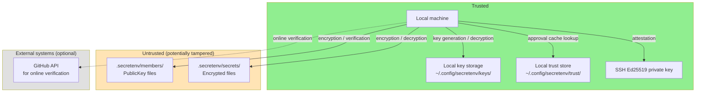
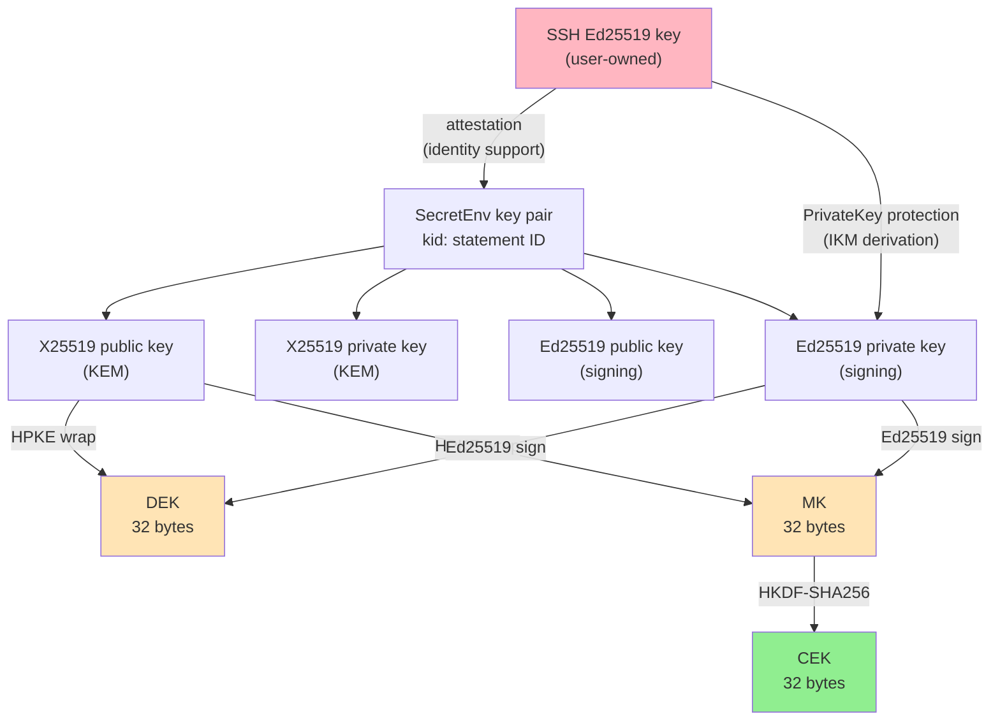
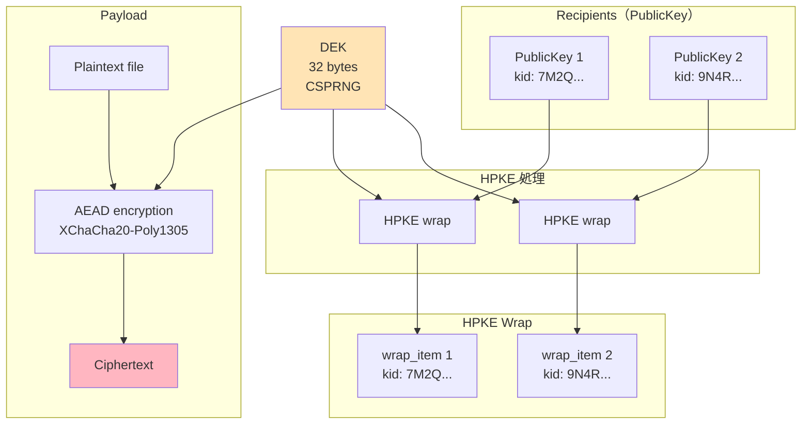
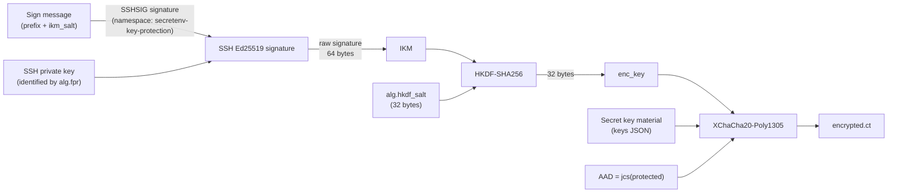
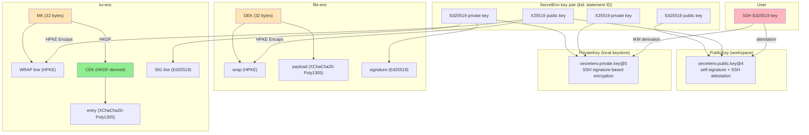

# SecretEnv Security Design

---

## 0. Document Information

### Executive Summary

SecretEnv protects team secrets (`.env` files, certificates, API keys) using modern standardized cryptography: HPKE (RFC 9180) for key delivery, XChaCha20-Poly1305 for content encryption, and Ed25519 for digital signatures. All encrypted artifacts are signed and verified before decryption.

**What SecretEnv guarantees by design:** confidentiality of encrypted content, tamper detection via signatures, cryptographic binding to prevent component swapping, and self-contained signature verification without external key servers.

**What SecretEnv does NOT guarantee:** prevention of insider misuse after decryption, recovery of previously disclosed secrets, strong forward secrecy, or identity assurance beyond TOFU (Trust On First Use). These are explicit non-goals, not oversights. In particular, if a device is compromised and the keys required for decryption are stolen, SecretEnv does not guarantee protection of past data that has already become decryptable.

**What users are responsible for:** properly managing the device, local keystore, and SSH key / signing inputs, reviewing PR changes to `members/active/`, verifying new members through out-of-band channels during TOFU approval, and rotating actual secret values when members are removed.

Users can judge whether SecretEnv is safe to operate in their environment by checking whether they can sustain these operational responsibilities.

For operational guidance, see the User Guide. For the full security analysis, continue reading this document.

### Purpose of This Document

This document organizes the security design of SecretEnv and clarifies both its protection targets and its underlying assumptions. Its purpose is to present SecretEnv's security claims, the conditions required for those claims to hold, the design-level verification points, the residual risks, and the explicit non-goals in a coherent form.

Each section is written not only to describe algorithms and data structures, but also to show which design decisions support which security claims, and where operational assumptions and constraints remain.

### Intended Audience

This document primarily serves two audiences. Each audience may focus on different sections:

| Audience | Primary sections | Purpose |
|----------|-----------------|---------|
| **Security reviewers / auditors** | §2 (threat model), §3 (primitives), §10 (context binding), §11 (attack scenarios), §12 (checkpoints), §13 (limitations) | Evaluate the security claims, assumptions, residual risks, and review points |
| **Users / operators / decision makers** | Executive Summary, §1 (overview), §2.1–§2.4 (threat model summary), §7.4–§9 (operational assumptions and trust boundary), §13 (limitations), Appendix B (operations checklist) | Decide whether SecretEnv can be operated safely in their environment and what limits they must accept |

---

## 1. Security Overview

SecretEnv is an offline-first encrypted file sharing CLI tool for safely sharing secrets such as `.env` files and certificates within a team. It can use a Git repository as a distribution medium, but does not depend on Git's existence.

### 1.1 Key Design Points

1. **security claims**: what is cryptographically protected and what is delegated to operational assumptions
2. **trust boundary**: local private keys, the local keystore, and the local trust store reside on the user's device; workspace `members/active`, `members/incoming`, and `secrets` are treated as tamperable repository inputs
3. **role-separated trust policy**: `signer_pub` is the input to cryptographic signature verification, `members/active` is the authorization source for the current member/recipient set, and `known_keys` is a TOFU approval cache
4. **limits of key identity**: self-signature and attestation show key consistency and key binding, but identity cannot be established by any single mechanism. Manual approval and online verify provide additional evidence for identity decisions
5. **context binding**: `sid` / `kid` / `k` / `p` are used to prevent reuse and mix-ups
6. **critical implementation invariants**: signature-before-decrypt, preserving bindings, fail-closed behavior when `signer_pub` is missing, and limiting `SECRETENV_STRICT_KEY_CHECKING=no` to read-path

### 1.2 Security Claims and Verification

| security claim | Main mechanism | How this is ensured | Assumption | Residual risk |
|---------------|----------------|------------------------------|------------|---------------|
| **Confidentiality** | HPKE wrap + XChaCha20-Poly1305 | Encrypt plaintext with a per-file CEK (AEAD), and wrap that CEK to each recipient with HPKE | Recipient private keys are not compromised | Legitimate recipients can still exfiltrate plaintext |
| **Tamper detection** | Ed25519 signatures | Sign the ciphertext and relevant metadata, and reject any data whose signature does not verify | Verification is never bypassed | A malicious legitimate signer is not prevented |
| **Self-contained verification of signed artifacts** | Mandatory `signer_pub` + PublicKey verification | Always obtain the signature verification key from embedded `signer_pub`, verify its self-signature, attestation, and `kid`, then verify the artifact signature | Every signed artifact embeds `signer_pub` | Current membership still depends on separate trust policy checks |
| **Context binding** | `sid` / `kid` / `k` / `p` in info / AAD | Bind `sid` / `kid` / `k` / `p` into HPKE info and payload AAD so reuse and substitution do not hold across contexts | The implementation preserves the intended binding points | Security weakens if a future change removes a binding |
| **Key consistency** | PublicKey self-signature | Protect each PublicKey with a self-signature so tampering with an existing key statement does not hold | The original private key is not compromised | It does not prevent creation of a brand new malicious key |
| **Current-trust decision** | `members/active` + `known_keys` | Treat `members/active` as the authorization source and `known_keys` as an approval cache, with separate read-path and write-path checks | Repo governance and user approvals work as intended | Weak against bootstrap TOFU, repo compromise, and misapproval |
| **Stronger key identity evidence** | SSH attestation + manual approval + online verify | The layers are not misrepresented as equivalent proofs; online verify is treated as supplementary evidence with a present-time check | Manual approval is executed correctly | Weak against first-contact MITM and GitHub/SSH compromise |
| **Portable private key use** | Password export or SSH-based protection | CI use meets the stated trust conditions | Used only in a trusted CI context | Storing both secrets in the same backend is not independent defense |

### 1.3 Terminology Used Here

| Term | Meaning in this document |
|------|--------------------------|
| **Key consistency** | Evidence that the same private key holder created the PublicKey; not identity by itself |
| **Identity assurance** | Operational evidence that helps a human decide which person or account a key belongs to |
| **approval cache** | A local cache that lets a user skip re-review for a `kid` they have already confirmed |
| **current member set** | The set of `(member_id, kid)` pairs obtained from the current workspace's `members/active` |
| **non-member acceptance** | An interactive, one-shot, artifact-scoped exception for a signer not present in current `members/active` |
| **trust boundary** | The boundary between inputs trusted as-is and inputs assumed tamperable until validated |
| **residual risk** | Risk that remains even with a correct implementation, or when an operational assumption is not met |

---

## 2. Threat Model and Trust Boundary

### 2.1 Attacker Model

| Attacker | Capability | Assumed Scenario |
|----------|-----------|----------------|
| **Repository tamperer** | Can arbitrarily tamper with files under `.secretenv/` | Malicious CI, compromised Git server, unauthorized push |
| **Public key substituter** | Can replace `members/active/<id>.json` or `members/incoming/<id>.json` with a forged public key | MITM during new member addition, unauthorized commit to repository |
| **Key rotation attacker** | Retains old-generation wraps and attempts decryption with new keys | Exploiting weaknesses in the key update process |
| **Context confusion attacker** | Swaps ciphertext components between different secrets | Copy-and-paste across encrypted files |
| **First-contact MITM** | Replaces bootstrap-time `kid`, GitHub account information, or attestation fingerprint with attacker-controlled values | First clone, first encounter with a signer |
| **Local trust store tamperer** | Can write to or roll back `<SECRETENV_HOME>/trust/` | Replacing `known_keys`, rewinding approval history |

### 2.2 Operational Assumptions

The attacker model above assumes repository write access is properly controlled. In the main target environment of Git + GitHub operation, changes to `members/active/` are checked through PR review. `members/active` is the authorization source for the current member set / current recipient set, but it is not a cryptographic trust anchor.

When Git is used as the distribution medium, it is unavoidable that legitimate repository users can retrieve old artifacts from historical commits. As a result, a repository-level rollback / rewind, where an attacker or insider with write access restores a historically valid encrypted file to the current HEAD, is not something SecretEnv can detect from its cryptographic bindings alone (`sid`, `kid`, `k`, `p`). Those bindings guarantee artifact integrity and context consistency, not freshness or monotonicity against Git history.

This class of risk is therefore treated as a repo-governance issue outside SecretEnv's crypto design. The operational assumption is that protected branches, required review, change management, and pre-deployment checks prevent old secret artifacts from being promoted back to current HEAD.

It also assumes `<SECRETENV_HOME>/trust/` resides on the user's device and is protected by OS / filesystem access control. Signatures on the local trust store are used for integrity checks, corruption detection, and format validation, but they do not fully protect against consistent replacement or rollback inside that area.

Initial bootstrap and first-seen `kid` approval rely on TOFU. As a result, first-contact MITM and whole-workspace substitution are outside the scope of cryptographic prevention. The crypto design must therefore be evaluated separately from distribution-medium controls, review workflow, and any out-of-band verification.

### 2.3 Trust Boundary



**Trusted elements:**
- Local machine and local key storage (`~/.config/secretenv/keys/`)
- Local trust store (`~/.config/secretenv/trust/`), but only as a user-local approval cache, not as the authority for current trust
- User's SSH Ed25519 private key
- GitHub API (only during online verification, optional)

**Untrusted elements:**
- Workspace `members/active/` and `members/incoming/` — untrusted repository data. PublicKeys themselves are verified by self-signature and attestation, while use of these directories as the authority for current membership depends on repo governance
- Workspace `secrets/` directory — verified by signatures

Within this trust boundary, the SSH private key plays two roles (detailed in §7.2): it signs attestations that bind a SecretEnv public key to an SSH key, and it provides the signatures from which the symmetric key that decrypts the PrivateKey file (`private.json`) in the local keystore is re-derived each time. The PrivateKey material itself lives in an independent file in the local keystore.

Decryption of a SecretEnv key therefore succeeds when the actor can reach the PrivateKey file (`private.json`) in the local keystore and produce an SSH signature over the message derived from that file's contents. Because the message to be signed is derived from the PrivateKey file's contents, access to an ssh-agent (including via agent forwarding) or to SSH signing capability gains relevance for PrivateKey protection only when combined with reach to the local keystore. If an attacker obtains both `private.json` and the corresponding SSH private key or SSH signing authority, historical ciphertexts addressed to that key become decryptable. Under normal operation the SSH key and the local keystore live together on the same device, so a device compromise can bring those conditions together.

### 2.4 Design Scope Summary

| Item | Implication |
|------|----------------------|
| **Guaranteed by design** | Confidentiality, tamper detection, context binding, key-generation binding, key consistency, self-contained signature verification via `signer_pub` |
| **Depends on operational assumptions** | Identity decisions, review of `members/active` changes, TOFU approval, protection of the local trusted area (workstation, local keystore, local trust store, SSH keys / signing inputs), safe CI execution conditions |
| **Not guaranteed** | Insider misuse prevention, recovery of prior disclosure, strong forward secrecy, bootstrap authenticity, whole-workspace substitution, centralized authorization policy |
| **Most important implementation checks** | Signature verification order, preserving bindings, mandatory `signer_pub`, no signer lookup fallback, separation of `members/active` vs `known_keys` |

### 2.5 Trust Model

SecretEnv's trust model intentionally separates cryptographic verification, current-membership decisions, and user approval. Rather than having a single mechanism decide both 'whose key is this?' and 'should it be accepted now?', the system applies the following four layers. The User Guide presents a simplified operational view of these layers; this section provides the full model with the rationale behind each layer.

Note: Layers 2–4 reference protocol elements (`members/active`, `known_keys`, the local trust store) that are described in detail in §4–§9. This overview introduces the trust model at the conceptual level; readers are encouraged to revisit this section after reading the protocol details.

| Layer | Mechanism | What it establishes | What it does NOT establish |
|-------|-----------|---------------------|---------------------------|
| **1. Cryptographic verification** | `signer_pub` + PublicKey verification | Cryptographic authenticity of the artifact and the signing key | Identity of the key holder |
| **2. Authorization** | `members/active` | Current membership / current recipient set | Cryptographic trust (depends on repo governance) |
| **3. Approval cache** | `known_keys` in local trust store | Previously approved `kid`s | Current membership |
| **4. Manual approval + online verify** | TOFU approval, GitHub API | Supplementary evidence for identity decisions | Cryptographic proof of identity |

**Layer 1: Cryptographic verification**

Signed artifacts always include `signature.signer_pub`, and the signature verification key is always obtained from that embedded PublicKey. The implementation verifies self-signature, attestation, `kid` consistency, and expiration, and thereby self-containedly determines which key statement signed the artifact. `members/active` is not used for signer lookup.

This layer establishes cryptographic authenticity through the following properties:

- **Self-signature (key consistency)**: The self-signature included in a PublicKey shows that the entity that created this PublicKey holds the corresponding private key. This supports **consistency** of the key, but does not establish **identity**. An attacker who creates a new SecretEnv key pair can generate a PublicKey with a valid self-signature. The role of self-signature is limited to **tamper prevention** of existing PublicKeys. Modifying any field of a PublicKey in `members/active/` or `members/incoming/` will cause self-signature verification to fail.
- **SSH attestation (key binding)**: SSH attestation cryptographically ties a SecretEnv key pair to an SSH key. The attestation signed_data is fixed to the SSHSIG namespace `secretenv-attestation`, which separates this signature context from PrivateKey protection. However, who owns the SSH key itself cannot be determined by attestation alone. An attacker can generate valid attestation by attesting their SecretEnv key with their own SSH key.

**Layer 2: Authorization (`members/active`)**

The current workspace's `members/active` is the authorization source for the current member set / current recipient set. On read-path it requires the signer's `(member_id, kid)` to be in the current member set, and on write-path it is the source of recipients.

However, `members/active` is not a cryptographic trust anchor. It is untrusted repository data whose authenticity depends on repo governance, specifically Git access control and PR review.

**Layer 3: Approval cache (`known_keys`)**

The local trust store is a signed JSON document in `secretenv.trust.local@2` format. Through `known_keys[]`, it records `kid`s the user has already reviewed once. This is an approval cache, not the authority for current trust.

- It does not distinguish signer vs recipient
- It does not distinguish workspaces
- Presence in `known_keys` does not imply current membership
- The user's own keys that already exist in the local keystore normally do not need to be recorded in `known_keys`, because the local keystore is the trust anchor for self; this skips only the approval-cache check and does not skip the `members/active` authorization check

**Layer 4: Manual approval and online verify**

When approving an unseen `kid`, the user reviews the `kid`, the `attestation.pub` fingerprint, and when available the GitHub account `id` / `login`. This is a TOFU model similar to SSH `known_hosts`: it does not cryptographically establish identity, but provides evidence for an acceptance decision. GitHub API online verification is supplementary evidence and does not establish identity on its own.

The important detail is that online verify is not a historical proof but a **present-time check**. It answers "is this PublicKey's `attestation.pub` still present in that GitHub account's current SSH key set at verification time?" rather than "was it ever registered there in the past?" As a result, once the key owner removes that SSH public key from GitHub, future online verification that depends on that key will fail.

Operationally, this can be used as a lightweight revocation channel. For example, after suspected SSH attestor-key compromise, after offboarding, or after completing a key rotation, removing the old SSH public key from GitHub makes future trust updates and fresh approval flows less likely to accept that old key. This does not cryptographically invalidate existing attestation signatures, and it does not automatically revoke already approved `known_keys` entries or repository state in `members/active`. Online verify failure should therefore be interpreted as "stop future approvals for this key," while removal of existing trust or membership still requires separate action.

**Limited exceptions: non-member acceptance and `SECRETENV_STRICT_KEY_CHECKING=no`**

- non-member acceptance is an interactive, one-shot, artifact-scoped exception that accepts an artifact signed by a signer outside current `members/active` without restoring that signer to current membership or updating `known_keys`
- `SECRETENV_STRICT_KEY_CHECKING=no` skips only the `known_keys` check for explicitly requested read paths. It may be used in interactive runs when the operator explicitly sets it, and it never skips the `members/active` check or the cryptographic signature verification

**Composite trust**

Stronger confidence in key authenticity depends on the above layers working as intended. However, the ways this confidence can break down differ by attack scenario:

- **Tampering with existing keys**: Typically requires compromise of the original secret material needed to satisfy self-signature or attestation checks
- **Inserting a new key**: Can succeed if repo governance fails and the user mis-approves the TOFU prompt. The attacker can generate valid self-signature and attestation with their own keys, so compromise of the victim's keys is not required
- **SSH attestor private-key-only compromise**: Even with a healthy GitHub account, an attacker can create a malicious key carrying legitimate-looking attestor evidence
- **GitHub trust-domain compromise**: The GitHub information shown by online verify / manual review can itself be forged consistently
- **Local trust store tampering**: Once the local trusted area is broken, consistent replacement or rollback of `known_keys` cannot be fully prevented

---

## 3. Selection of Cryptographic Primitives

### 3.1 Algorithm Summary

| Algorithm | Parameters | RFC | Purpose |
|-----------|-----------|-----|---------|
| HPKE Base mode | suite `hpke-32-1-3` | RFC 9180 | Content Key wrap/unwrap |
| DHKEM(X25519, HKDF-SHA256) | kem_id=32 (0x0020) | RFC 9180 | KEM (key encapsulation) |
| HKDF-SHA256 | kdf_id=1 (0x0001) | RFC 5869 | KDF (key derivation) |
| ChaCha20-Poly1305 | aead_id=3 (0x0003) | RFC 8439 | HPKE internal AEAD |
| XChaCha20-Poly1305 | nonce 24 bytes, key 32 bytes | — | payload / entry / PrivateKey encryption |
| Ed25519 (PureEdDSA) | — | RFC 8032 | Signing and verification |
| HKDF-SHA256 | — | RFC 5869 | CEK derivation, PrivateKey enc_key derivation |
| JCS | — | RFC 8785 | Deterministic JSON canonicalization |
| base64url (no padding) | — | RFC 4648 §5 | Binary encoding |

### 3.2 HPKE (RFC 9180)

**Rationale:**
- A standardized hybrid public key encryption scheme with a consistent definition of the KEM + KDF + AEAD combination
- Base mode provides ephemeral key isolation per wrap (however, if a recipient's long-term key is compromised, all existing wraps for that recipient can be decrypted; see §13.1)
- Clear suite ID identification via IANA Registry

**Suite configuration:**
```
hpke-32-1-3
├── kem_id  = 32 (0x0020) DHKEM(X25519, HKDF-SHA256)
├── kdf_id  = 1  (0x0001) HKDF-SHA256
└── aead_id = 3  (0x0003) ChaCha20-Poly1305
```

**Comparison with alternatives:**

| Alternative | Reason for rejection |
|-------------|---------------------|
| RSA-OAEP | Large key size; Forward Secrecy cannot be naturally achieved |
| ECIES (custom construction) | Not standardized; high risk of misconfiguration |
| Age (X25519-ChaChaPoly) | Less structured than HPKE for this use; insufficient flexibility for info/AAD |

**Known limitations:**
- Base mode does not provide sender authentication (supplemented by signatures)
- X25519 provides 128-bit security level

### 3.3 XChaCha20-Poly1305

**Rationale:**
- 24-byte nonce makes random nonce collision risk practically negligible (birthday bound at 2^96)
- Consistent performance even in environments without AES-NI
- Does not provide misuse resistance, but practical security is ensured by the large nonce space

**Comparison with alternatives:**

| Alternative | Reason for rejection |
|-------------|---------------------|
| AES-256-GCM | 12-byte nonce has high collision risk in multi-key usage |
| AES-256-GCM-SIV | Nonce misuse resistance is appealing, but rejected due to implementation complexity and limited adoption |

**Known limitations:**
- Nonce reuse is catastrophic (encrypting with the same key and nonce is prohibited)
- Compression before encryption is prohibited (to avoid compression oracle attacks CRIME/BREACH)

### 3.4 Ed25519 (RFC 8032 PureEdDSA)

**Rationale:**
- **Deterministic signatures**: Always generates the same signature for the same input. An essential property for use as IKM in PrivateKey protection.
- Fast signing and verification
- Affinity with SSH ecosystem (ssh-ed25519)

**Comparison with alternatives:**

| Alternative | Reason for rejection |
|-------------|---------------------|
| ECDSA (P-256) | Non-deterministic signatures (mitigable with RFC 6979, but handling varies across SSH implementations) |
| Ed448 | Insufficient adoption in the SSH ecosystem |

**Known limitations:**
- 128-bit security level
- Context separation is not provided by PureEdDSA itself (addressed by JCS canonicalization + protocol identifiers)

### 3.5 HKDF-SHA256 (RFC 5869)

**Rationale:**
- Standardized key derivation function
- The `info` parameter allows safely deriving purpose-specific keys from the same IKM
- The `salt` parameter allows deriving different keys even from the same IKM and info

**Uses:**
- CEK derivation for kv-enc (MK + salt + sid → CEK)
- enc_key derivation for PrivateKey protection (SSH signature + salt + kid → enc_key)

### 3.6 JCS (RFC 8785)

**Rationale:**
- Provides deterministic canonicalization of JSON objects
- Eliminates ambiguity in key ordering and number representation, ensuring consistency of signatures, AAD, and HPKE info
- No ambiguity arises even when string fields like `sid` contain arbitrary characters

### 3.7 Security Guarantees and Limits Inherited from Standard Cryptographic Primitives

| Primitive | Assumed security property | Implication for SecretEnv |
|-----------|-------------------------------------------|----------------------------|
| HPKE Base mode (RFC 9180) | Provides confidentiality for recipient-specific key delivery, but does not provide sender authentication | Confidentiality of each recipient wrap depends on this, while producer authenticity and insider-attack resistance depend on Ed25519 signatures |
| XChaCha20-Poly1305 | Provides confidentiality and tamper detection as an AEAD, assuming nonces are not reused | Security of payload, entry, and PrivateKey protection depends on nonce uniqueness and does not tolerate nonce reuse |
| Ed25519 (PureEdDSA) | Provides unforgeability and tamper detection as long as the signing private key remains secret | Authenticity of encrypted files and PublicKey documents depends on this, and that guarantee collapses if the signing private key is compromised |
| HKDF-SHA256 | Can derive pseudorandom, purpose-separated keys from input key material with sufficient entropy | Key separation for CEKs and `enc_key` depends on this, but HKDF does not turn low-entropy input into high-entropy key material |

**Security dependency:**

- Overall confidentiality depends on both the confidentiality of HPKE for recipient-specific key delivery and the confidentiality of the AEAD that protects the payload itself. SecretEnv's overall confidentiality does not hold if either of these fails.
- Tamper detection depends on Ed25519 signatures. HPKE Base mode does not provide sender authentication by itself, so signatures provide the check that encrypted files and PublicKey documents were produced by the expected signer and have not been modified.
- Cryptographic independence between entries in kv-enc depends on the PRF security of HKDF-SHA256. In SecretEnv, a distinct CEK is derived for each entry from a high-entropy MK, so knowledge about one entry is not expected to directly reveal the CEK of another entry.

**Preconditions and limitations:**
- HPKE Base mode assumes confidentiality of the recipient's long-term private key. If the long-term key is compromised, all wraps for that recipient can be decrypted (see §13.1).
- XChaCha20-Poly1305 depends on nonce uniqueness in practice, and nonce reuse can lead to serious problems.
- Ed25519 assumes private key confidentiality. In SecretEnv, the signing private key is stored encrypted by PrivateKey protection (§7).

### 3.8 Nonce Safety Margin

XChaCha20-Poly1305 uses a 24-byte (192-bit) nonce. In SecretEnv's design, there are no cases where the same symmetric key is used for multiple encryptions. DEK (file-enc), CEK (kv-enc entry), and enc_key (PrivateKey protection) are each uniquely generated or derived per encryption, so the risk of nonce collision is structurally eliminated.

The choice of 192-bit nonce space serves as a safety net in case future design changes introduce same-key reuse.

### 3.9 Cryptographic Strength (Security Level)

The estimated cryptographic strength (security level) provided by each cryptographic primitive is as follows:

| Cryptographic Primitive | Key Size / Parameters | Estimated Strength (Classical) | Notes |
| --- | --- | --- | --- |
| X25519 (KEM) | 256 bits | 128 bits | Security against discrete logarithm problem |
| Ed25519 (Signatures) | 256 bits | 128 bits | Security against discrete logarithm problem |
| XChaCha20-Poly1305 | Key 256 bits | 256 bits | Symmetric key encryption strength |
| ChaCha20-Poly1305 | Key 256 bits | 256 bits | HPKE internal AEAD |
| HKDF-SHA256 | Output 256 bits | 256 bits | Based on hash function preimage resistance |

**Overall System Cryptographic Strength:**

The security of the overall system is constrained by the weakest link in the chain of cryptographic primitives.
In SecretEnv, the asymmetric cryptography that forms the foundation of data confidentiality (HPKE X25519) and authenticity (Ed25519) provides a 128-bit security level. Therefore, **the overall cryptographic strength provided by the system is equivalent to 128 bits**.

This provides a robust security level (equivalent to AES-128) sufficient for current general commercial systems. The use of 256-bit keys in the symmetric encryption parts (such as XChaCha20-Poly1305) is the result of selecting available standard, fast primitives, and does not elevate the overall system to a 256-bit security level.

---

## 4. Key Hierarchy and Key Lifecycle

### 4.1 Key Types and Relationships



This diagram intentionally separates the SSH key from the SecretEnv key pair.

- The **SSH key** is an external authentication key already owned by the user; it does not directly encrypt or sign SecretEnv workspace payloads
- The **SecretEnv key pair** is the application-specific key material used for encryption, decryption, signing, and verification inside the workspace
- The SSH key has only two roles
  - **attestation**: show which SSH key backs a SecretEnv public key. The SSHSIG namespace is `secretenv-attestation`
  - **PrivateKey protection**: derive the `enc_key` used to unlock the SecretEnv private key stored in the local keystore. The SSHSIG namespace is `secretenv-key-protection`

Therefore, the SSH key is not the SecretEnv key pair itself. It is an outer key used to support provenance checks and local protection of the SecretEnv key pair. Even when the same SSH key is reused for both roles, the signature contexts are separated by namespace.

### 4.2 Key Parameter Summary

| Key type | Size | Generation method | Purpose | Zeroization required |
|----------|------|------------------|---------|---------------------|
| SSH Ed25519 private key | 32 bytes | User-managed | attestation, PrivateKey protection | N/A (OS-managed) |
| X25519 private key (KEM) | 32 bytes | CSPRNG | HPKE unwrap | MUST |
| X25519 public key (KEM) | 32 bytes | Derived from X25519 private key | HPKE wrap | — |
| Ed25519 private key (signing) | 32 bytes | CSPRNG | Signature generation | MUST |
| Ed25519 public key (signing) | 32 bytes | Derived from Ed25519 private key | Signature verification | — |
| DEK (Data Encryption Key) | 32 bytes | CSPRNG | file-enc payload encryption | MUST |
| MK (Master Key) | 32 bytes | CSPRNG | CEK derivation source for kv-enc | MUST |
| CEK (Content Encryption Key) | 32 bytes | Derived via HKDF-SHA256 | kv-enc entry encryption | MUST |
| enc_key (for PrivateKey protection) | 32 bytes | Derived via HKDF-SHA256 | PrivateKey AEAD encryption | MUST |

Notes:

- `enc_key` is not a stored or pre-existing key; it is a transient symmetric key derived from SSH signing output each time
- The same SSH key can protect multiple SecretEnv key statements, but different `kid` / `salt` values produce different `enc_key` values
- The `private.json` stored in the local keystore contains only the ciphertext of SecretEnv private key material; the SSH private key itself remains outside SecretEnv storage

### 4.3 Recipient Eligibility

Only members listed in `members/active/` are included as recipients during encryption operations. Members in `members/incoming/` cannot decrypt any existing secrets until they are promoted to active membership via `rewrap`.

### 4.4 Key Lifecycle

A SecretEnv key pair transitions through a lifecycle from generation to expiration, and is eventually replaced through key rotation.

```
generated → active → expired
              │
              └── rotate (generate a new key pair and switch)
```

The behavior in each state is as follows:

- **Generated**: A new key pair and PublicKey document are created using the `key new` command and saved to the local keystore.
- **Active**: The state before `expires_at` is reached. The key can be used for new encryption (wrap) and signing operations, as well as for decryption and verification.
- **Expired**: The state after `expires_at` has passed. New encryption (wrap) and signing operations are rejected. However, decryption and verification of data legitimately signed in the past are permitted with a warning.
- **Rotate**: The active key is replaced by generating a new key pair (with a new `kid`) using commands like `rewrap --rotate-key`. The old key is retained for decryption and verification until it expires.

#### 4.4.1 Immutability of Key Statement ID (kid)

Each key pair is associated with a `kid` (key statement ID). The `kid` is a 32-character Crockford Base32 string without hyphens, deterministically derived from the contents of the self-signed `PublicKey@4.protected` (which includes the public key, identity, binding_claims, expiration metadata, etc.).

Because `kid` is derived from the PublicKey contents, **`kid` equality implies strict equality of the key statement content**. If any field changes, the result is treated as an entirely new key pair with a different `kid`.

### 4.5 Key Rotation

Key rotation is performed by the `rewrap` command. The behavior differs between file-enc and kv-enc and between recipient changes and explicit `--rotate-key`. See §6.8 for the full comparison after both protocols have been introduced.

---

## 5. file-enc Protocol

file-enc encrypts a single file for multiple recipients. A random per-file key (DEK) encrypts the entire content using XChaCha20-Poly1305, and each recipient receives a HPKE-wrapped copy of the DEK. The complete structure is signed with Ed25519, and tampering is detected before any decryption occurs.

### 5.1 Data Structure Overview

file-enc is a JSON-based signed container. The elements that matter most for review are the following.

| Element | Content | Security role |
| --- | --- | --- |
| `protected.sid` | File identifier | Binds wrap, payload, and signature to the same file context |
| `wrap[]` | Per-recipient DEK delivery data | Uses `kid` and `sid` in the HPKE context to prevent reuse across key generations or files |
| `payload.protected` | Payload header | Carries `sid` and the AEAD algorithm, and its JCS-canonicalized form becomes the AAD |
| `payload.encrypted` | Nonce and ciphertext | Holds the file body protected by the DEK |
| `signature` | `signature_v4` signature | Protects the integrity of the full `protected` object, including wrap and payload |

`wrap[].rid` is informational and helpful for review, but it is not the cryptographic lookup key. Recipient binding is keyed by `kid`.

The full document layout is as follows.

```json
{
  "protected": {
    "format": "secretenv.file@3",
    "sid": "<UUID>",
    "wrap": [
      {
        "rid": "<member_id>",
        "kid": "<canonical kid>",
        "alg": "hpke-32-1-3",
        "enc": "<b64url>",
        "ct": "<b64url>"
      }
    ],
    "removed_recipients": [
      {
        "rid": "<member_id>",
        "kid": "<canonical kid>",
        "removed_at": "<RFC3339>"
      }
    ],
    "payload": {
      "protected": {
        "format": "secretenv.file.payload@3",
        "sid": "<UUID>",
        "alg": { "aead": "xchacha20-poly1305" }
      },
      "encrypted": {
        "nonce": "<b64url>",
        "ct": "<b64url>"
      }
    },
    "created_at": "<RFC3339>",
    "updated_at": "<RFC3339>"
  },
  "signature": {
    "...": "artifact signature"
  }
}
```

This layout places `wrap`, optional `removed_recipients`, and `payload` inside `protected`, so they are all covered by the outer signature. The payload also carries its own `payload.protected` header, whose JCS-canonicalized form becomes the AEAD AAD, giving the payload header its own binding layer in addition to the outer signature.

### 5.2 Encryption Flow



1. Generate the DEK as 32 bytes of cryptographically secure randomness.
2. For each recipient, wrap that DEK with HPKE Base mode (`hpke-32-1-3`).
3. JCS-canonicalize the payload header and use it as AAD while encrypting the file body with XChaCha20-Poly1305.
4. JCS-canonicalize the full `protected` object and sign it with Ed25519.

This order keeps key delivery, payload binding, and document integrity as distinct protection layers.

### 5.3 DEK Generation

- The DEK is 32 bytes of cryptographically secure randomness, generated independently for each artifact.
- In file-enc, the DEK is the central confidentiality key for the file payload.
- The implementation aims to zeroize it after use, although complete erasure remains best-effort as discussed in §12.3.

### 5.4 HPKE wrap

- The HPKE suite is `hpke-32-1-3`; the relevant parameters are described in §3.1 and §3.2.
- The wrap context includes the recipient key generation `kid`, the protocol identifier `p = secretenv:file:hpke-wrap@3`, and the file identifier `sid`.
- HPKE `info` and `AAD` use the same JCS-canonicalized context bytes. This keeps the key-schedule path and AEAD-verification path aligned and makes implementation drift surface early as unwrap failure.
- The recipient member ID remains operationally important, but cryptographic wrap binding is keyed by `kid`.

### 5.5 Payload Encryption

- The payload header carries `format = secretenv.file.payload@3`, the same `sid` as the outer container, and the AEAD identifier `xchacha20-poly1305`.
- `jcs(payload.protected)` is used as AAD, with a random 24-byte nonce for XChaCha20-Poly1305.
- Keeping `sid` at the payload layer binds the payload to the file context independently of the outer signature.

### 5.6 Decryption Flow

1. Perform structural validation, `signer_pub` validation, and artifact-signature verification.
2. Apply the trust policy from §9 to determine whether the artifact is acceptable in the current workspace.
3. Select the matching wrap by the local `kid` and perform HPKE unwrap with the same context.
4. Confirm that the outer `sid` and payload `sid` match, then perform AEAD decryption.
5. Reject fail-closed on any mismatch or verification failure.

The key invariant is that SecretEnv never decrypts before signature verification.

---

## 6. kv-enc Protocol

kv-enc encrypts `.env`-style key-value entries individually. It uses a two-layer key structure: a Master Key (MK) is HPKE-wrapped for each recipient, and per-entry Content Encryption Keys (CEKs) are derived from the MK via HKDF. This design enables partial decryption of individual entries and efficient updates without re-encrypting the entire file.

### 6.1 Data Structure Overview

kv-enc is a line-based signed document. The structures that matter most for review are the following.

| Line type | Content | Security role |
| --- | --- | --- |
| `:SECRETENV_KV 3` | Format and version marker | Being part of the signed body helps prevent downgrade attacks |
| `:HEAD` | File context such as `sid` and timestamps | Binds wraps and entries to a single file context |
| `:WRAP` | HPKE-wrapped MK and removal history | Represents recipient state and key-distribution state |
| `KEY` lines | Per-entry ciphertext | Self-contained encrypted units carrying salt, nonce, and AEAD metadata |
| `:SIG` | Document signature | Protects the integrity of the entire body except the signature line itself |

Each token is represented as a JCS-canonicalized JSON object encoded in base64url.

The full document layout is as follows.

```text
:SECRETENV_KV 3
:HEAD <token>
:WRAP <token>
<KEY> <token>
<KEY> <token>
...
:SIG <token>
```

`:HEAD` carries the file `sid` and timestamps. `:WRAP` carries the MK wrap set and removal history. Each KEY-line token is a self-contained encrypted unit containing `salt`, `k`, `aead`, `nonce`, and `ct`. The signature covers the entire body except `:SIG`, and the canonical signed form is the LF-terminated concatenation of the data lines.

### 6.2 Design Rationale for Two-Layer Key Structure

kv-enc uses one MK per file, while each entry CEK is derived as `HKDF-SHA256(MK, salt, sid)`.

This two-layer structure exists for four reasons.

- Updating one entry with `set` does not require re-encrypting every other entry.
- `get` can decrypt only the entry that is needed.
- Recipient addition can reuse the existing MK and add only new wraps.
- Recipient removal must rotate the MK so removed recipients cannot continue deriving future entry keys.

### 6.2.1 Encryption/Decryption Flow Overview


On encryption, SecretEnv first generates the MK and HPKE-wraps it to each recipient. It then generates a salt for each entry, derives a CEK using HKDF with `sid` in the context, encrypts the entry with AEAD, and finally signs the full document body except `:SIG`.

On decryption, it verifies the signature first, applies the trust policy from §9, unwraps the MK, and derives CEKs only for the entries that need to be read. Each entry is then decrypted with AAD that includes `k`, `sid`, and `p`.

As with file-enc, signature verification always precedes decryption.

### 6.3 CEK Derivation

- CEK derivation uses HKDF-SHA256 with context that includes `p = secretenv:kv:cek@3` and `sid`.
- The salt is independently generated for each entry.
- Including `sid` in the derivation context ensures that copying an entry to a different file does not reproduce the same CEK.

### 6.4 Entry AAD

- Entry AAD includes the dotenv key name `k`, the file identifier `sid`, and the protocol identifier `p = secretenv:kv:payload@3`.
- Including `k` prevents entry swapping within the same kv-enc document.
- Including `sid` aligns the payload context with the CEK-derivation context.
- `salt` is already consumed by HKDF, and `recipients` is intentionally excluded so that rewrap can replace wraps without forcing payload re-encryption.

### 6.5 HPKE wrap (kv)

- kv-enc wraps also include `kid`, `sid`, and `p = secretenv:kv:hpke-wrap@3`.
- As in file-enc, HPKE `info` and `AAD` use the same canonicalized context bytes.
- This makes key-generation binding and file-context binding explicit while turning implementation drift into unwrap failure.

### 6.6 Partial Decryption (get / set)

The main benefit of kv-enc is that it can operate on individual entries without decrypting the whole document.

- `get` verifies the signature, unwraps the MK, derives the CEK for the requested key, and decrypts only that entry.
- `set` follows the same validation path, then generates a fresh salt and CEK only for the updated entry before regenerating the signature.

### 6.7 Behavior on Recipient Removal

When a recipient is removed, kv-enc regenerates the MK and re-encrypts all entries under CEKs derived from the new MK. This prevents a removed recipient who retained the old MK from continuing to derive future entry keys.

At the same time, `removed_recipients` and `disclosed` are updated so operators can decide which real secret values must also be rotated in external systems. These are operational visibility aids, not recovery mechanisms.

### 6.8 Key Rotation Behavior Across Both Formats

`rewrap` updates wrap entries (recipient addition/removal). `rewrap --rotate-key` regenerates the content key and re-encrypts the entire payload.

| Operation | Format | Content Key | Wrap | Payload |
|-----------|--------|-------------|------|---------|
| Add recipients | file-enc | DEK maintained | Added | Maintained |
| Add recipients | kv-enc | MK maintained | Added | Maintained |
| Remove recipients | file-enc | DEK maintained | Removed | Maintained |
| Remove recipients | kv-enc | **MK regenerated** | Rebuilt | **Re-encrypted** |
| `--rotate-key` | file-enc | DEK regenerated | Rebuilt | Re-encrypted |
| `--rotate-key` | kv-enc | MK regenerated | Rebuilt | Re-encrypted |

For recipient addition, both formats maintain the content key and add new wrap entries.

For recipient removal, the behavior differs by format. In file-enc, the removed recipient's wrap entry is deleted and a removal history is recorded, but the DEK is unchanged. In kv-enc, the MK is always regenerated and all entries are re-encrypted. This is because the MK is a long-lived key from which per-entry CEKs are derived (§6.3) — if a removed member retains knowledge of the old MK (e.g., from a prior decryption session), they could derive CEKs for entries added after their removal. Regenerating the MK eliminates this risk.

`--rotate-key` forces full re-encryption in both formats regardless of recipient changes, and is intended as a post-compromise damage-limitation measure.

---

## 7. PrivateKey Protection

### 7.1 Overview

SecretEnv's PrivateKey (KEM private key + signing private key) is stored in the user's local keystore (`~/.config/secretenv/keys/`) as an independent file `private.json`, one per key generation. HPKE unwrap and Ed25519 signing operate on the PrivateKey material extracted from that file.

PrivateKey protection is designed as a two-layer structure.

- Layer 1: the local keystore itself sits inside the trust boundary. OS / filesystem access controls and ownership of the keystore directory confine access to `private.json` to processes acting under the same user's authority. In normal operation this is the primary defense.
- Layer 2: the contents of `private.json` (the encrypted portion holding the key material) are themselves encrypted under a symmetric key. That symmetric key is a per-use ephemeral value, re-derived each time the PrivateKey is needed. This layer adds confidentiality in case the PrivateKey file itself leaks outside the trust boundary.

Two modes re-derive that Layer-2 symmetric key. The PrivateKey material's format and storage location are shared between both modes: they use the same local keystore layout (§7.1.2) and the same ciphertext field. However, the SSH-based and password-based modes use different derivation procedures and different HKDF info strings, so a key derived for one mode cannot be reused as if it belonged to the other.

- SSH-based protection (§7.2): derives the symmetric key from a signature produced by the user's existing SSH Ed25519 key. Intended for normal interactive use and eliminates the need to manage a SecretEnv-specific password.
- Password-based protection (§7.3): derives the symmetric key from a user-supplied password via Argon2id + HKDF. Intended for CI/CD environments where SSH keys and `ssh-agent` are unavailable.

Trust assumptions common to both are covered in §7.4.

### 7.1.1 Relationship Between the SSH Key and the SecretEnv Key Pair

- The SSH key is an **existing user-owned authentication key** outside SecretEnv
- The SecretEnv key pair is an **application-specific key pair** managed per `kid`
- On the PublicKey side, the SSH key appears in attestation, showing which SSH key is bound to the SecretEnv key pair
- On the PrivateKey side, the same SSH key protects the encrypted SecretEnv private key stored in the local keystore

The SSH key and the SecretEnv key pair are therefore not fused into a single key. One SSH key may protect multiple generations of SecretEnv keys, while the actual file-enc / kv-enc cryptographic operations are performed by the SecretEnv key pair after it has been decrypted.

### 7.1.2 Local Keystore Layout

Each `kid` directory in the local keystore (a key-statement directory) contains two files.

- `public.json`: a PublicKey document that can be distributed to the workspace
- `private.json`: an encrypted SecretEnv private key document

When loading keys from the local keystore, if `private.json` is used, the sibling `public.json` in the same directory is also loaded and verified as a PublicKey, and the implementation confirms `private.protected.member_id == public.protected.member_id` and `private.protected.kid == public.protected.kid`. This is a local keystore invariant intended to detect swapped public/private pairs or other broken local state early. When loading keys via the `SECRETENV_PRIVATE_KEY` environment variable, this sibling `public.json` check is intentionally not assumed.

`private.json` itself has two layers.

- `protected`: header fields such as `member_id`, `kid`, `alg.fpr`, `alg.ikm_salt`, `alg.hkdf_salt`, `created_at`, and `expires_at`; these define the decryption conditions and tamper-detection scope
- `encrypted`: the ciphertext containing the actual SecretEnv private key material

Here `alg.fpr` is only an identifier for the SSH key used to protect that key generation. It is not the SSH private key itself.

### 7.2 SSH-Based Protection

SSH-based protection re-derives the symmetric key that encrypts the contents of the PrivateKey file (`private.json`) from an SSH signature each time the PrivateKey file has to be read. This is how the scheme keeps the PrivateKey file encrypted without any SecretEnv-specific password.

The symmetric key used to encrypt the file contents (`enc_key`) is a separate, HKDF-derived key built from the SSH signature's output, distinct from the SSH private key itself. `enc_key` is treated as a per-use ephemeral value and is re-derived by repeating the same procedure whenever the PrivateKey file is opened. Re-deriving `enc_key` requires both the SSH key's signing capability and the target `private.json`'s `protected` header.

### 7.2.1 Key Derivation Pipeline

The protection path is a three-stage pipeline.

| Stage | Input | Output | Security role |
| --- | --- | --- | --- |
| SSHSIG signing | Sign message (`secretenv:key-protection-ikm@5` and `ikm_salt`), namespace `secretenv-key-protection`, hash algorithm `sha256` | Raw Ed25519 signature bytes | Ensures that only an actor with SSH signing capability can obtain the signature bytes used as IKM input |
| HKDF-SHA256 | Raw signature bytes, salt = `hkdf_salt`, info = `secretenv:sshsig-private-key-enc@5:{kid}` | `enc_key` | Converts the signature bytes into an `enc_key` scoped to that key generation, so it does not mix with other `kid`s |
| XChaCha20-Poly1305 | `enc_key`, AAD = `jcs(protected)` | `encrypted.ct` | Encrypts the private key material and makes tampering in the `protected` header fail at decryption time |

The following diagram visualizes this derivation path.



The `enc_key` produced by this pipeline is the symmetric key used to encrypt and decrypt `encrypted.ct` in `private.json`. If AEAD decryption succeeds, the inner SecretEnv private key material is recovered.

Signatures follow OpenSSH `PROTOCOL.sshsig`. The `secretenv-key-protection` namespace is separate from the attestation namespace `secretenv-attestation`, so SSH signatures used for attestation and for PrivateKey protection cannot be confused. In addition, `kid` is not part of the SSH sign message itself; it is placed in the HKDF info string so that the same SSH key still yields different `enc_key` values for different key generations.

AAD is `jcs(protected)`. This makes the entire `protected` header part of tamper detection during decryption. `enc_key` is not a stored fixed key; it is re-derived from SSH signing capability during both encryption and decryption.

### 7.2.2 Determinism Check

Ed25519 (RFC 8032 PureEdDSA) is expected to be deterministic. During encryption, SecretEnv signs the same signed_data twice and confirms that the extracted raw signature bytes match. If they do not, processing aborts.

The reason is that using the signature value as IKM makes non-determinism fatal: encryption and decryption would derive different `enc_key` values and decryption would fail. This check also serves to exclude non-deterministic signers such as FIDO2 Ed25519-SK tokens from this mode early.

### 7.2.3 Confidentiality of the Signature Value Used as IKM

The raw Ed25519 signature value used here as IKM is not treated like an ordinary signature value that can be freely exposed for verification. In this path, the signature value itself is directly tied to PrivateKey decryption capability, so it is treated as secret material rather than as a public signature artifact.

The implementation-side memory-hygiene and logging-hygiene implications are discussed later in §12.3, "Memory Handling of Secrets."

### 7.2.4 Conditions for Successful Decryption

To decrypt `private.json` in the local keystore, all of the following conditions must hold.

1. The SSH key corresponding to `protected.alg.fpr` must be usable
2. That SSH key must be able to provide the deterministic signatures required by this scheme
3. The sign message must be reconstructible from `protected.alg.ikm_salt`
4. `protected` must be untampered so that AAD verification over `jcs(protected)` succeeds

Given these, actual decryption proceeds in three steps.

1. When loading from the local keystore, verify the sibling `public.json` and confirm `member_id` / `kid` consistency
2. Reconstruct IKM and `enc_key` from the target private.json protected header (`ikm_salt`, `hkdf_salt`, `kid`) plus SSH signing capability
3. Decrypt using `jcs(protected)` as AAD so that header tampering is detected

Accordingly, the symmetric key that decrypts the PrivateKey file is reconstructed to the same value whenever a corresponding SSH signature is obtained. Any actor that can reach the contents of `private.json` and produce an SSH signature over the message derived from those contents can reconstruct that symmetric key and decrypt the PrivateKey file. Trust assumptions are discussed in §7.4.

### 7.3 Password-Based Protection

As an alternative to SSH-based protection, SecretEnv supports password-based private key protection using `argon2id-m64t3p4-hkdf-sha256`. This scheme is designed for CI/CD environments where SSH keys and `ssh-agent` are unavailable.

### 7.3.1 Use Case

Many CI platforms provide "secret variables" that are stored securely and exposed as environment variables at runtime. This protection scheme enables exporting a SecretEnv private key in a portable, password-protected format that can be registered as a CI secret variable and used without any SSH infrastructure.

### 7.3.2 Key Derivation Pipeline

In this scheme, Password plus `ikm_salt` is fed into Argon2id to derive a 32-byte IKM, and that IKM plus `hkdf_salt` is then fed into HKDF-SHA256 to derive the encryption key. The HKDF info string is `secretenv:password-private-key-enc@5:{kid}`, which is intentionally distinct from the SSH-based path (`secretenv:sshsig-private-key-enc@5:{kid}`) for domain separation.

`ikm_salt` is reserved for Argon2id and `hkdf_salt` for HKDF so that the two derivation steps remain clearly separated.

### 7.3.3 Argon2id Parameters and Password Requirements

- Fixed parameters at export time: m=65536 (64 MiB), t=3, p=4 — following the "second recommended" option from RFC 9106, Section 4
- Parameters are fixed by the implementation and are not serialized in the private key document
- Minimum password length: 8 characters. This is the implementation-enforced floor, not a recommendation. Users are responsible for choosing a sufficiently strong password. For offline brute-force resistance, 20 or more random characters (or a passphrase with equivalent entropy) is strongly recommended.
- Passwords from 8 through 19 characters are accepted for compatibility with the implementation floor, but the CLI emits a non-fatal stderr warning so that weak operational choices are visible at export time.

### 7.3.4 CI Boundary and Environment Variable-Based Key Loading

Environment variable-based key loading is intended only for read-oriented execution contexts such as CI. At load time, the implementation validates only the exported PrivateKey itself and must not resolve the caller's own PublicKey from workspace `members/active/`.

This mode is acceptable only in trusted CI contexts where:

- the workflow or job definition is maintainer-controlled and cannot be modified or triggered from attacker-controlled PR content
- the checkout consumed by SecretEnv is a protected branch, protected tag, post-merge ref, or equivalent trusted ref
- the runner handling secrets is trusted and is not shared with untrusted workloads

This mode must not be used in attacker-controlled CI contexts.

As a security trade-off, environment variables remain exposed to process-memory and CI-runtime handling, so password-based protection mainly adds value when the exported blob leaks by itself. If `SECRETENV_PRIVATE_KEY` and `SECRETENV_KEY_PASSWORD` are stored in the same secret backend, the password offers little independent protection against compromise of that backend. Its value becomes meaningfully higher only when the two can be placed in separate trust domains.

### 7.4 Trust Assumptions

SSH-based PrivateKey protection re-derives `enc_key` from SSH signing capability. Under normal operation that signing capability resides on the same device as the local keystore. The scheme therefore provides an additional encryption layer for cases where `private.json` leaks by itself.

Re-deriving `enc_key` and decrypting the PrivateKey requires that all three of the following be available to the same actor:

1. the target private.json `protected` header
2. authority to request SSH signatures in the `secretenv-key-protection` namespace
3. `encrypted.ct`

Under normal operation all three elements reside together on the user's device, so the legitimate user naturally has them all. Whether an attacker can likewise assemble all three after compromising the device depends on how the SSH key is operated.

- When ssh-agent is kept resident without per-signature confirmation, or the SSH private key is used without a passphrase, a device compromise hands SSH signing capability to the attacker at the same time, so all three elements come together. In this configuration the SSH encryption layer offers no independent defense.
- When ssh-agent requires per-signature user confirmation (e.g. `ssh-add -c`) or a passphrase-protected SSH private key is decrypted on demand, a device compromise alone does not yield SSH signing capability; the attacker must additionally obtain the passphrase or intervene in the confirmation flow. The SSH encryption layer then acts as an additional defense layer unless both device protection and SSH-key operation are breached.

Access to SSH signing capability alone — connecting to an ssh-agent, or supplying signatures via agent forwarding — is not by itself a threat to PrivateKey protection. Decryption only succeeds when the attacker can also reach `private.json`; both are required.

Maintaining the device itself (OS / filesystem access controls, device hygiene, protection of the key-storage area) and the SSH key's operational hygiene (passphrase, agent confirmation mode) are responsibilities outside SecretEnv itself. Given those responsibilities are upheld, the effective strength of this scheme rests on preventing simultaneous possession of the three elements above.

---

## 8. Signature and Verification Architecture

### 8.0 signature_v4 Common Format

Signed artifacts in file-enc, kv-enc, and the local trust store use a common structure called `signature_v4`. The important properties are:

- The signer's PublicKey (`signer_pub`) is embedded so verification is self-contained
- `kid` identifies which key statement was used for signing
- Verification treats signer-key validation and artifact-signature validation as one fixed chain

Artifacts that omit `signer_pub` are rejected fail-closed. SecretEnv does not support legacy fallback signer lookup from workspace `members/active`.

### 8.1 Comparison of Signing Methods

| Item | file-enc | kv-enc |
|------|----------|--------|
| Signed data | `jcs(protected)` | canonical_bytes (concatenation of text lines) |
| Format | `signature` field in JSON | `:SIG` line (final line) |
| Tamper detection scope | Entire `protected` (sid, wrap, payload, timestamps) | HEAD / WRAP / all entry lines |
| Signature algorithm | `eddsa-ed25519` (PureEdDSA) | `eddsa-ed25519` (PureEdDSA) |
| Signature format | `signature_v4` format | `signature_v4` format |

### 8.2 file-enc Signature

In file-enc, the implementation signs the canonicalized `protected` object. As a result, the entire `protected` section, including `wrap`, `payload`, and `removed_recipients`, is covered by tamper detection. The `signature` field itself is not part of the signed data.

### 8.3 kv-enc Signature

In kv-enc, the implementation signs a deterministic line-based representation of the entire document body except for the `:SIG` line itself. As a result, the signature protects the version line, `:HEAD`, `:WRAP`, and every entry line, while only the signature line remains outside the signed scope. The important design point is that the signature covers the integrity of the kv-enc document as a whole rather than protecting only selected metadata fields.

### 8.4 Cryptographic Verification of Signed Artifacts

The verification key is always taken from the embedded `signer_pub`. The implementation first validates `signer_pub` itself and then verifies the artifact signature with that key. Artifacts that omit `signer_pub` are rejected fail-closed, and signer lookup must not fall back to the workspace or local keystore.

### 8.5 PublicKey Self-Signature

A PublicKey carries a self-signature over its `protected` object. This confirms that the holder of the corresponding private key created that PublicKey.

### 8.6 SSH Attestation

SSH attestation states that the SecretEnv key pair in the PublicKey is bound to a specific SSH key. This enables offline verification of that binding, independently of any external account lookup.

### 8.7 Online Verification (GitHub)

When `binding_claims.github_account` exists, online verify checks that the attested SSH key is registered to the claimed GitHub account. This is an additional account-binding check, not a replacement for cryptographic verification.

Ordinary `member verify` is used for active members. Online verification for incoming candidates is needed only in trust-review flows. A `kid` that is already present in `known_keys` does not need to be re-verified every time.

---

## 9. Trust Policy and Approval Model

This chapter operationalizes the trust model introduced in §2.5. While §2.5 describes the four layers conceptually, this chapter specifies the exact read-path and write-path policies and the operational rules for each trust source.

SecretEnv explicitly separates cryptographic authenticity by `signer_pub`, current-trust authorization by `members/active`, and the approval cache represented by `known_keys` in the local trust store.

### 9.1 Principle of Role Separation

Acceptance of a signed artifact is divided into at least the following three layers.

- **Cryptographic verification**: Use the embedded `signer_pub` to determine, in a self-contained way, which key signed the artifact
- **Authorization**: Use `members/active` in the current workspace to decide whether that `(member_id, kid)` belongs to the current member set
- **Approval cache**: Use `known_keys` in the local trust store to decide whether the user has previously approved that `kid`

This separation keeps the roles distinct: `members/active` is the authority for current trust, `known_keys` is a TOFU approval cache, and `signer_pub` is the signature verification key source.

### 9.2 Read-Path Trust Policy

Even if cryptographic signature verification succeeds, the artifact is not automatically acceptable in the current workspace. On the read path, the following conditions must be satisfied.

1. `(signer_pub.protected.member_id, signer_pub.protected.kid)` exists in the current workspace's `members/active`
2. `signer_pub.protected.kid` exists in the local trust store's `known_keys`, or the user manually approves it in the current execution

Notes:

- A `signer_pub` corresponding to the user's own signing private key may skip condition 2
- `SECRETENV_STRICT_KEY_CHECKING=no` may skip condition 2 only on explicitly requested read paths
- Even under these exceptions, condition 1, the `members/active` check, is never skipped
- There is no implicit auto-update of `known_keys`

### 9.3 Write-Path Trust Policy

On write paths such as `encrypt`, `set`, `unset`, `import`, and `rewrap`, current recipients are always derived from `members/active`. In addition, the following must hold.

1. Each PublicKey in `members/active` is cryptographically valid
2. Each recipient `kid` exists in `known_keys`, or the user manually approves it in the current execution
3. Any processing that reads an input artifact applies the read-path trust policy to that artifact's signer

`SECRETENV_STRICT_KEY_CHECKING=no` does not apply to write paths.

### 9.4 Local Trust Store and Approval Cache

The local trust store is not the authority for current trust. Its role is to act as an approval cache for keys that the user has already reviewed.

The trust store is the main exception to the general `signer_pub` rule. Its signature is verified with the owner's PublicKey from the local keystore, not with embedded `signer_pub`.

The important points are:

- `known_keys` is a TOFU record, not the authorization authority
- the store's integrity is checked, but it is not a complete defense if the local trusted area is already compromised
- an invalid trust store must not be silently discarded or recreated without explicit user consent

For incoming candidates, manual review is needed for unapproved `kid`s. When `binding_claims.github_account` is present, online verify is part of that approval decision. Candidates without that binding may still be approved through warning-backed manual review.

### 9.5 Non-Member Acceptance and Limited Exceptions

Non-member acceptance is a mechanism that interactively accepts, on a one-shot and per-artifact basis, an artifact signed by a signer that is not present in the current `members/active`. This does not restore the signer to current membership; it is only a temporary exception in the trust policy.

This exception is limited to explicit read-path actions such as inspection, verification, decryption, or controlled re-encryption. It is not intended for ordinary write-path or execution-path use where new secret state is being authored or plaintext is being consumed operationally.

It does not auto-update `known_keys`, and when used in a transformation flow the user must still be shown both the signer information and the affected current recipient set.

### 9.6 `SECRETENV_STRICT_KEY_CHECKING` Behavior

The environment variable `SECRETENV_STRICT_KEY_CHECKING` controls whether the `known_keys` approval-cache check is enforced on the read path.

With `SECRETENV_STRICT_KEY_CHECKING=no`, only the `known_keys` check is skipped. Authorization via `members/active` and cryptographic signature verification remain mandatory.

This setting applies only to explicitly requested read paths, never to write paths, and it does not implicitly update `known_keys`.

If used in CI, this relaxation is acceptable only in a trusted context.

## 10. Context Binding and Defence-in-Depth

SecretEnv cryptographically binds each encrypted artifact to its context (which file, which key generation, which entry, which protocol) so that components cannot be swapped, reused, or mixed between different contexts. This is achieved by embedding identifiers (`sid`, `kid`, `k`, `p`) into both the key derivation inputs and the authenticated data, providing multiple independent layers of protection.

This chapter explains the binding design that prevents implementation drift. SecretEnv intentionally places `sid`, `kid`, `k`, and `p` in multiple places so that the system cryptographically fixes what was encrypted and which key generation it belongs to.

### 10.1 System of Binding Elements

| Binding element | Description | Attack it defends against |
|----------------|-------------|--------------------------|
| `sid` | File identifier (UUID) | Swapping ciphertext components between different files |
| `kid` | Key statement ID (canonical 32-character Crockford Base32) | Reusing wraps across different key statements |
| `k` | dotenv KEY | Swapping entries within the same kv-enc |
| `p` | Protocol identifier | Reusing data across different protocols |

### 10.2 Rationale for Double-Binding

Why `sid` is included in both info and AAD:

**For kv-enc:**

- Include `sid` in CEK derivation info so `sid` affects the CEK at the HKDF stage
- Also include `sid` in payload AAD so `sid` is verified again at the AEAD stage

In cryptographic terms, one of these may appear sufficient in isolation, but also including it in AAD provides:

1. **Implementation bug resilience**: If a CEK is derived with the wrong `sid`, AEAD verification still fails
2. **Safety net for future changes**: An additional detection layer when CEK derivation logic changes
3. **Miswiring detection**: Early detection when a different file's `sid` is applied by mistake

### 10.3 HPKE info = AAD Design

In file-enc wrap, the same bytes are used for HPKE info and AAD:

```
info_bytes = jcs({"kid": ..., "p": "secretenv:file:hpke-wrap@3", "sid": ...})
aad_bytes  = info_bytes
```

This makes the wrap binding inputs (`kid`, `p`, `sid`) identical for both `info` and `AAD`. If a future implementation or a separate code path constructs only one side differently, the mismatch surfaces early as unwrap/open failure.

### 10.4 Design Decision to Exclude recipients from Payload AAD

Recipients, meaning the list of rids in the wrap array, are **not** included in payload AAD.

**Reason:** This allows `rewrap` to replace only the wraps while keeping the payload fixed. If recipients were included in AAD, every recipient change would require re-encrypting the entire payload.

Recipient integrity is protected by the **Ed25519 signature**, because wraps are contained in `protected`, which is part of the signed data.

### 10.5 Binding Matrix

| Binding element | Protocol | HPKE info | HPKE AAD | CEK info | payload AAD | Signature | Attack it defends against |
|----------------|----------|-----------|----------|----------|-------------|-----------|---------------------------|
| `sid` | file-enc wrap | **included** | **= info** | - | - | **included** | Reusing wraps across different files |
| `sid` | file-enc payload | - | - | - | **included** | **included** | Swapping payload between different files |
| `sid` | kv-enc wrap | **included** | **= info** | - | - | **included** | Reusing wraps across different files |
| `sid` | kv-enc CEK derivation | - | - | **included** | - | - | Copying entries between different files |
| `sid` | kv-enc payload | - | - | - | **included** | **included** | Early detection of `sid` miswiring or drift from CEK info |
| `kid` | file-enc wrap | **included** | **= info** | - | - | **included** | Reusing old-generation wraps |
| `kid` | kv-enc wrap | **included** | **= info** | - | - | **included** | Reusing old-generation wraps |
| `k` | kv-enc payload | - | - | - | **included** | **included** | Swapping entries within the same file |
| `p` | all protocols | **included** | **included** | **included** | **included** | - | Reusing data across different protocols |

**Implementation note:** Each binding point in the table must remain present, must not be replaced with another input value, and must be compared as canonicalized bytes rather than as plain strings.

---

## 11. Major Attack Scenarios

### 11.1 Repository Tampering

| Item | Content |
|------|---------|
| **Attack** | An attacker tampers with encrypted files under `.secretenv/secrets/` |
| **Capability** | Write access to the repository |
| **Primary defense** | Ed25519 signature verification detects tampering with `protected` (file-enc) or the entire file (kv-enc) |
| **When it weakens** | The implementation does not perform signature verification before decryption |
| **Expected failure point** | Decryption is rejected with `E_SIGNATURE_INVALID` |

### 11.2 Public Key Substitution

**11.2.1 Tampering with an existing PublicKey**

| Item | Content |
|------|---------|
| **Attack** | An attacker tampers with fields in `members/active/<id>.json` |
| **Capability** | Write access to the repository |
| **Primary defense** | (1) Self-signature verification (2) SSH attestation verification |
| **When it weakens** | The original SSH private key has been compromised |
| **Expected failure point** | Rejected with `E_SELF_SIG_INVALID` or `E_ATTESTATION_INVALID` |

**11.2.2 Inserting a new key by an attacker**

| Item | Content |
|------|---------|
| **Attack** | An attacker creates their own SecretEnv key and SSH key and places the result in `members/incoming/` |
| **Capability** | Write access to the repository plus their own SSH Ed25519 key |
| **Self-signature / attestation** | The attacker can generate a valid self-signature and attestation with their own keys |
| **Primary defense** | (1) TOFU-based manual review (2) supplementary evidence from online verify (3) integrity anomaly detection for `known_keys` and `kid` collisions |
| **When it weakens** | Misapproval during manual review, failure of repo governance, GitHub account compromise, or leakage of the SSH attestor private key |
| **Expected failure point** | Human rejection or promotion refusal due to verification failure |

**Important**: Self-signature prevents tampering with an existing PublicKey, but it cannot prevent an attacker from creating a new PublicKey with their own key while following the legitimate procedure. The primary defense against new-key insertion is TOFU-based manual review and repo governance. During initial bootstrap or first contact with a signer, out-of-band verification through a channel outside the repository is desirable.

### 11.2.3 Local trust store tampering

| Item | Content |
|------|---------|
| **Attack** | An attacker coherently replaces or rolls back `<SECRETENV_HOME>/trust/<owner_member_id>.json` |
| **Capability** | Write access to the user's local trust directory |
| **Primary defense** | (1) Local trusted area assumption (2) trust-store signature for corruption detection (3) atomic update and permission management |
| **When it weakens** | OS or filesystem access control is broken |
| **Expected failure point** | Corruption and inconsistency can be detected, but coherent replacement or rollback cannot be fully prevented |

### 11.3 Payload Swapping (Between Different Secrets)

| Item | Content |
|------|---------|
| **Attack** | An attacker copies the payload of file-enc A into file-enc B |
| **Capability** | Write access to the repository |
| **Primary defense** | (1) `sid` in payload AAD (2) signature verification |
| **When it weakens** | An implementation change removes `sid` binding |
| **Expected failure point** | AEAD decryption failure or signature verification failure |

### 11.4 Entry Swapping (Within the Same kv-enc)

| Item | Content |
|------|---------|
| **Attack** | An attacker copies the ciphertext of entry A to entry B within the same kv-enc |
| **Capability** | Write access to the repository |
| **Primary defense** | (1) `k` in AAD (2) signature verification |
| **When it weakens** | An implementation change removes `k` binding |
| **Expected failure point** | AEAD decryption failure or signature verification failure |

### 11.5 Reusing Old Wraps

| Item | Content |
|------|---------|
| **Attack** | An attacker copies a wrap_item from an old key generation into a new encrypted file |
| **Capability** | Access to older encrypted files |
| **Primary defense** | `kid` in HPKE info |
| **When it weakens** | An implementation change removes `kid` binding |
| **Expected failure point** | HPKE unwrap failure |

### 11.6 PrivateKey Metadata Tampering

| Item | Content |
|------|---------|
| **Attack** | An attacker tampers with a field in a PrivateKey's `protected` section, such as `expires_at` |
| **Capability** | Access to the local filesystem |
| **Primary defense** | AAD = `jcs(protected)` |
| **When it weakens** | AAD generation is narrowed so it no longer covers the full `protected` object |
| **Expected failure point** | XChaCha20-Poly1305 decryption failure |

### 11.7 Entry Copying Between kv-enc Files

| Item | Content |
|------|---------|
| **Attack** | An attacker copies an entry from kv-enc file A into kv-enc file B |
| **Capability** | Write access to the repository |
| **Primary defense** | (1) MK separation (2) `sid` in CEK info (3) `sid` in payload AAD |
| **When it weakens** | An implementation change drops `sid` from CEK info or AAD |
| **Expected failure point** | AEAD decryption failure due to CEK mismatch |

These scenarios share a common structure. Context bindings (`sid`, `kid`, `k`, `p`) and Ed25519 signatures form two independent layers of defense. Bypassing both at the same time requires either compromise of the signer's private key or an implementation defect such as removing a binding or changing the processing order. The verification points in §12 are intended to detect such defects.

---

## 12. Audit and Assurance Checkpoints

### 12.1 Highest-Priority Checkpoints

#### 12.1.1 Design Invariants

These are architectural constraints that should be verified in design review. Violation indicates a structural flaw, not just a coding error.

| Invariant | Expected behavior | Risk if violated |
|-----------|-------------------|------------------|
| **Signature key source** | The signature verification key source is always the embedded `signer_pub`, with no workspace or keystore fallback | The trust boundary shifts and acceptance conditions may vary by implementation |
| **Trust-source separation** | `members/active` is treated as the authorization source and `known_keys` as the approval cache | Current-member checks and approval history may become conflated, causing mistaken acceptance |
| **Processing order** | Structural validation -> `signer_pub` validation -> artifact signature verification -> trust policy decision -> decryption | Tampered data or data outside current trust may be decrypted too early |
| **`STRICT_KEY_CHECKING` scope** | `SECRETENV_STRICT_KEY_CHECKING=no` is limited to explicitly requested read paths and has no effect on write paths | The approval cache may be unintentionally disabled in CI or daily operation |

#### 12.1.2 Primary Audit Checks

These are the main review points that support the security claims in this document.

| Review target | Expected implementation behavior | Risk if violated |
|---------------|----------------------------------|------------------|
| **Processing order** | Structural validation -> `signer_pub` verification -> artifact signature verification -> trust policy decision -> reference consistency checks -> decryption | Tampered data or data outside current trust may be decrypted first |
| **Bindings** | `sid` / `kid` / `k` / `p` are included in info / AAD exactly as specified | Reuse, substitution, or miswiring attacks become easier |
| **HPKE info = AAD** | The wrap path uses the same bytes in both places | Early detection of binding mismatches is weakened |
| **PublicKey verification** | Both `signer_pub` and workspace PublicKeys are verified for self-signature and attestation | A tampered PublicKey could be accepted |
| **Trust-store verification** | `known_keys` remains an approval cache and is not treated as the authority for current trust | Approval history and current-member decisions may become conflated |
| **Environment variable-based key loading** | Used only in trusted CI contexts, and key loading never performs workspace lookup for the self PublicKey | Private keys may be misused in attacker-controlled checkouts |

### 12.2 Input Validation and DoS Resistance

The implementation is expected to apply conservative limits to input size, wrap count, entry count, JSON depth, and token length, and to parse fail-closed. The exact numeric limits may evolve as implementation controls, but the audit-relevant points are:

- abnormally large inputs and deep nesting must not cause uncontrolled memory or CPU growth
- base64url parsing must reject invalid characters, padding (`=`), and whitespace or newlines
- fixed-size fields and algorithm identifiers must be validated for exact length and format

### 12.3 Memory Handling of Secrets

KEM private keys, signing private keys, DEK / MK / CEK values, decrypted plaintext, and the raw Ed25519 signature value used as IKM in SSHSIG-based PrivateKey protection should be zeroized after use as far as the type system allows. At minimum, the design should avoid leaving secret values in long-lived buffers or in log, tracing, or debug output.

SecretEnv does not guarantee complete erasure from process memory. Memory zeroization is treated as best-effort defence-in-depth rather than as an absolute guarantee.

---

## 13. Limitations and Non-Goals

### 13.1 Scope of Forward Secrecy

HPKE Base mode provides ephemeral-key isolation per wrap via ephemeral keys. However:

- If a recipient's long-term private key is compromised, **all existing wraps** for that recipient become decryptable
- If the SSH private key used for PrivateKey protection, or equivalent SSH signing authority, is compromised together with access to the corresponding `private.json` record in the local keystore, the SecretEnv private key protected by that SSH key becomes effectively compromised, so all historical ciphertexts addressed to that key become decryptable
- Running `rewrap --rotate-key` to regenerate the Content Key after compromise can limit damage to future newly encrypted data

**Design intent:** SecretEnv does not claim strong system-wide forward secrecy. `--rotate-key` is a post-compromise damage-limitation measure, not a mechanism that restores protection for historical data.

**Operational response:** If a key compromise is suspected, immediately run `rewrap --rotate-key` on all affected files. Also rotate the underlying secret values (database passwords, API keys, etc.), since `--rotate-key` only protects future encryptions, not already-decrypted content. When the compromised material is the SSH key used for PrivateKey protection, that measure must be paired with migration to a different SSH key or protection method, because the same SSH key can protect multiple SecretEnv keys.

### 13.2 Irrecoverability of Past Disclosures

Even if a recipient is removed, content that was previously decryptable cannot be cryptographically reclaimed. `removed_recipients` and the `disclosed` flag are operational aids for visualizing disclosure history and helping decide whether secrets should be reissued; they are not a recovery mechanism.

A repository-level rollback that restores an older encrypted file from Git history to the current HEAD is a special case of this property. The old artifact can still carry signatures, recipient bindings, and context bindings that were valid at the historical point when it was produced, so SecretEnv can only observe it as an "old but valid" artifact. Consequently, even after member removal or `rewrap --rotate-key`, old secret values can still be re-exposed or reused if those values remain valid in the external systems that consume them.

**Operational response:** When removing a member, review `disclosed` entries and rotate the actual secret values (database passwords, API keys, certificates, etc.) that the removed member had access to. `rewrap --rotate-key` and membership updates alone do not eliminate the risk of old-value reactivation, so external revocation / secret rotation and repo governance that prevents Git-history rollback from being promoted to current HEAD must be used together.

### 13.3 Insider Misuse

SecretEnv cannot prevent a workspace member who legitimately decrypted content from misusing it. SecretEnv provides confidential distribution and tamper detection, but control after decryption depends on another control layer.

**Operational response:** Limit workspace membership to those who need access. Use separate workspaces for secrets of different sensitivity levels.

### 13.4 Policy-Less Design

SecretEnv does not provide a central policy that defines who should hold which secret. The soundness of the cryptographic design and the organization's approval and distribution process should be evaluated separately.

### 13.5 No Compression

Compression before encryption is not performed. This is an intentional design decision to avoid compression-oracle attacks in the CRIME/BREACH class.

### 13.6 Limits of TOFU Bootstrap

Initial bootstrap and first approval of a newly encountered `kid` rely on TOFU. As a result, first-contact MITM and whole-workspace substitution cannot be prevented cryptographically. During initial approval through `member verify --approve` or interactive `rewrap`, it is desirable to confirm the `kid`, the GitHub account `id`, the `login` when available, and the fingerprint of `attestation.pub` through an out-of-band channel outside the repository.

**Operational response:** At first approval, confirm the `kid` and the SSH key fingerprint through an out-of-band channel separate from the repository (voice call, in-person, secure messaging).

### 13.7 Limits of Local Trust Store Tampering

The signature on the local trust store is effective for integrity checks, corruption detection, and malformed-format detection. However, against an attacker who can write to or roll back `<SECRETENV_HOME>/trust/`, SecretEnv cannot completely prevent injection of a coherently replaced local trust store. SecretEnv treats this as a residual risk outside the local trusted area assumption.

**Operational response:** Ensure proper OS-level access control on the local machine. Verify that `<SECRETENV_HOME>/trust/` files have `0600` permissions.

### 13.8 GitHub / SSH Trust Domain Compromise

If a GitHub account is fully compromised, online verify and manual review no longer provide meaningful identity assurance. Likewise, if only the SSH attestor private key is leaked, a malicious PublicKey can still be created with apparently valid attestor information. These are operational residual risks. Once detected, `members/active` and `known_keys` must be reviewed and updated manually.

**Operational response:** Upon detecting compromise, review and update `members/active` and `known_keys` manually. Run `member verify` to re-validate remaining members. Remove compromised keys from the workspace.

---

## 14. References and RFC List

| Specification | Purpose |
|--------------|---------|
| RFC 9180 - Hybrid Public Key Encryption | HPKE (wrap/unwrap) |
| RFC 8439 - ChaCha20 and Poly1305 | HPKE internal AEAD |
| draft-irtf-cfrg-xchacha - XChaCha20 and AEAD_XChaCha20_Poly1305 | XChaCha20-Poly1305 construction (payload / entry / PrivateKey encryption) |
| RFC 8032 - Edwards-Curve Digital Signature Algorithm (EdDSA) | Ed25519 signature (PureEdDSA) |
| RFC 8037 - CFRG Elliptic Curve Diffie-Hellman (ECDH) and Signatures in JOSE | JWK OKP key representation |
| RFC 7517 - JSON Web Key (JWK) | Key representation format |
| RFC 5869 - HMAC-based Extract-and-Expand Key Derivation Function (HKDF) | Key derivation |
| RFC 9106 - Argon2 Memory-Hard Function for Password Hashing and Proof-of-Work Applications | Password-based key protection (Argon2id) |
| RFC 8785 - JSON Canonicalization Scheme (JCS) | Deterministic JSON canonicalization |
| RFC 4648 - The Base16, Base32, and Base64 Data Encodings | base64url encoding |
| RFC 2119 - Key words for use in RFCs to Indicate Requirement Levels | Requirement level keywords |
| OpenSSH PROTOCOL.sshsig | SSHSIG signature format |
| IANA HPKE Registry | HPKE suite ID |

---

## Appendix

### Appendix A: High-Level Key Relationship Diagram



This diagram provides a quick overview of which secret protects which object and where signatures or wraps are applied. For concrete binding points and verification order, prefer the main text in §10 and §12.

### Appendix B: Security Operations Checklist

This checklist summarizes the key operational responsibilities that users should follow to maintain the security properties described in this document. Each item references the relevant section.

**Adoption Fit Check**

- Can your team enforce Git and PR review controls on changes to `members/active/`?
- Can you verify `kid` values and SSH key fingerprints through an out-of-band channel during TOFU approval?
- Can you rotate the actual secret values referenced by `disclosed` entries when a member is removed?
- Can you adequately protect the local trusted area (workstation, local keystore, local trust store, SSH keys / signing inputs) and your trusted CI context?
- Can your organization accept the explicit limits around irrecoverable past disclosure and the lack of centralized policy enforcement?

**SSH Key Management (§7)**

- Set a passphrase on all SSH Ed25519 private keys used with SecretEnv
- Understand that protecting the device and local key-storage area is a precondition for SecretEnv's protection, and manage them accordingly (§7.4)
- For CI/CD, use the password-based exported-key model from §7.3 rather than SSH-based key protection

**Workspace Governance (§2.2, §9)**

- Require PR review for all changes to `members/active/`
- Only members in `members/active/` can be recipients; `members/incoming/` members cannot decrypt existing secrets until promoted via `rewrap`
- Limit workspace membership to those who need access (§13.3)
- Use separate workspaces for secrets of different sensitivity levels

**TOFU Approval (§2.5, §13.6)**

- At first approval of a new `kid`, confirm the `kid` and SSH key fingerprint through an out-of-band channel (voice call, in-person, secure messaging)
- Review `binding_claims.github_account` information during `member verify --approve`
- Do not approve keys without verifying the identity of the key holder

**Key Rotation and Member Removal (§6.8, §13.1, §13.2)**

- Run `rewrap --rotate-key` after suspected key compromise
- After removing a member, rotate the actual secret values (database passwords, API keys, certificates) that the removed member had access to
- Review `disclosed` entries to identify which secrets need rotation

**CI/CD Security (§7.3)**

- Place `SECRETENV_PRIVATE_KEY` and `SECRETENV_KEY_PASSWORD` in separate trust domains when possible (§7.3.4)
- Use environment variable-based key loading only in trusted CI contexts (§7.3.4)
- Never expose secrets to untrusted PR workflows or attacker-controlled checkouts

**Local Trust Store (§9.4, §13.7)**

- Verify that `<SECRETENV_HOME>/trust/` files have `0600` permissions
- Ensure proper OS-level access control on the local machine
- Run `member verify` periodically to re-validate workspace members
