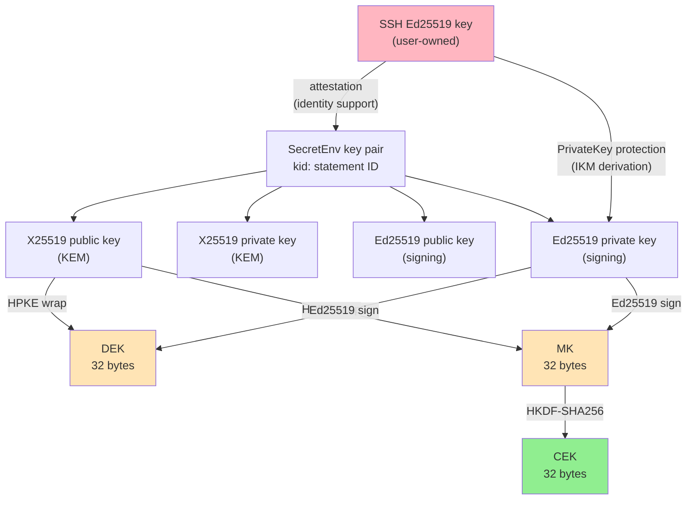
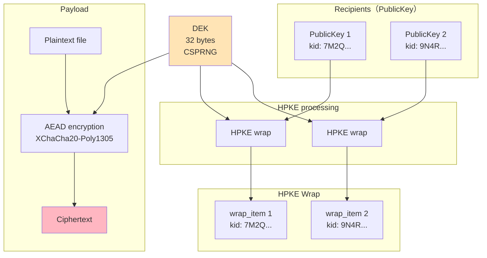
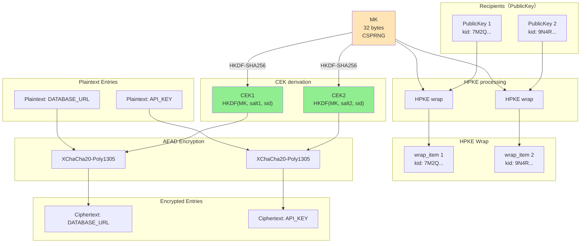
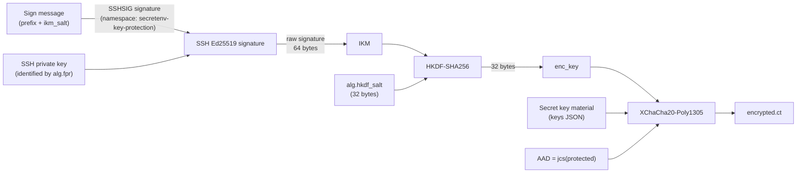

# SecretEnv Security Design

---

## 0. Document Information

### Executive Summary

#### Core Design Position

This summary states the conclusions that security and cryptography specialists should verify first when evaluating SecretEnv. The detailed threat model, format specifications, key derivation, trust policy, and attack scenarios are covered in the main sections. The central point is that SecretEnv does not make Git repository state a cryptographic trust anchor. Instead, protection rests on the encrypted artifacts themselves and on the user's local trusted area.

SecretEnv protects the confidentiality of secret values shared through a repository, tamper detection for encrypted artifacts and metadata, self-contained resolution of signature verification keys, and context binding of cryptographic components. The active member list, incoming member candidates, and encrypted artifacts in the repository are treated as tamperable inputs. The local keystore, local trust store, SecretEnv private keys, and SSH signing capability used for PrivateKey protection are inside the user's local trust boundary. If that boundary is broken, SecretEnv's protection is constrained by the compromise of the local environment.

#### Cryptographic Construction and Verification Order

The cryptographic construction uses standard primitives. Per-recipient content-key delivery uses HPKE Base mode (DHKEM(X25519, HKDF-SHA256) / HKDF-SHA256 / ChaCha20-Poly1305), file-enc payloads and kv-enc entries use XChaCha20-Poly1305, and Ed25519 signatures provide integrity and signer-key authenticity. JCS provides deterministic byte representation for signed data, AAD, HPKE info, and token representation. HKDF-SHA256 derives kv-enc entry keys and PrivateKey-protection keys. The overall classical security level is evaluated as 128-bit, matching the asymmetric cryptography used by the system.

Signature verification is self-contained. file-enc and kv-enc signed documents carry an embedded `signer_pub` as the signature verification key source. A verifier does not search for signer keys in workspace `members/active` or in the local keystore. It first validates the `signer_pub` document, including structure, self-signature, and SSH attestation, and then verifies the artifact signature with that key. This keeps signature-key resolution independent of repository state and implementation-specific lookup behavior.

The canonical pre-decryption order is structural validation, `signer_pub` validation, artifact signature verification, trust policy decision, format-specific reference consistency checks, and plaintext decryption. An implementation that decrypts payloads or entries before signature verification or trust-policy evaluation sends attacker-controlled encrypted data into the decryption path and violates a design invariant.

#### Context Binding and Format Differences

Context binding is the primary defense against component reuse. The file identifier (`sid`), key statement ID (`kid`), KV entry key (`k`), and protocol identifier (`p`) are placed in the required HPKE info, HPKE AAD, HKDF info, payload AAD, and signed bytes. As a result, substituting a payload from another file, a wrap from another key generation, an entry ciphertext under another key name, or data from another protocol fails at signature verification, unwrap, AEAD decryption, or reference consistency checking.

file-enc and kv-enc share the same trust model but differ in key structure and rotation semantics. file-enc uses a per-file DEK to encrypt the payload, and HPKE-wraps that DEK for each recipient. kv-enc wraps a per-file MK, and derives each entry CEK from the MK, an entry salt, and `sid`. Recipient addition can keep the existing content key and add wraps in both formats. Recipient removal differs: file-enc keeps the DEK and updates wraps plus removal history, while kv-enc regenerates the MK and re-encrypts all entries so that a removed recipient who retained the old MK cannot derive future entries.

#### Trust Policy

A cryptographically valid signature or public key does not prove that the signer should be accepted in the current workspace or that the key holder's human identity is established. SecretEnv separates cryptographic verification through embedded `signer_pub`, current authorization through `members/active`, key-owner approval through `known_keys`, write-path artifact member set approval through `recipient_sets`, and identity-supporting evidence through manual review and GitHub online verify. GitHub API responses are supplementary evidence, not a trust anchor; they help check whether the SSH key used for attestation is associated with the claimed GitHub account.

On read paths, the signer `kid` and every artifact recipient `kid` that resolves to current `members/active` must be present in `known_keys`, or be manually approved in the current execution. A recipient `kid` that no longer resolves to current `members/active` is surfaced as a warning on the read path so that historical artifacts remain readable. On write paths, recipients are always derived from `members/active`; each recipient `kid` and the output artifact member set must be reviewed before saving, and an input artifact that contains an unresolved recipient `kid` must be rewrapped before writing. `SECRETENV_STRICT_KEY_CHECKING=no` is a narrow exception for explicitly requested read paths: it bypasses read-path local key-approval checks, but not signature verification, active-member authorization, recipient-handle consistency, or signer-in-recipient-set validation, and it has no effect on write paths.

#### Residual Risks and Audit Focus

The main residual risks are first approval, operational governance, past disclosure, rollback, and the local trusted area rather than primitive weakness. TOFU first approval requires out-of-band confirmation. A legitimate recipient can exfiltrate plaintext after decryption, and previously disclosed secret values cannot be cryptographically reclaimed. If a recipient long-term private key is compromised, existing wraps for that recipient become decryptable. Restoring an old but valid encrypted artifact from Git history to current HEAD is not detected as a freshness violation by context binding alone. Coherent replacement or rollback of the local trust store is outside the local-trust-boundary assumption.

The highest-priority audit checks are: signature verification before decryption, embedded `signer_pub` as the only signature-key source, preservation of all context-binding inputs, equality of HPKE info and AAD on wrap paths, PublicKey self-signature and SSH attestation verification, separation between `members/active`, `known_keys`, and write-path `recipient_sets`, the scope of `SECRETENV_STRICT_KEY_CHECKING`, and limiting environment-variable-based key loading to trusted CI contexts. These are structural conditions that directly support the claimed security properties, not merely implementation style preferences.

### Purpose of This Document

This document organizes the security design of SecretEnv and clarifies both its protection targets and its underlying assumptions. Its purpose is to present SecretEnv's security claims, the conditions required for those claims to hold, the design-level verification points, the residual risks, and the explicit non-goals in a coherent form.

Each section is written not only to describe algorithms and data structures, but also to show which design decisions support which security claims, and where operational assumptions and constraints remain.

### Intended Audience

This document primarily serves two audiences. Each audience may focus on different sections:

| Audience | Primary sections | Purpose |
|----------|-----------------|---------|
| Security reviewers / auditors | §1 (claims and boundaries), §2 (threat model), §3 (primitives), §5 (signature architecture), §6–§8 (file-enc / kv-enc / context binding), §11 (attack scenarios), §12 (checkpoints) | Evaluate the security claims, assumptions, residual risks, and review points |
| Users / operators / decision makers | Executive Summary, §1 (claims and boundaries), §2.1–§2.4 (threat model and trust boundary), §9.4–§10 (PrivateKey protection and trust policy), §13 (limitations), Appendix B (operations checklist) | Decide whether SecretEnv can be operated safely in their environment and what limits they must accept |

---


## 1. Security Claims and Boundaries

This chapter states the security claims evaluated by this document and the boundaries under which they hold. The later chapters justify these claims through the threat model, trust boundary, cryptographic primitives, signature verification, concrete file-enc / kv-enc structures, context binding, trust policy, and attack scenarios.

### 1.1 Design Starting Point

The SecretEnv design is built from a single starting point: the repository, as a distribution medium, is not placed at the cryptographic trust anchor.

A Git repository has many useful properties as a distribution medium for a team. It is easy to clone, retains history, is reviewable, and requires no extra server. At the same time, any developer with write access, a compromised CI, or an unauthorized push path can rewrite arbitrary files in the repository. In other words, the convenient distribution medium that is a Git repository is an input whose correctness is preserved only within the scope of write controls; if a design takes its contents at face value, a tamperable region becomes the cryptographic trust anchor.

SecretEnv therefore draws its trust boundary deliberately asymmetrically. It treats the local private keys, local keystore, local trust store, and SSH keys on the user's device as the trust anchors, while the workspace's active member list (`members/active/`), incoming member candidates (`members/incoming/`), and encrypted files (`secrets/`) are all treated as tamperable inputs. The authenticity of the latter is established by the cryptographic structure embedded in each artifact in combination with repository governance (PR review, protected branches, and so on). The remaining discussion in this document takes this premise as a shared starting point (see §2 for details).

### 1.2 Guaranteed by Design

SecretEnv's design-level guarantees are summarized below.

| Security claim | Main mechanism | Assumption | Residual risk | Detailed in |
|----------------|----------------|------------|---------------|-------------|
| Confidentiality | HPKE wrap + XChaCha20-Poly1305 | Recipient private keys are not compromised | Legitimate recipients can still exfiltrate plaintext | §3, §6, §7 |
| Tamper detection | Ed25519 signatures | Verification is never bypassed | A malicious legitimate signer is not prevented | §5 |
| Self-contained verification of signed artifacts | Embedded signer public key + public-key verification | Every signed artifact embeds the signer's public key | Current membership still depends on separate trust policy checks | §5 |
| Key consistency | Public-key document self-signature | The original private key is not compromised | Does not prevent creation of a brand new malicious key | §5.5 |
| Current-trust decision | Active member list + local approval cache | Repo governance and user approvals work as intended | Weak against bootstrap TOFU, repo compromise, and misapproval | §10 |
| Stronger key identity evidence | SSH attestation + manual approval + online verify | Manual approval is executed correctly | Weak against first-contact MITM and GitHub/SSH compromise | §2.4, §5.6, §5.7 |
| Context binding | Bind each artifact to its context (file, key generation, entry, protocol) | The implementation preserves the intended binding points | Security weakens if a future change removes a binding | §8, §11 |
| Portable private key use | Password export or SSH-based protection | Used only in a trusted CI context | Storing both secrets in the same backend is not independent defense | §9 |

### 1.3 Depends on Operational Assumptions

The following properties are not established by the cryptographic structure alone. They rely on user or organizational controls.

| Area | Required assumption |
| --- | --- |
| Identity decision for keys | TOFU approval, out-of-band confirmation, and optional GitHub online verification |
| Validity of the active member list | Git access control, PR review, protected branches, and change management |
| Local trusted area | Protection of the workstation, local keystore, local trust store, SSH key, and SSH signing inputs |
| Private key use in CI | Trusted refs, maintainer-controlled workflows, and trusted runners |
| Rollback prevention | Repository governance that prevents older encrypted artifacts from being promoted back to current HEAD |

### 1.4 Not Guaranteed

SecretEnv does not claim to provide the following.

| Non-goal | Reason |
| --- | --- |
| Prevention of insider misuse after decryption | Use of plaintext by a legitimate recipient is outside encrypted distribution |
| Recovery of past disclosure | Content that was previously decryptable cannot be cryptographically reclaimed |
| Strong forward secrecy | If a recipient long-term private key is compromised, existing wraps for that recipient become decryptable |
| Identity assurance beyond TOFU | Self-signatures and SSH attestation show key possession and SSH-key binding, not human identity |
| Complete detection of repository-level rollback | Context binding proves consistency inside the artifact, not freshness or monotonic progress in Git history |
| Resistance to GitHub / SSH trust-domain compromise | The supplementary evidence used by online verification or manual review can itself be forged |

### 1.5 Implementation Invariants That Must Be Preserved

The security claims above only hold when the implementation preserves the following invariants.

| Invariant | Claim that breaks if violated |
| --- | --- |
| Do not decrypt before signature verification | Tamper detection, trust policy enforcement, fail-closed input handling |
| Do not remove context-binding elements from AAD, HPKE info, or signed bytes | Payload / entry / wrap swapping resistance, key-generation binding |
| Resolve file-enc / kv-enc signature verification keys only from embedded `signer_pub` | Self-contained verification, consistent acceptance behavior across implementations |
| Keep the roles of `members/active`, `known_keys`, and `recipient_sets` distinct | Separation between current authorization and user approval history |
| Limit `SECRETENV_STRICT_KEY_CHECKING=no` to explicitly requested read paths | Key approval and artifact member set review semantics on write paths |

### 1.6 Terminology Used Here

The following terms recur throughout the rest of this document. Where each term is implemented is described in the relevant section (§5, §8, §10, etc.).

| Term | Meaning in this document |
|------|--------------------------|
| Embedded signer public key | The signer's public-key document carried inside each signed artifact (implemented as `signature.signer_pub`; see §5). This is the sole source of the signature verification key, and lookup never falls back to external key servers or other files |
| Key consistency | Evidence that the same private-key holder created the corresponding public-key document; not identity by itself |
| Active member list | The data treated as the authorization basis for the current member / recipient set in the workspace (implemented as `members/active`; see §10) |
| Incoming member candidates | Members who applied to join the workspace but have not yet been promoted (implemented as `members/incoming`; see §10) |
| Local approval cache | A local cache that lets a user skip re-review for a key they have already confirmed, or for a write-path artifact member set they have already reviewed (implemented as `known_keys` and `recipient_sets`; see §10.4) |
| Non-member acceptance | An interactive, one-shot, artifact-scoped exception that accepts an artifact signed by a signer not present in the active member list |
| Identity assurance | Operational evidence that helps a human decide which person or account a key belongs to |
| Context binding | The mechanism that cryptographically ties each encrypted artifact to the context it belongs to — file, key generation, entry, and protocol — so that components cannot be swapped or reused across contexts (the individual identifiers and binding-point summary are documented in §8) |
| Disclosure history | A record that surfaces secret values which may need to be rotated externally after a member is removed (implemented as `disclosed`; see §7.7) |
| Trust boundary | The boundary between inputs trusted as-is and inputs assumed tamperable until validated |
| Residual risk | Risk that remains even with a correct implementation, or when an operational assumption is not met |

---


## 2. Threat Model and Trust Boundary

SecretEnv's cryptographic design rests on the premise (§1.1) that the repository used as a distribution medium is not a cryptographic trust anchor. This chapter organizes the attacker roles that motivate that premise (§2.1), the operational assumptions on which it holds (§2.2), the boundary between trusted origins and untrusted areas (§2.3), and the trust model that separates cryptographic verification, authorization, and approval (§2.4). Subsequent chapters on protocol details, bindings, trust policy, and attack scenarios are all discussed on top of the boundary conditions set out here.

### 2.1 Attacker Model

The following table lists attackers SecretEnv intends to address in its cryptographic design, paired with their capabilities and assumed scenarios. Attackers who defeat repository governance or protection of the local trusted area are treated separately when the operational assumptions in §2.2 do not hold.

| Attacker | Capability | Assumed Scenario |
|----------|-----------|----------------|
| Repository tamperer | Can arbitrarily tamper with files under `.secretenv/` | Malicious CI, compromised Git server, unauthorized push |
| Public key substituter | Can replace public-key documents in the active member list (`members/active/`) or among incoming candidates (`members/incoming/`) with forged ones | MITM during new member addition, unauthorized commit to repository |
| Key rotation attacker | Retains key-distribution data produced for an old key generation and attempts decryption with a new key | Exploiting weaknesses in the key update process |
| Context confusion attacker | Swaps ciphertext components between different secrets | Copy-and-paste across encrypted files |
| First-contact MITM | Replaces bootstrap-time key-statement information, GitHub account information, or attestation fingerprint with attacker-controlled values | First clone, first encounter with a signer |
| Local trust store tamperer | Can write to or roll back the local trust store (`<SECRETENV_HOME>/trust/`) | Replacing the local approval cache, rewinding approval history |

### 2.2 Operational Assumptions

Repository write control The attacker model above assumes repository write access is properly controlled. In the main target environment of Git + GitHub operation, changes to the active member list (`members/active/`) are checked through PR review. The active member list is the authorization source for the current member set / current recipient set, but it is not a cryptographic trust anchor.

Repository-level rollback When Git is used as the distribution medium, it is unavoidable that legitimate repository users can retrieve old artifacts from historical commits. As a result, a repository-level rollback / rewind, where an attacker or insider with write access restores a historically valid encrypted file to the current HEAD, cannot be detected or prevented by SecretEnv's context bindings alone. Those bindings guarantee artifact integrity and context consistency, not freshness or monotonicity against Git history.

Read-path trust review is not a freshness mechanism and does not review "who this artifact is shared with" as an artifact-level policy decision. It reviews the key owners for the signer and active-resolvable artifact recipients. A rolled-back artifact with historical recipients may still be readable, and unresolved recipient `kid`s are reported as warnings rather than hard failures on the read path. Write paths are stricter: an input artifact with a recipient `kid` that no longer resolves to current `members/active` must be rewrapped before writing, so write operations normalize the artifact back to the current recipient set.

This class of risk therefore cannot be fully addressed by SecretEnv's crypto design alone. The operational assumption is that protected branches, required review, change management, and pre-deployment checks prevent old secret artifacts from being promoted back to current HEAD.

Local trust store protection It also assumes the local trust store (`<SECRETENV_HOME>/trust/`) resides on the user's device and is protected by OS / filesystem access control. Signatures on the local trust store are used for integrity checks, corruption detection, and format validation, but they do not fully protect against consistent replacement or rollback inside that area.

TOFU bootstrap limits Initial bootstrap and first-seen-key approval rely on TOFU. As a result, first-contact MITM and whole-workspace substitution are outside the scope of cryptographic prevention. The crypto design must therefore be evaluated separately from distribution-medium controls, review workflow, and any out-of-band verification.

### 2.3 Trust Boundary


Trusted elements:

- Local machine and local key storage (`~/.config/secretenv/keys/`)
- Local trust store (`~/.config/secretenv/trust/`), but only as a user-local approval cache, not as the authority for current trust
- User's SSH Ed25519 private key

External supplementary evidence sources:

- GitHub API (used during online verification as supplementary evidence for identity judgment)

Untrusted elements:

- The workspace's active member list (`members/active/`) and incoming candidates (`members/incoming/`) — untrusted repository data. Each public-key document is verified by self-signature and attestation, while use of these directories as the authority for current membership depends on repo governance
- Workspace `secrets/` directory — verified by signatures

Within this trust boundary, the SSH private key serves two roles: it binds a SecretEnv public key to an SSH key through attestation, and it derives—on each decrypt—the symmetric key that protects the PrivateKey file (`private.json`) in the local keystore from an SSH signature (details in §9.2).

Decrypting a SecretEnv key requires both reach to the corresponding `private.json` in the local keystore and the ability to produce an SSH signature over the message derived from that file's contents. Device compromise and simultaneous capture of `private.json` and SSH signing capability are discussed under the trust assumptions in §9.4.

### 2.4 Trust Model Overview

SecretEnv's trust model intentionally separates cryptographic verification, current-membership decisions, and user approval. Rather than having a single mechanism decide both "whose key is this?" and "should it be accepted now?", the system applies the following four layers in order.

This section only introduces the conceptual roles. Read-path and write-path acceptance rules, exceptional acceptance, and the effect of `SECRETENV_STRICT_KEY_CHECKING` are covered in §10.

| Layer | Mechanism | What it establishes | What it does NOT establish |
|-------|-----------|---------------------|---------------------------|
| 1. Cryptographic verification | Embedded signer public key + public-key verification | Cryptographic authenticity of the artifact and the signing key | Identity of the key holder |
| 2. Authorization | Active member list | Current membership / current recipient set | Cryptographic trust (depends on repo governance) |
| 3. Approval cache | Local trust store | Previously approved keys and write-path artifact member sets | Current membership |
| 4. Manual approval + online verify | TOFU approval, GitHub API | Supplementary evidence for identity decisions | Cryptographic proof of identity |

Layer 1 obtains the signature verification key from the embedded `signer_pub` and validates the public-key document, including self-signature, SSH attestation, key-generation consistency, and expiration. This establishes which key statement signed the artifact; it does not establish the human identity of the key holder.

Layer 2 uses the workspace `members/active` directory as the authorization source for the current member set / current recipient set. This directory is not used for signer-key lookup and is not a cryptographic trust anchor; it is untrusted repository data maintained by repo governance.

Layer 3 uses the local trust store's `known_keys[]` and `recipient_sets[]` as user-local approval caches. `known_keys[]` records key owners the user has reviewed. `recipient_sets[]` records output artifact member sets reviewed on write paths. Neither cache is the authority for current trust.

Layer 4 relies on manual review of key-statement information, the SSH key fingerprint used for attestation, and optional GitHub account information. This is supplementary evidence for TOFU-based identity judgment, not cryptographic proof of identity.

Online verification is a present-time check: it asks whether the SSH public key used for attestation is currently present in the GitHub account's SSH key set. It is not a historical proof and does not automatically revoke existing local approvals or workspace membership.

The limited exceptions are non-member acceptance and `SECRETENV_STRICT_KEY_CHECKING=no`. Non-member acceptance is an interactive, one-shot, artifact-scoped exception that does not restore current membership or update the local approval cache. `SECRETENV_STRICT_KEY_CHECKING=no` skips only read-path key-owner approval checks on explicitly requested read paths; it does not skip active-member authorization, recipient-handle consistency, signer-in-recipient-set validation, or cryptographic signature verification.

Stronger confidence in key identity depends on these layers working together. Existing-key tampering generally requires compromise of the original key material, while insertion of a brand-new malicious key can succeed through repo-governance failure plus mistaken TOFU approval. Compromise of an attestation SSH key, GitHub account, or local trust store weakens the corresponding operational layer rather than the artifact signature mechanism itself.

---


## 3. Common Cryptographic Foundation

This chapter explains why the standard cryptographic primitives that underpin confidentiality and integrity for encrypted files and kv-enc documents were selected, and summarizes the security properties and limits those primitives inherit from their specifications. It is not a byte-level normative specification; it focuses on the rationale and constraints needed for security review. Self-contained verification with embedded signer public keys, trust policy split across the active member list and the approval cache, and context binding (§8) are not realized by these algorithms alone; they require the protocol, binding, and trust models in §5–§10. The selection criteria reduce to: (a) alignment with IETF-style standards so the construction is uniquely specified, (b) structural reduction of misuse surface, and (c) affinity with the SSH ecosystem (ssh-ed25519, SSHSIG).

Concretely, HPKE and ChaCha20-Poly1305 (internal to HPKE) are used for Content Key delivery (wrap) in file-enc and kv-enc (§6.4, §7.5). XChaCha20-Poly1305 protects file-enc payloads, kv-enc entries, and PrivateKey ciphertext (§6.5, §7.4, §9.2). Ed25519 provides tamper detection for signed artifacts and authenticity checks for PublicKey documents (§5). HKDF-SHA256 is used as the HPKE internal KDF and for application-level derivation such as kv-enc CEKs and PrivateKey `enc_key` derivation (with Argon2id output as IKM in the password path; §9.3). JCS deterministically canonicalizes byte inputs for signatures, AAD, and HPKE `info` (§5, §8.2, §8.3). base64url encodes binary token fields.

### 3.1 Algorithm Summary

| Algorithm | Parameters | RFC | Purpose |
|-----------|-----------|-----|---------|
| HPKE Base mode | suite `hpke-32-1-3` | RFC 9180 | Content Key wrap/unwrap |
| DHKEM(X25519, HKDF-SHA256) | kem_id=32 (0x0020) | RFC 9180 | KEM (key encapsulation) |
| HKDF-SHA256 | kdf_id=1 (inside HPKE suite); app uses §3.5 | RFC 5869 | HPKE internal KDF; kv-enc CEK derivation; PrivateKey `enc_key` derivation (including from Argon2id output; §9.3) |
| ChaCha20-Poly1305 | aead_id=3 (0x0003) | RFC 8439 | HPKE internal AEAD |
| XChaCha20-Poly1305 | nonce 24 bytes, key 32 bytes | draft-irtf-cfrg-xchacha (§14) | payload / entry / PrivateKey encryption |
| Ed25519 (PureEdDSA) | — | RFC 8032 | Signing and verification |
| JCS | — | RFC 8785 | Deterministic JSON canonicalization |
| base64url (no padding) | — | RFC 4648 §5 | Binary encoding |

### 3.2 HPKE (RFC 9180)

Rationale:
- A standardized hybrid public key encryption scheme with a consistent definition of the KEM + KDF + AEAD combination
- Base mode involves ephemeral encapsulation per wrap (interpretation and limits of per-wrap ephemerality are discussed alongside §13.2). If a recipient's long-term secret key is compromised, all existing wraps for that recipient can be decrypted; see §13.2
- Clear suite ID identification via IANA Registry

Suite configuration:
```
hpke-32-1-3
├── kem_id  = 32 (0x0020) DHKEM(X25519, HKDF-SHA256)
├── kdf_id  = 1  (0x0001) HKDF-SHA256
└── aead_id = 3  (0x0003) ChaCha20-Poly1305
```

Comparison with alternatives:

| Alternative | Reason for rejection |
|-------------|---------------------|
| RSA-OAEP | Large keys and ciphertext overhead; compared to HPKE as a standardized DHKEM + HKDF + AEAD construction, it is harder to bind wrap contexts (`info`/AAD) uniformly |
| ECIES (custom construction) | Not standardized; high risk of misconfiguration |
| Age (X25519-ChaChaPoly) | Less structured than HPKE for this use; insufficient flexibility for info/AAD |

Known limitations:
- Base mode does not provide sender authentication (supplemented by signatures)
- X25519 provides 128-bit security level

### 3.3 XChaCha20-Poly1305

AEAD for confidentiality and tamper detection of file-enc payloads, kv-enc entries, and PrivateKey ciphertext (§6.5, §7.4, §9.2).

Rationale:
- 24-byte nonce makes random nonce collision risk practically negligible (birthday bound at 2^96)
- Consistent performance even in environments without AES-NI
- Does not provide misuse resistance, but practical security is ensured by the large nonce space

Comparison with alternatives:

| Alternative | Reason for rejection |
|-------------|---------------------|
| AES-256-GCM | 12-byte nonce has high collision risk in multi-key usage |
| AES-256-GCM-SIV | Nonce misuse resistance is appealing, but rejected due to implementation complexity and limited adoption |

Known limitations (primitive specification level):
- Nonce reuse under the same key is catastrophic (an AEAD assumption). How SecretEnv satisfies this assumption in design is covered in §3.8
- Compression before encryption is prohibited (to avoid compression oracle attacks CRIME/BREACH)

### 3.4 Ed25519 (RFC 8032 PureEdDSA)

Tamper detection for encrypted artifacts and kv-enc documents, and self-contained signature verification with embedded signer public keys (§5).

Rationale:
- Deterministic signatures: Always generates the same signature for the same input. An essential property for use as IKM in PrivateKey protection.
- Fast signing and verification
- Affinity with SSH ecosystem (ssh-ed25519)

Comparison with alternatives:

| Alternative | Reason for rejection |
|-------------|---------------------|
| ECDSA (P-256) | Non-deterministic signatures (mitigable with RFC 6979, but handling varies across SSH implementations) |
| Ed448 | Insufficient adoption in the SSH ecosystem |

Known limitations:
- 128-bit security level
- Context separation is not provided by PureEdDSA itself (addressed by JCS canonicalization + protocol identifiers)

### 3.5 HKDF-SHA256 (RFC 5869)

Purpose-separated symmetric keys via `info` / `salt`, incorporating context identifiers such as the file identifier (`sid`), key statement ID (`kid`), and protocol identifier (`p`) into the key schedule (§8.2, §7.3, §9.2.1, §9.3.2).

Rationale:
- Standardized key derivation function
- The `info` parameter allows safely deriving purpose-specific keys from the same IKM
- The `salt` parameter allows deriving different keys even from the same IKM and info

Uses:
- HKDF inside the HPKE suite (§3.2)
- CEK derivation for kv-enc (MK + salt + file identifier `sid` → CEK)
- `enc_key` derivation for PrivateKey protection (SSH signature or Argon2id output as IKM, with salt + key statement ID `kid` + info → `enc_key`; §9.2, §9.3)

### 3.6 JCS (RFC 8785)

Deterministic mapping of JSON objects to bytes so inputs to signatures, AAD, and HPKE `info` do not vary across implementations (§8 overall).

Rationale:
- Provides deterministic canonicalization of JSON objects
- Eliminates ambiguity in key ordering and number representation, ensuring consistency of signatures, AAD, and HPKE info
- Even when string fields such as the file identifier `sid` contain arbitrary characters, the canonical byte sequence is unambiguous

Example deployment points:
- file-enc: signing `protected` and `payload.protected`, and AAD construction (§5.2, §6.4, §6.5)
- kv-enc: token JSON canonicalization and the `canonical_bytes` premise (§7.1)
- PublicKey / PrivateKey: `protected` representation and inputs to key statement ID (`kid`) derivation (§4.4.1, §9.2)
- file-enc / kv-enc HPKE wrap: identical canonicalized context bytes for `info` and AAD (§8.3)

Known limitations:
- JCS canonicalizes JSON at the syntactic level; semantic validity of field values (e.g., expiry, correspondence between `kid` and key material) still requires schema validation and cryptographic checks

### 3.7 Security Guarantees and Limits Inherited from Standard Cryptographic Primitives

| Primitive | Assumed security property | Implication for SecretEnv |
|-----------|-------------------------------------------|----------------------------|
| HPKE Base mode (RFC 9180) | Provides confidentiality for recipient-specific key delivery, but does not provide sender authentication | Confidentiality of each recipient wrap depends on this, while producer authenticity and insider-attack resistance depend on Ed25519 signatures |
| XChaCha20-Poly1305 | Provides confidentiality and tamper detection as an AEAD, assuming nonces are not reused | As a primitive, it does not tolerate nonce reuse under the same key (§3.3). SecretEnv's current design meets nonce uniqueness structurally as described in §3.8 |
| Ed25519 (PureEdDSA) | Provides unforgeability and tamper detection as long as the signing private key remains secret | Authenticity of encrypted files and PublicKey documents depends on this, and that guarantee collapses if the signing private key is compromised |
| HKDF-SHA256 | Can derive pseudorandom, purpose-separated keys from input key material with sufficient entropy | Key separation for CEKs and `enc_key` depends on this, but HKDF does not turn low-entropy input into high-entropy key material |

Security dependency:

- Overall confidentiality depends on both the confidentiality of HPKE for recipient-specific key delivery and the confidentiality of the AEAD that protects the payload itself. SecretEnv's overall confidentiality does not hold if either of these fails.
- Tamper detection depends on Ed25519 signatures. HPKE Base mode does not provide sender authentication by itself, so signatures provide the check that encrypted files and PublicKey documents were produced by the expected signer and have not been modified.
- Cryptographic independence between entries in kv-enc depends on the PRF security of HKDF-SHA256. In SecretEnv, a distinct CEK is derived for each entry from a high-entropy MK, so knowledge about one entry is not expected to directly reveal the CEK of another entry.

Preconditions and limitations:
- HPKE Base mode assumes confidentiality of the recipient's long-term private key. If the long-term key is compromised, all wraps for that recipient can be decrypted (see §13.2).
- XChaCha20-Poly1305 assumes nonce uniqueness as a primitive (§3.3). How the current design satisfies that assumption is described in §3.8
- Ed25519 assumes private key confidentiality. In SecretEnv, the signing private key is stored encrypted by PrivateKey protection (§9)

### 3.8 Nonce Safety Margin

Relative to the AEAD assumption in §3.3 (nonce uniqueness under a single key), SecretEnv satisfies the keying lifecycle requirements as follows.

XChaCha20-Poly1305 uses a 24-byte (192-bit) nonce. In SecretEnv's design, there are no cases where the same symmetric key is used for multiple encryptions. DEK (file-enc), CEK (kv-enc entry), and enc_key (PrivateKey protection) are each uniquely generated or derived per encryption, so the risk of nonce collision is structurally eliminated.

The choice of 192-bit nonce space serves as a safety net in case future design changes introduce same-key reuse.

### 3.9 Cryptographic Strength (Security Level)

§3.7 summarizes functional guarantees and dependencies for each primitive. This section focuses on numeric estimated classical security levels (bit equivalents) and where the weakest link lies for the system as a whole.

The estimated cryptographic strength (security level) provided by each cryptographic primitive is as follows:

| Cryptographic Primitive | Key Size / Parameters | Estimated Strength (Classical) | Notes |
| --- | --- | --- | --- |
| X25519 (KEM) | 256 bits | 128 bits | Security against the elliptic-curve discrete logarithm problem (ECDLP) |
| Ed25519 (Signatures) | 256 bits | 128 bits | Security against the elliptic-curve discrete logarithm problem (ECDLP) |
| XChaCha20-Poly1305 | Key 256 bits | 256 bits | Symmetric key encryption strength |
| ChaCha20-Poly1305 | Key 256 bits | 256 bits | HPKE internal AEAD |
| HKDF-SHA256 | Output 256 bits | 256 bits | Based on hash function preimage resistance |

Overall System Cryptographic Strength:

The security of the overall system is constrained by the weakest link in the chain of cryptographic primitives.
In SecretEnv, the asymmetric cryptography that forms the foundation of data confidentiality (HPKE X25519) and authenticity (Ed25519) provides a 128-bit security level. Therefore, the overall cryptographic strength provided by the system is equivalent to 128 bits.

This provides a robust security level (equivalent to AES-128) sufficient for current general commercial systems. The use of 256-bit keys in the symmetric encryption parts (such as XChaCha20-Poly1305) is the result of selecting available standard, fast primitives, and does not elevate the overall system to a 256-bit security level.

The primitive choices above are prerequisites for the security claims in §1.2, but implementation invariants such as context binding, processing order, and separation of trust sources are discussed separately in §8 (binding), §9 (PrivateKey protection), and §12.1 (audit and design review checkpoints).

---


## 4. Key Hierarchy and Key Lifecycle

This chapter organizes key material on the local machine and in the local keystore by type, role, and lifecycle, within the trust boundary described in §2.3. For self-contained verification, the embedded public-key document and key statement ID (`kid`) anchor the verification chain; for context binding, `kid` appears repeatedly in HPKE context inputs, signing payloads, and key-derivation inputs. How each key is consumed in each protocol is deferred to file-enc (§6), kv-enc (§7), and PrivateKey protection (§9); here we focus on hierarchy, immutability of `kid`, recipient eligibility, and expiry states. §8 covers the binding-point summary for the identifiers that represent files, key generations, KV entries, and protocols.

### 4.1 Key Types and Relationships

| Key category | Ownership / origin | Lifetime | Primary use | See |
| --- | --- | --- | --- | --- |
| SSH Ed25519 key | User-owned (outside SecretEnv) | Long-term | attestation, PrivateKey protection (`enc_key` derivation) | §5.6, §9.2 |
| SecretEnv key pair (X25519 + Ed25519) | Created with `key new`, versioned by `kid` | Long-term (active until `expires_at`) | HPKE wrap/unwrap, Ed25519 signing and verification | §5, §6, §7 |
| DEK / MK / CEK / enc_key | Generated per operation via CSPRNG or HKDF | Short-term (within the operation or session) | file-enc / kv-enc payloads, PrivateKey AEAD | §6.3, §7.3, §9.2.1 |



This diagram intentionally separates the SSH key from the SecretEnv key pair.

- The SSH key is an external authentication key already owned by the user; it does not directly encrypt or sign SecretEnv workspace payloads
- The SecretEnv key pair is the application-specific key material used for encryption, decryption, signing, and verification inside the workspace
- The SSH key has only two roles
  - attestation: show which SSH key backs a SecretEnv public key. The SSHSIG namespace is `secretenv-attestation`
  - PrivateKey protection: derive the `enc_key` used to unlock the SecretEnv private key stored in the local keystore. The SSHSIG namespace is `secretenv-key-protection`

Therefore, the SSH key is not the SecretEnv key pair itself. It is an outer key used to support provenance checks and local protection of the SecretEnv key pair. Even when the same SSH key is reused for both roles, the signature contexts are separated by namespace.

The mermaid figure above is a conceptual overview of the hierarchy. Timing of DEK / MK / CEK creation and how each is consumed in file-enc and kv-enc is deferred to §6 and §7.

### 4.2 Key Parameter Summary

| Key type | Size | Generation method | Purpose | Context binding | Zeroization required |
|----------|------|------------------|---------|-----------------|---------------------|
| SSH Ed25519 private key | 32 bytes | User-managed | attestation, PrivateKey protection | Not a direct binding input (attestation and §9.2 AAD tie to key statement ID `kid`) | N/A (OS-managed) |
| X25519 private key (KEM) | 32 bytes | CSPRNG | HPKE unwrap | Part of PublicKey material that defines key statement ID `kid` (`kid` binding in §8) | MUST |
| X25519 public key (KEM) | 32 bytes | Derived from X25519 private key | HPKE wrap | Same as above | — |
| Ed25519 private key (signing) | 32 bytes | CSPRNG | Signature generation | Same (signing key corresponds to artifact `kid`) | MUST |
| Ed25519 public key (signing) | 32 bytes | Derived from Ed25519 private key | Signature verification | Same | — |
| DEK (Data Encryption Key) | 32 bytes | CSPRNG | file-enc payload encryption | Payload header AAD including file identifier `sid` binds to file context (§6.5) | MUST |
| MK (Master Key) | 32 bytes | CSPRNG | CEK derivation source for kv-enc | Wrap key statement ID `kid` / file identifier `sid` / protocol identifier `p` (§7.5) and CEK derivation file identifier `sid` (§7.3) | MUST |
| CEK (Content Encryption Key) | 32 bytes | Derived via HKDF-SHA256 | kv-enc entry encryption | HKDF file identifier `sid` and entry AAD KV entry key `k` / file identifier `sid` / protocol identifier `p` (§7.3, §7.4) | MUST |
| enc_key (for PrivateKey protection) | 32 bytes | Derived via HKDF-SHA256 | PrivateKey AEAD encryption | AAD = `jcs(protected)` binds header and ciphertext for that key statement ID `kid` (§9.2.1) | MUST |

Notes:

- `enc_key` is not a stored or pre-existing key; it is a transient symmetric key derived from SSH signing output each time
- The same SSH key can protect multiple SecretEnv key statements, but different `kid` / `salt` values produce different `enc_key` values
- The `private.json` stored in the local keystore contains only the ciphertext of SecretEnv private key material; the SSH private key itself remains outside SecretEnv storage
- In the Zeroization required column, MUST states a design policy for symmetric and signing secret material (implementations attempt to zero buffers after use). Complete erasure from process memory is not guaranteed, as described in §12.3.

### 4.3 Recipient Eligibility

Whether someone may act as a recipient for encryption and decryption is an authorization question—who the current workspace admits to the recipient set—not a cryptographic proof of identity. As separated into layers in §2.4, `members/active/` is the authorization baseline, and the write path in §10.3 always derives the recipient set from the current active member list.

Only members listed in `members/active/` are recipients for encryption operations. Candidates in `members/incoming/` are untrusted repository data per §2.1; until promoted to active they are not in the recipient set for existing ciphertext. Until `rewrap` promotes an incoming member to active and updates wraps, that member cannot decrypt existing secrets. Promoting incoming to active is a recipient add; per §7.8 both file-enc and kv-enc keep the content key (DEK / MK) and add wrap entries only. By contrast, removing a member (recipient removal) requires MK regeneration and re-encryption of all entries in kv-enc only (§7.7). In all cases, “accepted as a member” and “proven identity of the key holder” are different layers; the latter depends on layer 4 in §2.4 (TOFU, online verification, etc.).

### 4.4 Key Lifecycle

A SecretEnv key pair transitions through a lifecycle from creation to expiration, and may be replaced through key rotation.

```
creation → active → expired
             │
             └── rotate (generate a new key pair and switch to it)
```

The behavior in each state is as follows:

- Creation: A new key pair and PublicKey document are created using the `key new` command and saved to the local keystore.
- Active: Valid before `expires_at` is reached. The key can be used for new encryption (wrap) and signing, as well as decryption and verification.
- Expired: After `expires_at` has passed. New encryption (wrap) and signing are rejected. Decryption and verification of data legitimately encrypted or signed in the past are permitted with a warning.
- Rotate: The active key is replaced by generating a new key pair (new `kid`), e.g. via `rewrap --rotate-key`. Older key material remains in the local keystore for decrypting and verifying past artifacts until it naturally reaches `expires_at` or is removed by operational choice.

Active indicates whether new cryptographic operations are allowed for that key generation. Whether an artifact may be accepted in the workspace is separate: embedded `signer_pub` verification and the trust policy in §10 (`members/active`, `known_keys`, etc.) are orthogonal to this state label.

After expired, ciphertext created earlier under that key does not automatically lose cryptographic integrity or context binding. Expiry is an operational boundary for rejecting new wraps and new signatures; limiting harm to past ciphertext after compromise is a distinct concern and is addressed by measures such as `--rotate-key` (§13.2).

Rotate makes a new `kid` the operational current key, and the public key published under `members/active` moves to the new generation (follow the user guide and `rewrap` behavior for exact steps). Deleting the old `kid`’s `private.json` from the local keystore prevents unwrap and decryption for that generation (keystore layout: §9.1.2).

SecretEnv does not provide a cryptographic revocation list in the CRL sense. To stop trusting a key operationally requires workspace updates, re-encryption of artifacts where needed, and manual review of `known_keys` (§13.4)—coordination across the repository and the local trust store.

#### 4.4.1 Immutability of Key Statement ID (kid)

Each key pair is associated with a `kid` (key statement ID). The `kid` is a 32-character Crockford Base32 string without hyphens. It is derived by taking the `PublicKey@5.protected` JSON object with the `kid` field removed (`protected_without_kid`), canonicalizing it to bytes with JCS (§3.6), hashing with SHA-256, taking the first 20 bytes of the digest, and encoding those bytes as unpadded Crockford Base32 (32 characters). In symbols: `kid = Encode_CrockfordBase32(SHA256(jcs(protected_without_kid))[0..20])`. The stored `protected.kid` must match this recomputed value.

Crockford Base32 avoids visually confusable characters (such as I, L, O, and U in typical Base32), which reduces manual transcription errors and keeps canonical strings usable without hyphens in URLs and JSON.

`kid` is a central identifier for context binding: it appears in HPKE wrap `info` / AAD, signing payloads, CEK derivation, and related inputs in §8. Any meaningful change to the PublicKey document (key material, identity, `binding_claims`, `expires_at`, etc.) yields a different `kid`, so reuse of old wraps or signing contexts across the new statement does not verify.

Because `kid` is derived from the PublicKey contents, matching `kid` values imply matching protected inputs used for derivation (the same key statement). Any field change yields a different `kid` and is treated as a separate generation.

### 4.5 Key Rotation

Key rotation is driven mainly by the `rewrap` command. Typical triggers include changes to the recipient set (add or remove), migrating to a new generation as `expires_at` approaches, and limiting damage after suspected compromise (§13.2).

file-enc uses a per-file DEK; kv-enc uses a per-file MK and per-entry CEKs (§7.2). Therefore recipient removal behaves differently by format: file-enc keeps the DEK and updates wraps only; kv-enc regenerates the MK and re-encrypts every entry (§7.7, §7.8). `--rotate-key` regenerates the content key (DEK / MK) and re-encrypts the entire payload. Protocol details are deferred to §7.8.

`--rotate-key` limits future encryption after leakage; per §13.2 it does not “restore” confidentiality of ciphertext already distributed. Operating a new `kid` as active while retaining the old `kid` as expired or locally retained for as long as past artifacts need verification or decryption aligns with the timeline in §4.4.

---


## 5. Signature and Verification Architecture

Self-contained verification embeds the embedded signer public key in each signed artifact so that signature verification completes without relying on external key servers or other files in the workspace. This chapter organizes the central `signature_v4` (artifact signature) format and the verification chain that establishes the embedded public key: self-signature, SSH attestation, and (optional) online verification.

This chapter is scoped to the structure of cryptographic verification. Whether an artifact may be accepted in the current workspace is governed by the multi-layer operational trust policy introduced in §2.4—authorization via `members/active`, the local approval cache (`known_keys` and `recipient_sets`), non-member exceptions, `SECRETENV_STRICT_KEY_CHECKING`, and related rules in §10—and is treated as a separate layer applied after this chain.

### 5.0 signature_v4 Common Format

file-enc and kv-enc artifact signatures share the same `signature_v4` structure (implemented as `ArtifactSignature`). The main points are:

- Embed the signer's PublicKey (`signer_pub`) so the source of the verification key stays inside the artifact
- Use `kid` to state which key statement performed the signing
- Treat validation of the signer key and verification of the artifact signature as one continuous chain (§5.4)

The local trust store (`secretenv.trust.local@4`) `signature` shares the `alg` / `kid` / `sig` representation but does not embed `signer_pub`. The verification exception is covered at the end of §5.4 and in §10.4.

The main fields of `signature_v4` (artifact signature) are as follows.

| Field | Type / encoding | Contents | Security role |
| --- | --- | --- | --- |
| `alg` | string | Always `eddsa-ed25519` (PureEdDSA) | Unambiguous identification of the signature algorithm |
| `kid` | Crockford Base32 (32 characters) | Signer's key statement ID | Binds the signing context of the artifact to the `signer_pub` generation (§4.4.1, §8) |
| `signer_pub` | `PublicKey@5` document | Embedded signer public key | Sole source of the verification key; self-signature and attestation are checked on this document |
| `sig` | base64url (no padding) | Ed25519 signature bytes | Tamper detection for the artifact (signed payload differs by format; §5.1–§5.3) |

file-enc and kv-enc artifacts that omit `signer_pub` are rejected fail-closed. That is a premise of self-contained verification. SecretEnv does not use workspace `members/active` or the local keystore as lookup sources for the signer key. Allowing alternate lookup would shift acceptance conditions across implementations and attack surfaces and would violate the §12.1 invariant on where the signing key is resolved.

### 5.1 Comparison of Signing Methods

Both file-enc and kv-enc use the `signature_v4` table above. What differs is only the container representation (JSON vs line-oriented document) and the normalization of the signed byte string.

| Item | file-enc | kv-enc |
|------|----------|--------|
| Signed data | `jcs(protected)` | canonical_bytes (concatenation of text lines) |
| Format | `signature` field in JSON | `:SIG` line (final line) |
| Tamper detection scope | Entire `protected` (sid, wrap, payload, timestamps) | HEAD / WRAP / all entry lines |
| Signature algorithm | `eddsa-ed25519` (PureEdDSA) | `eddsa-ed25519` (PureEdDSA) |
| Signature format | `signature_v4` format | `signature_v4` format |

file-enc places `protected` and `signature` side by side in a single JSON object (§6.1). kv-enc appends a `:SIG` token at the end of a line-oriented document and signs the deterministic body representation (§7.1). Both rest on the same design choice: Ed25519 tamper detection with a self-contained key source via `signature_v4`.

### 5.2 file-enc Signature

In file-enc, the signed data is the byte string `jcs(protected)` obtained by JCS-canonicalizing the top-level `protected` object. Therefore every field under `protected`—including `sid`, `wrap[]`, `removed_recipients`, `payload` (inner `payload.protected` and `payload.encrypted`), and timestamps such as `created_at` / `updated_at`—is covered by the outer Ed25519 signature for tamper detection. This matches the JSON layout in §6.1.

The top-level `signature` field sits outside `protected` and is deliberately excluded from the signed data. Including the signature bytes in the signed payload would create a self-referential circular definition and would require the verifier to know the final signature before verification. At the payload layer, `jcs(payload.protected)` is used separately as AEAD AAD, binding the header independently of the outer signature (§6.5, §8).

### 5.3 kv-enc Signature

In kv-enc, the signed data is canonical_bytes: the document body with each real data line terminated by LF, excluding the `:SIG` line (§7.1). The signed scope includes the `:SECRETENV_KV` version line, the `:HEAD` token line, the `:WRAP` token line, and every `KEY` line. Only the `:SIG` line is left outside the signed scope.

Thus the signature binds the entire interpretable document body, not a subset of metadata. Adding or updating entries changes the body before the final `:SIG`, so the signature tracks the whole document. As in file-enc, the signature token is not included in its own signed data, to avoid self-reference.

### 5.4 Cryptographic Verification of Signed Artifacts

For file-enc and kv-enc, the Ed25519 verification key is always taken from the embedded `signer_pub`. The implementation validates `signer_pub` as a document before verifying the artifact signature with that key. Signer lookup must not fall back to the workspace or local keystore.

Cryptographic verification of an artifact can be organized into three layers (Layer A → Layer B → Layer C).

- Layer A. Validity of the `signer_pub` document — Establish that `signer_pub` is a valid `PublicKey@5` document and has not been tampered with
  - Structure and schema validation — Required fields and format constraints
  - Self-signature verification — §5.5; detects tampering with the public-key document
  - SSH attestation verification — §5.6; checks binding between the SecretEnv key and the SSH key
- Layer B. Binding the key generation to the artifact — The artifact's `signature.kid` matches `signer_pub.protected.kid` (consistent with the derivation rule in §4.4.1)
- Layer C. Tamper detection for the artifact body — Verify `sig` over the signed payload defined in §5.1, using the signing public key from `signer_pub`

Decryption and unwrap proceed only after Layer C succeeds, consistent with the §1.4 invariant do not decrypt before signature verification.

Acceptance gate based on key state (`expires_at`): `expires_at` belongs to the key-generation lifecycle in §4.4. Separately from cryptographic verification (Layers A–C), acceptance is gated by active / expired rules that separate behavior for new crypto operations vs read-path acceptance. Details are consolidated in §4.4 and §10.

Local trust store exception: trust store documents have no embedded `signer_pub` in `signature`. Verification uses the owner's PublicKey from the local keystore, as in §10.4. This is the only exception to the general `signer_pub`-required rule; it pairs with the fact that the trust store is an approval-cache document, not an authority for current trust state.

### 5.5 PublicKey Self-Signature

`PublicKey@5` carries a self-signature over the `protected` object. The signed object is the document's `protected` (per the format definition); field tampering fails self-signature verification.

What this establishes is key consistency in §1.6: evidence that the party who created this public-key document held the corresponding SecretEnv signing private key. It is not a cryptographic proof of identity (that the key belongs to a particular person or organization). An attacker can mint a new key pair with a valid self-signature, so the main defenses against new key insertion are §2.4 layers 2–4 and operational policy in §10. By contrast, tampering an existing PublicKey without the original private key cannot update the self-signature consistently, which makes self-signature a pillar of layer 1.

### 5.6 SSH Attestation

SSH attestation shows that the SecretEnv key material (KEM / signing) inside `signer_pub` is cryptographically bound to a specific SSH Ed25519 key. The SSHSIG namespace is fixed to `secretenv-attestation` so `signed_data` does not collide with signatures for other purposes.

What is established is correspondence between the SecretEnv public key and the SSH public key. Who owns the SSH key (identity) is not determined by attestation alone; an attacker can attest their own SecretEnv key with their own SSH key, matching the §2.4 layer 1 discussion.

SSH signatures for PrivateKey protection use a different namespace (`secretenv-key-protection`), and the IKM derivation context is separated in §9.2.1. Keeping attestation and PrivateKey protection disjoint is a prerequisite for defence in depth.

### 5.7 Online Verification (GitHub)

For PublicKeys that include `binding_claims.github_account`, online verify checks whether the SSH public key used for attestation is present, at verification time, in that GitHub account's current SSH public-key set. This is supplementary evidence for identity judgment in §2.4 layer 4; it is not a substitute for the cryptographic chain in §5.4 (signature authenticity and document integrity).

Within §5, treat online verify as optional evidence layered on top of signature verification. The check is against the current key set on GitHub, not historical proof or cryptographic revocation; implications when GitHub or the SSH trust base is compromised are consolidated in §2.4 layer 4.

Operational use (`member verify` for active vs incoming, whether `known_keys` must be re-checked) follows §10.4.

The verification chain above and the context-binding identifiers defined in §8.1 are independent layers. Together, Ed25519 signatures and the bindings in §8 provide dual defence: tamper detection and blocking cross-context reuse. By contrast, whether to accept an artifact in the current workspace is decided by the trust policy in §10.

---


## 6. file-enc Protocol

file-enc encrypts a single file for multiple recipients. A random per-file key (DEK) encrypts the entire content using XChaCha20-Poly1305, and each recipient receives a HPKE-wrapped copy of the DEK. The complete structure is signed with Ed25519, and tampering is detected before any decryption occurs.

### 6.1 Data Structure Overview

file-enc is a JSON-based signed container. The elements that matter most for review are the following.

| Element | Content | Security role |
| --- | --- | --- |
| `protected.sid` | File identifier | Binds wrap, payload, and signature to the same file context |
| `wrap[]` | Per-recipient DEK delivery data | Uses `kid` and `sid` in the HPKE context to prevent reuse across key generations or files |
| `payload.protected` | Payload header | Carries `sid` and the AEAD algorithm, and its JCS-canonicalized form becomes the AAD |
| `payload.encrypted` | Nonce and ciphertext | Holds the file body protected by the DEK |
| `signature` | `signature_v4` signature | Protects the integrity of the full `protected` object, including wrap and payload |

`wrap[].rh` is the informational recipient handle label used for review, but it is not the cryptographic lookup key. Recipient binding is keyed by `kid`.

The full document layout is as follows.

```json
{
  "protected": {
    "format": "secretenv.file@4",
    "sid": "<UUID>",
    "wrap": [
      {
        "rh": "<member_handle>",
        "kid": "<canonical kid>",
        "alg": "hpke-32-1-3",
        "enc": "<b64url>",
        "ct": "<b64url>"
      }
    ],
    "removed_recipients": [
      {
        "rh": "<member_handle>",
        "kid": "<canonical kid>",
        "removed_at": "<RFC3339>"
      }
    ],
    "payload": {
      "protected": {
        "format": "secretenv.file.payload@4",
        "sid": "<UUID>",
        "alg": { "aead": "xchacha20-poly1305" }
      },
      "encrypted": {
        "nonce": "<b64url>",
        "ct": "<b64url>"
      }
    },
    "created_at": "<RFC3339>",
    "updated_at": "<RFC3339>"
  },
  "signature": {
    "...": "artifact signature"
  }
}
```

This layout places `wrap`, optional `removed_recipients`, and `payload` inside `protected`, so they are all covered by the outer signature. The payload also carries its own `payload.protected` header, whose JCS-canonicalized form becomes the AEAD AAD, giving the payload header its own binding layer in addition to the outer signature.

### 6.2 Encryption Flow



1. Generate the DEK as 32 bytes of cryptographically secure randomness.
2. For each recipient, wrap that DEK with HPKE Base mode (`hpke-32-1-3`).
3. JCS-canonicalize the payload header and use it as AAD while encrypting the file body with XChaCha20-Poly1305.
4. JCS-canonicalize the full `protected` object and sign it with Ed25519.

This order keeps key delivery, payload binding, and document integrity as distinct protection layers.

### 6.3 DEK Generation

- The DEK is 32 bytes of cryptographically secure randomness, generated independently for each artifact.
- In file-enc, the DEK is the central confidentiality key for the file payload.
- The implementation aims to zeroize it after use, although complete erasure remains best-effort as discussed in §12.3.

### 6.4 HPKE wrap

- The HPKE suite is `hpke-32-1-3`; the relevant parameters are described in §3.1 and §3.2.
- The wrap context includes the recipient key generation `kid`, the protocol identifier `p = secretenv:file:hpke-wrap@4`, and the file identifier `sid`.
- HPKE `info` and `AAD` use the same JCS-canonicalized context bytes. This keeps the key-schedule path and AEAD-verification path aligned and makes implementation drift surface early as unwrap failure.
- The recipient member handle remains operationally important, but cryptographic wrap binding is keyed by `kid`.

### 6.5 Payload Encryption

- The payload header carries `format = secretenv.file.payload@4`, the same `sid` as the outer container, and the AEAD identifier `xchacha20-poly1305`.
- `jcs(payload.protected)` is used as AAD, with a random 24-byte nonce for XChaCha20-Poly1305.
- Keeping `sid` at the payload layer binds the payload to the file context independently of the outer signature.

### 6.6 Decryption Flow

1. Perform structural validation, `signer_pub` validation, and artifact-signature verification.
2. Apply the trust policy from §10 to determine whether the artifact is acceptable in the current workspace.
3. Run file-enc-specific reference consistency checks. This includes checking the payload format, checking the AEAD identifier, and confirming that the outer `sid` and payload `sid` match.
4. Select the matching wrap by the local `kid` and perform HPKE unwrap with the same context.
5. Use `jcs(payload.protected)` as AAD and perform AEAD decryption.
6. Reject fail-closed on any mismatch or verification failure.

The key invariant is that SecretEnv never proceeds to plaintext decryption before signature verification, the trust-policy decision, and format-specific reference consistency checks have all passed.

---


## 7. kv-enc Protocol

kv-enc encrypts `.env`-style key-value entries individually. It uses a two-layer key structure: a Master Key (MK) is HPKE-wrapped for each recipient, and per-entry Content Encryption Keys (CEKs) are derived from the MK via HKDF. This design enables partial decryption of individual entries and efficient updates without re-encrypting the entire file.

### 7.1 Data Structure Overview

kv-enc is a line-based signed document. The structures that matter most for review are the following.

| Line type | Content | Security role |
| --- | --- | --- |
| `:SECRETENV_KV 5` | Format and version marker | Being part of the signed body helps prevent downgrade attacks |
| `:HEAD` | File context such as `sid`, AEAD, and timestamps | Binds wraps and entries to a single file context |
| `:WRAP` | HPKE-wrapped MK and removal history | Represents recipient state and key-distribution state |
| `KEY` lines | Per-entry ciphertext | Encrypted units made from the line key plus token salt, nonce, and ciphertext |
| `:SIG` | Document signature | Protects the integrity of the entire body except the signature line itself |

Each token is represented as a JCS-canonicalized JSON object encoded in base64url.

The full document layout is as follows.

```text
:SECRETENV_KV 5
:HEAD <token>
:WRAP <token>
<KEY> <token>
<KEY> <token>
...
:SIG <token>
```

`:HEAD` carries the file `sid`, VALUE AEAD, and timestamps. `:WRAP` carries the MK wrap set and removal history. Each KEY-line token contains `salt`, `nonce`, and `ct`; the KEY comes from the line prefix. The signature covers the entire body except `:SIG`, and the canonical signed form is the LF-terminated concatenation of the data lines.

### 7.2 Design Rationale for Two-Layer Key Structure

kv-enc uses one MK per file, while each entry CEK is derived as `HKDF-SHA256(MK, salt, sid)`.

This two-layer structure exists for four reasons.

- Updating one entry with `set` does not require re-encrypting every other entry.
- `get` can decrypt only the entry that is needed.
- Recipient addition can reuse the existing MK and add only new wraps.
- Recipient removal must rotate the MK so removed recipients cannot continue deriving future entry keys.

### 7.2.1 Encryption/Decryption Flow Overview



On encryption, SecretEnv first generates the MK and HPKE-wraps it to each recipient. It then generates a salt for each entry, derives a CEK using HKDF with `sid` in the context, encrypts the entry with AEAD, and finally signs the full document body except `:SIG`.

On decryption, it verifies the signature first, applies the trust policy from §10, unwraps the MK, and derives CEKs only for the entries that need to be read. Each entry is then decrypted with AAD that includes the KEY line prefix, `sid`, and `p`.

As with file-enc, signature verification always precedes decryption.

### 7.3 CEK Derivation

- CEK derivation uses HKDF-SHA256 with context that includes `p = secretenv:kv:cek@5` and `sid`.
- The salt is independently generated for each entry.
- Including `sid` in the derivation context ensures that copying an entry to a different file does not reproduce the same CEK.

### 7.4 Entry AAD

- Entry AAD includes the KEY line prefix, the file identifier `sid`, and the protocol identifier `p = secretenv:kv:payload@5`.
- Including the KEY line prefix prevents entry swapping within the same kv-enc document.
- Including `sid` aligns the payload context with the CEK-derivation context.
- `salt` is already consumed by HKDF, and `recipients` is intentionally excluded so that rewrap can replace wraps without forcing payload re-encryption.

### 7.5 HPKE wrap (kv)

- kv-enc wraps also include `kid`, `sid`, and `p = secretenv:kv:hpke-wrap@5`.
- As in file-enc, HPKE `info` and `AAD` use the same canonicalized context bytes.
- This makes key-generation binding and file-context binding explicit while turning implementation drift into unwrap failure.

### 7.6 Partial Decryption (get / set)

The main benefit of kv-enc is that it can operate on individual entries without decrypting the whole document.

- `get` verifies the signature, unwraps the MK, derives the CEK for the requested key, and decrypts only that entry.
- `set` follows the same validation path, then generates a fresh salt and CEK only for the updated entry before regenerating the signature.

### 7.7 Behavior on Recipient Removal

When a recipient is removed, kv-enc regenerates the MK and re-encrypts all entries under CEKs derived from the new MK. This prevents a removed recipient who retained the old MK from continuing to derive future entry keys.

At the same time, `removed_recipients` and `disclosed` are updated so operators can decide which real secret values must also be rotated in external systems. These are operational visibility aids, not recovery mechanisms.

### 7.8 Key Rotation Behavior Across Both Formats

`rewrap` updates wrap entries (recipient addition/removal). `rewrap --rotate-key` regenerates the content key and re-encrypts the entire payload.

| Operation | Format | Content Key | Wrap | Payload |
|-----------|--------|-------------|------|---------|
| Add recipients | file-enc | DEK maintained | Added | Maintained |
| Add recipients | kv-enc | MK maintained | Added | Maintained |
| Remove recipients | file-enc | DEK maintained | Removed | Maintained |
| Remove recipients | kv-enc | MK regenerated | Rebuilt | Re-encrypted |
| `--rotate-key` | file-enc | DEK regenerated | Rebuilt | Re-encrypted |
| `--rotate-key` | kv-enc | MK regenerated | Rebuilt | Re-encrypted |

For recipient addition, both formats maintain the content key and add new wrap entries.

For recipient removal, the behavior differs by format. In file-enc, the removed recipient's wrap entry is deleted and a removal history is recorded, but the DEK is unchanged. file-enc encrypts one complete payload, and by the time a recipient is removed, that content has already been disclosed to previously authorized recipients. Automatically regenerating only the DEK for unchanged content does not affect what a removed member already saw, remembers, or copied as plaintext. Therefore normal file-enc rewrap focuses on removing the old wrap from the current artifact and retaining removal history. If the previously disclosed file content must be invalidated, `--rotate-key` alone is not enough; the certificate or secret value itself must be revoked or reissued in the external system.

In kv-enc, the MK is always regenerated and all entries are re-encrypted. This is because the MK is a long-lived key from which per-entry CEKs are derived (§7.3) — if a removed member retains knowledge of the old MK (e.g., from a prior decryption session), they could derive CEKs for entries added after their removal. Regenerating the MK eliminates this risk.

`--rotate-key` forces full re-encryption in both formats regardless of recipient changes, and is intended as a post-compromise damage-limitation measure.

---


## 8. Context Binding and Defence-in-Depth

SecretEnv cryptographically binds each encrypted artifact to its context (which file, which key generation, which entry, which protocol) so that components cannot be swapped, reused, or mixed between different contexts. This is achieved by embedding the file identifier (`sid`), key statement ID (`kid`), KV entry key (`k`), and protocol identifier (`p`) into both the key derivation inputs and the authenticated data, providing multiple independent layers of protection.

After §6 and §7 describe the file-enc / kv-enc structures and encryption flows, this chapter summarizes the binding points that cut across both formats. SecretEnv intentionally places `sid`, `kid`, `k`, and `p` in multiple places so that the system cryptographically fixes what was encrypted and which key generation it belongs to.

### 8.1 System of Binding Elements

| Binding element | Description | Attack it defends against |
|----------------|-------------|--------------------------|
| `sid` | File identifier (UUID) | Swapping ciphertext components between different files |
| `kid` | Key statement ID (canonical 32-character Crockford Base32) | Reusing wraps across different key statements |
| `k` | dotenv KEY | Swapping entries within the same kv-enc |
| `p` | Protocol identifier | Reusing data across different protocols |

### 8.2 Binding Inputs Used by SecretEnv

SecretEnv does not place context-binding elements in only one location. It distributes them across the key schedule, AEAD authenticated data, and signed bytes. Each input protects a different layer.

| Input | Role | Main use |
|-------|------|----------|
| HPKE `info` | Places context into the wrap key schedule | file-enc / kv-enc wrap |
| HPKE AAD | Verifies the same context during HPKE internal AEAD open | file-enc / kv-enc wrap |
| HKDF / CEK derivation `info` | Places context into per-entry CEK derivation from the MK | kv-enc entry |
| payload / entry AAD | Verifies headers and context during payload or entry AEAD open | file-enc payload, kv-enc entry |
| Signed bytes | Fixes document-level integrity and consistency of binding inputs with an Ed25519 signature | file-enc / kv-enc signed document |

These inputs are not aliases for the same parameter inside one primitive. HPKE `info` enters the key schedule, while HPKE AAD is authenticated data for the AEAD used internally by HPKE. payload / entry AAD is authenticated data for XChaCha20-Poly1305 protecting the payload or entry, separate from the content key delivered by HPKE. Signed bytes provide document-level integrity that is verified before decryption.

### 8.3 HPKE info = AAD Design

In file-enc / kv-enc wrap, the same bytes are used for HPKE info and AAD. Example for file-enc:

```
info_bytes = jcs({"kid": ..., "p": "secretenv:file:hpke-wrap@4", "sid": ...})
aad_bytes  = info_bytes
```

This makes the wrap binding inputs (`kid`, `p`, `sid`) identical for both `info` and `AAD`. If a future implementation or a separate code path constructs only one side differently, the mismatch surfaces early as unwrap/open failure.

### 8.4 Rationale for Double-Binding

Why `sid` is included in both CEK derivation info and entry AAD:

For kv-enc:

- Include `sid` in CEK derivation info so `sid` affects the CEK at the HKDF stage
- Also include `sid` in entry AAD so `sid` is verified again at the AEAD stage

In cryptographic terms, one of these may appear sufficient in isolation, but also including it in AAD provides:

1. Implementation bug resilience: If a CEK is derived with the wrong `sid`, AEAD verification still fails
2. Safety net for future changes: An additional detection layer when CEK derivation logic changes
3. Miswiring detection: Early detection when a different file's `sid` is applied by mistake

### 8.5 Design Decision to Exclude recipients from Payload AAD

Recipients, meaning the list of `rh` values in the wrap array, are not included in payload AAD.

Reason: This allows `rewrap` to replace only the wraps while keeping the payload fixed. If recipients were included in AAD, every recipient change would require re-encrypting the entire payload.

Recipient integrity is protected by the Ed25519 signature, because wraps are contained in `protected`, which is part of the signed data.

### 8.6 Binding-Point Summary

#### file-enc Binding Points

| Processing unit | Input | Included identifiers | Detection point | Confusion prevented |
| --- | --- | --- | --- | --- |
| file wrap | HPKE info = AAD | `p=file:hpke-wrap`, `sid`, `kid` | HPKE unwrap | Reusing wraps across files or key generations |
| file payload | payload AAD | `format=file.payload`, `sid` | Payload `sid` reference check, payload AEAD open | Payload swapping across files or payload-header miswiring |
| file signature | `jcs(protected)` | `sid`, `wrap[].kid`, full payload | file-enc signature verification | Tampering with the file-enc container, wraps, or payload |

#### kv-enc Binding Points

| Processing unit | Input | Included identifiers | Detection point | Confusion prevented |
| --- | --- | --- | --- | --- |
| kv wrap | HPKE info = AAD | `p=kv:hpke-wrap`, `sid`, `kid` | HPKE unwrap | Reusing wraps across files or key generations |
| kv CEK derivation | HKDF info + `entry.salt` | `p=kv:cek`, `sid` | Entry AEAD open | Copying entries between files or misusing a repeated salt |
| kv entry | entry AAD | `p=kv:payload`, `sid`, `k` | Entry AEAD open | Swapping entries within one kv-enc or miswiring `sid` / `k` |
| kv signature | `canonical_bytes` | `:HEAD`, `:WRAP`, KEY lines | kv-enc signature verification | Tampering with the kv-enc body, wraps, entries, or disclosure flags |

#### Values Excluded from AAD

| Value | Reason it is excluded from AAD | Protection mechanism |
| --- | --- | --- |
| recipients / wrap array | Allows `rewrap` to replace wraps while keeping the payload or entries fixed | file-enc `protected` signature, kv-enc canonical_bytes signature, read-path signer-in-recipient-set validation, and write-path artifact member set review |
| `entry.salt` | It is a CEK-derivation salt, not a context identifier for the file or entry | Included in the entry token and protected by the kv-enc signature. Tampering fails through signature verification or AEAD decryption with a mismatched CEK |
| `disclosed` | Allows `rewrap --clear-disclosure-history` to reset disclosure history without re-encrypting VALUE | Included in the entry token and protected by the kv-enc signature |

Implementation note: Preserve each binding point and compare canonicalized bytes.

---


## 9. PrivateKey Protection

### 9.1 Overview

SecretEnv's PrivateKey (KEM private key + signing private key) is stored in the user's local keystore (`~/.config/secretenv/keys/`) as an independent file `private.json`, one per key generation. HPKE unwrap and Ed25519 signing operate on the PrivateKey material extracted from that file.

PrivateKey protection is designed as a two-layer structure.

- Layer 1: the local keystore itself sits inside the trust boundary. OS / filesystem access controls and ownership of the keystore directory confine access to `private.json` to processes acting under the same user's authority. In normal operation this is the primary defense.
- Layer 2: the contents of `private.json` (the encrypted portion holding the key material) are themselves encrypted under a symmetric key. That symmetric key is a per-use ephemeral value, re-derived each time the PrivateKey is needed. This layer adds confidentiality in case the PrivateKey file itself leaks outside the trust boundary.

Two modes re-derive that Layer-2 symmetric key. The PrivateKey material's format and storage location are shared between both modes: they use the same local keystore layout (§9.1.2) and the same ciphertext field. However, the SSH-based and password-based modes use different derivation procedures and different HKDF info strings, so a key derived for one mode cannot be reused as if it belonged to the other.

- SSH-based protection (§9.2): derives the symmetric key from a signature produced by the user's existing SSH Ed25519 key. Intended for normal interactive use and eliminates the need to manage a SecretEnv-specific password.
- Password-based protection (§9.3): derives the symmetric key from a user-supplied password via Argon2id + HKDF. Intended for CI/CD environments where SSH keys and `ssh-agent` are unavailable.

Trust assumptions common to both are covered in §9.4.

### 9.1.1 Relationship Between the SSH Key and the SecretEnv Key Pair

- The SSH key is an existing user-owned authentication key outside SecretEnv
- The SecretEnv key pair is an application-specific key pair managed per `kid`
- On the PublicKey side, the SSH key appears in attestation, showing which SSH key is bound to the SecretEnv key pair
- On the PrivateKey side, the same SSH key protects the encrypted SecretEnv private key stored in the local keystore

The SSH key and the SecretEnv key pair are therefore not fused into a single key. One SSH key may protect multiple generations of SecretEnv keys, while the actual file-enc / kv-enc cryptographic operations are performed by the SecretEnv key pair after it has been decrypted.

### 9.1.2 Local Keystore Layout

Each `kid` directory in the local keystore (a key-statement directory) contains two files.

- `public.json`: a PublicKey document that can be distributed to the workspace
- `private.json`: an encrypted SecretEnv private key document

When loading keys from the local keystore, if `private.json` is used, the sibling `public.json` in the same directory is also loaded and verified as a PublicKey, and the implementation confirms `private.protected.subject_handle == public.protected.subject_handle` and `private.protected.kid == public.protected.kid`. This is a local keystore invariant intended to detect swapped public/private pairs or other broken local state early. When loading keys via the `SECRETENV_PRIVATE_KEY` environment variable, this sibling `public.json` check is intentionally not assumed.

`private.json` itself has two layers.

- `protected`: header fields such as `member_handle`, `kid`, `alg.fpr`, `alg.ikm_salt`, `alg.hkdf_salt`, `created_at`, and `expires_at`; these define the decryption conditions and tamper-detection scope
- `encrypted`: the ciphertext containing the actual SecretEnv private key material

Here `alg.fpr` is only an identifier for the SSH key used to protect that key generation. It is not the SSH private key itself.

### 9.2 SSH-Based Protection

SSH-based protection re-derives the symmetric key that encrypts the contents of the PrivateKey file (`private.json`) from an SSH signature each time the PrivateKey file has to be read. This is how the scheme keeps the PrivateKey file encrypted without any SecretEnv-specific password.

The symmetric key used to encrypt the file contents (`enc_key`) is a separate, HKDF-derived key built from the SSH signature's output, distinct from the SSH private key itself. `enc_key` is treated as a per-use ephemeral value and is re-derived by repeating the same procedure whenever the PrivateKey file is opened. Re-deriving `enc_key` requires both the SSH key's signing capability and the target `private.json`'s `protected` header.

### 9.2.1 Key Derivation Pipeline

The protection path is a three-stage pipeline.

| Stage | Input | Output | Security role |
| --- | --- | --- | --- |
| SSHSIG signing | Sign message (`secretenv:key-protection-ikm@6` and `ikm_salt`), namespace `secretenv-key-protection`, hash algorithm `sha256` | Raw Ed25519 signature bytes | Ensures that only an actor with SSH signing capability can obtain the signature bytes used as IKM input |
| HKDF-SHA256 | Raw signature bytes, salt = `hkdf_salt`, info = `secretenv:sshsig-private-key-enc@6:{kid}` | `enc_key` | Converts the signature bytes into an `enc_key` scoped to that key generation, so it does not mix with other `kid`s |
| XChaCha20-Poly1305 | `enc_key`, AAD = `jcs(protected)` | `encrypted.ct` | Encrypts the private key material and makes tampering in the `protected` header fail at decryption time |

The following diagram visualizes this derivation path.



The `enc_key` produced by this pipeline is the symmetric key used to encrypt and decrypt `encrypted.ct` in `private.json`. If AEAD decryption succeeds, the inner SecretEnv private key material is recovered.

Signatures follow OpenSSH `PROTOCOL.sshsig`. The `secretenv-key-protection` namespace is separate from the attestation namespace `secretenv-attestation`, so SSH signatures used for attestation and for PrivateKey protection cannot be confused. In addition, `kid` is not part of the SSH sign message itself; it is placed in the HKDF info string so that the same SSH key still yields different `enc_key` values for different key generations.

AAD is `jcs(protected)`. This makes the entire `protected` header part of tamper detection during decryption. `enc_key` is not a stored fixed key; it is re-derived from SSH signing capability during both encryption and decryption.

### 9.2.2 Determinism Check

Ed25519 (RFC 8032 PureEdDSA) is expected to be deterministic. During encryption, SecretEnv signs the same signed_data twice and confirms that the extracted raw signature bytes match. If they do not, processing aborts.

The reason is that using the signature value as IKM makes non-determinism fatal: encryption and decryption would derive different `enc_key` values and decryption would fail. This check also serves to exclude non-deterministic signers such as FIDO2 Ed25519-SK tokens from this mode early.

### 9.2.3 Confidentiality of the Signature Value Used as IKM

The raw Ed25519 signature value used here as IKM is not treated like an ordinary signature value that can be freely exposed for verification. In this path, the signature value itself is directly tied to PrivateKey decryption capability, so it is treated as secret material rather than as a public signature artifact.

The implementation-side memory-hygiene and logging-hygiene implications are discussed later in §12.3, "Memory Handling of Secrets."

### 9.2.4 Conditions for Successful Decryption

To decrypt `private.json` in the local keystore, all of the following conditions must hold.

1. The SSH key corresponding to `protected.alg.fpr` must be usable
2. That SSH key must be able to provide the deterministic signatures required by this scheme
3. The sign message must be reconstructible from `protected.alg.ikm_salt`
4. `protected` must be untampered so that AAD verification over `jcs(protected)` succeeds

Given these, actual decryption proceeds in three steps.

1. When loading from the local keystore, verify the sibling `public.json` and confirm `member_handle` / `kid` consistency
2. Reconstruct IKM and `enc_key` from the target private.json protected header (`ikm_salt`, `hkdf_salt`, `kid`) plus SSH signing capability
3. Decrypt using `jcs(protected)` as AAD so that header tampering is detected

Accordingly, the symmetric key that decrypts the PrivateKey file is reconstructed to the same value whenever a corresponding SSH signature is obtained. Any actor that can reach the contents of `private.json` and produce an SSH signature over the message derived from those contents can reconstruct that symmetric key and decrypt the PrivateKey file. Trust assumptions are discussed in §9.4.

### 9.3 Password-Based Protection

As an alternative to SSH-based protection, SecretEnv supports password-based private key protection using `argon2id-m64t3p4-hkdf-sha256`. This scheme is designed for CI/CD environments where SSH keys and `ssh-agent` are unavailable.

### 9.3.1 Use Case

Many CI platforms provide "secret variables" that are stored securely and exposed as environment variables at runtime. This protection scheme enables exporting a SecretEnv private key in a portable, password-protected format that can be registered as a CI secret variable and used without any SSH infrastructure.

### 9.3.2 Key Derivation Pipeline

In this scheme, Password plus `ikm_salt` is fed into Argon2id to derive a 32-byte IKM, and that IKM plus `hkdf_salt` is then fed into HKDF-SHA256 to derive the encryption key. The HKDF info string is `secretenv:password-private-key-enc@6:{kid}`, which is intentionally distinct from the SSH-based path (`secretenv:sshsig-private-key-enc@6:{kid}`) for domain separation.

`ikm_salt` is reserved for Argon2id and `hkdf_salt` for HKDF so that the two derivation steps remain clearly separated.

### 9.3.3 Argon2id Parameters and Password Requirements

- Fixed parameters at export time: m=65536 (64 MiB), t=3, p=4 — following the "second recommended" option from RFC 9106, Section 4
- Parameters are fixed by the implementation and are not serialized in the private key document
- Minimum password length: 8 bytes after UTF-8 encoding. This is the implementation-enforced floor, not a recommendation. Users are responsible for choosing a sufficiently strong password. For offline brute-force resistance, a random string that is at least 20 UTF-8 bytes long (20 or more characters for ASCII) or a passphrase with equivalent entropy is strongly recommended.
- Passwords from 8 through 19 bytes after UTF-8 encoding are accepted for compatibility with the implementation floor, but the CLI emits a non-fatal stderr warning so that weak operational choices are visible at export time.

### 9.3.4 CI Boundary and Environment Variable-Based Key Loading

Environment variable-based key loading is intended only for read-oriented execution contexts such as CI. At load time, the implementation validates only the exported PrivateKey itself and must not resolve the caller's own PublicKey from workspace `members/active/`.

This mode is acceptable only in trusted CI contexts where:

- the workflow or job definition is maintainer-controlled and cannot be modified or triggered from attacker-controlled PR content
- the checkout consumed by SecretEnv is a protected branch, protected tag, post-merge ref, or equivalent trusted ref
- the runner handling secrets is trusted and is not shared with untrusted workloads

This mode must not be used in attacker-controlled CI contexts.

As a security trade-off, environment variables remain exposed to process-memory and CI-runtime handling, so password-based protection mainly adds value when the exported blob leaks by itself. If `SECRETENV_PRIVATE_KEY` and `SECRETENV_KEY_PASSWORD` are stored in the same secret backend, the password offers little independent protection against compromise of that backend. Its value becomes meaningfully higher only when the two can be placed in separate trust domains.

### 9.4 Trust Assumptions

SSH-based PrivateKey protection re-derives `enc_key` from SSH signing capability. Under normal operation that signing capability resides on the same device as the local keystore. The scheme therefore provides an additional encryption layer for cases where `private.json` leaks by itself.

Re-deriving `enc_key` and decrypting the PrivateKey requires that all three of the following be available to the same actor:

1. the target private.json `protected` header
2. authority to request SSH signatures in the `secretenv-key-protection` namespace
3. `encrypted.ct`

Under normal operation all three elements reside together on the user's device, so the legitimate user naturally has them all. Whether an attacker can likewise assemble all three after compromising the device depends on how the SSH key is operated.

- When ssh-agent is kept resident without per-signature confirmation, or the SSH private key is used without a passphrase, a device compromise hands SSH signing capability to the attacker at the same time, so all three elements come together. In this configuration the SSH encryption layer offers no independent defense.
- When ssh-agent requires per-signature user confirmation (e.g. `ssh-add -c`) or a passphrase-protected SSH private key is decrypted on demand, a device compromise alone does not yield SSH signing capability; the attacker must additionally obtain the passphrase or intervene in the confirmation flow. The SSH encryption layer then acts as an additional defense layer unless both device protection and SSH-key operation are breached.

Access to SSH signing capability alone — connecting to an ssh-agent, or supplying signatures via agent forwarding — is not by itself a threat to PrivateKey protection. Decryption only succeeds when the attacker can also reach `private.json`; both are required.

Maintaining the device itself (OS / filesystem access controls, device hygiene, protection of the key-storage area) and the SSH key's operational hygiene (passphrase, agent confirmation mode) are responsibilities outside SecretEnv itself. Given those responsibilities are upheld, the effective strength of this scheme rests on preventing simultaneous possession of the three elements above.

---


## 10. Trust Policy and Approval Model

SecretEnv does not collapse cryptographic authenticity, current authorization, user approval, and limited exceptions into one mechanism. `signer_pub`, `members/active`, and the local trust store's `known_keys` and `recipient_sets` each answer a different question.

### 10.1 Design Rationale for Role Separation

Accepting a signed encrypted artifact requires at least the following questions to be handled separately.

- Which key signed this encrypted artifact?
- Is the signer or recipient authorized in the current workspace?
- Has the user already reviewed this key owner or the write-path output recipient set?
- Should an input outside current authorization be accepted as a one-shot exception?

`signer_pub` answers only the first question. By carrying the signature verification key inside the encrypted artifact, SecretEnv does not need to search for signer keys in the workspace member list or in the local keystore. A cryptographically valid `signer_pub` does not by itself establish the key holder's human identity or whether the artifact should be accepted now.

`members/active` is the authorization input for deciding who the current workspace treats as members and recipients. It is repository data maintained through repository governance, not a cryptographic trust anchor.

The local trust store is a per-user approval cache. `known_keys` records key owners the user has reviewed. `recipient_sets` records write-path output recipient sets the user has reviewed. Neither cache is the authority for current membership.

### 10.2 Read-Path Trust Decision

The read path decides whether an encrypted artifact from a repository that an attacker may modify may proceed to plaintext decryption. SecretEnv does not decrypt plaintext until structural validation, `signer_pub` validation, signature verification, the trust decision, and format-specific reference consistency checks have completed.

Successful signature verification is not enough to accept an artifact. On read paths, SecretEnv checks whether the signer is present in current `members/active`, or whether the user has accepted the signer through the limited exception in §10.5. It also checks `known_keys` to determine whether the user has reviewed the signer and any recipient that resolves to current `members/active`.

Read paths do not use `recipient_sets` to re-approve the entire artifact sharing set. Historical artifacts may still contain recipients that no longer resolve to current `members/active`. Such recipients are surfaced to the user as warnings, preserving readability of historical artifacts while keeping the difference from current state visible.

At the same time, the signer must be part of the artifact recipient set, and recipient handles displayed by the artifact must remain consistent with current active member files. These checks protect against attacks that mislead the user about labels or recipient membership, and are separate from whether the local approval cache already contains a key.

### 10.3 Write-Path Trust Decision

Write paths create new encrypted artifacts or updated encrypted artifacts, so they act as a stricter normalization point than read paths. For `encrypt`, `set`, `unset`, `import`, and `rewrap`, the output recipient set is derived from current `members/active`.

This design avoids silently carrying stale recipients or historical sharing state into new output. Before writing, SecretEnv checks key-owner approval for each recipient through `known_keys` and checks the output recipient set through `recipient_sets`. If a key or recipient set has not been reviewed, the write path asks for the user's judgment before persisting output.

When a write operation reads an input artifact, it first applies the read-path trust decision to that input. If an ordinary write operation sees recipients that no longer resolve to current `members/active`, it does not carry that state forward into a new encrypted artifact; the user must first synchronize the artifact through `rewrap`. `rewrap` is the remediation flow for this case: it can read the historical input and write a new artifact based on current `members/active`.

### 10.4 Local Trust Store and Approval Cache

The local trust store is a local approval cache for judgments the user has already made. It is not the source of truth for current members or the current sharing policy, so it is not used as a replacement for `members/active`.

`known_keys` records that the user has reviewed a key owner. `recipient_sets` records that the user has reviewed a write-path output recipient set. These caches reduce operational friction in a TOFU model; they do not by themselves show that a key owner is currently a member or that a sharing set is always appropriate.

The local trust store itself is an exception to the general `signer_pub`-required rule. Because the trust store is a user-local approval record rather than an encrypted artifact, its signature is verified with the owner's PublicKey from the local keystore.

Signature and structural validation of the trust store help detect corruption and inconsistent replacement. They are not a complete defense after compromise of the local trusted area. Silently discarding or recreating an unverifiable trust store could reset past approval judgments in a way that benefits an attacker, so recovery requires explicit user judgment.

For incoming members or unreviewed keys, the user reviews key-statement information, the SSH key fingerprint, and optional GitHub account information. Online verification is supplementary evidence for identity judgment, not the trust anchor itself.

### 10.5 Limited Exceptions

Limited exceptions do not permanently change normal trust decisions. They let the user proceed with a specific operation after reviewing the context. Applying an exception does not restore a signer to current membership or implicitly update the local approval cache.

Non-member acceptance is allowed only for `decrypt`, `get`, and `rewrap`. `inspect` is an observational command that displays metadata and signature verification results, and does not apply trust-policy acceptance decisions, so this exception does not apply to it. It also does not apply to ordinary write-path or execution-path use where new secret state is being authored or plaintext is being consumed operationally.

The self historical exception is limited to self keys and rests on the fact that the corresponding self key in the local keystore belongs to the local trust boundary. It does not replace approval of other members' keys or current-member authorization.

`SECRETENV_STRICT_KEY_CHECKING=no` relaxes only local key-owner approval checks on explicitly requested read paths. Signature verification, current authorization through `members/active`, recipient-handle consistency, and signer-in-recipient-set validation still apply. This setting does not apply to write paths and does not implicitly update `known_keys` or `recipient_sets`. If used in CI or similar automation, the execution context itself must be trusted by the user.

### 10.6 Freshness and Repository Governance

The trust policy is the layer that decides whether an input encrypted artifact may be accepted in the current workspace. It does not prove that the artifact is fresh, or that an older encrypted artifact from Git history has not been restored to current HEAD.

An artifact that was legitimately signed in the past and remains consistent with the recipients and context bindings from that time can still be cryptographically consistent today. SecretEnv can observe it as an older valid encrypted artifact, but deciding whether repository state should accept that version as current belongs to repository governance: access control, review process, protected branches, and equivalent controls.

## 11. Major Attack Scenarios

For concrete attack analysis, the tables in this chapter directly use the context-binding identifiers (`sid`, `kid`, `k`, `p`) and internal names such as `signer_pub`, `members/active`, and `known_keys`, which earlier chapters described in abstract terms. See §8 for the formal definitions and binding-point summary, and §10 for the trust-policy roles.

### 11.1 Repository Tampering

| Item | Content |
|------|---------|
| Attack | An attacker tampers with encrypted files under `.secretenv/secrets/` |
| Capability | Write access to the repository |
| Primary defense | Ed25519 signature verification detects tampering with `protected` (file-enc) or the entire file (kv-enc) |
| When it weakens | The implementation does not perform signature verification before decryption |
| Expected failure point | Decryption is rejected with `E_SIGNATURE_INVALID` |

### 11.2 Public Key Substitution

#### 11.2.1 Tampering with an Existing PublicKey

| Item | Content |
|------|---------|
| Attack | An attacker tampers with fields in `members/active/<id>.json` |
| Capability | Write access to the repository |
| Primary defense | (1) Self-signature verification (2) SSH attestation verification |
| When it weakens | The original SSH private key has been compromised |
| Expected failure point | Rejected with `E_SELF_SIG_INVALID` or `E_ATTESTATION_INVALID` |

#### 11.2.2 Attacker Inserts a New Key

| Item | Content |
|------|---------|
| Attack | An attacker creates their own SecretEnv key and SSH key and places the result in `members/incoming/` |
| Capability | Write access to the repository plus their own SSH Ed25519 key |
| Self-signature / attestation | The attacker can generate a valid self-signature and attestation with their own keys |
| Primary defense | (1) TOFU-based manual review (2) supplementary evidence from online verify (3) integrity anomaly detection for `known_keys` and `kid` collisions |
| When it weakens | Misapproval during manual review, failure of repo governance, GitHub account compromise, or leakage of the SSH attestor private key |
| Expected failure point | Human rejection or promotion refusal due to verification failure |

Important: Self-signature prevents tampering with an existing PublicKey, but it cannot prevent an attacker from creating a new PublicKey with their own key while following the legitimate procedure. The primary defense against new-key insertion is TOFU-based manual review and repo governance. During initial bootstrap or first contact with a signer, out-of-band verification through a channel outside the repository is desirable.

#### 11.2.3 Local Trust Store Tampering

| Item | Content |
|------|---------|
| Attack | An attacker coherently replaces or rolls back `<SECRETENV_HOME>/trust/<owner_handle>.json` |
| Capability | Write access to the user's local trust directory |
| Primary defense | (1) Local trusted area assumption (2) trust-store signature for corruption detection (3) atomic update and permission management |
| When it weakens | OS or filesystem access control is broken |
| Expected failure point | Corruption and inconsistency can be detected, but coherent replacement or rollback cannot be fully prevented |

### 11.3 Payload Swapping (Between Different Secrets)

| Item | Content |
|------|---------|
| Attack | An attacker copies the payload of file-enc A into file-enc B |
| Capability | Write access to the repository |
| Primary defense | (1) `sid` in payload AAD (2) signature verification |
| When it weakens | An implementation change removes `sid` binding |
| Expected failure point | AEAD decryption failure or signature verification failure |

### 11.4 Entry Swapping (Within the Same kv-enc)

| Item | Content |
|------|---------|
| Attack | An attacker copies the ciphertext of entry A to entry B within the same kv-enc |
| Capability | Write access to the repository |
| Primary defense | (1) `k` in AAD (2) signature verification |
| When it weakens | An implementation change removes `k` binding |
| Expected failure point | AEAD decryption failure or signature verification failure |

### 11.5 Reusing Old Wraps

| Item | Content |
|------|---------|
| Attack | An attacker copies a wrap_item from an old key generation into a new encrypted file |
| Capability | Access to older encrypted files |
| Primary defense | `kid` in HPKE info |
| When it weakens | An implementation change removes `kid` binding |
| Expected failure point | HPKE unwrap failure |

### 11.6 PrivateKey Metadata Tampering

| Item | Content |
|------|---------|
| Attack | An attacker tampers with a field in a PrivateKey's `protected` section, such as `expires_at` |
| Capability | Access to the local filesystem |
| Primary defense | AAD = `jcs(protected)` |
| When it weakens | AAD generation is narrowed so it no longer covers the full `protected` object |
| Expected failure point | XChaCha20-Poly1305 decryption failure |

### 11.7 Entry Copying Between kv-enc Files

| Item | Content |
|------|---------|
| Attack | An attacker copies an entry from kv-enc file A into kv-enc file B |
| Capability | Write access to the repository |
| Primary defense | (1) MK separation (2) `sid` in CEK info (3) `sid` in payload AAD |
| When it weakens | An implementation change drops `sid` from CEK info or AAD |
| Expected failure point | AEAD decryption failure due to CEK mismatch |

These scenarios share a common structure. Context bindings (`sid`, `kid`, `k`, `p`) and Ed25519 signatures form two independent layers of defense. Bypassing both at the same time requires either compromise of the signer's private key or an implementation defect such as removing a binding or changing the processing order. The verification points in §12 are intended to detect such defects.

---


## 12. Audit and Assurance Checkpoints

### 12.1 Highest-Priority Checkpoints

These are architectural constraints that should be verified in design review. Violation indicates a structural flaw, not just a coding error.

Auditors should treat structural validation -> `signer_pub` validation -> artifact signature verification -> trust policy decision -> reference consistency checks -> plaintext decryption as the canonical order. For file-enc, confirming that the outer `sid` and payload `sid` match is part of the format-specific reference consistency checks.

| Review target | Expected implementation behavior | Risk if violated |
|---------------|----------------------------------|------------------|
| Processing order | Structural validation -> `signer_pub` validation -> artifact signature verification -> trust policy decision -> reference consistency checks -> plaintext decryption | Tampered data or data outside current trust may be decrypted first |
| Signature key source | The signature verification key source is always the embedded `signer_pub`, with no workspace or keystore fallback | The trust boundary shifts and acceptance conditions may vary by implementation |
| Bindings | `sid` / `kid` / `k` / `p` are included in info / AAD exactly as specified | Reuse, substitution, or miswiring attacks become easier |
| HPKE info = AAD | The wrap path uses the same bytes in both places | Early detection of binding mismatches is weakened |
| PublicKey verification | Both `signer_pub` and workspace PublicKeys are verified for self-signature and attestation | A tampered PublicKey could be accepted |
| Trust-source separation | `members/active` is treated as the authorization source, while `known_keys` is treated as key-owner approval and `recipient_sets` as write-path artifact member set approval | Current-member checks, key-owner approval, and write-path artifact member set review may become conflated |
| `STRICT_KEY_CHECKING` scope | `SECRETENV_STRICT_KEY_CHECKING=no` is limited to explicitly requested read paths and has no effect on write paths | The approval cache may be unintentionally disabled in CI or daily operation |
| Environment variable-based key loading | Used only in trusted CI contexts, and key loading never performs workspace lookup for the self PublicKey | Private keys may be misused in attacker-controlled checkouts |

### 12.2 Input Validation and DoS Resistance

The implementation is expected to apply conservative limits to input size, wrap count, entry count, JSON depth, and token length, and to parse fail-closed. The exact numeric limits may evolve as implementation controls, but the audit-relevant points are:

- abnormally large inputs and deep nesting must not cause uncontrolled memory or CPU growth
- base64url parsing must reject invalid characters, padding (`=`), and whitespace or newlines
- fixed-size fields and algorithm identifiers must be validated for exact length and format

### 12.3 Memory Handling of Secrets

KEM private keys, signing private keys, DEK / MK / CEK values, decrypted plaintext, and the raw Ed25519 signature value used as IKM in SSHSIG-based PrivateKey protection should be zeroized after use as far as the type system allows. At minimum, the design should avoid leaving secret values in long-lived buffers or in log, tracing, or debug output.

SecretEnv does not guarantee complete erasure from process memory. Memory zeroization is treated as best-effort defence-in-depth rather than as an absolute guarantee.

---


## 13. Limitations and Non-Goals

### 13.1 Limitation Summary

| Area | Limitation or non-goal | Operational response |
| --- | --- | --- |
| Key compromise and forward secrecy | If a recipient's long-term private key is compromised, existing wraps for that recipient become decryptable | Use `rewrap --rotate-key` together with external secret-value rotation |
| PrivateKey protection | If the SSH key or equivalent signing authority used for PrivateKey protection is compromised together with `private.json`, the protected SecretEnv private key must be treated as compromised | Migrate to a different SSH key or protection method |
| Past disclosure | Content that was previously decryptable cannot be cryptographically reclaimed after recipient removal | Review `removed_recipients` and `disclosed`, then revoke or rotate the actual secret values |
| Git-history rollback | An encrypted artifact that was valid at a historical point is not detected as a freshness violation by context binding alone | Govern the repository so old encrypted artifacts are not promoted back to current HEAD |
| TOFU and identity review | First-contact MITM and whole-workspace substitution cannot be prevented cryptographically | Confirm key-statement information and SSH key fingerprints through an out-of-band channel |
| Local trusted area | Coherent replacement or rollback of the local trust store remains a compromise of the local trust boundary | Manage OS and filesystem access control, and verify trust-store permissions |
| Post-decryption use | SecretEnv cannot prevent legitimate recipients from misusing plaintext after decryption | Limit workspace membership and separate secrets of different sensitivity levels into different workspaces |
| Distribution policy | SecretEnv does not provide a central policy for who should hold which secret | Design organizational approval and distribution processes separately from the cryptographic design |
| Compression | Compression before encryption is not performed | Accept this as a design choice that avoids compression-oracle attacks |

### 13.2 Key Compromise and Forward Secrecy

HPKE Base mode provides ephemeral-key isolation per wrap via ephemeral keys. However, if a recipient's long-term private key is compromised, all existing wraps for that recipient become decryptable. SecretEnv does not claim strong system-wide forward secrecy.

If the SSH private key used for PrivateKey protection, or equivalent SSH signing authority, is compromised together with access to the corresponding `private.json` record in the local keystore, the SecretEnv private key protected by that SSH key must be treated as effectively compromised. Because the same SSH key can protect multiple SecretEnv keys, running `rewrap --rotate-key` only for affected artifacts is not sufficient by itself.

`rewrap --rotate-key` is a post-compromise damage-limitation measure, not a mechanism that restores protection for historical data. If key compromise is suspected, run it on affected files and also rotate the underlying secret values (database passwords, API keys, etc.) in the external systems that consume them. When the compromised material is the SSH key used for PrivateKey protection, pair that response with migration to a different SSH key or protection method.

### 13.3 Past Disclosure and Rollback

Even if a recipient is removed, content that was previously decryptable cannot be cryptographically reclaimed. `removed_recipients` and the `disclosed` flag are operational aids for visualizing disclosure history and helping decide whether secrets should be reissued; they are not a recovery mechanism.

A repository-level rollback that restores an older encrypted file from Git history to the current HEAD is a special case of this property. The old artifact can still carry signatures, recipient bindings, and context bindings that were valid at the historical point when it was produced, so context binding alone can only observe it as an "old but valid" artifact.

Read-path trust review does not turn the artifact member set into a freshness signal. It reviews the key owners for the signer and active-resolvable artifact recipients, while unresolved recipient `kid`s are warned about to preserve readability of historical artifacts. Write paths provide a stricter normalization point: an input artifact with recipients outside current `members/active` must be rewrapped before ordinary writes can persist new state.

Consequently, even after member removal or `rewrap --rotate-key`, old secret values can still be re-exposed or reused if those values remain valid in the external systems that consume them.

When removing a member, review `disclosed` entries and rotate the actual secret values (database passwords, API keys, certificates, etc.) that the removed member had access to. `rewrap --rotate-key` and membership updates alone do not eliminate the risk of old-value reactivation, so external revocation / secret rotation and repo governance that prevents Git-history rollback from being promoted to current HEAD must be used together.

### 13.4 Initial Approval and Identity Review

Initial bootstrap and first approval of a newly encountered key rely on TOFU. As a result, first-contact MITM and whole-workspace substitution cannot be prevented cryptographically. During initial approval through `member verify --approve` or interactive `rewrap`, it is desirable to confirm the key-statement information, the attestation SSH key fingerprint, and any associated GitHub account information through an out-of-band channel outside the repository.

If a GitHub account is fully compromised, online verify and manual review no longer provide meaningful identity assurance. Likewise, if only the SSH attestor private key is leaked, a malicious public-key document can still be created with apparently valid attestor information. These are operational residual risks. Once detected, the active member list and the local approval cache must be reviewed and updated manually.

At first approval, confirm the key-statement information and the SSH key fingerprint through an out-of-band channel separate from the repository (voice call, in-person, secure messaging). Upon detecting compromise, review and update the active member list and the local approval cache manually, run `member verify` to re-validate remaining members, and remove compromised keys from the workspace.

### 13.5 Local Trusted Area

The signature on the local trust store is effective for integrity checks, corruption detection, and malformed-format detection. However, against an attacker who can write to or roll back the local trust store (`<SECRETENV_HOME>/trust/`), SecretEnv cannot completely prevent injection of a coherently replaced trust store. SecretEnv treats this as a residual risk outside the local trusted area assumption.

Ensure proper OS-level access control on the local machine. Verify the local trust store permission chain from `<SECRETENV_HOME>/` through `trust/<owner_handle>.json`: directories should be owner-only (`0700` on Unix), and trust store files should be owner-only (`0600` on Unix).

### 13.6 Post-Decryption Control and Distribution Policy

SecretEnv cannot prevent a workspace member who legitimately decrypted content from misusing it. SecretEnv provides confidential distribution and tamper detection, but control after decryption depends on another control layer. Limit workspace membership to those who need access. Use separate workspaces for secrets of different sensitivity levels.

SecretEnv does not provide a central policy that defines who should hold which secret. The soundness of the cryptographic design and the organization's approval and distribution process should be evaluated separately.

Compression before encryption is not performed. This is an intentional design decision to avoid compression-oracle attacks in the CRIME/BREACH class.

---


## 14. References and RFC List

| Specification | Purpose |
|--------------|---------|
| RFC 9180 - Hybrid Public Key Encryption | HPKE (wrap/unwrap) |
| RFC 8439 - ChaCha20 and Poly1305 | HPKE internal AEAD |
| draft-irtf-cfrg-xchacha - XChaCha20 and AEAD_XChaCha20_Poly1305 | XChaCha20-Poly1305 construction (payload / entry / PrivateKey encryption) |
| RFC 8032 - Edwards-Curve Digital Signature Algorithm (EdDSA) | Ed25519 signature (PureEdDSA) |
| RFC 8037 - CFRG Elliptic Curve Diffie-Hellman (ECDH) and Signatures in JOSE | JWK OKP key representation |
| RFC 7517 - JSON Web Key (JWK) | Key representation format |
| RFC 5869 - HMAC-based Extract-and-Expand Key Derivation Function (HKDF) | Key derivation |
| RFC 9106 - Argon2 Memory-Hard Function for Password Hashing and Proof-of-Work Applications | Password-based key protection (Argon2id) |
| RFC 8785 - JSON Canonicalization Scheme (JCS) | Deterministic JSON canonicalization |
| RFC 4648 - The Base16, Base32, and Base64 Data Encodings | base64url encoding |
| RFC 2119 - Key words for use in RFCs to Indicate Requirement Levels | Requirement level keywords |
| OpenSSH PROTOCOL.sshsig | SSHSIG signature format |
| IANA HPKE Registry | HPKE suite ID |

---


## Appendix

### Appendix A: High-Level Key Relationship Diagram


This diagram provides a quick overview of which secret protects which object and where signatures or wraps are applied. For concrete binding points and verification order, prefer the main text in §8 and §12.

### Appendix B: Security Operations Checklist

This checklist summarizes the key operational responsibilities that users should follow to maintain the security properties described in this document. Each item references the relevant section.

Adoption Fit Check

- Can your team enforce Git and PR review controls on changes to the active member list (`members/active/`)?
- Can you verify key-statement information and SSH key fingerprints through an out-of-band channel during TOFU approval?
- Can you rotate the actual secret values referenced by the disclosure history when a member is removed?
- Can you adequately protect the local trusted area (workstation, local keystore, local trust store, SSH keys / signing inputs) and your trusted CI context?
- Can your organization accept the explicit limits around irrecoverable past disclosure and the lack of centralized policy enforcement?

SSH Key Management (§9)

- Set a passphrase on all SSH Ed25519 private keys used with SecretEnv
- Understand that protecting the device and local key-storage area is a precondition for SecretEnv's protection, and manage them accordingly (§9.4)
- For CI/CD, use the password-based exported-key model from §9.3 rather than SSH-based key protection

Workspace Governance (§2.2, §10)

- Require PR review for all changes to the active member list
- Only members in the active member list can be recipients; incoming candidates cannot decrypt existing secrets until promoted via `rewrap`
- Limit workspace membership to those who need access (§13.6)
- Use separate workspaces for secrets of different sensitivity levels

TOFU Approval (§2.4, §13.4)

- At first approval of a new key, confirm the key-statement information and the SSH key fingerprint through an out-of-band channel (voice call, in-person, secure messaging)
- Review the GitHub account binding information during `member verify --approve`
- Do not approve keys without verifying the identity of the key holder

Key Rotation and Member Removal (§7.8, §13.2, §13.3)

- Run `rewrap --rotate-key` after suspected key compromise
- After removing a member, rotate the actual secret values (database passwords, API keys, certificates) that the removed member had access to
- Review the disclosure history to identify which secrets need rotation

CI/CD Security (§9.3)

- Place `SECRETENV_PRIVATE_KEY` and `SECRETENV_KEY_PASSWORD` in separate trust domains when possible (§9.3.4)
- Use environment variable-based key loading only in trusted CI contexts (§9.3.4)
- Never expose secrets to untrusted PR workflows or attacker-controlled checkouts

Local Trust Store (§10.4, §13.5)

- Verify the local trust store permission chain: directories under `<SECRETENV_HOME>/` use `0700`, and files under `<SECRETENV_HOME>/trust/` use `0600`
- Ensure proper OS-level access control on the local machine
- Run `member verify` periodically to re-validate workspace members
