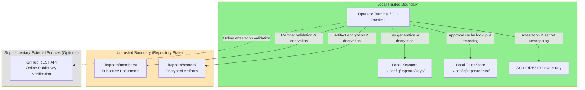
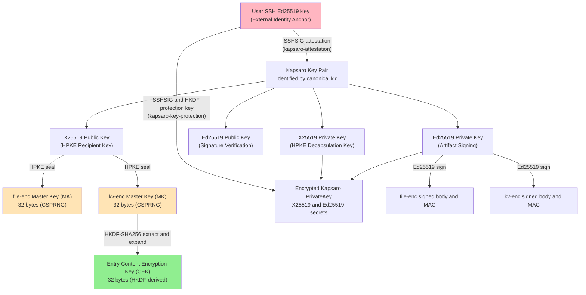
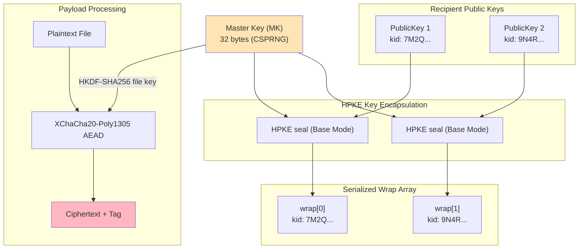
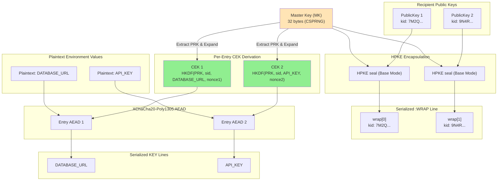
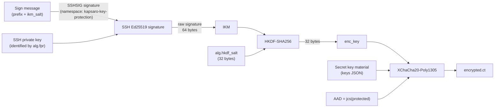
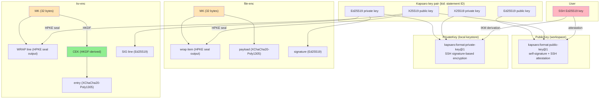

# Kapsaro Security Design

## Contents

- [0. Purpose and Reading Guide](#0-purpose-and-reading-guide)
- [1. Security Guarantees and Threat Model](#1-security-guarantees-and-threat-model)
- [2. Cryptography and Keys](#2-cryptography-and-keys)
- [3. Common Signatures and Verification](#3-common-signatures-and-verification)
- [4. file-enc Protocol](#4-file-enc-protocol)
- [5. kv-enc Protocol](#5-kv-enc-protocol)
- [6. Membership Authorization and Approval](#6-membership-authorization-and-approval)
- [7. Private Keys and Runtime Security](#7-private-keys-and-runtime-security)
- [8. Attacks and Residual Risks](#8-attacks-and-residual-risks)
- [9. Audit and Operational Checks](#9-audit-and-operational-checks)
- [Appendix A: Terminology](#appendix-a-terminology)
- [Appendix B: Context-Binding Reference](#appendix-b-context-binding-reference)
- [Appendix C: Key Relationship Diagram](#appendix-c-key-relationship-diagram)
- [Appendix D: References](#appendix-d-references)

---

<a id="0-document-information"></a>

## 0. Purpose and Reading Guide

<a id="purpose-of-this-document"></a>

### 0.1 Purpose of This Document

This document explains what Kapsaro protects, how its cryptographic formats and verification rules work, and which protections depend on operators and their environment. It also describes implementation requirements, residual risks, and capabilities outside the product's scope.

<a id="intended-audience"></a>

### 0.2 Intended Audience

| Audience | Primary Sections | Objectives |
|----------|------------------|------------|
| Security reviewers and auditors | §1 (Guarantees and Threat Model), §2 (Cryptography and Keys), §3 (Signatures), §4 and §5 (Formats), §8 (Attacks and Risks), §9 (Audit), Appendix B (Context Binding) | Evaluate security claims, cryptographic assumptions, residual risks, and audit points |
| Operators and decision makers | §1 (Guarantees and Threat Model), §6 (Authorization), §7 (Private Keys), §8.8 (Limitations), §9.4 (Operations Checklist) | Assess deployment prerequisites, operational fit, and risks the organization must accept |

---


<a id="1-security-claims-and-boundaries"></a>

## 1. Security Guarantees and Threat Model

The guarantees below assume correct cryptographic implementations and the operational controls described in this chapter. Later chapters explain the formats and verification rules that support them.

### 1.1 Design Motivation and Principles

Kapsaro is an offline-first CLI designed to allow development teams to manage sensitive values—such as `.env` files, TLS certificates, and API credentials—directly within Git review workflows and commit histories. The motivating problem is that sharing secrets across ad-hoc channels (such as chat tools or manual file transfers) routinely leaves unencrypted artifacts across developer workstations, obscures historical access attribution, and makes member offboarding or CI credential rotation prone to omission.

Git provides replication, history, diff review, and a record of membership changes. Repository writers, compromised CI runners, or compromised hosting systems can alter those files. Kapsaro therefore verifies repository content before using it.

Kapsaro uses Git to store and distribute encrypted files, with these protections:
- Recipient-specific key distribution: Encrypt the secret content once and use HPKE to encrypt and distribute its Master Key (MK) separately for each authorized recipient. The MK is the root from which content encryption and MAC keys are derived.
- Self-contained verifiable artifacts: Encrypted payloads embed sufficient structural metadata, public keys, and cryptographic proofs to permit independent verification without external infrastructure.
- Strict local trust isolation: Private keys, local keystores, approval state caches, and SSH signing capabilities reside exclusively within the user's local trusted boundary.
- Fail-closed verification pipeline: Workspace member metadata and encrypted files fetched from Git are treated as untrusted inputs that must pass multi-stage cryptographic and authorization gates prior to consumption.

Verification answers four separate questions:
1. Has the artifact maintained cryptographic integrity?
2. Which specific key pair produced the signature?
3. Is that key holder authorized as a current member of the workspace?
4. Has the local operator reviewed and accepted that key owner?

A valid signature links the signed bytes to a signing key, assuming that key remains secure. Human identity, current membership, and local approval require separate checks (§1.6 and §6).

### 1.2 Core Security Guarantees

The following security claims are guaranteed by design, provided the implementation enforces the invariants in §1.5 and the operational assumptions in §1.3 remain satisfied.

| Security Claim | Underlying Mechanism | Required Assumption | Residual Risk | Detailed Section |
|----------------|----------------------|---------------------|---------------|------------------|
| Confidentiality | HPKE seal/open (`hpke-32-1-3`) + XChaCha20-Poly1305 | Recipient long-term private keys remain uncompromised | Authorized recipients can exfiltrate decrypted plaintext out-of-band | §2, §4, §5 |
| Tamper Detection | Ed25519 digital signatures (PureEdDSA) | Signature verification pipeline is never bypassed | Malicious authorized signers can sign tampered data within their permission scope | §3 |
| Self-Contained Verification | Embedded signer public key document (`signer_pub`) | Signed artifacts encapsulate the signer's public key document | Authorization of the signer requires separate trust policy evaluation | §3 |
| Key Consistency | Strict self-signature verification over public key documents | Originating private key remains uncompromised | Does not prevent adversaries from minting entirely new, valid key pairs | §3.5 |
| Current Membership Authorization | Active member directory (`members/active`) + local approval cache | Repository access controls and local review workflows function as intended | Vulnerable to bootstrap TOFU compromise, unauthorized repository commits, or operator misapproval | §6 |
| Strengthened Identity Assurance | SSH attestation (SSHSIG) + out-of-band review + optional GitHub verification | Operators perform rigorous verification during approval | Vulnerable to initial first-contact MITM or upstream provider compromise | §1.6.4, §3.6, §3.7 |
| Context Binding | Cryptographic binding to file ID (`sid`), key statement ID (`kid`), entry name (`k`), and protocol (`p`) | Cryptographic implementation preserves all specified binding points | Implementation defects that drop binding fields introduce substitution risks | §B, §8 |
| Portable Secret Protection | Passphrase-derived encryption via Argon2id + HKDF-SHA256 | Deployed exclusively within hardened, trusted CI runner environments | Storing the ciphertext and passphrase within the same secret backend eliminates defense-in-depth | §7 |

### 1.3 Security Properties Dependent on Operational Assumptions

Certain security properties cannot be established through cryptographic primitives alone and depend fundamentally on organizational procedures and environment controls.

| Operational Area | Required Operational Assumption |
|------------------|---------------------------------|
| Key Identity Attribution | Rigorous TOFU verification, out-of-band fingerprint confirmation, and optional GitHub online verification |
| Active Membership Integrity | Strict repository access control, mandatory pull request reviews, branch protection rules, and audit logging |
| Local Trusted Boundary Isolation | Hardened operator workstations, restricted filesystem permissions (`0700`/`0600`), and secure SSH agent/key handling |
| CI/CD Key Ingestion | Execution confined to trusted refs (protected branches/tags), maintainer-controlled pipelines, and isolated runners |
| Rollback Prevention | Governance mechanisms that prevent historical, validly signed encrypted artifacts from being reintroduced as current HEAD |

### 1.4 Non-Goals and Explicit Exclusions

Kapsaro explicitly excludes the following capabilities from its threat model:

| Non-Goal | Architectural Rationale |
|----------|-------------------------|
| Post-decryption insider misuse prevention | Once plaintext is legitimately decrypted in process memory, host-level enforcement is outside the scope of encrypted file sharing |
| Retroactive revocation of past disclosures | Data historically decrypted by a former recipient cannot be cryptographically erased from human memory or offline storage |
| Strong forward secrecy across static wraps | Compromise of a recipient's long-term private key enables decryption of all historical wraps addressed to that key |
| Cryptographic identity proof beyond TOFU | Self-signatures and SSH attestations establish key ownership and SSH binding, not verified legal or organizational identity |
| Cryptographic detection of repository rollback | Context bindings ensure internal artifact consistency; they do not enforce monotonic revision counters across Git commits |
| Resilience against identity provider compromise | If a user's GitHub account or identity provider infrastructure is compromised, external validation signals can be spoofed |

### 1.5 Implementation Invariants That Must Be Preserved

The security claims in §1.2 hold only if the software implementation strictly maintains the following architectural invariants:

| Implementation Invariant | Violated Security Claim if Broken |
|--------------------------|-----------------------------------|
| Decrypt payloads and secret values only after signature, trust, and reference checks, HPKE recovery of the MK, and key-possession MAC verification | Tamper detection, fail-closed input processing, and trust policy enforcement |
| Never omit context-binding parameters (`sid`, `kid`, `k`, `p`) from AAD, HPKE info strings, or signed payloads | Cross-file payload splicing, intra-file entry swapping, and key-generation confusion resistance |
| Resolve signature verification keys strictly from the embedded public key document (`signer_pub`) | Self-contained verification and consistent cross-platform acceptance semantics |
| Maintain strict separation between active membership (`members/active`), key-owner approvals (`known_keys`), and recipient-set approvals (`recipient_sets`) | Decoupling of dynamic workspace authorization from operator approval history |
| Restrict expired-key acceptance strictly to decryption and operational signature verification; never permit encryption, signing, or approval of expired keys | Key lifecycle boundaries and operational integrity of the local approval cache |
| Restrict `KAPSARO_STRICT_KEY_CHECKING=no` strictly to approval-cache evaluations on explicitly requested read workflows | Write-path recipient verification, recipient handle consistency, and cryptographic verification guarantees |


<a id="2-threat-model-and-trust-boundaries"></a>

### 1.6 Threat Model and Trust Boundaries

The threat model covers secret confidentiality, artifact integrity, membership decisions, and local approval history. It distinguishes repository attackers from compromises of the trusted local environment.

<a id="21-adversary-model"></a>

#### 1.6.1 Adversary Model

The following access capabilities determine which attacks are possible and which controls are required:

| Adversary Class | Capabilities | Representative Attack Scenarios |
|-----------------|--------------|---------------------------------|
| Repository Tamperer | Arbitrary read and write access to files within `.kapsaro/` | Malicious or compromised CI runners, breached Git hosting servers, rogue branch pushes |
| Public Key Substituter | Ability to replace or modify public key documents within `members/active/` or `members/incoming/` | Man-in-the-middle attacks during member onboarding, unauthorized commits to member directories |
| Key Rotation Adversary | Possession of stale key distribution material, attempting decryption using newly minted keys | Exploitation of incomplete re-encryption workflows or stale recipient sets |
| Context Confusion Adversary | Ability to extract and splice encrypted segments between different files or entries | Transposing ciphertext blocks between production and staging secrets files |
| First-Contact MITM | Interception and substitution of public keys, SSH fingerprints, or GitHub handles during initial repository clone | Exploiting unverified initial onboarding before trust anchors are established |
| Local Keystore Adversary | Local filesystem read or write access targeting `<KAPSARO_HOME>/trust/` | Overwriting local approval databases or rolling back revocation history |

<a id="22-operational-assumptions"></a>

#### 1.6.2 Operational Assumptions

The cryptographic protections require the following operational controls:

Repository Write Governance: While repository data is treated as untrusted input, the active member list (`members/active/`) defines authorization for recipient sets. Organizations must enforce strict branch protections, mandatory pull request reviews, and multi-party approvals for changes to member definitions.

Repository-Level Rollbacks: Because Git preserves historical commits, an adversary with write access can revert a secret file to an older, validly signed commit. Kapsaro's context bindings guarantee that an artifact has not been internally spliced or modified, but cannot enforce monotonic version progression across Git commits. Read-path workflows verify the signer and active recipients, emitting warnings for historical recipients that no longer resolve. Write-path workflows enforce strict normalization, requiring artifacts containing unresolved recipients to be rewrapped prior to persistence. Organizations must rely on deployment automation, audit logs, and branch protection to prevent stale commits from reaching HEAD.

Local Trust Boundary Integrity: The operator's local workstation, keystore directory (`~/.config/kapsaro/keys/`), local trust database (`~/.config/kapsaro/trust/`), and SSH authentication agents are assumed to be secure and uncompromised. Cryptographic signatures on the local trust store detect accidental corruption, but cannot prevent intentional tampering by an adversary with local write privileges.

Trust-On-First-Use (TOFU) Constraints: Initial onboarding of new signers or repositories fundamentally relies on TOFU. Detecting a malicious key injected prior to first contact requires verification through out-of-band communication channels.

<a id="23-trust-boundaries"></a>

#### 1.6.3 Trust Boundaries


```mermaid
graph TB
    subgraph trusted["Local Trusted Boundary"]
        LocalTerminal["Operator Terminal / CLI Runtime"]
        LocalKeystore["Local Keystore<br/>~/.config/kapsaro/keys/"]
        LocalTrustStore["Local Trust Store<br/>~/.config/kapsaro/trust/"]
        SSHKey["SSH Ed25519 Private Key"]
    end

    subgraph untrusted["Untrusted Boundary (Repository State)"]
        MembersDir[".kapsaro/members/<br/>PublicKey Documents"]
        SecretsDir[".kapsaro/secrets/<br/>Encrypted Artifacts"]
    end

    subgraph external["Supplementary External Sources (Optional)"]
        GitHub["GitHub REST API<br/>Online Public Key Verification"]
    end

    LocalTerminal -->|"Key generation & decryption"| LocalKeystore
    LocalTerminal -->|"Approval cache lookup & recording"| LocalTrustStore
    LocalTerminal -->|"Attestation & secret unwrapping"| SSHKey
    LocalTerminal -->|"Member validation & encryption"| MembersDir
    LocalTerminal -->|"Artifact encryption & decryption"| SecretsDir
    LocalTerminal -.->|"Online attestation validation"| GitHub

    style trusted fill:#90EE90
    style untrusted fill:#FFE4B5
    style external fill:#E0E0E0
```

<a id="trusted-components"></a>

##### 1.6.3.1 Trusted Components
- Local Workstation Runtime: The host process executing the Kapsaro binary.
- Local Keystore (`~/.config/kapsaro/keys/`): Secure local storage containing encrypted private key documents (`private.json`) and public key statements (`public.json`).
- Local Trust Store (`~/.config/kapsaro/trust/`): Workstation-local cache recording operator approvals for verified key owners (`known_keys`) and recipient configurations (`recipient_sets`).
- User SSH Ed25519 Key: The host SSH key used to provide cryptographic attestation for Kapsaro public keys and to protect local private key material.

<a id="untrusted-components"></a>

##### 1.6.3.2 Untrusted Components
- Workspace Member Directory (`.kapsaro/members/`): Public key files committed to the repository. Every document must be cryptographically validated via self-signatures and SSH attestations before consumption.
- Workspace Secret Storage (`.kapsaro/secrets/`): Encrypted files (`file-enc` and `kv-enc`). All payloads and metadata are verified via digital signatures and context bindings before processing.

<a id="external-verification-components"></a>

##### 1.6.3.3 External Verification Components
- GitHub API: An optional network oracle used during `member verify` to confirm whether an SSH attestation key is currently registered to a declared GitHub account.

Within this architecture, the user's SSH private key performs two distinct functions:
1. Public Key Attestation: Binds the Kapsaro public key to an established SSH identity via an OpenSSH SSHSIG signature (`kapsaro-attestation` namespace).
2. Private Key Protection: Generates an ephemeral SSH signature (`kapsaro-key-protection` namespace) on demand, from which the symmetric decryption key for `private.json` is derived (see §7.2).

For SSH-protected keys, decryption requires both `private.json` and signing capability for the designated SSH key, through an agent or direct access to the SSH private key. Password-protected keys use the separate flow in §7.3. Host compromise is discussed in §7.4.

<a id="24-multi-layered-trust-architecture"></a>

#### 1.6.4 Multi-Layered Trust Architecture

Kapsaro separates cryptographic verification, membership authorization, local approval, and identity review. These are distinct responsibilities, not a literal execution sequence; the read order appears in §9.1.

| Layer | Verification Mechanism | Assertions Established | Explicit Exclusions |
|-------|------------------------|------------------------|---------------------|
| 1. Cryptographic Verification | Embedded signer public key (`signer_pub`) + Ed25519 signature + AAD bindings | Cryptographic authenticity, payload integrity, and key consistency | Does not establish human identity or workspace authorization |
| 2. Workspace Authorization | Active member directory (`members/active/`) | Current membership authorization and recipient eligibility | Does not guarantee absence of malicious repository commits |
| 3. Local Approval Caching | Local trust database (`known_keys`, `recipient_sets`) | Prior operator review of key owners and write-path member sets | Does not dictate current workspace membership status |
| 4. Identity Corroboration | Out-of-band verification + SSH attestation + GitHub API checks | Corroborating evidence linking public keys to individuals | Does not provide non-repudiable proof against provider compromise |

Layer 1 (Cryptographic Verification) extracts the verification key directly from `signer_pub` embedded within the artifact. It enforces self-signature validity, SSH attestation integrity, key statement consistency (`kid` match), and temporal validity (`expires_at`).

Layer 2 (Workspace Authorization) checks the active member directory (`members/active/`). Because repository files are untrusted, this layer reflects administrative intent managed through Git governance rather than mathematical truth.

Layer 3 (Local Approval Caching) consults the workstation's local trust database. `known_keys` prevents redundant review prompts for previously accepted keys, while `recipient_sets` caches reviewed recipient combinations for write operations.

Layer 4 (Identity Corroboration) combines manual operator confirmation with automated external checks. Online verification queries GitHub to verify that the SSH public key attached to an attestation is currently registered to the claimed account. This check validates present state rather than historical attestation, and does not automatically alter local trust caches.

<a id="controlled-operational-overrides"></a>

##### 1.6.4.1 Controlled Operational Overrides
- Non-Member Acceptance: An interactive, one-time override allowing read access to an artifact signed by an entity absent from `members/active`. It does not grant permanent membership or update local approval caches.
- Expired-Key Recovery: Permits decryption of historical secrets using an expired key via explicit flags (`--allow-expired-key`), but strictly prohibits using expired keys for new signatures, encryption, or member approvals.
- Permissive Key Checking (`KAPSARO_STRICT_KEY_CHECKING=no`): Bypasses local approval prompts on explicitly requested read workflows only. It never bypasses active membership authorization, recipient handle consistency, signature verification, or AEAD integrity checks.

---


<a id="3-common-cryptographic-foundation"></a>

## 2. Cryptography and Keys

The following algorithms support Kapsaro's encryption and verification rules. Their selection follows three criteria:
- Standards alignment: Conformance to rigorous IETF specifications to eliminate ambiguities in wire format and behavior.
- Misuse resistance: Structural reduction of accidental vulnerabilities (e.g., nonce collision hazards, non-canonical encodings).
- Ecosystem affinity: Native interoperability with the OpenSSH public-key ecosystem (specifically `ssh-ed25519` and SSHSIG).

<a id="31-algorithm-summary"></a>

### 2.1 Algorithm Summary

| Cryptographic Primitive | Parameters & Identifiers | Normative Specification | Primary Operational Role |
|-------------------------|--------------------------|-------------------------|--------------------------|
| HPKE Base Mode | Suite `hpke-32-1-3` | RFC 9180 | Recipient Content Key encapsulation (seal/open) |
| DHKEM(X25519, HKDF-SHA256) | `kem_id = 32` (`0x0020`) | RFC 9180 | Asymmetric key encapsulation mechanism |
| HKDF-SHA256 | `kdf_id = 1` (`0x0001`); application schedule in §2.5 | RFC 5869 | Internal HPKE KDF, file payload and MAC keys, kv-enc Content Encryption Keys (CEKs) for individual entries, and the PrivateKey protection key `enc_key` (including Argon2id output; §7.3) |
| ChaCha20-Poly1305 | `aead_id = 3` (`0x0003`) | RFC 8439 | Internal HPKE AEAD for MK encapsulation |
| XChaCha20-Poly1305 | Nonce 24 bytes, key 32 bytes | draft-irtf-cfrg-xchacha (§D) | Symmetric encryption for file-enc payloads, kv-enc entries, and local keystore PrivateKeys |
| Ed25519 (PureEdDSA) | Curve25519, SHA-512 | RFC 8032 | Digital signature generation, verification, and tamper detection |
| JCS (JSON Canonicalization) | Deterministic UTF-8 byte serialization | RFC 8785 | Deterministic normalization of signing payloads, AAD, and HPKE info strings |
| base64url | Unpadded URL-safe Base64 | RFC 4648 Section 5 | Binary-to-text wire encoding |

<a id="32-hybrid-public-key-encryption-rfc-9180-hpke"></a>

### 2.2 Hybrid Public Key Encryption (RFC 9180 HPKE)

Kapsaro utilizes HPKE in Base mode for recipient-specific key delivery.

<a id="architectural-rationale"></a>

#### 2.2.1 Selection Rationale
- Formal standardization: Provides an internationally standardized framework uniting KEM, KDF, and AEAD under a single coherent specification.
- Per-wrap ephemerality: Base mode mandates generating a fresh ephemeral key pair for every recipient wrap, preventing cross-wrap nonce or state reuse. If a recipient's long-term private key is compromised, all historical wraps addressed to that key become decryptable (see §8.8.2).
- Unambiguous ciphersuite registry: Cryptographic parameters are identified via official IANA HPKE registries, eliminating implementation confusion.

<a id="ciphersuite-configuration"></a>

#### 2.2.2 Ciphersuite Configuration
```
hpke-32-1-3
├── kem_id  = 32 (0x0020) DHKEM(X25519, HKDF-SHA256)
├── kdf_id  = 1  (0x0001) HKDF-SHA256
└── aead_id = 3  (0x0003) ChaCha20-Poly1305
```

<a id="evaluation-of-architectural-alternatives"></a>

#### 2.2.3 Alternatives
- RSA-OAEP: Rejected due to prohibitive key sizes, ciphertext overhead, and the absence of a standardized framework for binding arbitrary ambient context (`info` and AAD) uniformly across operations.
- Custom ECIES: Rejected due to lack of formal standardization and high probability of subtle cryptographic misconfigurations.
- Age (X25519-ChaChaPoly): Rejected because its monolithic header format lacks the structured extensibility required for Kapsaro's fine-grained context binding.

<a id="known-boundaries"></a>

#### 2.2.4 Limitations
- Base mode provides recipient confidentiality but does not authenticate the sender; author authenticity is independently enforced via Ed25519 signatures.
- X25519 provides a 128-bit classical security strength level.

<a id="33-symmetric-aead-xchacha20-poly1305"></a>

### 2.3 Symmetric AEAD (XChaCha20-Poly1305)

XChaCha20-Poly1305 provides authenticated encryption with associated data (AEAD) for file-enc payloads (§4.5), individual kv-enc entries (§5.4), and local keystore PrivateKey files (§7.2).

<a id="architectural-rationale-1"></a>

#### 2.3.1 Selection Rationale
- Negligible collision probability: An extended 24-byte (192-bit) nonce pushes the birthday-bound collision threshold to $2^{96}$ encryptions under a single key, rendering random nonce generation secure.
- Constant-time software execution: Delivers uniform, high-throughput performance across all CPU architectures without relying on hardware-accelerated AES-NI instructions.
- Defense-in-depth safety margin: While the cipher does not offer misuse resistance, the large nonce space protects against catastrophic key reuse.

<a id="evaluation-of-architectural-alternatives-1"></a>

#### 2.3.2 Alternatives
- AES-256-GCM: Rejected because its standard 12-byte (96-bit) nonce carries unacceptable collision risks when nonces are generated randomly across distributed hosts.
- AES-256-GCM-SIV: While deterministic nonce-misuse resistance is appealing, it was rejected due to implementation complexity, lack of standard library support across targets, and performance penalties on non-AES-NI hardware.

<a id="inherent-constraints"></a>

#### 2.3.3 Inherent Constraints
- Nonce reuse: Reusing a nonce under the same key compromises confidentiality and integrity. Kapsaro uses fresh randomness and context-specific key derivation to reduce this risk (§2.8).
- Prohibition of compression: Input plaintext must never be compressed prior to encryption to eliminate side-channel compression oracle attacks (e.g., CRIME/BREACH).

<a id="34-digital-signatures-rfc-8032-ed25519-pureeddsa"></a>

### 2.4 Digital Signatures (RFC 8032 Ed25519 PureEdDSA)

Ed25519 binds document contents to the signing key and detects modifications (§3). Attributing that key to a person requires separate identity review and secure key handling.

<a id="architectural-rationale-2"></a>

#### 2.4.1 Selection Rationale
- Deterministic signature generation: RFC 8032 PureEdDSA derives signature nonces deterministically from the private key and message hash. This property is mandatory for Kapsaro's SSH-based PrivateKey protection pipeline (§7.2), where signature bytes serve as Input Keying Material (IKM).
- High verification throughput: Enables sub-millisecond signature validation across large workspaces.
- Native OpenSSH interoperability: Aligns with OpenSSH `ssh-ed25519` key formats and the SSHSIG attestation standard.

<a id="evaluation-of-architectural-alternatives-2"></a>

#### 2.4.2 Alternatives
- ECDSA (P-256): Rejected because signature nonces are non-deterministic by default (RFC 6979 mitigates this, but support is inconsistent across hardware tokens and SSH implementations).
- Ed448: Rejected due to minimal adoption within the OpenSSH ecosystem and excessive signature length.

<a id="inherent-constraints-1"></a>

#### 2.4.3 Inherent Constraints
- PureEdDSA provides a 128-bit classical security level.
- PureEdDSA does not natively separate message contexts; domain separation is enforced through JCS serialization and explicit protocol identifier strings (`p`).

<a id="35-key-derivation-function-rfc-5869-hkdf-sha256"></a>

### 2.5 Key Derivation Function (RFC 5869 HKDF-SHA256)

HKDF-SHA256 derives cryptographically independent, purpose-separated symmetric keys using explicit `salt` and `info` parameters, incorporating ambient context such as file identifiers (`sid`), key statement IDs (`kid`), entry keys (`k`), and protocol tags (`p`) into the key schedule (§5.3, §B.2, §7.2.1, §7.3.2).

<a id="architectural-rationale-3"></a>

#### 2.5.1 Selection Rationale
- Extract and expand: HKDF derives pseudorandom keys under assumptions about HMAC and the entropy of the input keying material. The analysis depends on the input source and use case; see [RFC 5869, Section 5](https://www.rfc-editor.org/rfc/rfc5869.html#section-5).
- Domain separation: Distinct `info` values separate key uses. This provides computational separation under the HKDF assumptions, rather than a guarantee that finite-length outputs never collide.
- Salt-driven diversification: Enables deriving distinct key streams from identical IKM inputs.

<a id="deployment-points"></a>

#### 2.5.2 Deployment Points
- HPKE internal key schedule: KDF utilized within the `hpke-32-1-3` ciphersuite (§2.2).
- kv-enc entry key schedule: Derives per-entry Content Encryption Keys (CEKs) from the artifact Master Key (MK), salt, file ID (`sid`), and entry name (`k`).
- PrivateKey protection pipeline: Derives local encryption keys (`enc_key`) from SSH signatures or Argon2id outputs, binding the resulting key to `kid` and `salt` (§7.2, §7.3).

<a id="36-deterministic-json-serialization-rfc-8785-jcs"></a>

### 2.6 Deterministic JSON Serialization (RFC 8785 JCS)

The JSON Canonicalization Scheme (JCS) converts JSON data into canonical UTF-8 bytes. Given the same accepted input, RFC 8785-conforming implementations produce the same bytes for signatures, AAD, and HPKE contexts. Schema validation and duplicate-key rejection precede canonicalization.

<a id="architectural-rationale-4"></a>

#### 2.6.1 Selection Rationale
- Elimination of parsing variance: Resolves whitespace differences, key ordering permutations, and number formatting discrepancies across platforms.
- Robustness against special characters: Ensures that arbitrary characters within file IDs (`sid`) or user handles serialize deterministically without ambiguous escape sequences.

<a id="deployment-points-1"></a>

#### 2.6.2 Deployment Points
- file-enc: Canonicalization of the top-level `protected` object for signing, and `payload.protected` for AEAD AAD construction (§3.2, §4.5).
- kv-enc: Normalization of serialized token payloads and canonical document verification (§5.1).
- Public & Private Keys: Serialization of the `protected` header for `kid` derivation and AEAD protection (§2.10.4.2, §7.2).
- HPKE Contexts: Production of identical canonical context bytes for `info` and AAD inputs (§B.3).

<a id="inherent-constraints-2"></a>

#### 2.6.3 Inherent Constraints
- JCS operates strictly at the syntactic level. It does not validate structural semantics, expiration timestamps, or key material consistency; these must be verified via explicit schema and cryptographic rules.

<a id="37-inherent-guarantees-and-constraints-of-underlying-primitives"></a>

### 2.7 Inherent Guarantees and Constraints of Underlying Primitives

| Primitive | Assumed Cryptographic Guarantee | Architectural Impact on Kapsaro |
|-----------|---------------------------------|---------------------------------|
| HPKE Base Mode (RFC 9180) | Recipient confidentiality under the HPKE assumptions; no sender authentication | Ed25519 authenticates the signed bytes; the content-key MAC binds those bytes and the signer ID to possession of the MK. Authorization and approval require separate checks |
| XChaCha20-Poly1305 | Confidentiality and ciphertext integrity under the primitive's assumptions, including nonce uniqueness for each key | Nonce reuse compromises security; fresh randomness and key derivation reduce the risk (§2.8) |
| Ed25519 (PureEdDSA) | Existential unforgeability under chosen-message attacks (EUF-CMA) assuming private key secrecy | Artifact and public key authenticity relies on private key security; guarantees collapse if a signer's private key is leaked |
| HKDF-SHA256 | Pseudorandom key derivation under assumptions about HMAC and the input source | Extraction can concentrate existing entropy; it cannot create entropy missing from a predictable input. Purpose-separated expansion derives CEKs and protection keys |

<a id="38-nonce-safety-margins"></a>

### 2.8 Nonce Safety Margins

Kapsaro reduces the risk of reusing a key and nonce through fresh randomness and context-specific key derivation:
- file-enc: A fresh 32-byte Master Key (MK) is generated via CSPRNG for each encryption operation. The payload encryption key is derived once and used to encrypt exactly one payload.
- kv-enc: A fresh random 24-byte nonce is generated for each entry encryption and included in CEK derivation together with the file ID and entry name. Repeating the same nonce for the same entry under the same artifact PRK would repeat the CEK as well.
- PrivateKey protection: A fresh 32-byte `ikm_salt` and 32-byte `hkdf_salt` are generated for each export or save operation, deriving an ephemeral `enc_key` used for a single AEAD encryption.

These measures depend on a correctly operating CSPRNG and cryptographic derivation. Random values and derived keys have finite output spaces, so collision probability is small, not zero. For $q$ independent uniformly random 192-bit nonces, the birthday approximation is $q(q-1)/2^{193}$ when $q$ is well below $2^{96}$. Kapsaro must still avoid reuse of a nonce under the same key.

<a id="39-cryptographic-strength-and-security-levels"></a>

### 2.9 Cryptographic Strength and Security Levels

| Cryptographic Primitive | Parameter / Key Size | Classical Security Strength | Cryptanalytic Basis |
|-------------------------|----------------------|----------------------------|---------------------|
| X25519 (DHKEM) | 256 bits | 128 bits | Elliptic Curve Discrete Logarithm Problem (ECDLP) |
| Ed25519 (Digital Signatures) | 256 bits | 128 bits | Elliptic Curve Discrete Logarithm Problem (ECDLP) |
| XChaCha20-Poly1305 | Key: 256 bits, Nonce: 192 bits, Tag: 128 bits | 256-bit key search; authentication bounds depend on message length and verification attempts | ChaCha20 and Poly1305 assumptions |
| ChaCha20-Poly1305 (HPKE) | Key: 256 bits, Nonce: 96 bits, Tag: 128 bits | 256-bit key search; authentication bounds depend on message length and verification attempts | ChaCha20 and Poly1305 assumptions |
| HKDF-SHA256 | Output: 256 bits | Depends on input entropy and HMAC assumptions | HKDF extraction and expansion analysis |

X25519 and Ed25519 set an approximately 128-bit classical security target. This is not a uniform bound on every attack: authentication also depends on message sizes and the number of forgery attempts. A 256-bit symmetric key does not make the complete protocol resistant to quantum attacks on its public-key algorithms. ChaCha20-Poly1305 uses a 128-bit authentication tag; see [RFC 8439, Section 2.8](https://www.rfc-editor.org/rfc/rfc8439.html#section-2.8).

---


<a id="4-key-hierarchy-and-key-lifecycle"></a>

### 2.10 Key Hierarchy and Key Lifecycle

The tables below distinguish member keys, content keys, and private-key protection keys by role and lifetime. Their use in each format is described in §4, §5, and §7.

<a id="41-key-types-and-architectural-relationships"></a>

#### 2.10.1 Key Types and Architectural Relationships

| Key Classification | Origin & Ownership | Operational Lifetime | Primary Cryptographic Functions | Reference |
|--------------------|--------------------|----------------------|---------------------------------|-----------|
| User SSH Ed25519 Key | External (operator-owned) | Long-term | Public key attestation; ephemeral IKM derivation for PrivateKey encryption | §3.6, §7.2 |
| Kapsaro Key Pair (`kid`) | Internal (`key new`); X25519 + Ed25519 | Long-term (valid until `expires_at`) | HPKE key encapsulation/decapsulation; Ed25519 signing and verification | §3, §4, §5 |
| Content and protection keys (`MK`, `CEK`, `enc_key`) | CSPRNG or HKDF | Plaintext buffers are temporary; wrapped MKs and derivation inputs support later decryption | Payload encryption, entry AEAD, local keystore encryption | §4.3, §5.3, §7.2.1 |


```mermaid
graph TB
    SSHKey["User SSH Ed25519 Key<br/>(External Identity Anchor)"]
    KapsaroKP["Kapsaro Key Pair<br/>Identified by canonical kid"]
    KEM_PK["X25519 Public Key<br/>(HPKE Recipient Key)"]
    KEM_SK["X25519 Private Key<br/>(HPKE Decapsulation Key)"]
    SIG_PK["Ed25519 Public Key<br/>(Signature Verification)"]
    SIG_SK["Ed25519 Private Key<br/>(Artifact Signing)"]
    FILE_MK["file-enc Master Key (MK)<br/>32 bytes (CSPRNG)"]
    KV_MK["kv-enc Master Key (MK)<br/>32 bytes (CSPRNG)"]
    CEK["Entry Content Encryption Key (CEK)<br/>32 bytes (HKDF-derived)"]
    ProtectedKeys["Encrypted Kapsaro PrivateKey<br/>X25519 and Ed25519 secrets"]
    FileSignature["file-enc signed body and MAC"]
    KvSignature["kv-enc signed body and MAC"]

    SSHKey -->|"SSHSIG attestation<br/>(kapsaro-attestation)"| KapsaroKP
    SSHKey -->|"SSHSIG and HKDF protection key<br/>(kapsaro-key-protection)"| ProtectedKeys
    KEM_SK --> ProtectedKeys
    SIG_SK --> ProtectedKeys
    KapsaroKP --> KEM_PK
    KapsaroKP --> KEM_SK
    KapsaroKP --> SIG_PK
    KapsaroKP --> SIG_SK
    KEM_PK -->|"HPKE seal"| FILE_MK
    KEM_PK -->|"HPKE seal"| KV_MK
    SIG_SK -->|"Ed25519 sign"| FileSignature
    SIG_SK -->|"Ed25519 sign"| KvSignature
    KV_MK -->|"HKDF-SHA256 extract and expand"| CEK

    style SSHKey fill:#FFB6C1
    style FILE_MK fill:#FFE4B5
    style KV_MK fill:#FFE4B5
    style CEK fill:#90EE90
```

The user's SSH key is entirely external to Kapsaro and performs two decoupled roles separated by OpenSSH signature namespaces:
- Public key attestation: Uses namespace `kapsaro-attestation` to link the Kapsaro public key to an SSH identity.
- Local PrivateKey protection: Uses namespace `kapsaro-key-protection` to derive local encryption keys on demand.

Reusing the same SSH key across both roles is cryptographically safe because the OpenSSH SSHSIG standard enforces namespace-isolated message hashing (see §7.1.1).

<a id="42-key-parameter-specifications"></a>

#### 2.10.2 Key Parameter Specifications

| Key Identifier | Bit Length | Generation Method | Operational Role | Context-Binding Contribution | Memory Zeroization |
|----------------|------------|-------------------|------------------|------------------------------|--------------------|
| SSH Ed25519 Private Key | 256 bits | External (operator-managed) | Attestation; local keystore unwrapping | Indirect; bound via attestation body and PrivateKey AAD | Managed by host OS / agent |
| X25519 Private Key (KEM) | 256 bits | CSPRNG | HPKE decapsulation (open) | Defines canonical `kid` (§B) | Mandatory (MUST) |
| X25519 Public Key (KEM) | 256 bits | Scalar multiplication of KEM SK | HPKE encapsulation (seal) | Defines canonical `kid` (§B) | Optional (public) |
| Ed25519 Private Key (Sign) | 256 bits | CSPRNG | Digital signature generation | Corresponds to artifact `kid` (§B) | Mandatory (MUST) |
| Ed25519 Public Key (Verify) | 256 bits | Derive the signing scalar from the seed and multiply the curve base point | Digital signature verification | Defines canonical `kid` (§B) | Optional (public) |
| Master Key (`MK`, file-enc) | 256 bits | CSPRNG | Payload encryption key root | Payload header AAD embeds file ID `sid` (§4.5) | Mandatory (MUST) |
| Master Key (`MK`, kv-enc) | 256 bits | CSPRNG | CEK derivation root | Wrap embeds `kid`/`sid`/`p` (§5.5); derivation embeds `sid`/`k`/nonce (§5.3) | Mandatory (MUST) |
| Content Encryption Key (`CEK`) | 256 bits | HKDF-SHA256 expansion | Individual entry AEAD encryption | HKDF embeds `sid`/`k`/nonce; entry AAD embeds `k`/`sid`/`p` (§5.3, §5.4) | Mandatory (MUST) |
| PrivateKey Encryption Key (`enc_key`) | 256 bits | HKDF-SHA256 expansion | Local `private.json` AEAD encryption | AEAD AAD binds canonical `jcs(protected)` header (§7.2.1) | Mandatory (MUST) |

<a id="operational-notes"></a>

##### 2.10.2.1 Operational Notes
- `enc_key` is strictly ephemeral; it is derived in memory on demand and is never serialized to persistent storage.
- One SSH key can protect several Kapsaro key generations. The `kid` and salt values separate their protection-key derivation contexts under the HKDF assumptions.
- Memory Zeroization: The "Mandatory (MUST)" specification represents a strict design invariant. Implementations must clear memory buffers holding symmetric keys and private scalar material immediately after use, though complete kernel-level erasure is subject to process-environment boundaries (§9.3).

<a id="43-recipient-eligibility-and-authorization"></a>

#### 2.10.3 Recipient Eligibility and Authorization

Determining whether an entity is an authorized recipient is an access-control decision governed by §1.6.4, rather than a cryptographic certainty. Only public keys explicitly present within `members/active/` are authorized as recipients for encryption operations.

Candidates residing within `members/incoming/` are treated as untrusted inputs (§1.6.1). Until an administrative operator reviews their public key and promotes them to `members/active/` via `rewrap`, candidate members cannot decrypt existing secrets.

The cryptographic implications of membership transitions are asymmetrical (§5.8):
- Recipient Addition (Promoting Incoming to Active): Both `file-enc` and `kv-enc` maintain the existing Master Key (MK), appending new HPKE wrap entries for the new recipient.
- Recipient Removal (Offboarding): Both formats strictly regenerate the Master Key (MK). In `file-enc`, the full payload is re-encrypted; in `kv-enc`, every entry is re-encrypted under fresh CEKs derived from the new MK (§5.8).

Membership acceptance and human identity validation remain decoupled: administrative inclusion in `members/active/` establishes authorization, whereas identity confidence depends on Layer 4 checks (TOFU, out-of-band verification, GitHub cross-checks).

<a id="44-key-lifecycle-transitions"></a>

#### 2.10.4 Key Lifecycle Transitions

The diagram summarizes creation, local selection, replacement, and expiry. These describe key management; workspace authorization is checked separately.

```
Creation ──> Active ──> Expired
               │
               └──> Rotated (Replaced by a newly minted key pair)
```

- Creation: Generated via `kapsaro key new`. A new key pair and signed public key statement are minted and stored within the local keystore.
- Active: The key selected for the local member handle. It must be unexpired for new signatures and wraps, and its public key must separately satisfy workspace authorization and approval requirements. Creating or selecting a local key does not add it to `members/active/`.
- Expired: The state after `expires_at` has elapsed. Generating new signatures or creating new wraps is strictly rejected. Decrypting historical artifacts or verifying operational signatures is rejected by default, and permitted with warnings only when explicit recovery flags are provided.
- Rotated: Generate a replacement member key pair with `kapsaro key new`, review and distribute its public key, replace the old active member key, and update the affected artifacts with `rewrap`. Historical private keys remain in the local keystore until explicitly removed. `rewrap --rotate-key` regenerates artifact Master Keys; it does not create a member key pair or a new `kid`.

An unexpired local key that is no longer selected is available for historical decryption. Once it expires, the expired-key recovery rules apply. The local active/available state and inclusion in the workspace's `members/active/` directory are separate decisions.

<a id="expiration-semantics"></a>

##### 2.10.4.1 Expiration Semantics
Key expiration establishes an administrative boundary against generating new ciphertext with stale credentials. It does not retroactively invalidate the cryptographic consistency or context binding of historical artifacts. Decrypting artifacts using expired credentials requires explicit operator authorization via `--allow-expired-key`, `KAPSARO_ALLOW_EXPIRED_KEY=yes`, or `allow_expired_key="yes"`.

Kapsaro does not employ traditional Certificate Revocation Lists (CRLs) or online OCSP responders. Revoking operational trust from a compromised key requires removing it from `members/active/`, rewrapping workspace artifacts, and updating the local approval database (`known_keys`; see §8.8.4).

<a id="441-immutability-of-key-statement-id-kid"></a>

##### 2.10.4.2 Immutability of Key Statement ID (kid)

Every Kapsaro key pair is identified by an immutable `kid` (Key Statement ID). The `kid` is a 32-character, unpadded Crockford Base32 string computed deterministically from the public key document:
1. Extract the `PublicKey.protected` JSON object and remove the `kid` field (`protected_without_kid`).
2. Canonicalize the object to UTF-8 bytes using RFC 8785 JCS (§2.6).
3. Compute the SHA-256 digest of the canonical bytes.
4. Truncate the digest to its leading 20 bytes (160 bits).
5. Encode the 20 bytes into 32 characters of Crockford Base32 without hyphens:
   $$\text{kid} = \text{Encode\_CrockfordBase32}\left(\text{SHA-256}\left(\text{JCS}(\text{protected\_without\_kid})\right)[0..20]\right)$$

The serialized `protected.kid` must strictly match this recomputed digest. Crockford Base32 eliminates visually confusable characters (`I`, `L`, `O`, `U`), preventing manual transcription errors across terminals, URLs, and Git review interfaces.

The public keys, SSH attestation, `binding_claims`, and `expires_at` participate in `kid` derivation. Changes require a new statement ID and corresponding wraps and signatures, subject to the collision resistance of the truncated hash (§B). The `kid` identifies a public key statement; it is not a CEK derivation input.

<a id="45-key-rotation-procedures"></a>

#### 2.10.5 Key Rotation Procedures

Member key replacement and content-key renewal are separate operations. Generate replacement member keys with `key new`, then review, distribute, and activate their public keys. Use `rewrap` to update encrypted artifacts after:
- Membership updates: Adding or offboarding recipients.
- Lifecycle maintenance: Transitioning to a new key generation prior to `expires_at`.
- Compromise containment: Mitigating exposure following suspected private key disclosure (§8.8.2).

As detailed in §5.8, adding recipients preserves existing content keys, whereas removing recipients or invoking `--rotate-key` forces Master Key regeneration and complete payload/entry re-encryption. Key rotation limits exposure for future commits, but cannot retroactively protect historical ciphertext already distributed to an adversary (§8.8.2).

---


<a id="5-signature-and-verification-architecture"></a>

## 3. Common Signatures and Verification

Each signed encrypted artifact embeds its signer's complete public key document in `signer_pub`. Verification uses that document without an external key lookup. Membership and local approval are evaluated separately (§6).

<a id="50-common-artifact-signature-format-signature_v4"></a>

### 3.0 Common Artifact Signature Format (signature_v4)

Both `file-enc` and `kv-enc` artifacts utilize the standardized `signature_v4` structure (implemented as `ArtifactSignature`):
- Embedded signer public key: Embeds the signer's complete `PublicKey` document (`signer_pub`), ensuring verification key resolution is self-contained.
- Key Statement Binding: Explicitly declares the signer's `kid`, binding the signature to a specific key generation.
- Cryptographic Key-Possession Proof (`mac`): Encapsulates an HMAC proving that the signer possesses the underlying Master Key (MK) that decrypts the artifact payload.
- Integrated Verification Chain: Unifies public key document validation and artifact signature verification into an uninterrupted pipeline (§3.4).

<a id="distinct-document-formats"></a>

#### 3.0.1 Distinct Document Formats
1. Artifact Signatures (`signature_v4`): Used in `file-enc` and `kv-enc`. Embeds `signer_pub`, `kid`, `mac`, and `sig`.
2. Local Trust Store (`kapsaro:format:local-trust@1`): Shares the `alg`/`kid`/`sig` fields but deliberately omits `signer_pub`. It is verified against the local owner's key in the keystore (§6.4).
3. Public Key Documents (`kapsaro:format:public-key@1`): Employs a bare base64url string holding an 86-character Ed25519 self-signature over `jcs(protected)`. Because a public key statement has no external signer or encrypted payload, it requires neither `signer_pub` nor `mac`.

Implementations that assume a single uniform signature schema across all documents will fail to process public key statements.

<a id="fields-of-the-signature_v4-structure"></a>

#### 3.0.2 Fields of the `signature_v4` Structure

| Field | Representation | Value / Content | Security Role |
|-------|----------------|-----------------|---------------|
| `alg` | string | Always `eddsa-ed25519` (PureEdDSA) | Unambiguous declaration of the digital signature algorithm |
| `kid` | Crockford Base32 (32 chars) | Signer's Key Statement ID | Binds the signature context to the signer's specific key generation (§2.10.4.2, §B) |
| `signer_pub` | JSON Object | Signer's complete `PublicKey` document | Exclusive source of the verification key; self-signature and SSH attestation are validated here |
| `mac` | string | `hmac-sha256:<base64url>` | Proves that the signer possessed the Master Key (MK) corresponding to the artifact |
| `sig` | base64url (unpadded) | 64-byte Ed25519 signature | Guarantees tamper detection across the domain tag, signature header, document body, and MAC |

Artifacts omitting `signer_pub` are rejected fail-closed. Kapsaro strictly prohibits searching the workspace or local keystore as fallback sources for signer keys. Permitting fallback lookup would introduce implementation drift and violate the invariant established in §1.5.

<a id="51-comparison-of-container-signing-methods"></a>

### 3.1 Comparison of Container Signing Methods

While both formats adhere to `signature_v4`, they adapt the signed byte serialization to their underlying data containers (JSON versus line-oriented text).

| Specification Attribute | file-enc Protocol | kv-enc Protocol |
|-------------------------|-------------------|-----------------|
| Signed Byte Sequence | Length-framed concatenation of signature domain tag, `signature_header`, `jcs(protected)`, and `ascii(signature.mac)` | Length-framed concatenation of signature domain tag, `signature_header`, canonical line bytes, and `ascii(signature.mac)` |
| Serialized Location | `signature` object in JSON root | Terminal `:SIG` line in document |
| Integrity Scope | Entire `protected` object (`sid`, `wrap[]`, `payload`, timestamps) | Entire body (`:HEAD`, `:WRAP`, all `KEY` lines) |
| Signature Algorithm | `eddsa-ed25519` (RFC 8032) | `eddsa-ed25519` (RFC 8032) |
| Key-Possession Proof | HMAC-SHA256 over length-framed body bytes and `kid` | HMAC-SHA256 over length-framed canonical bytes and `kid` |

The key-possession proof (`mac`) is computed using a dedicated MAC key derived from the Master Key (MK) via HKDF-SHA256. It executes under the domain `kapsaro:mac:key-possession@1` over the length-framed body bytes and `signature.kid`. The outer Ed25519 signature is then computed under the domain `kapsaro:sig:artifact-signature@1` over the length-framed `signature_header`, body bytes, and `signature.mac`.

Because signature verification validates that `signature.kid` matches `signer_pub.protected.kid`, the HMAC establishes that the creator of the signature possessed the artifact Master Key.

<a id="52-file-enc-container-signatures"></a>

### 3.2 file-enc Container Signatures

In `file-enc`, the signed byte stream is constructed under domain `kapsaro:sig:artifact-signature@1` by length-framing:
1. `signature_header` derived from `signature.alg` and `signature.kid`.
2. `jcs(protected)` representing the JCS-canonicalized top-level `protected` object.
3. ASCII representation of `signature.mac`.

Consequently, every field within `protected`—including `sid`, all `wrap[]` entries, `removed_recipients`, timestamps, and the complete `payload` structure (`payload.protected` and `payload.encrypted`)—is bound by the signature. The signature value `signature.sig` is excluded from the input to prevent circular definitions. Independently, `jcs(payload.protected)` serves as AEAD AAD during payload encryption (§4.5).

<a id="53-kv-enc-document-signatures"></a>

### 3.3 kv-enc Document Signatures

In `kv-enc`, the signed byte stream is constructed under domain `kapsaro:sig:artifact-signature@1` by length-framing:
1. `signature_header` derived from `signature.alg` and `signature.kid`.
2. `canonical_bytes` representing the LF-terminated concatenation of all lines preceding `:SIG` (`:KAPSARO_KV`, `:HEAD`, `:WRAP`, and all `KEY` lines).
3. ASCII representation of `signature.mac`.

The signature covers the document body, including all entry tokens and variable names, together with the key-possession MAC.

<a id="54-multi-stage-cryptographic-verification-pipeline"></a>

### 3.4 Multi-Stage Cryptographic Verification Pipeline

For all encrypted artifacts, signature verification strictly consumes the public key embedded in `signer_pub`. Verification proceeds across three sequential gates (Layer A → Layer B → Layer C):

```
[ Artifact Input ]
        │
        ▼
[ Layer A: Validate signer_pub Document ]
   ├── Schema & Structural Conformance
   ├── Strict Self-Signature Verification (§3.5)
   └── SSH Attestation Verification (§3.6)
        │
        ▼
[ Layer B: Key Statement Context Binding ]
   └── Verify signature.kid == signer_pub.protected.kid
        │
        ▼
[ Layer C: Document Integrity & Proof Verification ]
   ├── Verify Ed25519 signature over signed body + MAC
   ├── HPKE open to recover Master Key (MK)
   └── Recompute and verify signature.mac using derived MAC key
        │
        ▼
[ Plaintext Decryption Permitted ]
```

- Layer A (Validation of `signer_pub`): Verifies that the embedded public key is syntactically valid, conforms to schema rules, carries a valid self-signature, and satisfies SSH attestation constraints.
- Layer B (Key Statement Binding): Confirms that `signature.kid` matches `signer_pub.protected.kid`.
- Layer C (Integrity and Proof Verification): Verify the Ed25519 signature using `signer_pub`, including the stored MAC string in the signed input. After trust and reference checks, use HPKE open to recover the MK, derive the MAC key, and verify `signature.mac`. Layer C completes only after this MAC check; payload decryption follows.

This flow strictly enforces the invariant in §1.5: plaintext decryption is impossible without passing signature, reference consistency, and proof checks.

<a id="55-publickey-self-signatures-and-strict-validation"></a>

### 3.5 PublicKey Self-Signatures and Strict Validation

Every `PublicKey` document carries a self-signature over its canonical `protected` object, establishing Key Consistency (§A): mathematical proof that the entity publishing the document possesses the corresponding private signing key.

<a id="strict-ed25519-validation"></a>

#### 3.5.1 Strict Ed25519 Validation
All Ed25519 signature verification in Kapsaro is strict:
- Verifying public keys of small order are rejected.
- Signatures with non-canonical or small-order `R` points are rejected.

This strictness is mathematically essential for key consistency. Under standard Ed25519 verification without small-order checks, an adversary could generate a weak public key of order 8, allowing forged signatures to validate over arbitrary messages without knowledge of any private key. Strict rejection eliminates this vulnerability.

Self-signatures prevent an adversary from tampering with existing public keys in transit, but cannot prevent an adversary from generating a brand-new key pair with a valid self-signature. Defending against rogue key injection depends on Layer 2–4 trust policies (§6).

<a id="56-ssh-key-attestation-sshsig"></a>

### 3.6 SSH Key Attestation (SSHSIG)

SSH attestation provides cryptographic evidence linking Kapsaro key material (both KEM and signing keys) to an established host SSH key. The signature is formatted according to OpenSSH `SSHSIG` specifications under the fixed namespace `kapsaro-attestation`.

The signed message is the JCS-canonicalized JSON representation of the attestation body, containing:
- `p = "kapsaro:sshsig:public-key:attestation@1"`
- `subject_handle`
- `keys` (X25519 and Ed25519 public keys)
- Optional `binding_claims` (e.g., GitHub account)
- Optional `created_at` and `expires_at`

The `kid`, `attestation`, and `signature` fields are excluded from the attestation body. Attestation proves that the SSH key owner authorized the generation of this Kapsaro key statement. It does not certify human identity, which must be corroborated through administrative review or online checks.

<a id="57-online-identity-verification-via-github"></a>

### 3.7 Online Identity Verification via GitHub

When a public key document includes a `binding_claims.github_account` claim, Kapsaro's online verification queries the GitHub REST API to confirm whether the SSH public key attached to the attestation is actively registered to that GitHub user account.

This check serves as supplementary evidence for operator identity evaluation (Layer 4 in §1.6.4). It does not replace the cryptographic verification chain (§3.4), nor does it constitute an automated revocation mechanism. If a GitHub account or upstream infrastructure is compromised, external API responses cannot be trusted as definitive truth (§1.6.4).

---


<a id="6-file-enc-protocol"></a>

## 4. file-enc Protocol

The `file-enc` protocol encrypts a file for a recipient set. A random Master Key (MK) supplies the input to HKDF, which derives separate payload and MAC keys. XChaCha20-Poly1305 encrypts the file body with the payload key, and HPKE Base mode (`hpke-32-1-3`) wraps the MK for each recipient. An Ed25519 signature covers metadata, wraps, the payload, and the MAC before payload decryption.

<a id="61-data-structure-overview"></a>

### 4.1 Data Structure Overview

`file-enc` is formatted as a JSON-based signed container. The core elements subject to cryptographic review are:

| Element | Serialized Content | Cryptographic Role |
|---------|--------------------|--------------------|
| `protected.sid` | File UUID string | Binds wraps, payload, and digital signatures to a unique file context |
| `wrap[]` | Array of per-recipient MK delivery objects | Encapsulates the MK using HPKE, incorporating `kid` and `sid` into the context to prevent cross-file or cross-generation replay |
| `payload.protected` | Payload header object | Encapsulates `sid` and AEAD algorithm identifiers; its JCS canonicalization serves as AEAD AAD |
| `payload.encrypted` | Nonce and ciphertext strings | Holds the AEAD-encrypted file contents protected under the derived file key |
| `signature` | Standardized `signature_v4` object | Binds the top-level `protected` container and key-possession proof (`mac`) under an Ed25519 signature |

The recipient handle field (`wrap[].rh`) is an informational label provided for operator auditability and CLI diagnostics; it is never used as a cryptographic key identifier. Recipient resolution and cryptographic binding operate strictly on canonical `kid` values.

```json
{
  "protected": {
    "format": "kapsaro:format:file-enc@1",
    "sid": "<UUID>",
    "wrap": [
      {
        "rh": "<member_handle>",
        "kid": "<canonical kid>",
        "alg": "hpke-32-1-3",
        "enc": "<b64url>",
        "ct": "<b64url>"
      }
    ],
    "removed_recipients": [
      {
        "rh": "<member_handle>",
        "kid": "<canonical kid>",
        "removed_at": "<RFC3339>"
      }
    ],
    "payload": {
      "protected": {
        "format": "kapsaro:format:file-enc:payload@1",
        "sid": "<UUID>",
        "alg": { "aead": "xchacha20-poly1305" }
      },
      "encrypted": {
        "nonce": "<b64url>",
        "ct": "<b64url>"
      }
    },
    "created_at": "<RFC3339>",
    "updated_at": "<RFC3339>"
  },
  "signature": {
    "alg": "eddsa-ed25519",
    "kid": "<signer kid>",
    "signer_pub": { "...": "PublicKey Document" },
    "mac": "hmac-sha256:<b64url>",
    "sig": "<b64url>"
  }
}
```

The outer signature covers `wrap[]`, optional `removed_recipients`, and the nested `payload` inside `protected`. Separately, JCS-canonicalized `payload.protected` supplies the payload AEAD's authenticated additional data (AAD).

<a id="62-encryption-workflow"></a>

### 4.2 Encryption Workflow


```mermaid
graph TB
    subgraph recipients["Recipient Public Keys"]
        PK1["PublicKey 1<br/>kid: 7M2Q..."]
        PK2["PublicKey 2<br/>kid: 9N4R..."]
    end

    subgraph hpke["HPKE Key Encapsulation"]
        HPKE1["HPKE seal (Base Mode)"]
        HPKE2["HPKE seal (Base Mode)"]
    end

    subgraph wrap["Serialized Wrap Array"]
        W1["wrap[0]<br/>kid: 7M2Q..."]
        W2["wrap[1]<br/>kid: 9N4R..."]
    end

    MK["Master Key (MK)<br/>32 bytes (CSPRNG)"]

    subgraph payload["Payload Processing"]
        PT["Plaintext File"]
        AEAD["XChaCha20-Poly1305 AEAD"]
        CT["Ciphertext + Tag"]
    end

    PK1 --> HPKE1
    MK --> HPKE1
    HPKE1 --> W1
    PK2 --> HPKE2
    MK --> HPKE2
    HPKE2 --> W2
    MK -->|"HKDF-SHA256 file key"| AEAD
    PT --> AEAD
    AEAD --> CT

    style MK fill:#FFE4B5
    style CT fill:#FFB6C1
```

1. Master Key Generation: Generate a fresh 32-byte Master Key (MK) using cryptographically secure randomness (CSPRNG).
2. Recipient Encapsulation: For each recipient in `members/active/`, execute HPKE Base mode (`hpke-32-1-3`) seal to produce an encapsulated key (`enc`) and ciphertext (`ct`) for the MK.
3. Payload AEAD Encryption: Derive the dedicated payload encryption key from the MK via HKDF-SHA256. Canonicalize `payload.protected` with RFC 8785 JCS, apply it as AEAD AAD, and encrypt the plaintext file using XChaCha20-Poly1305 with a fresh 24-byte nonce.
4. Document Signing: Compute `signature.mac` (the key-possession proof) using the derived MAC key. Canonicalize the complete `protected` object with JCS, construct the length-framed signature input, and generate the Ed25519 signature.

Key wrapping distributes the MK, payload AAD binds the file context, and the signature authenticates the resulting container.

<a id="63-master-key-generation"></a>

### 4.3 Master Key Generation

- The Master Key (MK) consists of 32 bytes of cryptographically secure random entropy generated independently for each artifact.
- In `file-enc`, the MK serves as the root key for the artifact. Both the payload encryption key and the key-possession MAC key are derived from it using HKDF-SHA256 with distinct domain separation strings.
- Implementations must zeroize the MK buffer in memory immediately after completing encryption operations (§9.3).

<a id="64-hpke-key-encapsulation-sealopen"></a>

### 4.4 HPKE Key Encapsulation (Seal/Open)

- Ciphersuite: Fixed to `hpke-32-1-3` (DHKEM(X25519, HKDF-SHA256) + HKDF-SHA256 + ChaCha20-Poly1305; see §2.2).
- Wrap Context: The encapsulation context binds the recipient's `kid`, the protocol tag `p = "kapsaro:hpke-info:file:wrap@1"`, and the file UUID `sid`.
- Unified Context Construction: Both HPKE `info` and `AAD` consume the exact same JCS-canonicalized context byte sequence (§B.3). This guarantees that any mismatch between the key-schedule path and AEAD path results in an immediate, fail-closed HPKE open failure.
- Key Resolution: Encapsulation and decapsulation strictly identify recipients by canonical `kid`.

<a id="65-payload-encryption"></a>

### 4.5 Payload Encryption

- The payload header embeds `format = "kapsaro:format:file-enc:payload@1"`, the file UUID `sid` (matching `protected.sid`), and `alg.aead = "xchacha20-poly1305"`.
- `jcs(payload.protected)` serves as the AEAD Authenticated Additional Data (AAD), paired with a random 24-byte nonce.
- Embedding `sid` directly in the payload header cryptographically ties the ciphertext to its specific file context, preventing cross-file payload swapping even if outer signatures were somehow bypassed.

<a id="66-decryption-workflow"></a>

### 4.6 Decryption Workflow

1. Structural & Schema Validation: Parse the JSON container and validate conformance to the `kapsaro_file_enc_schema.json` schema.
2. Signer Document Validation: Validate embedded `signer_pub` (Layer A in §3.4: schema, strict self-signature, SSH attestation).
3. Document Signature Verification: Verify the Ed25519 digital signature over the length-framed signature header, `jcs(protected)`, and `signature.mac` (Layer C in §3.4).
4. Trust Policy Evaluation: Evaluate whether the signer is authorized under current workspace governance (§6).
5. Reference Consistency Checks: Verify format tags, AEAD algorithm identifiers, and verify that `protected.sid == payload.protected.sid`.
6. Recipient Key Resolution & HPKE Open: Locate the wrap entry matching the operator's local `kid` and perform HPKE open using the canonicalized context bytes (`kid`, `p`, `sid`) to recover the Master Key (MK).
7. Key-Possession Proof Verification: Derive the artifact MAC key from the recovered MK, recompute `signature.mac`, and verify that the body, signer `kid`, and content key match.
8. Payload AEAD Decryption: Derive the payload encryption key from the MK, supply `jcs(payload.protected)` as AAD, and decrypt the ciphertext using XChaCha20-Poly1305.
9. Fail-Closed Rejection: Abort immediately with an error if any cryptographic check, consistency validation, or policy evaluation fails.

Kapsaro enforces the strict invariant that plaintext decryption is never initiated before signature verification, trust policy gates, reference consistency checks, and key-possession proof validations have all succeeded (§1.5).

---


<a id="7-kv-enc-protocol"></a>

## 5. kv-enc Protocol

The `kv-enc` protocol encrypts each value in an `.env`-style configuration separately. HPKE distributes one Master Key (MK), and HKDF derives each entry's Content Encryption Key (CEK) from that MK. Reading or changing one entry therefore requires no decryption or re-encryption of the other values.

<a id="71-data-structure-overview"></a>

### 5.1 Data Structure Overview

`kv-enc` is structured as a line-oriented, signed text document composed of version markers, token headers, and per-entry ciphertext lines.

| Line Classification | Serialized Content | Cryptographic Role |
|---------------------|--------------------|--------------------|
| `:KAPSARO_KV 1` | Protocol format and version declaration | Bound into the signed body to prevent protocol downgrade attacks |
| `:HEAD <token>` | Base64url JSON token: file UUID `sid`, AEAD algorithm, timestamps | Cryptographically binds wraps and all subsequent entries to a single file context |
| `:WRAP <token>` | Base64url JSON token: HPKE wrap array and removal history | Distributes the Master Key (MK) to authorized recipients |
| `<KEY> <token>` | Environment variable name plus base64url JSON token (`nonce`, `ct`) | Per-entry ciphertext encrypted under a dedicated entry CEK |
| `:SIG <token>` | Terminal signature token containing `signature_v4` structure | Binds the entire canonical text body and key-possession proof under an Ed25519 signature |

Each token payload consists of a JCS-canonicalized JSON object encoded in unpadded base64url.

```text
:KAPSARO_KV 1
:HEAD <token>
:WRAP <token>
<KEY> <token>
<KEY> <token>
...
:SIG <token>
```

- `:HEAD` encapsulates file UUID `sid`, VALUE AEAD ciphersuite, and creation/modification timestamps.
- `:WRAP` encapsulates the array of per-recipient HPKE wrap items and historical removal metadata.
- `<KEY> <token>` lines pair the plaintext variable name (line prefix) with its corresponding ciphertext payload (`nonce` and `ct`).
- `:SIG` seals the LF-terminated concatenation of all preceding lines (`canonical_bytes`).

<a id="72-rationale-for-the-two-tier-key-architecture"></a>

### 5.2 Rationale for the Two-Tier Key Architecture

In `kv-enc`, one Master Key (MK) is generated per file. An artifact Pseudorandom Key (PRK) is extracted once from the MK and `sid`. Each individual entry Content Encryption Key (CEK) is subsequently expanded from that PRK using `sid`, entry key name `k`, and a dedicated entry nonce.

<a id="core-architectural-benefits"></a>

#### 5.2.1 Core Architectural Benefits
- Selective Single-Entry Mutation (`set`): Modifying or appending a single secret updates only that specific entry's ciphertext and the document signature, eliminating the need to decrypt and re-encrypt the remaining entries.
- Targeted Entry Decryption (`get`): Operators or processes reading a single configuration value derive only the CEK for that variable, minimizing plaintext exposure in memory.
- Efficient Recipient Addition: Onboarding a new member requires generating only a new wrap item in `:WRAP`, maintaining the existing MK and entry ciphertexts.
- Strict Isolation on Recipient Removal: Offboarding a recipient regenerates the Master Key (MK) and re-encrypts every entry under fresh CEKs, preventing former members from deriving keys for future entries (§5.7).

<a id="721-encryption-and-decryption-workflow-overview"></a>

#### 5.2.2 Encryption and Decryption Workflow Overview


```mermaid
graph TB
    subgraph recipients["Recipient Public Keys"]
        PK1["PublicKey 1<br/>kid: 7M2Q..."]
        PK2["PublicKey 2<br/>kid: 9N4R..."]
    end

    subgraph hpke["HPKE Encapsulation"]
        HPKE1["HPKE seal (Base Mode)"]
        HPKE2["HPKE seal (Base Mode)"]
    end

    subgraph wrap["Serialized :WRAP Line"]
        W1["wrap[0]<br/>kid: 7M2Q..."]
        W2["wrap[1]<br/>kid: 9N4R..."]
    end

    MK["Master Key (MK)<br/>32 bytes (CSPRNG)"]

    subgraph cek["Per-Entry CEK Derivation"]
        CEK1["CEK 1<br/>HKDF(PRK, sid, DATABASE_URL, nonce1)"]
        CEK2["CEK 2<br/>HKDF(PRK, sid, API_KEY, nonce2)"]
    end

    subgraph p_entries["Plaintext Environment Values"]
        PE1["Plaintext: DATABASE_URL"]
        PE2["Plaintext: API_KEY"]
    end

    subgraph aead["XChaCha20-Poly1305 AEAD"]
        AEAD1["Entry AEAD 1"]
        AEAD2["Entry AEAD 2"]
    end

    subgraph entries["Serialized KEY Lines"]
        E1["DATABASE_URL <token1>"]
        E2["API_KEY <token2>"]
    end

    PK1 --> HPKE1
    MK --> HPKE1
    HPKE1 --> W1
    PK2 --> HPKE2
    MK --> HPKE2
    HPKE2 --> W2
    MK -->|"Extract PRK & Expand"| CEK1
    MK -->|"Extract PRK & Expand"| CEK2
    CEK1 --> AEAD1
    PE1 --> AEAD1
    AEAD1 --> E1
    CEK2 --> AEAD2
    PE2 --> AEAD2
    AEAD2 --> E2

    style MK fill:#FFE4B5
    style CEK1 fill:#90EE90
    style CEK2 fill:#90EE90
```

- Encryption: Generate the Master Key (MK) and compute HPKE wraps for each active recipient. Extract the artifact PRK once. For each entry, generate a fresh 24-byte nonce, derive a distinct CEK using HKDF-SHA256, encrypt the plaintext value with XChaCha20-Poly1305 (using entry AAD), and construct the document body. Finally, compute the key-possession proof and sign the entire canonical text body.
- Decryption: Verify the document signature, evaluate workspace trust policies (§6), and check references. Use HPKE open to recover the MK, extract the PRK, derive the MAC key, and verify the key-possession proof. Then derive CEKs for the requested entries and decrypt their values using entry AAD.

<a id="73-content-encryption-key-cek-derivation"></a>

### 5.3 Content Encryption Key (CEK) Derivation

- Extraction Step: The artifact PRK is extracted once per document using HKDF-Extract:
  $$\text{PRK} = \text{HKDF-Extract}(\text{salt} = \text{kv\_salt}, \text{IKM} = \text{MK})$$
- Expansion Step: Each entry CEK is derived using HKDF-Expand:
  $$\text{CEK} = \text{HKDF-Expand}(\text{PRK}, \text{info} = \text{kv\_cek\_info}, \text{len} = 32)$$

The inputs are JCS-canonicalized JSON object bytes:

```text
kv_salt = JCS({"p": "kapsaro:hkdf-salt:kv@1", "sid": sid})
kv_cek_info = JCS({"p": "kapsaro:hkdf-info:kv:cek@1", "sid": sid, "k": k, "nonce": nonce})
```

Here, `nonce` is the unpadded base64url string from the entry token. Generate its 24 random bytes before deriving the CEK. Binding `sid`, `k`, and `nonce` separates entry contexts under the HKDF assumptions and makes copied tokens fail AEAD verification in a different context.

<a id="74-entry-authenticated-additional-data-aad"></a>

### 5.4 Entry Authenticated Additional Data (AAD)

- Entry AAD is `JCS({"p": "kapsaro:aad:kv:entry-payload@1", "sid": sid, "k": k})`: the canonical UTF-8 bytes of this JSON object. The nonce is supplied to CEK derivation and AEAD initialization, rather than included in AAD.
- Binding the entry key name `k` into AAD prevents intra-file entry swapping attacks.
- Binding `sid` aligns the AEAD authentication context with the HKDF key derivation context.
- The recipient list is intentionally excluded from entry AAD to permit rewrapping without forcing payload re-encryption (§B.5).

<a id="75-hpke-key-encapsulation-for-kv-enc-sealopen"></a>

### 5.5 HPKE Key Encapsulation for kv-enc (Seal/Open)

- Wraps in `:WRAP` bind recipient `kid`, file UUID `sid`, and protocol tag `p = "kapsaro:hpke-info:kv:wrap@1"`.
- Consistent with `file-enc`, HPKE `info` and `AAD` consume the exact same JCS-canonicalized context byte sequence (§B.3).

<a id="76-selective-entry-decryption-get--set"></a>

### 5.6 Selective Entry Decryption (get / set)

The core operational advantage of `kv-enc` is granular entry access:
- Targeted Retrieval (`get`): Verifies the document signature, executes HPKE open to recover the MK, validates the key-possession proof, derives the CEK solely for the requested variable, and decrypts that single entry.
- Selective Mutation (`set`): Executes the standard verification pipeline, generates a fresh nonce and CEK solely for the modified or added entry, recomputes that entry's ciphertext, updates timestamps, and regenerates the document signature over the updated body.

<a id="77-recipient-removal-semantics"></a>

### 5.7 Recipient Removal Semantics

When a recipient is offboarded from `members/active/`, `kv-enc` strictly regenerates the Master Key (MK) and re-encrypts every entry under fresh CEKs derived from the new MK. This prevents former members from using retained Master Keys to derive CEKs for entries added in future commits.

Simultaneously, `removed_recipients` metadata is updated, and affected entries are tagged in `disclosed` history. This provides operators with an auditable trail of secrets that were historically decryptable by offboarded members, allowing external credential rotation in third-party services.

<a id="78-comparative-key-rotation-behavior-across-formats"></a>

### 5.8 Comparative Key Rotation Behavior Across Formats

The `rewrap` command aligns artifact wraps with current workspace membership. The cryptographic impact varies depending on whether recipients are added or removed:

| Operational Action | Artifact Format | Content Master Key (MK) | Wrap Array (`wrap[]`) | Payload / Entries |
|--------------------|-----------------|-------------------------|-----------------------|-------------------|
| Add Recipient | `file-enc` | Maintained (reused) | Appended | Maintained (no re-encryption) |
| Add Recipient | `kv-enc` | Maintained (reused) | Appended | Maintained (no re-encryption) |
| Remove Recipient | `file-enc` | Regenerated | Rebuilt | Full Payload Re-encrypted |
| Remove Recipient | `kv-enc` | Regenerated | Rebuilt | All Entries Re-encrypted |
| `--rotate-key` Flag | `file-enc` | Regenerated | Rebuilt | Full Payload Re-encrypted |
| `--rotate-key` Flag | `kv-enc` | Regenerated | Rebuilt | All Entries Re-encrypted |

<a id="cryptographic-rationale"></a>

#### 5.8.1 Cryptographic Rationale
- Recipient Removal: Regenerating the Master Key (MK) is mandatory. In `kv-enc`, because the MK is a long-lived root key from which per-entry CEKs are derived, failing to regenerate the MK would allow a removed member who retained the MK to derive CEKs for new entries added after their departure.
- `--rotate-key` Flag: Forces Master Key regeneration and complete re-encryption regardless of membership changes, serving as a decisive damage-containment measure following suspected credential exposure (§8.8.2).

---


<a id="10-trust-policy-and-approval-model"></a>

## 6. Membership Authorization and Approval

The signer document, active member list, and local approval records serve different purposes (§1.6.4). This chapter explains how they determine acceptance on reads and writes, including the available recovery exceptions.

<a id="101-design-rationale-for-role-separation"></a>

### 6.1 Design Rationale for Role Separation

- Signer document (`signer_pub`): Supplies the verification key embedded in the artifact. A valid signature identifies the key that signed the bytes; human identity and permission to use the artifact require separate checks.
- Active Membership (`members/active`): Acts as the authoritative source of truth for determining who is currently recognized as an authorized workspace member and intended recipient. It is maintained strictly through standard repository governance (Git PR reviews, branch protections), not through cryptographic assertions.
- Local Trust Store (`known_keys` and `recipient_sets`): Acts as a per-user, client-side approval cache. `known_keys` logs public keys explicitly vetted by the user, while `recipient_sets` logs approved recipient distributions for write operations. Neither cache serves as an authority for workspace membership.

<a id="102-read-path-trust-decision"></a>

### 6.2 Read-Path Trust Decision

Read paths determine whether an encrypted artifact—originating from an untrusted Git repository—may be safely decrypted into plaintext. Kapsaro enforces a strict processing order: plaintext decryption is blocked until structural validation, `signer_pub` validation, Ed25519 signature verification (including `signature.mac`), trust policy evaluation, format-specific reference consistency checks, and post-HPKE key-possession verification have all succeeded.

A read accepts a signer present in `members/active/`, a verified historical self key, or an explicitly permitted non-member signer (§6.5). Under ordinary approval checking, `known_keys` must cover the signer and the artifact's recipients that resolve to current active members, with the self-key exception described below. Active workspace keys outside the artifact's recipient set are not additional read recipients. If the signer key or the private key used to recover the MK has expired, `decrypt`, `get`, `run`, and `list` fail by default; explicit expired-key recovery permits the historical read with a warning.

Read operations do not evaluate `recipient_sets` to re-approve historical recipient lists. Archived artifacts may legitimately contain historical recipients who have since been removed from `members/active/`. These instances are surfaced to the user as informative warnings, ensuring historical data remains accessible while clearly flagging divergence from the current workspace membership.

Concurrently, recipient handles recorded in the artifact envelope must strictly match active member records. This check prevents impersonation attacks that spoof member handles or labels. Finally, possession of the content key is validated by deriving the artifact MAC key from the unwrapped MK and confirming `signature.mac`.

<a id="103-write-path-trust-decision"></a>

### 6.3 Write-Path Trust Decision

Write commands (`encrypt`, `set`, `unset`, `import`, and `rewrap`) produce artifacts whose recipients match the current `members/active/` set. Existing artifacts must be synchronized as described below.

This architecture prevents stale recipients or deprecated sharing state from silently persisting into new artifacts. Prior to writing, Kapsaro verifies key-owner approval for every recipient against `known_keys` and validates the aggregate output recipient list against `recipient_sets`. If an unapproved key or recipient distribution is encountered, execution prompts for explicit user approval before persisting changes to disk.

When a write operation ingests an existing artifact as input, it first applies standard read-path trust verification. If an ordinary write command encounters historical recipients no longer present in `members/active/`, it refuses to carry them forward into the new artifact. Instead, the user must first synchronize the artifact using `rewrap`. `rewrap` serves as the designated remediation command: it ingests historical artifacts and emits a fresh artifact normalized to the current `members/active/` membership.

<a id="104-local-trust-store-and-approval-cache"></a>

### 6.4 Local Trust Store and Approval Cache

The local trust store functions strictly as a client-side cache of user approvals; it is never the authoritative registry of workspace membership or sharing policy, and cannot substitute for `members/active/`.

`known_keys` records that a user has reviewed and accepted a member's public key. `recipient_sets` records that a user has approved a specific recipient group for write operations. These caches streamline routine workflows under a Trust-On-First-Use (TOFU) model without granting automatic ongoing authorization.

`recipient_sets` operates in tandem with Git pull-request review to provide client-side verification of artifact distribution groups.

The local trust store is an intentional exception to the mandatory `signer_pub` envelope pattern. Because it represents a user-local approval record rather than a shared repository artifact, its signature is validated directly against the user's own PublicKey stored in the local keystore.

Cryptographic signatures and structural validation on the trust store protect against accidental corruption or unauthorized local modification, though they cannot fully defend against an attacker with full write access to the host's local storage. Because silently recreating or discarding an invalid trust store could erase prior security approvals to an attacker's advantage, recovering from a corrupted trust store requires explicit user intervention.

When vetting new workspace members or previously unseen keys, users review the key-statement metadata, the SSH key fingerprint, and any associated GitHub profile data. Online verification provides corroborating identity evidence rather than an authoritative trust anchor. If a candidate PublicKey is expired, `member verify --approve` rejects it immediately without persisting it to `known_keys`. Expired-key recovery flags cannot override this rejection.

<a id="105-limited-exceptions"></a>

### 6.5 Limited Exceptions

Each exception has its own conditions: explicit recovery settings, interactive confirmation, or verified local self-key evidence. Exceptions apply to the specified operation and do not themselves restore removed membership or silently change the approval cache.

- Non-Member Acceptance: Restricted strictly to `decrypt`, `get`, `list`, and `rewrap`. The interactive confirmation prompt is triggered only when explicitly requested via `--allow-non-member`, `KAPSARO_ALLOW_NON_MEMBER=yes`, or `allow_non_member="yes"`. `inspect` is an observational command that renders metadata and signature status without applying trust policy acceptance decisions, so this exception does not apply to it. It is likewise prohibited on normal write or execution paths where new secrets are created or secrets are consumed operationally.
- Rewrap Remediation: When applied to `rewrap`, this exception ingests an artifact signed by an inactive member and re-signs it under the current user's key, updating the recipient list to active members. The user is presented with the original signer details and proposed recipient list prior to confirmation.
- Historical self-key exception: A signer recognized as the local user's historical key may be accepted even when that key is absent from `members/active/`. The verified local keystore supplies this evidence for keystore-based operation. In environment-key mode, self-key recognition is limited to the current execution key and does not open the local keystore. Authorization and approval requirements for other members or recipients still apply.
- Relaxed Key Checking (`KAPSARO_STRICT_KEY_CHECKING=no`): Relaxes only the local `known_keys` approval check on explicitly requested read operations. Signature verification, active membership checks against `members/active/`, recipient-handle validation, and key-possession proofs remain strictly enforced. This flag has no effect on write paths and never mutates `known_keys` or `recipient_sets`. In CI or automated environments, the runner itself must be trusted.
- Expired-Key Recovery: A scoped exception enabling users to decrypt historical archives, inspect key identifiers, or perform operational signature verification on older artifacts. Activated exclusively via `--allow-expired-key`, `KAPSARO_ALLOW_EXPIRED_KEY=yes`, or `allow_expired_key="yes"`. Applies only to `decrypt`, `get`, `run`, `list`, `set`, `unset`, `import`, `rewrap`, and `member remove`. It cannot be used to encrypt new data, sign new artifacts, or approve expired PublicKeys via `member verify --approve`.

<a id="106-freshness-and-repository-governance"></a>

### 6.6 Freshness and Repository Governance

Trust policy verifies whether an inbound encrypted artifact is cryptographically and operationally acceptable within the current workspace. It does not provide replay prevention or guarantee that an older artifact from Git history has not been restored to HEAD.

An artifact signed in the past that remains internally consistent with its historical recipients and context bindings remains cryptographically valid today. Kapsaro recognizes such files as mathematically sound historical artifacts. Determining whether the repository state should accept an older version as the current state is the responsibility of repository governance: branch protections, code review requirements, and commit signing.


<a id="9-privatekey-protection"></a>

## 7. Private Keys and Runtime Security

<a id="91-overview"></a>

### 7.1 Overview

Kapsaro's PrivateKey (comprising an X25519 KEM private key and an Ed25519 signing private key) is stored in the user's local keystore (`~/.config/kapsaro/keys/`) as an independent file, `private.json`, with one file maintained per key generation. HPKE unwrap (`open`) and Ed25519 signing operations consume the decrypted private key material extracted dynamically from that file.

PrivateKey protection is structured into two distinct defensive layers:

- Layer 1 (Filesystem Isolation): The local keystore resides within the local host trust boundary. Operating system filesystem access controls and directory ownership confine access to `private.json` to processes executing under the user's authority. In routine operation, this is the primary line of defense.
- Layer 2 (At-Rest Encryption): The contents of `private.json` (the payload holding secret key material) are encrypted under a symmetric key. This symmetric key is an ephemeral, per-operation value re-derived each time the PrivateKey is loaded. This layer provides confidentiality even if the `private.json` file leaks outside the host trust boundary.

Two distinct modes re-derive this Layer-2 symmetric key. Both modes share the underlying PrivateKey format and directory layout (§7.1.2), as well as the ciphertext structure. However, SSH-based and password-based modes employ separate derivation pipelines and distinct HKDF info strings, ensuring that keys derived under one scheme cannot be cross-reused in the other:

- SSH-Based Protection (§7.2): Derives the symmetric key from an SSHSIG signature produced by the user's existing SSH Ed25519 key. Optimized for interactive developer environments, eliminating the need to manage a Kapsaro-specific master password.
- Password-Based Protection (§7.3): Derives the symmetric key from a user-supplied passphrase using Argon2id and HKDF. Tailored for CI/CD environments where interactive SSH keys and `ssh-agent` are unavailable.

Common trust assumptions governing both mechanisms are detailed in §7.4.

<a id="911-relationship-between-the-ssh-key-and-the-kapsaro-key-pair"></a>

#### 7.1.1 Relationship Between the SSH Key and the Kapsaro Key Pair

The user manages the SSH key outside Kapsaro. Kapsaro generates its own key pair, identified by `kid`. The SSH key attests the public key and protects the local private key, potentially across several generations. Once unlocked, the Kapsaro key pair performs artifact signing and HPKE operations (§2.10.1).

<a id="912-local-keystore-layout"></a>

#### 7.1.2 Local Keystore Layout

Each `kid` directory in the local keystore (a key-statement directory) maintains two complementary files:

- `public.json`: A standard PublicKey document distributable to the workspace.
- `private.json`: An encrypted Kapsaro private key document.

When resolving keys from the local keystore via `private.json`, the implementation simultaneously loads and verifies the sibling `public.json` in the same directory, confirming that `private.protected.subject_handle == public.protected.subject_handle` and `private.protected.kid == public.protected.kid`. This invariant detects swapped public/private pairs or inconsistent local state early. When loading keys in non-interactive environments via the `KAPSARO_PRIVATE_KEY` environment variable, this sibling file check is intentionally bypassed.

`private.json` is organized into two primary sections:

- `protected`: Authenticated header fields including `subject_handle`, `kid`, `alg.fpr` (SSH protection only), `alg.ikm_salt`, `alg.hkdf_salt`, `created_at`, and `expires_at`. These define decryption parameters and the cryptographic tamper-detection scope.
- `encrypted`: The ciphertext container holding the actual serialized Kapsaro private key material.

Here, `alg.fpr` serves strictly as an identifier for the SSH public key corresponding to the private key used for protection; it is never the SSH private key itself.

<a id="92-ssh-based-protection"></a>

### 7.2 SSH-Based Protection

SSH-based protection re-derives the symmetric encryption key (`enc_key`) that encrypts `private.json` from a deterministic SSH signature each time the PrivateKey is loaded into memory. This transparently protects the PrivateKey at rest without requiring a dedicated Kapsaro password.

The encryption key (`enc_key`) is an HKDF-derived symmetric key generated from raw SSH signature bytes, completely distinct from the SSH private key itself. `enc_key` is treated as a transient, ephemeral value re-derived on each invocation. Successfully deriving `enc_key` requires both operational SSH signing capability and the intact `protected` header of the target `private.json`.

<a id="921-key-derivation-pipeline"></a>

#### 7.2.1 Key Derivation Pipeline

The key protection pipeline comprises three sequential stages:

| Stage | Input | Output | Cryptographic Role |
| --- | --- | --- | --- |
| SSHSIG signing | Signing message (`kapsaro:sshsig:private-key:protection@1` and `ikm_salt`), namespace `kapsaro-key-protection`, hash algorithm `sha256` | Raw Ed25519 signature bytes | Confines acquisition of signature bytes (consumed as IKM) to callers possessing SSH signing capability |
| HKDF-SHA256 | Raw signature bytes, salt = `hkdf_salt`, info = `kapsaro:hkdf-info:private-key:sshsig@1:{kid}` | `enc_key` | Expands signature bytes into an `enc_key` cryptographically bound to that specific `kid`, preventing cross-generation reuse |
| XChaCha20-Poly1305 | `enc_key`, AAD = `jcs(protected)` | `encrypted.ct` | Encrypts the private key material while ensuring any modification to the `protected` header causes decryption failure |

The following diagram visualizes this derivation path:


```mermaid
graph LR
    Msg["Sign message<br/>(prefix + ikm_salt)"] -->|"SSHSIG signature<br/>(namespace: kapsaro-key-protection)"| SSHSign["SSH Ed25519 signature"]
    SSHKey["SSH private key<br/>(identified by alg.fpr)"] --> SSHSign
    SSHSign -->|"raw signature<br/>64 bytes"| IKM["IKM"]
    IKM --> HKDF["HKDF-SHA256"]
    Salt["alg.hkdf_salt<br/>(32 bytes)"] --> HKDF
    HKDF -->|32 bytes| EncKey["enc_key"]
    EncKey --> AEAD["XChaCha20-Poly1305"]
    Plaintext["Secret key material<br/>(keys JSON)"] --> AEAD
    AAD["AAD = jcs(protected)"] --> AEAD
    AEAD --> CT["encrypted.ct"]
```

The resulting `enc_key` is the symmetric key utilized to encrypt and decrypt `encrypted.ct` within `private.json`. Upon successful AEAD decryption, the inner Kapsaro private key material is recovered.

Signatures adhere strictly to OpenSSH `PROTOCOL.sshsig`. The `kapsaro-key-protection` namespace is deliberately partitioned from the attestation namespace (`kapsaro-attestation`), precluding cross-protocol signature substitution. The `kid` is excluded from the SSH sign message itself but incorporated into the HKDF info string, ensuring that the same SSH key produces distinct `enc_key` instances across different key generations.

The AAD is computed as `jcs(protected)`, binding all header metadata directly to the AEAD decryption step. `enc_key` is never persisted to disk; it is re-derived on demand during both encryption and decryption.

<a id="922-determinism-check"></a>

#### 7.2.2 Determinism Check

Ed25519 (RFC 8032 PureEdDSA) is specified as a deterministic signature scheme. During key encryption, Kapsaro requests two successive signatures over identical input data and verifies that the resulting signature bytes match exactly. If any divergence is detected, key creation immediately aborts.

Because raw signature bytes serve as the IKM, signature determinism is mandatory: non-deterministic signatures would produce divergent `enc_key` values, permanently breaking subsequent decryption. This check also proactively rejects non-deterministic signing devices, such as FIDO2 Ed25519-SK hardware tokens.

<a id="923-confidentiality-of-the-signature-value-used-as-ikm"></a>

#### 7.2.3 Confidentiality of the Signature Value Used as IKM

In this pipeline, the raw Ed25519 signature bytes are not an ordinary verifiable signature meant for public exposure. Because the signature bytes directly unlock the PrivateKey, they constitute sensitive key material and must be handled with the same confidentiality protections as private keys.

Memory-sanitization and diagnostic-logging constraints governing sensitive key material are detailed in §9.3 ("Memory Handling of Secrets").

<a id="924-conditions-for-successful-decryption"></a>

#### 7.2.4 Conditions for Successful Decryption

To successfully decrypt `private.json` from the local keystore, all four conditions must be satisfied:

1. The SSH key matching `protected.alg.fpr` must be accessible and authorized.
2. The SSH key must produce deterministic signatures conforming to PureEdDSA.
3. The signing message must be faithfully reconstructed using `protected.alg.ikm_salt`.
4. `protected` must be unmodified, ensuring valid AEAD authentication over `jcs(protected)`.

Execution proceeds through three sequential phases:

1. Verify the sibling `public.json` and validate `subject_handle` and `kid` consistency.
2. Reconstruct IKM and `enc_key` from the target `protected` header (`ikm_salt`, `hkdf_salt`, `kid`) and the SSH signature.
3. Decrypt ciphertext using `jcs(protected)` as AAD, detecting any metadata tampering.

Any actor possessing access to `private.json` and active signing authority for the designated SSH key can reconstruct `enc_key` and decrypt the PrivateKey. The operational assumptions underpinning this mechanism are examined in §7.4.

<a id="93-password-based-protection"></a>

### 7.3 Password-Based Protection

As an alternative to SSH-based protection, Kapsaro provides password-based private key protection utilizing `argon2id-m64t3p4-hkdf-sha256`. This mechanism is specifically engineered for headless automation and CI/CD pipelines where SSH keys and `ssh-agent` sockets are unavailable.

<a id="931-use-case"></a>

#### 7.3.1 Use Case

Modern CI/CD platforms offer masked secrets management systems that inject environment variables at runtime. This mode allows a Kapsaro private key to be exported into a portable, password-encrypted JSON document suitable for storage in CI secret vaults, enabling secure automated operations without SSH dependencies.

<a id="932-key-derivation-pipeline"></a>

#### 7.3.2 Key Derivation Pipeline

The user passphrase and `ikm_salt` are processed by Argon2id to derive a 32-byte IKM. That IKM and `hkdf_salt` are subsequently passed to HKDF-SHA256 to compute `enc_key`. The HKDF info parameter is set to `kapsaro:hkdf-info:private-key:password@1:{kid}`, providing explicit domain separation from the SSH-based pipeline (`kapsaro:hkdf-info:private-key:sshsig@1:{kid}`).

`ikm_salt` is exclusively consumed by Argon2id, while `hkdf_salt` is dedicated to HKDF, enforcing clean cryptographic separation between the password-hashing and key-expansion stages.

<a id="933-argon2id-parameters-and-password-requirements"></a>

#### 7.3.3 Argon2id Parameters and Password Requirements

- Fixed Parameters at Export: Memory `m = 65536` (64 MiB), iterations `t = 3`, parallelism `p = 4`—adhering to the second recommended profile in RFC 9106, Section 4.
- Fixed Implementation: Parameters are strictly enforced by the implementation and intentionally omitted from the serialized document to prevent algorithmic downgrades.
- Default Password Policy: Requires a minimum length of 20 UTF-8 encoded bytes. To ensure resilience against offline brute-force attacks, users are responsible for supplying passphrases with sufficient cryptographic entropy.
- Compatibility Override: Passwords between 8 and 19 bytes are permitted only when explicitly opted into via `--allow-weak-password`. In this mode, the CLI emits a non-fatal warning to stderr to highlight degraded operational security.

<a id="934-ci-boundary-and-environment-variable-based-key-loading"></a>

#### 7.3.4 CI Boundary and Environment Variable-Based Key Loading

The CLI restricts environment-variable key loading to its supported read operations. This is a command restriction: the exported private key still contains signing material and is not cryptographically read-only. The runtime validates the exported PrivateKey without resolving the caller's PublicKey from `members/active/`. Use a dedicated automation member and treat leakage as compromise of that member's complete key pair.

This operational mode is safe only within trusted CI environments that satisfy all of the following criteria:

- The workflow or pipeline definition is maintainer-controlled and cannot be altered or triggered by untrusted pull requests.
- The repository checkout consumed by Kapsaro is a protected branch, protected tag, post-merge commit, or equivalent trusted revision.
- The execution runner managing secrets is trustworthy, isolated, and never shared with untrusted workloads.

This loading mode must never be executed within attacker-controlled or public-facing pull-request workflows.

As an architectural trade-off, environment variables remain accessible within process memory and CI runner diagnostics. Consequently, password protection primarily guards against scenarios where the exported artifact leaks in isolation. If `KAPSARO_PRIVATE_KEY` and `KAPSARO_KEY_PASSWORD` are co-located in the same CI secrets store, compromising that store compromises both assets simultaneously. Meaningful defense-in-depth is achieved only when the two secrets are stored across separate, isolated trust domains.

<a id="94-trust-assumptions"></a>

### 7.4 Trust Assumptions

SSH-based PrivateKey protection re-derives `enc_key` dynamically from SSH signing operations, providing an additional layer of at-rest encryption in the event that `private.json` is exfiltrated independently.

Re-deriving `enc_key` and unlocking the PrivateKey strictly requires concurrent possession of three distinct artifacts:

1. The `protected` header from the target `private.json`
2. Active signing authorization for the designated SSH key within the `kapsaro-key-protection` namespace
3. The encrypted ciphertext (`encrypted.ct`)

Under standard operational conditions, all three artifacts reside on the user's primary workstation, allowing seamless legitimate access. Whether an adversary who compromises the workstation can simultaneously acquire all three depends fundamentally on the operational posture of the SSH key:

- Unrestricted Agent / Unprotected Key: If `ssh-agent` remains resident without per-operation user confirmation, or if the SSH private key has no passphrase, host compromise immediately yields signing authority, uniting all three requirements. In this configuration, the SSH encryption layer offers no independent defense.
- Confirmed agent / passphrase-protected key: Per-signature confirmation (e.g., `ssh-add -c`) and passphrases add a step before signing. A compromised host may still capture a passphrase, mislead the user into approving a request, or read unlocked key material, so these controls do not guarantee protection after host compromise.

SSH signing capability is sensitive because an attacker who also obtains the target `private.json` can derive its protection key. Restrict agent socket access and forwarding even when the encrypted file is currently protected.

Securing the underlying host (OS access controls, filesystem permissions, storage encryption) and maintaining strict SSH operational hygiene (passphrases, confirmation prompts) are foundational responsibilities external to Kapsaro. Provided these operational controls are upheld, the security of this scheme relies on preventing concurrent compromise of the three necessary artifacts.

---


<a id="11-major-attack-scenarios"></a>

## 8. Attacks and Residual Risks

The scenarios below use the context-binding rules in Appendix B and the authorization and approval rules in §6.

<a id="111-repository-tampering"></a>

### 8.1 Repository Tampering

| Item | Details |
| --- | --- |
| Attack Vector | Attacker modifies encrypted files under `.kapsaro/secrets/` |
| Attacker Capability | Write access to the Git repository |
| Primary Defense | Ed25519 signature verification detects tampering with `protected` (`file-enc`) or the entire document (`kv-enc`) |
| Degradation Condition | Implementation fails to verify signatures prior to decryption |
| Expected Failure Point | Decryption rejected with `E_SIGNATURE_INVALID` |

<a id="112-public-key-substitution"></a>

### 8.2 Public Key Substitution

<a id="1121-tampering-with-an-existing-publickey"></a>

#### 8.2.1 Tampering with an Existing PublicKey

| Item | Details |
| --- | --- |
| Attack Vector | Attacker alters fields within `members/active/<id>.json` |
| Attacker Capability | Write access to the Git repository |
| Primary Defense | (1) Self-signature verification; (2) SSH attestation verification |
| Degradation Condition | The victim's original SSH private key is compromised |
| Expected Failure Point | Rejected with `E_SELF_SIG_INVALID` or `E_ATTESTATION_INVALID` |

<a id="1122-attacker-inserts-a-new-key"></a>

#### 8.2.2 Attacker Inserts a New Key

| Item | Details |
| --- | --- |
| Attack Vector | Attacker generates a rogue Kapsaro key pair and SSH key, submitting them to `members/incoming/` |
| Attacker Capability | Write access to the repository and possession of their own SSH Ed25519 key |
| Self-Signature / Attestation | The attacker produces valid self-signatures and attestations using their own keys |
| Primary Defense | (1) TOFU-based manual verification; (2) Corroborating evidence from online verification; (3) Anomaly detection for `known_keys` and `kid` collisions |
| Degradation Condition | Inadvertent approval during manual review, repository governance failure, compromised GitHub account, or leaked SSH attestor private key |
| Expected Failure Point | Rejection during human review or refusal to promote due to verification anomalies |

While self-signatures prevent unauthorized modification of existing PublicKeys, they cannot prevent an attacker from generating a completely new, structurally valid PublicKey using their own keys. The primary defense against unauthorized key insertion is TOFU manual verification and rigorous repository governance. During initial onboarding or first contact with a collaborator, identity confirmation should be performed through an out-of-band communication channel outside the repository.

<a id="1123-local-trust-store-tampering"></a>

#### 8.2.3 Local Trust Store Tampering

| Item | Details |
| --- | --- |
| Attack Vector | Attacker replaces or rolls back `<KAPSARO_HOME>/trust/<owner_handle>.json` |
| Attacker Capability | Write access to the user's local trust directory |
| Primary Defense | (1) Local trust boundary enforcement; (2) Trust store signatures for corruption detection; (3) Atomic file updates and strict filesystem permissions |
| Degradation Condition | Host operating system or filesystem access controls are compromised |
| Expected Failure Point | Tampering and corruption are detected, though coherent replacement by a compromised local user cannot be prevented cryptographically |

<a id="113-payload-swapping-between-different-secrets"></a>

### 8.3 Payload Swapping (Between Different Secrets)

| Item | Details |
| --- | --- |
| Attack Vector | Attacker copies the payload from `file-enc` A into `file-enc` B |
| Attacker Capability | Write access to the Git repository |
| Primary Defense | (1) `sid` bound in payload AAD; (2) Ed25519 signature verification |
| Degradation Condition | Implementation fails to bind `sid` in AAD |
| Expected Failure Point | AEAD decryption failure or signature verification failure |

<a id="114-entry-swapping-within-the-same-kv-enc"></a>

### 8.4 Entry Swapping (Within the Same kv-enc)

| Item | Details |
| --- | --- |
| Attack Vector | Attacker copies the ciphertext of entry A to entry B within the same `kv-enc` document |
| Attacker Capability | Write access to the Git repository |
| Primary Defense | (1) Key name `k` bound in AAD; (2) Ed25519 signature verification |
| Degradation Condition | Implementation fails to bind `k` in entry AAD |
| Expected Failure Point | AEAD decryption failure or signature verification failure |

<a id="115-reusing-old-wraps"></a>

### 8.5 Reusing Old Wraps

| Item | Details |
| --- | --- |
| Attack Vector | Attacker transfers a `wrap_item` from an older key generation into a newer encrypted file |
| Attacker Capability | Access to historical encrypted artifacts |
| Primary Defense | `kid` bound in HPKE info parameter |
| Degradation Condition | Implementation fails to bind `kid` in HPKE info |
| Expected Failure Point | HPKE unwrap (`open`) failure |

<a id="116-privatekey-metadata-tampering"></a>

### 8.6 PrivateKey Metadata Tampering

| Item | Details |
| --- | --- |
| Attack Vector | Attacker modifies metadata in a PrivateKey's `protected` header (e.g., `expires_at`) |
| Attacker Capability | Read and write access to the local filesystem |
| Primary Defense | AAD computed over `jcs(protected)` |
| Degradation Condition | Implementation scopes AAD over a partial subset of `protected` |
| Expected Failure Point | XChaCha20-Poly1305 decryption failure |

<a id="117-entry-copying-between-kv-enc-files"></a>

### 8.7 Entry Copying Between kv-enc Files

| Item | Details |
| --- | --- |
| Attack Vector | Attacker copies an entry ciphertext from `kv-enc` file A into `kv-enc` file B |
| Attacker Capability | Write access to the Git repository |
| Primary Defense | (1) Distinct Master Keys (MK); (2) `sid` and `k` bound in CEK info; (3) `sid` and `k` bound in entry AAD |
| Degradation Condition | Implementation omits `sid` or `k` from CEK info or entry AAD |
| Expected Failure Point | AEAD decryption failure due to mismatched CEK derivation |

These attack scenarios share a common structural defense: context bindings (`sid`, `kid`, `k`, `p`) and Ed25519 signatures operate as two independent, complementary layers of protection. Defeating both layers simultaneously requires either compromising the author's private signing key or introducing an implementation defect (such as dropping a binding or inverting the verification sequence). The audit checkpoints in §9 are designed to verify the integrity of these safeguards.

---


<a id="13-limitations-and-non-goals"></a>

### 8.8 Limitations and Non-Goals

<a id="131-limitation-summary"></a>

#### 8.8.1 Limitation Summary

| Domain | Limitation or Non-Goal |
| --- | --- |
| Key Compromise and Forward Secrecy | If a recipient's long-term private key is compromised, all historical wraps addressed to that recipient become decryptable |
| PrivateKey Protection | If an SSH private key (or signing authority) is compromised alongside `private.json`, the protected Kapsaro key is compromised |
| Irrecoverable Past Disclosure | Cryptographic access cannot be revoked retroactively for plaintext previously decrypted by removed recipients |
| Git-History Rollback | Older encrypted artifacts restored from Git history cannot be detected as stale by context bindings alone |
| TOFU and Initial Identity Review | First-contact Man-in-the-Middle (MITM) attacks and whole-workspace substitution cannot be prevented cryptographically |
| Local Host Trust Boundary | Coherent modification or state rollback within `<KAPSARO_HOME>` represents a compromise of the local trust environment |
| Concurrent Write Coordination | Simultaneous uncoordinated writes from multiple endpoints to the same secret storage location are unsupported |
| Post-Decryption Exfiltration | Kapsaro cannot prevent authorized recipients from copying, sharing, or misusing decrypted plaintext |
| Centralized Access Governance | Kapsaro does not enforce centralized organizational policies dictating who should hold specific secrets |
| Ciphertext Compression | Plaintext is never compressed prior to encryption to avoid CRIME/BREACH compression-oracle attacks |

<a id="132-key-compromise-and-forward-secrecy"></a>

#### 8.8.2 Key Compromise and Forward Secrecy

HPKE Base mode isolates each wrap operation with an ephemeral key pair. However, if a recipient's long-term private key is compromised, an attacker possessing historical repository archives can open every wrap addressed to that recipient. Kapsaro does not claim backward or forward secrecy against long-term private key compromise.

If an SSH private key (or resident `ssh-agent` socket) used for PrivateKey protection is compromised concurrently with access to `private.json`, the underlying Kapsaro private key must be assumed fully compromised. Because an SSH key may safeguard multiple Kapsaro key generations, executing `rewrap --rotate-key` solely on affected files is insufficient.

`rewrap --rotate-key` functions as a post-compromise damage-containment measure, not a mechanism that retroactively restores secrecy to exposed data. When key compromise is suspected:

1. Secure the host and replace the compromised SSH key or protection credentials. Generate replacement Kapsaro member keys under the secured protection method and verify their public keys.
2. Remove every compromised key from `members/active/` and any pending candidates, and update affected local approvals. Keeping a compromised key among the recipients would give it access to the new MK.
3. Re-encrypt all affected artifacts with `rewrap --rotate-key`, including encrypted files outside `.kapsaro/secrets/` that require explicit targeting.
4. Revoke and replace the underlying credentials in their issuing services, then store the new values. Review and share the member and artifact changes together, and verify reads from that commit with the replacement keys without printing plaintext.

<a id="133-past-disclosure-and-rollback"></a>

#### 8.8.3 Past Disclosure and Rollback

Removing a workspace member and successfully rewrapping every affected artifact excludes that member's key from the new encrypted versions. It cannot reclaim previously accessible plaintext. The `removed_recipients` list and the `disclosed` audit flag record exposure history to guide credential rotation; they do not revoke credentials at their issuing services.

Repository-level rollbacks—where an older encrypted file from Git history is restored to HEAD—represent a related operational condition. Because the historical artifact carries valid signatures and context bindings from the time of creation, cryptographic validation recognizes it as mathematically sound. Context bindings cannot distinguish between a legitimate historical checkout and an unauthorized rollback.

Read-path trust evaluation intentionally avoids treating recipient sets as a freshness metric: historical artifacts remain readable while surfacing warnings for inactive recipients. Conversely, write paths enforce strict normalization: ordinary write commands refuse to process input artifacts referencing inactive recipients until the artifact is updated via `rewrap`.

When offboarding a member:

1. Identify affected secrets using current and historical recipient records, disclosure history, and the member's operational access. The `disclosed` flag alone is not a complete access inventory.
2. Remove the departing member's keys from both active and incoming membership, for example with `kapsaro member remove`.
3. Rewrap every affected artifact for the remaining active members, including files outside the default secret directory. Revoke and replace exposed credentials at their issuing services, and save the new values.
4. Review and share member and artifact changes together, then verify reads from the shared commit with the remaining members and CI consumers. Follow the [membership completion checks](user_guide_en.md#membership-completion).
5. Enforce branch protections and PR reviews to prevent historical commits from being restored to HEAD.

<a id="134-initial-approval-and-identity-review"></a>

#### 8.8.4 Initial Approval and Identity Review

Workspace initialization and initial public key onboarding operate under a Trust-On-First-Use (TOFU) trust model. Cryptographic mechanisms cannot prevent first-contact MITM attacks or total workspace spoofing. When approving candidate keys via `member verify --approve` or interactive `rewrap`, administrators must verify key-statement metadata, the SSH key fingerprint, and linked GitHub identity data via an out-of-band communication channel (e.g., secure messaging, video verification, or in-person review).

If an attestor's GitHub account is compromised, online verification checks become untrustworthy. Similarly, if an SSH attestor private key is stolen, an adversary can synthesize structurally valid public-key documents. These represent residual operational risks. Once compromise is identified, administrators must manually purge untrusted keys from `members/active/` and flush affected entries from the local trust store.

<a id="135-local-trusted-area"></a>

#### 8.8.5 Local Trusted Area

Kapsaro relies upon the security of the local host operating system. File isolation on the local machine depends on OS-level user permissions and filesystem access controls, assuming proper host configuration by the user or system administrator. Kapsaro operates within and adheres strictly to these underlying permissions.

While digital signatures on the local trust store detect accidental corruption or malformed data, they cannot protect against an attacker with write access to `<KAPSARO_HOME>/trust/`. An adversary with local user privileges could coherently replace or roll back trust stores. This is a recognized residual risk outside the local trust boundary.

The recommended security configuration enforces owner-only access across the entire local state directory tree: directories set to `0700` (`rwx------`), files set to `0600` (`rw-------`), with ownership matching the current effective UID. Kapsaro enforces these permissions on all newly created assets.

To assist users in verifying local security posture, Kapsaro audits permissions across its configuration tree and flags deviations. The `kapsaro doctor` command provides an aggregate audit view. Warnings guide remediation while allowing execution to proceed under existing machine permissions; uninspected paths are never assumed secure.

The private key file is the sole exception to this non-blocking posture: Kapsaro unconditionally refuses to read `private.json` if permissions allow other users read access or if the file is owned by another account. While encrypted artifacts and public keys tolerate leakage, private key material is the cryptographic foundation of the entire system. Unsafe private key permissions trigger immediate operational refusal.

The directory path from the filesystem root down to `<KAPSARO_HOME>` is also audited: any intermediate directory writable by other users allows the entire state hierarchy to be replaced. Symlinks along this path (including `<KAPSARO_HOME>` itself) are supported to accommodate encrypted volume mounts; Kapsaro resolves directory handles once upon opening to mitigate symlink race conditions. Public workspace artifacts distributed via Git (`members/` and encrypted payloads) are excluded from these local permission checks.

<a id="136-post-decryption-control-and-distribution-policy"></a>

#### 8.8.6 Post-Decryption Control and Distribution Policy

Kapsaro cannot prevent authorized team members from exfiltrating, misusing, or copying decrypted plaintext. While Kapsaro guarantees encrypted transport, recipient isolation, and tamper detection, access governance post-decryption relies on organizational and endpoint security controls. Organizations must:

- Restrict workspace membership strictly to personnel with verified operational necessity.
- Partition sensitive environments across dedicated workspaces (e.g., isolating production secrets from staging).
- Audit secret access and implement endpoint protection measures.

Kapsaro does not impose centralized access control policies dictating secret distribution. Organizations must establish independent operational review and authorization workflows.

Plaintext compression is intentionally omitted prior to encryption to eliminate side-channel vulnerabilities associated with compression-oracle attacks (such as CRIME and BREACH).

---


<a id="12-audit-and-assurance-checkpoints"></a>

## 9. Audit and Operational Checks

<a id="121-highest-priority-checkpoints"></a>

### 9.1 Highest-Priority Checkpoints

Design and implementation reviews must check the following requirements because violations can invalidate the protections described in this guide.

Auditors must enforce the canonical processing sequence: structural validation → `signer_pub` validation → artifact signature verification (including `signature.mac`) → trust policy evaluation → reference consistency checks → content-key HPKE unwrap (`open`) → key-possession proof verification → plaintext decryption. For `file-enc`, confirming that the outer `sid` exactly matches the payload `sid` is an integral component of format-specific reference consistency checks.

| Review Target | Expected Implementation Behavior | Risk if Violated |
| --- | --- | --- |
| Processing Order | Strictly enforce: Structural validation → `signer_pub` validation → artifact signature verification → trust policy evaluation → reference consistency checks → HPKE open → key-possession proof verification → plaintext decryption | Inverted ordering may decrypt tampered ciphertexts or untrusted payloads prior to verification |
| Signature Key Source | Rely exclusively on the embedded `signer_pub` as the verification key, rejecting any workspace or keystore lookups | Ambient state lookups shift trust boundaries and produce divergent acceptance decisions |
| Context Bindings | Strictly bind `sid`, `kid`, `k`, and `p` into HKDF info and AEAD AAD strings as specified | Omission facilitates cross-context ciphertext splicing, key reuse, and substitution attacks |
| HPKE Info / AAD Parity | Enforce identical byte representations across HPKE seal/open info strings and AEAD AAD parameters | Weakens early detection of protocol mismatches during key unwrapping |
| Key-Possession Proof | Recompute `signature.mac` using the derived artifact MAC key, verifying the ciphertext payload, signer `kid`, and content key prior to plaintext decryption | Decouples artifact authorship from content-key possession |
| Duplicate JSON Member Names | Proactively reject duplicate member keys in raw JSON artifacts, PublicKeys, PrivateKeys, local trust stores, and `kv-enc` token payloads prior to typed deserialization or JCS normalization | Different JSON engines may apply "last-wins" precedence, diverging on what was signed versus executed |
| PublicKey Verification | Independently verify self-signatures and SSH attestations for both embedded `signer_pub` and workspace PublicKeys | Untrusted or tampered public keys may be admitted into the workspace |
| Trust-Source Separation | Enforce distinct boundaries: `members/active/` for authorization, `known_keys` for key-owner approval, and `recipient_sets` for write-path recipient review | Conflating roles can lead to unauthorized access or bypass of administrative review |
| Expired-Key Recovery Scope | Restrict expired-key recovery (`--allow-expired-key`, `KAPSARO_ALLOW_EXPIRED_KEY=yes`) exclusively to read/remediation operations; never permit encryption, signing, or approval via `member verify --approve` | Stale or compromised keys may be reintroduced into production circulation |
| Strict Checking Scope | Limit relaxed checking (`KAPSARO_STRICT_KEY_CHECKING=no`) strictly to explicitly requested read paths; never affect write paths or key-possession validation | Bypasses local trust safeguards unintentionally across routine operations |
| Secret Sanitization Boundary | Prevent exposure of MK, CEK, PrivateKey-protection IKM, raw SSH signatures, plaintext, `KAPSARO_PRIVATE_KEY`, or `KAPSARO_KEY_PASSWORD` in `--debug`, logs, tracing, panic traces, or test fixtures | Leaks high-entropy secrets and credentials through diagnostic interfaces |
| Constant-Time Comparison | Mandate constant-time comparison primitives for all MACs, AEAD authentication tags, digital signatures, and key-derived digests | Early-exit comparisons leak secret data via timing side channels |
| Local State Permissions | Enforce strict ownership and permission audits on `<KAPSARO_HOME>`; emit warnings for misconfigurations and strictly abort reads if `private.json` is accessible by other users | Multi-user host compromise allows local approval caches and credentials to be exfiltrated |
| Environment-Variable Key Loading | Permit only within trusted, isolated CI/CD environments; never execute on untrusted PRs, fork builds, or shared runners; never resolve self PublicKey from workspace | Exposes long-term automation credentials to malicious pull requests |

<a id="122-input-validation-and-dos-resistance"></a>

### 9.2 Input Validation and DoS Resistance

Parsing and deserialization logic is fail-closed and strictly bounded. The wire limits tabulated below constitute part of the wire-format contract; conforming independent implementations must successfully process documents up to these thresholds and cleanly reject anything exceeding them.

| Wire Limit | Threshold |
| --- | --- |
| Wrap items per document | 1,000 |
| KEY lines per `kv-enc` document | 10,000 |
| `kv-enc` document size | 16 MiB |
| base64url token length | 1 MiB |
| base64url ciphertext length | 16 MiB |

The remaining thresholds serve as implementation guards. They constrain memory and CPU allocation prior to parser execution and may be calibrated without modifying wire-format specifications.

| Implementation Guard | Threshold |
| --- | --- |
| Maximum JSON nesting depth | 32 |
| JSON element allocation budget | Dynamically derived from wrap item limit |
| Maximum JSON document read size | 24 MiB |

The JSON element budget is derived dynamically rather than fixed statically, ensuring documents containing up to the maximum permitted wrap items remain parseable. A rigid budget below this boundary would erroneously reject valid documents during pre-parse inspection before wrap counts can be evaluated.

Key implementation audit requirements include:

- Resource Bounding: Arbitrarily oversized inputs or deeply nested structures must not trigger unconstrained CPU or memory consumption.
- Strict Encoding Validation: base64url decoders must reject non-alphabet characters, padding characters (`=`), and unencoded whitespace or newline characters.
- Field Constraints: Fixed-length fields and algorithm identifiers must be validated for exact byte lengths and canonical representation.
- Duplicate Member Rejection: Parsers must reject duplicate JSON keys prior to typed model instantiation and RFC 8785 JCS canonicalization.

<a id="123-memory-handling-of-secrets"></a>

### 9.3 Memory Handling of Secrets

X25519 KEM private keys, Ed25519 signing private keys, Master Keys (MK), Content Encryption Keys (CEK), decrypted plaintext buffers, and raw Ed25519 signature bytes consumed as IKM in SSHSIG-based PrivateKey protection should be zeroized immediately after use to the fullest extent supported by the runtime and memory allocator.

Implementations must keep sensitive values out of persistent buffers, production logs, `--debug` traces, panic diagnostics, and test snapshots. Kapsaro excludes `KAPSARO_PRIVATE_KEY` and `KAPSARO_KEY_PASSWORD` from child-process environments. Protecting the parent process from inspection remains a host and CI responsibility; environment-variable loading does not conceal credentials from a compromised runner.

Kapsaro treats memory zeroization as best-effort defense-in-depth rather than an unconditional hardware guarantee against memory disclosure.

---


<a id="appendix-b-security-operations-checklist"></a>

### 9.4 Security Operations Checklist

Use this checklist to verify the operational prerequisites described in the guide.

<a id="adoption-fit-assessment"></a>

#### 9.4.1 Adoption Fit Assessment

- Enforce rigorous Git and PR review controls on all modifications to `members/active/`.
- Validate key-statement metadata and SSH key fingerprints via out-of-band communication during initial TOFU approval.
- Rotate production secret values identified in disclosure history whenever a member is offboarded.
- Secure the local host environment (workstations, local keystores, local trust stores, and SSH agent configurations) and isolate CI/CD pipelines.
- Formally accept system boundaries regarding non-recoverable past disclosures and decentralized policy enforcement.

<a id="ssh-key-management-9"></a>

#### 9.4.2 SSH Key Management (§7)

- Enforce strong passphrases on all SSH Ed25519 private keys utilized with Kapsaro.
- Secure host endpoints and local keystore storage, recognizing host integrity as a fundamental prerequisite (§7.4).
- In CI/CD automation, utilize the password-protected exported key format (§7.3) in place of interactive SSH keys.

<a id="workspace-governance-22-10"></a>

#### 9.4.3 Workspace Governance (§1.6.2, §6)

- Require multi-party PR approval for all modifications to the active member list.
- Restrict encryption recipients strictly to `members/active/`; prospective members in `members/incoming/` cannot decrypt secrets until promoted via `rewrap`.
- Restrict workspace membership exclusively to personnel with verified operational need (§8.8.6).
- Partition secret storage into separate workspaces based on data sensitivity levels.

<a id="tofu-approval-24-134"></a>

#### 9.4.4 TOFU Approval (§1.6.4, §8.8.4)

- Confirm key-statement metadata and SSH key fingerprints via an out-of-band channel (e.g., secure call, video, or in-person) during initial key onboarding.
- Thoroughly review GitHub account identity binding data during `member verify --approve`.
- Never approve unverified keys or bypass identity validation.

<a id="key-rotation-and-member-removal-78-132-133"></a>

#### 9.4.5 Key Rotation and Member Removal (§5.8, §8.8.2, §8.8.3)

- Replace compromised member keys and exclude them from the recipient set before running `rewrap --rotate-key` on every affected artifact (§8.8.2).
- Upon offboarding a member, immediately rotate all external production credentials (database passwords, API tokens, certificates) accessible to that member.
- Inspect the disclosure history to identify all secrets requiring credential rotation.

<a id="cicd-security-pipeline-93"></a>

#### 9.4.6 CI/CD Security Pipeline (§7.3)

- Store `KAPSARO_PRIVATE_KEY` and `KAPSARO_KEY_PASSWORD` in distinct, partitioned secret vaults whenever feasible (§7.3.4).
- Restrict environment-variable key loading strictly to trusted CI runner environments (§7.3.4).
- Never expose `KAPSARO_PRIVATE_KEY` or `KAPSARO_KEY_PASSWORD` to fork pull requests, untrusted branches, `pull_request_target` workflows, or multi-tenant runners.
- Never checkout untrusted, attacker-controlled code revisions within runners holding active secrets.

<a id="local-keystore-and-local-trust-store-9-104-135"></a>

#### 9.4.7 Local Keystore and Local Trust Store (§7, §6.4, §8.8.5)

- Validate permissions and ownership across `<KAPSARO_HOME>`: directories set to `0700`, files set to `0600`, with ownership matching the current effective user.
- Ensure no directory along the path from `/` to `<KAPSARO_HOME>` is writable by other users.
- Regularly execute `kapsaro doctor` to verify local host security configurations.
- Enforce robust OS-level access controls and disk encryption across user workstations.
- Periodically execute `member verify` to re-validate active workspace members.

<a id="appendix"></a>

<a id="16-core-terminology"></a>

## Appendix A: Terminology

| Term | Operational & Cryptographic Definition |
|------|----------------------------------------|
| Embedded Signer Public Key | The complete public key document encapsulated directly within a signed artifact (`signature.signer_pub`; see §3). It serves as the exclusive source for signature verification keys, precluding external lookup fallbacks |
| Key Consistency | Cryptographic evidence proving that the creator of a public key document possesses the corresponding private key; distinct from human identity |
| Key Statement ID (`kid`) | A canonical identifier uniquely representing a specific generation of a Kapsaro key pair and its public key statement (see §2.10.4.2). Identifies keys across signing, wrap, and derivation contexts |
| Active Member List | The collection of public key documents located in `members/active/`, defining the definitive authorization set for workspace access and encryption recipients (see §6) |
| Incoming Member Candidates | Candidate public key documents placed in `members/incoming/`, awaiting administrative promotion before gaining access to workspace secrets (see §6) |
| Local Approval Cache | A workstation-local database recording previously verified key owners (`known_keys`) and approved write-path recipient sets (`recipient_sets`) to streamline TOFU workflows (see §6.4) |
| Non-Member Acceptance | An explicit, interactive, one-shot operational override permitting decryption of an artifact signed by an entity not currently in `members/active` |
| Identity Assurance | Supplementary evidence (such as SSH signatures and GitHub key linkages) assisting human operators in verifying key ownership |
| Context Binding | Cryptographic integration of ambient metadata (file UUID, key statement ID, entry key name, protocol tag) into key derivation and AEAD authentication data to prevent component transposition (see §B) |
| Disclosure History | Historical metadata tracking secret entries exposed to previously removed recipients to inform external credential rotation (see §5.7) |
| Trust Boundary | The architectural boundary separating inherently trusted local components from untrusted or potentially compromised inputs |
| Residual Risk | Exposure that persists even when the software operates strictly according to specification, or when operational prerequisites are unmet |

---


<a id="8-context-binding-and-defense-in-depth"></a>

## Appendix B: Context-Binding Reference

Kapsaro cryptographically binds every encrypted artifact to its operational context—including file identity, key generation, entry name, and protocol version. This eliminates entire classes of splicing, component transposition, and cross-protocol replay attacks. Context binding distributes ambient identifiers across key schedules, AEAD authentication data, and digital signature envelopes.

<a id="81-context-binding-identifiers"></a>

### B.1 Context-Binding Identifiers

| Binding Identifier | Formal Representation | Mitigated Attack Scenario |
|--------------------|-----------------------|---------------------------|
| File UUID (`sid`) | Canonical RFC 4122 UUID string | Splicing ciphertext blocks between different encrypted files |
| Key Statement ID (`kid`) | 32-character Crockford Base32 string | Replaying HPKE wraps across different key statements or generations |
| Entry Key Name (`k`) | UTF-8 variable name (e.g., `DATABASE_URL`) | Swapping ciphertext tokens between variables within the same document |
| Protocol Tag (`p`) | Explicit URI tag (e.g., `kapsaro:aad:kv:entry-payload@1`) | Cross-protocol confusion attacks between different Kapsaro subsystems |

<a id="82-distribution-of-context-binding-inputs"></a>

### B.2 Distribution of Context-Binding Inputs

Context-binding parameters are intentionally distributed across three independent cryptographic tiers:

| Cryptographic Tier | Mechanism | Bound Identifiers | Primary Protection Role |
|-------------------|-----------|-------------------|-------------------------|
| Key Schedule | HPKE `info` / HKDF `info` | `p`, `sid`, `kid`, `k`, `nonce` | Incorporates ambient context directly into derived key material |
| AEAD Authenticated Data | HPKE AAD / Payload AAD / Entry AAD | `p`, `sid`, `kid`, `k` | Enforces context validation during symmetric AEAD decryption |
| Digital Signature Envelope | Length-framed Ed25519 signature input | `signature_header`, `sid`, `wrap[].kid`, `mac` | Binds the document bytes to the signing key and detects modification |

The key schedule separates key uses, AEAD authenticates the ciphertext and its context, and the digital signature binds the metadata, wraps, and payload to the signer.

<a id="83-unified-hpke-info-and-aad-construction"></a>

### B.3 Unified HPKE info and AAD Construction

In both `file-enc` and `kv-enc`, the exact same byte sequence is supplied to both HPKE `info` and HPKE `AAD`:

```
info_bytes = JCS({"kid": ..., "p": "kapsaro:hpke-info:file:wrap@1", "sid": ...})
aad_bytes  = info_bytes
```

This construction guarantees that the parameters governing key encapsulation (`info`) and authenticated data verification (`AAD`) are identical. If an implementation or external tool constructs one side incorrectly, the mismatch triggers an immediate, fail-closed HPKE open failure.

<a id="84-rationale-for-dual-layer-context-binding"></a>

### B.4 Rationale for Dual-Layer Context Binding

In `kv-enc`, the file UUID `sid` and entry key name `k` are incorporated into both CEK derivation (`info`) and entry AEAD authentication data (`AAD`):
1. CEK Derivation: Including `sid` and `k` in HKDF separates entry contexts under the KDF assumptions.
2. Entry AEAD AAD: Including `sid` and `k` in AAD ensures that the Poly1305 authenticator validates the variable name and file context during decryption.

Applying both checks adds protection against mistakes in either implementation:
- Implementation bug resilience: If a future code refactor introduces a flaw in the HKDF expansion logic, AEAD verification continues to reject invalid contexts.
- Miswiring detection: If a variable is incorrectly addressed within the CLI pipeline, AEAD verification fails immediately before unvalidated bytes reach application logic.

<a id="85-intentional-exclusion-of-recipient-lists-from-payload-aad"></a>

### B.5 Intentional Exclusion of Recipient Lists from Payload AAD

The recipient list (the array of recipient handles `rh` or public keys) is deliberately excluded from payload AEAD AAD in both formats.

<a id="architectural-rationale-5"></a>

#### B.5.1 Architectural Rationale
Excluding recipient lists from payload AAD permits adding new recipients via `rewrap` without re-encrypting the underlying payload. If the recipient list were embedded within payload AAD, adding a team member would invalidate the existing AAD, forcing a full payload re-encryption and destroying the efficiency of recipient addition.

Recipient list integrity is independently guaranteed by the outer Ed25519 digital signature, which covers the entire `protected` container (in `file-enc`) or canonical text body (in `kv-enc`).

<a id="86-comprehensive-binding-point-matrix"></a>

### B.6 Comprehensive Binding-Point Matrix

<a id="file-enc-binding-points"></a>

#### B.6.1 file-enc Binding Points

| Functional Unit | Cryptographic Input | Embedded Context Identifiers | Detection Point | Mitigated Attack Vector |
|-----------------|---------------------|------------------------------|-----------------|-------------------------|
| Recipient Wrap | HPKE `info` = `AAD` | `p = "kapsaro:hpke-info:file:wrap@1"`, `sid`, `kid` | HPKE open | Cross-file wrap replay; key-generation confusion |
| Payload AEAD | Payload AAD | `format = "kapsaro:format:file-enc:payload@1"`, `sid` | Reference check; AEAD open | Cross-file payload splicing; payload header miswiring |
| Document Signature | Length-framed signature input | `signature.alg`, `signature.kid`, `sid`, `wrap[].kid`, full payload, `mac` | Signature verification | Tampering with container metadata, wraps, payload, or proof |

<a id="kv-enc-binding-points"></a>

#### B.6.2 kv-enc Binding Points

| Functional Unit | Cryptographic Input | Embedded Context Identifiers | Detection Point | Mitigated Attack Vector |
|-----------------|---------------------|------------------------------|-----------------|-------------------------|
| Recipient Wrap | HPKE `info` = `AAD` | `p = "kapsaro:hpke-info:kv:wrap@1"`, `sid`, `kid` | HPKE open | Cross-file wrap replay; key-generation confusion |
| CEK Derivation | HKDF `info` + entry `nonce` | `p = "kapsaro:hkdf-info:kv:cek@1"`, `sid`, `k`, `nonce` | Entry AEAD open | Cross-file entry copying; nonce-misuse vulnerabilities |
| Entry AEAD | Entry AAD | `p = "kapsaro:aad:kv:entry-payload@1"`, `sid`, `k` | Entry AEAD open | Intra-file entry swapping; `sid`/`k` miswiring |
| Document Signature | Length-framed signature input | `signature.alg`, `signature.kid`, `:HEAD`, `:WRAP`, all `KEY` lines, `mac` | Signature verification | Tampering with document body, tokens, disclosure flags, or proof |

<a id="fields-excluded-from-aad"></a>

#### B.6.3 Fields Excluded from AAD

| Serialized Field | Architectural Rationale for Exclusion | Alternate Protection Mechanism |
|------------------|---------------------------------------|--------------------------------|
| Recipient Array (`wrap[]`) | Permits adding recipients without re-encrypting payload or entries | Ed25519 document signature, read-path proof verification, and write-path recipient-set review |
| Entry Nonce (`nonce`) | Consumed as an input to CEK derivation and AEAD initialization; duplicating it in AAD is redundant | Carried in entry token; protected by Ed25519 document signature and AEAD decryption failure |
| Disclosure History (`disclosed`) | Permits resetting disclosure history (`--clear-disclosure-history`) without re-encrypting secret values | Carried in entry token; protected by Ed25519 document signature |

Implementations must strictly enforce each binding point and perform context equality comparisons on canonicalized byte sequences.

---


<a id="appendix-a-high-level-key-relationship-diagram"></a>

## Appendix C: Key Relationship Diagram


```mermaid
graph TB
    subgraph user["User"]
        SSH["SSH Ed25519 key"]
    end

    subgraph kapsaro_keys["Kapsaro key pair (kid: statement ID)"]
        KEM_PK["X25519 public key"]
        KEM_SK["X25519 private key"]
        SIG_PK["Ed25519 public key"]
        SIG_SK["Ed25519 private key"]
    end

    subgraph public_key["PublicKey (workspace)"]
        PK_DOC["kapsaro:format:public-key@1<br/>self-signature + SSH attestation"]
    end

    subgraph private_key["PrivateKey (local keystore)"]
        PK_ENC["kapsaro:format:private-key@1<br/>SSH signature-based encryption"]
    end

    subgraph file_enc["file-enc"]
        FILE_MK["MK (32 bytes)"]
        FILE_WRAP["wrap item (HPKE seal output)"]
        FILE_PAYLOAD["payload (XChaCha20-Poly1305)"]
        FILE_SIG["signature (Ed25519)"]
    end

    subgraph kv_enc["kv-enc"]
        MK["MK (32 bytes)"]
        KV_WRAP["WRAP line (HPKE seal output)"]
        CEK["CEK (HKDF-derived)"]
        ENTRY["entry (XChaCha20-Poly1305)"]
        KV_SIG["SIG line (Ed25519)"]
    end

    SSH -->|attestation| PK_DOC
    SSH -->|IKM derivation| PK_ENC
    KEM_PK --> PK_DOC
    SIG_PK --> PK_DOC
    KEM_SK --> PK_ENC
    SIG_SK --> PK_ENC

    KEM_PK -->|HPKE seal| FILE_WRAP
    KEM_PK -->|HPKE seal| KV_WRAP
    FILE_MK --> FILE_WRAP
    FILE_MK --> FILE_PAYLOAD
    SIG_SK --> FILE_SIG

    MK --> KV_WRAP
    MK -->|HKDF| CEK
    CEK --> ENTRY
    SIG_SK --> KV_SIG

    style SSH fill:#FFB6C1
    style FILE_MK fill:#FFE4B5
    style MK fill:#FFE4B5
    style CEK fill:#90EE90
```

This diagram illustrates key derivation relationships, showing which secret material protects each cryptographic object and where signatures or HPKE wraps are applied. For precise binding formulations and verification sequences, consult §B and §9 in the main text.


<a id="14-references"></a>

## Appendix D: References

| Specification | Purpose |
| --- | --- |
| RFC 9180 - Hybrid Public Key Encryption | HPKE seal/open constructions and key wrapping |
| RFC 8439 - ChaCha20 and Poly1305 | HPKE internal AEAD cipher suite |
| draft-irtf-cfrg-xchacha - XChaCha20 and AEAD_XChaCha20_Poly1305 | Extended-nonce AEAD construction for payload, entry, and PrivateKey encryption |
| RFC 8032 - Edwards-Curve Digital Signature Algorithm (EdDSA) | Ed25519 digital signatures (PureEdDSA) |
| RFC 8037 - CFRG Elliptic Curve Diffie-Hellman (ECDH) and Signatures in JOSE | JWK OKP key representation parameters |
| RFC 7517 - JSON Web Key (JWK) | Public and private key serialization format |
| RFC 5869 - HMAC-based Extract-and-Expand Key Derivation Function (HKDF) | Cryptographic key derivation and expansion |
| RFC 9106 - Argon2 Memory-Hard Function for Password Hashing | Password-based key protection (Argon2id profile) |
| RFC 8785 - JSON Canonicalization Scheme (JCS) | Deterministic cryptographic JSON canonicalization |
| RFC 4648 - The Base16, Base32, and Base64 Data Encodings | base64url encoding rules |
| RFC 2119 - Key words for use in RFCs to Indicate Requirement Levels | Conformance requirement keywords |
| OpenSSH PROTOCOL.sshsig | SSH signature format and namespaced verification |
| IANA HPKE Registry | Standardized HPKE algorithm suite identifiers |

---
