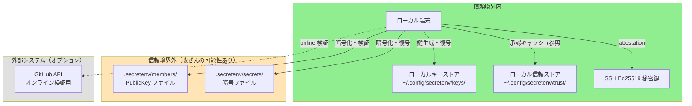
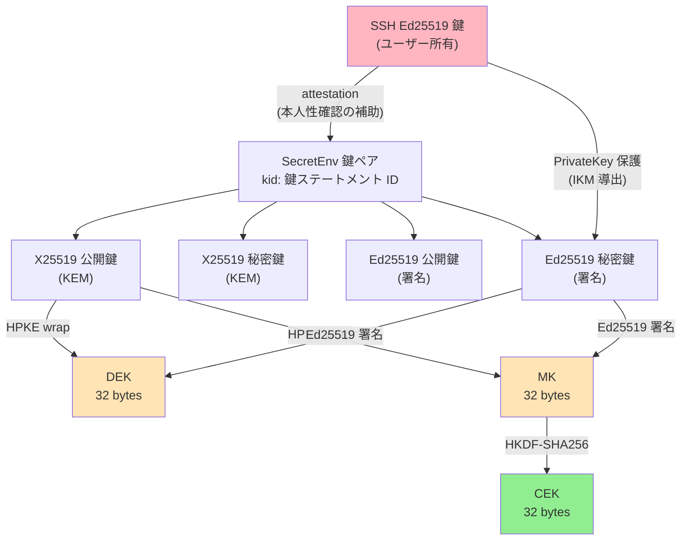
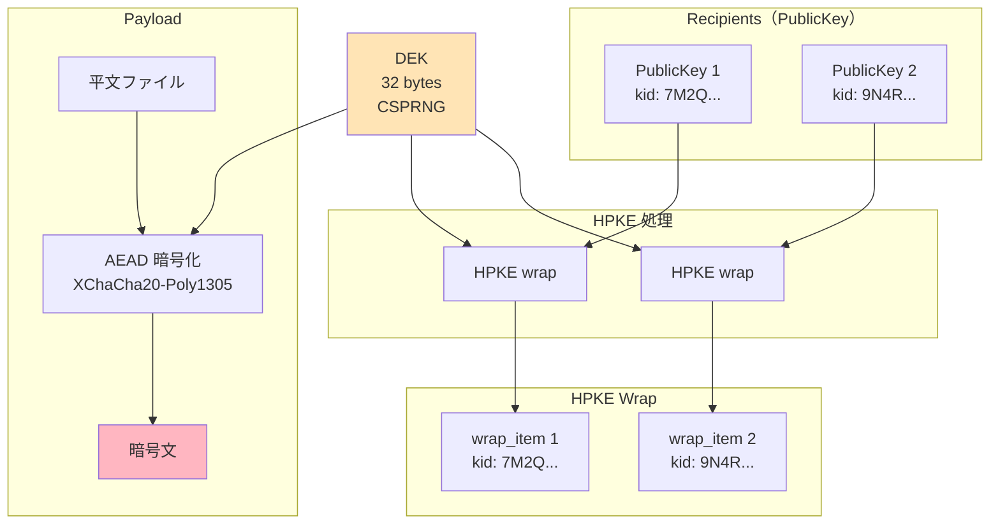
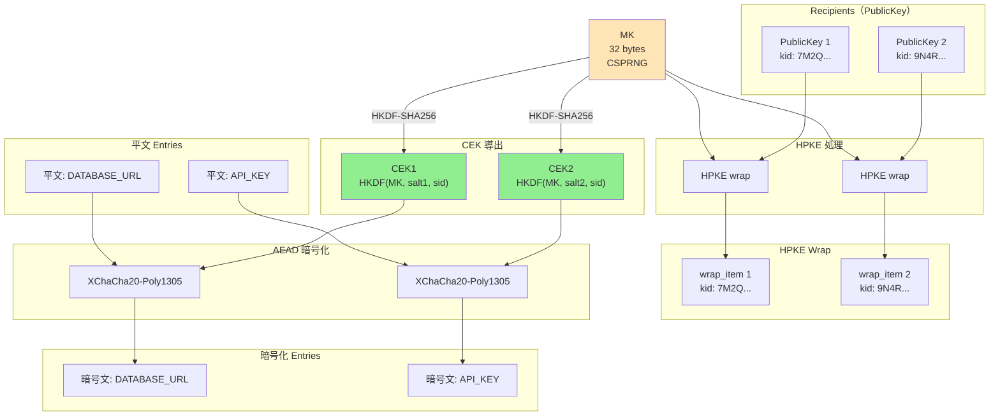
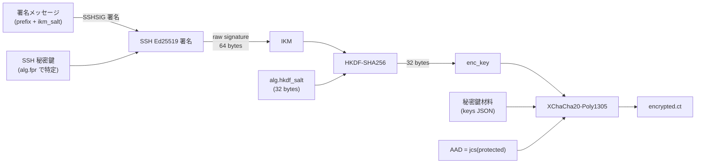
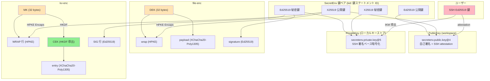

# SecretEnv セキュリティ設計

---

## 0. 文書情報

### エグゼクティブサマリー

SecretEnv は、チームの秘密情報（`.env` ファイル、証明書、API キー）を最新の標準暗号技術で保護する。鍵配送に HPKE（RFC 9180）、コンテンツ暗号化に XChaCha20-Poly1305、デジタル署名に Ed25519 を使用する。すべての暗号成果物は署名され、復号前に検証される。

**SecretEnv が設計上保証するもの:** 暗号化コンテンツの機密性、署名による改ざん検知、コンポーネント入れ替えを防ぐ暗号学的束縛、外部鍵サーバーに依存しない自己完結型の署名検証。

**SecretEnv が保証しないもの:** 復号後の内部者悪用の防止、過去に開示された秘密の回収、強い前方秘匿性、TOFU（Trust On First Use）を超える本人性保証。これらは見落としではなく、明示的な非目標である。

**利用者の運用責任:** SSH 鍵の適切な管理（パスフレーズ設定、エージェントフォワーディング無効化）、`members/active/` への PR 変更のレビュー、TOFU 承認時のリポジトリ外チャネルを通じた新メンバー検証、メンバー除外時の秘密値のローテーション。

運用ガイダンスについてはユーザーガイドを参照のこと。セキュリティ設計の全容については本書を通読されたい。

### 本書の位置づけ

本書は、SecretEnv のセキュリティ設計を整理し、その保護対象と前提条件を明確にするための文書である。SecretEnv が提示するセキュリティ主張、その成立条件、設計上の検証点、残余リスク、非目標を一貫した形で示すことを目的とする。

各節では、アルゴリズムやデータ構造の個別説明にとどまらず、どの設計判断がどのセキュリティ主張を支え、どこに運用前提や制約があるのかが読み取れるように記述する。

### 対象読者

本書は3種類の読者を想定している。各読者は関心に応じて異なるセクションに注目するとよい:

| 読者 | 主要セクション | 目的 |
|------|------------|------|
| **セキュリティ監査者** | §2（脅威モデル）、§3（暗号プリミティブ）、§10（文脈束縛）、§11（攻撃シナリオ） | セキュリティ設計の妥当性を評価する |
| **実装者 / コントリビュータ** | §5〜§8（プロトコル詳細）、§12（検証点） | プロトコル仕様と実装要件を理解する |
| **SecretEnv の導入を評価する意思決定者** | エグゼクティブサマリー、§1（概要）、§2.1〜§2.4（脅威モデル要約）、§13（制約事項） | SecretEnv が自組織のセキュリティ要件を満たすか評価する |

---

## 1. セキュリティ概要

SecretEnv は、チーム内で `.env` ファイルや証明書などの秘密情報を安全に共有するためのオフライン優先（offline-first）の暗号ファイル共有 CLI ツールである。Git リポジトリを配布媒体として利用可能だが、Git の存在に依存しない。

### 1.1 設計上の重要論点

1. **セキュリティ主張**: 何を暗号学的に防御し、何を運用前提に委ねているか
2. **信頼境界**: ローカル秘密鍵・ローカルキーストア・ローカル信頼ストアは利用者ローカルの信頼領域に置き、workspace 上の `members/active` / `members/incoming` / `secrets` は改ざん可能なリポジトリ入力として扱う
3. **役割分離された信頼ポリシー**: `signer_pub` は暗号学的署名検証の入力、`members/active` は現在のメンバー集合 / 現在の受信者集合の認可の基準情報、`known_keys` は TOFU の承認キャッシュとして分離する
4. **鍵の本人性の限界**: 自己署名と attestation は鍵一貫性や鍵紐付けを示すが、本人性は単独の機構で確定できない。手動承認とオンライン検証は、その判断材料を増やす補助層である
5. **文脈束縛**: `sid` / `kid` / `k` / `p` を使って流用や取り違えを防いでいる
6. **実装上の重要な不変条件**: 署名検証前に復号しないこと、束縛を削らないこと、`signer_pub` 欠落時に安全側で拒否すること、`SECRETENV_STRICT_KEY_CHECKING=no` の適用範囲を読み取り経路に限定すること

### 1.2 セキュリティ主張と検証方法


| セキュリティ主張            | 主な仕組み                                       | 設計上の確保方法                                                                    | 成立前提                     | 残余リスク                            |
| ------------------- | ------------------------------------------- | --------------------------------------------------------------------------- | ------------------------ | -------------------------------- |
| **機密性**                 | HPKE wrap + XChaCha20-Poly1305                 | CEK を受信者ごとに HPKE で wrap し、平文は CEK で AEAD 暗号化する                                                | recipient の秘密鍵が漏洩していない        | 正当 recipient による持ち出しは防げない                 |
| **改ざん検知**               | Ed25519 署名                                     | 暗号文・メタデータを署名対象に含め、署名が検証できないデータを受理しない                                                  | 署名検証が必ず実行される                  | 署名者自身が悪意を持つ場合は防げない                    |
| **署名成果物の自己完結検証** | 必須の `signer_pub` + PublicKey 検証             | 署名検証鍵は常に埋め込み `signer_pub` から取得し、自己署名・attestation・`kid` 一致を確認してから本体署名を検証する                      | すべての署名成果物に `signer_pub` が埋め込まれている | 現在のメンバーであるかどうかは別途信頼ポリシーに依存する |
| **文脈束縛**                | `sid` / `kid` / `k` / `p` を info / AAD に含める    | `sid` / `kid` / `k` / `p` を HPKE info と payload AAD に束縛し、流用・入れ替えが成立しないようにする                           | 実装が仕様どおりの束縛を維持する       | 束縛を削る実装変更で弱くなる                      |
| **鍵一貫性**                | PublicKey 自己署名                                 | PublicKey 本体を自己署名で保護し、既存鍵の改ざんが成立しないようにする                                              | 元の秘密鍵が漏洩していない                 | 新規の悪意ある鍵作成は防げない                       |
| **現在有効な信頼状態の判定**    | `members/active` + `known_keys`                | `members/active` を認可の基準情報、`known_keys` を承認キャッシュとして分離し、読み取り経路 / 書き込み経路ごとに判定する | リポジトリ運用統制と利用者承認が適切に機能する | 初期受け入れ時の TOFU、リポジトリ侵害、誤承認に弱い     |
| **鍵の本人性補強**             | SSH attestation + 手動承認 + オンライン検証 | 各層の意味を分離して扱い、混同しない（自己署名=一貫性、attestation=紐付け、手動承認=受理判断、オンライン検証=補助証拠）      | 手動承認が適切に行われる         | 初回接触時 MITM 攻撃、GitHub / SSH 信頼基盤侵害に弱い  |
| **可搬な秘密鍵利用**     | password export または SSH ベース保護                  | CI 利用時の信頼条件を満たす運用に限定する                                                           | 信頼できる CI 実行文脈でのみ使う      | 同一 secret backend への保存は独立防御にならない      |


### 1.3 用語の使い分け


| 用語        | 本書での意味                                         |
| --------- | ---------------------------------------------- |
| **鍵一貫性**  | 同じ秘密鍵保持者がその PublicKey を作成したことを示す性質。本人性そのものではない |
| **本人性補強** | 鍵がどの人物・アカウントに紐付くかの判断材料を増やす運用層                  |
| **承認キャッシュ** | 利用者が過去に確認した `kid` を再確認なしで扱うためのローカルキャッシュ |
| **現在のメンバー集合** | current workspace の `members/active` から得られる `(member_id, kid)` の集合 |
| **非メンバー例外受理** | current `members/active` に存在しない signer を対話的 / 一回限り / 成果物単位で例外受理する仕組み |
| **信頼境界**  | そのまま信用する領域と、改ざんを前提に検証して扱う領域の境界                 |
| **残余リスク** | 仕様どおり実装しても残るリスク、または運用前提を満たさない場合に残るリスク          |


---

## 2. 脅威モデルと信頼境界

### 2.1 攻撃者モデル


| 攻撃者             | 能力                                         | 想定シナリオ                         |
| --------------- | ------------------------------------------ | ------------------------------ |
| **リポジトリ改ざん者**   | `.secretenv/` 配下のファイルを任意に改ざん可能             | 悪意ある CI、侵害された Git サーバ、不正な push |
| **公開鍵すり替え者**    | `members/active/<id>.json` または `members/incoming/<id>.json` を偽造した公開鍵に置き換え可能 | 新メンバー追加時の MITM、リポジトリへの不正コミット   |
| **鍵ローテーション攻撃者** | 古い鍵世代の wrap を保持し、新しい鍵での復号を試行               | 鍵更新プロセスの不備を突く                  |
| **コンテキスト混同攻撃者** | 異なる secret の暗号文コンポーネントを入れ替え                | 暗号ファイル間でのコピー & ペースト            |
| **初回接触時 MITM 攻撃者**   | 初期受け入れ時点の `kid` / GitHub 情報 / attestation fingerprint を偽情報に差し替える | 初回 clone、初回遭遇 signer の承認       |
| **ローカル信頼ストア改ざん者** | `<SECRETENV_HOME>/trust/` に書き込みまたは rollback を行う | `known_keys` の置換、承認履歴の巻き戻し     |


### 2.2 運用前提

上記の脅威モデルは、リポジトリへの書き込みアクセスが適切に管理されていることを前提とする。主なターゲット環境である Git + GitHub 運用では、`members/active/` への変更は PR レビューを通じて検証される。`members/active` は現在のメンバー集合 / 現在の受信者集合の認可の基準情報だが、暗号学的な信頼の起点ではない。

また、`<SECRETENV_HOME>/trust/` は利用者ローカルの信頼領域であり、OS / ファイルシステムのアクセス制御で保護されていることを前提とする。ローカル信頼ストアの署名は整合性確認・破損検知・フォーマット検証のために用いられるが、この領域に対する整合的な置換や rollback までは防がない。

初回受け入れや初回遭遇 `kid` の承認は TOFU に依存する。したがって、初回接触時 MITM 攻撃や workspace 全体すり替えを暗号学的に排除することは本モデルの対象外である。SecretEnv 自体の暗号設計と、配布媒体・レビュー運用・リポジトリ外チャネルによる確認は分けて評価する必要がある。

### 2.3 信頼境界




**信頼する要素:**

- ローカル端末とローカルキーストア（`~/.config/secretenv/keys/`）
- ローカル信頼ストア（`~/.config/secretenv/trust/`）。ただし現在有効な信頼状態の権威ではなく、利用者ローカルの承認キャッシュを保持する
- ユーザーの SSH Ed25519 秘密鍵
- GitHub API（オンライン検証時のみ、オプション）

**信頼しない要素:**

- Workspace の `members/active/` および `members/incoming/` — リポジトリ上の非信頼データ。PublicKey 自体は署名と attestation で検証し、現在のメンバー集合 / 現在の受信者集合の権威として使うかどうかはリポジトリ運用統制に依存する
- Workspace の `secrets/` ディレクトリ — 署名で検証

### 2.4 設計スコープの要約


| 項目              | 含意                                                    |
| --------------- | ----------------------------------------------------- |
| **保証するもの**      | 機密性、改ざん検知、文脈束縛、鍵世代束縛、鍵一貫性、`signer_pub` による自己完結型署名検証                         |
| **運用前提に依存するもの** | 鍵の本人性判断、`members/active` への変更レビュー、TOFU 承認、ローカル信頼ストア領域の保護、CI 上の安全な実行条件 |
| **保証しないもの**     | 内部者の悪用防止、過去開示の回収、強い意味での前方秘匿性、初期受け入れ時の真正性、workspace 全体すり替え、中央ポリシーによる権限制御 |
| **実装で最重要な観点**   | 署名検証順序、束縛の保持、`signer_pub` 必須、署名者鍵の代替探索禁止、`members/active` / `known_keys` の責務分離 |


### 2.5 信頼モデル

SecretEnv の信頼モデルは、暗号学的検証・現在のメンバーシップ判定・利用者承認を意図的に分離している。単一の機構で「この鍵が誰のもので、現在も受理すべきか」を決めるのではなく、以下の4つの層で構成される。ユーザーガイドではこれらの層を運用向けに簡略化して提示している。本節はその完全版であり、各層の根拠を含めて記述する。

注: 層2〜4 で参照するプロトコル要素（`members/active`、`known_keys`、ローカル信頼ストア）は §4〜§9 で詳しく説明する。本節は概念レベルで信頼モデルを導入するものであり、プロトコル詳細を読んだ後に再読することを推奨する。

| 層 | 仕組み | 確立するもの | 確立しないもの |
|---|---|---|---|
| **1. 暗号学的検証** | `signer_pub` + PublicKey 検証 | 成果物と署名鍵の暗号学的真正性 | 鍵保持者の本人性 |
| **2. 認可** | `members/active` | 現在のメンバー集合 / 現在の受信者集合 | 暗号学的信頼（リポジトリ運用統制に依存） |
| **3. 承認キャッシュ** | ローカル信頼ストアの `known_keys` | 過去に確認済みの `kid` | 現在のメンバーであること |
| **4. 手動承認 + オンライン検証** | TOFU 承認、GitHub API | 本人性判断の補助証拠 | 暗号学的な本人性の証明 |

**層1: 暗号学的検証**

署名成果物は必ず `signature.signer_pub` を含み、署名検証鍵は常にこの埋め込み PublicKey から取得する。ここでは自己署名・attestation・`kid` 一致・有効期限を検証し、「この成果物がどの鍵ステートメントで署名されたか」を自己完結に確定する。`members/active` は署名者鍵の探索には使わない。

この層は以下の性質を通じて暗号学的真正性を確立する:

- **自己署名（鍵一貫性）**: PublicKey に含まれる自己署名は、この PublicKey を作成した主体が対応する秘密鍵を保持していることを示す。これは鍵の**一貫性**を確認する材料であり、**本人性**までは示さない。攻撃者が自分の SecretEnv 鍵ペアを新規作成すれば、有効な自己署名を持つ PublicKey を生成できる。自己署名の役割は、既存の PublicKey の**改竄防止**に限定される。`members/active/` または `members/incoming/` にある PublicKey のフィールドを書き換えると自己署名検証が失敗する。
- **SSH attestation（鍵紐付け）**: SSH attestation は、SecretEnv 鍵ペアと SSH 鍵の紐付けを暗号学的に確認する。ただし、SSH 鍵自体の所有者が誰であるかは attestation だけでは特定できない。攻撃者が自分の SSH 鍵で自分の SecretEnv 鍵を attestation すれば、有効な attestation を生成可能である。

**層2: 認可（`members/active`）**

current workspace の `members/active` は、現在のメンバー集合 / 現在の受信者集合を決める認可の基準情報である。読み取り経路では signer の `(member_id, kid)` が現在のメンバー集合に含まれることを要求し、書き込み経路では recipients を `members/active` から導出する。

ただし `members/active` は暗号学的な信頼の起点ではない。リポジトリ上の非信頼データであり、その真正性は Git のアクセス制御と PR レビュープロセスというリポジトリ運用統制に依存する。

**層3: 承認キャッシュ（`known_keys`）**

ローカル信頼ストアは `secretenv.trust.local@2` 形式の署名付き JSON であり、`known_keys[]` を通じて「利用者が一度確認した `kid`」を保持する。これは現在有効な信頼状態の権威ではなく、承認キャッシュである。

- signer / recipient の区別を持たない
- workspace の区別を持たない
- 現在のメンバーであることを意味しない
- self の鍵はローカルキーストアが信頼の起点であるため、通常は `known_keys` への記録を必要としない

**層4: 手動承認とオンライン検証**

未確認 `kid` を承認する際、利用者は `kid`、`attestation.pub` fingerprint、必要に応じて GitHub account の `id` / `login` を確認して受理判断を行う。これは SSH の `known_hosts` における初回確認と同じく TOFU モデルであり、本人性を暗号学的に確定するものではない。GitHub API によるオンライン検証は補助証拠であって、単独で本人性を確定しない。

**限定例外: 非メンバー例外受理と `SECRETENV_STRICT_KEY_CHECKING=no`**

- 非メンバー例外受理は、current `members/active` に存在しない signer の成果物を対話的 / 一回限り / 成果物単位で一回だけ受理する例外である。signer を現在のメンバーに戻さず、`known_keys` も更新しない
- `SECRETENV_STRICT_KEY_CHECKING=no` は、利用者が明示指定した読み取り経路に限って `known_keys` チェックだけを省略する。対話的実行でも明示指定なら許容するが、`members/active` の確認と暗号学的署名検証は省略しない

**複合信頼**

鍵の本人性判断を強めるには、上記の層が適切に機能することが望ましい。ただし、攻撃シナリオによって弱くなる条件は異なる。

- **既存鍵の改竄**: 自己署名または attestation を破る必要があり、通常は元の秘密鍵素材の漏洩が必要になる
- **新規鍵挿入**: リポジトリ運用統制の破綻に加え、利用者が TOFU 承認で誤受理すると成立し得る。攻撃者は自分の鍵で有効な自己署名・attestation を生成できるため、被害者の秘密鍵漏洩は不要である
- **SSH attestor 秘密鍵のみの漏洩**: GitHub account が健全でも、正規の attestor 情報を持つ不正鍵を作れてしまう
- **GitHub / SSH 信頼基盤の侵害**: オンライン検証や手動確認に表示される GitHub 情報自体が偽装され得る
- **ローカル信頼ストア改ざん**: ローカル信頼領域が破られると、整合的な `known_keys` 置換や rollback を完全には防げない

---

## 3. 暗号プリミティブの選択

### 3.1 アルゴリズム一覧


| アルゴリズム                     | パラメータ                        | RFC         | 用途                               |
| -------------------------- | ---------------------------- | ----------- | -------------------------------- |
| HPKE Base mode             | suite `hpke-32-1-3`          | RFC 9180    | Content Key の wrap/unwrap        |
| DHKEM(X25519, HKDF-SHA256) | kem_id=32 (0x0020)           | RFC 9180    | KEM（鍵カプセル化）                      |
| HKDF-SHA256                | kdf_id=1 (0x0001)            | RFC 5869    | KDF（鍵導出）                         |
| ChaCha20-Poly1305          | aead_id=3 (0x0003)           | RFC 8439    | HPKE 内部 AEAD                     |
| XChaCha20-Poly1305         | nonce 24 bytes, key 32 bytes | —           | payload / entry / PrivateKey 暗号化 |
| Ed25519 (PureEdDSA)        | —                            | RFC 8032    | 署名・検証                            |
| HKDF-SHA256                | —                            | RFC 5869    | CEK 導出、PrivateKey enc_key 導出     |
| JCS                        | —                            | RFC 8785    | JSON の決定的正規化                     |
| base64url (no padding)     | —                            | RFC 4648 §5 | バイナリエンコード                        |


### 3.2 HPKE (RFC 9180)

**選択理由:**

- 標準化されたハイブリッド公開鍵暗号化スキームであり、KEM + KDF + AEAD の組み合わせが一貫して定義されている
- Base mode で wrap ごとの ephemeral key isolation を提供（ただし recipient 長期鍵漏洩時は既存 wrap が復号可能、詳細は本書 §13.1）
- IANA Registry による suite ID の明確な識別

**suite 構成:**

```
hpke-32-1-3
├── kem_id  = 32 (0x0020) DHKEM(X25519, HKDF-SHA256)
├── kdf_id  = 1  (0x0001) HKDF-SHA256
└── aead_id = 3  (0x0003) ChaCha20-Poly1305
```

**代替案との比較:**


| 代替案                     | 不採用理由                                 |
| ----------------------- | ------------------------------------- |
| RSA-OAEP                | 鍵サイズが大きく、Forward Secrecy を自然に実現できない   |
| ECIES (自作構成)            | 標準化されておらず、構成ミスのリスクが高い                 |
| Age (X25519-ChaChaPoly) | HPKE ほど仕様上の整理が進んでおらず、info/AAD の柔軟性が不足 |


**既知の制約:**

- Base mode は送信者認証を提供しない（署名で補完）
- X25519 は 128-bit セキュリティレベル

### 3.3 XChaCha20-Poly1305

**選択理由:**

- 24-byte nonce により、ランダム nonce の衝突リスクが実用上無視できる（birthday bound が 2^96）
- AES-NI 非搭載環境でも一定のパフォーマンスを発揮
- misuse resistance は提供しないが、nonce 空間の広さで実質的な安全性を確保

**代替案との比較:**


| 代替案             | 不採用理由                                        |
| --------------- | -------------------------------------------- |
| AES-256-GCM     | 12-byte nonce では multi-key 使用時に衝突リスクが高い      |
| AES-256-GCM-SIV | nonce misuse resistance は魅力的だが、実装の複雑さと普及度を考慮 |


**既知の制約:**

- nonce reuse は壊滅的（同一鍵・同一 nonce での暗号化は禁止）
- payload の圧縮は禁止（圧縮オラクル攻撃 CRIME/BREACH の回避）

### 3.4 Ed25519 (RFC 8032 PureEdDSA)

**選択理由:**

- **決定論的署名**: 同一入力に対して常に同一の署名を生成。PrivateKey 保護で IKM として署名を使用するため必須の性質
- 高速な署名・検証
- SSH エコシステムとの親和性（ssh-ed25519）

**代替案との比較:**


| 代替案           | 不採用理由                                        |
| ------------- | -------------------------------------------- |
| ECDSA (P-256) | 非決定論的署名（RFC 6979 で緩和可能だが、SSH 実装での扱いにばらつきがある） |
| Ed448         | SSH エコシステムでの普及が不十分                           |


**既知の制約:**

- 128-bit セキュリティレベル
- コンテキスト分離は PureEdDSA 自体では提供されない（JCS 正規化 + プロトコル識別子で対応）

### 3.5 HKDF-SHA256 (RFC 5869)

**選択理由:**

- 標準化された鍵導出関数
- `info` パラメータにより、同一 IKM から用途別の鍵を安全に導出可能
- `salt` パラメータにより、同一 IKM・同一 info でも異なる鍵を導出可能

**用途:**

- kv-enc の CEK 導出（MK + salt + sid → CEK）
- PrivateKey 保護の enc_key 導出（SSH 署名 + salt + kid → enc_key）

### 3.6 JCS (RFC 8785)

**選択理由:**

- JSON オブジェクトの決定論的正規化を提供
- 鍵の順序や数値表現の揺れを排除し、署名・AAD・HPKE info の一貫性を保ちやすくする
- `sid` 等の文字列フィールドに任意の文字が含まれても曖昧性が発生しない

### 3.7 標準暗号プリミティブに依拠する安全性と限界


| プリミティブ                    | 前提とする安全性                                  | SecretEnv における含意                                                           |
| ------------------------- | ----------------------------------------- | -------------------------------------------------------------------------- |
| HPKE Base mode (RFC 9180) | 受信者公開鍵に対する鍵配送の機密性を提供するが、送信者認証は提供しない       | recipient ごとの wrap の機密性はこれに依拠する一方、作成者の真正性や insider 攻撃への対策は Ed25519 署名に依存する |
| XChaCha20-Poly1305        | nonce を再利用しない限り、機密性と改ざん検知を提供する AEAD である   | payload / entry / PrivateKey 保護の安全性は nonce 一意性に依存し、nonce reuse には耐えない      |
| Ed25519 (PureEdDSA)       | 署名秘密鍵が保護されている限り、署名の偽造困難性と改ざん検知を提供する       | 暗号ファイルや PublicKey 文書の真正性確認はこれに依拠し、秘密鍵漏洩時にはこの保証は崩れる                         |
| HKDF-SHA256               | 十分なエントロピーを持つ IKM から、擬似ランダムで用途分離された鍵を導出できる | CEK や enc_key の鍵分離はこれに依拠するが、低エントロピーな IKM を高エントロピー化するものではない                 |


**安全性の依存関係:**

- 全体の機密性は、受信者への鍵配送に使う HPKE の機密性と、payload 自体を保護する AEAD の機密性の両方に依存する。どちらか一方だけでは SecretEnv 全体の機密性は成立しない。
- 改ざん検知は Ed25519 署名に依存する。HPKE Base mode 自体は送信者認証を提供しないため、暗号ファイルや PublicKey 文書が正当な署名者によって作成されたこと、および改ざんされていないことの確認は署名で補う。
- kv-enc における entry 間の暗号学的独立性は、HKDF-SHA256 の PRF 安全性に依存する。SecretEnv では高エントロピーな MK から entry ごとに CEK を導出するため、ある entry の情報から他の entry の CEK を直接導けないことを期待する。

**前提条件と限界:**

- HPKE Base mode は recipient 長期秘密鍵の秘匿を前提とする。長期鍵漏洩時は当該 recipient 向けの全 wrap が復号可能（§13.1 参照）
- XChaCha20-Poly1305 の利用では nonce 一意性が重要であり、nonce reuse は深刻な問題につながる
- Ed25519 署名の前提は秘密鍵の秘匿である。SecretEnv では署名秘密鍵は PrivateKey 保護（§7）で暗号化保存される

### 3.8 nonce 安全性マージン

XChaCha20-Poly1305 は 24-byte (192-bit) nonce を使用する。SecretEnv の設計では、同一の対称鍵で複数回の暗号化を行うケースが存在しない。DEK（file-enc）・CEK（kv-enc entry）・enc_key（PrivateKey 保護）はそれぞれ暗号化ごとに一意に生成または導出されるため、nonce 衝突のリスクは構造的に排除されている。

192-bit nonce 空間の選択は、将来の設計変更で同一鍵の再利用が発生した場合の安全弁として機能する。

### 3.9 暗号強度 (セキュリティレベル)

各暗号プリミティブが提供する推定暗号強度（セキュリティレベル）は以下の通りである。

| 暗号プリミティブ | 鍵サイズ / パラメータ | 推定暗号強度 (古典コンピュータ) | 備考 |
| --- | --- | --- | --- |
| X25519 (KEM) | 256 bits | 128 bits | 離散対数問題に対する安全性 |
| Ed25519 (署名) | 256 bits | 128 bits | 離散対数問題に対する安全性 |
| XChaCha20-Poly1305 | Key 256 bits | 256 bits | 対称鍵暗号としての強度 |
| ChaCha20-Poly1305 | Key 256 bits | 256 bits | HPKE 内部の AEAD |
| HKDF-SHA256 | 出力 256 bits | 256 bits | ハッシュ関数の原像計算困難性等に基づく |

**システム全体の暗号強度:**

システム全体の安全性は、連鎖する暗号プリミティブのうち最も強度が低いものに制約される（weakest link の原則）。
SecretEnv では、データの機密性（HPKE X25519）および真正性（Ed25519）の基盤となる非対称暗号の強度が 128 bit であるため、**システム全体として提供される暗号強度は 128 bit 相当**となる。

これは現在の一般的な商用システムにおいて十分強固なセキュリティレベル（AES-128 相当）を満たしている。対称鍵暗号部分（XChaCha20-Poly1305 等）に 256 bit 鍵を採用しているのは、利用可能な標準的で高速なプリミティブを選択した結果であり、システム全体を 256 bit 強度に引き上げるものではない。

---

## 4. 鍵階層と鍵ライフサイクル

### 4.1 鍵の種類と関係




この図は、SSH 鍵と SecretEnv 鍵ペアを意図的に分離して示している。

- **SSH 鍵**は、ユーザーが既に保有している外部の認証鍵であり、SecretEnv の暗号ファイルそのものを直接暗号化・署名する鍵ではない
- **SecretEnv 鍵ペア**は、workspace 内の暗号化・復号・署名・検証に使うアプリケーション固有の鍵である
- SSH 鍵の役割は 2 つだけである
  - **attestation**: SecretEnv 公開鍵がどの SSH 鍵で裏付けられているかを示す
  - **PrivateKey 保護**: ローカルキーストア内の SecretEnv 秘密鍵を復号するための `enc_key` 導出に使う

したがって、SSH 鍵は SecretEnv 鍵ペアそのものではなく、SecretEnv 鍵ペアの来歴確認とローカル保護のための外側の鍵である。

### 4.2 鍵パラメータ一覧


| 鍵の種類                         | サイズ      | 生成方法            | 用途                        | ゼロ化要否      |
| ---------------------------- | -------- | --------------- | ------------------------- | ---------- |
| SSH Ed25519 秘密鍵              | 32 bytes | ユーザーが管理         | attestation、PrivateKey 保護 | N/A（OS 管理） |
| X25519 秘密鍵 (KEM)             | 32 bytes | CSPRNG          | HPKE unwrap               | MUST       |
| X25519 公開鍵 (KEM)             | 32 bytes | X25519 秘密鍵から導出  | HPKE wrap                 | —          |
| Ed25519 秘密鍵 (署名)             | 32 bytes | CSPRNG          | 署名生成                      | MUST       |
| Ed25519 公開鍵 (署名)             | 32 bytes | Ed25519 秘密鍵から導出 | 署名検証                      | —          |
| DEK (Data Encryption Key)    | 32 bytes | CSPRNG          | file-enc payload 暗号化      | MUST       |
| MK (Master Key)              | 32 bytes | CSPRNG          | kv-enc の CEK 導出元          | MUST       |
| CEK (Content Encryption Key) | 32 bytes | HKDF-SHA256 導出  | kv-enc entry 暗号化          | MUST       |
| enc_key (PrivateKey 保護用)     | 32 bytes | HKDF-SHA256 導出  | PrivateKey AEAD 暗号化       | MUST       |


補足:

- `enc_key` は保存済みの固定鍵ではなく、SSH 署名出力からその都度導出される一時的な対称鍵である
- 同じ SSH 鍵を使って複数の SecretEnv 鍵ステートメントを保護できるが、`kid` と `salt` が異なれば導出される `enc_key` も異なる
- ローカルキーストアに保存される `private.json` に含まれるのは SecretEnv 秘密鍵の暗号文のみであり、SSH 秘密鍵自体は SecretEnv 管理下には入らない

### 4.3 受信者の資格

暗号化操作の受信者になれるのは `members/active/` に記載されたメンバーのみである。`members/incoming/` のメンバーは `rewrap` で active に昇格されるまで既存の秘密を復号できない。

### 4.4 鍵ライフサイクル

SecretEnv の鍵ペアは、生成から期限切れ、そして新しい鍵へのローテーションというライフサイクルをたどる。

```
生成 → active → expired
         │
         └── rotate (新しい鍵ペアを生成して切り替え)
```

各状態における扱いは以下の通りである。

- **生成**: `key new` コマンドで新しい鍵ペアと PublicKey 文書を生成し、ローカルキーストアに保存する。
- **active**: `expires_at` が到来していない有効な状態。新たな暗号化（wrap）や署名の生成、および復号・検証に利用できる。
- **expired**: `expires_at` を過ぎた状態。新たな暗号化（wrap）や署名の生成は拒否されるが、過去に正当に署名・暗号化されたデータの復号・検証は警告付きで許可される。
- **rotate**: `rewrap --rotate-key` などにより、新しい鍵ペア（新しい `kid`）を生成して active な鍵を切り替える。古い鍵は expired になるまで復号・検証用に保持される。

#### 4.4.1 鍵ステートメント ID（kid）の不変性

各鍵ペアには `kid`（鍵ステートメント ID）が対応付けられる。`kid` はハイフンなし 32 文字の Crockford Base32 であり、自己署名対象となる `PublicKey@4.protected` の内容（公開鍵本体、identity、binding_claims、有効期限など）から決定的に導出される。

`kid` は PublicKey の内容から導出されるため、**kid の一致は鍵ステートメント内容の完全な一致を意味する**。内容のいずれかが変化すれば、異なる `kid` を持つ新しい鍵ペアとして扱われる。

### 4.5 鍵ローテーション

鍵ローテーションは `rewrap` コマンドで行う。動作は file-enc と kv-enc、および recipient 変更と明示的な `--rotate-key` で異なる。両プロトコルの説明後に §6.7 で詳述する。

---

## 5. file-enc プロトコル

file-enc は単一ファイルを複数受信者向けに暗号化する。ランダムに生成されるファイル固有の鍵（DEK）で XChaCha20-Poly1305 によりファイル全体を暗号化し、各受信者には HPKE でラップされた DEK のコピーを渡す。全体構造は Ed25519 で署名され、復号前に改ざんが検知される。

### 5.0 データ構造の概観

file-enc は JSON 形式のファイルであり、署名対象データ（`protected`）と署名（`signature`）の二層構造を持つ。

**セキュリティ上重要な構造的性質:**

1. **署名包含性**: `wrap` 配列と `payload` は `protected` 内に格納される。したがって `protected` 全体への Ed25519 署名は、wrap（鍵配布）と payload（暗号文）の両方の完全性を保護する
2. **sid の二重存在**: `sid` は `protected` 直下と `payload.protected` 内の両方に存在する。復号時に両者の一致を検証することで、payload のすり替えを検知する
3. **payload envelope**: payload 自身が保護ヘッダ（`payload.protected`）を持ち、その JCS 正規化が AEAD の AAD となる。これにより payload の暗号学的束縛が外側の署名とは独立して成立する

#### ファイル全体構造（JSON レイアウト）

file-enc の全体構造は、トップレベル（署名つきコンテナ）→ `protected`（署名対象）→ `wrap`（DEK 配布）/ `payload`（暗号文）の順にネストする。

```
{
  "protected": {
    "format": "secretenv.file@3",    // フォーマット識別子
    "sid": "<UUID>",                 // ファイルを一意に識別（wrap/payload の束縛に使用）
    "wrap": [
      {
        "rid": "<member_id>",        // recipient の member_id（informational のみ）
        "kid": "<canonical kid>",    // recipient 鍵ステートメント ID（keystore 検索キー・HPKE info に含む）
        "alg": "hpke-32-1-3",        // HPKE アルゴリズム識別子
        "enc": "<b64url>",           // HPKE encapsulated key（base mode の enc）
        "ct": "<b64url>"             // HPKE ciphertext（DEK を wrap した ct）
      }
      // ... recipients 分だけ要素が並ぶ ...
    ],
    "payload": {
      "protected": {
        "format": "secretenv.file.payload@3",
        "sid": "<UUID>",             // protected.sid と同一（復号前に一致検証）
        "alg": { "aead": "xchacha20-poly1305" }
      },
      "encrypted": {
        "nonce": "<b64url>",         // 24 bytes
        "ct": "<b64url>"             // AEAD ciphertext（平文ファイル全体）
      }
    },
    "created_at": "<RFC3339>",       // ファイル作成日時
    "updated_at": "<RFC3339>"        // ファイル更新日時
  },
  "signature": {
    // signature_v4（§8.2）: protected を JCS 正規化して署名した値など
  }
}
```

このレイアウトにより、(1) 署名で `protected` 全体（= wrap と payload）を改ざん検知しつつ、(2) payload は `payload.protected` を AAD とすることで暗号化レイヤ単体でもヘッダ束縛を持つ。

### 5.1 暗号化フロー




```
1. DEK 生成        — 32 bytes, CSPRNG
2. HPKE wrap       — 各 recipient の公開鍵で DEK を wrap
3. AEAD 暗号化     — DEK で平文ファイルを XChaCha20-Poly1305 で暗号化
4. Ed25519 署名    — protected オブジェクト全体を JCS 正規化して署名
```

### 5.2 DEK 生成

- 32 bytes の暗号学的乱数（`OsRng`）
- 各 file-enc ファイルごとに一意
- 使用後はゼロ化

### 5.3 HPKE wrap

各 recipient について:

```
info_bytes = jcs({
    "kid": <wrap_item.kid>,
    "p": "secretenv:file:hpke-wrap@3",
    "sid": <protected.sid>
})

aad_bytes = info_bytes   // defence-in-depth

(enc, ct) = HPKE.SealBase(pk_recip, info_bytes, aad_bytes, DEK)
```

**設計判断: HPKE info と AAD を同一にする理由**

HPKE は内部で info を KDF に、AAD を AEAD に渡す。両者を同一にすることで:

- KDF 段階のバイパス攻撃に対して AAD 層が防御
- AEAD 段階のバイパス攻撃に対して info 層が防御
- Defence-in-depth を実現

### 5.4 payload 暗号化

```
payload.protected = {
    "format": "secretenv.file.payload@3",
    "sid": <protected.sid>,          // 外側の sid と同一値
    "alg": { "aead": "xchacha20-poly1305" }
}

aad = jcs(payload.protected)
nonce = random(24 bytes)
ct = XChaCha20Poly1305.Encrypt(DEK, nonce, aad, plaintext)

// payload.encrypted に nonce と ct を格納
payload.encrypted = { "nonce": b64url(nonce), "ct": b64url(ct) }
```

### 5.5 復号フロー

```
1. 署名検証        — 失敗時は即エラー（復号処理に進まない）
2. 鍵特定          — keystore から秘密鍵を kid で特定
3. wrap_item 検索   — kid（rid ではない）で対応する wrap_item を探す
4. HPKE unwrap     — info/AAD を再構築し DEK を復元
5. sid 検証        — payload.protected.sid == protected.sid を確認
6. AEAD 復号       — DEK で payload を復号
```

**重要: 署名検証は復号に先行する。** 署名が無効な暗号文を復号すると、悪意ある入力に対して暗号プリミティブを動作させることになり、サイドチャネル攻撃の表面が広がる。

---

## 6. kv-enc プロトコル

kv-enc は `.env` 形式のキーバリューエントリを個別に暗号化する。二層鍵構造を採用しており、マスターキー（MK）を各受信者に HPKE でラップし、エントリごとの暗号鍵（CEK）は MK から HKDF で導出する。この設計により、個別エントリの部分復号やファイル全体を再暗号化しない効率的な更新が可能となる。

### 6.0 データ構造の概観

kv-enc は行ベースのテキスト形式であり、以下の行種別から構成される:

```
:SECRETENV_KV 3          ← バージョン識別（署名対象に含む）
:HEAD <token>             ← ファイルメタデータ（sid, タイムスタンプ）
:WRAP <token>             ← MK の HPKE wrap 配列 + removed_recipients
<KEY> <token>             ← 暗号化された entry（salt, nonce, ct を含む）
:SIG <token>              ← Ed25519 署名
```

各トークンは JSON を JCS 正規化した後 base64url エンコードしたものである。

**セキュリティ上重要な構造的性質:**

1. **署名の包含範囲**: `:SIG` 行を除くすべての行（`:SECRETENV_KV 3`、`:HEAD`、`:WRAP`、全 KEY 行）が署名対象。バージョン行を含むことで、バージョンダウングレード攻撃を防御する
2. **wrap と entry の分離**: file-enc とは異なり、wrap（`:WRAP` 行）と暗号化 entry（KEY 行）が独立した行として存在する。これにより `set` での部分更新時に wrap の再生成が不要となる
3. **entry の自己完結性**: 各 entry トークンは自身の `salt`、`k`（KEY）、`aead`、`nonce`、`ct` を含む。`sid` は `:HEAD` から取得し、CEK 導出と AAD 構築に使用する
4. **canonical_bytes の構築**: 署名対象は全行を LF (0x0A) 終端で連結したバイト列。CRLF は LF に正規化する。フィールド区切りはスペース (0x20)

### 6.1 二層鍵構造の設計根拠

kv-enc は MK → CEK の二層鍵構造を採用している:

```
MK (1 per file) ─── HPKE wrap ──→ 各 recipient
  │
  ├── HKDF(MK, salt1, sid) ──→ CEK1 ──→ entry1 暗号化
  ├── HKDF(MK, salt2, sid) ──→ CEK2 ──→ entry2 暗号化
  └── HKDF(MK, saltN, sid) ──→ CEKN ──→ entryN 暗号化
```

**なぜ二層か:**

- `set` で特定エントリを更新する際、他エントリの再暗号化が不要
- `get` で特定エントリのみを部分復号可能
- 全 recipient 分の HPKE wrap を毎回再実行する必要がない

### 6.1.1 暗号化・復号フローの概要

**暗号化フロー:**




```
1. MK 生成         — 32 bytes, CSPRNG
2. HPKE wrap       — 各 recipient の公開鍵で MK を wrap（info = AAD）
3. 各 entry について:
   a. salt 生成    — 32 bytes, CSPRNG
   b. CEK 導出     — HKDF-SHA256(MK, salt, sid)
   c. AEAD 暗号化  — CEK で VALUE を XChaCha20-Poly1305 で暗号化
4. Ed25519 署名    — 全行の canonical_bytes を署名（§8.3 参照）
```

**復号フロー:**

```
1. SIG 行検証      — 失敗時は即エラー（復号処理に進まない）
2. 鍵特定          — keystore から秘密鍵を kid で特定
3. HPKE unwrap     — info/AAD を再構築し MK を復元
4. 各 entry について:
   a. CEK 導出     — HKDF-SHA256(MK, salt, sid)
   b. AAD 構築     — jcs({"k", "p", "sid"})
   c. AEAD 復号    — CEK で暗号文を復号
```

file-enc（§5.5）と同様、**署名検証は復号に先行する**。

### 6.2 CEK 導出

```
salt_bytes = base64url_decode(entry.salt)   // 32 bytes

CEK = HKDF-SHA256(
    ikm    = MK,                            // 32 bytes
    salt   = salt_bytes,                    // 32 bytes
    info   = jcs({
        "p":   "secretenv:kv:cek@3",
        "sid": <HEAD.sid>
    }),
    length = 32
)
```

`sid` を info に含めることで、異なるファイル間で entry をコピーしても異なる CEK が導出され、復号に失敗する。

### 6.3 entry AAD

```
aad = jcs({
    "k":   <entry.k>,                      // dotenv KEY
    "p":   "secretenv:kv:payload@3",
    "sid": <HEAD.sid>
})
```

**設計判断:**

- `k` を含める → 同一ファイル内での entry 入れ替え防止
- `sid` を含める → CEK 導出の info と二重束縛（defence-in-depth）
- `salt` は含めない → HKDF の salt 引数として使用済み
- `recipients` は含めない → rewrap で payload 固定のまま wrap 差し替えを可能にするため

### 6.4 HPKE wrap (kv)

```
info_bytes = jcs({
    "kid": <wrap_item.kid>,
    "p":   "secretenv:kv:hpke-wrap@3",
    "sid": <HEAD.sid>
})

aad_bytes = info_bytes   // defence-in-depth: file-enc と同一方針
```

file-enc（§5.3）と同様に、HPKE の info と AAD に同一の bytes を使用する。これにより kv-enc の wrap においても KDF 段階と AEAD 段階の両方で束縛を確保し、defence-in-depth を実現する。

### 6.5 部分復号（get / set）

kv-enc の設計により、全エントリの復号を行わずに特定エントリのみを操作できる:

- **get**: SIG 検証 → MK unwrap → 指定 KEY の CEK 導出 → 当該 entry のみ復号
- **set**: SIG 検証 → MK unwrap → 新規 salt 生成 → CEK 導出 → VALUE 暗号化 → entry 追加/置換 → SIG 再生成

### 6.6 recipient 削除時の挙動

kv-enc で recipient が削除された場合:

1. MK を新規生成
2. 全 entry を新 MK から導出した CEK で再暗号化
3. `removed_recipients` に削除メンバーを記録
4. 全 entry に `disclosed: true` を付与
5. WRAP 行を更新

`disclosed` フラグにより、削除された recipient に開示された可能性がある entry を可視化し、シークレットの更新判断を支援する。

### 6.7 両形式における鍵ローテーション動作

`rewrap` は wrap エントリを更新する（recipient の追加・削除）。`rewrap --rotate-key` は Content Key を再生成し、payload 全体を再暗号化する。


| 操作             | 形式       | Content Key | wrap | payload  |
| -------------- | -------- | ----------- | ---- | -------- |
| recipient 追加   | file-enc | DEK 維持      | 追加   | 維持       |
| recipient 追加   | kv-enc   | MK 維持       | 追加   | 維持       |
| recipient 削除   | file-enc | DEK 維持      | 削除   | 維持       |
| recipient 削除   | kv-enc   | **MK 再生成**  | 再構築  | **再暗号化** |
| `--rotate-key` | file-enc | DEK 再生成     | 再構築  | 再暗号化     |
| `--rotate-key` | kv-enc   | MK 再生成      | 再構築  | 再暗号化     |


recipient 追加時は、両形式とも Content Key を維持し、新しい wrap エントリを追加するのみである。

recipient 削除時は、形式によって動作が異なる。file-enc では、削除された recipient の wrap エントリを除去し削除履歴を記録するが、DEK は変更しない。kv-enc では、MK を必ず再生成し全エントリを再暗号化する。これは MK が長寿命の鍵であり、各エントリの CEK が MK から導出されるためである（§6.2）。削除されたメンバーが過去の復号セッションで旧 MK を保持していた場合、削除後に追加されたエントリの CEK を導出できてしまう。MK の再生成によりこのリスクを排除する。

`--rotate-key` は recipient の変更有無にかかわらず両形式で完全な再暗号化を強制し、鍵漏洩後の被害限定策として位置づけられる。

---

## 7. PrivateKey 保護

### 7.1 SSH 鍵再利用によるパスワードレス設計

SecretEnv の PrivateKey（KEM 秘密鍵 + 署名秘密鍵）は、ユーザーの既存 SSH Ed25519 鍵を利用して暗号化保護される。これにより SecretEnv 固有のパスワード管理が不要になる。

ここで保護対象となるのは、ローカルキーストアに保存される SecretEnv 秘密鍵である。SSH 鍵は workspace の secret を直接復号するのではなく、まずローカルキーストア内の SecretEnv 秘密鍵を復号するために使われる。復号された SecretEnv 秘密鍵が HPKE unwrap や Ed25519 署名生成に使われる。

### 7.1.1 SSH 鍵と SecretEnv 鍵ペアの関係

- SSH 鍵は **ユーザー所有の既存認証鍵** であり、SecretEnv の外側にある
- SecretEnv 鍵ペアは **アプリケーション専用鍵** であり、`kid` 単位で世代管理される
- PublicKey 側では、SSH 鍵は attestation により SecretEnv 鍵ペアとの紐付けを示す
- PrivateKey 側では、同じ SSH 鍵がローカルキーストア内の暗号化済み SecretEnv 秘密鍵を保護する

したがって、SSH 鍵と SecretEnv 鍵ペアは 1 対 1 で融合しているわけではない。1 本の SSH 鍵が複数世代の SecretEnv 鍵を保護し得る一方、実際に file-enc / kv-enc の暗号操作を行うのは、その都度復号された SecretEnv 鍵ペアである。

### 7.1.2 ローカルキーストアに保存されるもの

ローカルキーストアの各 `kid` ディレクトリ（鍵ステートメントディレクトリ）には、次の 2 種類の情報がある。

- `public.json`: workspace に配布可能な PublicKey 文書
- `private.json`: 暗号化された SecretEnv 秘密鍵文書

ローカルキーストアから鍵をロードする場合、`private.json` を使用する際は同じディレクトリの `public.json` も読み込み、PublicKey として検証したうえで `private.protected.member_id == public.protected.member_id` および `private.protected.kid == public.protected.kid` を確認する。これはローカルキーストア内の公開鍵・秘密鍵ペアの取り違えや壊れたローカル状態を早期に検出するためのローカル invariant である。`SECRETENV_PRIVATE_KEY` を使い、環境変数から PrivateKey をロードする方式では、この sibling `public.json` 照合は前提にしない。

`private.json` はさらに次の 2 層に分かれる。

- `protected`: `member_id`、`kid`、`alg.fpr`、`alg.ikm_salt`、`alg.hkdf_salt`、`created_at`、`expires_at` など、復号条件と改ざん検知の対象になるヘッダ
- `encrypted`: 実際の SecretEnv 秘密鍵材料を暗号化した ciphertext

ここで `alg.fpr` は「この鍵世代の保護に使う SSH 鍵の fingerprint」を示す識別情報であり、SSH 秘密鍵そのものではない。

### 7.2 鍵導出パイプライン




### 7.3 署名メッセージ

```
secretenv:key-protection-ikm@5
{ikm_salt}
```

各行は LF (`0x0A`) で区切る。`ikm_salt` には `protected.alg.ikm_salt` の base64url 文字列をそのまま使う。`kid` は署名メッセージには含めず、HKDF の文脈情報にのみ使用する。

### 7.4 SSHSIG signed_data

SSH 署名は SSHSIG 形式に従う:

```
byte[6]      "SSHSIG"
SSH_STRING   namespace = "secretenv"
SSH_STRING   reserved = ""
SSH_STRING   hash_algorithm = "sha256"
SSH_STRING   SHA256(sign_message)
```

### 7.5 暗号化鍵の導出

```
enc_key = HKDF-SHA256(
    ikm    = ed25519_raw_signature_bytes,    // 64 bytes
    salt   = protected.alg.hkdf_salt,        // 32 bytes
    info   = "secretenv:sshsig-private-key-enc@5:{kid}",
    length = 32
)
```

この `enc_key` は保存済みの固定鍵ではなく、暗号化時と復号時の双方で同じ SSH 署名能力から再導出される。

### 7.6 決定論性チェック

Ed25519 (RFC 8032 PureEdDSA) は仕様上決定論的署名を生成するが、実装の不備により非決定論的な署名が生成される可能性を排除するため、暗号化・復号のたびに:

1. 同一の signed_data に対して SSH 鍵で **2 回署名**を実行
2. 抽出した Ed25519 raw signature bytes（64 bytes）が一致することを確認
3. 不一致の場合は `W_SSH_NONDETERMINISTIC` を出力して処理を中止

**理由:** 非決定論的署名では暗号化時と復号時で異なる IKM が導出され、**復号が不可能になる**。

### 7.6.1 復号の成立条件

ローカルキーストア内の `private.json` を復号するには、次の条件をすべて満たす必要がある。

1. `protected.alg.fpr` に対応する SSH 鍵を利用できること
2. その SSH 鍵で同一入力に対する決定論的署名が得られること
3. `protected.alg.ikm_salt` から署名メッセージを再構築できること
4. `protected` が改ざんされておらず、`jcs(protected)` に対する AAD 検証が通ること

逆に言えば、SSH 秘密鍵を直接窃取しなくても、同等の署名要求を実行できる主体は `enc_key` を導出できる。

### 7.7 AAD

```
aad = jcs(protected)
```

`protected` オブジェクト全体を JCS 正規化した bytes を AAD とすることで、`format`, `member_id`, `kid`, `alg`, `created_at`, `expires_at` のすべてが改ざん検知の対象となる。特に `expires_at` を AAD に含めることで、有効期限の改ざんを検知する。

### 7.7.1 復号フローの読み方

ローカルキーストア保護の高レベルな流れは次の通りである。

1. `private.json` を読み込む
2. ローカルキーストアからロードする場合は、同じ `kid` ディレクトリの `public.json` も読み込み、公開鍵検証と `member_id` / `kid` 整合確認を行う
3. `protected` から `kid`、`ikm_salt`、`hkdf_salt`、SSH 鍵 fingerprint を取得する
4. `prefix + ikm_salt` から署名メッセージを構築する
5. SSH 鍵で署名し、raw Ed25519 署名値を IKM として抽出する
6. `hkdf_salt` と `info = "secretenv:sshsig-private-key-enc@5:{kid}"` を使って HKDF で `enc_key` を導出する
7. `jcs(protected)` を AAD として ciphertext を復号する

このため、SSH 鍵はローカルキーストア保護の「認証手段」であると同時に、事実上の「復号能力の源泉」でもある。

### 7.8 信頼仮定

PrivateKey 保護は SSH 署名から IKM を導出する設計のため、`**sign_for_ikm` を実行できる主体は、PrivateKey の暗号化鍵を導出・復号できる**。この同値性は設計上意図されたものだが、信頼境界を明確にするために以下を記載する。


| エンティティ                | 復号可能性   | 備考                                                   |
| --------------------- | ------- | ---------------------------------------------------- |
| ローカルユーザー（鍵ファイル直接アクセス） | **可能**  | 正規の使用                                                |
| ssh-agent（ローカル）       | **可能**  | 鍵ロード済みなら署名要求可能                                       |
| ssh-agent forwarding  | **可能**  | リモートホストから署名要求可能。保護を弱める                               |
| ローカルマルウェア             | **可能**  | 鍵ファイルまたは agent ソケットにアクセス可能な場合                        |
| CI/CD 環境              | **可能**  | SSH 鍵デプロイ済みの場合。専用鍵の使用を推奨                             |
| ハードウェアトークン（FIDO2）     | **不可能** | Ed25519-SK は非決定論的署名のため IKM 導出不可。§7.6 の決定論性チェックで検出される |


**ssh-agent forwarding に関する注意**: agent forwarding が有効な環境では、リモートホスト上のプロセスがローカルの ssh-agent に署名要求を送信できる。これにより、リモートホストの管理者やマルウェアが PrivateKey を復号可能になる。SecretEnv を使用する環境では agent forwarding の無効化を推奨する。

**設計意図の明確化**: SSH 署名能力と PrivateKey 復号能力の同値性は、意図的な設計判断である。SecretEnv は既存の SSH 認証基盤を暗号鍵保護の信頼アンカーとして活用することで、追加のパスワードやマスターキーの管理を不要にしている。このトレードオフにより、SSH 鍵の保護レベルが SecretEnv の秘密情報の保護レベルの上限となる。したがって、SSH 鍵の適切な管理（パスフレーズの設定、agent forwarding の制限、ハードウェアトークンの利用検討）が SecretEnv のセキュリティにとって不可欠である。

運用上は、ローカルキーストアのファイル権限保護と SSH 鍵運用を分けて考えるべきではない。`private.json` が安全な権限で保存されていても、同じホスト上で SSH 鍵や agent ソケットに自由にアクセスできる主体がいれば、その主体は結果的に SecretEnv 秘密鍵も復号できる。

### 7.9 パスワードベースの鍵保護（`argon2id-m64t3p4-hkdf-sha256`）

SSH ベースの保護に代わる方式として、SecretEnv は `argon2id-m64t3p4-hkdf-sha256` によるパスワードベースの秘密鍵保護をサポートする。このスキームは SSH 鍵や `ssh-agent` が利用できない CI/CD 環境向けに設計されている。

#### 7.9.1 ユースケース

多くの CI プラットフォームは「シークレット変数」を提供しており、これらは安全に保存されランタイムに環境変数として公開される。この保護スキームにより、SecretEnv 秘密鍵をポータブルなパスワード保護形式でエクスポートし、CI シークレット変数として登録して SSH インフラなしで使用できる。

#### 7.9.2 鍵導出パイプライン

```
Password + ikm_salt (32 bytes, random) → Argon2id (m=65536, t=3, p=4) → 32-byte IKM
IKM + hkdf_salt (32 bytes, random) → HKDF-SHA256 (info: "secretenv:password-private-key-enc@5:{kid}") → 32-byte encryption key
```

`ikm_salt` は Argon2id 専用、`hkdf_salt` は HKDF-Extract 専用であり、役割を明確に分離する。

HKDF info 文字列（`secretenv:password-private-key-enc@5:{kid}`）は SSH ベースのスキーム（`secretenv:sshsig-private-key-enc@5:{kid}`）とは異なり、2 つの鍵導出パスのドメイン分離を保証する。

#### 7.9.3 Argon2id パラメータとパスワード要件

- エクスポート時の固定パラメータ: m=65536 (64 MiB), t=3, p=4 — RFC 9106 Section 4 の "second recommended" オプションに準拠
- パラメータは実装固定値であり、秘密鍵文書には記録しない
- パスワードの最小長: 8 文字。これは実装上の下限値であり、推奨値ではない。ユーザーは自身の責任で十分に安全なパスワードを選択すること。オフラインブルートフォースへの耐性を考慮すると、20 文字以上のランダム文字列（または同等のエントロピーを持つパスフレーズ）を強く推奨する。

#### 7.9.4 CI 環境におけるセキュリティ上のトレードオフ

環境変数（`SECRETENV_KEY_PASSWORD`）はプロセスメモリに残存し、Linux では `/proc/*/environ` を通じて可視になる場合がある。これは CI プラットフォームがシークレット変数を取り扱う方法と整合的な、許容されたトレードオフである。パスワードと復号された鍵材料は、Rust の型システムが許す範囲で使用後にゼロ化される（`zeroize` クレートを使用）。

**パスワード保護が防御するもの:** 主目的は、exported blob 単体が漏洩した場面での追加防御である。たとえば、エクスポート済みファイル、誤送信されたテキスト、成果物、クリップボード内容などから `SECRETENV_PRIVATE_KEY` 相当の blob だけが流出した場合、パスワードを別途知られない限り直ちに復号はできない。

**パスワード保護が防御しないもの:** `SECRETENV_PRIVATE_KEY` と `SECRETENV_KEY_PASSWORD` を同じ CI secret backend に保存する構成では、パスワードはその backend 自体が侵害された場合の独立した防御層にはほぼならない。両方が同時に取得されるためである。この構成は「SSH なしで使える portable export」を実現するためのものであり、backend compromise に対する二重防御を意味しない。

**推奨事項:** `SECRETENV_PRIVATE_KEY` と `SECRETENV_KEY_PASSWORD` を別 trust domain に配置できるなら、防御効果は相対的に高くなる。一般的な CI で同じ secret backend に保存する構成では、パスワード保護の効果は主として blob 単体漏洩時の被害限定に留まる。

#### 7.9.5 環境変数経由の鍵ロードにおける公開鍵検証

環境変数経由で鍵をロードする場合に許可されるのは `run` / `decrypt` / `get` / `list` である。鍵ロード時は、Base64url デコード済みの exported PrivateKey を `SECRETENV_KEY_PASSWORD` で復号し、その PrivateKey document 自体に対する検証だけを行う。`list` は鍵ロードを伴わないメタデータ表示である。

鍵ロード時に行う検証は以下である:

1. `SECRETENV_PRIVATE_KEY` を Base64url デコードする
2. `SECRETENV_KEY_PASSWORD` で復号する
3. PrivateKey document の構造と保護方式を検証する
4. 復号後平文の `sig.d` / `sig.x` および `kem.d` / `kem.x` の鍵ペア整合性を検証する

鍵ロード時に、署名者自身の PublicKey を workspace の `members/active/` から取得して照合してはならない。したがって、`members/active/<member_id>.json` の不在や内容不一致は、環境変数経由の鍵ロードの失敗条件ではない。

一方で、`run` / `decrypt` / `get` 実行時の署名検証や member 解決では、通常どおり workspace checkout を参照しうる。workspace は信頼境界外の入力であり、その点は環境変数経由のロードでも変わらない。したがって、環境変数経由で `SECRETENV_PRIVATE_KEY` を使用してよいのは、以下をすべて満たす trusted CI context に限られる:

- **trusted workflow**: シークレットを扱う workflow / job 定義が maintainer 管理下にあり、attacker-controlled な PR から変更・起動できない
- **trusted ref**: secretenv が参照する checkout が protected branch / protected tag / post-merge ref 等の trusted ref である
- **trusted runner**: シークレットを扱う runner が trusted であり、untrusted workload と共有されない

以下では環境変数経由の鍵ロードを使用してはならない:

- fork PR
- untrusted PR
- `pull_request_target`
- attacker-controlled な checkout を伴う job
- untrusted runner 上の job

代表例として、protected branch の post-merge workflow や protected tag 上の deploy job は許容される。一方、PR 検証系 workflow に secrets を出して環境変数経由の鍵ロードを使う運用は想定しない。

---

## 8. 署名と検証アーキテクチャ

### 8.0 signature_v4 共通形式

file-enc、kv-enc、ローカル信頼ストアのすべての署名成果物は `signature_v4` と呼ばれる共通の署名構造を使用する。この構造は以下のセキュリティ上の性質を持つ。

- **自己完結型検証**: 署名者の PublicKey（`signer_pub`）を署名内に必須で埋め込む。これにより、外部の鍵ストアや workspace 上での探索に依存せず、署名検証と署名者の特定が完了する
- **鍵ステートメントの明示**: `kid` を含むことで、どの自己署名済み鍵ステートメントで署名されたかが明確になる
- **検証連鎖の固定**: `signer_pub` 自体の自己署名・attestation・有効期限・`kid` 一致を先に検証した後、その鍵で成果物本体の署名を検証する
- **Ed25519 raw signature**: 署名値は Ed25519 raw signature bytes（64 bytes）を base64url エンコードしたもの（86 文字固定長）

`signer_pub` が欠落した署名成果物は安全側で拒否する。旧来の代替経路として workspace の `members/active` を署名者鍵の探索に使う設計は採用しない。

### 8.1 署名方式の比較


| 項目       | file-enc                                        | kv-enc                      |
| -------- | ----------------------------------------------- | --------------------------- |
| 署名対象     | `jcs(protected)`                                | canonical_bytes（テキスト行の連結）   |
| フォーマット   | JSON 内 `signature` フィールド                        | `:SIG` 行（末尾 1 行）            |
| 改ざん検知範囲  | `protected` 内全体（sid, wrap, payload, timestamps） | HEAD / WRAP / 全 entry 行     |
| 署名アルゴリズム | `eddsa-ed25519` (PureEdDSA)                     | `eddsa-ed25519` (PureEdDSA) |
| 署名フォーマット | `signature_v4` 形式                               | `signature_v4` 形式           |


### 8.2 file-enc 署名

```
canonical_bytes = jcs(protected)
signature = ed25519_sign(sig_priv, canonical_bytes)
```

- `protected` オブジェクトを JCS 正規化し、直接署名する（RFC 8032 PureEdDSA）
- `wrap`、`payload`、`removed_recipients` はすべて `protected` 内に含まれるため、署名で保護される
- `signature` フィールドは署名対象に含めない

### 8.3 kv-enc 署名

canonical_bytes の構築手順:

1. 入力ファイルの改行を LF (0x0A) に正規化（CRLF → LF）
2. 先頭行 `:SECRETENV_KV 3` を含む全行（`:SIG` 行を除く）を出現順に連結
3. 各行末尾に **行終端子** LF (0x0A) を付与
4. 各行内の **フィールド区切り文字** はスペース (0x20)（タブではない）

バイトレベルの具体例:

```
:SECRETENV_KV 3\n      ← 行終端: LF (0x0A)
:HEAD <token>\n         ← フィールド区切り: スペース (0x20), 行終端: LF
:WRAP <token>\n         ← フィールド区切り: スペース (0x20), 行終端: LF
DATABASE_URL <token>\n  ← フィールド区切り: スペース (0x20), 行終端: LF
```

**区別**: 手順3の LF は**行終端子**であり、手順4のスペースは行ヘッダとトークンの間の**フィールド区切り文字**である。これらは異なる役割を持つ。

```
canonical_bytes = concat_lines_with_lf(all_lines_except_SIG)
signature = ed25519_sign(sig_priv, canonical_bytes)
```

### 8.4 署名成果物の暗号学的検証

署名検証に用いる公開鍵（verification key）は、常に埋め込み `signer_pub` から取得する。

1. `signature.signer_pub` を PublicKey として検証する
2. 自己署名、有効期限、`kid` 再導出、一致、および attestation を確認する
3. `signature.kid == signer_pub.protected.kid` を確認する
4. `signer_pub.protected.identity.keys.sig.x` を検証鍵として成果物本体の署名を検証する

`signer_pub` が欠落している成果物は安全側で拒否する。workspace の `members/active/`、`members/incoming/`、ローカルキーストアを署名者鍵の探索元に使ってはならない。

### 8.5 PublicKey 自己署名

PublicKey は `protected` オブジェクトに対する自己署名を持つ:

```
canonical_bytes = jcs(protected)
signature = ed25519_sign(identity.keys.sig の秘密鍵, canonical_bytes)
```

これにより「この公開鍵に対応する秘密鍵を保持する主体がこの PublicKey を作成した」ことを確認できる。

### 8.6 SSH attestation

PublicKey の `identity.keys` に対する SSH 鍵による attestation:

1. `identity.keys` を JCS 正規化
2. 正規化した bytes の SHA256 を計算
3. SSH 鍵で署名（namespace: `secretenv`）
4. Ed25519 raw signature bytes（64 bytes）を抽出して格納

これにより、SecretEnv 鍵ペアと SSH 鍵の紐付けをオフラインで検証可能。

### 8.7 オンライン検証（GitHub）

`binding_claims.github_account` が存在する場合、`attestation.pub` の fingerprint を GitHub API で取得した公開鍵と照合する。これにより、SSH 鍵が主張された GitHub アカウントに登録されていることを確認できる。

`member verify` は `members/active` のみを対象とする。`members/incoming` の candidate に対する online verify は通常の `member verify` では行わず、interactive な `rewrap` で trust 更新が必要な candidate に限って実行する。既に `known_keys` に存在する `kid` は再確認を省略してよい。

---

## 9. 信頼ポリシーと承認モデル

本章は、§2.5 で導入した信頼モデルを運用レベルで具体化したものである。§2.5 が4つの層を概念的に説明するのに対し、本章は読み取り経路 / 書き込み経路の具体的なポリシーと各信頼ソースの運用規則を定義する。

SecretEnv では、`signer_pub` による暗号学的真正性の確認、`members/active` による現在有効な信頼状態の判定、ローカル信頼ストアの `known_keys` による承認キャッシュを明確に分離して扱う。

### 9.1 役割分離の原則

署名成果物の受理は、少なくとも次の三層に分けて考える。

- **暗号学的検証**: 埋め込み `signer_pub` を用いて、「どの鍵で署名された成果物か」を自己完結に確定する
- **認可判定**: current workspace の `members/active` を見て、その `(member_id, kid)` が現在のメンバー集合に含まれるかを判定する
- **承認キャッシュ**: ローカル信頼ストアの `known_keys` を見て、その `kid` を利用者が過去に確認済みかを判定する

この分離により、`members/active` は現在有効な信頼状態の権威、`known_keys` は TOFU 承認キャッシュ、`signer_pub` は署名検証鍵ソースという責務が混線しない。

### 9.2 読み取り経路の信頼ポリシー

暗号学的署名が成功しても、それだけでは current workspace で受理可能とは限らない。読み取り経路では次の条件を満たす必要がある。

1. `(signer_pub.protected.member_id, signer_pub.protected.kid)` が current workspace の `members/active` に存在する
2. `signer_pub.protected.kid` がローカル信頼ストアの `known_keys` に存在する、または当該実行で利用者が手動承認する

補足:

- ローカルキーストアに既にある self の鍵に対応する `signer_pub` は、2 の承認キャッシュ確認を省略してよい
- `SECRETENV_STRICT_KEY_CHECKING=no` は利用者が明示指定した読み取り経路に限り 2 を省略してよい
- いずれの例外でも 1 の `members/active` 確認は省略しない
- `known_keys` への暗黙的な自動更新は行わない

### 9.3 書き込み経路の信頼ポリシー

`encrypt`、`set`、`unset`、`import`、`rewrap` の書き込み経路では、現在の受信者集合を常に `members/active` から導出する。さらに次を満たす必要がある。

1. `members/active` の各 PublicKey が暗号学的に妥当である
2. recipients に含まれる各 `kid` が `known_keys` に存在する、または当該実行で利用者が手動承認する
3. 入力成果物を読む処理では、その signer に対して読み取り経路の信頼ポリシーを適用する

`SECRETENV_STRICT_KEY_CHECKING=no` は書き込み経路には適用しない。

### 9.4 ローカル信頼ストアと承認キャッシュ

ローカル信頼ストアは `secretenv.trust.local@2` 形式の署名付き JSON であり、`<SECRETENV_HOME>/trust/<owner_member_id>.json` に配置される。役割は現在有効な信頼状態の権威ではなく、承認キャッシュである。

ローカル信頼ストアは、一般的な `signer_pub` 必須ルールの主な例外である。trust store の署名は埋め込み `signer_pub` ではなく、`(protected.owner_member_id, signature.kid)` で解決した owner のローカルキーストア PublicKey で検証する。

実装は少なくとも次を確認する必要がある。

- `signature.kid` が選択されたローカルキーストア PublicKey の `protected.kid` と一致する
- 選択されたローカルキーストア PublicKey の `protected.member_id == protected.owner_member_id`
- `known_keys` に重複した `kid` および重複した `(member_id, kid)` が存在しない
- 対象 PublicKey の `kid` と `known_keys` を照合し、別 `member_id` で同一 `kid` が存在する場合は整合性異常として拒否する

更新は同一ディレクトリ内の一時ファイルへの完全書き込みと原子的置換で行い、`0600` より緩いアクセス権は警告対象とする。署名は整合性確認・破損検知・フォーマット検証のために用い、ローカル信頼領域が侵害された場合の整合的な置換や rollback までは防がない。trust store を検証できない場合、CLI は警告を表示し、明示同意があるときだけ当該キャッシュを削除して空キャッシュとして続行し、同意がない場合は失敗終了する。

incoming candidate の承認では、`known_keys` に存在しない `kid` に限って manual review が必要になる。`binding_claims.github_account` がある candidate はその review 時に online verify を成功させる必要があり、binding が無い candidate は warning を表示した上で manual review のみで承認してよい。

### 9.5 非メンバー例外受理と限定例外

非メンバー例外受理は、current `members/active` に存在しない signer の成果物を対話的 / 一回限り / 成果物単位で例外受理する仕組みである。これは signer を現在のメンバーに戻す操作ではなく、信頼ポリシーの一時的な例外である。

- 許可されるのは `verify`、`inspect`、`decrypt`、`get`、`rewrap` に限る
- `known_keys` を自動更新しない
- `encrypt`、`set`、`unset`、`import`、`run` では許可しない
- `rewrap` で適用する場合は、署名者情報に加えて変換先の現在の受信者集合を利用者に提示する

### 9.6 `SECRETENV_STRICT_KEY_CHECKING` の動作

環境変数 `SECRETENV_STRICT_KEY_CHECKING` は、`known_keys` 承認キャッシュチェックの適用を制御する。本節は §2.5、§9.2、§9.3、§12.1 に分散する規則を一元的にまとめたものである。

**`SECRETENV_STRICT_KEY_CHECKING=no` がスキップするもの:**

- `known_keys` チェック（信頼モデルの層3）: signer または recipient の `kid` がローカル信頼ストアの `known_keys` に存在するかの確認

**スキップしないもの:**

- `members/active` の認可チェック（層2）: signer の `(member_id, kid)` が現在のメンバー集合に含まれることは引き続き必須
- 暗号学的署名検証（層1）: `signer_pub` 検証、自己署名、attestation、成果物署名の検証は省略されない

**適用範囲:**

- 利用者が明示指定した**読み取り経路**（`decrypt`、`get`、`run`）にのみ適用
- **書き込み経路**（`encrypt`、`set`、`unset`、`import`、`rewrap`）には適用**されない**
- 対話的実行でも利用者が明示指定すれば許容
- `known_keys` の暗黙的な自動更新効果は持たない

**CI での注意:** CI 環境で `SECRETENV_STRICT_KEY_CHECKING=no` を恒久的に設定すると、すべての読み取り操作で承認キャッシュが無効化される。これは CI 文脈が信頼できる場合（§7.9.5）にのみ許容される。TOFU 承認が有意義な保護を提供する開発環境では、グローバルに設定することを避ける。

## 10. 文脈束縛と多層防御

SecretEnv は各暗号成果物をその文脈（どのファイルか、どの鍵世代か、どのエントリか、どのプロトコルか）に暗号学的に束縛する。これにより、コンポーネントの入れ替え・流用・異なる文脈間での混同が防止される。識別子（`sid`、`kid`、`k`、`p`）を鍵導出の入力と認証データの両方に埋め込むことで、複数の独立した保護層を形成する。

本章は、実装逸脱を防止するための束縛設計を説明する。SecretEnv は `sid` / `kid` / `k` / `p` を複数の場所に意図的に含めることで、「何を暗号化したものか」「どの鍵世代のものか」を暗号学的に固定している。

### 10.1 束縛要素の体系


| 束縛要素  | 説明                                            | 防御する攻撃                   |
| ----- | --------------------------------------------- | ------------------------ |
| `sid` | ファイル識別子（UUID）                                 | 異なるファイル間での暗号文コンポーネント入れ替え |
| `kid` | 鍵ステートメント ID（canonical 32 文字 Crockford Base32） | 異なる鍵ステートメントへの wrap 流用    |
| `k`   | dotenv KEY                                    | 同一 kv-enc 内での entry 入れ替え |
| `p`   | プロトコル識別子                                      | 異なるプロトコル間でのデータ流用         |


### 10.2 二重束縛の根拠

`sid` が info と AAD の両方に含まれる理由:

**kv-enc の場合:**

- CEK 導出の info に `sid` を含める → HKDF の段階で `sid` が CEK に影響
- payload AAD にも `sid` を含める → AEAD の段階でも `sid` を検証

暗号学的には一方のみで十分に見える箇所があるが、AAD にも含めることで:

1. **実装バグ耐性**: 誤った `sid` で CEK を導出しても AEAD 検証で失敗
2. **将来の変更への安全弁**: CEK 導出ロジック変更時の検知層
3. **誤配線検知**: 異なるファイルの `sid` を誤適用した場合の早期検出

### 10.3 HPKE info = AAD の設計

file-enc wrap では HPKE info と AAD に同一の bytes を使用する:

```
info_bytes = jcs({"kid": ..., "p": "secretenv:file:hpke-wrap@3", "sid": ...})
aad_bytes  = info_bytes
```

これにより KDF 段階と AEAD 段階の両方で同一の束縛を適用し、一方の段階のバイパスがもう一方で検知される。

### 10.4 recipients を payload AAD に含めない設計判断

recipients（wrap 配列の rid 一覧）は payload AAD に**含めない**。

**理由:** `rewrap` で payload を固定したまま wrap のみを差し替え可能にするため。もし recipients を AAD に含めると、recipient の変更のたびに payload 全体の再暗号化が必要になる。

recipients の完全性は **Ed25519 署名**で保護される（wrap は `protected` 内に含まれ、署名対象）。

### 10.5 束縛マトリクス


| 束縛要素  | プロトコル            | HPKE info | HPKE AAD   | CEK info | payload AAD | 署名     | 防御する攻撃                           |
| ----- | ---------------- | --------- | ---------- | -------- | ----------- | ------ | -------------------------------- |
| `sid` | file-enc wrap    | **含む**    | **= info** | —        | —           | **含む** | 異なるファイル間の wrap 流用                |
| `sid` | file-enc payload | —         | —          | —        | **含む**      | **含む** | 異なるファイル間の payload 入れ替え           |
| `sid` | kv-enc wrap      | **含む**    | **= info** | —        | —           | **含む** | 異なるファイル間の wrap 流用                |
| `sid` | kv-enc CEK 導出    | —         | —          | **含む**   | —           | —      | 異なるファイル間の entry コピー              |
| `sid` | kv-enc payload   | —         | —          | —        | **含む**      | **含む** | 多層防御（CEK info との二重化） |
| `kid` | file-enc wrap    | **含む**    | **= info** | —        | —           | **含む** | 古い鍵世代の wrap 流用                   |
| `kid` | kv-enc wrap      | **含む**    | **= info** | —        | —           | **含む** | 古い鍵世代の wrap 流用                   |
| `k`   | kv-enc payload   | —         | —          | —        | **含む**      | **含む** | 同一ファイル内の entry 入れ替え              |
| `p`   | 全プロトコル           | **含む**    | **含む**     | **含む**   | **含む**      | —      | 異なるプロトコル間のデータ流用                  |


**実装上の注意:** 上表の各束縛点は削ってはならず、別の入力値に置き換えてはならない。比較は文字列ではなく正規化済みの bytes で行わなければならない。

---

## 11. 主要攻撃シナリオ

### 11.1 リポジトリ改ざん


| 項目           | 内容                                                          |
| ------------ | ----------------------------------------------------------- |
| **攻撃**       | 攻撃者が `.secretenv/secrets/` 内の暗号ファイルを改ざん                     |
| **能力**       | リポジトリへの書き込みアクセス                                             |
| **主要防御**     | Ed25519 署名検証が `protected`（file-enc）またはファイル全体（kv-enc）の改ざんを検知 |
| **弱くなる条件**   | 署名検証が復号前に実行されない実装                                           |
| **期待される失敗点** | `E_SIGNATURE_INVALID` により復号拒否                               |


### 11.2 公開鍵すり替え

**11.2.1 既存 PublicKey の改竄**


| 項目           | 内容                                               |
| ------------ | ------------------------------------------------ |
| **攻撃**       | 攻撃者が `members/active/<id>.json` のフィールドを改竄        |
| **能力**       | リポジトリへの書き込みアクセス                                  |
| **主要防御**     | (1) 自己署名検証 (2) SSH attestation 検証                |
| **弱くなる条件**   | 元の SSH 秘密鍵が漏洩している場合                              |
| **期待される失敗点** | `E_SELF_SIG_INVALID` または `E_ATTESTATION_INVALID` |


**11.2.2 攻撃者による新規鍵挿入**


| 項目                   | 内容                                                        |
| -------------------- | --------------------------------------------------------- |
| **攻撃**               | 攻撃者が自分の SecretEnv 鍵 + SSH 鍵を新規作成し、`members/incoming/` に配置 |
| **能力**               | リポジトリへの書き込みアクセス + 自身の SSH Ed25519 鍵                       |
| **自己署名・attestation** | 攻撃者は自分の鍵で有効な自己署名と attestation を生成可能                       |
| **主要防御**             | (1) 手動確認による TOFU 承認 (2) オンライン検証による補助情報 (3) `known_keys` と `kid` 衝突の整合性異常検知 |
| **弱くなる条件**           | 手動確認の誤承認、リポジトリ運用統制の破綻、GitHub アカウント侵害、SSH attestor 秘密鍵漏洩 |
| **期待される失敗点**         | 人手の拒否または verification failure による昇格拒否                     |


**重要**: 自己署名は既存 PublicKey の改竄を防ぐが、攻撃者が自分の鍵で正規の手順に従って新規 PublicKey を作成することは防げない。新規鍵挿入に対する主防御は TOFU に基づく手動確認とリポジトリ運用統制であり、初回受け入れや初回遭遇 signer ではリポジトリ外チャネルによる帯域外確認が望ましい。

### 11.2.3 ローカル信頼ストア改ざん


| 項目           | 内容                                                                 |
| ------------ | ------------------------------------------------------------------ |
| **攻撃**       | 攻撃者が `<SECRETENV_HOME>/trust/<owner_member_id>.json` を整合的に置換または rollback |
| **能力**       | 利用者ローカルの trust ディレクトリへの書き込みアクセス                                     |
| **主要防御**     | (1) ローカル信頼領域前提 (2) 信頼ストア署名による破損検知 (3) 原子的更新とアクセス権管理 |
| **弱くなる条件**   | OS / ファイルシステムのアクセス制御が破られる場合                                         |
| **期待される失敗点** | 破損・不整合は検知可能だが、整合的な置換や rollback は完全には防げない                             |

### 11.3 payload 入れ替え（異なる secret 間）


| 項目           | 内容                                          |
| ------------ | ------------------------------------------- |
| **攻撃**       | 攻撃者が file-enc A の payload を file-enc B にコピー |
| **能力**       | リポジトリへの書き込みアクセス                             |
| **主要防御**     | (1) payload AAD の `sid` (2) 署名検証            |
| **弱くなる条件**   | `sid` 束縛を削る実装変更                       |
| **期待される失敗点** | AEAD 復号失敗または署名検証失敗                          |


### 11.4 entry 入れ替え（同一 kv-enc 内）


| 項目           | 内容                                          |
| ------------ | ------------------------------------------- |
| **攻撃**       | 攻撃者が同一 kv-enc 内の entry A の暗号文を entry B にコピー |
| **能力**       | リポジトリへの書き込みアクセス                             |
| **主要防御**     | (1) AAD の `k` (2) 署名検証                      |
| **弱くなる条件**   | `k` 束縛を削る実装変更                         |
| **期待される失敗点** | AEAD 復号失敗または署名検証失敗                          |


### 11.5 古い wrap の流用


| 項目           | 内容                                  |
| ------------ | ----------------------------------- |
| **攻撃**       | 攻撃者が古い鍵世代の wrap_item を新しい暗号ファイルにコピー |
| **能力**       | 古い暗号ファイルへのアクセス                      |
| **主要防御**     | HPKE info の `kid`                   |
| **弱くなる条件**   | `kid` 束縛を削る実装変更               |
| **期待される失敗点** | HPKE unwrap 失敗                      |


### 11.6 PrivateKey メタデータ改ざん


| 項目           | 内容                                                         |
| ------------ | ---------------------------------------------------------- |
| **攻撃**       | 攻撃者が PrivateKey の `protected` 内のフィールド（例: `expires_at`）を改ざん |
| **能力**       | ローカルファイルシステムへのアクセス                                         |
| **主要防御**     | AAD = `jcs(protected)`                                     |
| **弱くなる条件**   | AAD 生成対象を `protected` 全体から狭めた場合                            |
| **期待される失敗点** | XChaCha20-Poly1305 復号失敗                                    |


### 11.7 kv-enc 間の entry コピー


| 項目           | 内容                                                     |
| ------------ | ------------------------------------------------------ |
| **攻撃**       | 攻撃者が kv-enc ファイル A の entry を kv-enc ファイル B にコピー        |
| **能力**       | リポジトリへの書き込みアクセス                                        |
| **主要防御**     | (1) MK 分離 (2) CEK info の `sid` (3) payload AAD の `sid` |
| **弱くなる条件**   | `sid` を CEK info または AAD から落とす実装変更                     |
| **期待される失敗点** | CEK 不一致による AEAD 復号失敗                                   |


これらのシナリオには共通の構造がある。文脈束縛（`sid`, `kid`, `k`, `p`）と Ed25519 署名が 2 つの独立した防御層を形成している。両方を同時に迂回するには、署名者の秘密鍵の漏洩か、束縛の削除・処理順序の変更といった実装上の欠陥が必要となる。§12 の検証項目はこのような欠陥の検出を目的としている。

---

## 12. 実装検証ポイント

### 12.1 優先度の高い検証項目

#### 12.1.1 設計上の不変条件

以下はアーキテクチャレビューで確認すべき構造的な制約である。逸脱はコーディングエラーではなく設計上の欠陥を意味する。

| 不変条件 | 期待される動作 | 逸脱時のリスク |
|---------|-------------|-------------|
| **署名鍵の解決元** | 署名検証鍵ソースは常に埋め込み `signer_pub` を使い、workspace / keystore の代替探索を行わない | 信頼境界が揺らぎ、実装差で受理条件が変わり得る |
| **信頼源の分離** | `members/active` を認可の基準情報、`known_keys` を承認キャッシュとして分離する | 現在のメンバー判定と承認履歴が混線し、誤受理が起こり得る |
| **`STRICT_KEY_CHECKING` の適用範囲** | `SECRETENV_STRICT_KEY_CHECKING=no` は利用者が明示指定した読み取り経路のみに限定し、書き込み経路では無効にする（§9.6 参照） | CI や日常運用で承認キャッシュが意図せず恒久無効化される |

#### 12.1.2 実装検証点

以下はコードレビューおよびテストで確認すべきコードレベルの検証項目である。

| 確認対象 | 期待される実装 | 逸脱時のリスク |
|---------|-------------|-------------|
| **処理順序** | 形式検証 → `signer_pub` 検証 → 成果物署名検証 → 信頼ポリシー判定 → 参照整合性検査 → 復号 | 改ざんデータや現在有効な信頼状態の外にあるデータを先に復号してしまう |
| **束縛** | `sid` / `kid` / `k` / `p` を仕様どおり info / AAD に含める | 流用、入れ替え、誤配線に弱くなる |
| **HPKE info = AAD** | wrap で同一 bytes を使う | defence-in-depth が欠落する |
| **公開鍵検証** | `signer_pub` および workspace 上の PublicKey について、自己署名と attestation を検証する | 改ざん済み PublicKey を受理し得る |
| **信頼ストア検証** | `known_keys` の一意性、別メンバーでの同一 `kid` の整合性異常、原子的更新、アクセス権警告を実装する | 承認履歴の破損、実装依存の信頼判定に弱くなる |
| **環境変数経由の鍵ロード** | 信頼できる CI 実行文脈でのみ利用し、鍵ロード時に self PublicKey の workspace 上での探索を行わない | 攻撃者制御下の checkout で秘密鍵を誤用し得る |

### 12.2 入力検証と DoS 耐性

本実装は以下のような安全側の上限と厳格なパースを適用する。


| 対象              | 想定上限・要件            | 主な目的    |
| --------------- | ------------------ | ------- |
| wrap 配列の要素数     | 1,000 件            | メモリ枯渇防止 |
| kv-enc ファイルサイズ  | 16 MiB             | メモリ枯渇防止 |
| kv-enc KEY 行数   | 10,000 行           | 計算量爆発防止 |
| base64url トークン長 | 1 MiB              | パース時間制限 |
| JSON 深さ / 要素数   | 32 レベル / 10,000 要素 | 計算量爆発防止 |


base64url については、無効文字、padding (`=`)、空白・改行を拒否し、固定長フィールドの長さ検証を行うことが重要である。

### 12.3 秘密情報のメモリ上の扱い

KEM 秘密鍵、署名秘密鍵、DEK / MK / CEK、復号後平文は、型システムが許す範囲で使用後にゼロ化することが望ましい。少なくとも長寿命バッファやログ出力に秘密情報が残らない設計としている。

ただし、プロセスメモリからの秘密情報の完全消去は保証されない。鍵バイト列が暗号ライブラリの型（例: `SigningKey::from_bytes`）にコピーされる際、`Zeroize` ラッパーはソースバッファを消去するが、ライブラリ内部に保持されるコピーは制御できない。加えて、ランタイムアロケータが解放済みページにデータを残存させる場合や、コンパイラ最適化により中間コピーが生成されゼロ化されない場合がある。SecretEnv はメモリゼロ化をベストエフォートの多層防御策として位置づけ、絶対的な保証とはしない。

---

## 13. 制限事項と非目標

### 13.1 前方秘匿性の範囲

HPKE Base mode は ephemeral key により wrap 単位の ephemeral key isolation を提供する。ただし:

- recipient の長期秘密鍵が漏洩した場合、当該 recipient 向けの**すべての既存 wrap** を unwrap 可能
- `rewrap --rotate-key` で Content Key を再生成することで、漏洩後に鍵ローテーションを行えば以降の新規暗号化データへの被害拡大を防止できる

**設計意図:** SecretEnv はシステム全体として強い意味での前方秘匿性を主張しない。`--rotate-key` は漏洩後の被害限定措置であり、過去データの保護を取り戻す仕組みではない。

**運用上の対応:** 鍵漏洩の疑いがある場合は、対象ファイルに対して直ちに `rewrap --rotate-key` を実行する。`--rotate-key` は将来の暗号化のみを保護するため、基礎となる秘密値（DB パスワード、API キー等）も合わせてローテーションする。

### 13.2 過去開示の回収不能

recipient を削除しても、過去に復号可能だった内容は暗号学的に回収不能である。`removed_recipients` と `disclosed` フラグは、開示履歴を可視化して再発行判断を支援するための運用補助であり、回収メカニズムではない。

**運用上の対応:** メンバー除外時は `disclosed` エントリを確認し、除外メンバーがアクセス可能だった秘密値（DB パスワード、API キー、証明書等）を変更する。

### 13.3 内部者の悪用

workspace メンバーとして参加した者が正当に復号した内容を悪用することは防げない。SecretEnv は機密配布と改ざん検知を提供するが、復号後利用の統制は別の統制レイヤに依存する。

**運用上の対応:** ワークスペースのメンバーシップはアクセスが必要な者に限定する。感度の異なる秘密は別ワークスペースに分離する。

### 13.4 中央ポリシー非依存設計

SecretEnv は「誰がどの secret を持つべきか」を定義する中央ポリシーを提供しない。暗号設計の妥当性と、組織側の承認・配布プロセスは分離して評価すべきである。

### 13.5 圧縮の不使用

暗号化前の圧縮は行わない。これは圧縮オラクル攻撃（CRIME/BREACH の系）を回避するための意図的な設計判断である。

### 13.6 TOFU による初期受け入れの限界

初回受け入れと初回遭遇 `kid` の承認は TOFU に依存する。そのため、初回接触時 MITM 攻撃や workspace 全体すり替えを暗号学的に防ぐことはできない。`member verify --approve` や対話的な `rewrap` による初回承認では、`kid`、GitHub account の `id`、取得できた場合は `login`、`attestation.pub` fingerprint をリポジトリ外チャネルで照合することが望ましい。

**運用上の対応:** 初回承認時は `kid` と SSH 鍵 fingerprint をリポジトリ外のチャネル（音声通話、対面、セキュアメッセージング等）で確認する。

### 13.7 ローカル信頼ストア改ざんの限界

ローカル信頼ストアの署名は、整合性確認・破損検知・フォーマット不正検知には有効である。ただし、`<SECRETENV_HOME>/trust/` に対する書き込みや rollback が可能な攻撃者に対して、整合的な置換ローカル信頼ストアの注入を完全に防ぐことはできない。SecretEnv はこの脅威をローカル信頼領域前提の外側にある残余リスクとして扱う。

**運用上の対応:** ローカルマシンの OS レベルのアクセス制御を適切に管理する。`<SECRETENV_HOME>/trust/` 配下のファイルが `0600` パーミッションであることを確認する。

### 13.8 GitHub / SSH 信頼基盤侵害

GitHub account が完全に侵害された場合、オンライン検証と手動確認は本人性保証として機能しない。また SSH attestor 秘密鍵のみが漏洩した場合も、正規の attestor 情報を持つ不正な PublicKey を作成できる。これらは運用上の残余リスクであり、検知後は `members/active` の更新と `known_keys` の手動見直しが必要になる。

**運用上の対応:** 侵害を検知した場合は `members/active` と `known_keys` を手動で見直す。`member verify` を再実行して残存メンバーを再検証する。侵害された鍵をワークスペースから除去する。

---

## 14. 参照仕様・RFC 一覧


| 仕様                                                                                         | 用途                                                      |
| ------------------------------------------------------------------------------------------ | ------------------------------------------------------- |
| RFC 9180 — Hybrid Public Key Encryption                                                    | HPKE (wrap/unwrap)                                      |
| RFC 8439 — ChaCha20 and Poly1305                                                           | HPKE 内部 AEAD                                            |
| draft-irtf-cfrg-xchacha — XChaCha20 and AEAD_XChaCha20_Poly1305                            | XChaCha20-Poly1305 構成（payload / entry / PrivateKey 暗号化） |
| RFC 8032 — Edwards-Curve Digital Signature Algorithm (EdDSA)                               | Ed25519 署名 (PureEdDSA)                                  |
| RFC 8037 — CFRG Elliptic Curve Diffie-Hellman (ECDH) and Signatures in JOSE                | JWK OKP 鍵表現                                             |
| RFC 7517 — JSON Web Key (JWK)                                                              | 鍵表現形式                                                   |
| RFC 5869 — HMAC-based Extract-and-Expand Key Derivation Function (HKDF)                    | 鍵導出                                                     |
| RFC 9106 — Argon2 Memory-Hard Function for Password Hashing and Proof-of-Work Applications | パスワードベースの鍵保護（Argon2id）                                  |
| RFC 8785 — JSON Canonicalization Scheme (JCS)                                              | JSON の決定的正規化                                            |
| RFC 4648 — The Base16, Base32, and Base64 Data Encodings                                   | base64url エンコード                                         |
| RFC 2119 — Key words for use in RFCs to Indicate Requirement Levels                        | 要件レベルキーワード                                              |
| OpenSSH PROTOCOL.sshsig                                                                    | SSHSIG 署名形式                                             |
| IANA HPKE Registry                                                                         | HPKE suite ID                                           |


---

## 付録

### 付録 A: 鍵関係図（概要）




この図は、「どの秘密鍵がどのオブジェクトを保護し、どこで署名や wrap が使われるか」を俯瞰するための補助資料である。個々の束縛点や検証順序は本文の §10 と §12 を優先して参照する。

### Appendix B: セキュリティ運用チェックリスト

本チェックリストは、本書で説明したセキュリティ特性を維持するために利用者が守るべき主要な運用責任をまとめたものである。各項目は関連セクションを参照している。

**SSH 鍵管理（§7）**

- SecretEnv で使用する SSH Ed25519 秘密鍵にはパスフレーズを設定する
- SecretEnv を使用する環境では SSH エージェントフォワーディングを無効にする（§7.8）
- CI/CD 環境では個人鍵を流用せず、専用の SSH 鍵を使用する

**ワークスペース統制（§2.2, §9）**

- `members/active/` への変更はすべて PR レビューを必須とする
- 受信者になれるのは `members/active/` のメンバーのみ。`members/incoming/` のメンバーは `rewrap` で昇格されるまで既存の秘密を復号できない
- ワークスペースのメンバーシップはアクセスが必要な者に限定する（§13.3）
- 感度の異なる秘密は別ワークスペースに分離する

**TOFU 承認（§2.5, §13.6）**

- 新規 `kid` の初回承認時は、`kid` と SSH 鍵 fingerprint をリポジトリ外チャネル（音声通話、対面、セキュアメッセージング等）で確認する
- `member verify --approve` 時に `binding_claims.github_account` 情報を確認する
- 鍵保持者の本人性を確認せずに承認しない

**鍵ローテーションとメンバー除外（§6.7, §13.1, §13.2）**

- 鍵漏洩の疑いがある場合は `rewrap --rotate-key` を実行する
- メンバー除外後は、除外メンバーがアクセス可能だった秘密値（DB パスワード、API キー、証明書等）をローテーションする
- `disclosed` エントリを確認し、ローテーションが必要な秘密を特定する

**CI/CD セキュリティ（§7.9）**

- 可能であれば `SECRETENV_PRIVATE_KEY` と `SECRETENV_KEY_PASSWORD` を別 trust domain に配置する（§7.9.4）
- 環境変数経由の鍵ロードは信頼できる CI 文脈でのみ使用する（§7.9.5）
- 非信頼 PR ワークフローや攻撃者制御のチェックアウトにシークレットを公開しない

**ローカル信頼ストア（§9.4, §13.7）**

- `<SECRETENV_HOME>/trust/` 配下のファイルが `0600` パーミッションであることを確認する
- ローカルマシンの OS レベルのアクセス制御を適切に管理する
- 定期的に `member verify` を実行してワークスペースメンバーを再検証する
