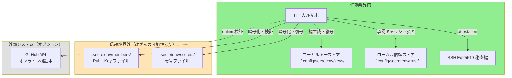
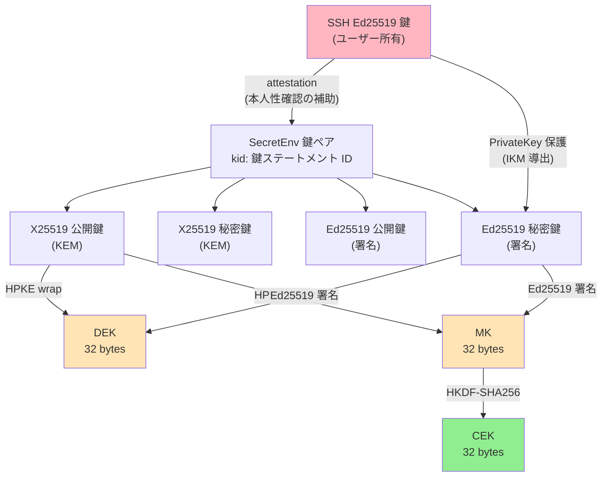
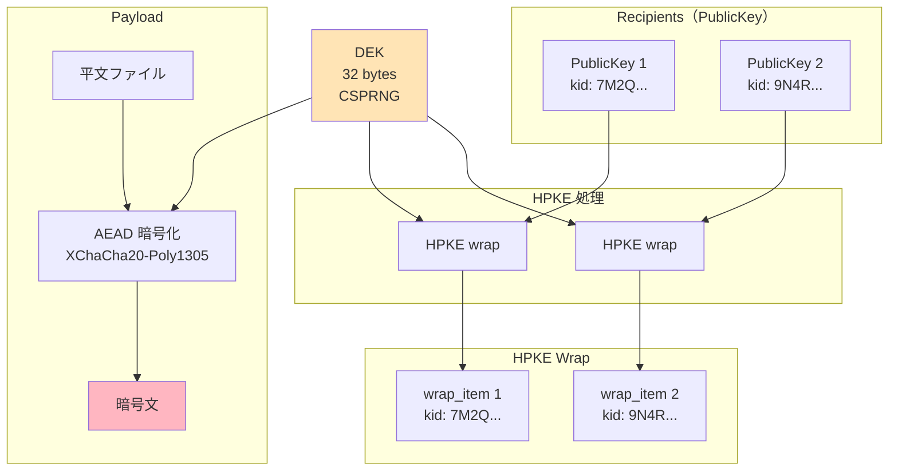
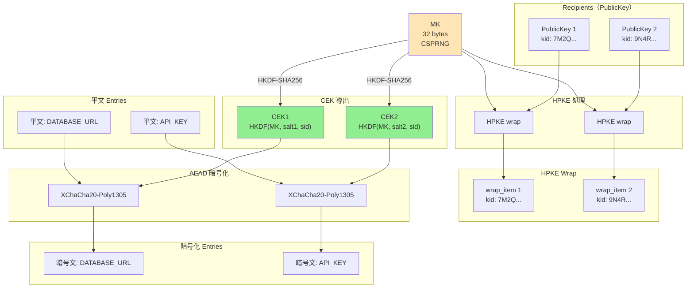
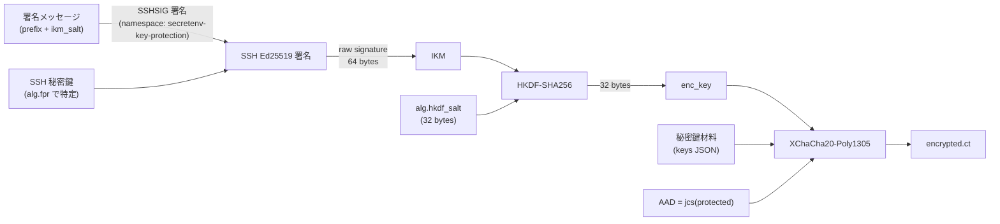
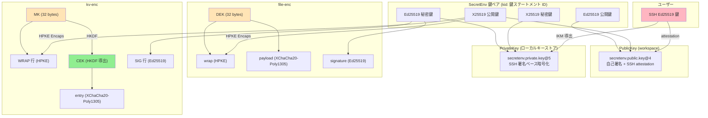

# SecretEnv セキュリティ設計

---

## 0. 文書情報

### エグゼクティブサマリー

SecretEnv は、チームの秘密情報（`.env` ファイル、証明書、API キー）を最新の標準暗号技術で保護する。鍵配送に HPKE（RFC 9180）、コンテンツ暗号化に XChaCha20-Poly1305、デジタル署名に Ed25519 を使用する。すべての暗号成果物は署名され、復号前に検証される。

**SecretEnv が設計上保証するもの:** 暗号化コンテンツの機密性、署名による改ざん検知、コンポーネント入れ替えを防ぐ暗号学的束縛、外部鍵サーバーに依存しない自己完結型の署名検証。

**SecretEnv が保証しないもの:** 復号後の内部者悪用の防止、過去に開示された秘密の回収、強い前方秘匿性、TOFU（Trust On First Use）を超える本人性保証。これらは見落としではなく、明示的な非目標である。とくに、端末が侵害されて復号に必要な鍵が奪取された場合、すでに復号可能になった過去データの保護は保証しない。

**利用者の運用責任:** 端末とローカルキーストア、SSH 鍵 / SSH 署名入力の適切な管理、`members/active/` への PR 変更のレビュー、TOFU 承認時のリポジトリ外チャネルを通じた新メンバー検証、メンバー除外時の秘密値のローテーション。

利用者は、これらの運用責任を自組織で継続できるかを確認することで、SecretEnv を安心して運用できる条件を判断できる。

運用ガイダンスについてはユーザーガイドを参照のこと。セキュリティ設計の全容については本書を通読されたい。

### 本書の位置づけ

本書は、SecretEnv のセキュリティ設計を整理し、その保護対象と前提条件を明確にするための文書である。SecretEnv が提示するセキュリティ主張、その成立条件、設計上の検証点、残余リスク、非目標を一貫した形で示すことを目的とする。

各節では、アルゴリズムやデータ構造の個別説明にとどまらず、どの設計判断がどのセキュリティ主張を支え、どこに運用前提や制約があるのかが読み取れるように記述する。

### 対象読者

本書は、主として 2 種類の読者を想定している。各読者は関心に応じて次のセクションに注目するとよい。


| 読者 | 主要セクション | 目的 |
| --- | --- | --- |
| **セキュリティ監査者 / レビュー担当者** | §2（脅威モデル）、§3（暗号プリミティブ）、§10（文脈束縛）、§11（攻撃シナリオ）、§12（確認ポイント）、§13（制約事項） | セキュリティ主張、成立前提、残余リスク、レビュー観点を評価する |
| **利用者 / 運用責任者 / 導入判断者** | エグゼクティブサマリー、§1（概要）、§2.1〜§2.4（脅威モデル要約）、§7.4〜§9（運用前提と信頼境界）、§13（制約事項）、付録 B（運用チェック） | 自組織で安全に運用できる条件と、受け入れるべき制約を判断する |


---

## 1. セキュリティ概要

SecretEnv は、チーム内で `.env` ファイルや証明書などの秘密情報を安全に共有するためのオフライン優先（offline-first）の暗号ファイル共有 CLI ツールである。Git リポジトリを配布媒体として利用可能だが、Git の存在に依存しない。

### 1.1 設計上の重要論点

1. **セキュリティ主張**: 何を暗号学的に防御し、何を運用前提に委ねているか
2. **信頼境界**: ローカル秘密鍵・ローカルキーストア・ローカル信頼ストアは利用者の端末上に置き、workspace 上の `members/active` / `members/incoming` / `secrets` は改ざん可能なリポジトリ入力として扱う
3. **役割分離された信頼ポリシー**: `signer_pub` は暗号学的署名検証の入力、`members/active` は現在のメンバー集合 / 現在の受信者集合の認可の基準情報、`known_keys` は TOFU の承認キャッシュとして分離する
4. **鍵の本人性の限界**: 自己署名と attestation は鍵一貫性や鍵紐付けを示すが、本人性は単独の機構で確定できない。手動承認とオンライン検証は、その判断材料を増やす補助層である
5. **文脈束縛**: `sid` / `kid` / `k` / `p` を使って流用や取り違えを防いでいる
6. **実装上の重要な不変条件**: 署名検証前に復号しないこと、束縛を削らないこと、`signer_pub` 欠落時に安全側で拒否すること、`SECRETENV_STRICT_KEY_CHECKING=no` の適用範囲を読み取り経路に限定すること

### 1.2 セキュリティ主張と検証方法


| セキュリティ主張         | 主な仕組み                                       | 設計上の確保方法                                                                     | 成立前提                              | 残余リスク                                |
| ---------------- | ------------------------------------------- | ---------------------------------------------------------------------------- | --------------------------------- | ------------------------------------ |
| **機密性**          | HPKE wrap + XChaCha20-Poly1305              | CEK を受信者ごとに HPKE で wrap し、平文は CEK で AEAD 暗号化する                               | recipient の秘密鍵が漏洩していない            | 正当 recipient による持ち出しは防げない            |
| **改ざん検知**        | Ed25519 署名                                  | 暗号文・メタデータを署名対象に含め、署名が検証できないデータを受理しない                                         | 署名検証が必ず実行される                      | 署名者自身が悪意を持つ場合は防げない                   |
| **署名成果物の自己完結検証** | 必須の `signer_pub` + PublicKey 検証             | 署名検証鍵は常に埋め込み `signer_pub` から取得し、自己署名・attestation・`kid` 一致を確認してから本体署名を検証する    | すべての署名成果物に `signer_pub` が埋め込まれている | 現在のメンバーであるかどうかは別途信頼ポリシーに依存する         |
| **文脈束縛**         | `sid` / `kid` / `k` / `p` を info / AAD に含める | `sid` / `kid` / `k` / `p` を HPKE info と payload AAD に束縛し、流用・入れ替えが成立しないようにする  | 実装が仕様どおりの束縛を維持する                  | 束縛を削る実装変更で弱くなる                       |
| **鍵一貫性**         | PublicKey 自己署名                              | PublicKey 本体を自己署名で保護し、既存鍵の改ざんが成立しないようにする                                     | 元の秘密鍵が漏洩していない                     | 新規の悪意ある鍵作成は防げない                      |
| **現在有効な信頼状態の判定** | `members/active` + `known_keys`             | `members/active` を認可の基準情報、`known_keys` を承認キャッシュとして分離し、読み取り経路 / 書き込み経路ごとに判定する | リポジトリ運用統制と利用者承認が適切に機能する           | 初期受け入れ時の TOFU、リポジトリ侵害、誤承認に弱い         |
| **鍵の本人性補強**      | SSH attestation + 手動承認 + オンライン検証            | 各層の意味を分離して扱い、混同しない（自己署名=一貫性、attestation=紐付け、手動承認=受理判断、オンライン検証=補助証拠かつ現在性チェック） | 手動承認が適切に行われる                      | 初回接触時 MITM 攻撃、GitHub / SSH 信頼基盤侵害に弱い |
| **可搬な秘密鍵利用**     | password export または SSH ベース保護               | CI 利用時の信頼条件を満たす運用に限定する                                                       | 信頼できる CI 実行文脈でのみ使う                | 同一 secret backend への保存は独立防御にならない     |


### 1.3 用語の使い分け


| 用語            | 本書での意味                                                               |
| ------------- | -------------------------------------------------------------------- |
| **鍵一貫性**      | 同じ秘密鍵保持者がその PublicKey を作成したことを示す性質。本人性そのものではない                       |
| **本人性補強**     | 鍵がどの人物・アカウントに紐付くかの判断材料を増やす運用層                                        |
| **承認キャッシュ**   | 利用者が過去に確認した `kid` を再確認なしで扱うためのローカルキャッシュ                              |
| **現在のメンバー集合** | current workspace の `members/active` から得られる `(member_id, kid)` の集合   |
| **非メンバー例外受理** | current `members/active` に存在しない signer を対話的 / 一回限り / 成果物単位で例外受理する仕組み |
| **信頼境界**      | そのまま信用する領域と、改ざんを前提に検証して扱う領域の境界                                       |
| **残余リスク**     | 仕様どおり実装しても残るリスク、または運用前提を満たさない場合に残るリスク                                |


---

## 2. 脅威モデルと信頼境界

### 2.1 攻撃者モデル


| 攻撃者                | 能力                                                                          | 想定シナリオ                         |
| ------------------ | --------------------------------------------------------------------------- | ------------------------------ |
| **リポジトリ改ざん者**      | `.secretenv/` 配下のファイルを任意に改ざん可能                                              | 悪意ある CI、侵害された Git サーバ、不正な push |
| **公開鍵すり替え者**       | `members/active/<id>.json` または `members/incoming/<id>.json` を偽造した公開鍵に置き換え可能 | 新メンバー追加時の MITM、リポジトリへの不正コミット   |
| **鍵ローテーション攻撃者**    | 古い鍵世代の wrap を保持し、新しい鍵での復号を試行                                                | 鍵更新プロセスの不備を突く                  |
| **コンテキスト混同攻撃者**    | 異なる secret の暗号文コンポーネントを入れ替え                                                 | 暗号ファイル間でのコピー & ペースト            |
| **初回接触時 MITM 攻撃者** | 初期受け入れ時点の `kid` / GitHub 情報 / attestation fingerprint を偽情報に差し替える            | 初回 clone、初回遭遇 signer の承認       |
| **ローカル信頼ストア改ざん者**  | `<SECRETENV_HOME>/trust/` に書き込みまたは rollback を行う                             | `known_keys` の置換、承認履歴の巻き戻し     |


### 2.2 運用前提

上記の脅威モデルは、リポジトリへの書き込みアクセスが適切に管理されていることを前提とする。主なターゲット環境である Git + GitHub 運用では、`members/active/` への変更は PR レビューを通じて検証される。`members/active` は現在のメンバー集合 / 現在の受信者集合の認可の基準情報だが、暗号学的な信頼の起点ではない。

Git を配布媒体として使う以上、リポジトリの正規利用者が過去の commit から旧 artifact を取得できること自体は避けられない。したがって、書き込み権限を持つ攻撃者または内部者が、過去に正当だった暗号ファイルを現在の HEAD に巻き戻して commit するリポジトリレベルの rollback / rewind は、SecretEnv の暗号束縛（`sid` / `kid` / `k` / `p`）だけでは検知対象にならない。これらの束縛が保証するのは artifact の整合性と文脈整合であり、Git 履歴に対する freshness や単調増加性ではないためである。

この種のリスクは、SecretEnv の暗号設計の外側にある repo governance の問題として扱う。保護ブランチ、required review、変更管理、デプロイ前確認などにより、過去版の secret artifact を current HEAD に昇格させない運用を前提とする。

また、`<SECRETENV_HOME>/trust/` は利用者の端末上にあり、OS / ファイルシステムのアクセス制御で保護されていることを前提とする。ローカル信頼ストアの署名は整合性確認・破損検知・フォーマット検証のために用いられるが、この領域に対する整合的な置換や rollback までは防がない。

初回受け入れや初回遭遇 `kid` の承認は TOFU に依存する。したがって、初回接触時 MITM 攻撃や workspace 全体すり替えを暗号学的に排除することは本モデルの対象外である。SecretEnv 自体の暗号設計と、配布媒体・レビュー運用・リポジトリ外チャネルによる確認は分けて評価する必要がある。

### 2.3 信頼境界



**信頼する要素:**

- ローカル端末とローカルキーストア（`~/.config/secretenv/keys/`）
- ローカル信頼ストア（`~/.config/secretenv/trust/`）。ただし現在有効な信頼状態の権威ではなく、利用者ローカルの承認キャッシュを保持する
- ユーザーの SSH Ed25519 秘密鍵
- GitHub API（オンライン検証時のみ、オプション）

**信頼しない要素:**

- Workspace の `members/active/` および `members/incoming/` — リポジトリ上の非信頼データ。PublicKey 自体は署名と attestation で検証し、現在のメンバー集合 / 現在の受信者集合の権威として使うかどうかはリポジトリ運用統制に依存する
- Workspace の `secrets/` ディレクトリ — 署名で検証

この信頼境界の中で、SSH 秘密鍵は 2 つの役割を担う（§7.2 で詳述）。1 つは attestation 署名者として SecretEnv 公開鍵と SSH 鍵を紐づける役割、もう 1 つはローカルキーストア上の PrivateKey ファイル（`private.json`）を暗号化している対称鍵を、復号のたびに SSH 署名から作り直すための署名提供者としての役割である。PrivateKey 素材そのものは、ローカルキーストア上の独立したファイルに保存されている。

したがって SecretEnv 鍵の復号が成立するのは、ローカルキーストア上の PrivateKey ファイル（`private.json`）に到達でき、かつそのファイルの内容から組み立てられる署名対象に対して SSH 署名を実行できる場合である。署名対象は PrivateKey ファイルの内容から導かれるため、ssh-agent への接続（agent forwarding を含む）や SSH 署名能力の提供そのものは、ローカルキーストアへの到達と組み合わさって初めて PrivateKey 保護に影響する。攻撃者が `private.json` と対応する SSH 秘密鍵または SSH 署名実行権限を得た場合、その鍵向けの過去暗号文は復号され得る。通常運用では SSH 鍵とローカルキーストアは同じ端末に共存するため、端末が侵害されるとこの条件が揃い得る。

### 2.4 設計スコープの要約


| 項目              | 含意                                                                             |
| --------------- | ------------------------------------------------------------------------------ |
| **保証するもの**      | 機密性、改ざん検知、文脈束縛、鍵世代束縛、鍵一貫性、`signer_pub` による自己完結型署名検証                            |
| **運用前提に依存するもの** | 鍵の本人性判断、`members/active` への変更レビュー、TOFU 承認、ローカル信頼領域（端末、ローカルキーストア、ローカル信頼ストア、SSH 鍵 / SSH 署名入力）の保護、CI 上の安全な実行条件 |
| **保証しないもの**     | 内部者の悪用防止、過去開示の回収、強い意味での前方秘匿性、初期受け入れ時の真正性、workspace 全体すり替え、中央ポリシーによる権限制御        |
| **実装で最重要な観点**   | 署名検証順序、束縛の保持、`signer_pub` 必須、署名者鍵の代替探索禁止、`members/active` / `known_keys` の責務分離 |


### 2.5 信頼モデル

SecretEnv の信頼モデルは、暗号学的検証・現在のメンバーシップ判定・利用者承認を意図的に分離している。単一の機構で「この鍵が誰のもので、現在も受理すべきか」を決めるのではなく、以下の4つの層で構成される。ユーザーガイドではこれらの層を運用向けに簡略化して提示している。本節はその完全版であり、各層の根拠を含めて記述する。

注: 層2〜4 で参照するプロトコル要素（`members/active`、`known_keys`、ローカル信頼ストア）は §4〜§9 で詳しく説明する。本節は概念レベルで信頼モデルを導入するものであり、プロトコル詳細を読んだ後に再読することを推奨する。


| 層                     | 仕組み                         | 確立するもの               | 確立しないもの              |
| --------------------- | --------------------------- | -------------------- | -------------------- |
| **1. 暗号学的検証**         | `signer_pub` + PublicKey 検証 | 成果物と署名鍵の暗号学的真正性      | 鍵保持者の本人性             |
| **2. 認可**             | `members/active`            | 現在のメンバー集合 / 現在の受信者集合 | 暗号学的信頼（リポジトリ運用統制に依存） |
| **3. 承認キャッシュ**        | ローカル信頼ストアの `known_keys`     | 過去に確認済みの `kid`       | 現在のメンバーであること         |
| **4. 手動承認 + オンライン検証** | TOFU 承認、GitHub API          | 本人性判断の補助証拠           | 暗号学的な本人性の証明          |


**層1: 暗号学的検証**

署名成果物は必ず `signature.signer_pub` を含み、署名検証鍵は常にこの埋め込み PublicKey から取得する。ここでは自己署名・attestation・`kid` 一致・有効期限を検証し、「この成果物がどの鍵ステートメントで署名されたか」を自己完結に確定する。`members/active` は署名者鍵の探索には使わない。

この層は以下の性質を通じて暗号学的真正性を確立する:

- **自己署名（鍵一貫性）**: PublicKey に含まれる自己署名は、この PublicKey を作成した主体が対応する秘密鍵を保持していることを示す。これは鍵の**一貫性**を確認する材料であり、**本人性**までは示さない。攻撃者が自分の SecretEnv 鍵ペアを新規作成すれば、有効な自己署名を持つ PublicKey を生成できる。自己署名の役割は、既存の PublicKey の**改竄防止**に限定される。`members/active/` または `members/incoming/` にある PublicKey のフィールドを書き換えると自己署名検証が失敗する。
- **SSH attestation（鍵紐付け）**: SSH attestation は、SecretEnv 鍵ペアと SSH 鍵の紐付けを暗号学的に確認する。attestation の signed_data は SSHSIG namespace `secretenv-attestation` に固定され、PrivateKey 保護とは署名文脈を分離する。ただし、SSH 鍵自体の所有者が誰であるかは attestation だけでは特定できない。攻撃者が自分の SSH 鍵で自分の SecretEnv 鍵を attestation すれば、有効な attestation を生成可能である。

**層2: 認可（`members/active`）**

current workspace の `members/active` は、現在のメンバー集合 / 現在の受信者集合を決める認可の基準情報である。読み取り経路では signer の `(member_id, kid)` が現在のメンバー集合に含まれることを要求し、書き込み経路では recipients を `members/active` から導出する。

ただし `members/active` は暗号学的な信頼の起点ではない。リポジトリ上の非信頼データであり、その真正性は Git のアクセス制御と PR レビュープロセスというリポジトリ運用統制に依存する。

**層3: 承認キャッシュ（`known_keys`）**

ローカル信頼ストアは `secretenv.trust.local@2` 形式の署名付き JSON であり、`known_keys[]` を通じて「利用者が一度確認した `kid`」を保持する。これは現在有効な信頼状態の権威ではなく、承認キャッシュである。

- signer / recipient の区別を持たない
- workspace の区別を持たない
- 現在のメンバーであることを意味しない
- self の鍵はローカルキーストアが信頼の起点であるため、通常は `known_keys` への記録を必要としない

**層4: 手動承認とオンライン検証**

未確認 `kid` を承認する際、利用者は `kid`、`attestation.pub` fingerprint、必要に応じて GitHub account の `id` / `login` を確認して受理判断を行う。これは SSH の `known_hosts` における初回確認と同じく TOFU モデルであり、本人性を暗号学的に確定するものではない。GitHub API によるオンライン検証は補助証拠であって、単独で本人性を確定しない。

重要なのは、online verify が履歴証明ではなく**現在性チェック**だという点である。確認しているのは「この PublicKey の `attestation.pub` が、検証時点でもその GitHub account の現在の SSH 公開鍵集合に含まれているか」であり、「過去に一度でも登録されていたか」ではない。そのため、鍵所有者が GitHub から該当 SSH 公開鍵を削除すると、以後その鍵に依存する online verify は失敗する。

この性質は、軽量な revocation channel として運用上有利に使える。たとえば SSH attestor 鍵の漏洩疑い、退職・異動、鍵ローテーション完了後の旧鍵整理といった場面で、GitHub から古い SSH 公開鍵を削除すれば、将来の trust 更新や新規承認フローでその鍵を通しにくくできる。一方で、これは既存の attestation 署名を暗号学的に無効化するものではなく、すでにローカルで承認済みの `known_keys` や repository 上の `members/active` を自動的に取り消すものでもない。したがって、online verify の失敗は「今後の承認を止める」効果として扱い、既存 trust の除去やメンバー除外は別途行う必要がある。

**限定例外: 非メンバー例外受理と `SECRETENV_STRICT_KEY_CHECKING=no`**

- 非メンバー例外受理は、current `members/active` に存在しない signer の成果物を対話的 / 一回限り / 成果物単位で一回だけ受理する例外である。signer を現在のメンバーに戻さず、`known_keys` も更新しない
- `SECRETENV_STRICT_KEY_CHECKING=no` は、利用者が明示指定した読み取り経路に限って `known_keys` チェックだけを省略する。対話的実行でも明示指定なら許容するが、`members/active` の確認と暗号学的署名検証は省略しない

**複合信頼**

鍵の本人性判断を強めるには、上記の層が適切に機能することが望ましい。ただし、攻撃シナリオによって弱くなる条件は異なる。

- **既存鍵の改竄**: 自己署名または attestation を破る必要があり、通常は元の秘密鍵素材の漏洩が必要になる
- **新規鍵挿入**: リポジトリ運用統制の破綻に加え、利用者が TOFU 承認で誤受理すると成立し得る。攻撃者は自分の鍵で有効な自己署名・attestation を生成できるため、被害者の秘密鍵漏洩は不要である
- **SSH attestor 秘密鍵のみの漏洩**: GitHub account が健全でも、正規の attestor 情報を持つ不正鍵を作れてしまう
- **GitHub / SSH 信頼基盤の侵害**: オンライン検証や手動確認に表示される GitHub 情報自体が偽装され得る
- **ローカル信頼ストア改ざん**: ローカル信頼領域が破られると、整合的な `known_keys` 置換や rollback を完全には防げない

---

## 3. 暗号プリミティブの選択

### 3.1 アルゴリズム一覧


| アルゴリズム                     | パラメータ                        | RFC         | 用途                               |
| -------------------------- | ---------------------------- | ----------- | -------------------------------- |
| HPKE Base mode             | suite `hpke-32-1-3`          | RFC 9180    | Content Key の wrap/unwrap        |
| DHKEM(X25519, HKDF-SHA256) | kem_id=32 (0x0020)           | RFC 9180    | KEM（鍵カプセル化）                      |
| HKDF-SHA256                | kdf_id=1 (0x0001)            | RFC 5869    | KDF（鍵導出）                         |
| ChaCha20-Poly1305          | aead_id=3 (0x0003)           | RFC 8439    | HPKE 内部 AEAD                     |
| XChaCha20-Poly1305         | nonce 24 bytes, key 32 bytes | —           | payload / entry / PrivateKey 暗号化 |
| Ed25519 (PureEdDSA)        | —                            | RFC 8032    | 署名・検証                            |
| HKDF-SHA256                | —                            | RFC 5869    | CEK 導出、PrivateKey enc_key 導出     |
| JCS                        | —                            | RFC 8785    | JSON の決定的正規化                     |
| base64url (no padding)     | —                            | RFC 4648 §5 | バイナリエンコード                        |


### 3.2 HPKE (RFC 9180)

**選択理由:**

- 標準化されたハイブリッド公開鍵暗号化スキームであり、KEM + KDF + AEAD の組み合わせが一貫して定義されている
- Base mode で wrap ごとの ephemeral key isolation を提供（ただし recipient 長期鍵漏洩時は既存 wrap が復号可能、詳細は本書 §13.1）
- IANA Registry による suite ID の明確な識別

**suite 構成:**

```
hpke-32-1-3
├── kem_id  = 32 (0x0020) DHKEM(X25519, HKDF-SHA256)
├── kdf_id  = 1  (0x0001) HKDF-SHA256
└── aead_id = 3  (0x0003) ChaCha20-Poly1305
```

**代替案との比較:**


| 代替案                     | 不採用理由                                 |
| ----------------------- | ------------------------------------- |
| RSA-OAEP                | 鍵サイズが大きく、Forward Secrecy を自然に実現できない   |
| ECIES (自作構成)            | 標準化されておらず、構成ミスのリスクが高い                 |
| Age (X25519-ChaChaPoly) | HPKE ほど仕様上の整理が進んでおらず、info/AAD の柔軟性が不足 |


**既知の制約:**

- Base mode は送信者認証を提供しない（署名で補完）
- X25519 は 128-bit セキュリティレベル

### 3.3 XChaCha20-Poly1305

**選択理由:**

- 24-byte nonce により、ランダム nonce の衝突リスクが実用上無視できる（birthday bound が 2^96）
- AES-NI 非搭載環境でも一定のパフォーマンスを発揮
- misuse resistance は提供しないが、nonce 空間の広さで実質的な安全性を確保

**代替案との比較:**


| 代替案             | 不採用理由                                        |
| --------------- | -------------------------------------------- |
| AES-256-GCM     | 12-byte nonce では multi-key 使用時に衝突リスクが高い      |
| AES-256-GCM-SIV | nonce misuse resistance は魅力的だが、実装の複雑さと普及度を考慮 |


**既知の制約:**

- nonce reuse は壊滅的（同一鍵・同一 nonce での暗号化は禁止）
- payload の圧縮は禁止（圧縮オラクル攻撃 CRIME/BREACH の回避）

### 3.4 Ed25519 (RFC 8032 PureEdDSA)

**選択理由:**

- **決定論的署名**: 同一入力に対して常に同一の署名を生成。PrivateKey 保護で IKM として署名を使用するため必須の性質
- 高速な署名・検証
- SSH エコシステムとの親和性（ssh-ed25519）

**代替案との比較:**


| 代替案           | 不採用理由                                        |
| ------------- | -------------------------------------------- |
| ECDSA (P-256) | 非決定論的署名（RFC 6979 で緩和可能だが、SSH 実装での扱いにばらつきがある） |
| Ed448         | SSH エコシステムでの普及が不十分                           |


**既知の制約:**

- 128-bit セキュリティレベル
- コンテキスト分離は PureEdDSA 自体では提供されない（JCS 正規化 + プロトコル識別子で対応）

### 3.5 HKDF-SHA256 (RFC 5869)

**選択理由:**

- 標準化された鍵導出関数
- `info` パラメータにより、同一 IKM から用途別の鍵を安全に導出可能
- `salt` パラメータにより、同一 IKM・同一 info でも異なる鍵を導出可能

**用途:**

- kv-enc の CEK 導出（MK + salt + sid → CEK）
- PrivateKey 保護の enc_key 導出（SSH 署名 + salt + kid → enc_key）

### 3.6 JCS (RFC 8785)

**選択理由:**

- JSON オブジェクトの決定論的正規化を提供
- 鍵の順序や数値表現の揺れを排除し、署名・AAD・HPKE info の一貫性を保ちやすくする
- `sid` 等の文字列フィールドに任意の文字が含まれても曖昧性が発生しない

### 3.7 標準暗号プリミティブに依拠する安全性と限界


| プリミティブ                    | 前提とする安全性                                  | SecretEnv における含意                                                           |
| ------------------------- | ----------------------------------------- | -------------------------------------------------------------------------- |
| HPKE Base mode (RFC 9180) | 受信者公開鍵に対する鍵配送の機密性を提供するが、送信者認証は提供しない       | recipient ごとの wrap の機密性はこれに依拠する一方、作成者の真正性や insider 攻撃への対策は Ed25519 署名に依存する |
| XChaCha20-Poly1305        | nonce を再利用しない限り、機密性と改ざん検知を提供する AEAD である   | payload / entry / PrivateKey 保護の安全性は nonce 一意性に依存し、nonce reuse には耐えない      |
| Ed25519 (PureEdDSA)       | 署名秘密鍵が保護されている限り、署名の偽造困難性と改ざん検知を提供する       | 暗号ファイルや PublicKey 文書の真正性確認はこれに依拠し、秘密鍵漏洩時にはこの保証は崩れる                         |
| HKDF-SHA256               | 十分なエントロピーを持つ IKM から、擬似ランダムで用途分離された鍵を導出できる | CEK や enc_key の鍵分離はこれに依拠するが、低エントロピーな IKM を高エントロピー化するものではない                 |


**安全性の依存関係:**

- 全体の機密性は、受信者への鍵配送に使う HPKE の機密性と、payload 自体を保護する AEAD の機密性の両方に依存する。どちらか一方だけでは SecretEnv 全体の機密性は成立しない。
- 改ざん検知は Ed25519 署名に依存する。HPKE Base mode 自体は送信者認証を提供しないため、暗号ファイルや PublicKey 文書が正当な署名者によって作成されたこと、および改ざんされていないことの確認は署名で補う。
- kv-enc における entry 間の暗号学的独立性は、HKDF-SHA256 の PRF 安全性に依存する。SecretEnv では高エントロピーな MK から entry ごとに CEK を導出するため、ある entry の情報から他の entry の CEK を直接導けないことを期待する。

**前提条件と限界:**

- HPKE Base mode は recipient 長期秘密鍵の秘匿を前提とする。長期鍵漏洩時は当該 recipient 向けの全 wrap が復号可能（§13.1 参照）
- XChaCha20-Poly1305 の利用では nonce 一意性が重要であり、nonce reuse は深刻な問題につながる
- Ed25519 署名の前提は秘密鍵の秘匿である。SecretEnv では署名秘密鍵は PrivateKey 保護（§7）で暗号化保存される

### 3.8 nonce 安全性マージン

XChaCha20-Poly1305 は 24-byte (192-bit) nonce を使用する。SecretEnv の設計では、同一の対称鍵で複数回の暗号化を行うケースが存在しない。DEK（file-enc）・CEK（kv-enc entry）・enc_key（PrivateKey 保護）はそれぞれ暗号化ごとに一意に生成または導出されるため、nonce 衝突のリスクは構造的に排除されている。

192-bit nonce 空間の選択は、将来の設計変更で同一鍵の再利用が発生した場合の安全弁として機能する。

### 3.9 暗号強度 (セキュリティレベル)

各暗号プリミティブが提供する推定暗号強度（セキュリティレベル）は以下の通りである。


| 暗号プリミティブ           | 鍵サイズ / パラメータ | 推定暗号強度 (古典コンピュータ) | 備考                  |
| ------------------ | ------------ | ----------------- | ------------------- |
| X25519 (KEM)       | 256 bits     | 128 bits          | 離散対数問題に対する安全性       |
| Ed25519 (署名)       | 256 bits     | 128 bits          | 離散対数問題に対する安全性       |
| XChaCha20-Poly1305 | Key 256 bits | 256 bits          | 対称鍵暗号としての強度         |
| ChaCha20-Poly1305  | Key 256 bits | 256 bits          | HPKE 内部の AEAD       |
| HKDF-SHA256        | 出力 256 bits  | 256 bits          | ハッシュ関数の原像計算困難性等に基づく |


**システム全体の暗号強度:**

システム全体の安全性は、連鎖する暗号プリミティブのうち最も強度が低いものに制約される（weakest link の原則）。
SecretEnv では、データの機密性（HPKE X25519）および真正性（Ed25519）の基盤となる非対称暗号の強度が 128 bit であるため、**システム全体として提供される暗号強度は 128 bit 相当**となる。

これは現在の一般的な商用システムにおいて十分強固なセキュリティレベル（AES-128 相当）を満たしている。対称鍵暗号部分（XChaCha20-Poly1305 等）に 256 bit 鍵を採用しているのは、利用可能な標準的で高速なプリミティブを選択した結果であり、システム全体を 256 bit 強度に引き上げるものではない。

---

## 4. 鍵階層と鍵ライフサイクル

### 4.1 鍵の種類と関係




この図は、SSH 鍵と SecretEnv 鍵ペアを意図的に分離して示している。

- **SSH 鍵**は、ユーザーが既に保有している外部の認証鍵であり、SecretEnv の暗号ファイルそのものを直接暗号化・署名する鍵ではない
- **SecretEnv 鍵ペア**は、workspace 内の暗号化・復号・署名・検証に使うアプリケーション固有の鍵である
- SSH 鍵の役割は 2 つだけである
  - **attestation**: SecretEnv 公開鍵がどの SSH 鍵で裏付けられているかを示す。SSHSIG namespace は `secretenv-attestation`
  - **PrivateKey 保護**: ローカルキーストア内の SecretEnv 秘密鍵を復号するための `enc_key` 導出に使う。SSHSIG namespace は `secretenv-key-protection`

したがって、SSH 鍵は SecretEnv 鍵ペアそのものではなく、SecretEnv 鍵ペアの来歴確認とローカル保護のための外側の鍵である。同じ SSH 鍵を両用途で使っても、署名文脈は namespace により分離される。

### 4.2 鍵パラメータ一覧


| 鍵の種類                         | サイズ      | 生成方法            | 用途                        | ゼロ化要否      |
| ---------------------------- | -------- | --------------- | ------------------------- | ---------- |
| SSH Ed25519 秘密鍵              | 32 bytes | ユーザーが管理         | attestation、PrivateKey 保護 | N/A（OS 管理） |
| X25519 秘密鍵 (KEM)             | 32 bytes | CSPRNG          | HPKE unwrap               | MUST       |
| X25519 公開鍵 (KEM)             | 32 bytes | X25519 秘密鍵から導出  | HPKE wrap                 | —          |
| Ed25519 秘密鍵 (署名)             | 32 bytes | CSPRNG          | 署名生成                      | MUST       |
| Ed25519 公開鍵 (署名)             | 32 bytes | Ed25519 秘密鍵から導出 | 署名検証                      | —          |
| DEK (Data Encryption Key)    | 32 bytes | CSPRNG          | file-enc payload 暗号化      | MUST       |
| MK (Master Key)              | 32 bytes | CSPRNG          | kv-enc の CEK 導出元          | MUST       |
| CEK (Content Encryption Key) | 32 bytes | HKDF-SHA256 導出  | kv-enc entry 暗号化          | MUST       |
| enc_key (PrivateKey 保護用)     | 32 bytes | HKDF-SHA256 導出  | PrivateKey AEAD 暗号化       | MUST       |


補足:

- `enc_key` は保存済みの固定鍵ではなく、SSH 署名出力からその都度導出される一時的な対称鍵である
- 同じ SSH 鍵を使って複数の SecretEnv 鍵ステートメントを保護できるが、`kid` と `salt` が異なれば導出される `enc_key` も異なる
- ローカルキーストアに保存される `private.json` に含まれるのは SecretEnv 秘密鍵の暗号文のみであり、SSH 秘密鍵自体は SecretEnv 管理下には入らない

### 4.3 受信者の資格

暗号化操作の受信者になれるのは `members/active/` に記載されたメンバーのみである。`members/incoming/` のメンバーは `rewrap` で active に昇格されるまで既存の秘密を復号できない。

### 4.4 鍵ライフサイクル

SecretEnv の鍵ペアは、生成から期限切れ、そして新しい鍵へのローテーションというライフサイクルをたどる。

```
生成 → active → expired
         │
         └── rotate (新しい鍵ペアを生成して切り替え)
```

各状態における扱いは以下の通りである。

- **生成**: `key new` コマンドで新しい鍵ペアと PublicKey 文書を生成し、ローカルキーストアに保存する。
- **active**: `expires_at` が到来していない有効な状態。新たな暗号化（wrap）や署名の生成、および復号・検証に利用できる。
- **expired**: `expires_at` を過ぎた状態。新たな暗号化（wrap）や署名の生成は拒否されるが、過去に正当に署名・暗号化されたデータの復号・検証は警告付きで許可される。
- **rotate**: `rewrap --rotate-key` などにより、新しい鍵ペア（新しい `kid`）を生成して active な鍵を切り替える。古い鍵は expired になるまで復号・検証用に保持される。

#### 4.4.1 鍵ステートメント ID（kid）の不変性

各鍵ペアには `kid`（鍵ステートメント ID）が対応付けられる。`kid` はハイフンなし 32 文字の Crockford Base32 であり、自己署名対象となる `PublicKey@4.protected` の内容（公開鍵本体、identity、binding_claims、有効期限など）から決定的に導出される。

`kid` は PublicKey の内容から導出されるため、**kid の一致は鍵ステートメント内容の完全な一致を意味する**。内容のいずれかが変化すれば、異なる `kid` を持つ新しい鍵ペアとして扱われる。

### 4.5 鍵ローテーション

鍵ローテーションは `rewrap` コマンドで行う。動作は file-enc と kv-enc、および recipient 変更と明示的な `--rotate-key` で異なる。両プロトコルの説明後に §6.8 で詳述する。

---

## 5. file-enc プロトコル

file-enc は単一ファイルを複数受信者向けに暗号化する。ランダムに生成されるファイル固有の鍵（DEK）で XChaCha20-Poly1305 によりファイル全体を暗号化し、各受信者には HPKE でラップされた DEK のコピーを渡す。全体構造は Ed25519 で署名され、復号前に改ざんが検知される。

### 5.1 データ構造の概観

file-enc は JSON 形式の署名付きコンテナであり、監査上重要なのは次の要素である。

| 要素 | 内容 | セキュリティ上の役割 |
| --- | --- | --- |
| `protected.sid` | ファイル識別子 | wrap、payload、署名を同じファイル文脈に束縛する |
| `wrap[]` | 受信者ごとの DEK 配布情報 | `kid` と `sid` を含む HPKE 文脈により、異なる鍵世代や異なるファイルへの流用を防ぐ |
| `payload.protected` | payload ヘッダ | `sid` と AEAD アルゴリズムを含み、JCS 正規化した値が AAD になる |
| `payload.encrypted` | nonce と暗号文 | DEK により保護されるファイル本体 |
| `signature` | `signature_v4` 形式の署名 | `protected` 全体、すなわち wrap と payload の完全性を保護する |

`wrap[].rid` は表示や監査補助のための識別情報であり、復号時の鍵選択や信頼判断の基準ではない。鍵世代の識別と束縛には `kid` を用いる。

ファイル全体のレイアウトは次のとおりである。

```json
{
  "protected": {
    "format": "secretenv.file@3",
    "sid": "<UUID>",
    "wrap": [
      {
        "rid": "<member_id>",
        "kid": "<canonical kid>",
        "alg": "hpke-32-1-3",
        "enc": "<b64url>",
        "ct": "<b64url>"
      }
    ],
    "removed_recipients": [
      {
        "rid": "<member_id>",
        "kid": "<canonical kid>",
        "removed_at": "<RFC3339>"
      }
    ],
    "payload": {
      "protected": {
        "format": "secretenv.file.payload@3",
        "sid": "<UUID>",
        "alg": { "aead": "xchacha20-poly1305" }
      },
      "encrypted": {
        "nonce": "<b64url>",
        "ct": "<b64url>"
      }
    },
    "created_at": "<RFC3339>",
    "updated_at": "<RFC3339>"
  },
  "signature": {
    "...": "artifact signature"
  }
}
```

この構造により、`wrap`、任意の `removed_recipients`、`payload` はすべて `protected` に包含され、署名で改ざん検知される。さらに payload は独自の `payload.protected` を持ち、その JCS 正規化値が AEAD の AAD になるため、外側の署名とは別レイヤでもヘッダ束縛が成立する。

### 5.2 暗号化フロー



1. DEK を 32 bytes の暗号学的乱数として生成する。
2. 各受信者について、HPKE Base mode (`hpke-32-1-3`) で DEK を wrap する。
3. payload ヘッダを JCS 正規化し、その値を AAD として XChaCha20-Poly1305 でファイル本体を暗号化する。
4. `protected` 全体を JCS 正規化し、Ed25519 で署名する。

この順序により、鍵配送、payload 束縛、文書完全性がそれぞれ独立した層として成立する。

### 5.3 DEK 生成

- DEK は 32 bytes の暗号学的乱数であり、各 artifact ごとに独立して生成される。
- file-enc では DEK がファイル単位の payload 機密性の中心となる。
- 実装は使用後のゼロ化を目指すが、完全消去は §12.3 で述べる通りベストエフォートである。

### 5.4 HPKE wrap

- HPKE suite は `hpke-32-1-3` であり、詳細は §3.1 と §3.2 に示す。
- wrap の文脈には、受信者鍵世代を示す `kid`、プロトコル識別子 `p = secretenv:file:hpke-wrap@3`、ファイル識別子 `sid` を含める。
- HPKE の `info` と `AAD` には、同じ JCS 正規化済み文脈 bytes を用いる。これにより、鍵スケジュール側と AEAD 側で束縛入力が一致し、実装ずれが unwrap 失敗として早期に表面化する。
- 受信者の member_id は認可上重要だが、HPKE wrap の暗号学的束縛は `kid` を基準に行う。

### 5.5 payload 暗号化

- payload ヘッダには `format = secretenv.file.payload@3`、外側と同じ `sid`、AEAD 識別子 `xchacha20-poly1305` を含める。
- `jcs(payload.protected)` を AAD とし、24 bytes nonce を用いて XChaCha20-Poly1305 で平文ファイルを暗号化する。
- `sid` を payload レイヤにも保持することで、外側の署名とは独立に payload をファイル文脈へ束縛する。

### 5.6 復号フロー

1. 構造検証と `signer_pub` 検証、成果物署名検証を行う。
2. §9 の信頼ポリシーに照らして、その成果物が current workspace で受理可能かを判定する。
3. 自身の `kid` に対応する wrap を選択し、同じ文脈情報で HPKE unwrap を行う。
4. 外側 `sid` と payload 内 `sid` の一致を確認し、AEAD 復号する。
5. 途中のいずれかが失敗した場合は安全側で拒否する。

重要なのは、SecretEnv が署名検証前に復号しないことを設計上の不変条件としている点である。

---

## 6. kv-enc プロトコル

kv-enc は `.env` 形式のキーバリューエントリを個別に暗号化する。二層鍵構造を採用しており、マスターキー（MK）を各受信者に HPKE でラップし、エントリごとの暗号鍵（CEK）は MK から HKDF で導出する。この設計により、個別エントリの部分復号やファイル全体を再暗号化しない効率的な更新が可能となる。

### 6.1 データ構造の概観

kv-enc は行ベースの署名付き文書であり、監査上重要なのは次の構造である。

| 行種別 | 内容 | セキュリティ上の役割 |
| --- | --- | --- |
| `:SECRETENV_KV 3` | 形式とバージョン | 署名対象に含めることでダウングレード攻撃を防ぐ |
| `:HEAD` | `sid`、タイムスタンプなどのファイル文脈 | wrap と entry 全体を同一ファイルに束縛する |
| `:WRAP` | MK の HPKE wrap と削除履歴 | 現在の受信者集合と鍵配送状態を表す |
| `KEY` 行 | 各 entry の暗号文 | `salt`、nonce、AEAD 情報を持つ自己完結的な暗号単位 |
| `:SIG` | 文書全体の署名 | `:SIG` 自身を除く本文全体の整合性を保護する |

各トークンは JSON を JCS 正規化したうえで base64url エンコードして表現する。

文書全体のレイアウトは次のとおりである。

```text
:SECRETENV_KV 3
:HEAD <token>
:WRAP <token>
<KEY> <token>
<KEY> <token>
...
:SIG <token>
```

`:HEAD` は `sid` とタイムスタンプを保持し、`:WRAP` は MK の wrap 配列と削除履歴を保持する。各 KEY 行の token は `salt`、`k`、`aead`、`nonce`、`ct` を含む自己完結的な暗号単位であり、署名対象は `:SIG` を除く本文全体である。canonical_bytes は各実データ行を LF 終端で連結した値として扱う。

### 6.2 二層鍵構造の設計根拠

kv-enc は 1 ファイルにつき 1 つの MK を持ち、各 entry の CEK は `HKDF-SHA256(MK, salt, sid)` で導出する。

この二層構造を採る理由は次のとおりである。

- `set` で特定 entry だけを更新しても、他 entry の再暗号化を避けられる。
- `get` で必要な entry だけを部分復号できる。
- recipient 追加時には MK を維持したまま wrap の追加だけで済む。
- 一方で recipient 削除時には MK を更新し、将来 entry へのアクセス継続を防ぐ。

### 6.2.1 暗号化・復号フローの概要



暗号化時は、まず MK を生成して各受信者へ HPKE wrap し、その後で各 entry ごとに salt を生成し、`sid` を含む HKDF で CEK を導出して AEAD 暗号化する。最後に `:SIG` を除く本文全体へ署名する。

復号時は、まず署名を検証し、§9 の信頼ポリシーを適用してから MK を unwrap する。その後、必要な entry についてのみ CEK を導出し、`k`、`sid`、`p` を含む AAD で AEAD 復号する。

file-enc と同様に、署名検証は復号処理に先行する。

### 6.3 CEK 導出

- CEK 導出には HKDF-SHA256 を用い、文脈情報として `p = secretenv:kv:cek@3` と `sid` を含める。
- salt は entry ごとに独立して生成する。
- これにより、別ファイルから entry をコピーしても同じ CEK にはならず、復号に失敗する。

### 6.4 entry AAD

- entry AAD には、dotenv KEY を表す `k`、ファイル識別子 `sid`、プロトコル識別子 `p = secretenv:kv:payload@3` を含める。
- `k` により、同一 kv-enc 内での entry 入れ替えを防ぐ。
- `sid` により、CEK 導出時の文脈と payload レイヤの文脈を整合させる。
- `salt` はすでに HKDF の salt 引数に使われており、`recipients` は rewrap 時の payload 固定性を保つため AAD に含めない。

### 6.5 HPKE wrap (kv)

- kv-enc でも HPKE wrap には `kid`、`sid`、`p = secretenv:kv:hpke-wrap@3` を含める。
- `info` と `AAD` には file-enc と同じく同一の正規化済み文脈 bytes を用いる。
- これにより、wrap の鍵世代束縛とファイル文脈束縛が明確になり、実装ずれの早期検知が可能になる。

### 6.6 部分復号（get / set）

kv-enc の利点は、文書全体を復号せずに特定 entry だけを扱える点にある。

- `get` は、署名検証後に MK を復元し、対象 KEY の CEK だけを導出して当該 entry を復号する。
- `set` は、既存 entry を読む際に同じ検証を行ったうえで、新しい salt と CEK で対象 entry のみを再暗号化し、最後に署名を更新する。

### 6.7 recipient 削除時の挙動

kv-enc では recipient 削除時に MK を新規生成し、全 entry を新 MK 由来の CEK で再暗号化する。これは、旧 MK を保持していた受信者が将来の entry まで導出できないようにするためである。

あわせて `removed_recipients` と `disclosed` を更新し、どの secret 値を外部システム側でもローテーションすべきかを利用者が判断できるようにする。これらは可視化支援であり、過去開示の回収機構ではない。

### 6.8 両形式における鍵ローテーション動作

`rewrap` は wrap エントリを更新する（recipient の追加・削除）。`rewrap --rotate-key` は Content Key を再生成し、payload 全体を再暗号化する。


| 操作             | 形式       | Content Key | wrap | payload  |
| -------------- | -------- | ----------- | ---- | -------- |
| recipient 追加   | file-enc | DEK 維持      | 追加   | 維持       |
| recipient 追加   | kv-enc   | MK 維持       | 追加   | 維持       |
| recipient 削除   | file-enc | DEK 維持      | 削除   | 維持       |
| recipient 削除   | kv-enc   | **MK 再生成**  | 再構築  | **再暗号化** |
| `--rotate-key` | file-enc | DEK 再生成     | 再構築  | 再暗号化     |
| `--rotate-key` | kv-enc   | MK 再生成      | 再構築  | 再暗号化     |


recipient 追加時は、両形式とも Content Key を維持し、新しい wrap エントリを追加するのみである。

recipient 削除時は、形式によって動作が異なる。file-enc では、削除された recipient の wrap エントリを除去し削除履歴を記録するが、DEK は変更しない。kv-enc では、MK を必ず再生成し全エントリを再暗号化する。これは MK が長寿命の鍵であり、各エントリの CEK が MK から導出されるためである（§6.3）。削除されたメンバーが過去の復号セッションで旧 MK を保持していた場合、削除後に追加されたエントリの CEK を導出できてしまう。MK の再生成によりこのリスクを排除する。

`--rotate-key` は recipient の変更有無にかかわらず両形式で完全な再暗号化を強制し、鍵漏洩後の被害限定策として位置づけられる。

---

## 7. PrivateKey 保護

### 7.1 概要

SecretEnv の PrivateKey（KEM 秘密鍵 + 署名秘密鍵）は、ユーザーのローカルキーストア（`~/.config/secretenv/keys/`）に、鍵ごとの独立したファイル `private.json` として保存される。HPKE unwrap や Ed25519 署名は、このファイルから取り出した PrivateKey 素材を使って実行される。

PrivateKey の保護は次の 2 層構造として設計されている。

- 第 1 層: ローカルキーストアが信頼境界の内側に置かれていること自体。OS / ファイルシステムのアクセス制御と鍵ディレクトリの所有権によって、`private.json` への到達が同じ利用者権限の範囲に限定される。通常運用ではこの層が主防御である
- 第 2 層: `private.json` の中身（鍵素材を格納した暗号文部分）が、対称鍵で暗号化されていること。この対称鍵は都度の一時値として扱い、PrivateKey を使う必要が生じるたびに作り直す。この層は、鍵ファイル単体が信頼境界の外へ漏れた場合の秘匿性を補う

第 2 層の対称鍵を作り直す方式は 2 つある。PrivateKey そのものの形式や保存場所は両方式で共通であり、ローカルキーストア構造（§7.1.2）と暗号文フィールドを共有する。一方で、SSH ベース保護とパスワードベース保護では鍵導出手順と HKDF info を分けており、片方の方式で導出した鍵をもう一方の方式にそのまま流用できないようにしている。

- SSH ベース保護（§7.2）: ユーザーの既存 SSH Ed25519 鍵による署名から対称鍵を導出する。通常の対話的利用向けで、SecretEnv 固有のパスワード管理を不要にする
- パスワードベース保護（§7.3）: Argon2id + HKDF でパスワードから対称鍵を導出する。SSH インフラが使えない CI/CD 環境向け

信頼仮定の詳細は §7.4 で扱う。

### 7.1.1 SSH 鍵と SecretEnv 鍵ペアの関係

- SSH 鍵は **ユーザー所有の既存認証鍵** であり、SecretEnv の外側にある
- SecretEnv 鍵ペアは **アプリケーション専用鍵** であり、`kid` 単位で世代管理される
- PublicKey 側では、SSH 鍵は attestation により SecretEnv 鍵ペアとの紐付けを示す
- PrivateKey 側では、同じ SSH 鍵がローカルキーストア内の暗号化済み SecretEnv 秘密鍵を保護する

したがって SSH 鍵と SecretEnv 鍵ペアは 1 対 1 で融合しているわけではない。1 本の SSH 鍵が複数世代の SecretEnv 鍵を保護し得る一方、実際に file-enc / kv-enc の暗号操作を行うのは、その都度復号された SecretEnv 鍵ペアである。

### 7.1.2 ローカルキーストア構造

ローカルキーストアの各 `kid` ディレクトリ（鍵ステートメントディレクトリ）には、次の 2 種類の情報がある。

- `public.json`: workspace に配布可能な PublicKey 文書
- `private.json`: 暗号化された SecretEnv 秘密鍵文書

ローカルキーストアから鍵をロードする場合、`private.json` を使用する際は同じディレクトリの `public.json` も読み込み、PublicKey として検証したうえで `private.protected.member_id == public.protected.member_id` および `private.protected.kid == public.protected.kid` を確認する。これはローカルキーストア内の公開鍵・秘密鍵ペアの取り違えや壊れたローカル状態を早期に検出するためのローカル invariant である。`SECRETENV_PRIVATE_KEY` を使い、環境変数から PrivateKey をロードする方式では、この sibling `public.json` 照合は前提にしない。

`private.json` はさらに次の 2 層に分かれる。

- `protected`: `member_id`、`kid`、`alg.fpr`、`alg.ikm_salt`、`alg.hkdf_salt`、`created_at`、`expires_at` など、復号条件と改ざん検知の対象になるヘッダ
- `encrypted`: 実際の SecretEnv 秘密鍵材料を暗号化した ciphertext

ここで `alg.fpr` は「この鍵世代の保護に使う SSH 鍵の fingerprint」を示す識別情報であり、SSH 秘密鍵そのものではない。

### 7.2 SSH ベース保護

SSH ベース保護は、PrivateKey ファイル（`private.json`）の中身を暗号化している対称鍵を、SSH 署名から毎回作り直す方式である。これにより、SecretEnv 固有のパスワード管理を持たずに PrivateKey ファイルを暗号化できる。

この方式で暗号化に使われる対称鍵（`enc_key`）は、SSH 鍵そのものとは別の、SSH 署名の出力から HKDF で導出される独立した鍵である。`enc_key` は都度の一時値として扱い、PrivateKey ファイルを読み解くたびに同じ手順で作り直す。再導出には、SSH 鍵の署名能力と対象 `private.json` の `protected` ヘッダの両方が必要である。

### 7.2.1 鍵導出パイプライン

保護経路は 3 段階のパイプラインで構成される。

| 段階 | 入力 | 出力 | 保護上の役割 |
| --- | --- | --- | --- |
| SSHSIG 署名 | 署名メッセージ（`secretenv:key-protection-ikm@5` と `ikm_salt`）、namespace `secretenv-key-protection`、hash algorithm `sha256` | Ed25519 raw signature bytes | SSH 署名能力を持つ主体だけが IKM の元になる署名値を得られるようにする |
| HKDF-SHA256 | raw signature bytes、salt = `hkdf_salt`、info = `secretenv:sshsig-private-key-enc@5:{kid}` | `enc_key` | 署名値をこの鍵世代専用の `enc_key` に変換し、別の `kid` と混線しないようにする |
| XChaCha20-Poly1305 | `enc_key`、AAD = `jcs(protected)` | `encrypted.ct` | 秘密鍵材料を暗号化し、`protected` ヘッダの改ざんを復号時に検出する |

次の図は、この導出経路を視覚化したものである。



このパイプラインの結果として得られる `enc_key` は、`private.json` の `encrypted.ct` を暗号化・復号するための対称鍵である。AEAD 復号が成功すると、内部の SecretEnv 秘密鍵材料が得られる。

署名は OpenSSH `PROTOCOL.sshsig` 形式に従う。namespace `secretenv-key-protection` は attestation 用の `secretenv-attestation` と分けてあり、attestation と PrivateKey 保護で SSH 署名の用途が混ざらない。さらに `kid` は SSH 署名メッセージ本体ではなく HKDF info に含めるため、同じ SSH 鍵を使っていても鍵世代ごとに別の `enc_key` が導出される。

AAD には `jcs(protected)` を使う。これにより、復号に必要な `protected` ヘッダ全体が改ざん検知の対象になる。`enc_key` は保存済みの固定鍵ではなく、暗号化時と復号時の両方で SSH 署名能力から再導出される。

### 7.2.2 決定論性チェック

Ed25519 (RFC 8032 PureEdDSA) は決定論的署名を前提とする。SecretEnv は暗号化時に同一の signed_data へ 2 回署名し、抽出した raw signature bytes が一致することを確認する。不一致なら処理を停止する。

理由は、署名値を IKM に使う以上、非決定論的署名では暗号化時と復号時で異なる `enc_key` が導出され、復号不能になるためである。このチェックにより FIDO2 Ed25519-SK のような非決定論的署名器はこの方式の対象外として早期に排除される。

### 7.2.3 IKM として使う署名値の機密性

ここで IKM として使う raw Ed25519 署名値は、一般的な署名検証用途で扱われる「公開してよい署名値」とは異なる。この経路では署名値そのものが PrivateKey 復号能力に直結するため、公開可能な署名成果物ではなく秘密情報として扱う。

実装上のメモリ衛生やログ衛生の観点については、後述の「§12.3 秘密情報のメモリ上の扱い」で整理する。

### 7.2.4 復号成立条件

ローカルキーストア内の `private.json` を復号するには、次の条件をすべて満たす必要がある。

1. `protected.alg.fpr` に対応する SSH 鍵を利用できること
2. その SSH 鍵がこの方式に必要な決定論的署名を提供できること
3. `protected.alg.ikm_salt` から署名メッセージを再構築できること
4. `protected` が改ざんされておらず、`jcs(protected)` に対する AAD 検証が通ること

これらを満たしたうえで、実際の復号処理は次の 3 ステップである。

1. ローカルキーストアから読む場合は、対応する `public.json` も検証して `member_id` / `kid` の整合性を確認する
2. 対象 private.json の protected ヘッダに含まれる `ikm_salt`、`hkdf_salt`、`kid` と SSH 署名能力から IKM と `enc_key` を再構成する
3. `jcs(protected)` を AAD として復号し、ヘッダ改ざんを検知する

したがって、PrivateKey ファイルを復号するための対称鍵は、対応する SSH 署名が得られるたびに同じ値として作り直される。`private.json` の内容に到達でき、かつその内容から組み立てられる署名対象に対して SSH 署名を実行できる主体は、この対称鍵を再構成して PrivateKey ファイルを復号できる。信頼仮定の詳細は §7.4 で扱う。

### 7.3 パスワードベース保護

SSH ベース保護に代わる方式として、SecretEnv は `argon2id-m64t3p4-hkdf-sha256` によるパスワードベースの秘密鍵保護をサポートする。このスキームは SSH 鍵や `ssh-agent` が利用できない CI/CD 環境向けに設計されている。

### 7.3.1 ユースケース

多くの CI プラットフォームは「シークレット変数」を提供しており、これらは安全に保存されランタイムに環境変数として公開される。この保護スキームにより、SecretEnv 秘密鍵をポータブルなパスワード保護形式でエクスポートし、CI シークレット変数として登録して SSH インフラなしで使用できる。

### 7.3.2 鍵導出パイプライン

この方式では、Password と `ikm_salt` から Argon2id で 32-byte IKM を導出し、その IKM と `hkdf_salt` から HKDF-SHA256 により暗号化鍵を導出する。HKDF info は `secretenv:password-private-key-enc@5:{kid}` とし、SSH ベースの経路（`secretenv:sshsig-private-key-enc@5:{kid}`）と明確に domain separation する。

`ikm_salt` は Argon2id 用、`hkdf_salt` は HKDF 用であり、役割を分離する。

### 7.3.3 Argon2id パラメータとパスワード要件

- エクスポート時の固定パラメータ: m=65536 (64 MiB), t=3, p=4 — RFC 9106 Section 4 の "second recommended" オプションに準拠
- パラメータは実装固定値であり、秘密鍵文書には記録しない
- パスワードの最小長: 8 文字。これは実装上の下限値であり、推奨値ではない。ユーザーは自身の責任で十分に安全なパスワードを選択すること。オフラインブルートフォースへの耐性を考慮すると、20 文字以上のランダム文字列（または同等のエントロピーを持つパスフレーズ）を強く推奨する

### 7.3.4 CI 境界と環境変数経由の鍵ロード

環境変数経由の鍵ロードは、CI などの読み取り経路中心の実行文脈に限る。鍵ロード時はエクスポートされた PrivateKey 自体の妥当性のみを確認し、workspace の `members/active/` を自身の PublicKey の探索元として使ってはならない。

この方式を許容するのは、次の条件を満たす信頼できる CI 実行文脈に限られる。

- ワークフロー / ジョブ定義がメンテナー管理下にあり、攻撃者制御の PR から変更・起動できない
- チェックアウト対象が保護ブランチ、保護タグ、マージ後 ref などの信頼できる ref である
- ランナーが信頼されており、信頼されないワークロードと共有されない

攻撃者制御の CI 文脈ではこの方式を使用してはならない。

セキュリティ上のトレードオフとして、環境変数はプロセスメモリや CI 実行環境の可視性に依存するため、パスワード保護は主としてエクスポート blob が単体で漏洩した場合の追加防御である。`SECRETENV_PRIVATE_KEY` と `SECRETENV_KEY_PASSWORD` を同じシークレットバックエンドに保存する構成では、バックエンド侵害に対する独立防御にはほぼならない。別の信頼領域に分けられる場合のみ、防御層としての価値が相対的に高くなる。

### 7.4 信頼仮定

SSH ベースの PrivateKey 保護は、`enc_key` を SSH 署名能力から再導出する。SSH 署名能力は通常運用ではローカルキーストアと同じ端末上に置かれる。したがって本方式は、`private.json` だけが単体で漏洩した場合に対する追加の暗号化層を提供する。

`enc_key` を再導出し PrivateKey を復号するには、次の 3 要素が同一主体に揃う必要がある。

1. 対象 private.json の protected ヘッダ
2. `secretenv-key-protection` namespace での SSH 署名実行権限
3. `encrypted.ct`

正規運用ではこれらはすべて利用者の端末上にまとめて置かれるため、正規ユーザーは自然に揃えられる。端末が侵害されたときに攻撃者側でも 3 要素が揃うかは、SSH 鍵の運用形態に依存する。

- 確認なしで常駐する ssh-agent や、パスフレーズなしの SSH 秘密鍵の運用では、端末侵害と同時に SSH 署名実行権限も攻撃者に渡り、3 要素が揃う。この構成では SSH 暗号化層は独立防御にならない
- 署名ごとに利用者確認を求める ssh-agent 運用（`ssh-add -c` 等）や、パスフレーズ保護された SSH 秘密鍵を都度復号する運用では、端末侵害だけでは SSH 署名実行権限を得られない。攻撃者はパスフレーズ窃取や確認操作への介入といった追加工程を要し、SSH 暗号化層は端末の保護と SSH 鍵運用の双方が破られないかぎり追加の防御層として機能する

SSH 署名能力へのアクセス単独 — ssh-agent への接続や agent forwarding 経由での SSH 署名提供 — は、それ自体では PrivateKey 保護への脅威にならない。`private.json` 本体にも到達できなければ復号は成立せず、両者が揃ってはじめて復号が可能になる。

端末そのものの維持（OS / ファイルシステムのアクセス制御、端末管理、鍵保存領域の保護）と SSH 鍵の取り扱い（パスフレーズ設定、agent の確認モード）は、SecretEnv の外側にある利用者側の責務である。本方式の実効強度は、これらが守られていることを前提に、上記 3 要素の同時取得を防ぐ構造に依存する。

---

## 8. 署名と検証アーキテクチャ

### 8.0 signature_v4 共通形式

file-enc、kv-enc、ローカル信頼ストアの署名成果物は、共通の `signature_v4` 構造を使用する。要点は次のとおりである。

- 署名者の PublicKey（`signer_pub`）を埋め込み、署名検証を自己完結させる
- `kid` により、どの鍵ステートメントで署名されたかを明示する
- 署名者鍵の妥当性確認と成果物署名の検証を一続きの検証連鎖として扱う

`signer_pub` が欠落した署名成果物は安全側で拒否する。旧来の代替経路として workspace の `members/active` を署名者鍵の探索に使う設計は採用しない。

### 8.1 署名方式の比較


| 項目       | file-enc                                        | kv-enc                      |
| -------- | ----------------------------------------------- | --------------------------- |
| 署名対象     | `jcs(protected)`                                | canonical_bytes（テキスト行の連結）   |
| フォーマット   | JSON 内 `signature` フィールド                        | `:SIG` 行（末尾 1 行）            |
| 改ざん検知範囲  | `protected` 内全体（sid, wrap, payload, timestamps） | HEAD / WRAP / 全 entry 行     |
| 署名アルゴリズム | `eddsa-ed25519` (PureEdDSA)                     | `eddsa-ed25519` (PureEdDSA) |
| 署名フォーマット | `signature_v4` 形式                               | `signature_v4` 形式           |


### 8.2 file-enc 署名

file-enc では `protected` 全体を正規化して署名する。したがって `wrap`、`payload`、`removed_recipients` を含む `protected` 全体が改ざん検知の対象になる。`signature` フィールド自体は署名対象に含めない。

### 8.3 kv-enc 署名

kv-enc では、`:SIG` 行を除く本文全体を決定的な行ベース表現に正規化したものへ署名する。したがって、署名はバージョン行、`:HEAD`、`:WRAP`、各 entry 行を含む文書本体全体を保護し、`SIG` だけが署名対象の外側に置かれる。ここで重要なのは、署名が一部のメタデータではなく kv-enc 文書全体の整合性を支える設計になっている点である。

### 8.4 署名成果物の暗号学的検証

署名検証に用いる公開鍵は、常に埋め込み `signer_pub` から取得する。実装はまず `signer_pub` 自体の妥当性を確認し、その後に成果物本体の署名を検証する。`signer_pub` が欠落している成果物は安全側で拒否し、workspace やローカルキーストアを署名者鍵の探索元に使ってはならない。

### 8.5 PublicKey 自己署名

PublicKey は `protected` に対する自己署名を持つ。これにより、その公開鍵に対応する秘密鍵を保持する主体が当該 PublicKey を作成したことを確認できる。

### 8.6 SSH attestation

SSH attestation は、PublicKey に含まれる SecretEnv 鍵ペアが特定の SSH 鍵と結び付いていることを示す。これにより、GitHub 等の外部アカウント検証とは独立に、オフラインでも鍵の紐付けを確認できる。

### 8.7 オンライン検証（GitHub）

`binding_claims.github_account` が存在する場合、online verify は attested SSH 鍵がその GitHub アカウントに登録されていることを確認する。これは暗号学的検証の代替ではなく、公開アカウントとの追加的な結び付け確認である。

通常の `member verify` は active member の確認に用いる。incoming candidate に対する online verify は、trust review が必要な場面でのみ行えばよい。既に `known_keys` にある `kid` の再確認は必須ではない。

---

## 9. 信頼ポリシーと承認モデル

本章は、§2.5 で導入した信頼モデルを運用レベルで具体化したものである。§2.5 が4つの層を概念的に説明するのに対し、本章は読み取り経路 / 書き込み経路の具体的なポリシーと各信頼ソースの運用規則を定義する。

SecretEnv では、`signer_pub` による暗号学的真正性の確認、`members/active` による現在有効な信頼状態の判定、ローカル信頼ストアの `known_keys` による承認キャッシュを明確に分離して扱う。

### 9.1 役割分離の原則

署名成果物の受理は、少なくとも次の三層に分けて考える。

- **暗号学的検証**: 埋め込み `signer_pub` を用いて、「どの鍵で署名された成果物か」を自己完結に確定する
- **認可判定**: current workspace の `members/active` を見て、その `(member_id, kid)` が現在のメンバー集合に含まれるかを判定する
- **承認キャッシュ**: ローカル信頼ストアの `known_keys` を見て、その `kid` を利用者が過去に確認済みかを判定する

この分離により、`members/active` は現在有効な信頼状態の権威、`known_keys` は TOFU 承認キャッシュ、`signer_pub` は署名検証鍵ソースという責務が混線しない。

### 9.2 読み取り経路の信頼ポリシー

暗号学的署名が成功しても、それだけでは current workspace で受理可能とは限らない。読み取り経路では次の条件を満たす必要がある。

1. `(signer_pub.protected.member_id, signer_pub.protected.kid)` が current workspace の `members/active` に存在する
2. `signer_pub.protected.kid` がローカル信頼ストアの `known_keys` に存在する、または当該実行で利用者が手動承認する

補足:

- ローカルキーストアに既にある self の鍵に対応する `signer_pub` は、2 の承認キャッシュ確認を省略してよい
- `SECRETENV_STRICT_KEY_CHECKING=no` は利用者が明示指定した読み取り経路に限り 2 を省略してよい
- いずれの例外でも 1 の `members/active` 確認は省略しない
- `known_keys` への暗黙的な自動更新は行わない

### 9.3 書き込み経路の信頼ポリシー

`encrypt`、`set`、`unset`、`import`、`rewrap` の書き込み経路では、現在の受信者集合を常に `members/active` から導出する。さらに次を満たす必要がある。

1. `members/active` の各 PublicKey が暗号学的に妥当である
2. recipients に含まれる各 `kid` が `known_keys` に存在する、または当該実行で利用者が手動承認する
3. 入力成果物を読む処理では、その signer に対して読み取り経路の信頼ポリシーを適用する

`SECRETENV_STRICT_KEY_CHECKING=no` は書き込み経路には適用しない。

### 9.4 ローカル信頼ストアと承認キャッシュ

ローカル信頼ストアは、現在有効な信頼状態の権威ではなく、利用者が確認済みの鍵を保持する承認キャッシュである。

この trust store だけは一般的な `signer_pub` 必須ルールの例外であり、署名検証には owner のローカルキーストア上の PublicKey を用いる。

重要なのは次の点である。

- `known_keys` は authorization の authority ではなく、TOFU の確認結果を保持する
- trust store 自体の整合性は検証するが、ローカル信頼領域が侵害された場合の完全な防御源ではない
- trust store を検証できない場合は、利用者の明示同意なしに黙って破棄・再作成してはならない

incoming candidate の承認では、未承認の `kid` に対して manual review が必要になる。`binding_claims.github_account` がある candidate では online verify を承認判断に用い、binding が無い candidate は warning を伴う manual review のみで承認できる。

### 9.5 非メンバー例外受理と限定例外

非メンバー例外受理は、current `members/active` に存在しない signer の成果物を、対話的 / 一回限り / 成果物単位で例外受理する仕組みである。これは signer を現在のメンバーに戻す操作ではなく、信頼ポリシーの一時的な例外である。

この例外は、確認・検査・復号・再暗号化のような明示的な read-path に限って用いる。新しい secret の作成や、平文利用を前提とする通常の write-path / execution-path には適用しない。

また、この例外を適用しても `known_keys` は自動更新せず、必要に応じて署名者情報と影響する現在の受信者集合を利用者へ提示する。

### 9.6 `SECRETENV_STRICT_KEY_CHECKING` の動作

環境変数 `SECRETENV_STRICT_KEY_CHECKING` は、`known_keys` 承認キャッシュ確認を read-path で省略するかどうかを制御する。

`SECRETENV_STRICT_KEY_CHECKING=no` で省略されるのは `known_keys` チェックだけであり、`members/active` による認可判定と暗号学的署名検証は引き続き必須である。

この設定は利用者が明示指定した read-path にのみ適用され、write-path には適用しない。また、`known_keys` を暗黙に更新する効果は持たない。

CI で使う場合も、その省略が許容されるのは trusted context に限られる。

## 10. 文脈束縛と多層防御

SecretEnv は各暗号成果物をその文脈（どのファイルか、どの鍵世代か、どのエントリか、どのプロトコルか）に暗号学的に束縛する。これにより、コンポーネントの入れ替え・流用・異なる文脈間での混同が防止される。識別子（`sid`、`kid`、`k`、`p`）を鍵導出の入力と認証データの両方に埋め込むことで、複数の独立した保護層を形成する。

本章は、実装逸脱を防止するための束縛設計を説明する。SecretEnv は `sid` / `kid` / `k` / `p` を複数の場所に意図的に含めることで、「何を暗号化したものか」「どの鍵世代のものか」を暗号学的に固定している。

### 10.1 束縛要素の体系


| 束縛要素  | 説明                                            | 防御する攻撃                   |
| ----- | --------------------------------------------- | ------------------------ |
| `sid` | ファイル識別子（UUID）                                 | 異なるファイル間での暗号文コンポーネント入れ替え |
| `kid` | 鍵ステートメント ID（canonical 32 文字 Crockford Base32） | 異なる鍵ステートメントへの wrap 流用    |
| `k`   | dotenv KEY                                    | 同一 kv-enc 内での entry 入れ替え |
| `p`   | プロトコル識別子                                      | 異なるプロトコル間でのデータ流用         |


### 10.2 二重束縛の根拠

`sid` が info と AAD の両方に含まれる理由:

**kv-enc の場合:**

- CEK 導出の info に `sid` を含める → HKDF の段階で `sid` が CEK に影響
- payload AAD にも `sid` を含める → AEAD の段階でも `sid` を検証

暗号学的には一方のみで十分に見える箇所があるが、AAD にも含めることで:

1. **実装バグ耐性**: 誤った `sid` で CEK を導出しても AEAD 検証で失敗
2. **将来の変更への安全弁**: CEK 導出ロジック変更時の検知層
3. **誤配線検知**: 異なるファイルの `sid` を誤適用した場合の早期検出

### 10.3 HPKE info = AAD の設計

file-enc wrap では HPKE info と AAD に同一の bytes を使用する:

```
info_bytes = jcs({"kid": ..., "p": "secretenv:file:hpke-wrap@3", "sid": ...})
aad_bytes  = info_bytes
```

これにより、wrap の束縛入力 (`kid`, `p`, `sid`) が `info` と `AAD` で必ず一致する構造になる。将来の実装変更や別実装で片方の構築だけがずれた場合でも、その不整合は unwrap failure として早期に表面化する。

### 10.4 recipients を payload AAD に含めない設計判断

recipients（wrap 配列の rid 一覧）は payload AAD に**含めない**。

**理由:** `rewrap` で payload を固定したまま wrap のみを差し替え可能にするため。もし recipients を AAD に含めると、recipient の変更のたびに payload 全体の再暗号化が必要になる。

recipients の完全性は **Ed25519 署名**で保護される（wrap は `protected` 内に含まれ、署名対象）。

### 10.5 束縛マトリクス


| 束縛要素  | プロトコル            | HPKE info | HPKE AAD   | CEK info | payload AAD | 署名     | 防御する攻撃                 |
| ----- | ---------------- | --------- | ---------- | -------- | ----------- | ------ | ---------------------- |
| `sid` | file-enc wrap    | **含む**    | **= info** | —        | —           | **含む** | 異なるファイル間の wrap 流用      |
| `sid` | file-enc payload | —         | —          | —        | **含む**      | **含む** | 異なるファイル間の payload 入れ替え |
| `sid` | kv-enc wrap      | **含む**    | **= info** | —        | —           | **含む** | 異なるファイル間の wrap 流用      |
| `sid` | kv-enc CEK 導出    | —         | —          | **含む**   | —           | —      | 異なるファイル間の entry コピー    |
| `sid` | kv-enc payload   | —         | —          | —        | **含む**      | **含む** | `sid` の誤配線・不整合の早期検知 |
| `kid` | file-enc wrap    | **含む**    | **= info** | —        | —           | **含む** | 古い鍵世代の wrap 流用         |
| `kid` | kv-enc wrap      | **含む**    | **= info** | —        | —           | **含む** | 古い鍵世代の wrap 流用         |
| `k`   | kv-enc payload   | —         | —          | —        | **含む**      | **含む** | 同一ファイル内の entry 入れ替え    |
| `p`   | 全プロトコル           | **含む**    | **含む**     | **含む**   | **含む**      | —      | 異なるプロトコル間のデータ流用        |


**実装上の注意:** 上表の各束縛点は削ってはならず、別の入力値に置き換えてはならない。比較は文字列ではなく正規化済みの bytes で行わなければならない。

---

## 11. 主要攻撃シナリオ

### 11.1 リポジトリ改ざん


| 項目           | 内容                                                          |
| ------------ | ----------------------------------------------------------- |
| **攻撃**       | 攻撃者が `.secretenv/secrets/` 内の暗号ファイルを改ざん                     |
| **能力**       | リポジトリへの書き込みアクセス                                             |
| **主要防御**     | Ed25519 署名検証が `protected`（file-enc）またはファイル全体（kv-enc）の改ざんを検知 |
| **弱くなる条件**   | 署名検証が復号前に実行されない実装                                           |
| **期待される失敗点** | `E_SIGNATURE_INVALID` により復号拒否                               |


### 11.2 公開鍵すり替え

**11.2.1 既存 PublicKey の改竄**


| 項目           | 内容                                               |
| ------------ | ------------------------------------------------ |
| **攻撃**       | 攻撃者が `members/active/<id>.json` のフィールドを改竄        |
| **能力**       | リポジトリへの書き込みアクセス                                  |
| **主要防御**     | (1) 自己署名検証 (2) SSH attestation 検証                |
| **弱くなる条件**   | 元の SSH 秘密鍵が漏洩している場合                              |
| **期待される失敗点** | `E_SELF_SIG_INVALID` または `E_ATTESTATION_INVALID` |


**11.2.2 攻撃者による新規鍵挿入**


| 項目                   | 内容                                                                         |
| -------------------- | -------------------------------------------------------------------------- |
| **攻撃**               | 攻撃者が自分の SecretEnv 鍵 + SSH 鍵を新規作成し、`members/incoming/` に配置                  |
| **能力**               | リポジトリへの書き込みアクセス + 自身の SSH Ed25519 鍵                                        |
| **自己署名・attestation** | 攻撃者は自分の鍵で有効な自己署名と attestation を生成可能                                        |
| **主要防御**             | (1) 手動確認による TOFU 承認 (2) オンライン検証による補助情報 (3) `known_keys` と `kid` 衝突の整合性異常検知 |
| **弱くなる条件**           | 手動確認の誤承認、リポジトリ運用統制の破綻、GitHub アカウント侵害、SSH attestor 秘密鍵漏洩                    |
| **期待される失敗点**         | 人手の拒否または verification failure による昇格拒否                                      |


**重要**: 自己署名は既存 PublicKey の改竄を防ぐが、攻撃者が自分の鍵で正規の手順に従って新規 PublicKey を作成することは防げない。新規鍵挿入に対する主防御は TOFU に基づく手動確認とリポジトリ運用統制であり、初回受け入れや初回遭遇 signer ではリポジトリ外チャネルによる帯域外確認が望ましい。

### 11.2.3 ローカル信頼ストア改ざん


| 項目           | 内容                                                                       |
| ------------ | ------------------------------------------------------------------------ |
| **攻撃**       | 攻撃者が `<SECRETENV_HOME>/trust/<owner_member_id>.json` を整合的に置換または rollback |
| **能力**       | 利用者ローカルの trust ディレクトリへの書き込みアクセス                                          |
| **主要防御**     | (1) ローカル信頼領域前提 (2) 信頼ストア署名による破損検知 (3) 原子的更新とアクセス権管理                      |
| **弱くなる条件**   | OS / ファイルシステムのアクセス制御が破られる場合                                              |
| **期待される失敗点** | 破損・不整合は検知可能だが、整合的な置換や rollback は完全には防げない                                 |


### 11.3 payload 入れ替え（異なる secret 間）


| 項目           | 内容                                          |
| ------------ | ------------------------------------------- |
| **攻撃**       | 攻撃者が file-enc A の payload を file-enc B にコピー |
| **能力**       | リポジトリへの書き込みアクセス                             |
| **主要防御**     | (1) payload AAD の `sid` (2) 署名検証            |
| **弱くなる条件**   | `sid` 束縛を削る実装変更                             |
| **期待される失敗点** | AEAD 復号失敗または署名検証失敗                          |


### 11.4 entry 入れ替え（同一 kv-enc 内）


| 項目           | 内容                                          |
| ------------ | ------------------------------------------- |
| **攻撃**       | 攻撃者が同一 kv-enc 内の entry A の暗号文を entry B にコピー |
| **能力**       | リポジトリへの書き込みアクセス                             |
| **主要防御**     | (1) AAD の `k` (2) 署名検証                      |
| **弱くなる条件**   | `k` 束縛を削る実装変更                               |
| **期待される失敗点** | AEAD 復号失敗または署名検証失敗                          |


### 11.5 古い wrap の流用


| 項目           | 内容                                  |
| ------------ | ----------------------------------- |
| **攻撃**       | 攻撃者が古い鍵世代の wrap_item を新しい暗号ファイルにコピー |
| **能力**       | 古い暗号ファイルへのアクセス                      |
| **主要防御**     | HPKE info の `kid`                   |
| **弱くなる条件**   | `kid` 束縛を削る実装変更                     |
| **期待される失敗点** | HPKE unwrap 失敗                      |


### 11.6 PrivateKey メタデータ改ざん


| 項目           | 内容                                                         |
| ------------ | ---------------------------------------------------------- |
| **攻撃**       | 攻撃者が PrivateKey の `protected` 内のフィールド（例: `expires_at`）を改ざん |
| **能力**       | ローカルファイルシステムへのアクセス                                         |
| **主要防御**     | AAD = `jcs(protected)`                                     |
| **弱くなる条件**   | AAD 生成対象を `protected` 全体から狭めた場合                            |
| **期待される失敗点** | XChaCha20-Poly1305 復号失敗                                    |


### 11.7 kv-enc 間の entry コピー


| 項目           | 内容                                                     |
| ------------ | ------------------------------------------------------ |
| **攻撃**       | 攻撃者が kv-enc ファイル A の entry を kv-enc ファイル B にコピー        |
| **能力**       | リポジトリへの書き込みアクセス                                        |
| **主要防御**     | (1) MK 分離 (2) CEK info の `sid` (3) payload AAD の `sid` |
| **弱くなる条件**   | `sid` を CEK info または AAD から落とす実装変更                     |
| **期待される失敗点** | CEK 不一致による AEAD 復号失敗                                   |


これらのシナリオには共通の構造がある。文脈束縛（`sid`, `kid`, `k`, `p`）と Ed25519 署名が 2 つの独立した防御層を形成している。両方を同時に迂回するには、署名者の秘密鍵の漏洩か、束縛の削除・処理順序の変更といった実装上の欠陥が必要となる。§12 の検証項目はこのような欠陥の検出を目的としている。

---

## 12. 監査・設計確認ポイント

### 12.1 優先度の高い確認項目

#### 12.1.1 設計上の不変条件

以下はアーキテクチャレビューで確認すべき構造的な制約である。逸脱はコーディングエラーではなく設計上の欠陥を意味する。


| 不変条件                            | 期待される動作                                                                           | 逸脱時のリスク                       |
| ------------------------------- | --------------------------------------------------------------------------------- | ----------------------------- |
| **署名鍵の解決元**                     | 署名検証鍵ソースは常に埋め込み `signer_pub` を使い、workspace / keystore の代替探索を行わない                  | 信頼境界が揺らぎ、実装差で受理条件が変わり得る       |
| **信頼源の分離**                      | `members/active` を認可の基準情報、`known_keys` を承認キャッシュとして分離する                            | 現在のメンバー判定と承認履歴が混線し、誤受理が起こり得る  |
| **処理順序**                        | 構造検証 → `signer_pub` 検証 → 成果物署名検証 → 信頼ポリシー判定 → 復号を維持する                             | 改ざんデータや current trust 外のデータを先に復号し得る |
| **STRICT_KEY_CHECKING の適用範囲**   | `SECRETENV_STRICT_KEY_CHECKING=no` は利用者が明示指定した read-path のみに限定し、write-path では無効にする | CI や日常運用で承認キャッシュが意図せず恒久無効化される |


#### 12.1.2 監査時の重点確認

以下は、本書のセキュリティ主張を支えている主要な監査観点である。


| 確認対象                | 期待される実装                                                              | 逸脱時のリスク                            |
| ------------------- | -------------------------------------------------------------------- | ---------------------------------- |
| **処理順序**            | 形式検証 → `signer_pub` 検証 → 成果物署名検証 → 信頼ポリシー判定 → 参照整合性検査 → 復号           | 改ざんデータや現在有効な信頼状態の外にあるデータを先に復号してしまう |
| **束縛**              | `sid` / `kid` / `k` / `p` を仕様どおり info / AAD に含める                     | 流用、入れ替え、誤配線に弱くなる                   |
| **HPKE info = AAD** | wrap で同一 bytes を使う                                                   | 束縛不整合の早期検知が弱くなる           |
| **公開鍵検証**           | `signer_pub` および workspace 上の PublicKey について、自己署名と attestation を検証する | 改ざん済み PublicKey を受理し得る             |
| **信頼ストア検証**         | `known_keys` は承認キャッシュとして扱い、current trust の authority と混同しない          | 承認履歴と現行メンバー判定が混線する             |
| **環境変数経由の鍵ロード**     | 信頼できる CI 実行文脈でのみ利用し、鍵ロード時に self PublicKey の workspace 上での探索を行わない     | 攻撃者制御下の checkout で秘密鍵を誤用し得る        |


### 12.2 入力検証と DoS 耐性

SecretEnv の実装は、入力サイズ、wrap 数、entry 数、JSON 深さ、トークン長に安全側の上限を設け、厳格なパースで fail-closed に動作することを前提とする。これらの上限値は実装制御として調整され得るが、監査上重要なのは次の点である。

- 異常に大きい入力や過剰なネストで計算量やメモリ消費を爆発させないこと
- base64url では無効文字、padding (`=`)、空白や改行を拒否すること
- 固定長フィールドやアルゴリズム識別子に対して、厳密な長さ・形式検証を行うこと

### 12.3 秘密情報のメモリ上の扱い

KEM 秘密鍵、署名秘密鍵、DEK / MK / CEK、復号後平文、そして SSHSIG ベース PrivateKey 保護で IKM として扱う raw Ed25519 署名値は、型システムが許す範囲で使用後にゼロ化することが望ましい。少なくとも、長寿命バッファやログ、tracing、デバッグ出力に残さないことが重要である。

ただし、SecretEnv はプロセスメモリからの完全消去を保証しない。メモリゼロ化は、絶対保証ではなくベストエフォートの多層防御策として位置付けられる。

---

## 13. 制限事項と非目標

### 13.1 前方秘匿性の範囲

HPKE Base mode は ephemeral key により wrap 単位の ephemeral key isolation を提供する。ただし:

- recipient の長期秘密鍵が漏洩した場合、当該 recipient 向けの**すべての既存 wrap** を unwrap 可能
- PrivateKey 保護に使う SSH 秘密鍵、または同等の SSH 署名実行権限が漏洩し、かつ対応するローカルキーストア上の `private.json` にも到達された場合、その SSH 鍵で保護されている SecretEnv 秘密鍵は実質的に漏洩したものとして扱う必要があり、その鍵向けの過去暗号文はすべて復号可能になる
- `rewrap --rotate-key` で Content Key を再生成することで、漏洩後に鍵ローテーションを行えば以降の新規暗号化データへの被害拡大を防止できる

**設計意図:** SecretEnv はシステム全体として強い意味での前方秘匿性を主張しない。`--rotate-key` は漏洩後の被害限定措置であり、過去データの保護を取り戻す仕組みではない。

**運用上の対応:** 鍵漏洩の疑いがある場合は、対象ファイルに対して直ちに `rewrap --rotate-key` を実行する。`--rotate-key` は将来の暗号化のみを保護するため、基礎となる秘密値（DB パスワード、API キー等）も合わせてローテーションする。漏洩元が PrivateKey 保護に使う SSH 鍵である場合は、同じ SSH 鍵が複数の SecretEnv 鍵を保護し得るため、この措置だけでは不十分であり、別の SSH 鍵または別の保護方式への移行を併用する必要がある。

### 13.2 過去開示の回収不能

recipient を削除しても、過去に復号可能だった内容は暗号学的に回収不能である。`removed_recipients` と `disclosed` フラグは、開示履歴を可視化して再発行判断を支援するための運用補助であり、回収メカニズムではない。

Git 履歴から旧 version の暗号ファイルを取り出して現在の HEAD に戻すリポジトリレベルの rollback は、この性質の特殊例である。過去時点で有効だった署名、recipient 束縛、文脈束縛は、その過去 artifact に対しては依然として整合するため、SecretEnv はそれを「古いが正当な artifact」としてしか観測できない。したがって、メンバー除外後や `rewrap --rotate-key` 後であっても、旧 secret 値自体が外部システムでまだ有効なら再露出・再利用のリスクが残る。

**運用上の対応:** メンバー除外時は `disclosed` エントリを確認し、除外メンバーがアクセス可能だった秘密値（DB パスワード、API キー、証明書等）を変更する。`rewrap --rotate-key` やメンバー更新だけで旧値の再有効化リスクは消えないため、外部システム側での失効・ローテーションと、Git 履歴からの巻き戻しを current HEAD に昇格させない repo governance を併用する。

### 13.3 内部者の悪用

workspace メンバーとして参加した者が正当に復号した内容を悪用することは防げない。SecretEnv は機密配布と改ざん検知を提供するが、復号後利用の統制は別の統制レイヤに依存する。

**運用上の対応:** ワークスペースのメンバーシップはアクセスが必要な者に限定する。感度の異なる秘密は別ワークスペースに分離する。

### 13.4 中央ポリシー非依存設計

SecretEnv は「誰がどの secret を持つべきか」を定義する中央ポリシーを提供しない。暗号設計の妥当性と、組織側の承認・配布プロセスは分離して評価すべきである。

### 13.5 圧縮の不使用

暗号化前の圧縮は行わない。これは圧縮オラクル攻撃（CRIME/BREACH の系）を回避するための意図的な設計判断である。

### 13.6 TOFU による初期受け入れの限界

初回受け入れと初回遭遇 `kid` の承認は TOFU に依存する。そのため、初回接触時 MITM 攻撃や workspace 全体すり替えを暗号学的に防ぐことはできない。`member verify --approve` や対話的な `rewrap` による初回承認では、`kid`、GitHub account の `id`、取得できた場合は `login`、`attestation.pub` fingerprint をリポジトリ外チャネルで照合することが望ましい。

**運用上の対応:** 初回承認時は `kid` と SSH 鍵 fingerprint をリポジトリ外のチャネル（音声通話、対面、セキュアメッセージング等）で確認する。

### 13.7 ローカル信頼ストア改ざんの限界

ローカル信頼ストアの署名は、整合性確認・破損検知・フォーマット不正検知には有効である。ただし、`<SECRETENV_HOME>/trust/` に対する書き込みや rollback が可能な攻撃者に対して、整合的な置換ローカル信頼ストアの注入を完全に防ぐことはできない。SecretEnv はこの脅威をローカル信頼領域前提の外側にある残余リスクとして扱う。

**運用上の対応:** 端末の OS レベルのアクセス制御を適切に管理する。`<SECRETENV_HOME>/trust/` 配下のファイルが `0600` パーミッションであることを確認する。

### 13.8 GitHub / SSH 信頼基盤侵害

GitHub account が完全に侵害された場合、オンライン検証と手動確認は本人性保証として機能しない。また SSH attestor 秘密鍵のみが漏洩した場合も、正規の attestor 情報を持つ不正な PublicKey を作成できる。これらは運用上の残余リスクであり、検知後は `members/active` の更新と `known_keys` の手動見直しが必要になる。

**運用上の対応:** 侵害を検知した場合は `members/active` と `known_keys` を手動で見直す。`member verify` を再実行して残存メンバーを再検証する。侵害された鍵をワークスペースから除去する。

---

## 14. 参照仕様・RFC 一覧


| 仕様                                                                                         | 用途                                                      |
| ------------------------------------------------------------------------------------------ | ------------------------------------------------------- |
| RFC 9180 — Hybrid Public Key Encryption                                                    | HPKE (wrap/unwrap)                                      |
| RFC 8439 — ChaCha20 and Poly1305                                                           | HPKE 内部 AEAD                                            |
| draft-irtf-cfrg-xchacha — XChaCha20 and AEAD_XChaCha20_Poly1305                            | XChaCha20-Poly1305 構成（payload / entry / PrivateKey 暗号化） |
| RFC 8032 — Edwards-Curve Digital Signature Algorithm (EdDSA)                               | Ed25519 署名 (PureEdDSA)                                  |
| RFC 8037 — CFRG Elliptic Curve Diffie-Hellman (ECDH) and Signatures in JOSE                | JWK OKP 鍵表現                                             |
| RFC 7517 — JSON Web Key (JWK)                                                              | 鍵表現形式                                                   |
| RFC 5869 — HMAC-based Extract-and-Expand Key Derivation Function (HKDF)                    | 鍵導出                                                     |
| RFC 9106 — Argon2 Memory-Hard Function for Password Hashing and Proof-of-Work Applications | パスワードベースの鍵保護（Argon2id）                                  |
| RFC 8785 — JSON Canonicalization Scheme (JCS)                                              | JSON の決定的正規化                                            |
| RFC 4648 — The Base16, Base32, and Base64 Data Encodings                                   | base64url エンコード                                         |
| RFC 2119 — Key words for use in RFCs to Indicate Requirement Levels                        | 要件レベルキーワード                                              |
| OpenSSH PROTOCOL.sshsig                                                                    | SSHSIG 署名形式                                             |
| IANA HPKE Registry                                                                         | HPKE suite ID                                           |


---

## 付録

### 付録 A: 鍵関係図（概要）




この図は、「どの秘密鍵がどのオブジェクトを保護し、どこで署名や wrap が使われるか」を俯瞰するための補助資料である。個々の束縛点や検証順序は本文の §10 と §12 を優先して参照する。

### Appendix B: セキュリティ運用チェックリスト

本チェックリストは、本書で説明したセキュリティ特性を維持するために利用者が守るべき主要な運用責任をまとめたものである。各項目は関連セクションを参照している。

**導入判断のチェック**

- Git と PR レビューを `members/active/` の変更統制に使えるか
- TOFU 承認時に `kid` や SSH 鍵 fingerprint をリポジトリ外チャネルで確認できるか
- メンバー除外時に `disclosed` を参照し、実際の secret 値をローテーションできるか
- ローカル信頼領域（端末、ローカルキーストア、ローカル信頼ストア、SSH 鍵 / SSH 署名入力）を自組織で適切に保護できるか
- 過去開示の回収不能や中央ポリシー非依存設計を、自組織の要件として受け入れられるか

**SSH 鍵管理（§7）**

- SecretEnv で使用する SSH Ed25519 秘密鍵にはパスフレーズを設定する
- 端末と鍵保存領域の保護は SecretEnv の保護が成立するための前提条件であることを理解し、適切に管理する（§7.4）
- CI/CD では SSH ベース保護ではなく、§7.3 のパスワードベース exported key モデルを用いる

**ワークスペース統制（§2.2, §9）**

- `members/active/` への変更はすべて PR レビューを必須とする
- 受信者になれるのは `members/active/` のメンバーのみ。`members/incoming/` のメンバーは `rewrap` で昇格されるまで既存の秘密を復号できない
- ワークスペースのメンバーシップはアクセスが必要な者に限定する（§13.3）
- 感度の異なる秘密は別ワークスペースに分離する

**TOFU 承認（§2.5, §13.6）**

- 新規 `kid` の初回承認時は、`kid` と SSH 鍵 fingerprint をリポジトリ外チャネル（音声通話、対面、セキュアメッセージング等）で確認する
- `member verify --approve` 時に `binding_claims.github_account` 情報を確認する
- 鍵保持者の本人性を確認せずに承認しない

**鍵ローテーションとメンバー除外（§6.8, §13.1, §13.2）**

- 鍵漏洩の疑いがある場合は `rewrap --rotate-key` を実行する
- メンバー除外後は、除外メンバーがアクセス可能だった秘密値（DB パスワード、API キー、証明書等）をローテーションする
- `disclosed` エントリを確認し、ローテーションが必要な秘密を特定する

**CI/CD セキュリティ（§7.3）**

- 可能であれば `SECRETENV_PRIVATE_KEY` と `SECRETENV_KEY_PASSWORD` を別 trust domain に配置する（§7.3.4）
- 環境変数経由の鍵ロードは信頼できる CI 文脈でのみ使用する（§7.3.4）
- 非信頼 PR ワークフローや攻撃者制御のチェックアウトにシークレットを公開しない

**ローカル信頼ストア（§9.4, §13.7）**

- `<SECRETENV_HOME>/trust/` 配下のファイルが `0600` パーミッションであることを確認する
- 端末の OS レベルのアクセス制御を適切に管理する
- 定期的に `member verify` を実行してワークスペースメンバーを再検証する
