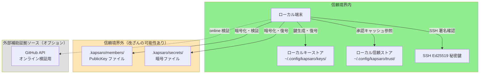
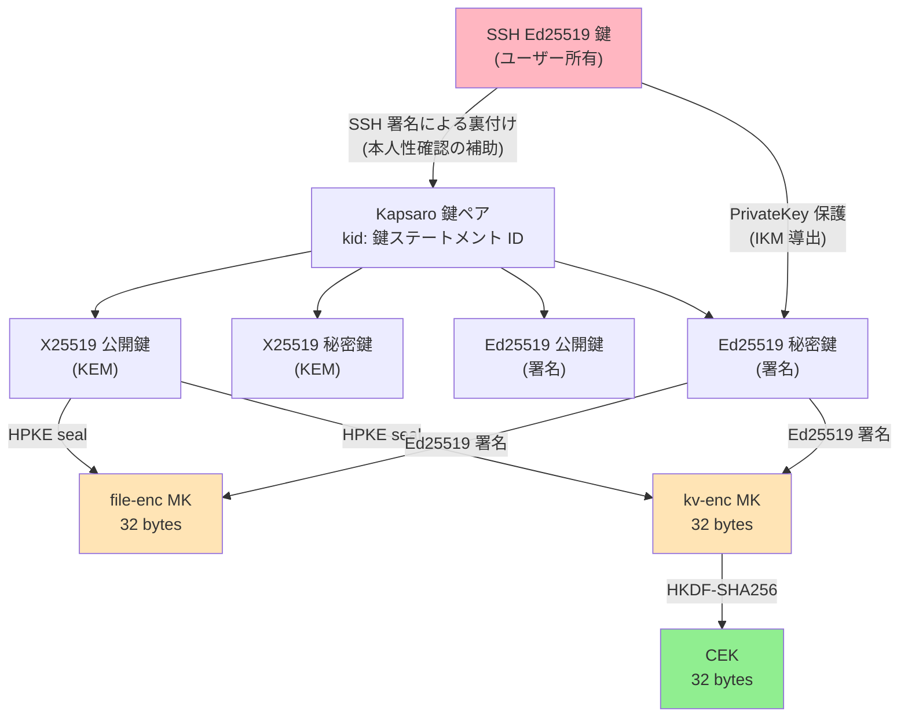
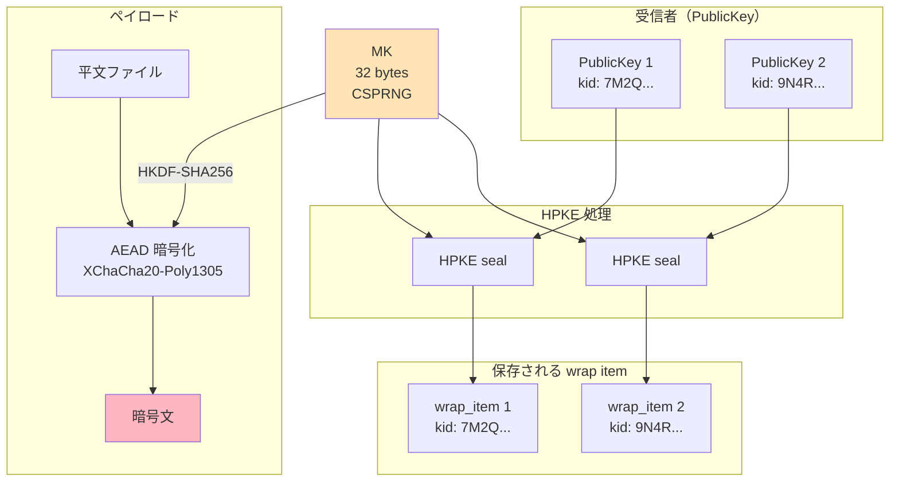
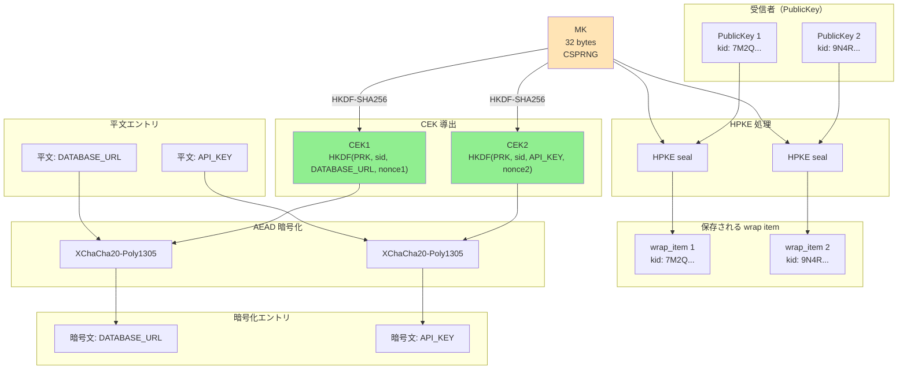
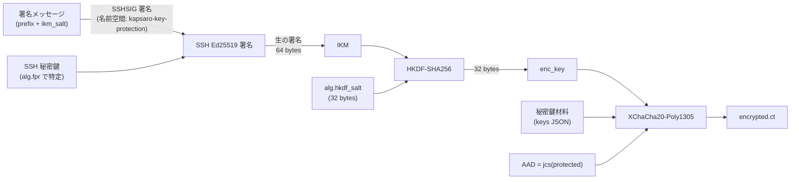
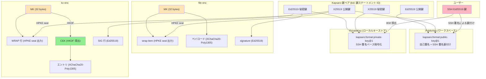

# Kapsaro セキュリティ設計

---

## 0. 文書情報

### 本書の位置づけ

本書は、Kapsaro のセキュリティ設計を整理し、その保護対象と前提条件を明確にするための文書である。Kapsaro が提示するセキュリティ主張、その成立条件、設計上の検証点、残余リスク、非目標を一貫した形で示すことを目的とする。

各節では、アルゴリズムやデータ構造の個別説明にとどまらず、どの設計判断がどのセキュリティ主張を支え、どこに運用前提や制約があるのかが読み取れるように記述する。

### 対象読者

本書は、主として 2 種類の読者を想定している。各読者は関心に応じて次のセクションに注目するとよい。


| 読者                  | 主要セクション                                                                                                     | 目的                              |
| ------------------- | ----------------------------------------------------------------------------------------------------------- | ------------------------------- |
| セキュリティ監査者 / レビュー担当者 | §1（主張と境界）、§2（脅威モデル）、§3（暗号プリミティブ）、§5（署名と検証アーキテクチャ）、§6〜§8（file-enc / kv-enc / 文脈束縛）、§11（攻撃シナリオ）、§12（確認ポイント） | セキュリティ主張、成立前提、残余リスク、レビュー観点を評価する |
| 利用者 / 運用責任者 / 導入判断者 | §1（主張と境界）、§2.1〜§2.4（脅威モデルと信頼境界）、§9.4〜§10（PrivateKey 保護と信頼ポリシー）、§13（制約事項）、付録 B（運用チェック）           | 自組織で安全に運用できる条件と、受け入れるべき制約を判断する  |


---

## 1. セキュリティ主張と境界

本章は、Kapsaro がどの問題意識から設計され、どの範囲をセキュリティ主張として扱うのかを整理する。最初に設計の出発点を示し、その後で保証するもの、運用前提に依存するもの、保証しないものを分けて明確にする。

以降の章では、ここで示す主張に対して、脅威モデル、信頼境界、暗号プリミティブ、署名検証、file-enc / kv-enc の具体構造、文脈束縛、信頼ポリシー、攻撃シナリオの順に根拠を示す。

### 1.1 設計の出発点

Kapsaro は、`.env`、証明書、API キーなどの秘密値を、チームが Git のレビューと履歴の中で扱えるようにするためのオフライン優先 CLI である。前提にある課題は、秘密値をチャットや手作業で配ると平文が残りやすく、誰がどの時点で読めたかを追いにくく、メンバー追加・削除や CI 用アクセスの変更が運用から漏れやすいことである。

一方で、Git リポジトリは暗号学的な信頼の起点にはならない。Git は複製、履歴管理、差分レビュー、メンバー変更の可視化には適しているが、書き込み権限を持つ開発メンバー、侵害された CI、不正な push 経路はリポジトリ内のファイルを書き換え得る。リポジトリの内容を額面どおりに信じる設計は、改ざん可能な領域を信頼の起点に据えてしまう。

Kapsaro の設計回答は、Git を配布媒体として使いながら、暗号学的な信頼をリポジトリ状態そのものに置かないことである。共有される秘密値は受信者ごとの鍵に向けて暗号化し、暗号ファイルは署名と文脈束縛により検証可能にする。各利用者の秘密鍵、ローカルキーストア、ローカル信頼ストア、SSH 署名能力はローカル信頼領域に置き、ワークスペース上のメンバー情報や暗号ファイルは検証して扱う入力とみなす。

この分離により、Kapsaro は「暗号ファイルが改ざんされていないか」「どの鍵で署名されたか」「現在のワークスペースで誰に復号を許可するか」「利用者がその鍵所有者を確認済みか」を別々の問いとして扱う。暗号学的に正しい署名は、現在の運用上そのファイルを受理してよいことまでは証明しない。この前提が、§2 の脅威モデルと信頼境界、§10 の信頼ポリシーの中心になる。

### 1.2 保証するもの

この設計上、Kapsaro が保証する範囲は次のとおりである。ここでいう保証は、実装が §1.5 の不変条件を維持し、§1.3 の運用前提が満たされる範囲で成立する。


| セキュリティ主張          | 主な仕組み                             | 成立前提                           | 残余リスク                                | 詳論               |
| ----------------- | --------------------------------- | ------------------------------ | ------------------------------------ | ---------------- |
| 機密性               | HPKE seal/open + XChaCha20-Poly1305 | 復号を許可されたメンバーの秘密鍵が漏洩していない       | 正当なメンバーによる持ち出しは防げない                  | §3, §6, §7       |
| 改ざん検知             | Ed25519 署名                        | 署名検証が必ず実行される                   | 署名者自身が悪意を持つ場合は防げない                   | §5               |
| 署名付きドキュメントの自己完結検証 | 署名者公開鍵の埋め込み + 公開鍵文書の検証            | すべての署名付きドキュメントに署名者公開鍵が埋め込まれている | 現在のメンバーであるかどうかは別途信頼ポリシーに依存する         | §5               |
| 鍵一貫性              | 公開鍵文書の自己署名                        | 元の秘密鍵が漏洩していない                  | 新規の悪意ある鍵作成は防げない                      | §5.5             |
| 現在有効な信頼状態の判定      | 現メンバー一覧 + ローカル承認キャッシュ             | リポジトリ運用統制と利用者承認が適切に機能する        | 初期受け入れ時の TOFU、リポジトリ侵害、誤承認に弱い         | §10              |
| 鍵の本人性補強           | SSH 署名による公開鍵の裏付け + 手動承認 + オンライン検証 | 手動承認が適切に行われる                   | 初回接触時 MITM 攻撃、GitHub / SSH 信頼基盤侵害に弱い | §2.4, §5.6, §5.7 |
| 文脈束縛              | 暗号ファイルを文脈（ファイル・鍵世代・エントリ・プロトコル）に束縛 | 実装が仕様どおりの束縛を維持する               | 束縛を削る実装変更で弱くなる                       | §8, §11          |
| 可搬な秘密鍵利用          | password export または SSH ベース保護     | 信頼できる CI 実行文脈でのみ使う             | 同じシークレット保存先にまとめて保存すると独立した防御にならない     | §9               |


### 1.3 運用前提に依存するもの

次の性質は Kapsaro の暗号構造だけでは完結せず、利用者または組織側の運用前提に依存する。


| 領域          | 依存する前提                                       |
| ----------- | -------------------------------------------- |
| 鍵の本人性判断     | TOFU 承認、リポジトリ外チャネルでの確認、必要に応じた GitHub オンライン検証 |
| 現メンバー一覧の正当性 | Git のアクセス制御、PR レビュー、保護ブランチ、変更管理              |
| ローカル信頼領域    | 端末、ローカルキーストア、ローカル信頼ストア、SSH 鍵または SSH 署名入力の保護  |
| CI 上の秘密鍵利用  | 信頼できる ref、メンテナー管理下の workflow、信頼できる runner    |
| ロールバック抑止    | 過去版の暗号ファイルを現在の HEAD に戻さないためのリポジトリ運用     |


### 1.4 保証しないもの

Kapsaro は次をセキュリティ主張に含めない。


| 非目標                     | 理由                                                     |
| ----------------------- | ------------------------------------------------------ |
| 復号後の内部者悪用防止             | 正当な受信者が得た平文の利用は暗号配布の外側にある                              |
| 過去開示の回収                 | かつて復号できた内容を暗号学的に取り戻すことはできない                            |
| 強い前方秘匿性                 | 受信者の長期秘密鍵が漏洩すると、その受信者向けの既存 wrap は復号可能になる               |
| TOFU を超える本人性確定          | 自己署名や SSH 署名による公開鍵の裏付けは鍵保持や SSH 鍵との対応を示すが、人物の本人性を証明しない |
| リポジトリレベルのロールバック完全検知     | 文脈束縛は暗号ファイル内の整合性を保証するが、Git 履歴上の最新性や単調進行は保証しない          |
| GitHub / SSH 信頼基盤侵害への耐性 | オンライン検証や手動確認の補助証拠自体が偽装され得る                             |


### 1.5 実装が維持すべき不変条件

上記のセキュリティ主張は、実装が次の不変条件を維持して初めて成立する。


| 不変条件                                                     | 崩れる主張                                |
| -------------------------------------------------------- | ------------------------------------ |
| 署名検証と鍵保持証明検証の前に平文復号しない                         | 改ざん検知、信頼ポリシー適用、未検証の入力を受理しない処理     |
| AAD、HPKE info、署名対象から文脈束縛要素を削らない                          | ペイロード / エントリ / wrap の入れ替え防止、鍵世代束縛 |
| file-enc / kv-enc の署名検証鍵は埋め込み署名者公開鍵（実装上は `signer_pub`）からのみ解決する      | 自己完結検証、実装間で一貫した受理条件                  |
| 現メンバー一覧（`members/active`）、鍵所有者承認キャッシュ（`known_keys`）、受信者集合承認キャッシュ（`recipient_sets`）の役割を混同しない | 現在の認可判定と利用者承認履歴の分離                   |
| 期限切れ鍵の復旧例外を復号と操作対象 artifact の署名検証に限定し、暗号化、署名生成、期限切れ PublicKey の承認には適用しない | 鍵の有効期限境界、ローカル承認キャッシュの意味 |
| `KAPSARO_STRICT_KEY_CHECKING=no` を明示指定の読み取り経路の承認キャッシュ判定に限定する | 書き込み経路の鍵承認、受信者集合確認、暗号学的検証の意味 |


### 1.6 用語の使い分け

本書で繰り返し用いる用語を以下に挙げる。実装上の対応箇所は本文の該当章で扱う。


| 用語          | 本書での意味                                                                                                          |
| ----------- | --------------------------------------------------------------------------------------------------------------- |
| 埋め込み署名者公開鍵  | 各署名付きドキュメントの中に同梱される署名検証用の公開鍵文書（実装上は `signature.signer_pub`、§5 参照）。これが署名検証鍵の唯一の出所であり、外部の鍵サーバや別ファイルからの代替探索は行わない   |
| 鍵一貫性        | 同じ秘密鍵保持者がその公開鍵文書を作成したことを示す性質。本人性そのものではない                                                                        |
| 鍵ステートメント ID  | Kapsaro 鍵ペアと公開鍵文書の世代を識別する ID（実装上は `kid`、§4.4.1 参照）。どの鍵で署名・復号・鍵配送するかを区別するために使う                             |
| 現メンバー一覧     | ワークスペース上で現在のメンバー集合・受信者集合の認可基準として扱うデータ（実装上は `members/active`、§10 参照）                                             |
| 新規申請メンバー    | ワークスペースに参加申請されたが、まだ昇格されていない候補（実装上は `members/incoming`、§10 参照）                                                   |
| ローカル承認キャッシュ | 利用者が過去に確認した鍵や、書き込み経路で確認した受信者集合を再確認なしで扱うためのローカルキャッシュ（実装上は `known_keys` と `recipient_sets`、§10.4 参照）             |
| 非メンバー例外受理   | 現メンバー一覧に存在しない署名者の暗号ファイルを、対話的 / 一回限り / ドキュメント単位で例外受理する仕組み                                                        |
| 本人性補強       | 鍵がどの人物・アカウントに紐付くかの判断材料を増やす運用層                                                                                   |
| 文脈束縛        | 暗号ファイルや暗号 KV ドキュメントを、それが属するファイル・鍵世代・エントリ・プロトコルといった文脈に暗号学的に結びつけ、コンポーネントの入れ替えや流用が成立しないようにする仕組み（個別の識別子と束縛点一覧は §8 参照） |
| 開示履歴        | メンバー除外後に外部システム側でのローテーションが必要になり得る秘密値を可視化するための履歴（実装上は `disclosed`、§7.7 参照）                                        |
| 信頼境界        | そのまま信用する領域と、改ざんを前提に検証して扱う領域の境界                                                                                  |
| 残余リスク       | 仕様どおり実装しても残るリスク、または運用前提を満たさない場合に残るリスク                                                                           |


---

## 2. 脅威モデルと信頼境界

Kapsaro の脅威モデルは、Git リポジトリを便利な配布媒体として使う一方で、その内容をそのまま信用しないという §1 の出発点から導かれる。守る対象は、秘密値の機密性、暗号ファイルの完全性、メンバーと鍵に関する判断、利用者ローカルの承認履歴である。

本章では、まずどの入力を攻撃者が操作できるとみなすかを示し、次にその前提の下で必要になる運用前提を整理する。そのうえで、ローカル端末側に置く信頼領域と、リポジトリ上で検証対象として扱う領域を分け、最後に暗号学的検証・現在の認可・利用者承認・本人性補助証拠の層を説明する。

### 2.1 攻撃者モデル

Kapsaro が暗号設計で対処する主な攻撃は、リポジトリ上のデータ、公開鍵の受け入れ、暗号ファイル内の部品、初回承認、ローカル承認履歴のいずれかを狙う。次の表は、攻撃者を「どの境界を操作できるか」という観点で整理したものである。リポジトリ運用統制やローカル信頼領域の保護を破る攻撃者は、§2.2 の運用前提を満たさないケースとして別途扱う。


| 攻撃者            | 能力                                                                             | 想定シナリオ                         |
| -------------- | ------------------------------------------------------------------------------ | ------------------------------ |
| リポジトリ改ざん者      | `.kapsaro/` 配下のファイルを任意に改ざん可能                                                 | 悪意ある CI、侵害された Git サーバ、不正な push |
| 公開鍵すり替え者       | 現メンバー一覧（`members/active/`）または新規申請メンバー（`members/incoming/`）の公開鍵文書を偽造したものに置き換え可能 | 新メンバー追加時の MITM、リポジトリへの不正コミット   |
| 鍵ローテーション攻撃者    | 古い鍵世代向けに作られた配布データを保持し、新しい鍵での復号を試行                                              | 鍵更新プロセスの不備を突く                  |
| コンテキスト混同攻撃者    | 異なる秘密の暗号文コンポーネントを入れ替え                                                          | 暗号ファイル間でのコピー & ペースト            |
| 初回接触時 MITM 攻撃者 | 初期受け入れ時点の鍵ステートメント情報・GitHub アカウント情報・確認に使う SSH 鍵の指紋を偽情報に差し替える                    | 初回 clone、初めて遭遇する署名者の承認            |
| ローカル信頼ストア改ざん者  | ローカル信頼ストア（`<KAPSARO_HOME>/trust/`）に書き込みまたはロールバックを行う                          | ローカル承認キャッシュの置換、承認履歴の巻き戻し       |


### 2.2 運用前提

Kapsaro の暗号構造だけで完結しない判断は、利用者または組織側の運用前提に依存する。ここで重要なのは、運用前提を暗号学的な信頼の起点と混同しないことである。Kapsaro は、改ざん可能な入力を検証し、検証結果を運用上の承認と組み合わせて扱う。

リポジトリ書き込み統制: 上記の脅威モデルは、リポジトリへの書き込みアクセスが適切に管理されていることを前提とする。主なターゲット環境である Git + GitHub 運用では、現メンバー一覧（`members/active/`）への変更は PR レビューを通じて検証される。現メンバー一覧は現在のメンバー集合 / 現在の受信者集合の認可の基準情報だが、暗号学的な信頼の起点ではない。

リポジトリレベルのロールバック: Git を配布媒体として使う以上、リポジトリの正規利用者が過去のコミットから古い暗号ファイルを取得できること自体は避けられない。したがって、書き込み権限を持つ攻撃者または内部者が、過去に正当だった暗号ファイルを現在の HEAD に戻す変更をコミットするリポジトリレベルのロールバックは、Kapsaro の文脈束縛だけでは検知・防止できない。文脈束縛が保証するのは暗号ファイルの整合性と文脈整合であり、Git 履歴に対する最新性や単調な進行ではないためである。

読み取り経路の信頼確認は最新性を保証する仕組みではなく、「この暗号ファイルが誰に共有されているか」を暗号ファイル単位のポリシーとして確認する処理でもない。読み取り経路で確認するのは、署名者と現在の `members/active` に解決できる暗号ファイルの受信者の鍵所有者である。過去版の暗号ファイルに過去の受信者が含まれていても読み取りは継続でき、解決できない受信者 `kid` は警告として表示される。書き込み経路ではより厳格に扱い、現在の `members/active` に解決できない受信者 `kid` を含む入力ファイルは、保存前に rewrap して現在の受信者集合へ正規化する必要がある。

この種のリスクは、Kapsaro の暗号設計だけで完全には検知・防止できない。Kapsaro は、保護ブランチ、必須レビュー、変更管理、デプロイ前確認などのリポジトリ運用により、過去版の暗号ファイルが現在の HEAD に昇格されないことを前提とする。

ローカル信頼領域の保護: 利用者端末、ローカルキーストア、ローカル信頼ストア（`<KAPSARO_HOME>/trust/`）、SSH 鍵または SSH 署名入力は、利用者の管理下で保護されていることを前提とする。ローカル信頼ストアの署名は整合性確認・破損検知・フォーマット検証のために用いられるが、この領域に対する整合的な置換やロールバックまでは防がない。

TOFU による初期受け入れの限界: 初回受け入れや初めて遭遇する鍵の承認は TOFU に依存する。したがって、初回接触時 MITM 攻撃やワークスペース全体すり替えを暗号学的に排除することは本モデルの対象外である。Kapsaro 自体の暗号設計と、配布媒体・レビュー運用・リポジトリ外チャネルによる確認は分けて評価する必要がある。

### 2.3 信頼境界




信頼する要素:

- ローカル端末とローカルキーストア（`~/.config/kapsaro/keys/`）
- ローカル信頼ストア（`~/.config/kapsaro/trust/`）。ただし現在有効な信頼状態の権威ではなく、利用者ローカルの承認キャッシュを保持する
- ユーザーの SSH Ed25519 秘密鍵

外部の補助証拠ソース:

- GitHub API（オンライン検証時に参照する、本人性判断の補助証拠ソース）

信頼しない要素:

- ワークスペース上の現メンバー一覧（`members/active/`）および新規申請メンバー（`members/incoming/`）— リポジトリ上の非信頼データ。各公開鍵文書は自己署名と SSH 署名による公開鍵の裏付けで検証し、現在のメンバー集合 / 現在の受信者集合の権威として使うかどうかはリポジトリ運用統制に依存する
- ワークスペースの `secrets/` ディレクトリ — 署名で検証

この信頼境界の中で、SSH 秘密鍵は 2 つの役割を担う。ひとつは Kapsaro 公開鍵がどの SSH 鍵で裏付けられたものかを示すこと、もうひとつはローカルキーストア上の PrivateKey ファイル（`private.json`）の暗号文を保護する対称鍵を、復号のたびに SSH 署名から導出することである（各役割の詳細は §9.2）。

Kapsaro 鍵を復号するには、ローカルキーストアで対象の `private.json` に到達できることと、その内容に基づく署名対象に対して SSH 署名を実行できることの両方が必要である。端末侵害や `private.json` と SSH 署名能力の同時取得は、§9.4 の信頼仮定で整理する。

### 2.4 信頼モデルの概観

Kapsaro の信頼モデルは、暗号学的検証・現在のメンバーシップ判定・利用者承認を意図的に分離している。単一の機構で「この鍵が誰のもので、現在も受理すべきか」を決めるのではなく、以下の 4 つの層を順に重ねる。

本節では概念上の役割だけを示す。読み取り経路 / 書き込み経路での適用条件、例外受理、`KAPSARO_STRICT_KEY_CHECKING` の効果は §10 で扱う。


| 層                 | 仕組み                   | 確立するもの                 | 確立しないもの              |
| ----------------- | --------------------- | ---------------------- | -------------------- |
| 1. 暗号学的検証         | 埋め込み署名者公開鍵 + 公開鍵文書の検証 | 署名付きドキュメントと署名鍵の暗号学的真正性 | 鍵保持者の本人性             |
| 2. 認可             | 現メンバー一覧               | 現在のメンバー集合 / 現在の受信者集合   | 暗号学的信頼（リポジトリ運用統制に依存） |
| 3. 承認キャッシュ        | ローカル承認キャッシュ           | 過去に確認済みの鍵と、書き込み経路で確認済みの受信者集合 | 現在のメンバーであること         |
| 4. 手動承認 + オンライン検証 | TOFU 承認、GitHub API    | 本人性判断の補助証拠             | 暗号学的な本人性の証明          |


層1では、署名付きドキュメントに埋め込まれた `signer_pub` から署名検証鍵を取得し、公開鍵文書の自己署名、SSH 署名による公開鍵の裏付け、鍵世代の一致、有効期限を検証する。ここで確立するのは「どの鍵ステートメントで署名されたか」という暗号学的真正性であり、鍵保持者の本人性ではない。

層2では、ワークスペースの `members/active` を現在のメンバー集合 / 現在の受信者集合の認可基準として使う。この一覧は署名検証鍵の探索元ではなく、リポジトリ運用統制により維持される非信頼データである。

層3では、ローカル信頼ストアの `known_keys[]` と `recipient_sets[]` を利用者ごとの承認キャッシュとして使う。`known_keys[]` は利用者が確認した鍵所有者を記録する。`recipient_sets[]` は書き込み経路で確認した出力ファイルの受信者集合を記録する。いずれも現在有効な信頼状態の権威ではない。

層4では、未確認の鍵について、鍵ステートメント情報、確認に使う SSH 鍵の指紋、必要に応じた GitHub アカウント情報を利用者が確認する。これは TOFU に基づく本人性判断の補助証拠であり、暗号学的な本人性証明ではない。

オンライン検証は、公開鍵の裏付けに使われた SSH 公開鍵が検証時点で GitHub アカウントの現在の SSH 公開鍵集合に含まれるかを確認する現在性チェックである。履歴証明や既存承認の自動失効ではないため、オンライン検証の失敗は将来の承認を止める補助情報として扱い、既存の承認記録削除やメンバー除外は別途行う。

限定例外として、非メンバー例外受理、期限切れ鍵の復旧例外、`KAPSARO_STRICT_KEY_CHECKING=no` がある。非メンバー例外受理は現メンバー一覧に存在しない署名者の暗号ファイルを対話的 / 一回限り / ドキュメント単位で受理する例外であり、署名者を現在のメンバーに戻さず、ローカル承認キャッシュも更新しない。期限切れ鍵の復旧例外は復号と操作対象 artifact の署名検証だけを対象にする。暗号化、署名生成、`member verify --approve` による期限切れ PublicKey の承認には適用しない。`KAPSARO_STRICT_KEY_CHECKING=no` は、利用者が明示指定した読み取り経路で鍵所有者承認確認のみを省略する設定であり、現メンバー一覧の確認、受信者ハンドルの整合性、暗号学的署名検証、鍵保持証明検証、有効期限ゲートは省略しない。

鍵の本人性判断を補強するには、上記の層が適切に機能することが望ましい。ただし、攻撃シナリオによって弱くなる条件は異なる。

- 既存鍵の改ざんは、自己署名または SSH 署名による公開鍵の裏付けを破る必要があり、通常は元の秘密鍵素材の漏洩が必要になる
- 新規鍵挿入は、リポジトリ運用統制の破綻に加え、利用者が TOFU 承認で誤受理すると成立し得る。攻撃者は自分の鍵で有効な自己署名と SSH 署名による公開鍵の裏付けを生成できるため、被害者の秘密鍵漏洩は不要である
- 確認用 SSH 秘密鍵のみが漏洩すると、GitHub アカウントが健全でも、正規の確認情報を持つ不正鍵を作れてしまう
- GitHub / SSH 信頼基盤が侵害されると、オンライン検証や手動確認に表示される GitHub 情報自体が偽装され得る
- ローカル信頼領域が破られると、ローカル承認キャッシュの整合的な置換やロールバックを完全には防げない

---

## 3. 共通暗号基盤

本章は、機密性と完全性を支える標準暗号プリミティブの選定理由と、各プリミティブが標準仕様から継承する安全性・限界を整理する。選定基準は、IETF 標準への準拠、誤用しにくい構造、SSH エコシステム（ssh-ed25519、SSHSIG）との親和性である。具体的な用途は §3.1 の一覧を参照。

### 3.1 アルゴリズム一覧


| アルゴリズム                     | パラメータ                               | RFC                          | 用途                                                                             |
| -------------------------- | ----------------------------------- | ---------------------------- | ------------------------------------------------------------------------------ |
| HPKE Base mode             | suite `hpke-32-1-3`                 | RFC 9180                     | コンテンツ鍵の seal/open                                                         |
| DHKEM(X25519, HKDF-SHA256) | kem_id=32 (0x0020)                  | RFC 9180                     | KEM（鍵カプセル化）                                                                    |
| HKDF-SHA256                | kdf_id=1（HPKE suite 内）; アプリ用途は §3.5 | RFC 5869                     | HPKE 内部 KDF、kv-enc の CEK 導出、PrivateKey の enc_key 導出（Argon2id 出力からの派生を含む; §9.3） |
| ChaCha20-Poly1305          | aead_id=3 (0x0003)                  | RFC 8439                     | HPKE 内部 AEAD                                                                   |
| XChaCha20-Poly1305         | nonce 24 bytes, key 32 bytes        | draft-irtf-cfrg-xchacha（§14） | ペイロード / エントリ / PrivateKey 暗号化                                               |
| Ed25519 (PureEdDSA)        | —                                   | RFC 8032                     | 署名・検証                                                                          |
| JCS                        | —                                   | RFC 8785                     | JSON の決定的正規化                                                                   |
| base64url (no padding)     | —                                   | RFC 4648 §5                  | バイナリエンコード                                                                      |


### 3.2 HPKE (RFC 9180)

選択理由:

- 標準化されたハイブリッド公開鍵暗号化スキームであり、KEM + KDF + AEAD の組み合わせが一貫して定義されている
- Base mode では各 wrap で一時的なカプセル化を行う（wrap ごとのエフェメラル性の解釈と限界は §13.2 と併読すること）。受信者の長期秘密鍵漏洩時は、その受信者向けの既存 wrap が復号可能になる点も §13.2 を参照
- IANA Registry による suite ID の明確な識別

suite 構成:

```
hpke-32-1-3
├── kem_id  = 32 (0x0020) DHKEM(X25519, HKDF-SHA256)
├── kdf_id  = 1  (0x0001) HKDF-SHA256
└── aead_id = 3  (0x0003) ChaCha20-Poly1305
```

代替案との比較:


| 代替案                     | 不採用理由                                                                                                |
| ----------------------- | ---------------------------------------------------------------------------------------------------- |
| RSA-OAEP                | 鍵サイズ・暗号文オーバーヘッドが大きく、DHKEM + HKDF + AEAD の標準構成としての HPKE に比べて wrap 文脈（info/AAD）との一貫した結合を取りにくい |
| ECIES (自作構成)            | 標準化されておらず、構成ミスのリスクが高い                                                                                |
| Age (X25519-ChaChaPoly) | HPKE ほど仕様上の整理が進んでおらず、info/AAD の柔軟性が不足                                                                |


既知の制約:

- Base mode は送信者認証を提供しない（署名で補完）
- X25519 は 128-bit セキュリティレベル

### 3.3 XChaCha20-Poly1305

file-enc のペイロード、kv-enc のエントリ、PrivateKey 保護の暗号文における機密性と改ざん検知を担う AEAD である（§6.5、§7.4、§9.2）。

選択理由:

- 24-byte nonce により、ランダム nonce の衝突リスクが実用上無視できる（誕生日境界が 2^96）
- AES-NI 非搭載環境でも一定のパフォーマンスを発揮
- 誤用耐性は提供しないが、nonce 空間の広さで実質的な安全性を確保

代替案との比較:


| 代替案             | 不採用理由                                        |
| --------------- | -------------------------------------------- |
| AES-256-GCM     | 12-byte nonce では複数鍵使用時に衝突リスクが高い      |
| AES-256-GCM-SIV | nonce 誤用耐性は魅力的だが、実装の複雑さと普及度を考慮 |


既知の制約（プリミティブ仕様レベル）:

- 同一鍵に対する nonce 再利用は壊滅的である（AEAD としての前提）。Kapsaro がこの前提を設計上どう満たすかは §3.8 を参照
- ペイロードの圧縮は禁止（圧縮オラクル攻撃 CRIME/BREACH の回避）

### 3.4 Ed25519 (RFC 8032 PureEdDSA)

暗号ファイル・kv-enc 文書・PublicKey 文書などへの改ざん検知と、埋め込み署名者公開鍵による自己完結型の署名検証を支える（§5）。

選択理由:

- 決定論的署名: 同一入力に対して常に同一の署名を生成。PrivateKey 保護で IKM として署名を使用するため必須の性質
- 高速な署名・検証
- SSH エコシステムとの親和性（ssh-ed25519）

代替案との比較:


| 代替案           | 不採用理由                                        |
| ------------- | -------------------------------------------- |
| ECDSA (P-256) | 非決定論的署名（RFC 6979 で緩和可能だが、SSH 実装での扱いにばらつきがある） |
| Ed448         | SSH エコシステムでの普及が不十分                           |


既知の制約:

- 128-bit セキュリティレベル
- コンテキスト分離は PureEdDSA 自体では提供されない（JCS 正規化 + プロトコル識別子で対応）

### 3.5 HKDF-SHA256 (RFC 5869)

`info` / `salt` により用途別の対称鍵を分離し、ファイル識別子（`sid`）、鍵ステートメント ID（`kid`）、プロトコル識別子（`p`）などの文脈識別子を鍵スケジュールに取り込む（§8.2、§7.3、§9.2.1、§9.3.2）。

選択理由:

- 標準化された鍵導出関数
- `info` パラメータにより、同一 IKM から用途別の鍵を安全に導出可能
- `salt` パラメータにより、同一 IKM・同一 info でも異なる鍵を導出可能

用途:

- HPKE suite 内部の KDF（§3.2）
- kv-enc の CEK 導出（MK と `sid` から得た artifact PRK、entry nonce、KEY 行の先頭トークン `k` → CEK）
- PrivateKey 保護の enc_key 導出（SSH 署名または Argon2id 出力を IKM とし salt + 鍵ステートメント ID `kid` + info → enc_key; §9.2、§9.3）

### 3.6 JCS (RFC 8785)

JSON オブジェクトを決定論的にバイト列へ変換することで、署名対象・認証付き追加データ・HPKE info の入力が実装間で揺れない前提を作る（§8 全体）。

選択理由:

- JSON オブジェクトの決定論的正規化を提供する
- 鍵の順序や数値表現の揺れを排除し、署名・AAD・HPKE info の一貫性を保ちやすくする
- ファイル識別子 `sid` 等の文字列フィールドに任意の文字が含まれても、正規化後のバイト列として曖昧性が発生しない

使用箇所の例:

- file-enc: `protected` 全体および `payload.protected` の署名・AAD 構築（§5.2、§6.4、§6.5）
- kv-enc: トークン JSON の正規化と canonical_bytes の前提（§7.1）
- PublicKey / PrivateKey: `protected` の表現と鍵ステートメント ID（`kid`）導出の入力（§4.4.1、§9.2）
- file-enc / kv-enc の HPKE seal/open: `info` と AAD に同一の正規化済み文脈 bytes を用いる（§8.3）

既知の制約:

- JCS は JSON の構文レベルの正規化であり、フィールド値の意味的妥当性（例: 期限、`kid` と素材の対応）は別途スキーマ検証や暗号検証で確認する必要がある

### 3.7 標準暗号プリミティブに依拠する安全性と限界


| プリミティブ                    | 前提とする安全性                                  | Kapsaro における含意                                                                         |
| ------------------------- | ----------------------------------------- | ---------------------------------------------------------------------------------------- |
| HPKE Base mode (RFC 9180) | 受信者公開鍵に対する鍵配送の機密性を提供するが、送信者認証は提供しない       | 受信者ごとの wrap の機密性はこれに依拠する一方、作成者の真正性や内部者攻撃への対策は Ed25519 署名に依存する                            |
| XChaCha20-Poly1305        | nonce を再利用しない限り、機密性と改ざん検知を提供する AEAD である   | プリミティブ仕様として同一鍵での nonce 再利用に耐えない（§3.3）。Kapsaro は現行設計で §3.8 に述べるとおり nonce 一意性を構造的に満たす |
| Ed25519 (PureEdDSA)       | 署名秘密鍵が保護されている限り、署名の偽造困難性と改ざん検知を提供する       | 暗号ファイルや PublicKey 文書の真正性確認はこれに依拠し、秘密鍵漏洩時にはこの保証は崩れる                                       |
| HKDF-SHA256               | 十分なエントロピーを持つ IKM から、擬似ランダムで用途分離された鍵を導出できる | CEK や enc_key の鍵分離はこれに依拠するが、低エントロピーな IKM を高エントロピー化するものではない                               |


安全性の依存関係:

全体の機密性は HPKE の機密性と AEAD の機密性の両方に依存し、改ざん検知は Ed25519 署名に依存する（HPKE Base mode は送信者認証を提供しないため）。kv-enc のエントリ間の暗号学的独立性は HKDF-SHA256 の PRF 安全性に依存する。

### 3.8 nonce 安全性マージン

§3.3 で述べた AEAD の前提（同一鍵での nonce 一意性）に対し、Kapsaro は鍵素材のライフサイクル側で次を満たす。

XChaCha20-Poly1305 は 24-byte (192-bit) nonce を使用する。Kapsaro の設計では、同一の対称鍵で複数回の暗号化を行うケースが存在しない。MK（file-enc）・CEK（kv-enc エントリ）・enc_key（PrivateKey 保護）はそれぞれ暗号化ごとに一意に生成または導出されるため、nonce 衝突のリスクは構造的に排除されている。

192-bit nonce 空間の選択は、将来の設計変更で同一鍵の再利用が発生した場合の安全弁として機能する。

### 3.9 暗号強度 (セキュリティレベル)

§3.7 は各プリミティブが提供する機能的な保証と Kapsaro における依存関係を整理した。本節は、それらを数値化した古典コンピュータ上の推定セキュリティレベル（ビット相当）に焦点を当て、システム全体の「最弱環」がどこになるかを示す。

各暗号プリミティブが提供する推定暗号強度（セキュリティレベル）は以下の通りである。


| 暗号プリミティブ           | 鍵サイズ / パラメータ | 推定暗号強度 (古典コンピュータ) | 備考                         |
| ------------------ | ------------ | ----------------- | -------------------------- |
| X25519 (KEM)       | 256 bits     | 128 bits          | 楕円曲線離散対数問題 (ECDLP) に対する安全性 |
| Ed25519 (署名)       | 256 bits     | 128 bits          | 楕円曲線離散対数問題 (ECDLP) に対する安全性 |
| XChaCha20-Poly1305 | Key 256 bits | 256 bits          | 対称鍵暗号としての強度                |
| ChaCha20-Poly1305  | Key 256 bits | 256 bits          | HPKE 内部の AEAD              |
| HKDF-SHA256        | 出力 256 bits  | 256 bits          | ハッシュ関数の原像計算困難性等に基づく        |


システム全体の暗号強度:

システム全体の安全性は、連鎖する暗号プリミティブのうち最も強度が低いものに制約される（最弱環の原則）。
Kapsaro では、データの機密性（HPKE X25519）および真正性（Ed25519）の基盤となる非対称暗号の強度が 128 bit であるため、システム全体として提供される暗号強度は 128 bit 相当となる。

---

## 4. 鍵階層と鍵ライフサイクル

本章は鍵素材を種類・役割・ライフサイクルの観点で整理する。`kid` は自己完結検証の起点であり文脈束縛の中核識別子である（§8）。各プロトコルでの使われ方の詳細は §6、§7、§9 に譲る。

### 4.1 鍵の種類と関係


| 鍵カテゴリ                           | 所有・出所                           | 寿命                         | 主用途                                        | 関連節                |
| ------------------------------- | ------------------------------- | -------------------------- | ------------------------------------------ | ------------------ |
| SSH Ed25519 鍵                   | ユーザー所有（Kapsaro 外）             | 長期                         | 公開鍵の SSH 署名裏付け、PrivateKey 保護（`enc_key` 導出） | §5.6, §9.2         |
| Kapsaro 鍵ペア（X25519 + Ed25519） | `key new` で生成、`kid` 単位で世代管理     | 長期（`expires_at` まで active） | HPKE seal/open、Ed25519 署名・検証             | §5, §6, §7         |
| MK / CEK / enc_key              | 暗号化操作ごとに CSPRNG または HKDF で生成・導出 | 短期（当該操作・セッション内）            | file-enc / kv-enc のペイロード、PrivateKey AEAD   | §6.3, §7.3, §9.2.1 |





SSH 鍵と Kapsaro 鍵ペアの関係と SSH 鍵の 2 つの役割（裏付けと PrivateKey 保護）は §9.1.1 で詳述する。MK・CEK の消費経路の詳細は §6・§7 に譲る。

### 4.2 鍵パラメータ一覧


| 鍵の種類                         | サイズ      | 生成方法            | 用途                           | 文脈束縛への寄与                                                                                  | ゼロ化要否      |
| ---------------------------- | -------- | --------------- | ---------------------------- | ----------------------------------------------------------------------------------------- | ---------- |
| SSH Ed25519 秘密鍵              | 32 bytes | ユーザーが管理         | 公開鍵の SSH 署名裏付け、PrivateKey 保護 | 直接の束縛入力ではない（公開鍵の裏付け・§9.2 の AAD が鍵ステートメント ID `kid` と接続）                                    | N/A（OS 管理） |
| X25519 秘密鍵 (KEM)             | 32 bytes | CSPRNG          | HPKE open                    | 鍵ステートメント ID `kid` を定める PublicKey 素材の一部（§8 の `kid` 束縛）                                     | MUST       |
| X25519 公開鍵 (KEM)             | 32 bytes | X25519 秘密鍵から導出  | HPKE seal                    | 同上                                                                                        | —          |
| Ed25519 秘密鍵 (署名)             | 32 bytes | CSPRNG          | 署名生成                         | 同上（署名鍵は暗号ファイルの `kid` と対応）                                                                 | MUST       |
| Ed25519 公開鍵 (署名)             | 32 bytes | Ed25519 秘密鍵から導出 | 署名検証                         | 同上                                                                                        | —          |
| MK (Master Key, file-enc)    | 32 bytes | CSPRNG          | file-enc ペイロード暗号化         | ファイル識別子 `sid` 等を含むペイロードヘッダの AAD によりファイル文脈に束縛（§6.5）                                    | MUST       |
| MK (Master Key, kv-enc)      | 32 bytes | CSPRNG          | kv-enc の CEK 導出元             | wrap の鍵ステートメント ID `kid` / ファイル識別子 `sid` / プロトコル識別子 `p`（§7.5）と CEK 導出のファイル識別子 `sid` / KEY 行の先頭トークン `k` / entry nonce（§7.3） | MUST       |
| CEK (Content Encryption Key) | 32 bytes | HKDF-SHA256 導出  | kv-enc エントリ暗号化             | HKDF のファイル識別子 `sid` / KV エントリ名 `k` / entry nonce とエントリ AAD の KV エントリ名 `k` / ファイル識別子 `sid` / プロトコル識別子 `p`（§7.3, §7.4） | MUST       |
| enc_key (PrivateKey 保護用)     | 32 bytes | HKDF-SHA256 導出  | PrivateKey AEAD 暗号化          | AAD = `jcs(protected)` により当該鍵ステートメント ID `kid` のヘッダと暗号文を結合（§9.2.1）                         | MUST       |


補足:

- `enc_key` は保存済みの固定鍵ではなく、SSH 署名出力からその都度導出される一時的な対称鍵である
- 同じ SSH 鍵を使って複数の Kapsaro 鍵ステートメントを保護できるが、`kid` と `salt` が異なれば導出される `enc_key` も異なる
- 表の「ゼロ化要否」列の MUST は、対称鍵素材・署名秘密鍵について設計上必須の方針（実装は使用後にゼロ化を試みる）を示す。プロセスメモリからの完全消去は §12.3 のとおり保証しない。

### 4.3 受信者の資格

暗号化・復号における「受信者になれるか」は、暗号学的な本人性の証明ではなく、現在のワークスペースで誰に復号を許可するかという認可の問題である。§2.4 で層として分離したとおり、`members/active/` はその認可の基準情報であり、§10.3 の書き込み経路では受信者集合を常に現メンバー一覧から導出する。

暗号化操作の受信者になれるのは `members/active/` に記載されたメンバーのみである。`members/incoming/` の候補は §2.1 のとおりリポジトリ上の非信頼データであり、active に昇格するまでは既存の暗号ファイルを復号できるメンバーに含まれない。したがって `rewrap` で incoming を active に昇格させ、wrap を更新するまで、当該メンバーは既存の秘密を復号できない。incoming の昇格は受信者追加に相当し、§7.8 のとおり file-enc・kv-enc いずれもコンテンツ鍵（MK）を維持したまま wrap エントリを追加する。対照的に、メンバー除外（受信者削除）時には両形式で MK を再生成し、file-enc はペイロード全体を、kv-enc は全エントリを再暗号化する（§7.8）。いずれの場合も「メンバーとして認められた」ことと「鍵が誰のものかの本人性」は別層であり、後者は TOFU・オンライン検証など §2.4 層4 の運用に依存する。

### 4.4 鍵ライフサイクル

Kapsaro の鍵ペアは、生成から期限切れ、そして新しい鍵へのローテーションというライフサイクルをたどる。

```
生成 → active → expired
         │
         └── rotate (新しい鍵ペアを生成して切り替え)
```

各状態における扱いは以下の通りである。

- 生成: `key new` コマンドで新しい鍵ペアと PublicKey 文書を生成し、ローカルキーストアに保存する。
- active: `expires_at` が到来していない有効な状態。新たな暗号化（wrap）や署名の生成、および復号・検証に利用できる。
- expired: `expires_at` を過ぎた状態。新たな暗号化（wrap）や署名の生成は拒否される。過去に正当に署名・暗号化されたデータの復号や、操作対象 artifact の署名検証は、明示的な復旧設定がある場合だけ警告付きで許可される。
- rotate: `rewrap --rotate-key` などにより、新しい鍵ペア（新しい `kid`）を生成して active な鍵を切り替える。古い鍵素材は、自然に `expires_at` を迎えるまで、または運用で破棄するまで、過去の暗号ファイルの復号・検証用にローカルキーストアに保持される。

active 状態は「その鍵世代で新規の暗号操作が許されるか」を表す。暗号ファイルを受理してよいかは別問題であり、埋め込み `signer_pub` の暗号学的検証と §10 の信頼ポリシー（`members/active`、`known_keys` 等）は、この状態ラベルに直交する。

expired 後も、当該鍵で過去に作成された暗号ファイルの暗号学的整合性や文脈束縛が自動的に失効するわけではない。期限は「これ以降の新規 wrap・新規署名を拒否する」ための運用境界であり、復号や操作対象 artifact の署名検証に期限切れ鍵を使う場合も、`--allow-expired-key`、`KAPSARO_ALLOW_EXPIRED_KEY=yes`、または `allow_expired_key="yes"` による明示的な復旧設定が必要である。漏洩後の過去暗号文への被害限定は §13.2 で述べるとおり `--rotate-key` 等の別措置の対象である。

rotate により新しい `kid` が運用上の現行鍵となり、ワークスペースの `members/active` に載せる公開鍵も新世代に切り替わる（手順の詳細はユーザーガイドおよび `rewrap` の挙動に従う）。古い `kid` の `private.json` をローカルキーストアから削除すると、当該世代向け wrap の HPKE open や過去の暗号ファイルの復号ができなくなる（キーストア構造は §9.1.2）。

Kapsaro は鍵や証明書の CRL に相当する暗号学的失効リストを持たない。鍵を運用上「もう信頼しない」とするには、現メンバー一覧の更新、暗号ファイルの再暗号化、`known_keys` の手動見直し（§13.4）など、リポジトリとローカル信頼ストアの双方での運用対応が必要になる。

#### 4.4.1 鍵ステートメント ID（kid）の不変性

各鍵ペアには `kid`（鍵ステートメント ID）が対応付けられる。`kid` はハイフンなし 32 文字の Crockford Base32 である。導出は、JSON に格納される `PublicKey.protected` から `kid` フィールドを除いたオブジェクト（`protected_without_kid`）を JCS（§3.6）でバイト列に正規化し、そのバイト列に対する SHA-256 ダイジェストの先頭 20 バイトを、パディングなしの Crockford Base32 で 32 文字に符号化したものである。記号で書けば `kid = Encode_CrockfordBase32(SHA256(jcs(protected_without_kid))[0..20])` である。格納時の `protected.kid` はこの再導出結果と一致していなければならない。

Crockford Base32 は I/L/O/U など視覚的に紛らわしい文字を避けたアルファベットを用いるため、人手での転記ミスを抑え、URL や JSON 中でハイフンなしのまま扱いやすい。

`kid` は §8 で HPKE seal/open の `info` / AAD、署名対象、および CEK 導出などに繰り返し現れる文脈束縛の中核識別子である。PublicKey 文書の意味のある内容（公開鍵素材、SSH 署名裏付け、`binding_claims`、`expires_at` 等）が変われば別の `kid` となり、古い wrap や署名文脈への流用が暗号学的に成立しなくなる。

`kid` は PublicKey の内容から導出されるため、同一 `kid` の一致は、導出入力となる protected 内容の一致（同一鍵ステートメント）を意味する。いずれかのフィールドが変化すれば異なる `kid` を持つ別世代として扱われる。

### 4.5 鍵ローテーション

鍵ローテーションは主に `rewrap` コマンドで行う。主な契機は、受信者集合の変更（追加・削除）、`expires_at` の接近に伴う新世代への移行、鍵漏洩の疑いに対する被害限定（§13.2）などである。

file-enc はファイル単位の MK、kv-enc はファイル単位の MK とエントリごとの CEK という二層構造（§7.2）である。受信者追加では両形式とも既存コンテンツ鍵を維持して wrap を追加する。受信者削除では file-enc は MK を再生成してペイロード全体を再暗号化し、kv-enc は MK を再生成して全エントリを再暗号化する（§7.7, §7.8）。`--rotate-key` もコンテンツ鍵（MK）自体を再生成しペイロード全体を再暗号化する。いずれもプロトコル上の詳細は §7.8 に譲る。

`--rotate-key` は、漏洩後に将来の暗号ファイルへの被害拡大を抑える措置であり、§13.2 のとおり過去に配布済みの暗号文の機密性を「取り戻す」機構ではない。新しい `kid` を active として運用しつつ、古い `kid` は expired またはローカル保持のまま、過去の暗号ファイルの検証・復号に必要な期間だけ残す、という時間軸の整理が §4.4 と整合する。

---

## 5. 署名と検証アーキテクチャ

本章は `signature_v4` 形式と、埋め込み公開鍵の妥当性を支える検証連鎖（自己署名・SSH 署名による公開鍵の裏付け・オンライン検証）を整理する。

暗号ファイルを現在のワークスペースで受理するかどうかの運用ポリシーは §10 で扱う。

### 5.0 signature_v4 共通形式

file-enc と kv-enc の署名は、同一の `signature_v4` 構造（実装上は `ArtifactSignature`）を用いる。要点は次のとおりである。

- 署名者の PublicKey（`signer_pub`）を埋め込み、署名検証鍵の出所を暗号ファイル内に閉じる
- `kid` により、どの鍵ステートメントで署名されたかを明示する
- `mac` により、署名対象の artifact body、署名者 `kid`、HPKE open 後のコンテンツ鍵が対応することを後続の検証で確認できるようにする
- 署名者鍵の妥当性確認と暗号ファイル本体の署名検証を一続きの検証連鎖として扱う（§5.4）

ローカル信頼ストア（`kapsaro:format:local-trust@1`）の `signature` は、`alg` / `kid` / `sig` の表現を共有するが、埋め込み `signer_pub` は持たない。検証方法の例外は §5.4 末尾および §10.4 で扱う。

`signature_v4` の主要フィールドは次のとおりである。


| フィールド        | 型・表現                    | 内容                            | セキュリティ上の役割                                    |
| ------------ | ----------------------- | ----------------------------- | --------------------------------------------- |
| `alg`        | 文字列                     | 常に `eddsa-ed25519`（PureEdDSA） | 署名アルゴリズムの一意な識別                                |
| `kid`        | Crockford Base32（32 文字） | 署名者の鍵ステートメント ID               | 署名対象の文脈と `signer_pub` の世代を対応付ける（§4.4.1, §8）   |
| `signer_pub` | `PublicKey` 文書        | 埋め込み署名者公開鍵                    | 署名検証鍵の唯一の出所。自己署名と SSH 署名による公開鍵の裏付けをこの文書上で検証する |
| `mac`        | `hmac-sha256:<base64url>` | 鍵保持証明             | artifact body、署名者 `kid`、HPKE open 後の MK から派生した MAC key の対応を検証するための HMAC |
| `sig`        | base64url（パディングなし）      | Ed25519 署名値                   | 暗号ファイルの改ざん検知。署名対象は署名用 domain、`alg` / `kid` から導出した署名 header、形式ごとの body bytes、`mac` を length-framed した bytes である |


`signer_pub` が欠落した file-enc / kv-enc は拒否する。これは自己完結検証の前提である。ワークスペースの `members/active` やローカルキーストアを署名者鍵の探索元に使う設計は採用しない。代替探索を許すと実装差や攻撃面で受理条件が揺らぎ、§1.5 の不変条件「署名鍵の解決元」に反する。

### 5.1 署名方式の比較

file-enc と kv-enc はいずれも上表の `signature_v4` を共有する。両形式で異なるのはコンテナ表現（JSON か行ベースか）と、それに伴う署名対象バイト列の正規化だけである。


| 項目       | file-enc                                        | kv-enc                      |
| -------- | ----------------------------------------------- | --------------------------- |
| 署名対象     | 署名用 domain、`signature_header`、`jcs(protected)`、`ascii(signature.mac)` を length-framed | 署名用 domain、`signature_header`、canonical_bytes（テキスト行の連結）、`ascii(signature.mac)` を length-framed |
| フォーマット   | JSON 内 `signature` フィールド                        | `:SIG` 行（末尾 1 行）            |
| 改ざん検知範囲  | `protected` 内全体（sid, wrap, payload, timestamps） | HEAD / WRAP / 全エントリ行      |
| 署名アルゴリズム | `eddsa-ed25519` (PureEdDSA)                     | `eddsa-ed25519` (PureEdDSA) |
| 署名フォーマット | `signature_v4` 形式                               | `signature_v4` 形式           |


file-enc は単一の JSON オブジェクトに `protected` と `signature` を並置する（§6.1）。kv-enc は行ベース文書の末尾に `:SIG` トークンを置き、本文の決定的表現と `signature.mac` へ署名する（§7.1）。いずれも Ed25519 による改ざん検知、`signature_v4` による自己完結鍵源、鍵保持証明による body、署名者 `kid`、コンテンツ鍵の対応確認という同じ設計判断に基づく。

鍵保持証明の HMAC は、MAC 用 domain `kapsaro:mac:key-possession@1`、形式ごとの body bytes、`signature.kid` を length-framed した message に対して計算する。artifact 署名入力は別の domain `kapsaro:sig:artifact-signature@1` を使い、`signature.alg` / `signature.kid` から導出した `signature_header`、body bytes、`signature.mac` を length-framed する。file-enc / kv-enc ともに artifact MK から用途分離された MAC key を導出し、その派生鍵を HMAC key として使う。`signature.kid` は検証時に `signer_pub.protected.kid` と一致確認されるため、HMAC は内容鍵の保持を署名者の鍵ステートメントにも束縛する。`signer_pub` 全体の hash は含めない。

### 5.2 file-enc 署名

file-enc では、`signature.alg` / `signature.kid` から導出した `signature_header`、トップレベルの `protected` オブジェクト全体を JCS で正規化したバイト列 `jcs(protected)`、および `signature.mac` の ASCII bytes を、署名用 domain の下で length-framed した値を署名対象とする。したがって `sid`、`wrap[]`、`removed_recipients`、`payload`（内側の `payload.protected` と `payload.encrypted` を含む）、`created_at` / `updated_at` など、`protected` に含まれるフィールド、署名 metadata の `alg` / `kid`、鍵保持証明は、外側の Ed25519 署名によって改ざん検知の対象になる。これは §6.1 の JSON レイアウトと整合する。

トップレベルの `signature` オブジェクト全体は `protected` の外に置かれ、署名対象として丸ごと含めない。ただし `signature.alg` と `signature.kid` は、自己参照を避けるための導出 header として署名入力に含める。署名値 `signature.sig` を署名対象に含めると循環定義になるためである。ペイロード層では、別途 `jcs(payload.protected)` を AEAD の AAD として用い、外側署名とは独立にヘッダ束縛を行う（§6.5, §8）。

### 5.3 kv-enc 署名

kv-enc では、`:SIG` 行を除く本文全体を、各実データ行を LF で終端して連結した canonical_bytes とし、`signature.alg` / `signature.kid` から導出した `signature_header`、canonical_bytes、`signature.mac` の ASCII bytes を署名用 domain の下で length-framed した値へ署名する（§7.1）。署名対象には `:KAPSARO_KV` バージョン行、`:HEAD` トークン行、`:WRAP` トークン行、すべての `KEY` 行、署名 metadata の `alg` / `kid`、鍵保持証明が含まれる。`:SIG` 行のうち署名値そのものは署名対象の外に置かれる。

この構造により、一部のメタデータだけを署名で守るのではなく、文書として解釈される本文全体と鍵保持証明の整合性が一つの Ed25519 署名に束ねられる。エントリを追加・更新しても、最終行の `:SIG` を除く範囲が変わるため、署名は文書全体に追従する。file-enc と同様、署名トークンの署名値そのものを署名対象に含めないのは自己参照を避けるためである。

### 5.4 署名付きドキュメントの暗号学的検証

file-enc / kv-enc では、署名検証に用いる Ed25519 公開鍵は常に埋め込み `signer_pub` から得る。実装は、暗号ファイル本体の署名を検証する前に、`signer_pub` 文書としての妥当性を確認する。ワークスペースの `members/active` やローカルキーストアを署名者鍵の探索元にしてはならない。

暗号ファイルの検証は、次の 3 層として整理できる（層 A → 層 B → 層 C）。

- 層 A. `signer_pub` 文書の妥当性 — `signer_pub` が `PublicKey` として解釈可能であり、文書として改ざんされていないことを確立する
  - 構造・スキーマ検証 — 必須フィールドと形式制約を満たすか
  - 自己署名検証 — §5.5。公開鍵文書の改ざんを検知する
  - SSH 署名による公開鍵の裏付け — §5.6。Kapsaro 鍵がどの SSH 鍵で裏付けられたかを検証する
- 層 B. 鍵世代と署名対象の束縛 — `signature.kid` と `signer_pub.protected.kid` が一致すること（§4.4.1 の導出規則とも整合）
- 層 C. 暗号ファイル本体と鍵保持証明の改ざん検知 — §5.1 で定義した署名対象バイト列に対し、`signer_pub` 内の署名用公開鍵で `sig` を検証する

§1.5 の不変条件「署名検証と鍵保持証明検証の前に平文復号しない」と整合するよう、HPKE open は層 C の検証が成功した後に続けられる。HPKE open 後は、得られた MK で `signature.mac` を再計算し、artifact body、署名者 `kid`、コンテンツ鍵が対応することを確認してから平文復号へ進む。この鍵保持証明は、内容鍵を保持していたことの暗号学的確認であり、署名者の人物本人性や artifact 更新権限の証明ではない。

鍵状態に基づく受理条件（`expires_at`）: `expires_at` は §4.4 の鍵世代運用に属する。暗号学的検証（上記の層 A〜C）とは別に、active / expired の扱いに従って、新規の暗号操作と復旧操作の受理条件を分ける。受理条件の詳細は §4.4 および §10 に集約する。

ローカル信頼ストアの例外: 信頼ストア文書の `signature` には `signer_pub` がない。検証は §10.4 のとおり、所有者のローカルキーストア上の PublicKey を用いて行う。これは一般的な `signer_pub` 必須ルールの唯一の例外であり、信頼ストアが「承認キャッシュ」の文書であること（現在有効な信頼状態の権威ではないこと）と対になっている。

### 5.5 PublicKey 自己署名

`PublicKey` は、`protected` オブジェクトに対する自己署名を持つ。署名対象は公開鍵文書の `protected`（形式定義に従う）であり、フィールドの書き換えは自己署名検証失敗として検知される。

これが確立するのは §1.6 の鍵一貫性である。すなわち「この公開鍵文書を作成した主体が、対応する Kapsaro 署名秘密鍵を保持していた」ことの証拠に過ぎず、本人性（その鍵が特定の人物・組織に帰属すること）の暗号学的証明ではない。攻撃者は自分の鍵ペアで新規に有効な自己署名付き PublicKey を作れるため、新規鍵挿入に対する主防御は §2.4 層2〜4 および §10 の運用側にある。一方、既存の PublicKey のフィールド改ざんは、元の秘密鍵なしには自己署名を整合的に更新できないため、層1の重要な支柱になる。

### 5.6 SSH 署名による公開鍵の裏付け

この裏付けは、`signer_pub` に含まれる Kapsaro 鍵素材（KEM / 署名）が、特定の SSH Ed25519 鍵で署名されたことを示す。SSHSIG の名前空間は `kapsaro-attestation` に固定され、signed_data が別用途の署名と混線しないよう分離されている。

SSH 署名対象となる PublicKey attestation body は、`p = kapsaro:sshsig:public-key:attestation@1`、`subject_handle`、`keys`、任意の `binding_claims`、任意の `created_at`、`expires_at` を含む JSON object を JCS 正規化した bytes である。`kid`、`attestation`、`signature` は含めない。SSHSIG signed_data は OpenSSH の `SSHSIG` 形式に従い、namespace を `kapsaro-attestation`、reserved を空文字列、hash algorithm を `sha256`、message hash を `SHA256(JCS(attestation_body))` として構築する。

確立するのは Kapsaro 公開鍵と SSH 公開鍵の対応である。SSH 鍵の保有者が誰であるか（本人性）はこの裏付けだけでは定まらない。攻撃者は自分の SSH 鍵で自分の Kapsaro 鍵を裏付けられる。§2.4 層1の議論と一致する。

PrivateKey 保護で用いる SSH 署名は別名前空間（`kapsaro-key-protection`）であり、IKM 導出の文脈も §9.2.1 で分離されている。公開鍵の裏付けと PrivateKey 保護で SSH 署名の用途が混ざらないことは、多層防御としての前提である。

### 5.7 オンライン検証（GitHub）

`binding_claims.github_account` が存在する PublicKey について、オンライン検証は、公開鍵の裏付けに用いた SSH 公開鍵が、検証時点で当該 GitHub アカウントに登録されている SSH 公開鍵集合に含まれるかを確認する。これは §2.4 層4 で述べる本人性判断の補助証拠であり、§5.4 の暗号学的検証連鎖（署名の真正性・文書整合性）の代替にはならない。

§5 の位置づけでは、オンライン検証を「署名検証に追加で重ねるオプションの証拠」と捉える。検証対象は GitHub 上の現在の鍵集合であり、履歴証明や暗号学的失効ではないこと、GitHub / SSH 信頼基盤侵害時には表示・API 応答自体が信頼できなくなることの含意は、§2.4 層4 に集約する。

運用上の呼び出し方（`member verify` と active / incoming、`known_keys` 再確認の要否）は §10.4 に従う。

以上の検証連鎖と、§8.1 で定義する文脈束縛識別子による束縛は独立した層である。Ed25519 署名と §8 の文脈束縛が組み合わさることで、「改ざん検知」と「文脈間流用の防止」という二重の防御が成立する。対照的に、暗号ファイルを現在のワークスペースで受理するかどうかの判定は §10 の信頼ポリシーに委ねる。

---

## 6. file-enc プロトコル

file-enc は単一ファイルを複数受信者向けに暗号化する。ランダムに生成されるファイル単位の MK で XChaCha20-Poly1305 によりファイル全体を暗号化し、各受信者には HPKE seal で生成した MK 暗号文を渡す。全体構造は Ed25519 で署名され、復号前に改ざんが検知される。

### 6.1 データ構造の概観

file-enc は JSON 形式の署名付きコンテナであり、監査上重要なのは次の要素である。


| 要素                  | 内容                   | セキュリティ上の役割                                         |
| ------------------- | -------------------- | -------------------------------------------------- |
| `protected.sid`     | ファイル識別子              | wrap、ペイロード、署名を同じファイル文脈に束縛する                     |
| `wrap[]`            | 受信者ごとの MK 配布情報       | `kid` と `sid` を含む HPKE 文脈により、異なる鍵世代や異なるファイルへの流用を防ぐ |
| `payload.protected` | ペイロードヘッダ            | `sid` と AEAD アルゴリズムを含み、JCS 正規化した値が AAD になる         |
| `payload.encrypted` | nonce と暗号文           | MK により保護されるファイル本体                                  |
| `signature`         | `signature_v4` 形式の署名 | `protected` 全体と鍵保持証明の完全性を保護する          |


`wrap[].rh` は表示や監査の補助のための受信者ハンドルラベルであり、復号時の鍵選択や信頼判断の基準ではない。鍵世代の識別と束縛には `kid` を用いる。

ファイル全体のレイアウトは次のとおりである。

```json
{
  "protected": {
    "format": "kapsaro:format:file-enc@1",
    "sid": "<UUID>",
    "wrap": [
      {
        "rh": "<member_handle>",
        "kid": "<canonical kid>",
        "alg": "hpke-32-1-3",
        "enc": "<b64url>",
        "ct": "<b64url>"
      }
    ],
    "removed_recipients": [
      {
        "rh": "<member_handle>",
        "kid": "<canonical kid>",
        "removed_at": "<RFC3339>"
      }
    ],
    "payload": {
      "protected": {
        "format": "kapsaro:format:file-enc:payload@1",
        "sid": "<UUID>",
        "alg": { "aead": "xchacha20-poly1305" }
      },
      "encrypted": {
        "nonce": "<b64url>",
        "ct": "<b64url>"
      }
    },
    "created_at": "<RFC3339>",
    "updated_at": "<RFC3339>"
  },
  "signature": {
    "alg": "eddsa-ed25519",
    "kid": "<signer kid>",
    "signer_pub": { "...": "PublicKey" },
    "mac": "hmac-sha256:<b64url>",
    "sig": "<b64url>"
  }
}
```

この構造により、`wrap`、任意の `removed_recipients`、`payload` はすべて `protected` に包含され、署名で改ざん検知される。さらにペイロードは独自の `payload.protected` を持ち、その JCS 正規化値が AEAD の AAD になるため、外側の署名とは別の層でもヘッダ束縛が成立する。

### 6.2 暗号化フロー




1. MK を 32 bytes の暗号学的乱数として生成する。
2. 各受信者について、HPKE Base mode (`hpke-32-1-3`) の seal で MK 暗号文を生成する。
3. MK からファイルコンテンツ鍵を artifact key schedule で導出し、ペイロードヘッダを JCS 正規化した値を AAD として XChaCha20-Poly1305 でファイル本体を暗号化する。
4. `protected` 全体を JCS 正規化し、Ed25519 で署名する。

この順序により、鍵配送、ペイロード束縛、文書完全性がそれぞれ独立した層として成立する。

### 6.3 MK 生成

- MK は 32 bytes の暗号学的乱数であり、暗号ファイルごとに独立して生成される。
- file-enc では MK が artifact root key となり、ペイロード暗号化と鍵保持証明 MAC には用途分離された派生鍵を使う。
- 実装は使用後のゼロ化を目指すが、完全消去は §12.3 で述べる通りベストエフォートである。

### 6.4 HPKE Seal/Open

- HPKE suite は `hpke-32-1-3` であり、詳細は §3.1 と §3.2 に示す。
- wrap の文脈には、受信者鍵世代を示す `kid`、プロトコル識別子 `p = kapsaro:hpke-info:file:wrap@1`、ファイル識別子 `sid` を含める。
- HPKE の `info` と `AAD` には、同じ JCS 正規化済み文脈 bytes を用いる。これにより、鍵スケジュール側と AEAD 側で束縛入力が一致し、実装間のずれが HPKE open 失敗として早期に表面化する。
- 受信者のメンバーハンドルは認可の観点では重要だが、HPKE seal/open の暗号学的束縛は `kid` を基準に行う。

### 6.5 ペイロード暗号化

- ペイロードヘッダには `format = kapsaro:format:file-enc:payload@1`、外側と同じ `sid`、AEAD 識別子 `xchacha20-poly1305` を含める。
- `jcs(payload.protected)` を AAD とし、24 bytes nonce を用いて XChaCha20-Poly1305 で平文ファイルを暗号化する。
- `sid` をペイロードレイヤにも保持することで、外側の署名とは独立にペイロードをファイル文脈へ束縛する。

### 6.6 復号フロー

1. 構造検証と `signer_pub` 検証、`signature.mac` を含む暗号ファイルの署名検証を行う。
2. §10 の信頼ポリシーに照らして、その暗号ファイルが現在のワークスペースで受理可能かを判定する。
3. file-enc 固有の参照整合性を検査する。ここではペイロード形式・AEAD 識別子を確認し、外側 `sid` とペイロード内 `sid` の一致を確認する。
4. 自身の `kid` に対応する wrap を選択し、同じ文脈情報で HPKE open を行う。
5. HPKE open 後の MK から file MAC key を導出し、`signature.mac` を再計算して artifact body と署名者 `kid` に対する鍵保持証明を検証する。
6. `jcs(payload.protected)` を AAD として AEAD 復号する。
7. 途中のいずれかが失敗した場合は安全側で拒否する。

重要なのは、Kapsaro が署名検証・信頼ポリシー判定・形式ごとの参照整合性検査・鍵保持証明検証を通過する前に、平文を出力する処理へ進まないことを設計上の不変条件としている点である。

---

## 7. kv-enc プロトコル

kv-enc は `.env` 形式のキーバリューエントリを個別に暗号化する。二層鍵構造を採用しており、マスターキー（MK）を各受信者に HPKE seal で配送し、エントリごとの暗号鍵（CEK）は MK から HKDF で導出する。この設計により、個別エントリの部分復号やファイル全体を再暗号化せずに行う効率的な更新が可能となる。

### 7.1 データ構造の概観

kv-enc は行ベースの署名付き文書であり、監査上重要なのは次の構造である。


| 行種別               | 内容                     | セキュリティ上の役割                        |
| ----------------- | ---------------------- | --------------------------------- |
| `:KAPSARO_KV 1` | 形式とバージョン               | 署名対象に含めることでダウングレード攻撃を防ぐ           |
| `:HEAD`           | `sid`、AEAD、タイムスタンプなどのファイル文脈 | wrap とエントリ全体を同一ファイルに束縛する         |
| `:WRAP`           | MK の HPKE seal 結果と削除履歴 | 現在の受信者集合と鍵配送状態を表す                 |
| `KEY` 行           | 各エントリの暗号文             | 行頭 KEY と token 内の nonce / 暗号文から構成される暗号単位 |
| `:SIG`            | 文書全体の署名                | `:SIG` 自身を除く本文全体の整合性を保護する         |


各トークンは JSON を JCS 正規化したうえで base64url エンコードして表現する。

文書全体のレイアウトは次のとおりである。

```text
:KAPSARO_KV 1
:HEAD <token>
:WRAP <token>
<KEY> <token>
<KEY> <token>
...
:SIG <token>
```

`:HEAD` は `sid`、VALUE AEAD、タイムスタンプを保持し、`:WRAP` は MK の wrap 配列と削除履歴を保持する。各 KEY 行の token は `nonce` と `ct` を含み、KEY 名は行頭トークンとして表す。署名対象は `:SIG` を除く本文全体である。canonical_bytes は各実データ行を LF 終端で連結した値として扱う。

### 7.2 二層鍵構造の設計根拠

kv-enc は 1 ファイルにつき 1 つの MK を持ち、MK と `sid` から artifact PRK を 1 回だけ抽出し、各エントリの CEK はその PRK、`sid`、`k`、entry nonce から導出する。

この二層構造を採る理由は次のとおりである。

- `set` で特定エントリだけを更新しても、他エントリの再暗号化を避けられる。
- `get` で必要なエントリだけを部分復号できる。
- 受信者追加時には MK を維持したまま wrap の追加だけで済む。
- 一方で受信者削除時には MK を更新し、将来エントリへのアクセス継続を防ぐ。

### 7.2.1 暗号化・復号フローの概要




暗号化時は、まず MK を生成して各受信者向けに HPKE seal を行い、artifact key schedule を 1 回構築する。その後で各エントリで nonce を生成し、`sid`、KEY 行の先頭トークン、nonce を含む HKDF で CEK を導出して AEAD 暗号化する。最後に `:SIG` を除く本文全体へ署名する。

復号時は、まず `signature.mac` を含む署名を検証し、§10 の信頼ポリシーを適用してから HPKE open で MK を復元する。その後、HPKE open 後の MK から MAC key を導出して `signature.mac` を再計算し、鍵保持証明を検証する。必要なエントリについてのみ CEK を導出し、KEY 行の先頭トークン、`sid`、`p` を含む AAD で AEAD 復号する。

file-enc と同様に、署名検証は復号処理に先行する。

### 7.3 CEK 導出

- CEK 導出には HKDF-SHA256 を用い、文脈情報として `p = kapsaro:hkdf-info:kv:cek@1`、`sid`、KEY 行の先頭トークン、entry nonce を含める。
- artifact PRK は、MK と `sid` を含む JCS salt `kapsaro:hkdf-salt:kv@1` から 1 文書につき 1 回だけ抽出する。
- これにより、別ファイルや別 KEY へエントリをコピーしても同じ CEK にはならず、復号に失敗する。

### 7.4 エントリ AAD

- エントリ AAD には、KEY 行の先頭トークン、ファイル識別子 `sid`、プロトコル識別子 `p = kapsaro:aad:kv:entry-payload@1` を含める。
- KEY 行の先頭トークンにより、同一 kv-enc 内でのエントリ入れ替えを防ぐ。
- `sid` により、CEK 導出時の文脈とペイロードレイヤの文脈を整合させる。
- nonce は CEK 導出に含める。受信者一覧は、rewrap 時にペイロードを固定できるよう AAD には含めない。

### 7.5 HPKE Seal/Open (kv)

- kv-enc でも HPKE seal/open には `kid`、`sid`、`p = kapsaro:hpke-info:kv:wrap@1` を含める。
- `info` と `AAD` には file-enc と同じく同一の正規化済み文脈 bytes を用いる。
- これにより、wrap の鍵世代束縛とファイル文脈束縛が明確になり、実装ずれの早期検知が可能になる。

### 7.6 部分復号（get / set）

kv-enc の利点は、文書全体を復号せずに特定エントリだけを扱える点にある。

- `get` は、署名検証後に MK を復元し、鍵保持証明を検証してから、対象 KEY の CEK だけを導出して当該エントリを復号する。
- `set` は、既存エントリを読む際に同じ検証を行ったうえで、新しい nonce と CEK で対象エントリのみを再暗号化し、最後に署名を更新する。

### 7.7 受信者削除時の挙動

kv-enc では受信者削除時に MK を新規生成し、全エントリを新 MK 由来の CEK で再暗号化する。これは、旧 MK を保持していた受信者が将来のエントリまで導出できないようにするためである。

あわせて `removed_recipients` と `disclosed` を更新し、どの秘密値を外部システム側でもローテーションすべきかを利用者が判断できるようにする。これらは可視化支援であり、過去開示の回収機構ではない。

### 7.8 両形式における鍵ローテーション動作

`rewrap` は受信者集合に合わせて wrap エントリを更新する。受信者追加では MK を維持するが、受信者削除と `rewrap --rotate-key` ではコンテンツ鍵を再生成し、対象内容を再暗号化する。


| 操作             | 形式       | コンテンツ鍵     | wrap | ペイロード   |
| -------------- | -------- | ----------- | ---- | ------- |
| 受信者追加          | file-enc | MK 維持       | 追加   | 維持      |
| 受信者追加          | kv-enc   | MK 維持       | 追加   | 維持      |
| 受信者削除          | file-enc | MK 再生成      | 再構築  | 再暗号化    |
| 受信者削除          | kv-enc   | MK 再生成      | 再構築  | 再暗号化    |
| `--rotate-key` | file-enc | MK 再生成      | 再構築  | 再暗号化    |
| `--rotate-key` | kv-enc   | MK 再生成      | 再構築  | 再暗号化    |


受信者追加時は、両形式ともコンテンツ鍵を維持し、新しい wrap エントリを追加するのみである。

受信者削除時は、両形式ともコンテンツ鍵を再生成する。file-enc では、削除された受信者の wrap エントリを除去し削除履歴を記録したうえで、MK を再生成してペイロード全体を再暗号化する。これは現在版の artifact から削除済み受信者の復号能力を取り除くための境界である。一方で、受信者削除時点でコンテンツ自体は過去の正当な受信者に開示済みであるため、削除済みメンバーがすでに見た内容、記憶、コピー済み平文には影響しない。過去に開示されたファイル内容を失効させたい場合は、証明書や秘密値そのものを外部システム側で失効・再発行する必要がある。

kv-enc では、MK を必ず再生成し全エントリを再暗号化する。これは MK が長寿命の鍵であり、各エントリの CEK が MK から導出されるためである（§7.3）。削除されたメンバーが過去の復号セッションで旧 MK を保持していた場合、削除後に追加されたエントリの CEK を導出できてしまう。MK の再生成によりこのリスクを排除する。

`--rotate-key` は受信者の変更有無にかかわらず両形式で完全な再暗号化を強制し、鍵漏洩後の被害限定策として位置づけられる。

---

## 8. 文脈束縛と多層防御

Kapsaro は暗号ファイルや暗号 KV ドキュメントをその文脈（どのファイルか、どの鍵世代か、どのエントリか、どのプロトコルか）に暗号学的に束縛する。これにより、コンポーネントの入れ替え・流用・異なる文脈間での混同が防止される。ファイル識別子（`sid`）、鍵ステートメント ID（`kid`）、KV エントリ名（`k`）、プロトコル識別子（`p`）を鍵導出の入力と認証データの両方に埋め込むことで、複数の独立した保護層を形成する。

§6 と §7 で file-enc / kv-enc の構造と暗号化フローを確認したうえで、本章では両形式に共通する束縛点を横断的に整理する。Kapsaro は `sid` / `kid` / `k` / `p` を複数の場所に意図的に含めることで、「何を暗号化したものか」「どの鍵世代のものか」を暗号学的に固定している。

### 8.1 束縛要素の体系


| 束縛要素  | 説明                                            | 防御する攻撃                   |
| ----- | --------------------------------------------- | ------------------------ |
| `sid` | ファイル識別子（UUID）                                 | 異なるファイル間での暗号文コンポーネント入れ替え |
| `kid` | 鍵ステートメント ID（canonical 32 文字 Crockford Base32） | 異なる鍵ステートメントへの wrap 流用    |
| `k`   | dotenv KEY                                    | 同一 kv-enc 内でのエントリ入れ替え |
| `p`   | プロトコル識別子                                      | 異なるプロトコル間でのデータ流用         |


### 8.2 Kapsaro が使う束縛入力

Kapsaro では、文脈束縛要素を単一の場所だけに置かず、鍵スケジュール、AEAD の認証付き追加データ、署名対象に分散して配置する。それぞれの入力が保護する層は異なる。


| 入力                           | 役割                                          | 主な利用箇所                            |
| ---------------------------- | ------------------------------------------- | --------------------------------- |
| HPKE `info`                  | HPKE seal/open の鍵スケジュールに文脈を入れる               | file-enc / kv-enc wrap            |
| HPKE AAD                     | HPKE 内部 AEAD の復号時に同じ文脈を検証する             | file-enc / kv-enc wrap            |
| HKDF / CEK 導出 `info`        | MK からエントリごとの CEK を導出するときに文脈を入れる              | kv-enc エントリ                       |
| ペイロード / エントリ AAD          | ペイロードまたはエントリの AEAD 復号時にヘッダと文脈を検証する          | file-enc ペイロード、kv-enc エントリ       |
| 署名対象                         | 文書全体の改ざん検知と、束縛入力の整合性を Ed25519 署名で固定する       | file-enc / kv-enc signed document |


これらの入力は同じ暗号プリミティブ内の別名ではない。HPKE `info` は鍵スケジュールへ入る入力であり、HPKE AAD は HPKE が内部で使う AEAD の認証データである。ペイロード / エントリ AAD は、HPKE で配布されたコンテンツ鍵とは別に、ペイロードまたはエントリを保護する XChaCha20-Poly1305 の認証データである。署名対象は、復号前に検証される文書レベルの完全性を担う。

### 8.3 HPKE info = AAD の設計

file-enc / kv-enc の HPKE seal/open では HPKE info と AAD に同一の bytes を使用する。file-enc の例:

```
info_bytes = jcs({"kid": ..., "p": "kapsaro:hpke-info:file:wrap@1", "sid": ...})
aad_bytes  = info_bytes
```

これにより、HPKE seal/open の束縛入力 (`kid`, `p`, `sid`) が `info` と `AAD` で必ず一致する構造になる。将来の実装変更や別実装で片方の構築だけがずれた場合でも、その不整合は HPKE open の失敗として早期に表面化する。

### 8.4 二重束縛の根拠

`sid` と `k` が CEK 導出 info とエントリ AAD の両方に含まれる理由は次のとおりである。

kv-enc の場合:

- CEK 導出の info に `sid` を含める → HKDF の段階で `sid` が CEK に影響
- CEK 導出の info に `k` を含める → HKDF の段階でエントリ識別子が CEK に影響
- エントリ AAD にも `sid` を含める → AEAD の段階でも `sid` を検証
- エントリ AAD にも `k` を含める → AEAD の段階でもエントリ識別子を検証

暗号学的には一方のみで十分に見える箇所があるが、AAD にも含めることで、次の効果が得られる。

1. 実装バグ耐性: 誤った `sid` で CEK を導出しても AEAD 検証で失敗
2. 将来の変更への安全弁: CEK 導出ロジック変更時の検知層
3. 誤配線検知: 異なるファイルの `sid` を誤適用した場合の早期検出

### 8.5 受信者一覧をペイロード AAD に含めない設計判断

受信者一覧（wrap 配列の `rh` 一覧）はペイロード AAD に含めない。

理由は、受信者追加時にペイロードを固定したまま wrap のみを追加可能にするためである。もし受信者一覧を AAD に含めると、受信者追加のたびにペイロード全体の再暗号化が必要になる。

受信者一覧の完全性は Ed25519 署名で保護される（wrap は `protected` 内に含まれ、署名対象）。

### 8.6 束縛点一覧

#### file-enc の束縛点


| 処理単位           | 入力               | 含む識別子                            | 検出箇所                                    | 防ぐ混同                                |
| -------------- | ---------------- | -------------------------------- | --------------------------------------- | ----------------------------------- |
| file wrap      | HPKE info = AAD  | `p=file:hpke-wrap`, `sid`, `kid` | HPKE open                               | 別ファイルの wrap 流用、古い鍵世代の wrap 流用       |
| file-enc ペイロード | ペイロード AAD       | `format=file.payload`, `sid`     | ペイロード `sid` 参照整合性検査、ペイロード AEAD 復号 | 別ファイルのペイロード入れ替え、ペイロードヘッダの誤配線 |
| file signature | 署名用 domain、`signature_header`、`jcs(protected)`、`ascii(signature.mac)` を length-framed | `signature.alg`, `signature.kid`, `sid`, `wrap[].kid`, ペイロード全体、鍵保持証明 | file-enc 署名検証 | file-enc コンテナ、wrap、ペイロード、署名 metadata、鍵保持証明の改ざん |


#### kv-enc の束縛点


| 処理単位         | 入力                       | 含む識別子                          | 検出箇所            | 防ぐ混同                                     |
| ------------ | ------------------------ | ------------------------------ | --------------- | ---------------------------------------- |
| kv wrap      | HPKE info = AAD          | `p=kv:hpke-wrap`, `sid`, `kid` | HPKE open       | 別ファイルの wrap 流用、古い鍵世代の wrap 流用            |
| kv CEK 導出    | HKDF info + entry `nonce` | `p=kv:cek`, `sid`, `k`, `nonce` | エントリ AEAD 復号 | 別ファイルまたは別 KEY へのエントリコピー、同一 nonce 再利用時の誤用 |
| kv エントリ     | エントリ AAD              | `p=kv:payload`, `sid`, `k`     | エントリ AEAD 復号 | 同一 kv-enc 内のエントリ入れ替え、`sid` / `k` の誤配線 |
| kv signature | 署名用 domain、`signature_header`、canonical_bytes、`ascii(signature.mac)` を length-framed | `signature.alg`, `signature.kid`, `:HEAD`, `:WRAP`, KEY 行、鍵保持証明 | kv-enc 署名検証 | kv-enc 本文、wrap、エントリ、開示フラグ、署名 metadata、鍵保持証明の改ざん |


#### AAD に含めない値


| 値                    | AAD に含めない理由                                                        | 保護手段                                                                                              |
| -------------------- | ------------------------------------------------------------------ | ------------------------------------------------------------------------------------------------- |
| 受信者一覧 / wrap 配列 | 受信者追加時にペイロードまたはエントリを固定したまま wrap を追加できるようにするため             | file-enc では `protected` 署名、kv-enc では canonical_bytes 署名。読み取り経路では鍵保持証明検証、書き込み経路では受信者集合承認も適用する |
| entry `nonce`      | CEK 導出と AEAD nonce に使い、AAD には重複して含めないため                         | エントリトークンに含まれ、kv-enc 署名で保護される。改ざん時は署名検証または CEK / nonce 不一致による AEAD 復号で失敗する                 |
| `disclosed`        | `rewrap --clear-disclosure-history` で VALUE を再暗号化せずにリセットできるようにするため | エントリトークンに含まれ、kv-enc 署名で保護される                                                              |


実装上の注意として、各束縛点は維持し、比較は正規化済み bytes で行う。

---

## 9. PrivateKey 保護

### 9.1 概要

Kapsaro の PrivateKey（KEM 秘密鍵 + 署名秘密鍵）は、ユーザーのローカルキーストア（`~/.config/kapsaro/keys/`）に、鍵ごとに独立した `private.json` として保存される。HPKE open や Ed25519 署名は、このファイルから取り出した PrivateKey 素材を使って実行される。

PrivateKey の保護は次の 2 層構造として設計されている。

- 第 1 層: ローカルキーストアが信頼境界の内側に置かれていること自体。OS / ファイルシステムのアクセス制御と鍵ディレクトリの所有権によって、`private.json` への到達が同じ利用者権限の範囲に限定される。通常の運用ではこの層が主防御である
- 第 2 層: `private.json` の中身（鍵素材を格納した暗号文部分）が、対称鍵で暗号化されていること。この対称鍵は都度の一時値として扱い、PrivateKey を使う必要が生じるたびに作り直す。この層は、鍵ファイル単体が信頼境界の外へ漏れた場合の秘匿性を補う

第 2 層の対称鍵を作り直す方式は 2 つある。PrivateKey そのものの形式や保存場所は両方式で共通であり、ローカルキーストア構造（§9.1.2）と暗号文フィールドを共有する。一方で、SSH ベース保護とパスワードベース保護では鍵導出手順と HKDF info を分けており、片方の方式で導出した鍵をもう一方の方式にそのまま流用できないようにしている。

- SSH ベース保護（§9.2）: ユーザーの既存 SSH Ed25519 鍵による署名から対称鍵を導出する。通常の対話的利用向けで、Kapsaro 固有のパスワード管理を不要にする
- パスワードベース保護（§9.3）: Argon2id + HKDF でパスワードから対称鍵を導出する。SSH インフラが使えない CI/CD 環境向け

信頼仮定の詳細は §9.4 で扱う。

### 9.1.1 SSH 鍵と Kapsaro 鍵ペアの関係

SSH 鍵はユーザー所有の既存認証鍵であり、Kapsaro 鍵ペア（アプリケーション専用）とは別物である（鍵階層は §4.1 参照）。PublicKey では裏付け、PrivateKey では `enc_key` 導出という 2 つの役割を担い、いずれも SSHSIG 名前空間で用途を分離する。

### 9.1.2 ローカルキーストア構造

ローカルキーストアの各 `kid` ディレクトリ（鍵ステートメントディレクトリ）には、次の 2 種類の情報がある。

- `public.json`: ワークスペースに配布可能な PublicKey 文書
- `private.json`: 暗号化された Kapsaro 秘密鍵文書

ローカルキーストアから鍵をロードする場合、`private.json` を使用する際は同じディレクトリの `public.json` も読み込み、PublicKey として検証したうえで `private.protected.subject_handle == public.protected.subject_handle` および `private.protected.kid == public.protected.kid` を確認する。これはローカルキーストア内の公開鍵・秘密鍵ペアの取り違えや不整合なローカル状態を早期に検出するためのローカル不変条件である。`KAPSARO_PRIVATE_KEY` を使い、環境変数から PrivateKey をロードする方式では、この sibling `public.json` 照合は前提にしない。

`private.json` はさらに次の 2 層に分かれる。

- `protected`: `member_handle`、`kid`、`alg.fpr`、`alg.ikm_salt`、`alg.hkdf_salt`、`created_at`、`expires_at` など、復号条件と改ざん検知の対象になるヘッダ
- `encrypted`: 実際の Kapsaro 秘密鍵材料を暗号化した暗号文

ここで `alg.fpr` は「この鍵世代の保護に使う SSH 鍵のフィンガープリント」を示す識別情報であり、SSH 秘密鍵そのものではない。

### 9.2 SSH ベース保護

SSH ベース保護は、PrivateKey ファイル（`private.json`）の中身を暗号化している対称鍵を、SSH 署名から毎回作り直す方式である。これにより、Kapsaro 固有のパスワード管理を持たずに PrivateKey ファイルを暗号化できる。

この方式で暗号化に使われる対称鍵（`enc_key`）は、SSH 鍵そのものとは別の、SSH 署名の出力から HKDF で導出される独立した鍵である。`enc_key` は都度の一時値として扱い、PrivateKey ファイルを復号するたびに同じ手順で作り直す。再導出には、SSH 鍵の署名能力と対象 `private.json` の `protected` ヘッダの両方が必要である。

### 9.2.1 鍵導出パイプライン

保護経路は 3 段階のパイプラインで構成される。


| 段階                 | 入力                                                                                                         | 出力                | 保護上の役割                                           |
| ------------------ | ---------------------------------------------------------------------------------------------------------- | ----------------- | ------------------------------------------------ |
| SSHSIG 署名          | 署名メッセージ（`kapsaro:sshsig:private-key:protection@1` と `ikm_salt`）、名前空間 `kapsaro-key-protection`、ハッシュアルゴリズム `sha256` | Ed25519 の生の署名バイト列 | SSH 署名能力を持つ主体だけが IKM の元になる署名値を得られるようにする          |
| HKDF-SHA256        | 生の署名バイト列、salt = `hkdf_salt`、info = `kapsaro:hkdf-info:private-key:sshsig@1:{kid}`                              | `enc_key`         | 署名値をこの鍵世代専用の `enc_key` に変換し、別の `kid` と混線しないようにする |
| XChaCha20-Poly1305 | `enc_key`、AAD = `jcs(protected)`                                                                           | `encrypted.ct`    | 秘密鍵材料を暗号化し、`protected` ヘッダの改ざんを復号時に検出する          |


次の図は、この導出経路を視覚化したものである。




このパイプラインの結果として得られる `enc_key` は、`private.json` の `encrypted.ct` を暗号化・復号するための対称鍵である。AEAD 復号が成功すると、内部の Kapsaro 秘密鍵材料が得られる。

署名は OpenSSH `PROTOCOL.sshsig` 形式に従う。名前空間 `kapsaro-key-protection` は公開鍵裏付け用の `kapsaro-attestation` と分けてあり、公開鍵の裏付けと PrivateKey 保護で SSH 署名の用途が混ざらない。さらに `kid` は SSH 署名メッセージ本体ではなく HKDF info に含めるため、同じ SSH 鍵を使っていても鍵世代ごとに別の `enc_key` が導出される。

AAD には `jcs(protected)` を使う。これにより、復号に必要な `protected` ヘッダ全体が改ざん検知の対象になる。`enc_key` は保存済みの固定鍵ではなく、暗号化時と復号時の両方で SSH 署名能力から再導出される。

### 9.2.2 決定論性チェック

Ed25519 (RFC 8032 PureEdDSA) は決定論的署名を前提とする。Kapsaro は暗号化時に同一の signed_data に 2 回署名し、抽出した生の署名バイト列が一致することを確認する。不一致なら処理を停止する。

理由は、署名値を IKM に使う以上、非決定論的署名では暗号化時と復号時で異なる `enc_key` が導出され、復号不能になるためである。このチェックにより FIDO2 Ed25519-SK のような非決定論的署名器はこの方式の対象外として早期に排除される。

### 9.2.3 IKM として使う署名値の機密性

ここで IKM として使う生の Ed25519 署名値は、一般的な署名検証用途で扱われる「公開してよい署名値」とは異なる。この経路では署名値そのものが PrivateKey 復号能力に直結するため、公開してよい署名情報ではなく秘密情報として扱う。

実装上のメモリ衛生やログ衛生の観点については、後述の「§12.3 秘密情報のメモリ上の扱い」で整理する。

### 9.2.4 復号成立条件

ローカルキーストア内の `private.json` を復号するには、次の条件をすべて満たす必要がある。

1. `protected.alg.fpr` に対応する SSH 鍵を利用できること
2. その SSH 鍵がこの方式に必要な決定論的署名を提供できること
3. `protected.alg.ikm_salt` から署名メッセージを再構築できること
4. `protected` が改ざんされておらず、`jcs(protected)` に対する AAD 検証が通ること

これらを満たしたうえで、実際の復号処理は次の 3 ステップである。

1. ローカルキーストアから読む場合は、対応する `public.json` も検証して `member_handle` / `kid` の整合性を確認する
2. 対象 private.json の protected ヘッダに含まれる `ikm_salt`、`hkdf_salt`、`kid` と SSH 署名能力から IKM と `enc_key` を再構成する
3. `jcs(protected)` を AAD として復号し、ヘッダ改ざんを検知する

したがって、PrivateKey ファイルを復号するための対称鍵は、対応する SSH 署名が得られるたびに同じ値に再導出される。`private.json` の内容に到達でき、かつその内容から組み立てられる署名対象に対して SSH 署名を実行できる主体は、この対称鍵を再構成して PrivateKey ファイルを復号できる。信頼仮定の詳細は §9.4 で扱う。

### 9.3 パスワードベース保護

SSH ベース保護に代わる方式として、Kapsaro は `argon2id-m64t3p4-hkdf-sha256` によるパスワードベースの秘密鍵保護をサポートする。このスキームは SSH 鍵や `ssh-agent` が利用できない CI/CD 環境向けに設計されている。

### 9.3.1 ユースケース

多くの CI プラットフォームは「シークレット変数」を提供しており、これらは安全に保存されランタイムに環境変数として公開される。この保護スキームにより、Kapsaro 秘密鍵をポータブルなパスワード保護形式でエクスポートし、CI シークレット変数として登録して SSH インフラなしで使用できる。

### 9.3.2 鍵導出パイプライン

この方式では、パスワードと `ikm_salt` から Argon2id で 32-byte IKM を導出し、その IKM と `hkdf_salt` から HKDF-SHA256 により暗号化鍵を導出する。HKDF info は `kapsaro:hkdf-info:private-key:password@1:{kid}` とし、SSH ベースの経路（`kapsaro:hkdf-info:private-key:sshsig@1:{kid}`）とは別用途の鍵として導出する。

`ikm_salt` は Argon2id 用、`hkdf_salt` は HKDF 用であり、役割を分離する。

### 9.3.3 Argon2id パラメータとパスワード要件

- エクスポート時の固定パラメータ: m=65536 (64 MiB), t=3, p=4 — RFC 9106 Section 4 の "second recommended" オプションに準拠
- パラメータは実装固定値であり、秘密鍵文書には記録しない
- パスワードの既定の最小長: UTF-8 エンコード後 20 bytes。オフラインブルートフォースへの耐性を考慮し、ユーザーは十分に安全なランダム文字列または同等のエントロピーを持つパスフレーズを選択する
- 互換性のため `--allow-weak-password` を指定した場合のみ、UTF-8 エンコード後 8 bytes 以上 20 bytes 未満のパスワードを受け付ける。この場合、弱い運用選択がエクスポート時に見えるよう、CLI は非致命的な警告を stderr に出力する

### 9.3.4 CI 境界と環境変数経由の鍵ロード

環境変数経由の鍵ロードは、CI などの読み取り経路中心の実行文脈に限る。鍵をロードする際はエクスポートされた PrivateKey 自体の妥当性のみを確認し、ワークスペースの `members/active/` を自身の PublicKey の探索元として使ってはならない。

この方式を許容するのは、次の条件を満たす信頼できる CI 実行文脈に限られる。

- ワークフロー / ジョブ定義がメンテナー管理下にあり、攻撃者制御の PR から変更・起動できない
- チェックアウト対象が保護ブランチ、保護タグ、マージ後 ref などの信頼できる ref である
- ランナーが信頼されており、信頼されないワークロードと共有されない

攻撃者制御の CI 文脈ではこの方式を使用してはならない。

セキュリティ上のトレードオフとして、環境変数はプロセスメモリや CI 実行環境の可視性に依存するため、パスワード保護は主としてエクスポートデータが単体で漏洩した場合の追加防御である。`KAPSARO_PRIVATE_KEY` と `KAPSARO_KEY_PASSWORD` を同じシークレットバックエンドに保存する構成では、バックエンド侵害に対する独立防御にはほぼならない。別の信頼領域に分けられる場合のみ、防御層としての価値が相対的に高くなる。

### 9.4 信頼仮定

SSH ベースの PrivateKey 保護は、`enc_key` を SSH 署名能力から再導出する。SSH 署名能力は通常の運用ではローカルキーストアと同じ端末上に置かれる。したがって本方式は、`private.json` だけが単体で漏洩した場合に対する追加の暗号化層を提供する。

`enc_key` を再導出し PrivateKey を復号するには、次の 3 要素が同一主体に揃う必要がある。

1. 対象 private.json の protected ヘッダ
2. `kapsaro-key-protection` 名前空間での SSH 署名実行権限
3. `encrypted.ct`

正規運用ではこれらはすべて利用者の端末上にまとめて置かれるため、正規ユーザーは自然に 3 要素を満たせる。端末が侵害されたときに攻撃者側でも 3 要素が揃うかは、SSH 鍵の運用形態に依存する。

- 確認なしで常駐する ssh-agent や、パスフレーズなしの SSH 秘密鍵の運用では、端末侵害と同時に SSH 署名実行権限も攻撃者に渡り、3 要素が揃う。この構成では SSH 暗号化層は独立防御にならない
- 署名ごとに利用者確認を求める ssh-agent 運用（`ssh-add -c` 等）や、パスフレーズ保護された SSH 秘密鍵を都度復号する運用では、端末侵害だけでは SSH 署名実行権限を得られない。攻撃者はパスフレーズ窃取や確認操作への介入といった追加工程を要し、SSH 暗号化層は端末の保護と SSH 鍵運用の双方が破られないかぎり追加の防御層として機能する

ssh-agent への接続や agent forwarding 経由で SSH 署名を提供させられるだけでは、それ自体では PrivateKey 保護への脅威にならない。`private.json` 本体にも到達できなければ復号は成立せず、両者が揃ってはじめて復号が可能になる。

端末そのものの維持（OS / ファイルシステムのアクセス制御、端末管理、鍵保存領域の保護）と SSH 鍵の取り扱い（パスフレーズ設定、agent の確認モード）は、Kapsaro の外側にある利用者側の責務である。本方式の実効強度は、これらが守られていることを前提に、上記 3 要素の同時取得を防ぐ構造に依存する。

---

## 10. 信頼ポリシーと承認モデル

Kapsaro では、暗号学的真正性、現在の認可、利用者承認、限定例外を単一の仕組みにまとめない。`signer_pub`、`members/active`、ローカル信頼ストアの `known_keys` と `recipient_sets` は、それぞれ別の問いに答えるために使う。

### 10.1 役割分離の設計意図

§2.4 で導入した 4 層モデルのとおり、`signer_pub`（暗号学的検証）・`members/active`（現在の認可）・ローカル信頼ストアの `known_keys` / `recipient_sets`（承認キャッシュ）はそれぞれ別の問いに答えるために設計されている。本章はその適用条件—読み取り経路・書き込み経路・限定例外—を整理する。

### 10.2 読み取り経路の信頼判断

読み取り経路の目的は、攻撃者が変更できるリポジトリ上の暗号ファイルを、平文復号へ進めてよいか判断することである。Kapsaro は、構造検証、`signer_pub` 検証、`signature.mac` を含む署名検証、信頼判断、形式ごとの参照整合性検査、HPKE open 後の鍵保持証明検証を終えるまで平文復号へ進まない。

署名検証が成功したあとも、暗号ファイルは自動的には受理されない。読み取り経路では、署名者が現在の `members/active` に含まれるか、または §10.5 の限定例外として利用者が受理した署名者であることを確認する。さらに、署名者と現在の `members/active` に解決できる受信者について、利用者が鍵所有者を確認済みかを `known_keys` で確認する。署名者鍵または MK 復元に使う秘密鍵が expired の場合、`decrypt`、`get`、`run`、`list` は既定で停止し、明示的な期限切れ鍵の復旧設定がある場合だけ警告付きで続行する。

読み取り経路では、出力用の `recipient_sets` を使って暗号ファイルの共有先全体を再承認しない。過去版の暗号ファイルでは、現在の `members/active` に解決できない受信者が残ることがあるためである。この場合は警告として利用者に示し、過去版の可読性と現在の状態との差分を分けて扱う。

一方で、暗号ファイルに表示される受信者ハンドルが現在のメンバーファイルと矛盾しないことは、読み取り時の安全性に関わる整合性である。これは利用者が表示名や受信者集合を誤認する攻撃を検出するための境界であり、ローカル承認キャッシュの有無とは別に扱う。署名者が artifact の受信者集合に含まれることは読み取り経路の受理条件として扱わない。内容鍵の保持証明は、HPKE open 後の MK で `signature.mac` を検証することで確認する。

### 10.3 書き込み経路の信頼判断

書き込み経路は、新しい暗号ファイルや更新後の暗号ファイルを保存するため、読み取り経路より強い正規化点になる。`encrypt`、`set`、`unset`、`import`、`rewrap` では、出力の受信者集合を現在の `members/active` から導出する。

この設計により、古い受信者集合や過去の共有状態を新しい出力へ暗黙に持ち越さない。書き込み前には、受信者となる各鍵所有者を `known_keys` で確認し、出力ファイルの受信者集合を `recipient_sets` で確認する。未確認の鍵や受信者集合があれば、保存前に利用者の判断を求める。

対象の受信者集合が未承認、または以前の承認と異なる場合、署名や形式が有効でも、その出力は利用者承認後にだけ信頼済み更新として保存する。

入力ファイルを読む書き込み操作では、まず入力側に読み取り経路の信頼判断を適用する。`set`、`unset`、`import`、`rewrap`、`member remove` のように secret 値を直接表示しない操作でも、既存 artifact の署名検証または復号を伴う場合は同じ期限切れ鍵の復旧例外の境界に従う。通常の書き込み操作で入力に現在の `members/active` へ解決できない受信者が残っている場合、その状態を新しい暗号ファイルへ持ち越さず、`rewrap` による現在の受信者集合への同期を求める。`rewrap` はこの修復フローとして、過去版を読んだうえで現在の `members/active` に基づく新しい暗号ファイルを書き出す。

### 10.4 ローカル信頼ストアと承認キャッシュ

ローカル信頼ストアは、利用者が過去に確認した判断を保持するためのローカルな承認キャッシュである。現在のメンバーや現在の共有ポリシーを決める正本ではないため、`members/active` と置き換えて使わない。

`known_keys` は、鍵所有者を利用者が確認したという事実を記録する。`recipient_sets` は、書き込み経路で出力ファイルの受信者集合を確認したという事実を記録する。これらは TOFU に基づく運用上の摩擦を下げるためのキャッシュであり、鍵所有者が現在のメンバーであることや、共有先が常に妥当であることを単独では示さない。

`recipient_sets` は Git / PR review と併用するローカル承認キャッシュであり、書き込み経路の artifact のメンバー集合に対する利用者判断を記録する。

ローカル信頼ストア自体は、一般的な `signer_pub` 必須ルールの例外である。信頼ストアは暗号ファイルではなく利用者ローカルの承認記録であるため、署名検証には所有者のローカルキーストア上の PublicKey を用いる。

信頼ストアの署名と構造検証は、破損や整合しない置換を検出するための防御である。ただし、ローカル信頼領域が侵害された場合に完全な防御にはならない。検証できない信頼ストアを利用者に知らせず破棄または再作成すると、過去の承認判断を攻撃者に都合よくリセットする経路になり得るため、復旧には利用者の明示判断が必要である。

新規申請メンバーや未確認鍵の承認では、鍵ステートメント情報、SSH 鍵のフィンガープリント、必要に応じて GitHub アカウント情報を確認する。オンライン検証は本人性判断の補助証拠であり、信頼の起点そのものではない。承認対象の PublicKey が expired の場合、`member verify --approve` はその鍵を `known_keys` に保存しない。期限切れ鍵の復旧設定はこの承認拒否を上書きしない。

### 10.5 限定例外

限定例外は、通常の信頼判断を恒久的に変える仕組みではなく、利用者が文脈を確認したうえで特定の操作だけを進めるための境界である。例外を適用しても、署名者を現在のメンバーへ戻したり、ローカル承認キャッシュを暗黙に更新したりしない。

非メンバー例外受理を許可するコマンドは `decrypt` / `get` / `list` / `rewrap` に限る。この例外は `--allow-non-member`、`KAPSARO_ALLOW_NON_MEMBER=yes`、または `allow_non_member="yes"` による明示許可がある対話実行でだけ確認フローを開始する。`inspect` はメタデータと署名検証結果を表示する観測用コマンドであり、信頼ポリシーの受理判定を適用しないため、この例外も適用しない。新しい秘密値の作成や、平文利用を前提とする通常の書き込み経路 / 実行経路にも適用しない。

`rewrap` では、この例外が現在の署名者ではない入力を現在の署名者による出力へ変換するため、署名者情報と変換先の現在の受信者集合を利用者に提示したうえで承認を求める。

自己鍵に限る履歴例外は、ローカルキーストア上の自己鍵がローカル信頼境界に属することに基づく例外である。他者鍵の承認や現在メンバー判定を代替しない。

`KAPSARO_STRICT_KEY_CHECKING=no` は、利用者が明示指定した読み取り経路でローカル鍵所有者承認確認だけを緩和する。署名検証、`members/active` による現在の認可、受信者ハンドルの整合性、鍵保持証明検証は引き続き必要である。この設定は書き込み経路には適用せず、`known_keys` や `recipient_sets` を暗黙に更新する効果も持たない。CI などで使う場合も、その実行文脈自体を利用者が信頼できることが前提になる。

期限切れ鍵の復旧例外は、過去の暗号ファイルを読む、キー名を確認する、または操作対象 artifact の署名検証を完了するための限定的な例外である。`--allow-expired-key`、`KAPSARO_ALLOW_EXPIRED_KEY=yes`、`allow_expired_key="yes"` のいずれかで明示される。対象は `decrypt`、`get`、`run`、`list`、`set`、`unset`、`import`、`rewrap`、`member remove` に限られ、暗号化、署名生成、期限切れ PublicKey の承認には適用しない。

### 10.6 最新性と運用統制

信頼ポリシーは、入力暗号ファイルを現在のワークスペースで受理してよいかを判断するための層である。暗号ファイル自体が最新であることや、Git 履歴から古い暗号ファイルが現在の HEAD に戻されていないことまでは証明しない。

過去時点で正当に署名され、その時点の受信者や文脈束縛と整合していた暗号ファイルは、現在でも暗号学的には整合し得る。Kapsaro はそのような入力を「過去の正当な暗号ファイル」として観測できるが、リポジトリ上で現在版として採用すべきかは Git のアクセス制御、PR レビュー、ブランチ保護などの運用統制に属する。

## 11. 主要攻撃シナリオ

本章のテーブルは、概念層では抽象化していた `sid` / `kid` / `k` / `p` などの文脈束縛識別子や、`signer_pub`、`members/active`、`known_keys` といった内部名を、攻撃を具体化するために直接使用する。各識別子の正式な定義と束縛点一覧は §8 を、信頼ポリシー上の役割は §10 を参照のこと。

### 11.1 リポジトリ改ざん


| 項目       | 内容                                                          |
| -------- | ----------------------------------------------------------- |
| 攻撃       | 攻撃者が `.kapsaro/secrets/` 内の暗号ファイルを改ざん                     |
| 能力       | リポジトリへの書き込みアクセス                                             |
| 主要防御     | Ed25519 署名検証が `protected`（file-enc）またはファイル全体（kv-enc）の改ざんを検知 |
| 弱くなる条件   | 署名検証が復号前に実行されない実装                                           |
| 期待される失敗点 | `E_SIGNATURE_INVALID` により復号拒否                               |


### 11.2 公開鍵すり替え

#### 11.2.1 既存 PublicKey の改ざん


| 項目       | 内容                                               |
| -------- | ------------------------------------------------ |
| 攻撃       | 攻撃者が `members/active/<id>.json` のフィールドを改ざん        |
| 能力       | リポジトリへの書き込みアクセス                                  |
| 主要防御     | (1) 自己署名検証 (2) SSH 署名による公開鍵の裏付け                  |
| 弱くなる条件   | 元の SSH 秘密鍵が漏洩している場合                              |
| 期待される失敗点 | `E_SELF_SIG_INVALID` または `E_ATTESTATION_INVALID` |


#### 11.2.2 攻撃者による新規鍵挿入


| 項目           | 内容                                                                         |
| ------------ | -------------------------------------------------------------------------- |
| 攻撃           | 攻撃者が自分の Kapsaro 鍵 + SSH 鍵を新規作成し、`members/incoming/` に配置                  |
| 能力           | リポジトリへの書き込みアクセス + 自身の SSH Ed25519 鍵                                        |
| 自己署名・公開鍵の裏付け | 攻撃者は自分の鍵で有効な自己署名と SSH 署名による公開鍵の裏付けを生成可能                                    |
| 主要防御         | (1) 手動確認による TOFU 承認 (2) オンライン検証による補助情報 (3) `known_keys` と `kid` 衝突の整合性異常検知 |
| 弱くなる条件       | 手動確認の誤承認、リポジトリ運用統制の破綻、GitHub アカウント侵害、確認用 SSH 秘密鍵漏洩                         |
| 期待される失敗点     | 人手の拒否または検証失敗による昇格拒否                                      |


重要: 自己署名は既存 PublicKey の改ざんを防ぐが、攻撃者が自分の鍵で正規の手順に従って新規 PublicKey を作成することは防げない。新規鍵挿入に対する主防御は TOFU に基づく手動確認とリポジトリ運用統制であり、初回受け入れや初めて遭遇する署名者ではリポジトリ外チャネルでの確認が望ましい。

#### 11.2.3 ローカル信頼ストア改ざん


| 項目       | 内容                                                                 |
| -------- | ------------------------------------------------------------------ |
| 攻撃       | 攻撃者が `<KAPSARO_HOME>/trust/<owner_handle>.json` を整合的に置換またはロールバック |
| 能力       | 利用者ローカルの trust ディレクトリへの書き込みアクセス                                    |
| 主要防御     | (1) ローカル信頼領域前提 (2) 信頼ストア署名による破損検知 (3) 原子的更新とアクセス権管理                |
| 弱くなる条件   | OS / ファイルシステムのアクセス制御が破られる場合                                        |
| 期待される失敗点 | 破損・不整合は検知可能だが、整合的な置換やロールバックは完全には防げない                               |


### 11.3 ペイロード入れ替え（異なる秘密間）


| 項目       | 内容                                          |
| -------- | ------------------------------------------- |
| 攻撃       | 攻撃者が file-enc A のペイロードを file-enc B にコピー |
| 能力       | リポジトリへの書き込みアクセス                             |
| 主要防御     | (1) ペイロード AAD の `sid` (2) 署名検証           |
| 弱くなる条件   | `sid` 束縛を削る実装変更                             |
| 期待される失敗点 | AEAD 復号失敗または署名検証失敗                          |


### 11.4 エントリ入れ替え（同一 kv-enc 内）


| 項目       | 内容                                          |
| -------- | ------------------------------------------- |
| 攻撃       | 攻撃者が同一 kv-enc 内のエントリ A の暗号文をエントリ B にコピー |
| 能力       | リポジトリへの書き込みアクセス                             |
| 主要防御     | (1) AAD の `k` (2) 署名検証                      |
| 弱くなる条件   | `k` 束縛を削る実装変更                               |
| 期待される失敗点 | AEAD 復号失敗または署名検証失敗                          |


### 11.5 古い wrap の流用


| 項目       | 内容                                  |
| -------- | ----------------------------------- |
| 攻撃       | 攻撃者が古い鍵世代の wrap_item を新しい暗号ファイルにコピー |
| 能力       | 古い暗号ファイルへのアクセス                      |
| 主要防御     | HPKE info の `kid`                   |
| 弱くなる条件   | `kid` 束縛を削る実装変更                     |
| 期待される失敗点 | HPKE open 失敗                        |


### 11.6 PrivateKey メタデータ改ざん


| 項目       | 内容                                                         |
| -------- | ---------------------------------------------------------- |
| 攻撃       | 攻撃者が PrivateKey の `protected` 内のフィールド（例: `expires_at`）を改ざん |
| 能力       | ローカルファイルシステムへのアクセス                                         |
| 主要防御     | AAD = `jcs(protected)`                                     |
| 弱くなる条件   | AAD 生成対象を `protected` 全体から狭めた場合                            |
| 期待される失敗点 | XChaCha20-Poly1305 復号失敗                                    |


### 11.7 kv-enc 間のエントリコピー


| 項目       | 内容                                                     |
| -------- | ------------------------------------------------------ |
| 攻撃       | 攻撃者が kv-enc ファイル A のエントリを kv-enc ファイル B にコピー       |
| 能力       | リポジトリへの書き込みアクセス                                        |
| 主要防御     | (1) MK 分離 (2) CEK info の `sid` と `k` (3) ペイロード AAD の `sid` と `k` |
| 弱くなる条件   | `sid` または `k` を CEK info または AAD から落とす実装変更                     |
| 期待される失敗点 | CEK 不一致による AEAD 復号失敗                                   |


これらのシナリオには共通の構造がある。文脈束縛（`sid`, `kid`, `k`, `p`）と Ed25519 署名が 2 つの独立した防御層を形成している。両方を同時に迂回するには、署名者の秘密鍵の漏洩か、束縛の削除・処理順序の変更といった実装上の欠陥が必要となる。§12 の検証項目はこのような欠陥の検出を目的としている。

---

## 12. 監査・設計確認ポイント

### 12.1 優先度の高い確認項目

以下はアーキテクチャレビューで確認すべき構造的な制約である。逸脱はコーディングエラーではなく設計上の欠陥を意味する。

監査者は、構造検証 → `signer_pub` 検証 → `signature.mac` を含む署名検証 → 信頼ポリシー判定 → 参照整合性検査 → コンテンツ鍵の HPKE open → 鍵保持証明検証 → 平文復号を標準の確認順序として扱う。file-enc の外側 `sid` とペイロード内 `sid` の一致確認は、形式ごとの参照整合性検査に含まれる。


| 確認対象                      | 期待される実装                                                                  | 逸脱時のリスク                            |
| ------------------------- | ------------------------------------------------------------------------ | ---------------------------------- |
| 処理順序                      | 構造検証 → `signer_pub` 検証 → 署名検証 → 信頼ポリシー判定 → 参照整合性検査 → HPKE open → 鍵保持証明検証 → 平文復号 | 改ざんデータや現在有効な信頼状態の外にあるデータを先に復号してしまう |
| 署名鍵の解決元                   | 署名検証鍵は常に埋め込み `signer_pub` を使い、ワークスペース / キーストアの代替探索を行わない               | 信頼境界が揺らぎ、実装差で受理条件が変わり得る            |
| 束縛                        | `sid` / `kid` / `k` / `p` を仕様どおり info / AAD に含める                         | 流用、入れ替え、誤配線に弱くなる                   |
| HPKE info = AAD           | HPKE seal/open で同一 bytes を使う                                             | 束縛不整合の早期検知が弱くなる                    |
| 鍵保持証明        | HPKE open 後の MK で `signature.mac` を再計算し、平文復号前に body、署名者 `kid`、内容鍵の対応を確認する | 署名済み body、署名者 `kid`、コンテンツ鍵の対応が検証されない |
| duplicate JSON member name | raw JSON artifact、PublicKey、PrivateKey、ローカル信頼ストア、kv-enc token payload の duplicate member name を typed model や JCS 正規化の前に拒否する | parser ごとに後勝ち解釈が生まれ、署名対象や検証対象の解釈が分岐する |
| 公開鍵検証                     | `signer_pub` およびワークスペース上の PublicKey について、自己署名と SSH 署名による公開鍵の裏付けを検証する     | 改ざん済み PublicKey を受理し得る             |
| 信頼源の分離                    | `members/active` は認可の基準情報、`known_keys` は鍵所有者承認、`recipient_sets` は書き込み経路の受信者集合承認として扱う              | 現在のメンバー判定、鍵所有者承認、書き込み経路の受信者集合承認が混線する                              |
| 期限切れ鍵の復旧例外の範囲 | `--allow-expired-key`、`KAPSARO_ALLOW_EXPIRED_KEY=yes`、`allow_expired_key="yes"` は復号と操作対象 artifact の署名検証だけに適用し、暗号化、署名生成、`member verify --approve` の期限切れ PublicKey 承認には適用しない | 期限切れ鍵が通常の運用へ戻り、承認キャッシュに失効済み鍵が固定される |
| STRICT_KEY_CHECKING の適用範囲 | `KAPSARO_STRICT_KEY_CHECKING=no` は利用者が明示指定した読み取り経路のみに限定し、書き込み経路と鍵保持証明検証では無効にする | CI や日常運用で承認キャッシュが意図せず恒久無効化される      |
| 秘密情報の出力境界 | `--debug`、通常エラー、tracing、panic、test snapshot に MK、CEK、PrivateKey 保護用 IKM、生の SSH 署名値、平文、`KAPSARO_PRIVATE_KEY`、`KAPSARO_KEY_PASSWORD` の値を出さない | 診断経路やテスト成果物から秘密情報が漏れる |
| 定数時間比較 | MAC、AEAD tag、署名値、秘密由来 digest の比較に早期終了比較を使わない | 比較位置や一致 prefix から秘密由来情報が漏れる |
| ローカルキーストアアクセス権 | 鍵ロード時にアクセス権を検査し、`private.json` が他者読み取り可能な場合は中断する | ローカル秘密鍵ファイルの漏洩を見逃す |
| 環境変数経由の鍵ロード               | 信頼できる CI 実行文脈でのみ利用し、fork PR、untrusted PR、`pull_request_target`、攻撃者が制御する checkout、untrusted runner では使用しない。鍵ロード時に自身の PublicKey をワークスペース上で探索しない                | 攻撃者制御下のチェックアウトや runner で秘密鍵を誤用し得る           |


### 12.2 入力検証と DoS 耐性

Kapsaro の実装は、入力サイズ、wrap 数、エントリ数、JSON 深さ、トークン長に安全側の上限を設け、検証できない入力は受理せず処理を止めることを前提とする。これらの上限値は実装制御として調整され得るが、監査上重要なのは次の点である。

- 異常に大きい入力や過剰なネストで計算量やメモリ消費を爆発させないこと
- base64url では無効文字、padding (`=`)、空白や改行を拒否すること
- 固定長フィールドやアルゴリズム識別子に対して、厳密な長さ・形式検証を行うこと
- duplicate JSON member name を、typed model への変換や JCS 正規化より前に拒否すること

### 12.3 秘密情報のメモリ上の扱い

KEM 秘密鍵、署名秘密鍵、MK / CEK、復号後平文、そして SSHSIG ベース PrivateKey 保護で IKM として扱う生の Ed25519 署名値は、型システムが許す範囲で使用後にゼロ化することが望ましい。少なくとも、長寿命バッファ、通常ログ、`--debug` 出力、tracing、panic、test snapshot に残さないことが重要である。`KAPSARO_PRIVATE_KEY` と `KAPSARO_KEY_PASSWORD` の値も Kapsaro 自身の資格情報として扱い、診断出力や子プロセス環境へ漏らさない。

ただし、Kapsaro はプロセスメモリからの完全消去を保証しない。メモリゼロ化は、絶対保証ではなくベストエフォートの多層防御策として位置づけられる。

---

## 13. 制限事項と非目標

### 13.1 制限事項の一覧

| 領域 | 制限事項または非目標 |
| --- | --- |
| 鍵漏洩と前方秘匿性 | 受信者の長期秘密鍵が漏洩すると、その受信者向けの既存 wrap は復号可能になる |
| PrivateKey 保護 | PrivateKey 保護に使う SSH 鍵または同等の署名実行権限と `private.json` が同時に漏洩すると、保護対象の Kapsaro 秘密鍵も漏洩したものとして扱う |
| 過去開示 | 過去に復号可能だった内容は、受信者削除後も暗号学的に回収できない |
| Git 履歴ロールバック | 過去時点で正当だった暗号ファイルは、文脈束縛だけでは最新性違反として検出できない |
| TOFU と本人性確認 | 初回承認時の MITM やワークスペース全体すり替えは暗号学的に防げない |
| ローカル信頼領域 | ローカル信頼ストアの整合的な置換やロールバックは、端末側の信頼境界侵害として残る |
| 復号後の利用 | 正当な受信者が復号後の平文を悪用することは防げない |
| 配布ポリシー | Kapsaro は「誰がどの秘密を持つべきか」を定義する中央ポリシーを提供しない |
| 圧縮 | 暗号化前の圧縮は行わない |

### 13.2 鍵漏洩と前方秘匿性

HPKE Base mode は一時鍵により、wrap ごとに鍵を分離する。ただし、受信者の長期秘密鍵が漏洩した場合、その受信者向けの既存 wrap はすべて HPKE open 可能になる。Kapsaro はシステム全体として強い意味での前方秘匿性を主張しない。

PrivateKey 保護に使う SSH 秘密鍵、または同等の SSH 署名実行権限が漏洩し、かつ対応するローカルキーストア上の `private.json` にも到達された場合、その SSH 鍵で保護されている Kapsaro 秘密鍵は実質的に漏洩したものとして扱う必要がある。同じ SSH 鍵が複数の Kapsaro 鍵を保護し得るため、対象鍵だけの `rewrap --rotate-key` では十分ではない。

`rewrap --rotate-key` は漏洩後の被害限定措置であり、過去データの保護を取り戻す仕組みではない。鍵漏洩の疑いがある場合は対象ファイルに対して実行し、あわせて基礎となる秘密値（DB パスワード、API キー等）を外部システム側でローテーションする。漏洩元が PrivateKey 保護に使う SSH 鍵である場合は、別の SSH 鍵または別の保護方式への移行を併用する。

### 13.3 過去開示とロールバック

受信者を削除しても、過去に復号可能だった内容は暗号学的に回収不能である。`removed_recipients` と `disclosed` フラグは、開示履歴を可視化して再発行判断を支援するための運用補助であり、回収メカニズムではない。

Git 履歴から旧バージョンの暗号ファイルを取り出して現在の HEAD に戻すリポジトリレベルのロールバックは、この性質の特殊例である。過去時点で有効だった署名、受信者束縛、文脈束縛は、その過去版に対しては依然として整合するため、文脈束縛だけではそれを「古いが正当な暗号ファイル」としてしか観測できない。

読み取り経路の信頼確認は、受信者集合を最新性の判断材料にしない。確認するのは署名者と、現在の `members/active` に解決できる暗号ファイルの受信者の鍵所有者であり、解決できない受信者 `kid` は過去版の暗号ファイルの可読性を保つため警告として扱う。書き込み経路はより厳格な正規化点であり、現在の `members/active` の外にある受信者を含む入力ファイルは、通常の書き込みで新しい状態を保存する前に rewrap する必要がある。

したがって、メンバー除外後や `rewrap --rotate-key` 後であっても、旧秘密値自体が外部システムでまだ有効なら再露出・再利用のリスクが残る。

メンバー除外時は `disclosed` エントリを確認し、除外メンバーがアクセス可能だった秘密値（DB パスワード、API キー、証明書等）を変更する。`rewrap --rotate-key` やメンバー更新だけで旧値の再有効化リスクは消えないため、外部システム側での失効・ローテーションと、Git 履歴からの巻き戻しを現在の HEAD に昇格させないためのリポジトリ運用を併用する。

### 13.4 初回承認と本人性確認

初回受け入れと初めて遭遇する鍵の承認は TOFU に依存する。そのため、初回接触時 MITM 攻撃やワークスペース全体すり替えを暗号学的に防ぐことはできない。`member verify --approve` や対話的な `rewrap` による初回承認では、鍵ステートメント情報、公開鍵の裏付けに使う SSH 鍵のフィンガープリント、必要に応じて GitHub アカウント情報をリポジトリ外チャネルで照合することが望ましい。

GitHub アカウントが完全に侵害された場合、オンライン検証と手動確認は本人性保証として機能しない。また確認用 SSH 秘密鍵のみが漏洩した場合も、正規の確認情報を持つ不正な公開鍵文書を作成できる。これらは運用上の残余リスクであり、検知後は現メンバー一覧の更新とローカル承認キャッシュの手動見直しが必要になる。

初回承認時は鍵ステートメント情報と SSH 鍵のフィンガープリントをリポジトリ外のチャネル（音声通話、対面、セキュアメッセージング等）で確認する。侵害を検知した場合は現メンバー一覧とローカル承認キャッシュを手動で見直し、`member verify` を再実行して残存メンバーを再検証し、侵害された鍵をワークスペースから除去する。

### 13.5 ローカル信頼領域

ローカル信頼ストアの署名は、整合性確認・破損検知・フォーマット不正検知には有効である。ただし、ローカル信頼ストア（`<KAPSARO_HOME>/trust/`）に対する書き込みやロールバックが可能な攻撃者に対して、整合的な置換ストアの注入を完全に防ぐことはできない。Kapsaro はこの脅威をローカル信頼領域前提の外側にある残余リスクとして扱う。

端末の OS レベルのアクセス制御を適切に管理する。`<KAPSARO_HOME>/` から `trust/<owner_handle>.json` までのローカル信頼ストアのアクセス権を確認する。Unix ではディレクトリを所有者専用（`0700`）、信頼ストアファイルを所有者専用（`0600`）にする。

### 13.6 復号後統制と配布ポリシー

ワークスペースメンバーとして参加した者が正当に復号した内容を悪用することは防げない。Kapsaro は機密配布と改ざん検知を提供するが、復号後の利用統制は別の統制レイヤに依存する。ワークスペースのメンバーシップはアクセスが必要な者に限定し、感度の異なる秘密は別ワークスペースに分離する。

Kapsaro は「誰がどの秘密を持つべきか」を定義する中央ポリシーを提供しない。暗号設計の妥当性と、組織側の承認・配布プロセスは分離して評価すべきである。

暗号化前の圧縮は行わない。これは圧縮オラクル攻撃（CRIME/BREACH 系）を回避するための意図的な設計判断である。

---

## 14. 参照仕様・RFC 一覧


| 仕様                                                                                         | 用途                                                      |
| ------------------------------------------------------------------------------------------ | ------------------------------------------------------- |
| RFC 9180 — Hybrid Public Key Encryption                                                    | HPKE (seal/open)                                      |
| RFC 8439 — ChaCha20 and Poly1305                                                           | HPKE 内部 AEAD                                            |
| draft-irtf-cfrg-xchacha — XChaCha20 and AEAD_XChaCha20_Poly1305                            | XChaCha20-Poly1305 構成（ペイロード / エントリ / PrivateKey 暗号化） |
| RFC 8032 — Edwards-Curve Digital Signature Algorithm (EdDSA)                               | Ed25519 署名 (PureEdDSA)                                  |
| RFC 8037 — CFRG Elliptic Curve Diffie-Hellman (ECDH) and Signatures in JOSE                | JWK OKP 鍵表現                                             |
| RFC 7517 — JSON Web Key (JWK)                                                              | 鍵表現形式                                                   |
| RFC 5869 — HMAC-based Extract-and-Expand Key Derivation Function (HKDF)                    | 鍵導出                                                     |
| RFC 9106 — Argon2 Memory-Hard Function for Password Hashing and Proof-of-Work Applications | パスワードベースの鍵保護（Argon2id）                                  |
| RFC 8785 — JSON Canonicalization Scheme (JCS)                                              | JSON の決定的正規化                                            |
| RFC 4648 — The Base16, Base32, and Base64 Data Encodings                                   | base64url エンコード                                         |
| RFC 2119 — Key words for use in RFCs to Indicate Requirement Levels                        | 要件レベルキーワード                                              |
| OpenSSH PROTOCOL.sshsig                                                                    | SSHSIG 署名形式                                             |
| IANA HPKE Registry                                                                         | HPKE suite ID                                           |


---

## 付録

### 付録 A: 鍵関係図（概要）




この図は、「どの秘密鍵がどのオブジェクトを保護し、どこで署名や wrap が使われるか」を俯瞰するための補助資料である。個々の束縛点や検証順序は本文の §8 と §12 を優先して参照する。

### 付録 B: セキュリティ運用チェックリスト

本チェックリストは、本書で説明したセキュリティ特性を維持するために利用者が守るべき主要な運用責任をまとめたものである。各項目は関連セクションを参照している。

導入判断のチェック

- Git と PR レビューを現メンバー一覧（`members/active/`）の変更統制に使えるか
- TOFU 承認時に鍵ステートメント情報や SSH 鍵のフィンガープリントをリポジトリ外チャネルで確認できるか
- メンバー除外時に開示履歴を参照し、実際の秘密値をローテーションできるか
- ローカル信頼領域（端末、ローカルキーストア、ローカル信頼ストア、SSH 鍵 / SSH 署名入力）を自組織で適切に保護できるか
- 過去開示の回収不能や中央ポリシー非依存設計を、自組織の要件として受け入れられるか

SSH 鍵管理（§9）

- Kapsaro で使用する SSH Ed25519 秘密鍵にはパスフレーズを設定する
- 端末と鍵保存領域の保護は Kapsaro の保護が成立するための前提条件であることを理解し、適切に管理する（§9.4）
- CI/CD では SSH ベース保護ではなく、§9.3 のパスワードベースのエクスポート鍵モデルを用いる

ワークスペース統制（§2.2, §10）

- 現メンバー一覧への変更はすべて PR レビューを必須とする
- 受信者になれるのは現メンバー一覧のメンバーのみ。新規申請メンバーは `rewrap` で昇格されるまで既存の秘密を復号できない
- ワークスペースのメンバーシップはアクセスが必要な者に限定する（§13.6）
- 感度の異なる秘密は別ワークスペースに分離する

TOFU 承認（§2.4, §13.4）

- 新規鍵の初回承認時は、鍵ステートメント情報と SSH 鍵のフィンガープリントをリポジトリ外チャネル（音声通話、対面、セキュアメッセージング等）で確認する
- `member verify --approve` 時に GitHub アカウントとの紐付け情報を確認する
- 鍵保持者の本人性を確認せずに承認しない

鍵ローテーションとメンバー除外（§7.8, §13.2, §13.3）

- 鍵漏洩の疑いがある場合は `rewrap --rotate-key` を実行する
- メンバー除外後は、除外メンバーがアクセス可能だった秘密値（DB パスワード、API キー、証明書等）をローテーションする
- 開示履歴を確認し、ローテーションが必要な秘密を特定する

CI/CD セキュリティ（§9.3）

- 可能であれば `KAPSARO_PRIVATE_KEY` と `KAPSARO_KEY_PASSWORD` を別の信頼領域に配置する（§9.3.4）
- 環境変数経由の鍵ロードは信頼できる CI 文脈でのみ使用する（§9.3.4）
- fork PR、untrusted PR、`pull_request_target`、攻撃者が制御する checkout、untrusted runner では `KAPSARO_PRIVATE_KEY` と `KAPSARO_KEY_PASSWORD` を注入しない
- シークレット注入後に攻撃者が制御する ref を checkout しない

ローカルキーストアとローカル信頼ストア（§9, §10.4, §13.5）

- ローカルキーストアとローカル信頼ストアのアクセス権を確認する。`<KAPSARO_HOME>/` 配下のディレクトリは `0700`、ファイルは `0600` にする
- `private.json` が他者読み取り可能な状態で運用しない。検出時は鍵ロードを中断し、アクセス権を修復する
- 端末の OS レベルのアクセス制御を適切に管理する
- 定期的に `member verify` を実行してワークスペースメンバーを再検証する
