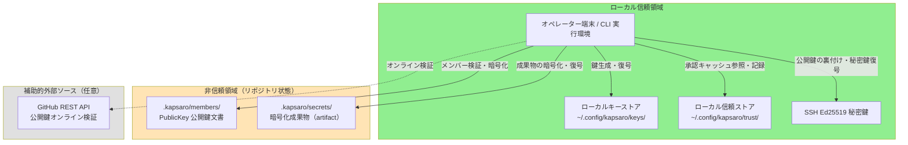
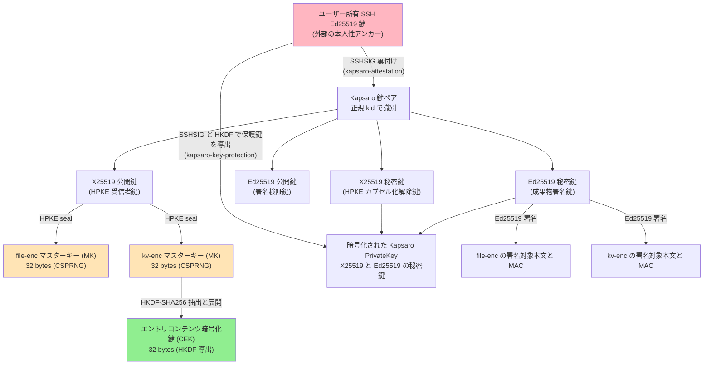
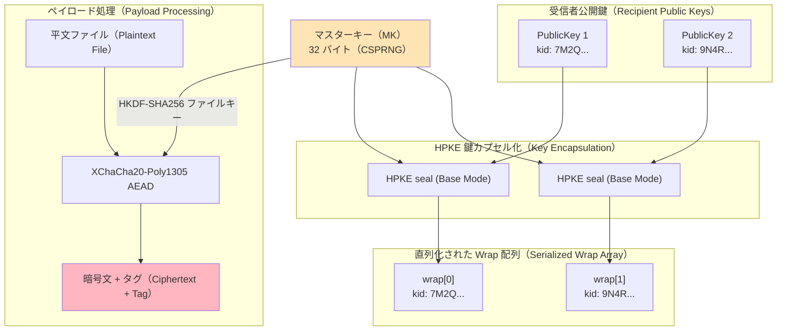
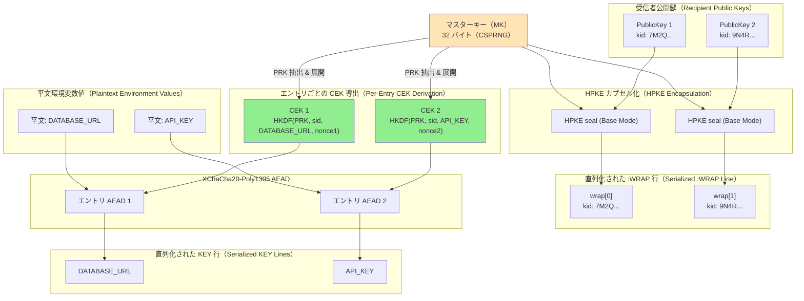
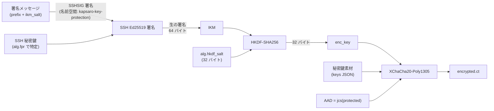
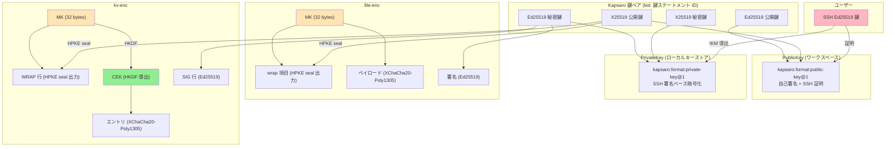

# Kapsaro セキュリティ設計

## 目次

- [0. 文書の目的と読み方](#0-文書の目的と読み方)
- [1. 保証と脅威モデル](#1-保証と脅威モデル)
- [2. 暗号方式と鍵](#2-暗号方式と鍵)
- [3. 共通署名形式と検証](#3-共通署名形式と検証)
- [4. file-enc プロトコル](#4-file-enc-プロトコル)
- [5. kv-enc プロトコル](#5-kv-enc-プロトコル)
- [6. メンバー認可と承認](#6-メンバー認可と承認)
- [7. 秘密鍵と実行環境](#7-秘密鍵と実行環境)
- [8. 攻撃と残余リスク](#8-攻撃と残余リスク)
- [9. 監査と運用確認](#9-監査と運用確認)
- [付録 A: 用語](#付録-a-用語)
- [付録 B: 文脈束縛の詳細](#付録-b-文脈束縛の詳細)
- [付録 C: 鍵関係図](#付録-c-鍵関係図)
- [付録 D: 参照仕様](#付録-d-参照仕様)

---

<a id="0-文書情報"></a>

## 0. 文書の目的と読み方

<a id="本書の位置づけ"></a>

### 0.1 本書の位置づけ

本書は、Kapsaro が保護する対象、暗号形式と検証規則、運用者や実行環境に依存する保護について説明します。実装が守る要件、残るリスク、製品の対象外となる機能も示します。

<a id="対象読者"></a>

### 0.2 対象読者

| 読者層 | 主要セクション | 目的 |
|--------|----------------|------|
| セキュリティ監査者・レビュー担当者 | §1（保証と脅威モデル）、§2（暗号方式と鍵）、§3（署名）、§4・§5（形式）、§8（攻撃とリスク）、§9（監査）、付録 B（文脈束縛） | セキュリティ上の保証、暗号学的な仮定、残るリスク、監査項目を評価する |
| 運用担当者・導入判断者 | §1（保証と脅威モデル）、§6（認可）、§7（秘密鍵）、§8.8（制限事項）、§9.4（運用チェックリスト） | 導入の前提条件、運用への適合性、組織が受け入れるリスクを判断する |

---


<a id="1-セキュリティ主張と境界"></a>

## 1. 保証と脅威モデル

以下の保証は、暗号処理の正しい実装と、本章で示す運用上の対策を前提とします。後続の章で、それらを支える形式と検証規則を説明します。

### 1.1 設計の動機と基本原則

Kapsaro は、開発チームが `.env` ファイル、TLS 証明書、API キーなどの機密データを、Git のレビュー運用およびコミット履歴の中で直接扱えるように設計されたオフライン優先（offline-first）の CLI ツールです。前提にある課題は、チャットツールや手作業のファイル受け渡しなどの場当たり的な手段でシークレットを共有すると、平文データが開発者の端末に残りやすく、過去の特定時点で誰が閲覧できたかの追跡が困難になり、メンバーの離脱や CI 認証情報のローテーション漏れが発生しやすいことです。

Git は複製、履歴管理、差分レビュー、メンバー変更の記録に使えます。一方、書き込み権限を持つ人や、侵害された CI ランナー・ホスティング環境は、そのファイルを改ざんできます。Kapsaro はリポジトリの内容を検証してから使用します。

Kapsaro は Git で暗号化ファイルを保管・配布し、次の仕組みで保護します。
- 受信者ごとの鍵配布: 秘密の内容を一度暗号化し、そのマスターキー（MK）を認可された各受信者向けに HPKE で個別に暗号化して配布します。これをラップと呼びます。MK は、内容の暗号化鍵と MAC 鍵を導出する元の鍵です。
- 自己完結した検証可能な成果物（artifact）: 外部インフラに依存することなく単体で検証できるよう、暗号化成果物自体に十分な構造メタデータ、公開鍵、暗号学的証明を内包する。
- ローカル信頼領域の厳格な分離: 秘密鍵、ローカルキーストア、承認状態キャッシュ、SSH 署名能力を、ユーザーのローカル信頼領域内に厳格に隔離する。
- Fail-closed な多層検証パイプライン: Git から取得したワークスペースのメンバー情報や暗号化成果物を非信頼の入力として扱い、利用前に多段階の暗号学的検証および認可ゲートを必ず通過させる。

検証では次の 4 点を区別します。
1. その暗号化成果物は暗号学的な完全性を維持しているか？
2. どの特定の鍵ペアによって署名が生成されたか？
3. その鍵の保持者は、現在のワークスペースで有効なメンバーとして認可されているか？
4. ローカルのオペレーターはその鍵の所有者を確認・承認済みか？

有効な署名は、秘密鍵の安全性を前提に、署名対象のバイト列と署名鍵を結び付けます。人の本人確認、現在のメンバー認可、ローカル承認はそれぞれ別に確認します（§1.6、§6）。

### 1.2 設計により保証されるセキュリティ機能

実装が §1.5 の不変条件を厳格に維持し、§1.3 の運用前提が満たされている限り、以下のセキュリティ主張が設計上保証されます。

| セキュリティ主張 | 実現メカニズム | 必要な前提条件 | 残余リスク | 詳細セクション |
|------------------|----------------|----------------|------------|----------------|
| 機密性 | HPKE seal/open（`hpke-32-1-3`）+ XChaCha20-Poly1305 | 復号を認可された受信者の長期秘密鍵が漏洩していないこと | 正当な受信者が復号後の平文を外部へ持ち出す行為は防げない | §2, §4, §5 |
| 改ざん検知 | Ed25519 デジタル署名（PureEdDSA） | 署名検証パイプラインがバイパスされないこと | 権限を持つ悪意ある正規署名者が、自身の権限範囲内で改ざんデータを署名することは防げない | §3 |
| 自己完結した検証 | 埋め込み署名者公開鍵文書（`signer_pub`） | すべての署名付き成果物に署名者の公開鍵文書が内包されていること | 署名者が現行メンバーとして認可されているかは別途信頼ポリシー評価に依存する | §3 |
| 鍵一貫性 | 公開鍵文書に対する厳格な自己署名検証（strict 検証） | 作成元の秘密鍵が漏洩していないこと | 攻撃者が新規に有効な鍵ペア一式を自作することは防げない | §3.5 |
| 現行メンバーシップの認可 | 有効メンバー一覧（`members/active/`）+ ローカル承認キャッシュ | リポジトリのアクセス制御とローカルのレビュー運用が意図どおり機能すること | 初回 TOFU 時の侵害、不正なコミット、オペレーターによる誤承認に弱い | §6 |
| 鍵の本人性補強 | SSH 署名による公開鍵の裏付け（SSHSIG）+ リポジトリ外確認 + 任意の GitHub オンライン検証 | オペレーターが承認時に適切な検証を実施すること | 初回接触時の中間者（MITM）攻撃や外部プロバイダーの侵害に弱い | §1.6.4, §3.6, §3.7 |
| 文脈束縛 | ファイル UUID（`sid`）、鍵ステートメント ID（`kid`）、エントリ名（`k`）、プロトコル識別子（`p`）への暗号学的束縛 | 実装が規定されたすべての束縛点を厳格に維持すること | 実装の不備により束縛フィールドが欠落するとコンポーネント入れ替えリスクが生じる | §B, §8 |
| 可搬なシークレット保護 | Argon2id + HKDF-SHA256 によるパスワード保護 | 堅牢化され信頼できる CI ランナー環境でのみ運用されること | 暗号文とパスワードを同一のシークレットバックエンドに格納すると独立した多層防御にならない | §7 |

### 1.3 運用前提に依存するセキュリティ特性

以下のセキュリティ特性は暗号プリミティブ単体では確立できず、組織的な運用手順や環境制御に根本から依存します。

| 運用領域 | 必要な運用前提条件 |
|----------|--------------------|
| 鍵の本人性確認 | 厳格な TOFU 検証、リポジトリ外チャネルでのフィンガープリント照合、および必要に応じた GitHub オンライン検証 |
| 有効メンバー一覧の正当性 | リポジトリの厳格なアクセス制御、必須プルリクエストレビュー、保護ブランチ規則、および監査ログの維持 |
| ローカル信頼領域の隔離 | 堅牢化された端末環境、適切なファイルシステムアクセス権（`0700` / `0600`）、および安全な SSH エージェント / 鍵の管理 |
| CI/CD での秘密鍵利用 | 信頼できる ref（保護ブランチ / タグ）、メンテナー管理下のパイプライン定義、および隔離されたランナーでの実行 |
| ロールバックの防止 | 過去に正当に署名された古い暗号化成果物が現在の HEAD に再導入されることを防ぐリポジトリ運用統制 |

### 1.4 非目標および明示的な適用除外

Kapsaro は、以下の事項を脅威モデルの対象から明示的に除外しています。

| 非目標 | アーキテクチャ上の理由 |
|--------|------------------------|
| 復号後の内部者による不正利用防止 | プロセスメモリ上で正当に復号された平文の利用統制は、暗号化ファイル共有のスコープ外である |
| 過去の開示履歴の遡及的回収 | 過去の受信者がすでに復号した平文データを、人間の記憶やオフラインストレージから暗号学的に消去することはできない |
| 静的 wrap を超える強い前方秘匿性 | 受信者の長期秘密鍵が漏洩した場合、その鍵に向けて作成された過去のすべての wrap が復号可能になる |
| TOFU を超える暗号学的な実名本人性証明 | 自己署名や SSH 署名は鍵の所持や SSH 鍵との対応関係を証明するが、法的な人物の本人性を証明するものではない |
| リポジトリレベルのロールバックの暗号学的検知 | 文脈束縛は成果物内部の整合性を保証するが、Git コミット履歴をまたぐ単調増加的なバージョン進行を強制するものではない |
| ID プロバイダー侵害に対する耐性 | ユーザーの GitHub アカウントや外部インフラが侵害された場合、外部検証シグナル自体が偽装され得る |

### 1.5 実装が維持すべき不変条件

§1.2 のセキュリティ主張は、ソフトウェア実装が以下のアーキテクチャ上の不変条件を厳格に維持して初めて成立します。

| 実装不変条件 | 破られた場合に損なわれるセキュリティ主張 |
|--------------|------------------------------------------|
| 署名・信頼・参照の確認、HPKE による MK の復元、鍵所持 MAC の検証を終えてから、ペイロードと秘密の値を復号する | 改ざん検知、fail-closed な入力処理、および信頼ポリシーの強制 |
| AAD、HPKE info 文字列、署名対象から文脈束縛パラメータ（`sid`, `kid`, `k`, `p`）を決して省略しない | ファイル間ペイロード入れ替え、ファイル内エントリ入れ替え、および鍵世代混同への耐性 |
| 署名検証鍵は、成果物に埋め込まれた公開鍵文書（`signer_pub`）からのみ厳格に解決する | 自己完結した検証、およびプラットフォーム間で一貫した受理セマンティクス |
| 有効メンバー一覧（`members/active/`）、鍵所有者承認（`known_keys`）、および受信者集合承認（`recipient_sets`）の境界を厳格に分離する | 動的なワークスペース認可とオペレーターの承認履歴の明確な分離 |
| 期限切れ鍵の受理は、復号および操作対象成果物の署名検証に厳格に限定し、新規暗号化、署名生成、期限切れ PublicKey の承認には決して適用しない | 鍵ライフサイクルの境界、およびローカル承認キャッシュの運用上の完全性 |
| `KAPSARO_STRICT_KEY_CHECKING=no` の適用を、明示的に要求された読み取り経路の承認キャッシュ評価のみに限定する | 書き込み経路の受信者検証、受信者ハンドルの整合性、および暗号学的検証保証 |


<a id="2-脅威モデルと信頼境界"></a>

### 1.6 脅威モデルと信頼境界

保護対象は、秘密の機密性、暗号化ファイルの完全性、メンバー認可の判断、ローカル承認履歴です。リポジトリへの攻撃と、安全性を前提とする端末の侵害を分けて扱います。

<a id="21-攻撃者モデル"></a>

#### 1.6.1 攻撃者モデル

攻撃者のアクセス権限によって、可能な攻撃と必要な対策が変わります。

| 攻撃者カテゴリ | アクセス能力 | 代表的な攻撃シナリオ |
|----------------|--------------|----------------------|
| リポジトリ改ざん者 | `.kapsaro/` 配下のファイルに対する任意の読み書き権限 | 侵害または悪意ある CI ランナー、Git ホスティングサーバーの侵害、不正なブランチ push |
| 公開鍵すり替え者 | `members/active/` または `members/incoming/` 内の公開鍵文書を改ざんまたは置換する能力 | メンバー追加時の中間者（MITM）攻撃、メンバーディレクトリへの不正コミット |
| 鍵ローテーション攻撃者 | 古い鍵世代向けに生成された配布データを保持し、新しい鍵での復号を試みる能力 | 不完全な再暗号化（rewrap）手順や古い受信者集合の悪用 |
| コンテキスト混同攻撃者 | 異なるファイル間またはエントリ間で暗号化セグメントを切り出し、つなぎ合わせる能力 | 本番環境とステージング環境のシークレットファイル間での暗号文ブロックの差し替え |
| 初回接触時の中間者（MITM） | 初回リポジトリ clone 時に、公開鍵、SSH フィンガープリント、または GitHub アカウント情報を偽情報に差し替える能力 | 信頼の起点が確立される前の、未検証の初回オンボーディングの悪用 |
| ローカルキーストア攻撃者 | `<KAPSARO_HOME>/trust/` を対象としたローカルファイルシステムへの読み書き権限 | ローカル承認データベースの上書きや失効履歴の巻き戻し |

<a id="22-運用前提"></a>

#### 1.6.2 運用前提

暗号学的な保護を維持するには、次の運用上の対策が必要です。

リポジトリの書き込み統制: リポジトリ上のデータは非信頼な入力として扱われますが、有効メンバー一覧（`members/active/`）は受信者集合の認可基準を定義します。組織は、メンバー定義の変更に対して厳格なブランチ保護、必須プルリクエストレビュー、および複数人による承認を義務付ける必要があります。

リポジトリレベルのロールバック: Git が過去のコミット履歴を保持する性質上、書き込み権限を持つ攻撃者は、シークレットファイルを過去に正当に署名された古いコミットの状態に戻すことが可能です。Kapsaro の文脈束縛は成果物内部のつなぎ合わせや改ざんがないことを保証しますが、Git コミットをまたぐ単調増加的なバージョン進行を暗号学的に強制することはできません。読み取り経路では署名者と有効な受信者を検証し、現在解決できない過去の受信者に対しては警告を出力します。書き込み経路ではより厳格な正規化を実施し、未解決の受信者を含む成果物は保存前に `rewrap` で正規化することを義務付けます。組織は、古いコミットが HEAD に再導入されることを防ぐため、デプロイ自動化、監査ログ、ブランチ保護に依拠する必要があります。

ローカル信頼領域の完全性: オペレーターの端末、キーストアディレクトリ（`~/.config/kapsaro/keys/`）、ローカル信頼データベース（`~/.config/kapsaro/trust/`）、および SSH 認証エージェントは、侵害されていない安全な環境であることを前提とします。ローカル信頼ストアのデジタル署名は偶発的な破損を検知しますが、端末のローカル書き込み権限を持つ攻撃者による意図的な改ざんまでは防げません。

初回信頼（TOFU）の制約: 新しい署名者やリポジトリの初期オンボーディングは、本質的に TOFU（Trust-On-First-Use）に依存します。初回接触前に注入された悪意ある鍵を検知するには、リポジトリ外の独立した通信チャネルを通じた検証が必須となります。

<a id="23-信頼境界"></a>

#### 1.6.3 信頼境界


```mermaid
graph TB
    subgraph trusted["ローカル信頼領域"]
        LocalTerminal["オペレーター端末 / CLI 実行環境"]
        LocalKeystore["ローカルキーストア<br/>~/.config/kapsaro/keys/"]
        LocalTrustStore["ローカル信頼ストア<br/>~/.config/kapsaro/trust/"]
        SSHKey["SSH Ed25519 秘密鍵"]
    end

    subgraph untrusted["非信頼領域（リポジトリ状態）"]
        MembersDir[".kapsaro/members/<br/>PublicKey 公開鍵文書"]
        SecretsDir[".kapsaro/secrets/<br/>暗号化成果物（artifact）"]
    end

    subgraph external["補助的外部ソース（任意）"]
        GitHub["GitHub REST API<br/>公開鍵オンライン検証"]
    end

    LocalTerminal -->|"鍵生成・復号"| LocalKeystore
    LocalTerminal -->|"承認キャッシュ参照・記録"| LocalTrustStore
    LocalTerminal -->|"公開鍵の裏付け・秘密鍵復号"| SSHKey
    LocalTerminal -->|"メンバー検証・暗号化"| MembersDir
    LocalTerminal -->|"成果物の暗号化・復号"| SecretsDir
    LocalTerminal -.->|"オンライン検証"| GitHub

    style trusted fill:#90EE90
    style untrusted fill:#FFE4B5
    style external fill:#E0E0E0
```

<a id="信頼するコンポーネント"></a>

##### 1.6.3.1 信頼するコンポーネント
- 端末のローカル実行環境: Kapsaro バイナリを実行するホストプロセス。
- ローカルキーストア（`~/.config/kapsaro/keys/`）: 暗号化された秘密鍵文書（`private.json`）および公開鍵ステートメント（`public.json`）を保持する安全なローカルストレージ。
- ローカル信頼ストア（`~/.config/kapsaro/trust/`）: 確認済みの鍵所有者（`known_keys`）および承認済み受信者構成（`recipient_sets`）を記録する端末ローカルの承認キャッシュ。
- ユーザーの SSH Ed25519 秘密鍵: Kapsaro 公開鍵に暗号学的裏付けを提供し、ローカル秘密鍵素材を保護するために用いられるホストの SSH 鍵。

<a id="信頼しないコンポーネント"></a>

##### 1.6.3.2 信頼しないコンポーネント
- ワークスペースメンバーディレクトリ（`.kapsaro/members/`）: リポジトリにコミットされた公開鍵ファイル群。すべての文書は利用前に自己署名および SSH 署名裏付けによって暗号学的に検証される必要があります。
- ワークスペースシークレットストレージ（`.kapsaro/secrets/`）: 暗号化ファイル（`file-enc` および `kv-enc`）。すべてのペイロードとメタデータは、処理前にデジタル署名と文脈束縛によって検証されます。

<a id="外部検証コンポーネント"></a>

##### 1.6.3.3 外部検証コンポーネント
- GitHub API: `member verify` 実行時に、SSH 署名裏付けに用いられた鍵が申告された GitHub アカウントに現在登録されているかを確認するための任意のネットワークオラクル。

このアーキテクチャにおいて、ユーザーの SSH 秘密鍵は以下の 2 つの独立した機能を担います。
1. 公開鍵の裏付け（Attestation）: OpenSSH SSHSIG 署名（`kapsaro-attestation` 名前空間）を介して、Kapsaro 公開鍵を確立された SSH アイデンティティに紐付ける。
2. 秘密鍵の保護（PrivateKey Protection）: 必要に応じてオンデマンドでエフェメラルな SSH 署名（`kapsaro-key-protection` 名前空間）を生成し、そこから `private.json` の対称復号鍵を導出する（§7.2 参照）。

SSH で保護した鍵の復号には、`private.json` と、指定された SSH 鍵による署名権限の両方が必要です。署名にはエージェント、または SSH 秘密鍵への直接アクセスを使います。パスワード保護は §7.3 の別の手順を使います。端末侵害の影響は §7.4 で説明します。

<a id="24-多層化された信頼アーキテクチャ"></a>

#### 1.6.4 多層化された信頼アーキテクチャ

Kapsaro は、暗号学的な検証、メンバー認可、ローカル承認、本人確認を分けて扱います。以下は責務の分類であり、実際の処理順序は §9.1 に示します。

| レイヤー | 検証メカニズム | 確立される主張 | 明示的な非適用事項 |
|----------|----------------|----------------|--------------------|
| 1. 暗号学的検証 | 埋め込み署名者公開鍵（`signer_pub`）+ Ed25519 署名 + AAD 束縛 | 暗号学的真正性、ペイロードの完全性、鍵一貫性 | 人間の本人性やワークスペース認可は確立しない |
| 2. ワークスペース認可 | 有効メンバー一覧（`members/active/`） | 現行メンバーシップの認可、受信者の適格性 | 悪意あるリポジトリコミットが存在しないことは保証しない |
| 3. ローカル承認キャッシュ | ローカル信頼データベース（`known_keys`, `recipient_sets`） | 鍵所有者および書き込み時の受信者集合に対する事前の確認履歴 | 現在のワークスペースメンバーシップ状態を決定する権威ではない |
| 4. 本人性補強 | リポジトリ外確認 + SSH 署名裏付け + GitHub API 照合 | 公開鍵と特定の個人・アカウントを結びつける補助的証拠 | プロバイダー侵害に対する完全な否認防止証明は提供しない |

レイヤー 1（暗号学的検証）: 成果物に埋め込まれた `signer_pub` から検証鍵を直接抽出します。自己署名の妥当性、SSH 署名裏付けの整合性、鍵ステートメントの一致（`kid` の一致）、および有効期限（`expires_at`）を検証します。

レイヤー 2（ワークスペース認可）: 有効メンバー一覧（`members/active/`）を照合します。リポジトリ上のファイルは非信頼であるため、このレイヤーは数学的真実ではなく、Git のガバナンスを通じて管理される管理上の意図を反映します。

レイヤー 3（ローカル承認キャッシュ）: 端末のローカル信頼データベースを参照します。`known_keys` は以前に受理された鍵に対する重複した確認プロンプトを抑止し、`recipient_sets` は書き込み操作向けにレビュー済みの受信者組み合わせをキャッシュします。

レイヤー 4（本人性補強）: オペレーターによる手動確認と外部自動チェックを組み合わせます。オンライン検証は GitHub に問い合わせ、裏付けに添付された SSH 公開鍵が申告アカウントに現在登録されているかを確認します。このチェックは過去の裏付け時点ではなく現在の状態を検証するものであり、ローカルの信頼キャッシュを自動的に変更することはありません。

<a id="統制された運用オーバーライド"></a>

##### 1.6.4.1 統制された運用オーバーライド
- 非メンバー例外受理: `members/active/` に存在しないエンティティによって署名された成果物の読み取りアクセスを許可する、対話的・一回限りのオーバーライド。永続的なメンバーシップの付与やローカル承認キャッシュの更新は行いません。
- 期限切れ鍵の復旧例外: 明示的なフラグ（`--allow-expired-key`）を指定して、期限切れの鍵を用いた過去のシークレットの復号を許可します。ただし、期限切れの鍵を用いた新規署名、暗号化、またはメンバー承認は厳格に拒否されます。
- 緩和された鍵検証（`KAPSARO_STRICT_KEY_CHECKING=no`）: 明示的に要求された読み取り経路に限り、ローカルの承認プロンプトを省略します。有効メンバーシップの認可、受信者ハンドルの整合性、署名検証、AEAD の完全性検証がバイパスされることは決してありません。

---


<a id="3-共通暗号基盤"></a>

## 2. 暗号方式と鍵

Kapsaro の暗号化と検証には、以下のアルゴリズムを使います。選定では次の 3 点を重視しています。
- 標準への準拠（Standards alignment）: ワイヤーフォーマットや動作の曖昧性を排除するため、厳格な IETF 仕様に準拠する。
- 誤用耐性（Misuse resistance）: 偶発的な脆弱性（nonce 衝突ハザードや非正規エンコーディングなど）を構造的に低減する。
- エコシステム親和性（Ecosystem affinity）: OpenSSH の公開鍵エコシステム（特に `ssh-ed25519` および SSHSIG）とネイティブに相互運用する。

<a id="31-アルゴリズム一覧"></a>

### 2.1 アルゴリズム一覧

| 暗号プリミティブ | パラメータおよび識別子 | 準拠仕様 | 主要な運用の役割 |
|------------------|------------------------|----------|------------------|
| HPKE Base Mode | スイート `hpke-32-1-3` | RFC 9180 | 受信者コンテンツ鍵のカプセル化（seal/open） |
| DHKEM(X25519, HKDF-SHA256) | `kem_id = 32`（`0x0020`） | RFC 9180 | 非対称鍵カプセル化メカニズム |
| HKDF-SHA256 | `kdf_id = 1`（`0x0001`）; 用途別スケジュールは §2.5 | RFC 5869 | HPKE 内部 KDF、ファイルのペイロード鍵と MAC 鍵、kv-enc の各エントリを暗号化する鍵（CEK）、PrivateKey の保護鍵 `enc_key` の導出（Argon2id 出力を含む; §7.3） |
| ChaCha20-Poly1305 | `aead_id = 3`（`0x0003`） | RFC 8439 | MK カプセル化のための HPKE 内部 AEAD |
| XChaCha20-Poly1305 | Nonce 24 bytes、Key 32 bytes | draft-irtf-cfrg-xchacha（§D） | file-enc ペイロード、kv-enc エントリ、およびローカルキーストア PrivateKey の対称暗号化 |
| Ed25519（PureEdDSA） | Curve25519、SHA-512 | RFC 8032 | デジタル署名生成、検証、および改ざん検知 |
| JCS（JSON Canonicalization） | 決定論的 UTF-8 バイト列シリアライズ | RFC 8785 | 署名対象ペイロード、AAD、および HPKE info 文字列の決定論的正規化 |
| base64url | パディングなし URL セーフ Base64 | RFC 4648 第5節 | バイナリ・テキスト間の符号化 |

<a id="32-ハイブリッド公開鍵暗号rfc-9180-hpke"></a>

### 2.2 ハイブリッド公開鍵暗号（RFC 9180 HPKE）

Kapsaro は、受信者ごとの鍵配送に HPKE を Base モードで使用します。

<a id="アーキテクチャ上の選定理由"></a>

#### 2.2.1 選定理由
- 正式な標準化: 単一の一貫した仕様の下で、KEM、KDF、および AEAD を統合する国際的に標準化されたフレームワークを提供する。
- wrap ごとのエフェメラル性: Base モードは受信者 wrap ごとに新しいエフェメラル鍵ペアの生成を義務付けており、wrap 間での nonce や内部状態の再利用を防止する。受信者の長期秘密鍵が漏洩した場合、その鍵に向けて作成された過去のすべての wrap が復号可能になる（§8.8.2 参照）。
- 明確な暗号スイートレジストリ: 暗号パラメータは IANA の公式 HPKE レジストリを通じて一意に識別され、実装間の解釈の混乱を排除する。

<a id="暗号スイート構成"></a>

#### 2.2.2 暗号スイート構成
```
hpke-32-1-3
├── kem_id  = 32 (0x0020) DHKEM(X25519, HKDF-SHA256)
├── kdf_id  = 1  (0x0001) HKDF-SHA256
└── aead_id = 3  (0x0003) ChaCha20-Poly1305
```

<a id="代替アーキテクチャの評価"></a>

#### 2.2.3 他の方式との比較
- RSA-OAEP: 鍵サイズおよび暗号文オーバーヘッドが過大であり、任意の周辺文脈（`info` および AAD）を一貫して束縛するための標準化された枠組みが欠如しているため不採用。
- 独自 ECIES: 正式な標準化がなされておらず、微妙な暗号学的構成ミスを招くリスクが高いため不採用。
- Age（X25519-ChaChaPoly）: モノリシックなヘッダ形式であり、Kapsaro のきめ細かい文脈束縛に必要な構造的拡張性が不足しているため不採用。

<a id="既知の境界"></a>

#### 2.2.4 制約
- Base モードは受信者の機密性を提供しますが、送信者の認証は行いません。作成者の真正性は Ed25519 署名によって独立して担保されます。
- X25519 は古典コンピュータにおいて 128 ビットのセキュリティ強度を提供します。

<a id="33-対称-aeadxchacha20-poly1305"></a>

### 2.3 対称 AEAD（XChaCha20-Poly1305）

XChaCha20-Poly1305 は、file-enc ペイロード（§4.5）、個別の kv-enc エントリ（§5.4）、およびローカルキーストアの PrivateKey ファイル（§7.2）に対して、関連データ付き認証付き暗号（AEAD）を提供します。

<a id="アーキテクチャ上の選定理由-1"></a>

#### 2.3.1 選定理由
- 無視できる衝突確率: 24 バイト（192 ビット）の拡張 nonce により、単一鍵の下での誕生日境界衝突しきい値が $2^{96}$ 回の暗号化に達するため、安全にランダム nonce を生成できる。
- 定数時間のソフトウェア実行: ハードウェアアクセラレーション（AES-NI 命令）に依存せず、すべての CPU アーキテクチャで一貫して高速な処理を実現する。
- 多層防御の安全マージン: 暗号自体は誤用耐性（misuse resistance）を持たないものの、広大な nonce 空間により致命的な鍵の再利用を防ぐ安全マージンを提供する。

<a id="代替アーキテクチャの評価-1"></a>

#### 2.3.2 他の方式との比較
- AES-256-GCM: 標準の 12 バイト（96 ビット）nonce では、分散ホスト間でランダムに nonce を生成した際に許容できない衝突リスクが生じるため不採用。
- AES-256-GCM-SIV: 決定論的な nonce 誤用耐性は魅力的であるものの、実装の複雑さ、クロスプラットフォームでの標準ライブラリ対応の不足、および非 AES-NI ハードウェアでの性能低下を考慮して不採用。

<a id="固有の制約"></a>

#### 2.3.3 固有の制約
- nonce の再利用: 同じ鍵で nonce を再利用すると機密性と完全性が損なわれます。Kapsaro は新しい乱数と文脈ごとの鍵導出で、そのリスクを小さくします（§2.8）。
- 圧縮の禁止: 圧縮オラクル攻撃（CRIME/BREACH 等）のサイドチャネルを排除するため、暗号化前に平文を圧縮することは固く禁止されます。

<a id="34-デジタル署名rfc-8032-ed25519-pureeddsa"></a>

### 2.4 デジタル署名（RFC 8032 Ed25519 PureEdDSA）

Ed25519 は文書の内容と署名鍵を結び付け、改ざんを検知します（§3）。その鍵を特定の人に結び付けるには、本人確認と安全な鍵管理が別途必要です。

<a id="アーキテクチャ上の選定理由-2"></a>

#### 2.4.1 選定理由
- 決定論的署名生成: RFC 8032 PureEdDSA は、秘密鍵とメッセージハッシュから決定論的に署名 nonce を導出する。この性質は、署名バイト列が入力鍵素材（IKM）として機能する Kapsaro の SSH ベース PrivateKey 保護パイプライン（§7.2）において必須となる。
- 高い検証スループット: 大規模なワークスペースにおいてもミリ秒未満で署名検証を実行可能にする。
- OpenSSH とのネイティブな相互運用性: OpenSSH の `ssh-ed25519` 鍵形式および SSHSIG 裏付け標準と親和性が高い。

<a id="代替アーキテクチャの評価-2"></a>

#### 2.4.2 他の方式との比較
- ECDSA（P-256）: 署名 nonce が既定で非決定論的であるため不採用（RFC 6979 で緩和可能ですが、ハードウェアトークンや SSH 実装での対応が一貫していません）。
- Ed448: OpenSSH エコシステムでの普及が極めて限定的であり、署名長も過大であるため不採用。

<a id="固有の制約-1"></a>

#### 2.4.3 固有の制約
- PureEdDSA は 128 ビットの古典セキュリティレベルを提供します。
- PureEdDSA はメッセージ文脈を自動的には分離しません。ドメイン分離は JCS シリアライズと明示的なプロトコル識別子文字列（`p`）によって強制されます。

<a id="35-鍵導出関数rfc-5869-hkdf-sha256"></a>

### 2.5 鍵導出関数（RFC 5869 HKDF-SHA256）

HKDF-SHA256 は、明示的な `salt` および `info` パラメータを用いて、暗号学的に独立し用途分離された対称鍵を導出します。その際、ファイル識別子（`sid`）、鍵ステートメント ID（`kid`）、エントリ名（`k`）、プロトコルタグ（`p`）などの周辺文脈を鍵スケジュールに組み込みます（§5.3, §B.2, §7.2.1, §7.3.2）。

<a id="アーキテクチャ上の選定理由-3"></a>

#### 2.5.1 選定理由
- 抽出と展開: HKDF は、HMAC と入力鍵素材のエントロピーに関する仮定の下で擬似ランダムな鍵を導出します。安全性の解析は入力源や用途に依存します。[RFC 5869 第5節](https://www.rfc-editor.org/rfc/rfc5869.html#section-5)を参照してください。
- 用途の分離: 異なる `info` 値で鍵の用途を分離します。これは HKDF の仮定の下での計算量的な分離であり、有限長の出力が一度も衝突しないという保証ではありません。
- Salt による多様化: 同一の IKM 入力から互いに異なる鍵ストリームを導出可能にする。

<a id="適用箇所"></a>

#### 2.5.2 適用箇所
- HPKE 内部鍵スケジュール: `hpke-32-1-3` 暗号スイート内部で使用される KDF（§2.2）。
- kv-enc エントリ鍵スケジュール: 成果物のマスターキー（MK）、salt、ファイル ID（`sid`）、およびエントリ名（`k`）から、エントリごとのコンテンツ暗号化鍵（CEK）を導出する。
- PrivateKey 保護パイプライン: SSH 署名または Argon2id 出力からローカル暗号化鍵（`enc_key`）を導出し、得られた鍵を `kid` および `salt` に束縛する（§7.2, §7.3）。

<a id="36-決定論的-json-シリアライズrfc-8785-jcs"></a>

### 2.6 決定論的 JSON シリアライズ（RFC 8785 JCS）

JSON 正規化方式（JCS）は、JSON データを正規化された UTF-8 バイト列に変換します。同じ受理可能な入力に対して、RFC 8785 に準拠した実装は署名、AAD、HPKE 文脈用に同じバイト列を生成します。スキーマ検証と重複キーの拒否は、正規化の前に行います。

<a id="アーキテクチャ上の選定理由-4"></a>

#### 2.6.1 選定理由
- パースによる差異の排除: プラットフォーム間での空白の違い、キーの並び順、数値フォーマットの差異を解消する。
- 特殊文字に対する堅牢性: ファイル ID（`sid`）やユーザーハンドル内に任意の文字が含まれていても、曖昧なエスケープシーケンスを生じさせることなく決定論的にシリアライズする。

<a id="適用箇所-1"></a>

#### 2.6.2 適用箇所
- file-enc: 署名対象となるトップレベルの `protected` オブジェクト、および AEAD AAD 構築用の `payload.protected` の正規化（§3.2, §4.5）。
- kv-enc: シリアライズされたトークンペイロードの正規化、および正規化文書の検証（§5.1）。
- 公開鍵および秘密鍵: `kid` 導出および AEAD 保護のための `protected` ヘッダのシリアライズ（§2.10.4.2, §7.2）。
- HPKE 文脈: `info` および AAD 入力用の同一かつ正規化された文脈バイト列の生成（§B.3）。

<a id="固有の制約-2"></a>

#### 2.6.3 固有の制約
- JCS は純粋に構文レベルで動作します。構造の意味論、有効期限タイムスタンプ、鍵素材の一致性などは検証しません。これらは明示的なスキーマ検証および暗号学的検証によって担保される必要があります。

<a id="37-暗号プリミティブが提供する保証と制約"></a>

### 2.7 暗号プリミティブが提供する保証と制約

| プリミティブ | 前提とする暗号学的保証 | Kapsaro における設計上の含意 |
|--------------|------------------------|------------------------------|
| HPKE Base Mode（RFC 9180） | HPKE の仮定の下での受信者向けの機密性。送信者認証は対象外 | Ed25519 が署名対象バイト列を認証し、内容鍵の MAC がそのバイト列と署名者 ID を MK の所持に結び付ける。認可と承認は別途確認 |
| XChaCha20-Poly1305 | 鍵ごとの nonce の一意性など、暗号方式の仮定の下での機密性と暗号文の完全性 | nonce の再利用は安全性を損なう。新しい乱数と鍵導出でリスクを小さくする（§2.8） |
| Ed25519（PureEdDSA） | 秘密鍵が秘匿されている限り、選択メッセージ攻撃に対する強偽造不可性（EUF-CMA）を提供する | 成果物および公開鍵の真正性は秘密鍵の安全管理に依存する。署名者の秘密鍵が漏洩した場合、保証は崩壊する |
| HKDF-SHA256 | HMAC と入力源に関する仮定の下での擬似ランダムな鍵導出 | 抽出は入力にあるエントロピーを集約する。予測可能な入力に欠けているエントロピーは作れない。用途ごとの展開で CEK と保護鍵を導出 |

<a id="38-nonce-の安全性マージン"></a>

### 2.8 Nonce の安全性マージン

Kapsaro は、新しい乱数の生成と用途ごとの鍵導出により、同じ鍵と nonce の組を再利用するリスクを小さくします。
- file-enc: 暗号化操作ごとに CSPRNG を用いて新しい 32 バイトのマスターキー（MK）を生成する。ペイロード暗号化鍵は一度だけ導出され、正確に 1 つのペイロードの暗号化にのみ使用される。
- kv-enc: エントリの暗号化ごとに新しい 24 バイトのランダム nonce を生成し、ファイル ID とエントリ名とともに CEK の導出に使います。同じ成果物 PRK の下で、同じエントリに同じ nonce を使うと CEK も再利用されます。
- PrivateKey 保護: エクスポートまたは保存操作ごとに新しい 32 バイトの `ikm_salt` および 32 バイトの `hkdf_salt` を生成し、1 回限りの AEAD 暗号化に使用されるエフェメラルな `enc_key` を導出する。

これらの対策は、正しく動作する CSPRNG と暗号学的な鍵導出を前提とします。乱数と導出鍵の出力は有限長なので、衝突確率は小さくてもゼロにはなりません。独立で一様な 192 ビット nonce を $q$ 回生成するとき、$q$ が $2^{96}$ より十分小さければ、衝突確率は誕生日問題の近似で $q(q-1)/2^{193}$ です。同じ鍵の下で nonce を再利用しないという要件は引き続き必要です。

<a id="39-暗号強度とセキュリティレベル"></a>

### 2.9 暗号強度とセキュリティレベル

| 暗号プリミティブ | パラメータ / 鍵サイズ | 古典セキュリティ強度 | 暗号解読の数学的根拠 |
|------------------|-----------------------|----------------------|----------------------|
| X25519（DHKEM） | 256 bits | 128 bits | 楕円曲線離散対数問題（ECDLP） |
| Ed25519（デジタル署名） | 256 bits | 128 bits | 楕円曲線離散対数問題（ECDLP） |
| XChaCha20-Poly1305 | 鍵: 256 bits、nonce: 192 bits、タグ: 128 bits | 鍵探索は 256 ビット。認証の安全性はメッセージ長と検証試行回数に依存 | ChaCha20 と Poly1305 に関する仮定 |
| ChaCha20-Poly1305（HPKE） | 鍵: 256 bits、nonce: 96 bits、タグ: 128 bits | 鍵探索は 256 ビット。認証の安全性はメッセージ長と検証試行回数に依存 | ChaCha20 と Poly1305 に関する仮定 |
| HKDF-SHA256 | 出力: 256 bits | 入力のエントロピーと HMAC に関する仮定に依存 | HKDF の抽出・展開の安全性解析 |

X25519 と Ed25519 に基づく古典計算に対する安全性の目安は約 128 ビットです。すべての攻撃に一律の数値を当てはめることはできず、認証の安全性はメッセージ長や偽造の試行回数にも依存します。256 ビットの対称鍵を使っても、公開鍵暗号への量子攻撃に対するプロトコル全体の耐性は得られません。ChaCha20-Poly1305 の認証タグは 128 ビットです。[RFC 8439 第2.8節](https://www.rfc-editor.org/rfc/rfc8439.html#section-2.8)を参照してください。

---


<a id="4-鍵階層と鍵ライフサイクル"></a>

### 2.10 鍵階層と鍵ライフサイクル

以下の表では、メンバー鍵、内容鍵、秘密鍵の保護鍵を、役割と有効期間で分類します。各形式での使い方は §4、§5、§7 で説明します。

<a id="41-鍵の種類とアーキテクチャ上の関係"></a>

#### 2.10.1 鍵の種類とアーキテクチャ上の関係

| 鍵の分類 | 起点および所有権 | 運用の有効期間 | 主要な暗号学的機能 | 参照セクション |
|----------|------------------|----------------|--------------------|----------------|
| ユーザー SSH Ed25519 鍵 | 外部（オペレーター所有） | 長期 | 公開鍵の SSH 署名裏付け、PrivateKey 暗号化のためのエフェメラル IKM 導出 | §3.6, §7.2 |
| Kapsaro 鍵ペア（`kid`） | 内部（`key new`; X25519 + Ed25519） | 長期（`expires_at` まで有効） | HPKE 鍵カプセル化 / カプセル化解除、Ed25519 署名生成および検証 | §3, §4, §5 |
| 内容鍵と保護鍵（`MK`, `CEK`, `enc_key`） | CSPRNG または HKDF | 平文バッファは一時的。ラップ済み MK と導出入力は後の復号にも使う | ペイロード暗号化、エントリ AEAD、ローカルキーストア暗号化 | §4.3, §5.3, §7.2.1 |


```mermaid
graph TB
    SSHKey["ユーザー所有 SSH Ed25519 鍵<br/>(外部の本人性アンカー)"]
    KapsaroKP["Kapsaro 鍵ペア<br/>正規 kid で識別"]
    KEM_PK["X25519 公開鍵<br/>(HPKE 受信者鍵)"]
    KEM_SK["X25519 秘密鍵<br/>(HPKE カプセル化解除鍵)"]
    SIG_PK["Ed25519 公開鍵<br/>(署名検証鍵)"]
    SIG_SK["Ed25519 秘密鍵<br/>(成果物署名鍵)"]
    FILE_MK["file-enc マスターキー (MK)<br/>32 bytes (CSPRNG)"]
    KV_MK["kv-enc マスターキー (MK)<br/>32 bytes (CSPRNG)"]
    CEK["エントリコンテンツ暗号化鍵 (CEK)<br/>32 bytes (HKDF 導出)"]
    ProtectedKeys["暗号化された Kapsaro PrivateKey<br/>X25519 と Ed25519 の秘密鍵"]
    FileSignature["file-enc の署名対象本文と MAC"]
    KvSignature["kv-enc の署名対象本文と MAC"]

    SSHKey -->|"SSHSIG 裏付け<br/>(kapsaro-attestation)"| KapsaroKP
    SSHKey -->|"SSHSIG と HKDF で保護鍵を導出<br/>(kapsaro-key-protection)"| ProtectedKeys
    KEM_SK --> ProtectedKeys
    SIG_SK --> ProtectedKeys
    KapsaroKP --> KEM_PK
    KapsaroKP --> KEM_SK
    KapsaroKP --> SIG_PK
    KapsaroKP --> SIG_SK
    KEM_PK -->|"HPKE seal"| FILE_MK
    KEM_PK -->|"HPKE seal"| KV_MK
    SIG_SK -->|"Ed25519 署名"| FileSignature
    SIG_SK -->|"Ed25519 署名"| KvSignature
    KV_MK -->|"HKDF-SHA256 抽出と展開"| CEK

    style SSHKey fill:#FFB6C1
    style FILE_MK fill:#FFE4B5
    style KV_MK fill:#FFE4B5
    style CEK fill:#90EE90
```

ユーザーの SSH 鍵は Kapsaro の外部で管理される認証鍵であり、OpenSSH 署名の名前空間によって分離された 2 つの独立した役割を担います。
- 公開鍵の裏付け（Attestation）: 名前空間 `kapsaro-attestation` を使用して、Kapsaro 公開鍵を特定の SSH アイデンティティに紐付ける。
- ローカル PrivateKey の保護: 名前空間 `kapsaro-key-protection` を使用して、オンデマンドでローカル暗号化鍵を導出する。

OpenSSH SSHSIG 標準は名前空間で隔離されたメッセージハッシュを強制するため、同一の SSH 鍵を両方の用途で再利用しても暗号学的に安全です（§7.1.1 参照）。

<a id="42-鍵パラメータ仕様"></a>

#### 2.10.2 鍵パラメータ仕様

| 鍵識別子 | ビット長 | 生成方法 | 運用の役割 | 文脈束縛への寄与 | メモリゼロ化 |
|----------|----------|----------|------------|------------------|--------------|
| SSH Ed25519 秘密鍵 | 256 bits | 外部（オペレーター管理） | 裏付け、ローカルキーストアの暗号化解除 | 間接的（裏付け本文および PrivateKey AAD を介して結合） | OS / エージェント管理 |
| X25519 秘密鍵（KEM） | 256 bits | CSPRNG | HPKE カプセル化解除（open） | 正規 `kid` を定義（§B） | 必須（MUST） |
| X25519 公開鍵（KEM） | 256 bits | KEM 秘密鍵のスカラー倍算 | HPKE カプセル化（seal） | 正規 `kid` を定義（§B） | 任意（公開情報） |
| Ed25519 秘密鍵（署名） | 256 bits | CSPRNG | デジタル署名生成 | 成果物の `kid` に対応（§B） | 必須（MUST） |
| Ed25519 公開鍵（検証） | 256 bits | seed から署名スカラーを導出し、曲線の基点をスカラー倍 | デジタル署名検証 | 正規 `kid` を定義（§B） | 任意（公開情報） |
| マスターキー（`MK`, file-enc） | 256 bits | CSPRNG | ペイロード暗号化鍵のルート | ペイロードヘッダ AAD がファイル ID `sid` を内包（§4.5） | 必須（MUST） |
| マスターキー（`MK`, kv-enc） | 256 bits | CSPRNG | CEK 導出ルート | wrap が `kid`/`sid`/`p` を内包（§5.5）、導出が `sid`/`k`/nonce を内包（§5.3） | 必須（MUST） |
| コンテンツ暗号化鍵（`CEK`） | 256 bits | HKDF-SHA256 展開 | 個別エントリ AEAD 暗号化 | HKDF が `sid`/`k`/nonce を内包、エントリ AAD が `k`/`sid`/`p` を内包（§5.3, §5.4） | 必須（MUST） |
| PrivateKey 暗号化鍵（`enc_key`） | 256 bits | HKDF-SHA256 展開 | ローカル `private.json` の AEAD 暗号化 | AEAD AAD が正規 `jcs(protected)` ヘッダを束縛（§7.2.1） | 必須（MUST） |

<a id="運用の補足事項"></a>

##### 2.10.2.1 運用の補足事項
- `enc_key` は厳格にエフェメラルであり、オンデマンドでメモリ上に導出され、永続ストレージに書き出されることは決してありません。
- 1 つの SSH 鍵で複数世代の Kapsaro 鍵を保護できます。HKDF の仮定の下で、`kid` と salt が保護鍵の導出文脈を分離します。
- メモリゼロ化: 上表の「必須（MUST）」は設計上の厳格な不変条件を示します。実装は対称鍵および秘密スカラー素材を使用直後にメモリから消去する必要がありますが、完全な消去の保証はプロセスの実行環境に依存します（§9.3）。

<a id="43-受信者の適格性と認可"></a>

#### 2.10.3 受信者の適格性と認可

あるエンティティが認可された受信者であるかどうかの判定は、暗号学的な確実性ではなく、§1.6.4 によって統制されるアクセス制御の判断です。暗号化操作において受信者として認可されるのは、`members/active/` 内に明示的に存在する公開鍵のみです。

`members/incoming/` 内に存在する参加申請中の鍵は、信頼されない入力として扱われます（§1.6.1）。管理オペレーターがその公開鍵を審査し、`rewrap` を介して `members/active/` に昇格させるまで、申請メンバーは既存の秘密情報を復号できません。

メンバーシップの遷移に伴う暗号学的影響は非対称です（§5.8）。
- 受信者の追加（incoming から active への昇格）: `file-enc` と `kv-enc` の双方が既存のマスターキー（MK）を維持し、新しい受信者向けの HPKE wrap エントリを追加します。
- 受信者の削除（オフボーディング）: 両形式ともマスターキー（MK）を厳格に再生成します。`file-enc` ではペイロード全体が再暗号化され、`kv-enc` では新しい MK から導出された新規 CEK の下で全エントリが再暗号化されます（§5.8）。

メンバーシップの承認と人間の本人性検証は分離されています。`members/active/` への管理者による登録は認可を確立しますが、本人性への信頼はレイヤー 4 のチェック（TOFU、帯域外検証、GitHub 相互検証）に依存します。

<a id="44-鍵ライフサイクルの遷移"></a>

#### 2.10.4 鍵ライフサイクルの遷移

次の図は、鍵の作成、ローカルでの選択、置き換え、有効期限の関係を示します。ワークスペースでの認可は別に確認します。

```
作成 ──> active ──> expired
           │
           └──> rotated（新しく生成された鍵ペアによって置換）
```

- 作成（Creation）: `kapsaro key new` により生成されます。新しい鍵ペアと署名済み公開鍵ステートメントが生成され、ローカルキーストアに保存されます。
- active: ローカルのメンバーハンドルに対して選択されている鍵です。新しい署名や wrap の作成には有効期限内であることが必要で、公開鍵はワークスペースでの認可・承認要件も満たす必要があります。ローカルで鍵を生成・選択しても、`members/active/` へは追加されません。
- expired: `expires_at` を超過した状態です。新規署名の生成や新規 wrap の作成は厳格に拒絶されます。過去の成果物の復号や運用上の署名検証は既定で拒絶され、明示的な復旧フラグが指定された場合に限り警告付きで許可されます。
- rotated: `kapsaro key new` で後継のメンバー鍵を生成し、公開鍵を確認・共有して古い active 鍵を置き換え、対象の暗号化ファイルを `rewrap` で更新します。過去の秘密鍵は明示的に削除するまでローカルキーストアに残ります。`rewrap --rotate-key` が再生成するのは暗号化ファイルのマスターキーであり、メンバーの鍵ペアや新しい `kid` を作る操作ではありません。

選択から外れた有効期限内のローカル鍵は available として、過去のファイルの復号に使えます。期限後は期限切れ鍵の復旧規則が適用されます。ローカルの active / available と、ワークスペースの `members/active/` への登録は別の判断です。

<a id="有効期限のセマンティクス"></a>

##### 2.10.4.1 有効期限のセマンティクス
鍵の有効期限は、古い認証情報を用いて新規暗号文が生成されるのを防ぐための運用上の境界を確立します。過去の成果物の暗号学的整合性や文脈束縛を遡及的に無効化するものではありません。期限切れの認証情報を用いて成果物を復号するには、`--allow-expired-key`、`KAPSARO_ALLOW_EXPIRED_KEY=yes`、または `allow_expired_key="yes"` を通じた明示的なオペレーター認可が必要です。

Kapsaro は従来の証明書失効リスト（CRL）やオンライン OCSP レスポンダーを採用していません。侵害された鍵から運用上の信頼を取り消すには、その鍵を `members/active/` から除去し、ワークスペースの成果物を再ラップし、ローカルの承認データベース（`known_keys`、§8.8.4 参照）を更新する必要があります。

<a id="441-鍵ステートメント-idkidの不変性"></a>

##### 2.10.4.2 鍵ステートメント ID（kid）の不変性

各鍵ペアには正規の `kid`（鍵ステートメント ID）が対応付けられます。`kid` はハイフンなし 32 文字の Crockford Base32 文字列です。導出方法は、JSON に格納される `PublicKey.protected` から `kid` フィールドを除いたオブジェクト（`protected_without_kid`）を JCS（§2.6）でバイト列に正規化し、その SHA-256 ダイジェストの先頭 20 バイトをパディングなし Crockford Base32 で 32 文字に符号化します。
$$\text{kid} = \text{Encode\_CrockfordBase32}\left(\text{SHA256}\left(\text{JCS}(\text{protected\_without\_kid})\right)[0..20]\right)$$
格納時の `protected.kid` は、この再導出結果と厳格に一致していなければなりません。

Crockford Base32 は視覚的に紛らわしい文字（I, L, O, U）を排除したアルファベットを使用するため、人手での転記ミスを防ぎ、URL や JSON 内で扱いやすい形式です。

公開鍵、SSH 署名による裏付け、`binding_claims`、`expires_at` は `kid` の導出対象です。切り詰めたハッシュの衝突耐性を前提に、これらの変更には新しいステートメント ID と、それに対応する wrap・署名が必要です（§B）。`kid` は公開鍵ステートメントの識別子であり、CEK の導出入力には含めません。

<a id="45-鍵ローテーション手順"></a>

#### 2.10.5 鍵ローテーション手順

メンバー鍵と内容鍵の更新は別の操作です。メンバー鍵は `key new` で後継鍵を生成し、公開鍵を確認・共有して有効にします。受信者の追加・除外、有効期限に備えた鍵の置き換え、漏洩への対応後には、`rewrap` で暗号化ファイルを更新します（§8.8.2）。

file-enc はファイル単位の MK、kv-enc はファイル単位の MK とエントリごとの CEK という二層鍵構造を持ちます（§5.2）。受信者追加では両形式とも既存コンテンツ鍵を維持して wrap を追加します。受信者削除では file-enc は MK を再生成してペイロード全体を再暗号化し、kv-enc は MK を再生成して全エントリを再暗号化します（§5.7, §5.8）。`--rotate-key` もコンテンツ鍵（MK）自体を強制的に再生成し、完全な再暗号化を行います。プロトコル上の動作比較は §5.8 で詳述します。

`--rotate-key` は、漏洩後に将来の成果物への被害拡大を食い止める措置であり、§8.8.2 で述べるように過去に配布済みの暗号文の機密性を遡及的に回復する機構ではありません。新しい `kid` を active として運用しつつ、古い `kid` は過去の成果物の検証と復号に必要な期間だけローカルに保持するという運用設計が、§2.10.4 の時間軸と整合します。

---


<a id="5-署名と検証アーキテクチャ"></a>

## 3. 共通署名形式と検証

署名付きの暗号化ファイルには、署名者の完全な公開鍵文書を `signer_pub` として埋め込みます。署名検証にはこの文書を使い、外部から鍵を検索しません。メンバー認可とローカル承認は別に評価します（§6）。

<a id="50-signature_v4-共通形式"></a>

### 3.0 signature_v4 共通形式

file-enc と kv-enc の両成果物は、標準化された `signature_v4` 構造（実装上は `ArtifactSignature`）を使用します。
- 署名者公開鍵の埋め込み: 署名者の完全な `PublicKey` 文書（`signer_pub`）を埋め込み、検証鍵の解決を成果物内で自己完結させます。
- 鍵ステートメントの束縛: 署名者の `kid` を明示的に宣言し、署名を特定の鍵世代に束縛します。
- 暗号学的な鍵保持証明（`mac`）: 成果物のペイロードを復号する基盤マスターキー（MK）を署名者が所持していることを証明する HMAC をカプセル化します。
- 統合された検証連鎖: 公開鍵文書の妥当性検証と成果物署名の検証を、一連の途切れないパイプライン（§3.4）として統合します。

<a id="個別の文書形式"></a>

#### 3.0.1 個別の文書形式
1. 成果物署名（`signature_v4`）: file-enc および kv-enc で使用されます。`signer_pub`、`kid`、`mac`、`sig` を埋め込みます。
2. ローカル信頼ストア（`kapsaro:format:local-trust@1`）: `alg` / `kid` / `sig` フィールドを共有しますが、`signer_pub` は意図的に省略されます。キーストア内のローカル所有者の鍵に対して検証されます（§6.4）。
3. 公開鍵文書（`kapsaro:format:public-key@1`）: `jcs(protected)` に対する 86 文字の Ed25519 自己署名を保持する単独の base64url 文字列を使用します。公開鍵ステートメントには外部の署名者や暗号化ペイロードが存在しないため、`signer_pub` も `mac` も不要です。

すべての文書にわたって単一の画一的な署名スキーマを仮定した実装は、公開鍵ステートメントの処理に失敗します。

<a id="signature_v4-構造のフィールド"></a>

#### 3.0.2 `signature_v4` 構造のフィールド

| フィールド | 表現形式 | 値 / 内容 | セキュリティ上の役割 |
|---|---|---|---|
| `alg` | 文字列 | 常に `eddsa-ed25519`（PureEdDSA） | デジタル署名アルゴリズムの一意な宣言 |
| `kid` | Crockford Base32（32 文字） | 署名者の鍵ステートメント ID | 署名文脈を署名者の特定の鍵世代に束縛（§2.10.4.2, §B） |
| `signer_pub` | JSON オブジェクト | 署名者の完全な `PublicKey` 文書 | 検証鍵の唯一の出所。自己署名と SSH 署名による公開鍵の裏付けをこの文書上で検証 |
| `mac` | 文字列 | `hmac-sha256:<base64url>` | 成果物に対応するマスターキー（MK）を署名者が保持していたことの証明 |
| `sig` | base64url（パディングなし） | 64 バイト Ed25519 署名 | ドメインタグ、署名ヘッダ、文書本文、および MAC を網羅した改ざん検知 |

`signer_pub` が欠落した成果物はフェイルクローズで拒否されます。Kapsaro は、署名者鍵のフォールバック探索元としてワークスペースやローカルキーストアを検索することを厳格に禁止しています。フォールバック探索を許容すると実装差や攻撃面での揺らぎが生じ、§1.5 で確立した不変条件に違反します。

<a id="51-コンテナ署名方式の比較"></a>

### 3.1 コンテナ署名方式の比較

両形式とも `signature_v4` に準拠しますが、基盤となるデータコンテナ（JSON か行指向テキストか）に合わせて、署名対象バイト列の直列化を調整します。

| 仕様項目 | file-enc プロトコル | kv-enc プロトコル |
|---|---|---|
| 署名対象バイト列 | 署名ドメインタグ、`signature_header`、`jcs(protected)`、`ascii(signature.mac)` の length-framed 連結 | 署名ドメインタグ、`signature_header`、canonical line bytes、`ascii(signature.mac)` の length-framed 連結 |
| 直列化位置 | JSON ルート内の `signature` オブジェクト | 文書末尾の `:SIG` 行 |
| 完全性保護範囲 | `protected` オブジェクト全体（`sid`, `wrap[]`, `payload`, タイムスタンプ） | 本文全体（`:HEAD`, `:WRAP`, すべての `KEY` 行） |
| 署名アルゴリズム | `eddsa-ed25519`（RFC 8032） | `eddsa-ed25519`（RFC 8032） |
| 鍵保持証明 | length-framed 本文バイト列と `kid` に対する HMAC-SHA256 | length-framed canonical bytes と `kid` に対する HMAC-SHA256 |

鍵保持証明（`mac`）は、マスターキー（MK）から HKDF-SHA256 経由で導出された専用の MAC キーを使用して計算されます。ドメイン `kapsaro:mac:key-possession@1` の下で、length-framed された本文バイト列および `signature.kid` に対して実行されます。外側の Ed25519 署名は、ドメイン `kapsaro:sig:artifact-signature@1` の下で、length-framed された `signature_header`、本文バイト列、および `signature.mac` に対して計算されます。

署名検証により `signature.kid` が `signer_pub.protected.kid` と一致することが検証されるため、HMAC は署名の作成者が成果物のマスターキーを保持していたことを確立します。

<a id="52-file-enc-コンテナ署名"></a>

### 3.2 file-enc コンテナ署名

`file-enc` では、ドメイン `kapsaro:sig:artifact-signature@1` の下で次を length-framing して署名対象バイト列を構築します。
1. `signature.alg` と `signature.kid` から導出された `signature_header`。
2. JCS 正規化されたトップレベル `protected` オブジェクトを表す `jcs(protected)`。
3. `signature.mac` の ASCII 表現。

したがって、`protected` 内のすべてのフィールド（`sid`、すべての `wrap[]` エントリ、`removed_recipients`、タイムスタンプ、および完全な `payload` 構造（`payload.protected` と `payload.encrypted`））が署名によって束縛されます。循環定義を防止するため、署名値 `signature.sig` は入力から除外されます。これとは独立して、ペイロード暗号化時には `jcs(payload.protected)` が AEAD AAD として機能します（§4.5）。

<a id="53-kv-enc-文書署名"></a>

### 3.3 kv-enc 文書署名

`kv-enc` では、ドメイン `kapsaro:sig:artifact-signature@1` の下で次を length-framing して署名対象バイト列を構築します。
1. `signature.alg` と `signature.kid` から導出された `signature_header`。
2. `:SIG` より前のすべての行（`:KAPSARO_KV`、`:HEAD`、`:WRAP`、およびすべての `KEY` 行）を LF 終端で連結した `canonical_bytes`。
3. `signature.mac` の ASCII 表現。

署名は、各エントリトークンと変数名を含む文書本文、および鍵所持 MAC を保護します。

<a id="54-多段階暗号検証パイプライン"></a>

### 3.4 多段階暗号検証パイプライン

すべての暗号化成果物において、署名検証は `signer_pub` に埋め込まれた公開鍵のみを使用します。検証は順を追って 3 つのゲート（層 A → 層 B → 層 C）を進みます。

```
[ 成果物入力 ]
       │
       ▼
[ 層 A: signer_pub 文書の妥当性確認 ]
  ├── スキーマおよび構造適合性
  ├── 厳格な自己署名検証（§3.5）
  └── SSH 署名による公開鍵の裏付け検証（§3.6）
       │
       ▼
[ 層 B: 鍵ステートメント文脈束縛 ]
  └── signature.kid == signer_pub.protected.kid の検証
       │
       ▼
[ 層 C: 文書完全性および証明検証 ]
  ├── 署名対象本文 + MAC に対する Ed25519 署名検証
  ├── マスターキー（MK）を復元するための HPKE open
  └── 派生 MAC キーによる signature.mac の再計算および検証
       │
       ▼
[ 平文復号の許可 ]
```

- 層 A（`signer_pub` の妥当性確認）: 埋め込まれた公開鍵が構文的に有効であり、スキーマ規則に適合し、有効な自己署名を保持し、SSH 署名による公開鍵の裏付け制約を満たしていることを検証します。
- 層 B（鍵ステートメント束縛）: `signature.kid` が `signer_pub.protected.kid` と一致することを確認します。
- 層 C（完全性と証明の検証）: 保存された MAC 文字列を署名入力に含め、`signer_pub` で Ed25519 署名を検証します。信頼ポリシーと参照の整合性を確認した後、HPKE open で MK を復元し、MAC 鍵を導出して `signature.mac` を検証します。この MAC 検証で層 C が完了し、その後に平文を復号します。

このフローは、§1.5 の不変条件「署名検証、参照整合性検査、鍵保持証明検証を通過するまで平文復号を行わない」を厳格に強制します。

<a id="55-publickey-自己署名と厳格な検証"></a>

### 3.5 PublicKey 自己署名と厳格な検証

すべての `PublicKey` 文書は、正規化された自身の `protected` オブジェクトに対する自己署名を保持し、鍵一貫性（§A）を確立します。すなわち、文書を公開した主体が対応する署名秘密鍵を保持していることの数学的証明です。

<a id="厳格な-ed25519-検証"></a>

#### 3.5.1 厳格な Ed25519 検証
Kapsaro におけるすべての Ed25519 署名検証は厳格（strict）です。
- 小位数（small order）の検証公開鍵は拒否されます。
- 非正準（non-canonical）または小位数の `R` 点を持つ署名は拒否されます。

この厳格さは、鍵一貫性にとって数学的に不可欠です。小位数チェックを伴わない標準的な Ed25519 検証では、攻撃者が位数 8 の脆弱な公開鍵を生成し、秘密鍵を知らなくても任意のメッセージに対して検証を通過する偽造署名を作成できてしまいます。厳格な拒否により、この脆弱性が排除されます。

自己署名は転送中の既存公開鍵の改ざんを防止しますが、攻撃者が有効な自己署名を持つ全く新しい鍵ペアを生成することは防止できません。不正な鍵の挿入に対する防御は、層 2〜4 の信頼ポリシー（§6）に依存します。

<a id="56-ssh-署名による公開鍵の裏付けsshsig"></a>

### 3.6 SSH 署名による公開鍵の裏付け（SSHSIG）

SSH 署名による裏付けは、Kapsaro の鍵素材（KEM 公開鍵と署名公開鍵の両方）が確立されたホスト SSH 鍵にリンクしている暗号学的証拠を提供します。署名は、固定の名前空間 `kapsaro-attestation` の下で OpenSSH `SSHSIG` 仕様に従ってフォーマットされます。

署名メッセージは、以下を含む attestation body の JCS 正規化 JSON 表現です。
- `p = "kapsaro:sshsig:public-key:attestation@1"`
- `subject_handle`
- `keys`（X25519 および Ed25519 公開鍵）
- 任意の `binding_claims`（例: GitHub アカウント）
- 任意の `created_at` および `expires_at`

`kid`、`attestation`、`signature` フィールドは attestation body から除外されます。この裏付けは、SSH 鍵の所有者がこの Kapsaro 鍵ステートメントの生成を承認したことを証明します。人物の本人性を証明するものではなく、管理レビューやオンライン確認を通じて裏付けられる必要があります。

<a id="57-github-経由のオンライン本人性検証"></a>

### 3.7 GitHub 経由のオンライン本人性検証

公開鍵文書に `binding_claims.github_account` クレームが含まれている場合、Kapsaro のオンライン検証は GitHub REST API を照会し、裏付けに添付された SSH 公開鍵がその GitHub ユーザーアカウントに現時点で有効に登録されているかを確認します。

この検査は、運用者の本人性評価（§1.6.4 の層 4）のための補助証拠として機能します。§3.4 の暗号学的検証連鎖を代替するものではなく、自動失効メカニズムを構成するものでもありません。GitHub アカウントや上流インフラストラクチャが侵害された場合、外部 API の応答を決定的な真実として信頼することはできません（§1.6.4）。

---


<a id="6-file-enc-プロトコル"></a>

## 4. file-enc プロトコル

`file-enc` は、指定した受信者に向けてファイルを暗号化する形式です。ランダムなマスターキー（MK）から HKDF でペイロード鍵と MAC 鍵を個別に導出します。ペイロード鍵でファイル本文を XChaCha20-Poly1305 暗号化し、MK は HPKE Base mode（`hpke-32-1-3`）で各受信者にラップします。Ed25519 署名はメタデータ、wrap、ペイロード、MAC を保護し、ペイロードの復号前に検証します。

<a id="61-データ構造の概観"></a>

### 4.1 データ構造の概観

`file-enc` は JSON 形式の署名付きコンテナとして構成されます。暗号レビューの対象となる中核要素は次のとおりです。

| 要素 | 直列化される内容 | 暗号学的な役割 |
|---|---|---|
| `protected.sid` | ファイル UUID 文字列 | wrap、ペイロード、デジタル署名を一意のファイル文脈に束縛 |
| `wrap[]` | 受信者ごとの MK 配布オブジェクト配列 | HPKE を用いて MK をカプセル化し、`kid` と `sid` を文脈に組み込むことでファイル間や世代間のリプレイを防止 |
| `payload.protected` | ペイロードヘッダオブジェクト | `sid` と AEAD アルゴリズム識別子をカプセル化。JCS 正規化値が AEAD AAD として機能 |
| `payload.encrypted` | nonce および暗号文文字列 | 派生ファイルキーで保護された AEAD 暗号化ファイル本文を格納 |
| `signature` | 標準化された `signature_v4` オブジェクト | トップレベル `protected` コンテナと鍵保持証明（`mac`）を Ed25519 署名で束縛 |

受信者ハンドルフィールド（`wrap[].rh`）は、運用者の監査性および CLI 診断のために提供される情報ラベルであり、暗号学的鍵識別子として使用されることは決してありません。受信者の解決および暗号学的束縛は、常に正準な `kid` 値に基づいて厳格に実行されます。

```json
{
  "protected": {
    "format": "kapsaro:format:file-enc@1",
    "sid": "<UUID>",
    "wrap": [
      {
        "rh": "<member_handle>",
        "kid": "<canonical kid>",
        "alg": "hpke-32-1-3",
        "enc": "<b64url>",
        "ct": "<b64url>"
      }
    ],
    "removed_recipients": [
      {
        "rh": "<member_handle>",
        "kid": "<canonical kid>",
        "removed_at": "<RFC3339>"
      }
    ],
    "payload": {
      "protected": {
        "format": "kapsaro:format:file-enc:payload@1",
        "sid": "<UUID>",
        "alg": { "aead": "xchacha20-poly1305" }
      },
      "encrypted": {
        "nonce": "<b64url>",
        "ct": "<b64url>"
      }
    },
    "created_at": "<RFC3339>",
    "updated_at": "<RFC3339>"
  },
  "signature": {
    "alg": "eddsa-ed25519",
    "kid": "<signer kid>",
    "signer_pub": { "...": "PublicKey Document" },
    "mac": "hmac-sha256:<b64url>",
    "sig": "<b64url>"
  }
}
```

外側の署名は、`protected` に含まれる `wrap[]`、任意の `removed_recipients`、入れ子の `payload` を保護します。また、`payload.protected` を JCS で正規化したバイト列を、ペイロード AEAD の認証付き追加データ（AAD）として使います。

<a id="62-暗号化ワークフロー"></a>

### 4.2 暗号化ワークフロー


```mermaid
graph TB
    subgraph recipients["受信者公開鍵（Recipient Public Keys）"]
        PK1["PublicKey 1<br/>kid: 7M2Q..."]
        PK2["PublicKey 2<br/>kid: 9N4R..."]
    end

    subgraph hpke["HPKE 鍵カプセル化（Key Encapsulation）"]
        HPKE1["HPKE seal (Base Mode)"]
        HPKE2["HPKE seal (Base Mode)"]
    end

    subgraph wrap["直列化された Wrap 配列（Serialized Wrap Array）"]
        W1["wrap[0]<br/>kid: 7M2Q..."]
        W2["wrap[1]<br/>kid: 9N4R..."]
    end

    MK["マスターキー（MK）<br/>32 バイト（CSPRNG）"]

    subgraph payload["ペイロード処理（Payload Processing）"]
        PT["平文ファイル（Plaintext File）"]
        AEAD["XChaCha20-Poly1305 AEAD"]
        CT["暗号文 + タグ（Ciphertext + Tag）"]
    end

    PK1 --> HPKE1
    MK --> HPKE1
    HPKE1 --> W1
    PK2 --> HPKE2
    MK --> HPKE2
    HPKE2 --> W2
    MK -->|"HKDF-SHA256 ファイルキー"| AEAD
    PT --> AEAD
    AEAD --> CT

    style MK fill:#FFE4B5
    style CT fill:#FFB6C1
```

1. マスターキー生成: 暗号学的に安全な乱数（CSPRNG）を用いて、新しい 32 バイトのマスターキー（MK）を生成します。
2. 受信者カプセル化: `members/active/` 内の各受信者に対して HPKE Base mode（`hpke-32-1-3`）の seal を実行し、MK に対するカプセル化鍵（`enc`）と暗号文（`ct`）を生成します。
3. ペイロード AEAD 暗号化: MK から HKDF-SHA256 経由で専用のペイロード暗号化鍵を導出します。RFC 8785 JCS で `payload.protected` を正規化して AEAD AAD として適用し、新しい 24 バイトの nonce を用いて XChaCha20-Poly1305 で平文ファイルを暗号化します。
4. 文書署名: 派生した MAC キーを用いて `signature.mac`（鍵保持証明）を計算します。完全な `protected` オブジェクトを JCS で正規化し、length-framed された署名入力を構築して Ed25519 署名を生成します。

wrap で MK を配布し、ペイロード AAD でファイルの文脈を結び付け、署名でコンテナを認証します。

<a id="63-マスターキー生成"></a>

### 4.3 マスターキー生成

- マスターキー（MK）は、成果物ごとに独立して生成される 32 バイトの暗号学的に安全なランダムエントロピーで構成されます。
- `file-enc` では、MK が成果物のルートキーとして機能します。ペイロード暗号化鍵と鍵保持証明 MAC キーの両方が、個別のドメイン分離文字列を用いて HKDF-SHA256 経由で MK から導出されます。
- 実装は、暗号化処理の完了直後にメモリ内の MK バッファをゼロ化する必要があります（§9.3）。

<a id="64-hpke-鍵カプセル化sealopen"></a>

### 4.4 HPKE 鍵カプセル化（Seal/Open）

- 暗号スイート: `hpke-32-1-3` に固定（DHKEM(X25519, HKDF-SHA256) + HKDF-SHA256 + ChaCha20-Poly1305。§2.2 参照）。
- Wrap 文脈: カプセル化文脈は、受信者の `kid`、プロトコルタグ `p = "kapsaro:hpke-info:file:wrap@1"`、およびファイル UUID `sid` を束縛します。
- 統一された文脈構築: HPKE の `info` と `AAD` は全く同一の JCS 正規化文脈バイト列（§B.3）を使用します。これにより、鍵スケジュール経路と AEAD 経路の不一致は直ちにフェイルクローズな HPKE open 失敗を引き起こします。
- 鍵の解決: カプセル化およびカプセル化解除は、正準な `kid` によって受信者を厳格に識別します。

<a id="65-ペイロード暗号化"></a>

### 4.5 ペイロード暗号化

- ペイロードヘッダには、`format = "kapsaro:format:file-enc:payload@1"`、ファイル UUID `sid`（`protected.sid` と一致）、および `alg.aead = "xchacha20-poly1305"` を埋め込みます。
- `jcs(payload.protected)` が AEAD の認証付き追加データ（AAD）として機能し、ランダムな 24 バイト nonce と組み合わされます。
- ペイロードヘッダに `sid` を直接埋め込むことで、暗号文が特定のファイル文脈に暗号学的に固定され、外側署名が仮に回避された場合でもファイル間でのペイロード入れ替えを防止します。

<a id="66-復号ワークフロー"></a>

### 4.6 復号ワークフロー

1. 構造およびスキーマ検証: JSON コンテナをパースし、`kapsaro_file_enc_schema.json` スキーマへの適合性を検証します。
2. 署名者文書検証: 埋め込まれた `signer_pub` を検証します（§3.4 の層 A: スキーマ、厳格な自己署名、SSH 署名裏付け）。
3. 文書署名検証: length-framed された署名ヘッダ、`jcs(protected)`、および `signature.mac` に対する Ed25519 デジタル署名を検証します（§3.4 の層 C）。
4. 信頼ポリシー評価: 現在のワークスペース統制（§6）の下で署名者が認可されているかを評価します。
5. 参照整合性検査: フォーマットタグ、AEAD アルゴリズム識別子を確認し、`protected.sid == payload.protected.sid` を検証します。
6. 受信者鍵解決および HPKE Open: 運用者のローカル `kid` に一致する wrap エントリを特定し、正規化された文脈バイト列（`kid`, `p`, `sid`）を用いて HPKE open を実行してマスターキー（MK）を復元します。
7. 鍵保持証明検証: 復元された MK から成果物 MAC キーを導出し、`signature.mac` を再計算して、本文、署名者 `kid`、およびコンテンツ鍵の一致を検証します。
8. ペイロード AEAD 復号: MK からペイロード暗号化鍵を導出し、`jcs(payload.protected)` を AAD として提供して、XChaCha20-Poly1305 で暗号文を復号します。
9. フェイルクローズ拒否: いずれかの暗号学的検査、整合性検証、またはポリシー評価が失敗した場合は、直ちにエラーで処理を中断します。

Kapsaro は、署名検証、信頼ポリシーゲート、参照整合性検査、および鍵保持証明検証がすべて成功するまで平文復号を決して開始しないという厳格な不変条件を強制します（§1.5）。

---


<a id="7-kv-enc-プロトコル"></a>

## 5. kv-enc プロトコル

`kv-enc` は、`.env` 形式の設定の値を個別に暗号化します。1 つのマスターキー（MK）を HPKE で配布し、各エントリの暗号化鍵（CEK）を HKDF で導出します。1 つの値を読み取り・変更する際、他の値を復号・再暗号化する必要はありません。

<a id="71-データ構造の概観"></a>

### 5.1 データ構造の概観

`kv-enc` は、バージョンマーカー、トークンヘッダ、およびエントリごとの暗号文行で構成される行指向の署名付きテキスト文書として構造化されます。

| 行分類 | 直列化される内容 | 暗号学的な役割 |
|---|---|---|
| `:KAPSARO_KV 1` | プロトコル形式およびバージョン宣言 | 署名対象本文に束縛され、プロトコルダウングレード攻撃を防止 |
| `:HEAD <token>` | Base64url JSON トークン: ファイル UUID `sid`、AEAD アルゴリズム、タイムスタンプ | wrap と後続のすべてのエントリを一意のファイル文脈に暗号学的に束縛 |
| `:WRAP <token>` | Base64url JSON トークン: HPKE wrap 配列および削除履歴 | 認可された受信者へマスターキー（MK）を配布 |
| `<KEY> <token>` | 環境変数名 + base64url JSON トークン（`nonce`, `ct`） | 専用のエントリ CEK で保護されたエントリ暗号文 |
| `:SIG <token>` | `signature_v4` 構造を含む末尾の署名トークン | 正準なテキスト本文全体と鍵保持証明を Ed25519 署名で束縛 |

各トークンのペイロードは、RFC 8785 JCS で正規化されパディングなし base64url でエンコードされた JSON オブジェクトです。

```text
:KAPSARO_KV 1
:HEAD <token>
:WRAP <token>
<KEY> <token>
<KEY> <token>
...
:SIG <token>
```

- `:HEAD` は、ファイル UUID `sid`、VALUE AEAD 暗号スイート、作成および更新タイムスタンプをカプセル化します。
- `:WRAP` は、受信者ごとの HPKE wrap 項目配列と過去の削除メタデータをカプセル化します。
- `<KEY> <token>` 行は、平文の変数名（行プレフィックス）と対応する暗号文ペイロード（`nonce` と `ct`）を対応付けます。
- `:SIG` は、先行するすべての行を LF 終端で連結したバイト列（`canonical_bytes`）を封印します。

<a id="72-二層鍵構造の設計根拠"></a>

### 5.2 二層鍵構造の設計根拠

`kv-enc` では、ファイルごとに 1 つのマスターキー（MK）が生成されます。成果物擬似乱数鍵（PRK）が MK と `sid` から一度だけ抽出されます。その後、各エントリのコンテンツ暗号化鍵（CEK）が、その PRK、`sid`、エントリキー名 `k`、および専用のエントリ nonce を用いて個別に展開されます。

<a id="中核的なアーキテクチャ上の利点"></a>

#### 5.2.1 中核的なアーキテクチャ上の利点
- 選択的な単一エントリ変更（`set`）: 単一のシークレットを変更または追加する際、その特定エントリの暗号文と文書署名のみを更新すればよく、残りのエントリを復号・再暗号化する必要がありません。
- 対象を絞ったエントリ復号（`get`）: 単一の設定値を読み取る運用者やプロセスは、その変数に対応する CEK のみを導出するため、メモリ内での平文露出を最小限に抑えられます。
- 効率的な受信者追加: 新しいメンバーをオンボーディングする際、既存の MK とエントリ暗号文を維持したまま、`:WRAP` 内に新しい wrap 項目を 1 つ生成するだけで完了します。
- 受信者削除時の厳格な隔離: 受信者をオフボーディングする際、マスターキー（MK）を再生成し、新しい CEK の下ですべてのエントリを再暗号化することで、元メンバーが将来のエントリの鍵を導出することを防止します（§5.7）。

<a id="721-暗号化と復号のワークフロー概要"></a>

#### 5.2.2 暗号化と復号のワークフロー概要


```mermaid
graph TB
    subgraph recipients["受信者公開鍵（Recipient Public Keys）"]
        PK1["PublicKey 1<br/>kid: 7M2Q..."]
        PK2["PublicKey 2<br/>kid: 9N4R..."]
    end

    subgraph hpke["HPKE カプセル化（HPKE Encapsulation）"]
        HPKE1["HPKE seal (Base Mode)"]
        HPKE2["HPKE seal (Base Mode)"]
    end

    subgraph wrap["直列化された :WRAP 行（Serialized :WRAP Line）"]
        W1["wrap[0]<br/>kid: 7M2Q..."]
        W2["wrap[1]<br/>kid: 9N4R..."]
    end

    MK["マスターキー（MK）<br/>32 バイト（CSPRNG）"]

    subgraph cek["エントリごとの CEK 導出（Per-Entry CEK Derivation）"]
        CEK1["CEK 1<br/>HKDF(PRK, sid, DATABASE_URL, nonce1)"]
        CEK2["CEK 2<br/>HKDF(PRK, sid, API_KEY, nonce2)"]
    end

    subgraph p_entries["平文環境変数値（Plaintext Environment Values）"]
        PE1["平文: DATABASE_URL"]
        PE2["平文: API_KEY"]
    end

    subgraph aead["XChaCha20-Poly1305 AEAD"]
        AEAD1["エントリ AEAD 1"]
        AEAD2["エントリ AEAD 2"]
    end

    subgraph entries["直列化された KEY 行（Serialized KEY Lines）"]
        E1["DATABASE_URL <token1>"]
        E2["API_KEY <token2>"]
    end

    PK1 --> HPKE1
    MK --> HPKE1
    HPKE1 --> W1
    PK2 --> HPKE2
    MK --> HPKE2
    HPKE2 --> W2
    MK -->|"PRK 抽出 & 展開"| CEK1
    MK -->|"PRK 抽出 & 展開"| CEK2
    CEK1 --> AEAD1
    PE1 --> AEAD1
    AEAD1 --> E1
    CEK2 --> AEAD2
    PE2 --> AEAD2
    AEAD2 --> E2

    style MK fill:#FFE4B5
    style CEK1 fill:#90EE90
    style CEK2 fill:#90EE90
```

- 暗号化: マスターキー（MK）を生成し、アクティブな各受信者向けに HPKE wrap を計算します。成果物 PRK を一度抽出します。各エントリについて新しい 24 バイト nonce を生成し、HKDF-SHA256 を用いて個別の CEK を導出し、XChaCha20-Poly1305（エントリ AAD を使用）で平文値を暗号化して文書本文を構築します。最後に鍵保持証明を計算し、正準テキスト本文全体に署名します。
- 復号: 文書署名、ワークスペースの信頼ポリシー（§6）、参照の整合性を確認します。HPKE open で MK を復元し、PRK と MAC 鍵を導出して鍵所持証明を検証します。その後、要求されたエントリの CEK を導出し、エントリ AAD を用いて値を復号します。

<a id="73-コンテンツ暗号化鍵cekの導出"></a>

### 5.3 コンテンツ暗号化鍵（CEK）の導出

- 抽出段階: 成果物 PRK は、HKDF-Extract を用いて文書ごとに 1 回抽出されます。
  $$\text{PRK} = \text{HKDF-Extract}(\text{salt} = \text{kv\_salt}, \text{IKM} = \text{MK})$$
- 展開段階: 各エントリの CEK は、HKDF-Expand を用いて導出されます。
  $$\text{CEK} = \text{HKDF-Expand}(\text{PRK}, \text{info} = \text{kv\_cek\_info}, \text{len} = 32)$$

入力には、JSON オブジェクトを JCS で正規化したバイト列を使います。

```text
kv_salt = JCS({"p": "kapsaro:hkdf-salt:kv@1", "sid": sid})
kv_cek_info = JCS({"p": "kapsaro:hkdf-info:kv:cek@1", "sid": sid, "k": k, "nonce": nonce})
```

`nonce` はエントリトークン内のパディングなし base64url 文字列です。CEK の導出前に 24 バイトの乱数を生成します。`sid`、`k`、`nonce` を組み込むことで、HKDF の仮定の下でエントリごとの文脈を分離し、異なる文脈へコピーされたトークンを AEAD 検証で拒否します。

<a id="74-エントリ認証付き追加データaad"></a>

### 5.4 エントリ認証付き追加データ（AAD）

- エントリ AAD は `JCS({"p": "kapsaro:aad:kv:entry-payload@1", "sid": sid, "k": k})`、すなわちこの JSON オブジェクトの正規化済み UTF-8 バイト列です。nonce は CEK 導出と AEAD の初期化に渡し、AAD には含めません。
- エントリキー名 `k` を AAD に束縛することで、同一ファイル内でのエントリ入れ替え攻撃を防止します。
- `sid` を束縛することで、AEAD 認証文脈と HKDF 鍵導出文脈を整合させます。
- 受信者一覧は、ペイロードを再暗号化せずに rewrap できるようにするため、エントリ AAD から意図的に除外されます（§B.5）。

<a id="75-kv-enc-における-hpke-鍵カプセル化sealopen"></a>

### 5.5 kv-enc における HPKE 鍵カプセル化（Seal/Open）

- `:WRAP` 内の wrap は、受信者 `kid`、ファイル UUID `sid`、およびプロトコルタグ `p = "kapsaro:hpke-info:kv:wrap@1"` を束縛します。
- `file-enc` と同様に、HPKE の `info` と `AAD` は全く同一の JCS 正規化文脈バイト列（§B.3）を使用します。

<a id="76-選択的なエントリ復号get--set"></a>

### 5.6 選択的なエントリ復号（get / set）

`kv-enc` では、必要なエントリだけを読み取り・更新できます。
- 対象を絞った取得（`get`）: 文書署名を検証し、HPKE open を実行して MK を復元し、鍵保持証明を検証した上で、要求された変数に対応する CEK のみを導出して、その単一エントリを復号します。
- 選択的な変更（`set`）: 標準的な検証パイプラインを実行し、変更または追加されるエントリ専用に新しい nonce と CEK を生成し、そのエントリの暗号文を再計算し、タイムスタンプを更新して、更新された本文全体に対して文書署名を再生成します。

<a id="77-受信者削除のセマンティクス"></a>

### 5.7 受信者削除のセマンティクス

受信者が `members/active/` からオフボーディングされる際、`kv-enc` はマスターキー（MK）を厳格に再生成し、新しい MK から導出された新しい CEK の下ですべてのエントリを再暗号化します。これにより、元メンバーが保持していたマスターキーを用いて将来のコミットで追加されたエントリの CEK を導出することが防止されます。

同時に、`removed_recipients` メタデータが更新され、影響を受けるエントリに `disclosed` 履歴のタグが付与されます。これにより、オフボーディングされたメンバーが過去に復号可能であった秘密の監査証跡が運用者に提供され、外部のサードパーティサービスにおける認証情報のローテーションが可能になります。

<a id="78-形式間における鍵ローテーション動作の比較"></a>

### 5.8 形式間における鍵ローテーション動作の比較

`rewrap` コマンドは、成果物の wrap を現在のワークスペースメンバーシップに同期させます。暗号学的な影響は、受信者が追加されるか削除されるかによって異なります。

| 運用操作 | 成果物形式 | コンテンツマスターキー（MK） | Wrap 配列（`wrap[]`） | ペイロード / エントリ |
|---|---|---|---|---|
| 受信者追加 | `file-enc` | 維持（再利用） | 追加 | 維持（再暗号化なし） |
| 受信者追加 | `kv-enc` | 維持（再利用） | 追加 | 維持（再暗号化なし） |
| 受信者削除 | `file-enc` | 再生成 | 再構築 | ペイロード全体の再暗号化 |
| 受信者削除 | `kv-enc` | 再生成 | 再構築 | すべてのエントリの再暗号化 |
| `--rotate-key` フラグ | `file-enc` | 再生成 | 再構築 | ペイロード全体の再暗号化 |
| `--rotate-key` フラグ | `kv-enc` | 再生成 | 再構築 | すべてのエントリの再暗号化 |

<a id="暗号学的な設計根拠"></a>

#### 5.8.1 暗号学的な設計根拠
- 受信者削除: マスターキー（MK）の再生成が必須です。`kv-enc` では、MK がエントリごとの CEK を導出するための長期的なルートキーであるため、MK を再生成しない場合、MK を保持していた削除済みメンバーが自身の離脱後に追加された新しいエントリの CEK を導出できてしまいます。
- `--rotate-key` フラグ: メンバーシップの変更にかかわらずマスターキーの再生成と完全な再暗号化を強制し、認証情報の漏洩が疑われる場合の決定的な被害限定措置（§8.8.2）として機能します。

---


<a id="10-信頼ポリシーと承認モデル"></a>

## 6. メンバー認可と承認

署名者の公開鍵文書、有効メンバー一覧、ローカル承認記録にはそれぞれ役割があります（§1.6.4）。本章では、読み取り・書き込みの受理判断と、復旧のための例外を説明します。

<a id="101-役割分離の設計根拠"></a>

### 6.1 役割分離の設計根拠

- 署名者の公開鍵文書（`signer_pub`）: 暗号化ファイルに埋め込まれた署名検証鍵の取得元です。有効な署名からは署名対象のバイト列と署名鍵の対応を確認できます。人の本人確認とファイルの利用許可は別に判断します。
- アクティブメンバーシップ（`members/active`）: 現在認可されたワークスペースメンバーおよび意図された受信者として誰が認識されているかを決定するための権威ある信頼の起点（Single Source of Truth）として機能します。これは暗号学的な主張ではなく、標準的なリポジトリガバナンス（Git PR レビュー、ブランチ保護）を通じて厳格に維持されます。
- ローカル信頼ストア（`known_keys` および `recipient_sets`）: ユーザーごとのクライアント側承認キャッシュとして機能します。`known_keys` はユーザーによって明示的に審査された公開鍵を記録し、`recipient_sets` は書き込み操作において承認された受信者配布構成を記録します。いずれのキャッシュも、ワークスペースメンバーシップの権威として機能するものではありません。

<a id="102-読み取り経路の信頼判断"></a>

### 6.2 読み取り経路の信頼判断

読み取り経路は、信頼できない Git リポジトリに由来する暗号化成果物を安全に平文へ復号できるかを判定します。Kapsaro は厳格な処理順序を強制します。構造検証、`signer_pub` 検証、Ed25519 署名検証（`signature.mac` を含む）、信頼ポリシー評価、形式固有の参照整合性検査、および HPKE 後の鍵保持証明検証がすべて成功するまで、平文復号はブロックされます。

読み取りでは、`members/active/` にある署名者、検証済みの過去の自己鍵、明示的に許可した非メンバー署名者を受理します（§6.5）。通常の承認確認では、署名者と、そのファイルの受信者のうち現在の active メンバーとして解決できる鍵を `known_keys` と照合し、下記の自己鍵例外を適用します。ファイルの受信者に含まれない active 鍵を、読み取り時の受信者に追加することはありません。署名者の鍵や MK の復元に使う秘密鍵が期限切れなら、`decrypt`、`get`、`run`、`list` は既定で失敗し、明示的な期限切れ鍵の復旧設定により警告付きで過去のファイルを読み取れます。

読み取り操作は、過去の受信者一覧を再承認するために `recipient_sets` を評価することはありません。アーカイブされた成果物には、その後 `members/active/` から削除された過去の受信者が正当に含まれている場合があります。これらの事例は情報警告としてユーザーに提示され、現在のワークスペースメンバーシップとの相違を明確に示しつつ、過去のデータへのアクセス可能性を維持します。

同時に、成果物エンベロープに記録された受信者ハンドルは、アクティブメンバーの記録と厳格に一致しなければなりません。この検査は、メンバーハンドルやラベルを偽装するなりすまし攻撃を防止します。最後に、アンラップされた MK から成果物 MAC キーを導出し、`signature.mac` を確認することでコンテンツ鍵の保持を検証します。

<a id="103-書き込み経路の信頼判断"></a>

### 6.3 書き込み経路の信頼判断

書き込みコマンド（`encrypt`、`set`、`unset`、`import`、`rewrap`）は、現在の `members/active/` に受信者を合わせて暗号化ファイルを作成・更新します。既存のファイルは、以下の手順で同期します。

このアーキテクチャにより、過去の受信者や非推奨の共有状態が新しい成果物に暗黙のうちに残存することを防止します。書き込みの前に、Kapsaro は各受信者の鍵所有者承認を `known_keys` と照合して検証し、出力される集約受信者一覧を `recipient_sets` と照合して検証します。未承認の鍵または受信者配布構成に遭遇した場合、変更をディスクに永続化する前に明示的なユーザー承認を要求します。

書き込み操作が既存の成果物を入力として受け取る場合、まず標準的な読み取り経路の信頼検証を適用します。通常の書き込みコマンドが `members/active/` に存在しない過去の受信者に遭遇した場合、それらを新しい成果物に引き継ぐことを拒否します。ユーザーは、まず `rewrap` を使用して成果物を同期する必要があります。`rewrap` は指定された修復コマンドとして機能し、過去の成果物を受け取って現在の `members/active/` メンバーシップに正規化された新しい成果物を出力します。

<a id="104-ローカル信頼ストアと承認キャッシュ"></a>

### 6.4 ローカル信頼ストアと承認キャッシュ

ローカル信頼ストアは、厳格にユーザー承認のクライアント側キャッシュとして機能します。ワークスペースメンバーシップや共有ポリシーの権威あるレジストリではなく、`members/active/` を代替することはできません。

`known_keys` は、ユーザーがメンバーの公開鍵をレビューし受容したことを記録します。`recipient_sets` は、書き込み操作においてユーザーが特定の受信者グループを承認したことを記録します。これらのキャッシュは、継続的な自動認可を付与することなく、TOFU（Trust-On-First-Use）モデルの下で日常のワークフローを円滑にします。

`recipient_sets` は、Git のプルリクエストレビューと連携して動作し、成果物の配布グループに対するクライアント側の検証を提供します。

ローカル信頼ストアは、必須の `signer_pub` エンベロープパターンの意図的な例外です。共有リポジトリの成果物ではなくユーザーローカルの承認記録を表すため、その署名はローカルキーストアに保存されたユーザー自身の PublicKey に対して直接検証されます。

信頼ストアに対する暗号署名と構造検証は偶発的な破損や不正なローカル改ざんを検知しますが、ホストのローカルストレージに対する完全な書き込み権限を持つ攻撃者から完全に保護することはできません。無効な信頼ストアを警告なしに再作成または破棄すると、攻撃者に有利な形で以前のセキュリティ承認が消去される可能性があるため、破損した信頼ストアからの復旧には明示的なユーザーの介入が必要です。

新しいワークスペースメンバーや未確認の鍵を審査する際、ユーザーは鍵ステートメントメタデータ、SSH 鍵のフィンガープリント、および関連する GitHub プロファイルデータを確認します。オンライン検証は、権威ある信頼アンカーではなく、裏付けとなる本人性証拠を提供します。審査対象の PublicKey が期限切れである場合、`member verify --approve` は直ちに拒絶し、`known_keys` に永続化しません。期限切れ鍵復旧フラグでこの拒絶を上書きすることはできません。

<a id="105-限定例外"></a>

### 6.5 限定例外

各例外は、明示的な復旧設定、対話での確認、検証済みの自己鍵など、個別の条件に従って適用します。対象の操作にだけ適用され、例外自体が除外済みのメンバーを再登録したり、承認キャッシュを暗黙に変更したりすることはありません。

- 非メンバーの受理（Non-Member Acceptance）: `decrypt`、`get`、`list`、および `rewrap` に厳格に限定されます。対話型確認プロンプトは、`--allow-non-member`、`KAPSARO_ALLOW_NON_MEMBER=yes`、または `allow_non_member="yes"` 経由で明示的に要求された場合にのみ開始されます。`inspect` はメタデータと署名状態を表示する観測用コマンドであり、信頼ポリシーの受理判定を適用しないため、この例外は適用されません。新しいシークレットを作成したり、シークレットを運用上消費したりする通常の書き込み経路や実行経路では同様に禁止されます。
- Rewrap による修復（Rewrap Remediation）: `rewrap` に適用された場合、この例外は非アクティブなメンバーによって署名された成果物を受け取り、現在のユーザーの鍵で再署名して、受信者一覧をアクティブなメンバーに更新します。確認の前に、元の署名者の詳細と提案された受信者一覧がユーザーに提示されます。
- 過去の自己鍵の例外: ローカルユーザーの過去の鍵と確認できる署名者は、その鍵が `members/active/` に存在しなくても受理できます。キーストア利用時は検証済みのローカルキーストアで確認します。環境変数の鍵を使う場合、自己鍵の判定対象は当該実行鍵に限定し、ローカルキーストアは開きません。他のメンバーや受信者の認可・承認要件は引き続き適用します。
- 緩和された鍵検証（`KAPSARO_STRICT_KEY_CHECKING=no`）: 明示的に要求された読み取り操作において、ローカルの `known_keys` 承認チェックのみを緩和します。署名検証、`members/active/` に対するアクティブメンバーシップ確認、受信者ハンドルの妥当性確認、および鍵保持証明は引き続き厳格に強制されます。このフラグは書き込み経路には一切影響せず、`known_keys` や `recipient_sets` を変更することもありません。CI や自動化環境では、ランナー自体が信頼されている必要があります。
- 期限切れ鍵の復旧（Expired-Key Recovery）: 過去のアーカイブの復号、鍵識別子の検査、または古い成果物に対する運用上の署名検証を可能にするスコープ付き例外です。`--allow-expired-key`、`KAPSARO_ALLOW_EXPIRED_KEY=yes`、または `allow_expired_key="yes"` 経由でのみ有効化されます。`decrypt`、`get`、`run`、`list`、`set`、`unset`、`import`、`rewrap`、および `member remove` にのみ適用されます。新しいデータの暗号化、新しい成果物への署名、または `member verify --approve` による期限切れ PublicKey の承認には使用できません。

<a id="106-最新性とリポジトリガバナンス"></a>

### 6.6 最新性とリポジトリガバナンス

信頼ポリシーは、入力された暗号化成果物が現在のワークスペース内で暗号学的および運用上受理可能であるかを検証します。リプレイ防止を提供したり、Git 履歴からの古い成果物が HEAD に復元されていないことを保証したりするものではありません。

過去に署名され、その時点の受信者および文脈束縛と内部的に整合している成果物は、現在でも暗号学的に有効です。Kapsaro はそのようなファイルを数学的に正当な過去の成果物として認識します。リポジトリ状態が古いバージョンを現在の状態として受け入れるべきかを判断することは、リポジトリガバナンス（ブランチ保護、コードレビュー要件、コミット署名）の責務です。

---


<a id="9-privatekey-保護"></a>

## 7. 秘密鍵と実行環境

<a id="91-概要"></a>

### 7.1 概要

Kapsaro の PrivateKey（X25519 KEM 秘密鍵および Ed25519 署名秘密鍵で構成）は、ユーザーのローカルキーストア（`~/.config/kapsaro/keys/`）内に、鍵世代ごとに独立したファイル `private.json` として保存されます。HPKE unwrap（`open`）および Ed25519 署名処理は、そのファイルから動的に抽出・復号された秘密鍵素材を消費します。

PrivateKey の保護は、2 つの明確に区別された防御層として構成されています。

- 第 1 層（ファイルシステム分離）: ローカルキーストアはローカルホストの信頼境界内に存在します。オペレーティングシステムのファイルシステムアクセス制御とディレクトリ所有権により、`private.json` へのアクセスは当該ユーザー権限下で実行されるプロセスに制限されます。日常の運用において、これが主要な防衛線となります。
- 第 2 層（保存時暗号化）: `private.json` の内容（秘密鍵素材を保持するペイロード）は、対称鍵によって暗号化されます。この対称鍵は、PrivateKey がロードされるたびに再導出される一時的な（エフェメラルな）操作単位の値です。この層は、`private.json` ファイルがホストの信頼境界外へ漏洩した場合でも機密性を提供します。

この第 2 層の対称鍵を再導出する方式として、2 つの異なるモードが提供されています。両モードは基盤となる PrivateKey 形式、ディレクトリレイアウト（§7.1.2）、および暗号文構造を共有します。ただし、SSH ベースモードとパスワードベースモードは独立した導出パイプラインと異なる HKDF info 文字列を採用しており、一方のスキームで導出された鍵が他方で相互に流用されることはありません。

- SSH ベース保護（§7.2）: ユーザーの既存の SSH Ed25519 鍵によって生成された SSHSIG 署名から対称鍵を導出します。対話的な開発環境向けに最適化されており、Kapsaro 専用のマスターパスワードを管理する負担を排除します。
- パスワードベース保護（§7.3）: ユーザーから提供されたパスフレーズから Argon2id と HKDF を用いて対称鍵を導出します。対話的 SSH 鍵や `ssh-agent` が利用できない CI/CD 環境向けに設計されています。

両メカニズムを統括する共通の信頼仮定は §7.4 で詳述します。

<a id="911-ssh-鍵と-kapsaro-鍵ペアの関係"></a>

#### 7.1.1 SSH 鍵と Kapsaro 鍵ペアの関係

SSH 鍵はユーザーが Kapsaro の外で管理します。Kapsaro は別の鍵ペアを生成し、`kid` で識別します。SSH 鍵は公開鍵の裏付けとローカル秘密鍵の保護に使い、複数世代の鍵を保護する場合もあります。復号後の Kapsaro 鍵ペアが、暗号化ファイルへの署名と HPKE の処理を行います（§2.10.1）。

<a id="912-ローカルキーストア構造"></a>

#### 7.1.2 ローカルキーストア構造

ローカルキーストア内の各 `kid` ディレクトリ（鍵ステートメントディレクトリ）は、2 つの補完的なファイルを保持します。

- `public.json`: ワークスペースへ配布可能な標準 PublicKey 文書。
- `private.json`: 暗号化された Kapsaro 秘密鍵文書。

`private.json` 経由でローカルキーストアから鍵を解決する際、実装は同一ディレクトリ内の兄弟ファイル `public.json` を同時にロードして検証し、`private.protected.subject_handle == public.protected.subject_handle` かつ `private.protected.kid == public.protected.kid` であることを確認します。この不変条件により、公開鍵と秘密鍵のペアの取り違えやローカル状態の不整合を早期に検出します。非対話型環境において `KAPSARO_PRIVATE_KEY` 環境変数経由で鍵をロードする場合、この兄弟ファイルチェックは意図的にバイパスされます。

`private.json` は、主に 2 つのセクションで構成されます。

- `protected`: `subject_handle`、`kid`、`alg.fpr`（SSH 保護のみ）、`alg.ikm_salt`、`alg.hkdf_salt`、`created_at`、`expires_at` を含む認証対象のヘッダです。復号パラメータと改ざん検知の範囲を定義します。
- `encrypted`: 実際に直列化された Kapsaro 秘密鍵素材を格納する暗号文コンテナ。

ここで `alg.fpr` は、保護に使用された秘密鍵に対応する SSH 公開鍵の識別子としてのみ機能し、SSH 秘密鍵そのものではありません。

<a id="92-ssh-ベース保護"></a>

### 7.2 SSH ベース保護

SSH ベース保護は、PrivateKey がメモリにロードされるたびに、決定論的な SSH 署名から `private.json` を暗号化する対称暗号化鍵（`enc_key`）を再導出します。これにより、専用の Kapsaro パスワードを必要とせずに、保存時の PrivateKey を透過的に保護します。

暗号化鍵（`enc_key`）は、生の SSH 署名バイト列から生成された HKDF 派生対称鍵であり、SSH 秘密鍵自体とは完全に独立しています。`enc_key` は呼び出しごとに再導出される一時的な値として扱われます。`enc_key` を正常に導出するには、機能する SSH 署名能力と、対象 `private.json` の完全な `protected` ヘッダの両方が必要です。

<a id="921-鍵導出パイプライン"></a>

#### 7.2.1 鍵導出パイプライン

鍵保護パイプラインは、以下の 3 つの連続する段階で構成されます。

| 段階 | 入力 | 出力 | 暗号学的な役割 |
|---|---|---|---|
| SSHSIG 署名 | 署名メッセージ（`kapsaro:sshsig:private-key:protection@1` と `ikm_salt`）、名前空間 `kapsaro-key-protection`、ハッシュアルゴリズム `sha256` | 生の Ed25519 署名バイト列 | SSH 署名能力を持つ呼び出し元のみに、IKM として消費される署名バイト列の取得を制限 |
| HKDF-SHA256 | 生の署名バイト列、salt = `hkdf_salt`、info = `kapsaro:hkdf-info:private-key:sshsig@1:{kid}` | `enc_key` | 署名バイト列をその特定の `kid` に暗号学的に束縛された `enc_key` に展開し、世代間の再利用を防止 |
| XChaCha20-Poly1305 | `enc_key`、AAD = `jcs(protected)` | `encrypted.ct` | 秘密鍵素材を暗号化しつつ、`protected` ヘッダの変更により復号が失敗することを保証 |

以下の図は、この導出経路を示しています。


```mermaid
graph LR
    Msg["署名メッセージ<br/>(prefix + ikm_salt)"] -->|"SSHSIG 署名<br/>(名前空間: kapsaro-key-protection)"| SSHSign["SSH Ed25519 署名"]
    SSHKey["SSH 秘密鍵<br/>(alg.fpr で特定)"] --> SSHSign
    SSHSign -->|"生の署名<br/>64 バイト"| IKM["IKM"]
    IKM --> HKDF["HKDF-SHA256"]
    Salt["alg.hkdf_salt<br/>(32 バイト)"] --> HKDF
    HKDF -->|32 バイト| EncKey["enc_key"]
    EncKey --> AEAD["XChaCha20-Poly1305"]
    Plaintext["秘密鍵素材<br/>(keys JSON)"] --> AEAD
    AAD["AAD = jcs(protected)"] --> AEAD
    AEAD --> CT["encrypted.ct"]
```

得られた `enc_key` は、`private.json` 内の `encrypted.ct` を暗号化および復号するために利用される対称鍵です。AEAD 復号が成功すると、内部の Kapsaro 秘密鍵素材が復元されます。

署名は OpenSSH `PROTOCOL.sshsig` に厳格に準拠します。`kapsaro-key-protection` 名前空間は、裏付け用名前空間（`kapsaro-attestation`）から意図的に分離されており、クロスプロトコルの署名代替を防止します。`kid` は SSH 署名メッセージ自体からは除外されますが、HKDF info 文字列に組み込まれるため、同一の SSH 鍵であっても鍵世代ごとに異なる `enc_key` インスタンスが生成されます。

AAD は `jcs(protected)` として計算され、すべてのヘッダメタデータを AEAD 復号段階に直接束縛します。`enc_key` がディスクに永続化されることは決してなく、暗号化時と復号時の両方においてオンデマンドで再導出されます。

<a id="922-決定論性チェック"></a>

#### 7.2.2 決定論性チェック

Ed25519（RFC 8032 PureEdDSA）は、決定論的な署名スキームとして規定されています。鍵の暗号化時、Kapsaro は同一の入力データに対して 2 回連続して署名を要求し、得られた署名バイト列が完全に一致することを確認します。不一致が検知された場合、鍵の生成は直ちに中止されます。

生の署名バイト列が IKM として機能するため、署名の決定論性は必須です。非決定論的な署名では異なる `enc_key` 値が生成され、以後の復号が恒久的に不可能になります。この検査は、FIDO2 Ed25519-SK ハードウェアトークンなどの非決定論的署名デバイスを事前に拒絶する役割も果たします。

<a id="923-ikm-として使用される署名値の機密性"></a>

#### 7.2.3 IKM として使用される署名値の機密性

このパイプラインにおいて、生の Ed25519 署名バイト列は、一般に公開される通常の検証可能署名とは異なります。署名バイト列が PrivateKey を直接解錠するため、機密性の高い鍵素材を構成し、秘密鍵と同等の機密保護措置をもって取り扱わなければなりません。

機微な鍵素材に適用されるメモリサニタイズおよび診断ログの制約は、§9.3（「秘密情報のメモリ上の扱い」）で詳述します。

<a id="924-復号成立の条件"></a>

#### 7.2.4 復号成立の条件

ローカルキーストアから `private.json` を正常に復号するには、以下の 4 つの条件がすべて満たされる必要があります。

1. `protected.alg.fpr` に一致する SSH 鍵にアクセス可能であり、認可されていること。
2. その SSH 鍵が PureEdDSA に準拠した決定論的署名を生成すること。
3. `protected.alg.ikm_salt` を用いて署名メッセージが忠実に再構築されること。
4. `protected` が改ざんされておらず、`jcs(protected)` に対する有効な AEAD 認証が成立すること。

実行は、以下の 3 つの連続するフェーズを通じて進みます。

1. 同じディレクトリの `public.json` を検証し、`subject_handle` と `kid` の整合性を確認します。
2. 対象となる `protected` ヘッダ（`ikm_salt`, `hkdf_salt`, `kid`）および SSH 署名から、IKM と `enc_key` を再構築する。
3. `jcs(protected)` を AAD として暗号文を復号し、ヘッダの改ざんを検知する。

`private.json` へのアクセス権と、指定された SSH 鍵の有効な署名権限を併せ持つ主体であれば、`enc_key` を再構築して PrivateKey を復号できます。このメカニズムを支える運用上の前提条件は §7.4 で検証します。

<a id="93-パスワードベース保護"></a>

### 7.3 パスワードベース保護

SSH ベース保護の代替として、Kapsaro は `argon2id-m64t3p4-hkdf-sha256` を用いたパスワードベースの秘密鍵保護を提供します。このメカニズムは、SSH 鍵や `ssh-agent` ソケットが利用できないヘッドレス自動化や CI/CD パイプライン向けに特化して設計されています。

<a id="931-ユースケース"></a>

#### 7.3.1 ユースケース

現代の CI/CD プラットフォームは、実行時に環境変数を注入するマスク機能付きシークレット管理システムを提供しています。このモードにより、Kapsaro 秘密鍵をポータブルなパスワード暗号化 JSON 文書としてエクスポートし、CI のシークレット保管庫に保存して、SSH 依存なしで安全な自動化処理を実行できます。

<a id="932-鍵導出パイプライン"></a>

#### 7.3.2 鍵導出パイプライン

ユーザーのパスフレーズと `ikm_salt` が Argon2id によって処理され、32 バイトの IKM が導出されます。その IKM と `hkdf_salt` が続いて HKDF-SHA256 に渡され、`enc_key` が計算されます。HKDF info パラメータは `kapsaro:hkdf-info:private-key:password@1:{kid}` に設定され、SSH ベースのパイプライン（`kapsaro:hkdf-info:private-key:sshsig@1:{kid}`）からの明示的なドメイン分離を提供します。

`ikm_salt` は Argon2id のみに消費され、`hkdf_salt` は HKDF 専用であり、パスワードハッシュ段階と鍵展開段階の間で明確な暗号学的分離が強制されます。

<a id="933-argon2id-パラメータとパスワード要件"></a>

#### 7.3.3 Argon2id パラメータとパスワード要件

- エクスポート時の固定パラメータ: メモリ `m = 65536`（64 MiB）、反復回数 `t = 3`、並列度 `p = 4` — RFC 9106 Section 4 の第 2 推奨プロファイルに準拠。
- 固定実装: パラメータは実装によって厳格に強制され、アルゴリズムダウングレードを防止するため直列化文書からは意図的に除外されます。
- 既定のパスワードポリシー: UTF-8 エンコード後 20 バイト以上の長さを要求。オフラインブルートフォース攻撃に対する耐性を確保するため、ユーザーは十分な暗号学的エントロピーを持つパスフレーズを提供する責任を負います。
- 互換性オーバーライド: 8〜19 バイトのパスワードは、`--allow-weak-password` を明示的に指定した場合にのみ許可されます。このモードでは、運用の安全性が低下していることを明示するため、CLI が非致命的な警告を stderr に出力します。

<a id="934-ci-境界と環境変数経由の鍵ロード"></a>

#### 7.3.4 CI 境界と環境変数経由の鍵ロード

CLI は、環境変数からの鍵読み込みを対応する読み取り操作に限定します。これはコマンドの制限であり、エクスポートした秘密鍵には署名鍵も含まれるため、暗号学的な読み取り専用鍵ではありません。実行時はエクスポートされた PrivateKey を検証し、呼び出し元の PublicKey を `members/active/` から取得しません。自動化専用メンバーを用意し、漏洩時はそのメンバーの鍵ペア全体が侵害されたものとして扱います。

この運用モードが安全であるのは、以下の基準をすべて満たす信頼できる CI 環境内に限られます。

- ワークフローまたはパイプライン定義がメンテナーの管理下にあり、信頼できないプルリクエストによって変更または起動されないこと。
- Kapsaro が消費するリポジトリのチェックアウトが、保護ブランチ、保護タグ、マージ後コミット、または同等の信頼できるリビジョンであること。
- シークレットを管理する実行ランナーが信頼でき、隔離されており、信頼できないワークロードと決して共有されないこと。

このロードモードは、攻撃者が制御可能なプルリクエストワークフローや公開プルリクエストワークフロー内で決して実行してはなりません。

アーキテクチャ上のトレードオフとして、環境変数はプロセスメモリや CI ランナーの診断ログから参照可能な状態にとどまります。したがって、パスワード保護は主としてエクスポート成果物が単独で漏洩するシナリオに対する防御となります。`KAPSARO_PRIVATE_KEY` と `KAPSARO_KEY_PASSWORD` が同一の CI シークレットストアに共存している場合、そのストアの侵害は両方の資産を同時に侵害します。有意義な多層防御は、2 つのシークレットが個別に分離された信頼ドメインに保管されている場合にのみ達成されます。

<a id="94-信頼仮定"></a>

### 7.4 信頼仮定

SSH ベースの PrivateKey 保護は、SSH 署名処理から動的に `enc_key` を再導出するため、`private.json` が単独で持ち出された場合に追加の保存時暗号化層を提供します。

`enc_key` を再導出して PrivateKey を解錠するには、以下の 3 つの異なる成果物を同時に所持することが厳格に要求されます。

1. 対象 `private.json` の `protected` ヘッダ
2. `kapsaro-key-protection` 名前空間内での、指定された SSH 鍵の有効な署名認可
3. 暗号化された暗号文（`encrypted.ct`）

標準的な運用条件下では、3 つの成果物はすべてユーザーのプライマリワークステーション上に存在するため、正当なアクセスが円滑に行われます。ワークステーションを侵害した攻撃者が 3 つすべてを同時に取得できるかどうかは、SSH 鍵の運用体制に根本的に依存します。

- 無制限なエージェント / 保護されていない鍵: `ssh-agent` が操作ごとのユーザー確認なしに常駐している場合、または SSH 秘密鍵にパスフレーズが設定されていない場合、ホストの侵害により直ちに署名権限が獲得され、3 つの要件がすべて揃います。この構成では、SSH 暗号化層は独立した防御を提供しません。
- 確認付きエージェント・パスフレーズ保護された鍵: 署名ごとの確認（例: `ssh-add -c`）とパスフレーズは、署名前の確認手段を増やします。ただし、侵害された端末ではパスフレーズの盗み取り、誤った要求への承認誘導、復号済みの鍵素材の取得が可能なため、端末侵害後の保護を保証するものではありません。

SSH の署名権限と対象の `private.json` を取得した攻撃者は、その保護鍵を導出できます。暗号化ファイルが現時点で保護されていても、エージェントソケットへのアクセスと転送は制限してください。

基盤となるホストの保護（OS アクセス制御、ファイルシステムアクセス権、ストレージ暗号化）と厳格な SSH 運用規律の維持（パスフレーズ、確認プロンプト）は、Kapsaro の外部にある基礎的な責任です。これらの運用管理が維持されている限り、本スキームの安全性は 3 つの必須成果物の同時侵害の防止に依拠します。

---


<a id="11-主要攻撃シナリオ"></a>

## 8. 攻撃と残余リスク

以下の攻撃シナリオは、付録 B の文脈束縛と、§6 の認可・承認規則に基づいて説明します。

<a id="111-リポジトリ改ざん"></a>

### 8.1 リポジトリ改ざん

| 項目 | 詳細 |
| --- | --- |
| 攻撃経路 | 攻撃者が `.kapsaro/secrets/` 配下の暗号化ファイルを改ざん |
| 攻撃者の能力 | Git リポジトリへの書き込みアクセス |
| 主要な防御 | Ed25519 署名検証が `protected`（`file-enc`）または文書全体（`kv-enc`）の改ざんを検知 |
| 劣化条件 | 実装が復号前に署名を検証しない場合 |
| 期待される失敗点 | `E_SIGNATURE_INVALID` による復号拒絶 |

<a id="112-公開鍵すり替え"></a>

### 8.2 公開鍵すり替え

<a id="1121-既存-publickey-の改ざん"></a>

#### 8.2.1 既存 PublicKey の改ざん

| 項目 | 詳細 |
| --- | --- |
| 攻撃経路 | 攻撃者が `members/active/<id>.json` 内のフィールドを改ざん |
| 攻撃者の能力 | Git リポジトリへの書き込みアクセス |
| 主要な防御 | (1) 自己署名検証、(2) SSH 署名による公開鍵の裏付け検証 |
| 劣化条件 | 被害者の元の SSH 秘密鍵が侵害されている場合 |
| 期待される失敗点 | `E_SELF_SIG_INVALID` または `E_ATTESTATION_INVALID` による拒絶 |

<a id="1122-攻撃者による新規鍵挿入"></a>

#### 8.2.2 攻撃者による新規鍵挿入

| 項目 | 詳細 |
| --- | --- |
| 攻撃経路 | 攻撃者が不正な Kapsaro 鍵ペアと SSH 鍵を生成し、`members/incoming/` に配置 |
| 攻撃者の能力 | リポジトリへの書き込みアクセスおよび自身の SSH Ed25519 鍵の所持 |
| 自己署名 / 裏付け | 攻撃者は自身の鍵を用いて有効な自己署名と裏付けを生成可能 |
| 主要な防御 | (1) TOFU に基づく手動検証、(2) オンライン検証による裏付け証拠、(3) `known_keys` および `kid` 衝突の異常検知 |
| 劣化条件 | 手動レビューでの不注意な承認、リポジトリガバナンスの破綻、侵害された GitHub アカウント、または漏洩した SSH 裏付け秘密鍵 |
| 期待される失敗点 | 人手によるレビューでの拒絶、または検証異常による昇格拒絶 |

自己署名は既存の PublicKey に対する不正な改ざんを防止しますが、攻撃者が自身の鍵を用いて構造的に有効な新しい PublicKey を生成することは防止できません。不正な鍵の挿入に対する主要な防御は、TOFU による手動検証と厳格なリポジトリガバナンスです。初期のオンボーディングや共同作業者との初回接触時には、リポジトリ外のアウトオブバンド通信チャネルを通じて本人性確認を実施すべきです。

<a id="1123-ローカル信頼ストア改ざん"></a>

#### 8.2.3 ローカル信頼ストア改ざん

| 項目 | 詳細 |
| --- | --- |
| 攻撃経路 | 攻撃者が `<KAPSARO_HOME>/trust/<owner_handle>.json` を置換またはロールバック |
| 攻撃者の能力 | ユーザーのローカル trust ディレクトリへの書き込みアクセス |
| 主要な防御 | (1) ローカル信頼境界の強制、(2) 破損検知のための信頼ストア署名、(3) 原子的ファイル更新と厳格なファイルシステムアクセス権 |
| 劣化条件 | ホスト OS またはファイルシステムのアクセス制御が侵害されている場合 |
| 期待される失敗点 | 改ざんや破損は検知されるが、侵害されたローカルユーザーによる整合的な置換は暗号学的には防止不能 |

<a id="113-ペイロード入れ替え異なる秘密間"></a>

### 8.3 ペイロード入れ替え（異なる秘密間）

| 項目 | 詳細 |
| --- | --- |
| 攻撃経路 | 攻撃者が `file-enc` A のペイロードを `file-enc` B にコピー |
| 攻撃者の能力 | Git リポジトリへの書き込みアクセス |
| 主要な防御 | (1) ペイロード AAD に束縛された `sid`、(2) Ed25519 署名検証 |
| 劣化条件 | 実装が AAD 内の `sid` 束縛を怠った場合 |
| 期待される失敗点 | AEAD 復号失敗または署名検証失敗 |

<a id="114-エントリ入れ替え同一-kv-enc-内"></a>

### 8.4 エントリ入れ替え（同一 kv-enc 内）

| 項目 | 詳細 |
| --- | --- |
| 攻撃経路 | 攻撃者が同一 `kv-enc` 文書内でエントリ A の暗号文をエントリ B にコピー |
| 攻撃者の能力 | Git リポジトリへの書き込みアクセス |
| 主要な防御 | (1) AAD に束縛されたキー名 `k`、(2) Ed25519 署名検証 |
| 劣化条件 | 実装がエントリ AAD 内の `k` 束縛を怠った場合 |
| 期待される失敗点 | AEAD 復号失敗または署名検証失敗 |

<a id="115-古い-wrap-の流用"></a>

### 8.5 古い wrap の流用

| 項目 | 詳細 |
| --- | --- |
| 攻撃経路 | 攻撃者が古い鍵世代の `wrap_item` を新しい暗号化ファイルに移植 |
| 攻撃者の能力 | 過去の暗号化成果物へのアクセス |
| 主要な防御 | HPKE info パラメータに束縛された `kid` |
| 劣化条件 | 実装が HPKE info 内の `kid` 束縛を怠った場合 |
| 期待される失敗点 | HPKE unwrap（`open`）失敗 |

<a id="116-privatekey-メタデータ改ざん"></a>

### 8.6 PrivateKey メタデータ改ざん

| 項目 | 詳細 |
| --- | --- |
| 攻撃経路 | 攻撃者が PrivateKey の `protected` ヘッダ内のメタデータ（例: `expires_at`）を改ざん |
| 攻撃者の能力 | ローカルファイルシステムへの読み取りおよび書き込みアクセス |
| 主要な防御 | `jcs(protected)` 上で計算された AAD |
| 劣化条件 | 実装が `protected` の一部のみを AAD 対象とした場合 |
| 期待される失敗点 | XChaCha20-Poly1305 復号失敗 |

<a id="117-kv-enc-間のエントリコピー"></a>

### 8.7 kv-enc 間のエントリコピー

| 項目 | 詳細 |
| --- | --- |
| 攻撃経路 | 攻撃者が `kv-enc` ファイル A のエントリ暗号文を `kv-enc` ファイル B にコピー |
| 攻撃者の能力 | Git リポジトリへの書き込みアクセス |
| 主要な防御 | (1) 個別のマスターキー（MK）、(2) CEK info に束縛された `sid` と `k`、(3) エントリ AAD に束縛された `sid` と `k` |
| 劣化条件 | 実装が CEK info またはエントリ AAD から `sid` または `k` を落とした場合 |
| 期待される失敗点 | CEK 導出不一致による AEAD 復号失敗 |

これらの攻撃シナリオは共通の構造的防御を共有しています。文脈束縛（`sid`, `kid`, `k`, `p`）と Ed25519 署名は、2 つの独立した補完的な保護層として機能します。両方の層を同時に破るには、作成者の署名秘密鍵を侵害するか、実装上の欠陥（束縛の脱落や検証順序の逆転など）を突く必要があります。§9 の監査チェックポイントは、これらの保護機能の完全性を検証するために設計されています。

---

<a id="13-制限事項と非目標"></a>

### 8.8 制限事項と非目標

<a id="131-制限事項の一覧"></a>

#### 8.8.1 制限事項の一覧

| 領域 | 制限事項または非目標 |
| --- | --- |
| 鍵漏洩と前方秘匿性 | 受信者の長期秘密鍵が漏洩した場合、その受信者宛ての過去の全 wrap が復号可能となる |
| PrivateKey 保護 | PrivateKey 保護に用いる SSH 秘密鍵（または署名権限）と `private.json` が同時に漏洩した場合、保護対象の Kapsaro 鍵も漏洩とみなされる |
| 過去開示の回収不能性 | 除外された受信者が過去に復号した平文に対する暗号学的アクセス権を遡及的に取り消すことはできない |
| Git 履歴ロールバック | Git 履歴から復元された過去の暗号化成果物は、文脈束縛単体では最新性違反（ステール）として検出できない |
| TOFU と初回本人性確認 | 初回接触時の中間者（MITM）攻撃やワークスペース全体のすり替えを暗号学的に防ぐことはできない |
| ローカルホスト信頼境界 | `<KAPSARO_HOME>` 内の整合的な改ざんや状態ロールバックは、ローカル信頼環境の侵害に該当する |
| 同時書き込みの調停 | 複数エンドポイントから同一の秘密保存先に対する調整なき同時書き込みはサポートされない |
| 復号後の平文持ち出し | 正当な受信者による復号後平文のコピー、共有、悪用を Kapsaro が防ぐことはできない |
| 中央集権的アクセス統制 | 誰がどの秘密を保持すべきかを規定する組織全体の中央ポリシーを Kapsaro は強制しない |
| 暗号文の圧縮 | CRIME/BREACH 等の圧縮オラクル攻撃を回避するため、暗号化前の平文圧縮は一切行わない |

<a id="132-鍵漏洩と前方秘匿性"></a>

#### 8.8.2 鍵漏洩と前方秘匿性

HPKE Base mode はエフェメラル鍵ペアにより wrap 操作ごとに鍵を分離します。しかし、受信者の長期秘密鍵が漏洩した場合、過去のリポジトリアーカイブを保持する攻撃者はその受信者宛てのすべての wrap を復号（HPKE open）できます。Kapsaro は長期秘密鍵の漏洩に対する後方秘匿性（backward secrecy）や前方秘匿性（forward secrecy）を主張しません。

PrivateKey 保護に用いる SSH 秘密鍵（または常駐する `ssh-agent` ソケット）が漏洩し、かつ `private.json` にもアクセスされた場合、対象の Kapsaro 秘密鍵は完全に漏洩したものとみなさなければなりません。単一の SSH 鍵が複数の Kapsaro 鍵世代を保護している可能性があるため、影響を受けるファイルに対して `rewrap --rotate-key` を実行するだけでは不十分です。

`rewrap --rotate-key` は漏洩後の被害限定措置（damage-containment measure）として機能するものであり、過去に露出したデータの機密性を遡及的に回復する仕組みではありません。鍵の漏洩が疑われる場合は、以下の手順を実施します。

1. 端末の安全性を回復し、漏洩した SSH 鍵や保護用の認証情報を置き換えます。安全な保護方法で後継の Kapsaro メンバー鍵を生成し、公開鍵を確認します。
2. 漏洩した鍵を `members/active/` と参加申請中の候補からすべて除外し、影響するローカル承認を更新します。漏洩鍵が受信者に残ると、新しい MK もその鍵に配布されます。
3. 影響するすべての暗号化ファイルに `rewrap --rotate-key` を実行します。`.kapsaro/secrets/` の外にあるファイルは、対象を明示して更新します。
4. 発行元サービスで認証情報を失効・再発行し、新しい値を保存します。メンバーと暗号化ファイルの変更をまとめて確認・共有し、後継鍵で共有後のコミットを読み取れることを、平文を表示せずに検証します。

<a id="133-過去開示とロールバック"></a>

#### 8.8.3 過去開示とロールバック

メンバーを除外し、影響するすべての暗号化ファイルを正常に rewrap すると、更新後のファイルからその鍵を除外できます。過去にアクセスできた平文は回収できません。`removed_recipients` リストと `disclosed` 監査フラグは、認証情報の更新判断に使う開示履歴です。発行元サービスで認証情報を失効させる機能はありません。

Git 履歴から過去の暗号化ファイルを HEAD へ復元するリポジトリレベルのロールバックは、これに関連する運用上の状況です。過去の成果物は作成時点の有効な署名および文脈束縛を保持しているため、暗号学的検証はそれを数学的に正当であると判定します。文脈束縛単体では、正当な過去コミットのチェックアウトと不正なロールバックを区別できません。

読み取り経路の信頼評価では、受信者集合を意図的に最新性の指標として扱いません。過去の成果物の可読性を維持しつつ、非アクティブな受信者については警告を表示します。対照的に、書き込み経路では厳格な正規化を強制します。通常の書き込みコマンドは、`rewrap` を介して成果物が更新されるまで、非アクティブな受信者を参照する入力成果物の処理を拒絶します。

メンバーを除外する際は、以下の手順を実施します。

1. 現在と過去の受信者記録、開示履歴、そのメンバーの業務上のアクセス権から、影響する秘密を洗い出します。`disclosed` フラグだけではアクセス対象をすべて把握できません。
2. `kapsaro member remove` などで、離脱メンバーの鍵を active と incoming の両方から除外します。
3. 既定の秘密保存先の外も含め、影響するすべての暗号化ファイルを残るメンバー向けに rewrap します。発行元サービスで開示済みの認証情報を失効・再発行し、新しい値を保存します。
4. メンバーと暗号化ファイルの変更をまとめて確認・共有し、残るメンバーと CI で共有後のコミットから読み取れることを確かめます。[メンバー変更の完了確認](user_guide_ja.md#membership-completion)に従ってください。
5. ブランチ保護と PR レビューを適用し、過去のコミットが HEAD に戻されるのを防ぎます。

<a id="134-初回承認と本人性確認"></a>

#### 8.8.4 初回承認と本人性確認

ワークスペースの初期化および初回公開鍵の登録は、Trust-On-First-Use（TOFU）信頼モデルに基づいて動作します。暗号学的メカニズムでは、初回接触時の中間者（MITM）攻撃やワークスペース全体のなりすましを防ぐことはできません。`member verify --approve` または対話的 `rewrap` によって候補鍵を承認する際、管理者は鍵ステートメントのメタデータ、SSH 鍵のフィンガープリント、および紐付けられた GitHub アイデンティティ情報を、帯域外（out-of-band）通信チャネル（セキュアメッセージング、ビデオ通話、対面確認など）を通じて検証しなければなりません。

証明者（attestor）の GitHub アカウントが侵害された場合、オンライン検証チェックは信頼できなくなります。同様に、SSH 証明者の秘密鍵が盗難された場合、攻撃者は構造的に正当な公開鍵文書を合成できます。これらは運用上の残余リスクに該当します。侵害が特定された場合、管理者は信頼できない鍵を `members/active/` から手動で除去し、ローカル信頼ストアから影響を受けるエントリをフラッシュ（削除）しなければなりません。

<a id="135-ローカル信頼領域"></a>

#### 8.8.5 ローカル信頼領域

Kapsaro はローカルホストのオペレーティングシステムのセキュリティに依存します。ローカルマシン上のファイル分離は、OS レベルのユーザーパーミッションおよびファイルシステムアクセス制御に依存しており、ユーザーまたはシステム管理者によって適切なホスト構成がなされていることを前提とします。Kapsaro はこれらの基盤となるパーミッションの範囲内で動作し、厳格に準拠します。

ローカル信頼ストアのデジタル署名は偶発的な破損や不正なデータを検出しますが、`<KAPSARO_HOME>/trust/` への書き込み権限を持つ攻撃者に対する防御にはなりません。ローカルユーザー権限を持つ攻撃者は、信頼ストアを整合的に置換またはロールバックできます。これはローカル信頼境界外の既知の残余リスクとして認識されています。

推奨されるセキュリティ構成は、ローカル状態ディレクトリツリー全体に対して所有者専用アクセスを強制することです。すなわち、ディレクトリを `0700`（`rwx------`）、ファイルを `0600`（`rw-------`）とし、所有者を現在の実効 UID に一致させます。Kapsaro は、新規作成するすべての資産に対してこれらのパーミッションを強制します。

ユーザーがローカルのセキュリティ体制を検証できるように、Kapsaro は設定ツリー全体のパーミッションを監査し、逸脱を警告として報告します。`kapsaro doctor` コマンドは統合された監査ビューを提供します。警告は修復の指針を示すものであり、既存のマシンパーミッションの下で処理の続行を許可しますが、検査されなかったパスを安全とみなすことは決してありません。

秘密鍵ファイルはこの非ブロッキング方針の唯一の例外です。パーミッションによって他のユーザーに読み取りアクセスが許可されている場合、またはファイルが他のアカウントによって所有されている場合、Kapsaro は `private.json` の読み取りを無条件で拒絶します。暗号化された成果物や公開鍵は漏洩を許容し得ますが、秘密鍵データはシステム全体の暗号学的基盤です。安全でない秘密鍵パーミッションは、即座の処理拒絶を引き起こします。

ファイルシステムルートから `<KAPSARO_HOME>` に至るディレクトリパスも監査されます。他のユーザーが書き込み可能な中間ディレクトリが存在すると、状態階層全体が置換される可能性があるためです。暗号化ボリュームのマウントに対応するため、このパスに沿ったシンボリックリンク（`<KAPSARO_HOME>` 自体を含む）はサポートされています。Kapsaro はシンボリックリンクの競合状態（race conditions）を緩和するため、オープン時にディレクトリハンドルを一度だけ解決します。Git 経由で配布される公開ワークスペース成果物（`members/` および暗号化ペイロード）は、これらのローカルパーミッション検査から除外されます。

<a id="136-復号後統制と配布ポリシー"></a>

#### 8.8.6 復号後統制と配布ポリシー

Kapsaro は、正当なチームメンバーが復号された平文を持ち出したり、悪用したり、コピーしたりすることを防止できません。Kapsaro は暗号化トランスポート、受信者の分離、および改ざん検知を保証しますが、復号後のアクセス統制は組織的およびエンドポイントのセキュリティ統制に依存します。組織は以下の対策を講じる必要があります。

- ワークスペースのメンバーシップを、検証済みの業務上の必要性を持つ人員に厳格に制限する。
- 機微な環境を専用ワークスペースに分離する（例: 本番環境の秘密をステージングから分離する）。
- 秘密へのアクセスを監査し、エンドポイント保護対策を実施する。

Kapsaro は、秘密の配布を規定する中央集権的なアクセス制御ポリシーを課しません。組織は独自の運用レビューおよび承認ワークフローを確立する必要があります。

暗号化前の平文圧縮は意図的に除外されています。これは、圧縮オラクル攻撃（CRIME や BREACH など）に伴うサイドチャネル脆弱性を排除するための設計です。

---


<a id="12-監査と設計確認のポイント"></a>

## 9. 監査と運用確認

<a id="121-優先度の高い確認項目"></a>

### 9.1 優先度の高い確認項目

以下の要件に違反すると、本書で説明した保護が失われる可能性があります。設計と実装のレビューで必ず確認してください。

監査者は、正準な処理順序を強制する必要があります。すなわち、構造検証 → `signer_pub` 検証 → 成果物署名検証（`signature.mac` を含む） → 信頼ポリシー評価 → 参照整合性検査 → コンテンツ鍵の HPKE unwrap（`open`） → 鍵保持証明検証 → 平文復号です。`file-enc` において、外側 `sid` がペイロード `sid` と厳格に一致することの確認は、形式固有の参照整合性検査の不可分な構成要素です。

| レビュー対象 | 期待される実装動作 | 逸脱時のリスク |
| --- | --- | --- |
| 処理順序 | 厳格に強制: 構造検証 → `signer_pub` 検証 → 成果物署名検証 → 信頼ポリシー評価 → 参照整合性検査 → HPKE open → 鍵保持証明検証 → 平文復号 | 順序が逆転すると、検証前に改ざんされた暗号文や信頼されないペイロードを復号してしまう |
| 署名鍵の解決元 | 検証鍵として埋め込み `signer_pub` のみに排他的に依拠し、ワークスペースやキーストアの探索を拒否する | 周辺状態の探索は信頼境界を揺るがし、実装間で受理判断の相違を生じさせる |
| 文脈束縛 | `sid`、`kid`、`k`、`p` を規定どおり HKDF info および AEAD AAD 文字列に厳格に束縛する | 欠落すると、文脈をまたぐ暗号文の切り貼り、鍵の再利用、およびすり替え攻撃が容易になる |
| HPKE Info / AAD の一致 | HPKE seal/open の info 文字列と AEAD AAD パラメータに同一のバイト表現を強制する | 鍵アンラップ時におけるプロトコル不整合の早期検知が弱まる |
| 鍵保持証明 | 派生した成果物 MAC キーを用いて `signature.mac` を再計算し、平文復号の前に暗号文ペイロード、署名者 `kid`、およびコンテンツ鍵を検証する | 成果物の作成者性とコンテンツ鍵の保持が切り離されてしまう |
| 重複 JSON メンバー名 | 型付き直列化解除や JCS 正規化の前に、生の JSON 成果物、PublicKey、PrivateKey、ローカル信頼ストア、および `kv-enc` トークンペイロード内の重複メンバーキーを事前検知して拒絶する | 異なる JSON エンジンが「後勝ち」優先度を適用し、署名された内容と実行された内容の解釈が分岐する |
| PublicKey 検証 | 埋め込み `signer_pub` およびワークスペースの PublicKey の両方について、自己署名と SSH 署名による裏付けを個別に検証する | 信頼されない、または改ざんされた公開鍵がワークスペースに侵入する |
| 信頼源の分離 | 認可のための `members/active/`、鍵所有者承認のための `known_keys`、および書き込み経路の受信者レビューのための `recipient_sets` という明確な境界を強制する | 役割の混同により、不正アクセスや管理レビューのバイパスが発生する |
| 期限切れ鍵復旧のスコープ | 期限切れ鍵の復旧（`--allow-expired-key`, `KAPSARO_ALLOW_EXPIRED_KEY=yes`）を読み取り / 修復操作にのみ排他的に限定し、暗号化、署名、または `member verify --approve` による承認を一切許可しない | 古い鍵や漏洩した鍵が本番環境の流通に再導入される |
| 厳格な検証のスコープ | 緩和された検証（`KAPSARO_STRICT_KEY_CHECKING=no`）を明示的に要求された読み取り経路にのみ厳格に限定し、書き込み経路や鍵保持検証には一切影響させない | 日常の操作全体でローカル信頼保護が無意識にバイパスされる |
| 秘密情報のサニタイズ境界 | `--debug`、ログ、トレース、パニックトレース、またはテストフィクスチャにおいて、MK、CEK、PrivateKey 保護用 IKM、生の SSH 署名、平文、`KAPSARO_PRIVATE_KEY`、または `KAPSARO_KEY_PASSWORD` の露出を防止する | 診断インターフェースを通じて高エントロピーのシークレットや認証情報が漏洩する |
| 定数時間比較 | すべての MAC、AEAD 認証タグ、デジタル署名、および鍵派生ダイジェストに対して定数時間比較プリミティブを強制する | 早期終了比較により、タイミングサイドチャネルを通じて秘密データが漏洩する |
| ローカル状態のアクセス権 | `<KAPSARO_HOME>` に対する厳格な所有権およびパーミッション監査を強制し、設定ミスには警告を発し、`private.json` が他のユーザーからアクセス可能な場合は読み取りを厳格に中止する | マルチユーザーホストの侵害により、ローカル承認キャッシュや認証情報が持ち出される |
| 環境変数経由の鍵ロード | 信頼された隔離された CI/CD 環境内でのみ許可し、信頼できない PR、フォークビルド、共有ランナーでは決して実行せず、ワークスペースから自身の PublicKey を解決しない | 悪意あるプルリクエストに長期的な自動化認証情報が露出する |

<a id="122-入力検証と-dos-耐性"></a>

### 9.2 入力検証と DoS 耐性

パースおよび直列化解除のロジックはフェイルクローズであり、厳格に制限されています。以下の表に示すワイヤ形式上の上限はワイヤ形式契約の一部を構成しており、適合する独立実装はこれらの閾値までの文書を正常に処理し、これを超えるものを明確に拒絶しなければなりません。

| ワイヤ形式上の上限 | 閾値 |
| --- | --- |
| 文書あたりの wrap 項目数 | 1,000 |
| `kv-enc` 文書あたりの KEY 行数 | 10,000 |
| `kv-enc` 文書サイズ | 16 MiB |
| base64url トークン長 | 1 MiB |
| base64url 暗号文長 | 16 MiB |

残りの閾値は実装ガードとして機能します。これらはパーサー実行前のメモリおよび CPU 割り当てを制約し、ワイヤ形式仕様を変更することなく調整可能です。

| 実装ガード | 閾値 |
| --- | --- |
| JSON の最大ネスト深度 | 32 |
| JSON 要素割り当て予算 | wrap 項目数上限から動的に導出 |
| 最大 JSON 文書読み込みサイズ | 24 MiB |

JSON 要素予算が静的な固定値ではなく動的に導出されるのは、最大許容 wrap 項目数を含む文書を確実にパース可能に保つためです。この境界を下回る厳格な固定予算を設定すると、wrap 数が評価される前のパース前走査において、正当な文書が誤って拒絶されてしまいます。

実装監査における主要な確認項目は以下のとおりです。

- リソースの制限: 任意に肥大化した入力や過度にネストされた構造が、無制限な CPU またはメモリ消費を引き起こさないこと。
- 厳格なエンコーディング検証: base64url デコーダが、非アルファベット文字、パディング文字（`=`）、およびエンコードされていない空白文字や改行文字を拒絶すること。
- フィールド制約: 固定長フィールドおよびアルゴリズム識別子が、厳格なバイト長および正準表現について検証されること。
- 重複メンバーの拒絶: パーサーが、型付きモデルのインスタンス化および RFC 8785 JCS 正規化の前に、重複する JSON キーを拒絶すること。

<a id="123-秘密情報のメモリ上の扱い"></a>

### 9.3 秘密情報のメモリ上の扱い

X25519 KEM 秘密鍵、Ed25519 署名秘密鍵、マスターキー（MK）、コンテンツ暗号化鍵（CEK）、復号された平文バッファ、および SSHSIG ベース PrivateKey 保護で IKM として消費される生の Ed25519 署名バイト列は、ランタイムおよびメモリアロケータがサポートする最大限の範囲で、使用直後にゼロ化されるべきです。

実装は、秘密を永続バッファ、本番ログ、`--debug` トレース、パニック診断、テストスナップショットに含めてはなりません。Kapsaro は子プロセスの環境から `KAPSARO_PRIVATE_KEY` と `KAPSARO_KEY_PASSWORD` を除外します。親プロセスの検査から秘密を守る責任は端末と CI の管理側にあり、環境変数での鍵読み込みによって侵害されたランナーから認証情報を隠すことはできません。

Kapsaro は、メモリのゼロ化を、メモリ露出に対する無条件のハードウェア保証ではなく、ベストエフォートの多層防御策として位置づけています。

---


<a id="付録-b-セキュリティ運用チェックリスト"></a>

### 9.4 セキュリティ運用チェックリスト

本書で示した運用上の前提条件を、次のチェックリストで確認してください。

<a id="導入適合性の評価"></a>

#### 9.4.1 導入適合性の評価

- `members/active/` に対するすべての変更に厳格な Git および PR レビュー統制を適用する。
- 初回 TOFU 承認時に、鍵ステートメントのメタデータおよび SSH 鍵のフィンガープリントを帯域外通信を通じて検証する。
- メンバーを除外する際は、開示履歴で特定された本番環境の秘密値を必ずローテーションする。
- ローカルホスト環境（ワークステーション、ローカルキーストア、ローカル信頼ストア、SSH エージェント構成）を保護し、CI/CD パイプラインを適切に分離する。
- 過去の開示が回収不能であること、および中央集権的ポリシー強制を行わない設計境界を正式に受容する。

<a id="ssh-鍵管理9"></a>

#### 9.4.2 SSH 鍵管理（§7）

- Kapsaro で使用するすべての SSH Ed25519 秘密鍵に強固なパスフレーズを設定する。
- ホストエンドポイントおよびローカルキーストアの保存領域を保護し、ホストの完全性が根本的な前提条件であることを認識する（§7.4）。
- CI/CD 自動化環境では、対話型 SSH 鍵の代わりにパスワード保護付きエクスポート鍵形式（§7.3）を使用する。

<a id="ワークスペース統制22-10"></a>

#### 9.4.3 ワークスペース統制（§1.6.2, §6）

- アクティブメンバー一覧へのすべての変更に複数名による PR 承認を義務付ける。
- 暗号化の受信者を `members/active/` のメンバーのみに厳格に制限する。`members/incoming/` 内の参加申請中メンバーは、`rewrap` によって昇格されるまで秘密を復号できない。
- ワークスペースのメンバーシップを、検証済みの業務上の必要性を持つ人員のみに限定する（§8.8.6）。
- データの機密性レベルに基づいて、秘密情報の保管場所を独立したワークスペースに分離する。

<a id="tofu-承認24-134"></a>

#### 9.4.4 TOFU 承認（§1.6.4, §8.8.4）

- 新規鍵の初回登録時、鍵ステートメントのメタデータおよび SSH 鍵のフィンガープリントを帯域外チャネル（セキュアな通話、ビデオ、対面など）で確認する。
- `member verify --approve` の実行時に、GitHub アカウントのアイデンティティ紐付け情報を入念に確認する。
- 未検証の鍵を承認したり、本人性検証をバイパスしたりしてはならない。

<a id="鍵ローテーションとメンバー除外78-132-133"></a>

#### 9.4.5 鍵ローテーションとメンバー除外（§5.8, §8.8.2, §8.8.3）

- 漏洩したメンバー鍵を置き換えて受信者から除外した後、影響するすべての暗号化ファイルに `rewrap --rotate-key` を実行する（§8.8.2）。
- メンバーを除外した際は、そのメンバーがアクセス可能だった外部本番環境の認証情報（データベースパスワード、API トークン、証明書等）を直ちにローテーションする。
- 開示履歴を調査し、認証情報のローテーションが必要なすべての秘密を特定する。

<a id="cicd-セキュリティパイプライン93"></a>

#### 9.4.6 CI/CD セキュリティパイプライン（§7.3）

- 可能な限り、`KAPSARO_PRIVATE_KEY` と `KAPSARO_KEY_PASSWORD` を分離された個別のシークレット保管庫に格納する（§7.3.4）。
- 環境変数による鍵ロードは、信頼できる CI ランナー環境のみに厳格に制限する（§7.3.4）。
- フォークリクエストからの PR、信頼できないブランチ、`pull_request_target` ワークフロー、またはマルチテナントランナーに `KAPSARO_PRIVATE_KEY` や `KAPSARO_KEY_PASSWORD` を決して露出させない。
- 有効な秘密情報を保持するランナー内で、信頼できない攻撃者制御のコードリビジョンをチェックアウトしてはならない。

<a id="ローカルキーストアとローカル信頼ストア9-104-135"></a>

#### 9.4.7 ローカルキーストアとローカル信頼ストア（§7, §6.4, §8.8.5）

- `<KAPSARO_HOME>` 配下のパーミッションと所有権を検証する（ディレクトリは `0700`、ファイルは `0600`、所有者は現在の実効ユーザーに一致）。
- `/` から `<KAPSARO_HOME>` に至る経路上のいかなるディレクトリも、他のユーザーから書き込み可能であってはならない。
- 定期的に `kapsaro doctor` を実行し、ローカルホストのセキュリティ構成を検証する。
- ユーザーワークステーション全体において、堅牢な OS レベルのアクセス制御とディスク暗号化を強制する。
- 定期的に `member verify` を実行し、アクティブなワークスペースメンバーを再検証する。

<a id="付録"></a>

<a id="16-中核用語の定義"></a>

## 付録 A: 用語

| 用語 | 運用および暗号学的な定義 |
|------|--------------------------|
| 埋め込み署名者公開鍵 | 署名付き成果物に直接内包される完全な公開鍵文書（`signature.signer_pub`、§3 参照）。署名検証鍵の唯一の出所であり、外部検索へのフォールバックを排除する |
| 鍵一貫性 | 公開鍵文書の作成者が対応する秘密鍵を所持していることを示す暗号学的証拠。人間の本人性そのものとは区別される |
| 鍵ステートメント ID（`kid`） | Kapsaro 鍵ペアの特定の世代およびその公開鍵ステートメントを一意に表す正規識別子（§2.10.4.2 参照）。署名、wrap、鍵導出の文脈を識別する |
| 有効メンバー一覧 | `members/active/` に配置された公開鍵文書の集合。ワークスペースアクセスおよび暗号化受信者の正式な認可集合を定義する（§6 参照） |
| 参加申請メンバー候補 | `members/incoming/` に配置された候補公開鍵文書。管理者が昇格させるまでワークスペースのシークレットにはアクセスできない（§6 参照） |
| ローカル承認キャッシュ | オペレーターが確認済みの鍵所有者（`known_keys`）および書き込み経路で承認済みの受信者集合（`recipient_sets`）を記録する端末ローカルのデータベース（§6.4 参照） |
| 非メンバー例外受理 | 現在 `members/active/` に存在しないエンティティによって署名された成果物の復号を、対話的・一回限り・成果物単位で許可する明示的な運用オーバーライド |
| 本人性補強 | 人間のオペレーターが鍵の所有権を確認するのを支援する補助的証拠（SSH 署名や GitHub アカウント連携など） |
| 文脈束縛 | ファイル UUID、鍵ステートメント ID、エントリ名、プロトコルタグなどのメタデータを鍵導出および AEAD 認証データに統合し、コンポーネントの流用を防止する仕組み（§B 参照） |
| 開示履歴 | 過去に除外された受信者に閲覧可能であったシークレットエントリを記録し、外部認証情報のローテーション判断を支援する履歴メタデータ（§5.7 参照） |
| 信頼境界 | そのまま信用するローカルコンポーネントと、改ざんを前提に検証して扱う非信頼な入力を分けるアーキテクチャ上の境界 |
| 残余リスク | ソフトウェアが仕様どおり厳格に動作しても残るリスク、または運用前提が満たされない場合に残るリスク |


---


<a id="8-文脈束縛と多層防御"></a>

## 付録 B: 文脈束縛の詳細

Kapsaro は、すべての暗号化成果物をその運用文脈（ファイル識別子、鍵世代、エントリ名、プロトコルバージョンなど）に暗号学的に束縛します。これにより、コンポーネントの切り貼り（スプライシング）、要素の入れ替え、およびクロスプロトコルのリプレイ攻撃を包括的に排除します。文脈束縛は、鍵スケジュール、AEAD 認証データ、およびデジタル署名エンベロープにわたって周辺識別子を分散配置します。

<a id="81-文脈束縛識別子"></a>

### B.1 文脈束縛識別子

| 束縛識別子 | 正式な表現 | 緩和される攻撃シナリオ |
|---|---|---|
| ファイル UUID（`sid`） | 正準な RFC 4122 UUID 文字列 | 異なる暗号化ファイル間での暗号文ブロックの切り貼り（スプライシング） |
| 鍵ステートメント ID（`kid`） | 32 文字の Crockford Base32 文字列 | 異なる鍵ステートメントや鍵世代をまたぐ HPKE wrap のリプレイ |
| エントリキー名（`k`） | UTF-8 変数名（例: `DATABASE_URL`） | 同一文書内での変数間暗号文トークンの入れ替え |
| プロトコルタグ（`p`） | 明示的な URI タグ（例: `kapsaro:aad:kv:entry-payload@1`） | Kapsaro サブシステム間でのクロスプロトコル混同攻撃 |

<a id="82-文脈束縛入力の分散配置"></a>

### B.2 文脈束縛入力の分散配置

文脈束縛パラメータは、3 つの独立した暗号階層に意図的に分散配置されます。

| 暗号階層 | メカニズム | 束縛される識別子 | 主要な保護役割 |
|---|---|---|---|
| 鍵スケジュール | HPKE `info` / HKDF `info` | `p`, `sid`, `kid`, `k`, `nonce` | 周辺文脈を派生鍵素材に直接組み込む |
| AEAD 認証データ | HPKE AAD / ペイロード AAD / エントリ AAD | `p`, `sid`, `kid`, `k` | 対称 AEAD 復号時における文脈検証を強制 |
| デジタル署名 | 長さを付けて連結した Ed25519 署名入力 | `signature_header`, `sid`, `wrap[].kid`, `mac` | 文書のバイト列と署名鍵を結び付け、改ざんを検知 |

鍵スケジュールで鍵の用途を分離し、AEAD で暗号文とその文脈を認証し、デジタル署名でメタデータ・wrap・ペイロードを署名者に結び付けます。

<a id="83-統一された-hpke-info-および-aad-の構築"></a>

### B.3 統一された HPKE info および AAD の構築

`file-enc` と `kv-enc` の両方において、全く同一のバイト列が HPKE `info` と HPKE `AAD` の両方に提供されます。

```
info_bytes = JCS({"kid": ..., "p": "kapsaro:hpke-info:file:wrap@1", "sid": ...})
aad_bytes  = info_bytes
```

この構築により、鍵カプセル化（`info`）と認証データ検証（`AAD`）を制御するパラメータが同一であることが保証されます。実装や外部ツールが一方を誤って構築した場合、その不整合により直ちにフェイルクローズな HPKE open 失敗が引き起こされます。

<a id="84-二重文脈束縛の設計根拠"></a>

### B.4 二重文脈束縛の設計根拠

`kv-enc` では、ファイル UUID `sid` とエントリキー名 `k` が、CEK 導出（`info`）とエントリ AEAD 認証データ（`AAD`）の両方に組み込まれます。
1. CEK 導出: HKDF に `sid` と `k` を含めることで、鍵導出関数の仮定の下でエントリの文脈を分離します。
2. エントリ AEAD AAD: AAD に `sid` と `k` を含めることで、復号時に Poly1305 認証子が変数名とファイル文脈を検証することを保証します。

両方を検証することで、どちらかの実装を誤った場合にも保護を追加できます。
- 実装バグ耐性: 将来のコードリファクタリングによって HKDF 展開ロジックに不具合が生じた場合でも、AEAD 検証が無効な文脈を拒否し続けます。
- 誤配線検知: CLI パイプライン内で変数の参照先が誤って配線された場合でも、未検証のバイト列がアプリケーションロジックに到達する前に AEAD 検証が即座に失敗します。

<a id="85-ペイロード-aad-からの受信者一覧の意図的除外"></a>

### B.5 ペイロード AAD からの受信者一覧の意図的除外

受信者一覧（受信者ハンドル `rh` や公開鍵の配列）は、両形式においてペイロード AEAD AAD から意図的に除外されています。

<a id="アーキテクチャ上の設計根拠"></a>

#### B.5.1 アーキテクチャ上の設計根拠
ペイロード AAD から受信者一覧を除外することで、基盤となるペイロードを再暗号化することなく `rewrap` 経由で新しい受信者を追加できます。もし受信者一覧がペイロード AAD に埋め込まれていた場合、チームメンバーを追加するたびに既存の AAD が無効化され、完全なペイロード再暗号化が強制されるため、受信者追加の効率性が損なわれます。

受信者一覧の完全性は、外側の Ed25519 デジタル署名によって独立して保証されます。この署名は、`file-enc` では `protected` コンテナ全体を、`kv-enc` では正準テキスト本文全体を網羅します。

<a id="86-包括的束縛点マトリクス"></a>

### B.6 包括的束縛点マトリクス

<a id="file-enc-の束縛点"></a>

#### B.6.1 file-enc の束縛点

| 機能単位 | 暗号学的入力 | 埋め込まれる文脈識別子 | 検出点 | 緩和される攻撃経路 |
|---|---|---|---|---|
| 受信者 Wrap | HPKE `info` = `AAD` | `p = "kapsaro:hpke-info:file:wrap@1"`, `sid`, `kid` | HPKE open | ファイル間 wrap リプレイ、鍵世代混同 |
| ペイロード AEAD | ペイロード AAD | `format = "kapsaro:format:file-enc:payload@1"`, `sid` | 参照検査、AEAD open | ファイル間ペイロード切り貼り、ヘッダ誤配線 |
| 文書署名 | length-framed 署名入力 | `signature.alg`, `signature.kid`, `sid`, `wrap[].kid`, 完全なペイロード, `mac` | 署名検証 | コンテナメタデータ、wrap、ペイロード、証明の改ざん |

<a id="kv-enc-の束縛点"></a>

#### B.6.2 kv-enc の束縛点

| 機能単位 | 暗号学的入力 | 埋め込まれる文脈識別子 | 検出点 | 緩和される攻撃経路 |
|---|---|---|---|---|
| 受信者 Wrap | HPKE `info` = `AAD` | `p = "kapsaro:hpke-info:kv:wrap@1"`, `sid`, `kid` | HPKE open | ファイル間 wrap リプレイ、鍵世代混同 |
| CEK 導出 | HKDF `info` + エントリ `nonce` | `p = "kapsaro:hkdf-info:kv:cek@1"`, `sid`, `k`, `nonce` | エントリ AEAD open | ファイル間エントリコピー、nonce 誤用脆弱性 |
| エントリ AEAD | エントリ AAD | `p = "kapsaro:aad:kv:entry-payload@1"`, `sid`, `k` | エントリ AEAD open | 同一ファイル内エントリ入れ替え、`sid` / `k` 誤配線 |
| 文書署名 | length-framed 署名入力 | `signature.alg`, `signature.kid`, `:HEAD`, `:WRAP`, すべての `KEY` 行, `mac` | 署名検証 | 文書本文、トークン、開示フラグ、証明の改ざん |

<a id="aad-から除外されるフィールド"></a>

#### B.6.3 AAD から除外されるフィールド

| 直列化されるフィールド | 除外のアーキテクチャ上の根拠 | 代替保護メカニズム |
|---|---|---|
| 受信者配列（`wrap[]`） | ペイロードやエントリを再暗号化せずに受信者を追加可能にするため | Ed25519 文書署名、読み取り経路での証明検証、書き込み経路での受信者集合レビュー |
| エントリ Nonce（`nonce`） | CEK 導出および AEAD 初期化への入力として消費され、AAD への重複含意は冗長であるため | エントリトークン内に保持。Ed25519 文書署名および AEAD 復号失敗により保護 |
| 開示履歴（`disclosed`） | 秘密値を再暗号化することなく開示履歴をリセット（`--clear-disclosure-history`）可能にするため | エントリトークン内に保持。Ed25519 文書署名により保護 |

実装は各束縛点を厳格に強制し、正規化されたバイト列に基づいて文脈の一致比較を実行する必要があります。

---


<a id="付録-a-鍵関係図概要"></a>

## 付録 C: 鍵関係図


```mermaid
graph TB
    subgraph user["ユーザー"]
        SSH["SSH Ed25519 鍵"]
    end

    subgraph kapsaro_keys["Kapsaro 鍵ペア (kid: 鍵ステートメント ID)"]
        KEM_PK["X25519 公開鍵"]
        KEM_SK["X25519 秘密鍵"]
        SIG_PK["Ed25519 公開鍵"]
        SIG_SK["Ed25519 秘密鍵"]
    end

    subgraph public_key["PublicKey (ワークスペース)"]
        PK_DOC["kapsaro:format:public-key@1<br/>自己署名 + SSH 証明"]
    end

    subgraph private_key["PrivateKey (ローカルキーストア)"]
        PK_ENC["kapsaro:format:private-key@1<br/>SSH 署名ベース暗号化"]
    end

    subgraph file_enc["file-enc"]
        FILE_MK["MK (32 bytes)"]
        FILE_WRAP["wrap 項目 (HPKE seal 出力)"]
        FILE_PAYLOAD["ペイロード (XChaCha20-Poly1305)"]
        FILE_SIG["署名 (Ed25519)"]
    end

    subgraph kv_enc["kv-enc"]
        MK["MK (32 bytes)"]
        KV_WRAP["WRAP 行 (HPKE seal 出力)"]
        CEK["CEK (HKDF 導出)"]
        ENTRY["エントリ (XChaCha20-Poly1305)"]
        KV_SIG["SIG 行 (Ed25519)"]
    end

    SSH -->|証明| PK_DOC
    SSH -->|IKM 導出| PK_ENC
    KEM_PK --> PK_DOC
    SIG_PK --> PK_DOC
    KEM_SK --> PK_ENC
    SIG_SK --> PK_ENC

    KEM_PK -->|HPKE seal| FILE_WRAP
    KEM_PK -->|HPKE seal| KV_WRAP
    FILE_MK --> FILE_WRAP
    FILE_MK --> FILE_PAYLOAD
    SIG_SK --> FILE_SIG

    MK --> KV_WRAP
    MK -->|HKDF| CEK
    CEK --> ENTRY
    SIG_SK --> KV_SIG

    style SSH fill:#FFB6C1
    style FILE_MK fill:#FFE4B5
    style MK fill:#FFE4B5
    style CEK fill:#90EE90
```

この図は鍵導出と保護の関係を俯瞰したものであり、どの秘密データがどの暗号オブジェクトを保護し、どこで署名や HPKE wrap が適用されるかを示しています。厳密な文脈束縛の定義や検証シーケンスについては、本文の §B および §9 を参照してください。


<a id="14-参照仕様一覧"></a>

## 付録 D: 参照仕様

| 仕様 | 用途 |
| --- | --- |
| RFC 9180 - Hybrid Public Key Encryption | HPKE の seal/open 構成および鍵ラッピング |
| RFC 8439 - ChaCha20 and Poly1305 | HPKE 内部 AEAD 暗号スイート |
| draft-irtf-cfrg-xchacha - XChaCha20 and AEAD_XChaCha20_Poly1305 | ペイロード、エントリ、PrivateKey 暗号化のための拡張 nonce AEAD 構成 |
| RFC 8032 - Edwards-Curve Digital Signature Algorithm (EdDSA) | Ed25519 デジタル署名（PureEdDSA） |
| RFC 8037 - CFRG Elliptic Curve Diffie-Hellman (ECDH) and Signatures in JOSE | JWK OKP 鍵表現パラメータ |
| RFC 7517 - JSON Web Key (JWK) | 公開鍵および秘密鍵のシリアライズ形式 |
| RFC 5869 - HMAC-based Extract-and-Expand Key Derivation Function (HKDF) | 暗号鍵の導出と拡張 |
| RFC 9106 - Argon2 Memory-Hard Function for Password Hashing | パスワードベースの鍵保護（Argon2id プロファイル） |
| RFC 8785 - JSON Canonicalization Scheme (JCS) | 決定論的暗号 JSON 正規化 |
| RFC 4648 - The Base16, Base32, and Base64 Data Encodings | base64url エンコード規則 |
| RFC 2119 - Key words for use in RFCs to Indicate Requirement Levels | 適合性要件キーワード |
| OpenSSH PROTOCOL.sshsig | SSH 署名形式および名前空間付き検証 |
| IANA HPKE Registry | 標準化 HPKE アルゴリズムスイート識別子 |

---
